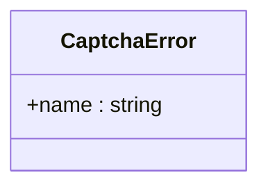
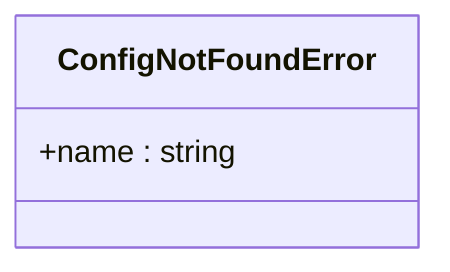
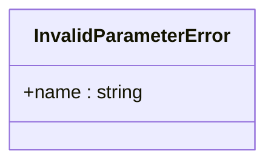
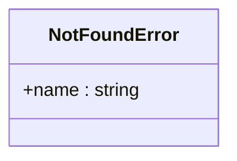
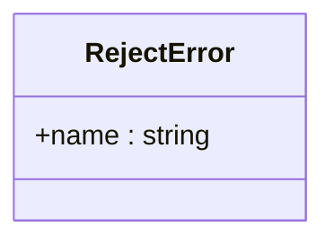
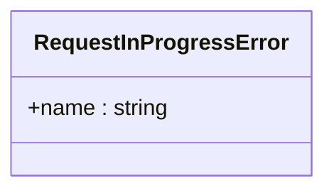
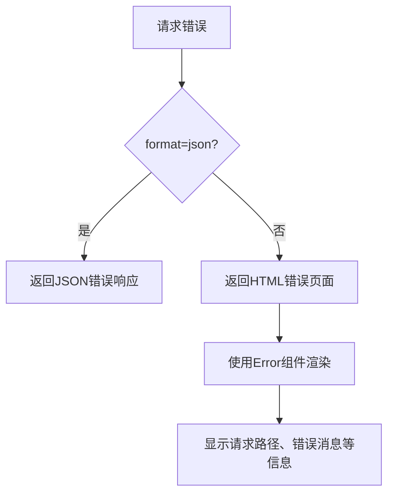

# 错误响应格式

<cite>
**本文档中引用的文件**   
- [errorHandler](file://lib/errors/index.tsx#L13-L82)
- [notFoundHandler](file://lib/errors/index.tsx#L82)
- [app-bootstrap.tsx](file://lib/app-bootstrap.tsx#L7)
- [config.ts](file://lib/config.ts)
- [template.tsx](file://lib/middleware/template.tsx)
- [404.html](file://assets/404.html)
- [captcha.ts](file://lib/errors/types/captcha.ts)
- [config-not-found.ts](file://lib/errors/types/config-not-found.ts)
- [invalid-parameter.ts](file://lib/errors/types/invalid-parameter.ts)
- [not-found.ts](file://lib/errors/types/not-found.ts)
- [reject.ts](file://lib/errors/types/reject.ts)
- [request-in-progress.ts](file://lib/errors/types/request-in-progress.ts)
</cite>

## 目录
1. [简介](#简介)
2. [错误响应结构](#错误响应结构)
3. [HTTP状态码映射](#http状态码映射)
4. [客户端类型响应格式](#客户端类型响应格式)
5. [错误类型定义](#错误类型定义)
6. [错误页面模板](#错误页面模板)
7. [实际错误响应示例](#实际错误响应示例)
8. [配置选项](#配置选项)

## 简介
RSSHub 是一个开源的 RSS 生成器，为各种网站和在线服务提供 RSS 订阅支持。当请求无法成功处理时，RSSHub 会返回标准化的错误响应，以帮助开发者和用户理解问题原因并采取相应措施。本文档详细介绍了 RSSHub 的错误响应格式，包括 JSON 结构、HTTP 状态码映射、不同客户端类型的响应格式以及如何自定义错误页面。

**Section sources**
- [errorHandler](file://lib/errors/index.tsx#L13-L82)
- [app-bootstrap.tsx](file://lib/app-bootstrap.tsx#L7)

## 错误响应结构
RSSHub 的错误响应根据客户端类型和请求参数返回不同的格式。核心错误响应结构包含以下字段：

- **error**: 错误对象，包含错误消息
  - **message**: 错误的具体描述信息

当请求包含 `format=json` 参数或运行在包模式下时，RSSHub 返回 JSON 格式的错误响应：
```json
{
  "error": {
    "message": "错误的具体描述"
  }
}
```

否则，RSSHub 返回 HTML 格式的错误页面，其中包含请求路径、错误消息、匹配的路由和 Node.js 版本信息。

**Section sources**
- [errorHandler](file://lib/errors/index.tsx#L73-L79)

## HTTP状态码映射
RSSHub 根据不同的错误类型设置相应的 HTTP 状态码，确保客户端能够正确理解错误性质：

- **503 Service Unavailable**: 用于以下错误类型
  - HTTPError
  - RequestError
  - FetchError
  - RequestInProgressError
  - 任何未明确处理的错误类型

- **403 Forbidden**: 用于 RejectError 错误类型

- **404 Not Found**: 用于 NotFoundError 错误类型

这些状态码的映射逻辑在 `errorHandler` 函数中通过 switch 语句实现，确保每种错误类型都能返回最合适的 HTTP 状态码。

**Section sources**
- [errorHandler](file://lib/errors/index.tsx#L47-L67)

## 客户端类型响应格式
RSSHub 能够根据客户端类型返回适当的错误格式，提供更好的用户体验和开发调试支持：

### API调用客户端
当检测到请求来自 API 调用（通过 `format=json` 参数）或运行在包模式下时，RSSHub 返回简洁的 JSON 格式错误响应。这种格式易于程序解析，适合自动化系统和开发者调试使用。

### 浏览器客户端
对于来自浏览器的请求，RSSHub 返回 HTML 格式的错误页面。这种格式提供了更友好的用户界面，包含详细的错误信息和上下文，帮助最终用户理解问题。

响应格式的选择逻辑由以下条件决定：
```typescript
return config.isPackage || ctx.req.query('format') === 'json'
```

**Section sources**
- [errorHandler](file://lib/errors/index.tsx#L73-L79)

## 错误类型定义
RSSHub 定义了多种特定的错误类型，每种类型都有其特定的用途和场景：

### CaptchaError
表示需要验证码才能继续操作的错误。当目标网站要求用户完成验证码验证时抛出此错误。



**Diagram sources**
- [captcha.ts](file://lib/errors/types/captcha.ts)

### ConfigNotFoundError
表示配置缺失的错误。当必要的配置项未提供或无效时抛出此错误。



**Diagram sources**
- [config-not-found.ts](file://lib/errors/types/config-not-found.ts)

### InvalidParameterError
表示参数无效的错误。当用户提供的参数不符合要求或格式不正确时抛出此错误。



**Diagram sources**
- [invalid-parameter.ts](file://lib/errors/types/invalid-parameter.ts)

### NotFoundError
表示资源未找到的错误。当请求的路由不存在或已被删除时抛出此错误。



**Diagram sources**
- [not-found.ts](file://lib/errors/types/not-found.ts)

### RejectError
表示请求被拒绝的错误。当请求因权限或其他策略原因被拒绝时抛出此错误。



**Diagram sources**
- [reject.ts](file://lib/errors/types/reject.ts)

### RequestInProgressError
表示请求正在进行中的错误。当同一请求正在处理中，为避免重复处理而返回此错误。



**Diagram sources**
- [request-in-progress.ts](file://lib/errors/types/request-in-progress.ts)

## 错误页面模板
RSSHub 提供了自定义错误页面的功能，允许部署者根据需要修改错误页面的外观和内容。错误页面模板位于 `assets` 目录下，主要文件包括：

- **404.html**: 自定义 404 错误页面，包含重定向到新文档站点的脚本
- **index.html**: 主页模板
- **CNAME**: 自定义域名配置

这些模板文件允许部署者自定义错误页面的样式、添加品牌信息或提供额外的帮助链接，从而提升用户体验。



**Diagram sources**
- [404.html](file://assets/404.html)
- [errorHandler](file://lib/errors/index.tsx#L79)

**Section sources**
- [404.html](file://assets/404.html)

## 实际错误响应示例
以下是几种常见错误情况的实际响应示例：

### 503 Service Unavailable (JSON格式)
```json
{
  "error": {
    "message": "HTTPError: Failed to fetch data from upstream service"
  }
}
```

### 404 Not Found (HTML格式)
浏览器将显示一个包含以下信息的 HTML 页面：
- 请求路径：/nonexistent/route
- 错误消息：NotFoundError: The route does not exist or has been deleted.
- 匹配的路由：/*
- Node.js 版本：v18.17.0

### 403 Forbidden (JSON格式)
```json
{
  "error": {
    "message": "RejectError: Access denied due to policy restrictions"
  }
}
```

这些示例展示了 RSSHub 如何根据错误类型和客户端需求返回适当的响应格式。

**Section sources**
- [errorHandler](file://lib/errors/index.tsx#L60-L62)
- [errorHandler](file://lib/errors/index.tsx#L57-L59)

## 配置选项
RSSHub 的错误处理行为可以通过配置文件进行定制，主要相关配置项包括：

- **NODE_ENV**: 决定是否在错误响应中包含堆栈跟踪信息。生产环境仅返回错误消息，开发环境返回完整堆栈
- **isPackage**: 决定是否始终返回 JSON 格式的错误响应
- **sentry.dsn**: 配置 Sentry 错误跟踪服务，用于收集和分析错误报告
- **debugInfo**: 启用调试信息收集，帮助分析错误发生频率和模式

这些配置选项允许部署者根据具体需求调整错误处理行为，平衡安全性、用户体验和调试便利性。

**Section sources**
- [config.ts](file://lib/config.ts)
- [errorHandler](file://lib/errors/index.tsx#L39-L44)
- [errorHandler](file://lib/errors/index.tsx#L46)