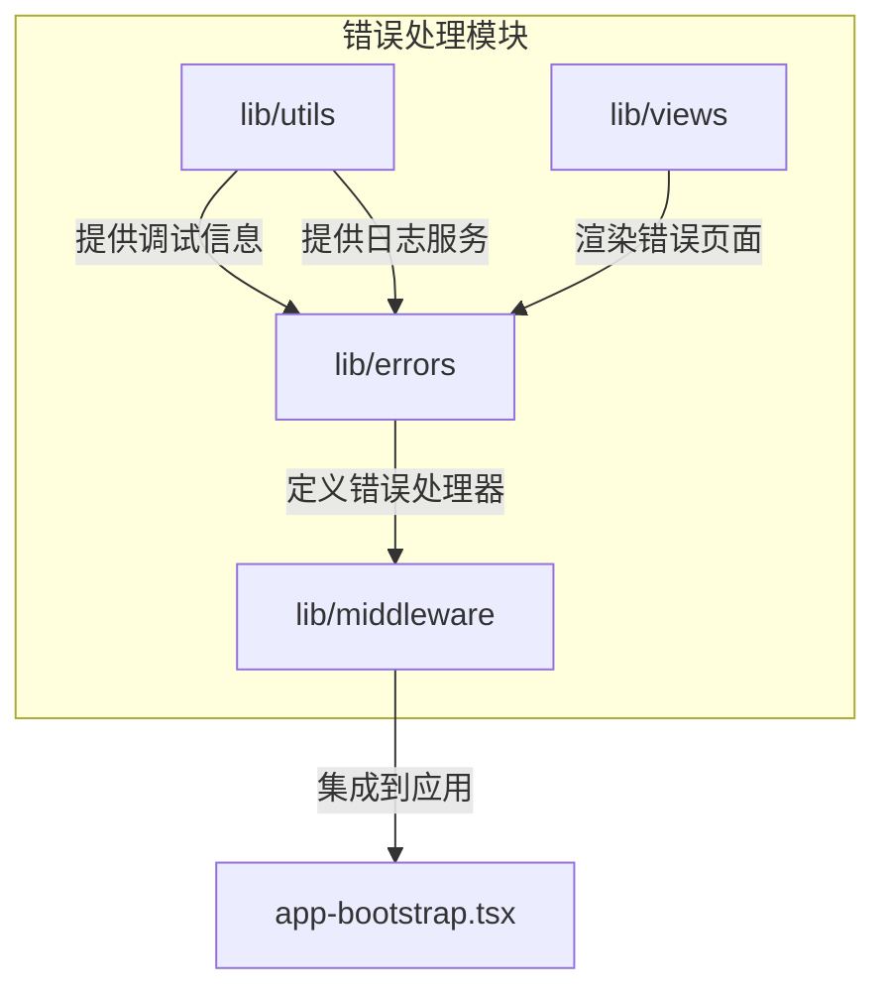
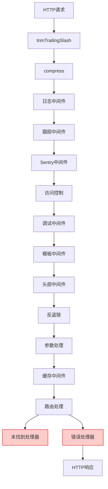
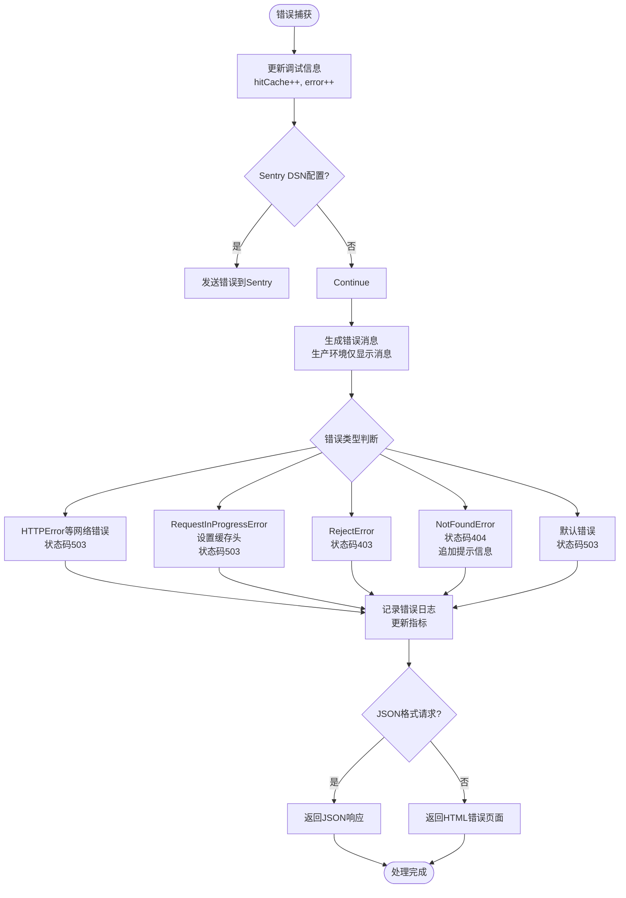
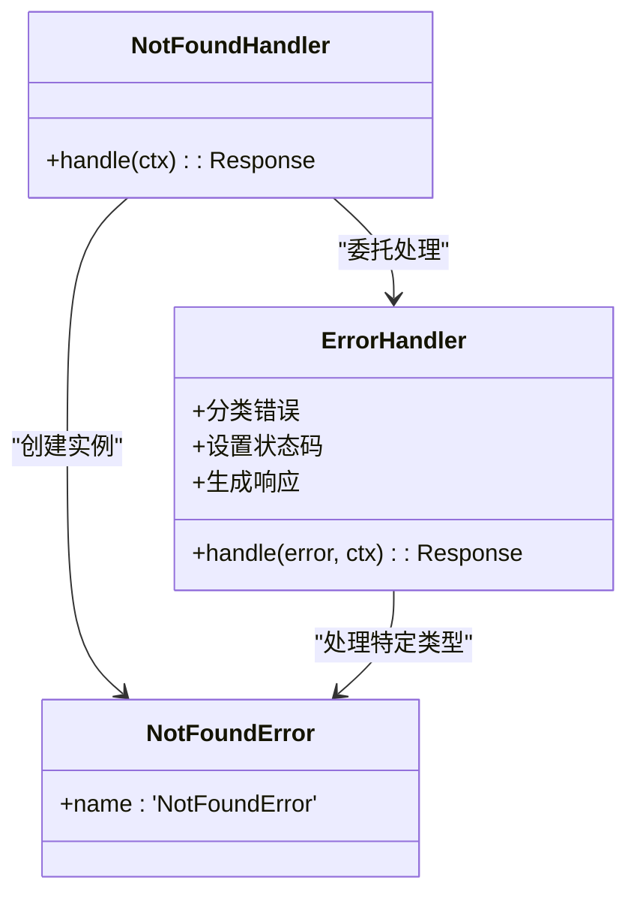
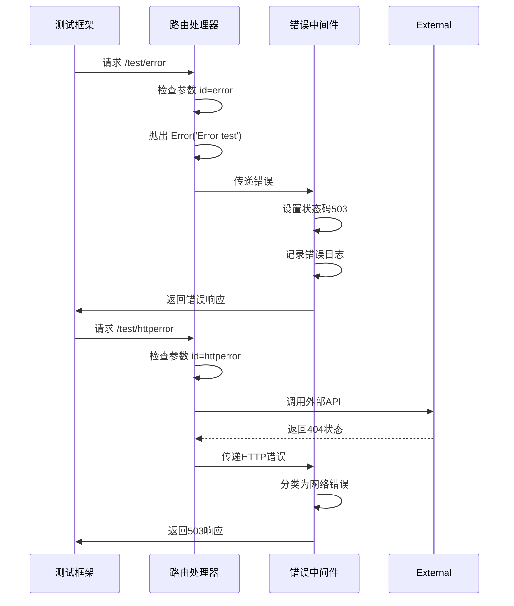
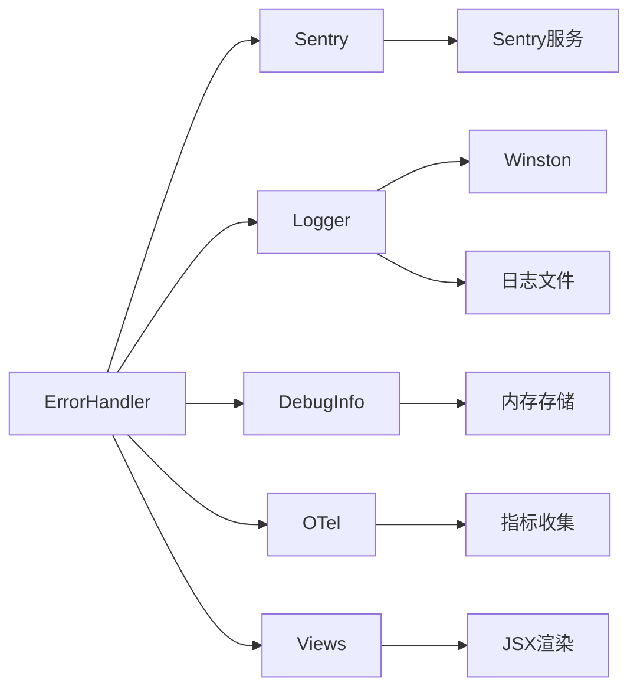

# 错误处理中间件

<cite>
**本文档引用的文件**   
- [app-bootstrap.tsx](file://lib/app-bootstrap.tsx)
- [errors/index.tsx](file://lib/errors/index.tsx)
- [middleware/sentry.ts](file://lib/middleware/sentry.ts)
- [middleware/logger.ts](file://lib/middleware/logger.ts)
- [middleware/trace.ts](file://lib/middleware/trace.ts)
- [utils/logger.ts](file://lib/utils/logger.ts)
- [utils/debug-info.ts](file://lib/utils/debug-info.ts)
- [views/error.tsx](file://lib/views/error.tsx)
- [routes/test/index.ts](file://lib/routes/test/index.ts)
- [types.ts](file://lib/types.ts)
</cite>

## 目录
1. [简介](#简介)
2. [项目结构](#项目结构)
3. [核心组件](#核心组件)
4. [架构概述](#架构概述)
5. [详细组件分析](#详细组件分析)
6. [依赖分析](#依赖分析)
7. [性能考虑](#性能考虑)
8. [故障排除指南](#故障排除指南)
9. [结论](#结论)

## 简介
本文档全面介绍RSSHub的错误处理中间件实现，详细说明其执行流程、与其他中间件的协作机制以及在请求处理管道中的位置。文档还提供自定义错误处理中间件的开发指南，并包含性能优化和最佳实践建议。

## 项目结构
RSSHub的错误处理系统分布在多个核心目录中，主要集中在`lib/errors`和`lib/middleware`目录下。错误处理逻辑与日志记录、监控和调试功能紧密集成。

**Diagram sources**
- [lib/errors/index.tsx](file://lib/errors/index.tsx#L1-L83)
- [lib/middleware/sentry.ts](file://lib/middleware/sentry.ts#L1-L29)

**Section sources**
- [lib/errors/index.tsx](file://lib/errors/index.tsx#L1-L83)
- [lib/middleware](file://lib/middleware)

## 核心组件
错误处理中间件的核心组件包括错误处理器、未找到处理器、Sentry集成、日志记录和调试信息收集。这些组件协同工作，确保错误被正确捕获、分类、记录和响应。

**Section sources**
- [lib/errors/index.tsx](file://lib/errors/index.tsx#L13-L82)
- [lib/middleware/sentry.ts](file://lib/middleware/sentry.ts#L17-L28)

## 架构概述
RSSHub的错误处理架构基于Hono框架的中间件机制，采用分层处理模式。错误处理位于请求处理管道的末端，确保所有中间件和路由处理器的错误都能被捕获。

**Diagram sources**
- [lib/app-bootstrap.tsx](file://lib/app-bootstrap.tsx#L25-L53)
- [lib/errors/index.tsx](file://lib/errors/index.tsx#L13-L82)

## 详细组件分析

### 错误处理器分析
错误处理器是RSSHub错误处理系统的核心，负责捕获、分类和响应各种错误类型。

**Diagram sources**
- [lib/errors/index.tsx](file://lib/errors/index.tsx#L13-L82)
- [lib/utils/debug-info.ts](file://lib/utils/debug-info.ts#L1-L25)

**Section sources**
- [lib/errors/index.tsx](file://lib/errors/index.tsx#L13-L82)
- [lib/utils/debug-info.ts](file://lib/utils/debug-info.ts#L1-L25)

### 未找到处理器分析
未找到处理器专门处理404错误，通过调用主错误处理器来保持一致的错误处理逻辑。

**Diagram sources**
- [lib/errors/index.tsx](file://lib/errors/index.tsx#L81-L82)
- [lib/errors/types/not-found.ts](file://lib/errors/types/not-found.ts#L1-L6)

**Section sources**
- [lib/errors/index.tsx](file://lib/errors/index.tsx#L81-L82)
- [lib/errors/types/not-found.ts](file://lib/errors/types/not-found.ts#L1-L6)

### 测试用例分析
RSSHub提供了详细的错误处理测试用例，验证各种错误场景的正确处理。

**Diagram sources**
- [lib/routes/test/index.ts](file://lib/routes/test/index.ts#L20-L42)
- [lib/errors/index.tsx](file://lib/errors/index.tsx#L48-L52)

**Section sources**
- [lib/routes/test/index.ts](file://lib/routes/test/index.ts#L20-L42)
- [lib/errors/index.tsx](file://lib/errors/index.tsx#L48-L52)

## 依赖分析
错误处理中间件依赖于多个核心组件和外部服务，形成完整的错误处理生态系统。

**Diagram sources**
- [lib/errors/index.tsx](file://lib/errors/index.tsx#L1-L82)
- [lib/utils/logger.ts](file://lib/utils/logger.ts#L1-L49)
- [lib/utils/debug-info.ts](file://lib/utils/debug-info.ts#L1-L25)

**Section sources**
- [lib/errors/index.tsx](file://lib/errors/index.tsx#L1-L82)
- [lib/utils/logger.ts](file://lib/utils/logger.ts#L1-L49)

## 性能考虑
错误处理中间件在设计时考虑了性能影响，采用异步模式和资源清理策略来最小化对正常请求处理的影响。

- **异步错误报告**：Sentry错误报告在响应发送后异步执行
- **条件初始化**：Sentry仅在配置了DSN时才初始化
- **内存效率**：调试信息存储在内存中，避免频繁的I/O操作
- **日志级别控制**：通过配置控制日志输出级别，减少不必要的日志记录
- **错误分类优化**：使用构造函数名称进行快速错误类型判断

**Section sources**
- [lib/middleware/sentry.ts](file://lib/middleware/sentry.ts#L8-L15)
- [lib/errors/index.tsx](file://lib/errors/index.tsx#L39-L44)

## 故障排除指南
当遇到错误处理相关问题时，可以按照以下步骤进行排查：

1. **检查Sentry配置**：确保`config.sentry.dsn`正确设置
2. **验证日志输出**：检查`logs/error.log`和`logs/combined.log`文件
3. **调试信息验证**：启用`config.debugInfo`查看详细的请求统计
4. **错误类型确认**：确保自定义错误类型正确继承Error类
5. **中间件顺序检查**：确认错误处理中间件在应用中的正确位置

**Section sources**
- [lib/errors/index.tsx](file://lib/errors/index.tsx#L13-L82)
- [lib/utils/logger.ts](file://lib/utils/logger.ts#L1-L49)

## 结论
RSSHub的错误处理中间件提供了一个健壮、可扩展的错误处理框架。通过集成Sentry监控、详细的日志记录和灵活的响应生成，系统能够有效地捕获、分类和响应各种错误情况。开发者可以基于现有架构轻松扩展或自定义错误处理行为，同时系统设计考虑了性能和资源使用效率。