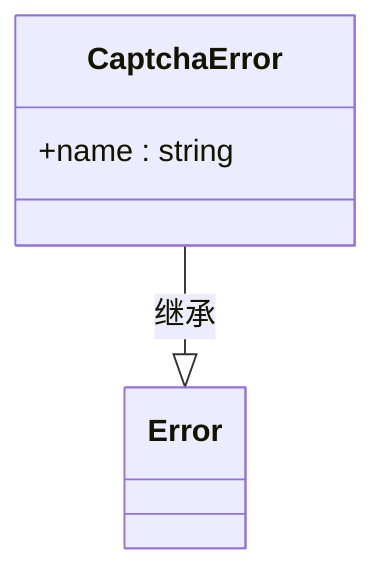
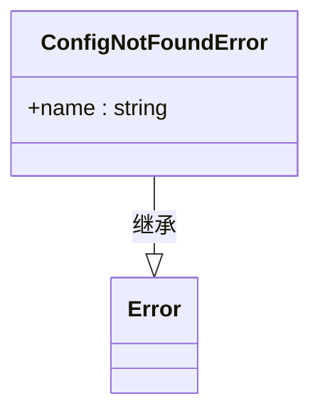
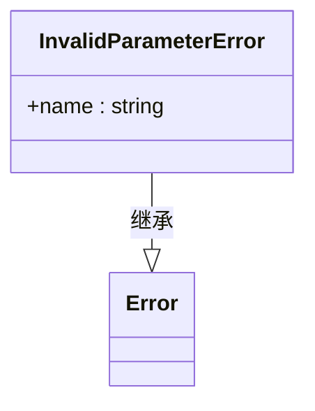
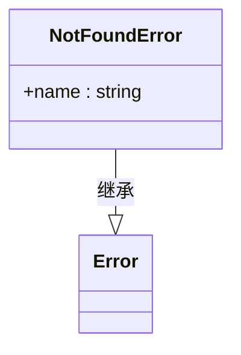
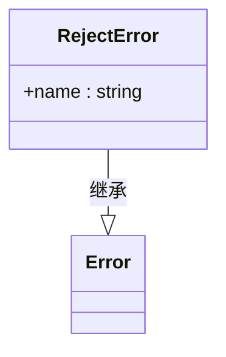
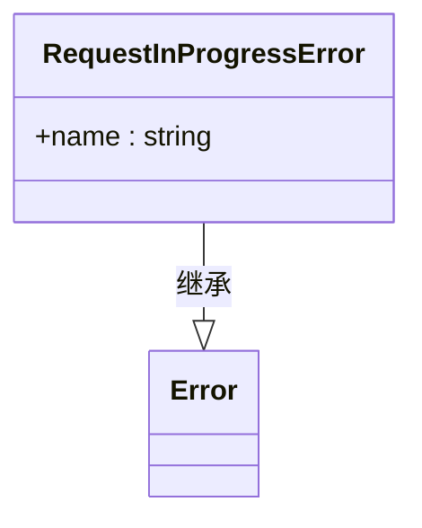
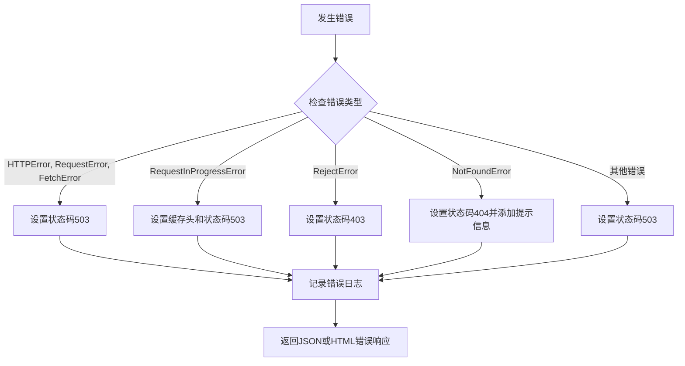
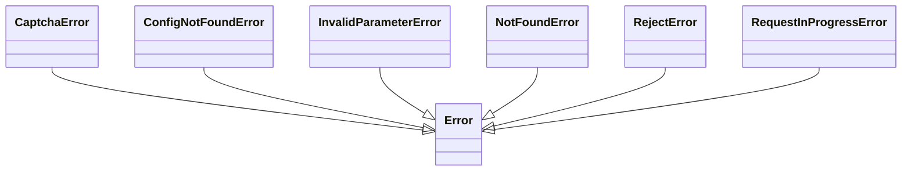
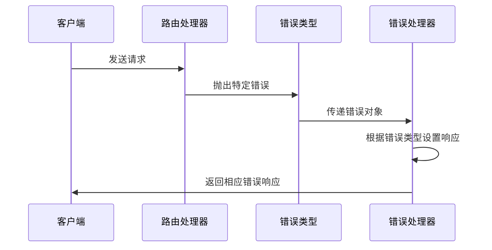

# 错误类型

<cite>
**本文档引用的文件**
- [lib/errors/index.tsx](file://lib/errors/index.tsx)
- [lib/errors/types/captcha.ts](file://lib/errors/types/captcha.ts)
- [lib/errors/types/config-not-found.ts](file://lib/errors/types/config-not-found.ts)
- [lib/errors/types/invalid-parameter.ts](file://lib/errors/types/invalid-parameter.ts)
- [lib/errors/types/not-found.ts](file://lib/errors/types/not-found.ts)
- [lib/errors/types/reject.ts](file://lib/errors/types/reject.ts)
- [lib/errors/types/request-in-progress.ts](file://lib/errors/types/request-in-progress.ts)
- [lib/routes/test/index.ts](file://lib/routes/test/index.ts)
- [lib/routes/discourse/utils.ts](file://lib/routes/discourse/utils.ts)
- [lib/routes/rsshub/transform/html.ts](file://lib/routes/rsshub/transform/html.ts)
- [lib/routes/rsshub/transform/json.ts](file://lib/routes/rsshub/transform/json.ts)
</cite>

## 目录
1. [简介](#简介)
2. [错误类型体系结构](#错误类型体系结构)
3. [核心错误类型分析](#核心错误类型分析)
4. [错误处理流程](#错误处理流程)
5. [错误类型继承关系](#错误类型继承关系)
6. [实际应用示例](#实际应用示例)
7. [错误响应策略](#错误响应策略)
8. [总结](#总结)

## 简介
RSSHub 是一个开源的 RSS 生成器，其错误处理系统设计精巧，能够有效应对各种运行时异常情况。本文档全面介绍 RSSHub 中定义的各种错误类型，包括验证码错误、配置未找到错误、参数无效错误、资源未找到错误、请求被拒绝错误和请求进行中错误等。通过深入分析每种错误类型的触发条件、业务场景和处理策略，帮助开发者理解 RSSHub 的错误处理架构。

## 错误类型体系结构
RSSHub 的错误类型系统位于 `lib/errors/types/` 目录下，采用模块化设计，每个错误类型都有独立的文件定义。所有自定义错误类都继承自 JavaScript 的原生 `Error` 类，通过设置 `name` 属性来标识具体的错误类型。

错误类型主要分为以下几类：
- **验证类错误**：如 CaptchaError，用于处理需要验证码验证的场景
- **配置类错误**：如 ConfigNotFoundError，表示缺少必要的配置信息
- **参数类错误**：如 InvalidParameterError，表示请求参数无效
- **资源类错误**：如 NotFoundError，表示请求的资源不存在
- **权限类错误**：如 RejectError，表示请求被拒绝
- **状态类错误**：如 RequestInProgressError，表示请求正在处理中

**Section sources**
- [lib/errors/types/captcha.ts](file://lib/errors/types/captcha.ts#L1-L6)
- [lib/errors/types/config-not-found.ts](file://lib/errors/types/config-not-found.ts#L1-L6)
- [lib/errors/types/invalid-parameter.ts](file://lib/errors/types/invalid-parameter.ts#L1-L6)
- [lib/errors/types/not-found.ts](file://lib/errors/types/not-found.ts#L1-L6)
- [lib/errors/types/reject.ts](file://lib/errors/types/reject.ts#L1-L6)
- [lib/errors/types/request-in-progress.ts](file://lib/errors/types/request-in-progress.ts#L1-L6)

## 核心错误类型分析

### 验证码错误 (CaptchaError)
验证码错误表示请求需要通过验证码验证才能继续。这种错误通常出现在目标网站启用了反爬虫机制的场景中。

**Diagram sources**
- [lib/errors/types/captcha.ts](file://lib/errors/types/captcha.ts#L1-L6)

**Section sources**
- [lib/errors/types/captcha.ts](file://lib/errors/types/captcha.ts#L1-L6)
- [lib/routes/test/index.ts](file://lib/routes/test/index.ts#L36-L38)

### 配置未找到错误 (ConfigNotFoundError)
配置未找到错误表示系统缺少必要的配置信息，无法完成请求处理。这种错误常见于需要特定环境变量或配置项的功能模块。

**Diagram sources**
- [lib/errors/types/config-not-found.ts](file://lib/errors/types/config-not-found.ts#L1-L6)

**Section sources**
- [lib/errors/types/config-not-found.ts](file://lib/errors/types/config-not-found.ts#L1-L6)
- [lib/routes/discourse/utils.ts](file://lib/routes/discourse/utils.ts#L4-L8)
- [lib/routes/rsshub/transform/html.ts](file://lib/routes/rsshub/transform/html.ts#L62-L64)
- [lib/routes/rsshub/transform/json.ts](file://lib/routes/rsshub/transform/json.ts#L75-L77)

### 参数无效错误 (InvalidParameterError)
参数无效错误表示用户提供的请求参数不符合预期格式或要求。这种错误用于确保输入数据的有效性和安全性。

**Diagram sources**
- [lib/errors/types/invalid-parameter.ts](file://lib/errors/types/invalid-parameter.ts#L1-L6)

**Section sources**
- [lib/errors/types/invalid-parameter.ts](file://lib/errors/types/invalid-parameter.ts#L1-L6)
- [lib/routes/test/index.ts](file://lib/routes/test/index.ts#L33-L35)

### 资源未找到错误 (NotFoundError)
资源未找到错误表示请求的路由或资源不存在。这是最常见的 HTTP 404 错误的实现。

**Diagram sources**
- [lib/errors/types/not-found.ts](file://lib/errors/types/not-found.ts#L1-L6)

**Section sources**
- [lib/errors/types/not-found.ts](file://lib/errors/types/not-found.ts#L1-L6)
- [lib/errors/index.tsx](file://lib/errors/index.tsx#L11-L12)
- [lib/errors/index.tsx](file://lib/errors/index.tsx#L60-L62)

### 请求被拒绝错误 (RejectError)
请求被拒绝错误表示请求由于权限或其他策略原因被拒绝执行。通常对应 HTTP 403 状态码。

**Diagram sources**
- [lib/errors/types/reject.ts](file://lib/errors/types/reject.ts#L1-L6)

**Section sources**
- [lib/errors/types/reject.ts](file://lib/errors/types/reject.ts#L1-L6)
- [lib/errors/index.tsx](file://lib/errors/index.tsx#L57-L59)

### 请求进行中错误 (RequestInProgressError)
请求进行中错误表示相同的请求已经在处理中，为了避免重复处理而抛出此错误。系统会设置适当的缓存头信息。

**Diagram sources**
- [lib/errors/types/request-in-progress.ts](file://lib/errors/types/request-in-progress.ts#L1-L6)

**Section sources**
- [lib/errors/types/request-in-progress.ts](file://lib/errors/types/request-in-progress.ts#L1-L6)
- [lib/errors/index.tsx](file://lib/errors/index.tsx#L53-L56)

## 错误处理流程
RSSHub 的错误处理主要通过 `errorHandler` 函数实现，该函数作为中间件捕获和处理所有异常。处理流程如下：

**Diagram sources**
- [lib/errors/index.tsx](file://lib/errors/index.tsx#L13-L82)

**Section sources**
- [lib/errors/index.tsx](file://lib/errors/index.tsx#L13-L82)

## 错误类型继承关系
所有自定义错误类型都继承自 JavaScript 的原生 `Error` 类，形成清晰的继承体系：

**Diagram sources**
- [lib/errors/types/captcha.ts](file://lib/errors/types/captcha.ts#L1-L3)
- [lib/errors/types/config-not-found.ts](file://lib/errors/types/config-not-found.ts#L1-L3)
- [lib/errors/types/invalid-parameter.ts](file://lib/errors/types/invalid-parameter.ts#L1-L3)
- [lib/errors/types/not-found.ts](file://lib/errors/types/not-found.ts#L1-L3)
- [lib/errors/types/reject.ts](file://lib/errors/types/reject.ts#L1-L3)
- [lib/errors/types/request-in-progress.ts](file://lib/errors/types/request-in-progress.ts#L1-L3)

## 实际应用示例
以下是各种错误类型在实际代码中的使用示例：

**Diagram sources**
- [lib/routes/test/index.ts](file://lib/routes/test/index.ts#L30-L38)
- [lib/errors/index.tsx](file://lib/errors/index.tsx#L47-L67)

**Section sources**
- [lib/routes/test/index.ts](file://lib/routes/test/index.ts#L30-L38)
- [lib/routes/discourse/utils.ts](file://lib/routes/discourse/utils.ts#L4-L8)
- [lib/routes/rsshub/transform/html.ts](file://lib/routes/rsshub/transform/html.ts#L62-L64)

## 错误响应策略
RSSHub 根据不同的错误类型采取相应的响应策略：

| 错误类型 | HTTP状态码 | 特殊处理 |
|---------|----------|---------|
| CaptchaError | 503 | 无特殊处理 |
| ConfigNotFoundError | 503 | 无特殊处理 |
| InvalidParameterError | 503 | 无特殊处理 |
| NotFoundError | 404 | 添加"路由不存在或已被删除"提示 |
| RejectError | 403 | 无特殊处理 |
| RequestInProgressError | 503 | 设置缓存头，缓存时间为请求超时时间 |

**Section sources**
- [lib/errors/index.tsx](file://lib/errors/index.tsx#L47-L67)

## 总结
RSSHub 的错误处理系统设计合理，通过定义清晰的错误类型体系，能够准确地反映各种异常情况。每个错误类型都有明确的业务场景和处理策略，便于开发者理解和维护。错误处理流程统一，通过中间件方式捕获和处理所有异常，确保了系统的稳定性和可靠性。开发者在扩展功能时，可以参考现有的错误类型模式，定义适合自己业务场景的错误类型。