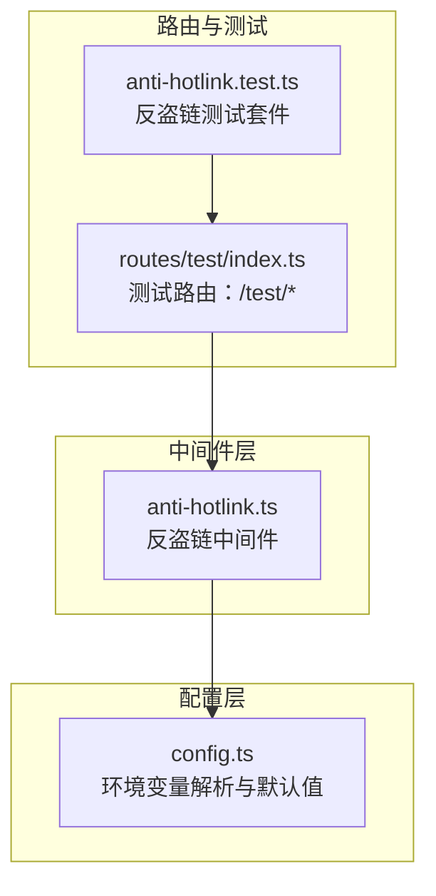
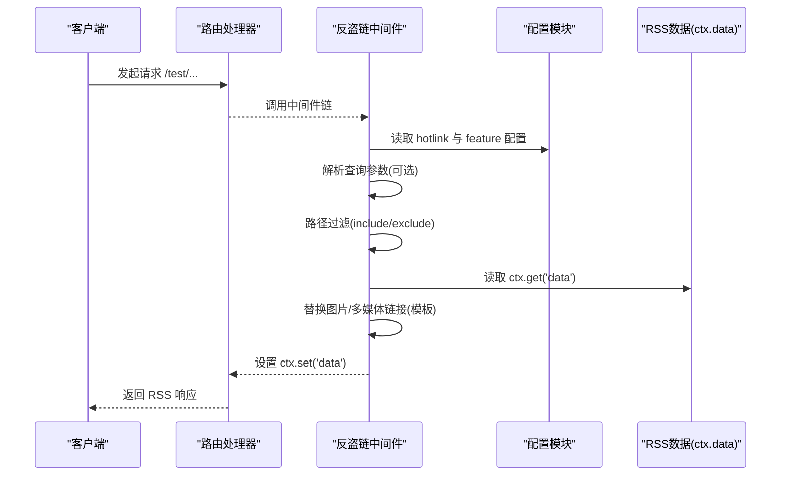
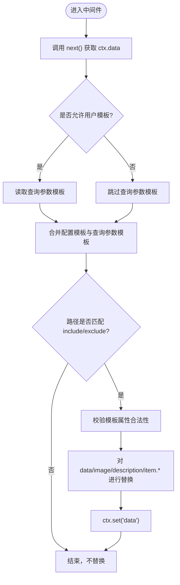
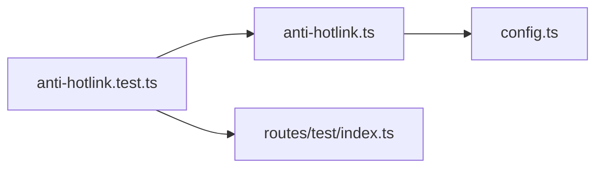

# 反盗链保护

<cite>
**本文引用的文件**
- [anti-hotlink.ts](file://lib/middleware/anti-hotlink.ts)
- [anti-hotlink.test.ts](file://lib/middleware/anti-hotlink.test.ts)
- [config.ts](file://lib/config.ts)
- [index.ts](file://lib/routes/test/index.ts)
</cite>

## 目录
1. [简介](#简介)
2. [项目结构](#项目结构)
3. [核心组件](#核心组件)
4. [架构总览](#架构总览)
5. [详细组件分析](#详细组件分析)
6. [依赖关系分析](#依赖关系分析)
7. [性能考量](#性能考量)
8. [故障排查指南](#故障排查指南)
9. [结论](#结论)
10. [附录：配置与使用示例](#附录配置与使用示例)

## 简介
本文件系统性解析 RSSHub 的“反盗链保护”能力，重点围绕 lib/middleware/anti-hotlink.ts 的实现机制展开，涵盖以下方面：
- 反盗链的核心思路：通过模板替换将外部媒体资源链接重定向到自有中继服务，从而避免其他站点直接嵌入源站图片/音视频资源，降低带宽消耗与版权风险。
- Referer 检查与来源域名验证：当前实现不基于 HTTP Referer 头进行拦截，而是通过路径白/黑名单与模板策略进行条件性替换。
- 请求拦截策略：在中间件阶段对 RSS 数据中的图片与多媒体链接进行统一替换，不改变原始抓取行为，仅影响最终输出。
- 配置项说明：HOTLINK_TEMPLATE、HOTLINK_INCLUDE_PATHS、HOTLINK_EXCLUDE_PATHS、ALLOW_USER_HOTLINK_TEMPLATE 等环境变量的作用与设置方式。
- 实际配置示例：针对不同内容源给出建议的反盗链策略。
- 误伤与用户体验：如何平衡防盗链与合法用户的访问体验，并提供规避方案。

## 项目结构
反盗链功能位于中间件层，属于 RSSHub 的通用处理流程的一部分。其与配置模块、路由测试共同构成完整的验证闭环。

图表来源
- [anti-hotlink.ts](file://lib/middleware/anti-hotlink.ts#L1-L171)
- [config.ts](file://lib/config.ts#L780-L795)
- [index.ts](file://lib/routes/test/index.ts#L1-L426)
- [anti-hotlink.test.ts](file://lib/middleware/anti-hotlink.test.ts#L1-L441)

章节来源
- [anti-hotlink.ts](file://lib/middleware/anti-hotlink.ts#L1-L171)
- [config.ts](file://lib/config.ts#L780-L795)
- [index.ts](file://lib/routes/test/index.ts#L1-L426)
- [anti-hotlink.test.ts](file://lib/middleware/anti-hotlink.test.ts#L1-L441)

## 核心组件
- 反盗链中间件（anti-hotlink.ts）：负责在响应生成后对 RSS 数据中的图片与多媒体链接进行模板替换；支持路径白/黑名单过滤与用户查询参数注入。
- 配置模块（config.ts）：解析 HOTLINK_TEMPLATE、HOTLINK_INCLUDE_PATHS、HOTLINK_EXCLUDE_PATHS、ALLOW_USER_HOTLINK_TEMPLATE 等环境变量，并将其注入运行时配置。
- 测试路由（routes/test/index.ts）：提供 /test/complicated 与 /test/multimedia 等测试场景，用于验证反盗链替换效果。
- 反盗链测试（anti-hotlink.test.ts）：通过 Vitest 对不同模板、路径过滤与用户参数注入的行为进行端到端验证。

章节来源
- [anti-hotlink.ts](file://lib/middleware/anti-hotlink.ts#L1-L171)
- [config.ts](file://lib/config.ts#L780-L795)
- [index.ts](file://lib/routes/test/index.ts#L152-L233)
- [anti-hotlink.test.ts](file://lib/middleware/anti-hotlink.test.ts#L337-L440)

## 架构总览
反盗链中间件在路由处理完成后执行，从上下文中读取 RSS 数据，按配置与查询参数决定是否对图片与多媒体链接进行替换，最终写回上下文，供后续模板渲染使用。

图表来源
- [anti-hotlink.ts](file://lib/middleware/anti-hotlink.ts#L102-L168)
- [config.ts](file://lib/config.ts#L780-L795)
- [index.ts](file://lib/routes/test/index.ts#L152-L233)

## 详细组件分析

### 反盗链中间件实现要点
- 路径过滤：根据 includePaths 与 excludePaths 判断是否对该路径启用替换逻辑。
- 模板校验：仅允许特定 URL 属性占位符，防止注入非法属性。
- 链接替换范围：
  - 图片类：img、picture > source、video[poster]、*[data-rsshub-image="href"] 等。
  - 多媒体类：video、video > source、audio、audio > source，以及 video[poster]。
- 数据对象覆盖点：对 data.image、data.description、data.item[].description、enclosure_url、item.image、item.itunes_item_image 等进行替换。
- 用户参数注入：当 ALLOW_USER_HOTLINK_TEMPLATE 开启时，可通过查询参数 image_hotlink_template 与 multimedia_hotlink_template 注入模板，优先级低于配置模板。

图表来源
- [anti-hotlink.ts](file://lib/middleware/anti-hotlink.ts#L102-L168)

章节来源
- [anti-hotlink.ts](file://lib/middleware/anti-hotlink.ts#L1-L171)

### 配置项与环境变量
- HOTLINK_TEMPLATE：全局反盗链模板，用于替换图片与多媒体链接。例如 https://i3.wp.com/${host}${pathname} 或 https://images.weserv.nl?url=${href_ue}。
- HOTLINK_INCLUDE_PATHS：逗号分隔的路径前缀列表，仅对匹配路径启用替换。
- HOTLINK_EXCLUDE_PATHS：逗号分隔的路径前缀列表，对匹配路径禁用替换。
- ALLOW_USER_HOTLINK_TEMPLATE：是否允许通过查询参数注入模板（存在安全风险，仅限个人使用场景）。

章节来源
- [config.ts](file://lib/config.ts#L780-L795)
- [anti-hotlink.test.ts](file://lib/middleware/anti-hotlink.test.ts#L337-L440)

### 测试用例与行为验证
- 模板优先级：配置模板优先于查询参数模板；当配置为空时，若未开启用户模板注入，则不替换。
- 路径过滤：部分匹配与完全匹配均受 include/exclude 影响；两者同时存在时，先 include 再 exclude 生效。
- URL 编码模板：支持 ${href_ue} 对完整 URL 进行编码，便于第三方中继服务处理。
- 错误处理：模板中出现不允许的 URL 属性会抛出错误。

章节来源
- [anti-hotlink.test.ts](file://lib/middleware/anti-hotlink.test.ts#L337-L440)
- [index.ts](file://lib/routes/test/index.ts#L152-L233)

### 与测试路由的关系
- /test/complicated：包含多处图片链接与混合场景，用于验证图片替换与多媒体替换。
- /test/multimedia：包含 video/audio/poster 等多媒体元素，用于验证多媒体替换策略。

章节来源
- [index.ts](file://lib/routes/test/index.ts#L152-L233)

## 依赖关系分析
- 中间件依赖配置模块提供的 hotlink 与 feature 配置。
- 测试依赖测试路由与 RSS 解析器，验证替换前后输出差异。
- 路由测试依赖应用实例发起请求并解析 RSS 输出。

图表来源
- [anti-hotlink.ts](file://lib/middleware/anti-hotlink.ts#L1-L171)
- [config.ts](file://lib/config.ts#L780-L795)
- [anti-hotlink.test.ts](file://lib/middleware/anti-hotlink.test.ts#L1-L441)
- [index.ts](file://lib/routes/test/index.ts#L1-L426)

章节来源
- [anti-hotlink.ts](file://lib/middleware/anti-hotlink.ts#L1-L171)
- [config.ts](file://lib/config.ts#L780-L795)
- [anti-hotlink.test.ts](file://lib/middleware/anti-hotlink.test.ts#L1-L441)
- [index.ts](file://lib/routes/test/index.ts#L1-L426)

## 性能考量
- 模板替换发生在响应生成后，对 CPU 有一定开销，尤其在大量图片/多媒体的情况下。建议：
  - 仅对必要路径启用替换（合理设置 includePaths/excludePaths）。
  - 使用轻量模板（如直接拼接 host/path），避免过度复杂的 URL 编码与第三方服务调用。
  - 控制 RSS 输出规模，减少不必要的 item 数量与超大图片资源。

[本节为通用指导，无需具体文件来源]

## 故障排查指南
- 模板属性无效导致报错：确保模板只使用允许的 URL 属性（如 protocol/host/pathname 等），避免注入非法属性。
- 未生效或误生效：
  - 检查是否正确设置了 includePaths/excludePaths，确认路径匹配规则。
  - 若开启了 ALLOW_USER_HOTLINK_TEMPLATE，请注意仅在个人使用场景下使用，避免被他人滥用。
- 第三方中继服务不可用：
  - 更换模板或关闭模板，回退到原始链接。
  - 确认网络连通性与第三方服务可用性。

章节来源
- [anti-hotlink.ts](file://lib/middleware/anti-hotlink.ts#L90-L100)
- [anti-hotlink.test.ts](file://lib/middleware/anti-hotlink.test.ts#L434-L440)

## 结论
RSSHub 的反盗链保护并非基于 HTTP Referer 的严格拦截，而是通过“模板替换”的方式将外部媒体资源链接重定向至自有中继服务，从而降低源站资源被直接嵌入的风险。该策略简单有效、可控性强，且与 RSSHub 的中间件体系无缝集成。结合路径过滤与用户模板注入开关，可在保证防盗链的同时兼顾灵活性与安全性。

[本节为总结，无需具体文件来源]

## 附录：配置与使用示例

### 环境变量与默认值
- HOTLINK_TEMPLATE：全局替换模板（可为空）
- HOTLINK_INCLUDE_PATHS：路径白名单（可为空）
- HOTLINK_EXCLUDE_PATHS：路径黑名单（可为空）
- ALLOW_USER_HOTLINK_TEMPLATE：是否允许用户通过查询参数注入模板（布尔）

章节来源
- [config.ts](file://lib/config.ts#L780-L795)

### 实际配置示例（面向不同内容源）
- 通用图片中继（推荐）：将图片链接替换为自有中继服务，如 https://i3.wp.com/${host}${pathname}。
- URL 编码中继：适用于第三方服务（如 images.weserv.nl），模板形如 https://images.weserv.nl?url=${href_ue}。
- 仅对特定路径启用：设置 HOTLINK_INCLUDE_PATHS=/feed,/rss；或排除某些路径 HOTLINK_EXCLUDE_PATHS=/admin,/private。
- 个人使用场景：开启 ALLOW_USER_HOTLINK_TEMPLATE，并在个人订阅链接中传入 image_hotlink_template 与 multimedia_hotlink_template 参数，以满足个性化需求。

章节来源
- [anti-hotlink.test.ts](file://lib/middleware/anti-hotlink.test.ts#L337-L440)
- [config.ts](file://lib/config.ts#L780-L795)

### 如何验证配置生效
- 使用测试路由：
  - /test/complicated：验证图片替换与多媒体替换。
  - /test/multimedia：验证 video/audio/poster 替换。
- 通过查询参数注入模板（需开启 ALLOW_USER_HOTLINK_TEMPLATE）：
  - image_hotlink_template=https://i3.wp.com/${host}${pathname}
  - multimedia_hotlink_template=https://i3.wp.com/${host}${pathname}

章节来源
- [index.ts](file://lib/routes/test/index.ts#L152-L233)
- [anti-hotlink.test.ts](file://lib/middleware/anti-hotlink.test.ts#L337-L440)

### 可能误伤合法用户与解决方案
- 误伤场景：
  - 仅对特定路径启用替换，但 include/exclude 规则不当导致不应替换的路径被替换。
  - 用户模板注入被滥用，导致链接被替换到不受信任的服务。
- 解决方案：
  - 明确 includePaths/excludePaths，尽量精确匹配业务路径。
  - 默认关闭 ALLOW_USER_HOTLINK_TEMPLATE，仅在个人使用场景下开启。
  - 对第三方中继服务进行健康检查与降级策略，避免因服务异常影响正常访问。

章节来源
- [anti-hotlink.ts](file://lib/middleware/anti-hotlink.ts#L102-L168)
- [anti-hotlink.test.ts](file://lib/middleware/anti-hotlink.test.ts#L337-L440)