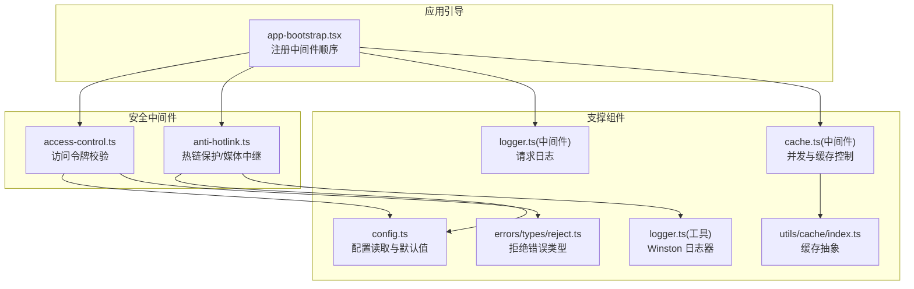
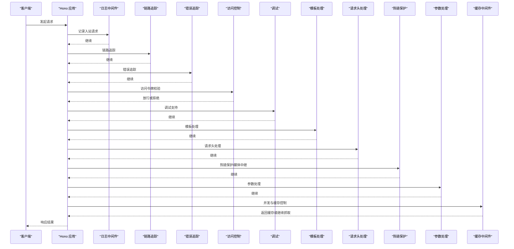
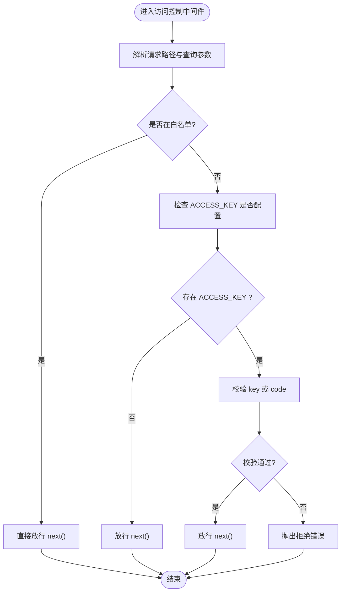
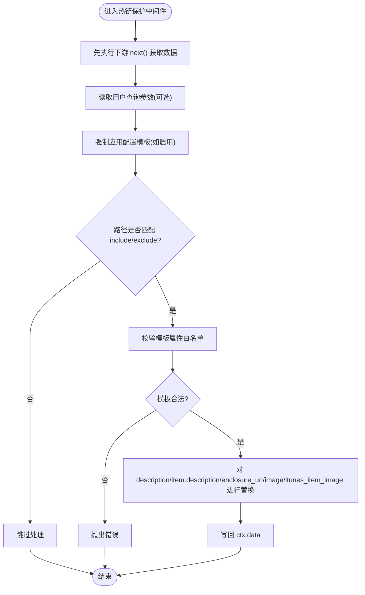
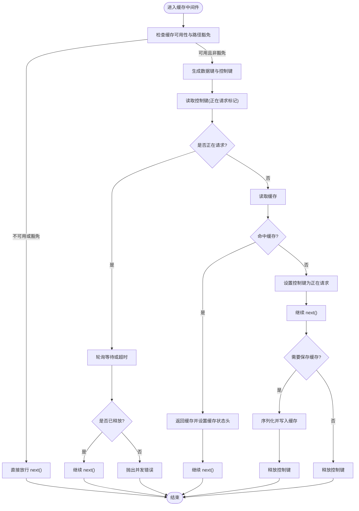
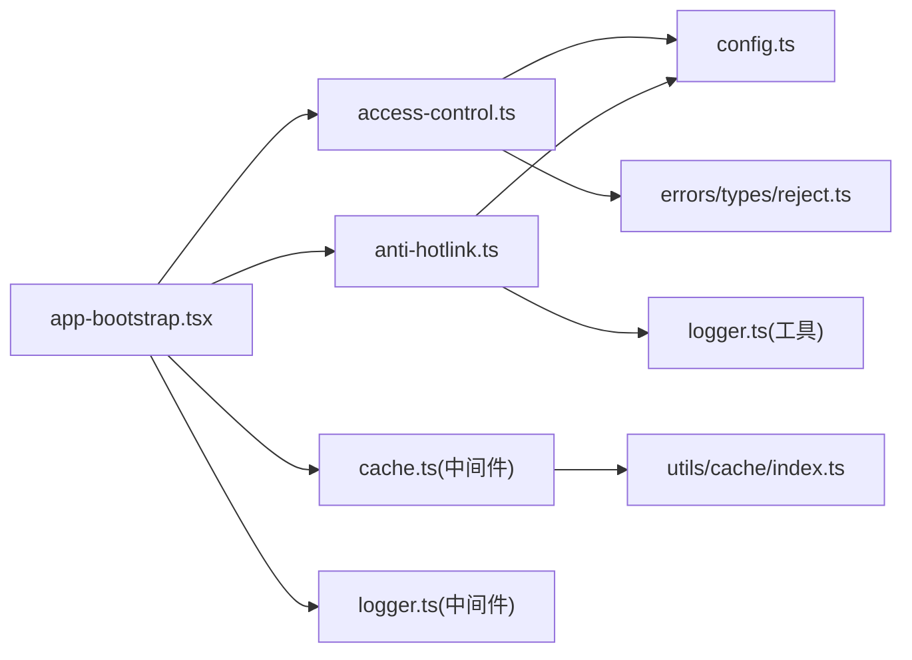

# 安全控制

<cite>
**本文引用的文件列表**
- [access-control.ts](file://lib/middleware/access-control.ts)
- [anti-hotlink.ts](file://lib/middleware/anti-hotlink.ts)
- [logger.ts（中间件）](file://lib/middleware/logger.ts)
- [logger.ts（工具）](file://lib/utils/logger.ts)
- [config.ts](file://lib/config.ts)
- [cache.ts（中间件）](file://lib/middleware/cache.ts)
- [index.ts（缓存工具）](file://lib/utils/cache/index.ts)
- [reject.ts（错误类型）](file://lib/errors/types/reject.ts)
- [app-bootstrap.tsx](file://lib/app-bootstrap.tsx)
- [access-control.test.ts](file://lib/middleware/access-control.test.ts)
- [anti-hotlink.test.ts](file://lib/middleware/anti-hotlink.test.ts)
- [pnpm-lock.yaml](file://pnpm-lock.yaml)
</cite>

## 目录
1. [简介](#简介)
2. [项目结构](#项目结构)
3. [核心组件](#核心组件)
4. [架构总览](#架构总览)
5. [组件详解](#组件详解)
6. [依赖关系分析](#依赖关系分析)
7. [性能考量](#性能考量)
8. [故障排查指南](#故障排查指南)
9. [结论](#结论)
10. [附录：配置与最佳实践](#附录配置与最佳实践)

## 简介
本文件聚焦 RSSHub 的安全控制模块，系统性解析访问控制中间件的实现机制与集成方式，覆盖访问令牌验证、路径白名单豁免、热链保护与媒体 URL 中继、以及与缓存系统、日志系统的协同工作模式。文档同时给出配置项说明、使用方法、典型场景的最佳实践，并讨论安全措施对系统性能的影响。

## 项目结构
安全控制相关代码主要分布在以下位置：
- 中间件层：访问控制、热链保护、缓存、日志等中间件
- 配置层：环境变量到运行时配置的映射与默认值
- 工具层：通用日志、缓存抽象与错误类型
- 应用引导层：中间件注册顺序与路由挂载

图表来源
- [app-bootstrap.tsx](file://lib/app-bootstrap.tsx#L27-L45)
- [access-control.ts](file://lib/middleware/access-control.ts#L1-L26)
- [anti-hotlink.ts](file://lib/middleware/anti-hotlink.ts#L1-L171)
- [logger.ts（中间件）](file://lib/middleware/logger.ts#L1-L46)
- [logger.ts（工具）](file://lib/utils/logger.ts#L1-L49)
- [cache.ts（中间件）](file://lib/middleware/cache.ts#L1-L84)
- [index.ts（缓存工具）](file://lib/utils/cache/index.ts#L1-L101)
- [reject.ts（错误类型）](file://lib/errors/types/reject.ts#L1-L6)

章节来源
- [app-bootstrap.tsx](file://lib/app-bootstrap.tsx#L27-L45)

## 核心组件
- 访问控制中间件：基于查询参数进行访问令牌验证，支持路径白名单豁免。
- 热链保护中间件：对 RSS 描述中的图片与音视频链接进行模板化替换或中继，支持包含/排除路径过滤与用户自定义模板。
- 缓存中间件：通过全局控制键避免同一路径的并发重复抓取，结合缓存命中返回，提升稳定性与性能。
- 日志中间件与工具：统一记录请求入站/出站信息与耗时，支持 OpenTelemetry 指标上报。
- 配置系统：集中读取环境变量，提供默认值与类型转换，暴露给各中间件使用。

章节来源
- [access-control.ts](file://lib/middleware/access-control.ts#L1-L26)
- [anti-hotlink.ts](file://lib/middleware/anti-hotlink.ts#L1-L171)
- [cache.ts（中间件）](file://lib/middleware/cache.ts#L1-L84)
- [logger.ts（中间件）](file://lib/middleware/logger.ts#L1-L46)
- [logger.ts（工具）](file://lib/utils/logger.ts#L1-L49)
- [config.ts](file://lib/config.ts#L290-L318)

## 架构总览
安全控制在请求处理流程中的位置如下：

图表来源
- [app-bootstrap.tsx](file://lib/app-bootstrap.tsx#L27-L45)
- [logger.ts（中间件）](file://lib/middleware/logger.ts#L1-L46)
- [access-control.ts](file://lib/middleware/access-control.ts#L1-L26)
- [anti-hotlink.ts](file://lib/middleware/anti-hotlink.ts#L1-L171)
- [cache.ts（中间件）](file://lib/middleware/cache.ts#L1-L84)

## 组件详解

### 访问控制中间件
- 功能要点
  - 路径白名单豁免：根路径、robots.txt、favicon.ico、logo.png 直接放行。
  - 访问令牌验证：当配置了 ACCESS_KEY 时，要求请求携带 key 或 code；若两者均不满足则拒绝。
  - 令牌生成规则：code 为 md5(path + ACCESS_KEY)，用于一次性授权。
- 处理流程
  - 解析请求路径与查询参数。
  - 若在白名单内直接放行。
  - 否则检查 ACCESS_KEY 是否存在且满足 key 或 code 条件。
  - 任一条件不满足即抛出拒绝错误类型，交由错误处理器处理。
- 关键实现参考
  - [访问控制中间件](file://lib/middleware/access-control.ts#L1-L26)
  - [拒绝错误类型](file://lib/errors/types/reject.ts#L1-L6)
  - [配置项 ACCESS_KEY](file://lib/config.ts#L767-L769)

图表来源
- [access-control.ts](file://lib/middleware/access-control.ts#L1-L26)
- [reject.ts（错误类型）](file://lib/errors/types/reject.ts#L1-L6)

章节来源
- [access-control.ts](file://lib/middleware/access-control.ts#L1-L26)
- [reject.ts（错误类型）](file://lib/errors/types/reject.ts#L1-L6)
- [config.ts](file://lib/config.ts#L767-L769)
- [access-control.test.ts](file://lib/middleware/access-control.test.ts#L1-L48)

### 热链保护中间件
- 功能要点
  - 路径过滤：支持 includePaths/excludePaths，仅对匹配路径生效。
  - 模板替换：支持配置模板与用户自定义模板两种来源，优先级与冲突处理明确。
  - URL 属性白名单：仅允许特定 URL 属性参与模板渲染，防止注入风险。
  - 内容处理：对 description、item.description、enclosure_url、image、itunes_item_image 等字段进行替换。
- 处理流程
  - 先执行下游路由，拿到数据后进行处理。
  - 读取用户查询参数（可选），并强制应用配置模板（如启用）。
  - 校验模板合法性，再对 HTML 内容与媒体链接进行替换。
  - 将处理后的数据写回上下文。
- 关键实现参考
  - [热链保护中间件](file://lib/middleware/anti-hotlink.ts#L1-L171)
  - [配置项 hotlink 与 feature](file://lib/config.ts#L785-L795)

图表来源
- [anti-hotlink.ts](file://lib/middleware/anti-hotlink.ts#L102-L168)
- [config.ts](file://lib/config.ts#L785-L795)

章节来源
- [anti-hotlink.ts](file://lib/middleware/anti-hotlink.ts#L1-L171)
- [config.ts](file://lib/config.ts#L785-L795)
- [anti-hotlink.test.ts](file://lib/middleware/anti-hotlink.test.ts#L1-L440)

### 缓存中间件与并发控制
- 功能要点
  - 并发去重：通过“正在请求”的控制键避免同一路径的并发重复抓取，超时后自动释放。
  - 缓存命中：命中则直接返回缓存数据并设置缓存状态头。
  - 控制键与数据键：使用哈希算法生成稳定键名，区分 format、limit 等参数维度。
  - 异常处理：异常时释放控制键，避免死锁。
- 关键实现参考
  - [缓存中间件](file://lib/middleware/cache.ts#L1-L84)
  - [缓存工具抽象](file://lib/utils/cache/index.ts#L1-L101)

图表来源
- [cache.ts（中间件）](file://lib/middleware/cache.ts#L1-L84)
- [index.ts（缓存工具）](file://lib/utils/cache/index.ts#L1-L101)

章节来源
- [cache.ts（中间件）](file://lib/middleware/cache.ts#L1-L84)
- [index.ts（缓存工具）](file://lib/utils/cache/index.ts#L1-L101)

### 日志与监控
- 中间件日志：记录入站/出站请求、状态码与耗时，便于审计与排障。
- 工具日志：基于 Winston 输出到文件与控制台，支持时间戳与级别控制。
- 指标上报：OpenTelemetry 指标记录请求成功耗时，辅助性能分析。

章节来源
- [logger.ts（中间件）](file://lib/middleware/logger.ts#L1-L46)
- [logger.ts（工具）](file://lib/utils/logger.ts#L1-L49)

## 依赖关系分析
- 中间件注册顺序
  - 日志、链路追踪、错误追踪、访问控制、调试、模板、请求头、热链保护、参数处理、缓存。
- 外部依赖
  - 缓存模块：支持内存与 Redis，未启用时会输出警告提示并发限制失效。
  - 模板校验：对 URL 模板属性进行白名单校验，防止任意属性注入。
  - 测试覆盖：访问控制与热链保护均有单元测试，覆盖关键分支与边界情况。

图表来源
- [app-bootstrap.tsx](file://lib/app-bootstrap.tsx#L27-L45)
- [access-control.ts](file://lib/middleware/access-control.ts#L1-L26)
- [anti-hotlink.ts](file://lib/middleware/anti-hotlink.ts#L1-L171)
- [cache.ts（中间件）](file://lib/middleware/cache.ts#L1-L84)
- [index.ts（缓存工具）](file://lib/utils/cache/index.ts#L1-L101)
- [reject.ts（错误类型）](file://lib/errors/types/reject.ts#L1-L6)

章节来源
- [app-bootstrap.tsx](file://lib/app-bootstrap.tsx#L27-L45)
- [pnpm-lock.yaml](file://pnpm-lock.yaml#L5234-L5242)

## 性能考量
- 并发控制
  - 通过“正在请求”控制键避免同一路径的重复抓取，减少上游服务压力与资源浪费。
  - 缓存未命中时设置控制键并在完成后释放，确保后续请求能正确命中缓存。
- 缓存类型选择
  - Redis 提供分布式一致性与高并发能力；内存缓存适合单实例部署，但不具备跨进程共享。
  - 未启用缓存时会输出警告，提示并发限制失效，可能引发雪崩效应。
- 日志与指标
  - 中间件日志与 OpenTelemetry 指标有助于定位热点路径与慢请求，指导优化。
- 热链保护开销
  - 对 HTML 内容进行解析与替换会带来 CPU 开销，建议仅对必要路径启用，或使用更高效的模板策略。

[本节为通用性能讨论，不直接分析具体文件]

## 故障排查指南
- 访问被拒绝
  - 确认 ACCESS_KEY 是否正确配置，key 与 code 是否匹配规则。
  - 检查路径是否在白名单内，白名单路径不会触发访问控制。
  - 参考测试用例以验证行为。
- 热链保护异常
  - 检查模板属性是否在白名单内，非法属性会被拒绝。
  - 确认 includePaths/excludePaths 配置是否正确，避免路径误判。
  - 查看日志输出，确认中间件是否对目标路径生效。
- 并发请求问题
  - 观察是否存在大量并发请求导致的“正在请求”状态长时间占用。
  - 检查缓存类型与超时配置，确保控制键能及时释放。
- 日志与指标
  - 中间件日志记录入站/出站与耗时，便于快速定位问题。
  - OpenTelemetry 指标可用于统计成功率与耗时分布。

章节来源
- [access-control.test.ts](file://lib/middleware/access-control.test.ts#L1-L48)
- [anti-hotlink.test.ts](file://lib/middleware/anti-hotlink.test.ts#L1-L440)
- [logger.ts（中间件）](file://lib/middleware/logger.ts#L1-L46)
- [logger.ts（工具）](file://lib/utils/logger.ts#L1-L49)

## 结论
RSSHub 的安全控制模块通过访问令牌与热链保护两大中间件，配合缓存与日志体系，在保证安全性的同时兼顾性能与可观测性。合理的配置与中间件顺序是发挥其作用的关键。建议在生产环境中启用缓存、严格控制热链模板属性、合理规划路径过滤策略，并结合日志与指标持续优化。

[本节为总结性内容，不直接分析具体文件]

## 附录：配置与最佳实践

### 配置项说明
- 访问控制
  - ACCESS_KEY：访问令牌密钥，开启访问控制时必填。
- 热链保护
  - HOTLINK_TEMPLATE：全局媒体 URL 替换模板。
  - HOTLINK_INCLUDE_PATHS/HOTLINK_EXCLUDE_PATHS：路径包含/排除列表，支持子路径匹配。
  - ALLOW_USER_HOTLINK_TEMPLATE：是否允许用户通过查询参数传入自定义模板。
- 缓存
  - CACHE_TYPE：缓存类型（memory/redis），空字符串可禁用缓存。
  - CACHE_EXPIRE/CACHE_CONTENT_EXPIRE：路由缓存与不变内容缓存过期时间。
  - REDIS_URL：Redis 连接地址。
- 日志与监控
  - LOGGER_LEVEL：日志级别。
  - OTEL_SECONDS_BUCKET/OTEL_MILLISECONDS_BUCKET：OpenTelemetry 指标桶配置。
  - SENTRY：Sentry DSN 与路由超时阈值。

章节来源
- [config.ts](file://lib/config.ts#L1-L800)

### 使用方法与最佳实践
- 访问令牌验证
  - 在生产环境启用 ACCESS_KEY，并通过 key 或 code 授权。
  - 对于公开接口可保留白名单路径（如根路径、robots.txt）以便搜索引擎抓取。
  - 建议定期轮换 ACCESS_KEY，并在变更后同步更新所有调用方。
- 热链保护
  - 优先使用配置模板，避免用户自定义模板带来的风险。
  - 仅对包含媒体内容的路径启用，避免对纯文本路径造成不必要的解析开销。
  - 合理设置 includePaths/excludePaths，确保只对目标路径生效。
- 并发与缓存
  - 生产环境建议使用 Redis 缓存，提升并发稳定性。
  - 合理设置 CACHE_EXPIRE 与 REQUEST_TIMEOUT，平衡新鲜度与性能。
- 日志与监控
  - 开启中间件日志与 OpenTelemetry 指标，建立告警与审计机制。
  - 对敏感路径与高并发路径进行重点监控。

[本节为通用实践建议，不直接分析具体文件]