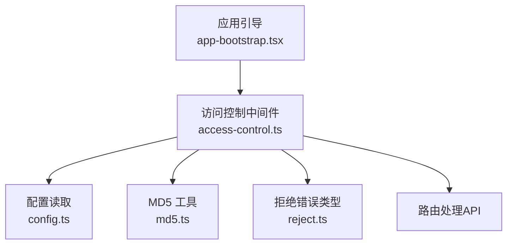
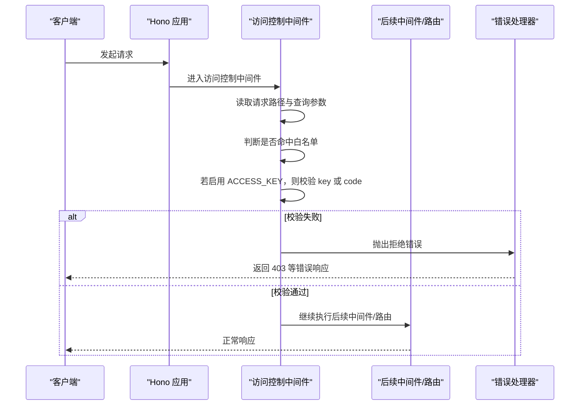
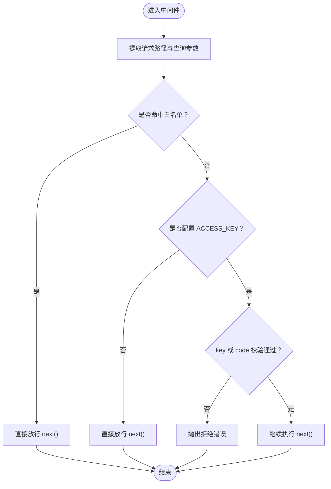
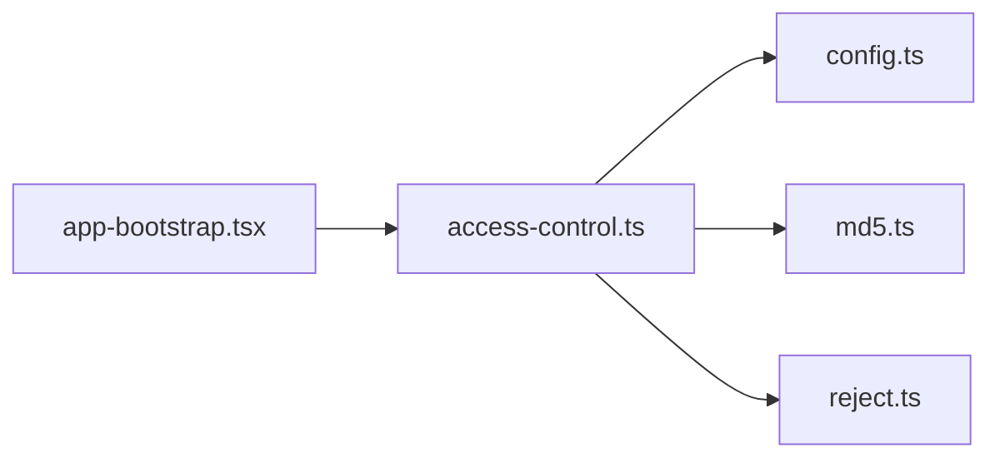

# 访问控制

<cite>
**本文引用的文件**
- [access-control.ts](file://lib/middleware/access-control.ts)
- [access-control.test.ts](file://lib/middleware/access-control.test.ts)
- [app-bootstrap.tsx](file://lib/app-bootstrap.tsx)
- [config.ts](file://lib/config.ts)
- [reject.ts](file://lib/errors/types/reject.ts)
- [md5.ts](file://lib/utils/md5.ts)
- [CLAUDE.md（中间件系统）](file://lib/middleware/CLAUDE.md)
</cite>

## 目录
1. [简介](#简介)
2. [项目结构](#项目结构)
3. [核心组件](#核心组件)
4. [架构总览](#架构总览)
5. [详细组件分析](#详细组件分析)
6. [依赖关系分析](#依赖关系分析)
7. [性能考量](#性能考量)
8. [故障排查指南](#故障排查指南)
9. [结论](#结论)
10. [附录](#附录)

## 简介
本文件聚焦 RSSHub 的访问控制中间件，系统性解析 access-control.ts 的实现机制与运行时行为，涵盖：
- 访问令牌验证流程：key 与 code 两种方式
- 请求来源与路径白名单策略
- 在请求处理管道中的位置与执行顺序
- 与配置系统、错误处理及测试用例的协作
- 安全性影响与性能开销评估
- 实际部署场景下的配置示例与最佳实践

需要特别说明的是：当前仓库中的访问控制中间件仅实现了基于查询参数的访问令牌校验，并未实现 IP 白名单/黑名单功能；文档中关于 ALLOWED_IP、FORBIDDEN_IP 的描述与现有代码不一致，将在“附录”中给出澄清与替代方案建议。

## 项目结构
访问控制中间件位于 lib/middleware 目录，作为 Hono 应用的一环参与请求处理管道。其主要职责是在路由处理前进行访问控制检查，确保非公开资源的访问安全。

图表来源
- [app-bootstrap.tsx](file://lib/app-bootstrap.tsx#L25-L54)
- [access-control.ts](file://lib/middleware/access-control.ts#L1-L27)
- [config.ts](file://lib/config.ts#L760-L770)
- [md5.ts](file://lib/utils/md5.ts#L1-L6)
- [reject.ts](file://lib/errors/types/reject.ts#L1-L6)

章节来源
- [app-bootstrap.tsx](file://lib/app-bootstrap.tsx#L25-L54)
- [access-control.ts](file://lib/middleware/access-control.ts#L1-L27)
- [config.ts](file://lib/config.ts#L760-L770)

## 核心组件
- 访问控制中间件：负责拦截请求，根据配置与查询参数决定放行或拒绝
- 配置系统：从环境变量 ACCESS_KEY 读取密钥
- MD5 工具：生成基于路径与密钥的签名
- 拒绝错误类型：统一抛出拒绝错误，交由全局错误处理器处理

章节来源
- [access-control.ts](file://lib/middleware/access-control.ts#L1-L27)
- [config.ts](file://lib/config.ts#L760-L770)
- [md5.ts](file://lib/utils/md5.ts#L1-L6)
- [reject.ts](file://lib/errors/types/reject.ts#L1-L6)

## 架构总览
访问控制中间件在应用引导阶段被注册到 Hono 应用中，位于日志、追踪、Sentry 之后，调试、模板、头部、热链保护之前。该顺序确保：
- 先完成基础可观测性与安全基础设施
- 再进行访问控制与后续处理

图表来源
- [app-bootstrap.tsx](file://lib/app-bootstrap.tsx#L25-L54)
- [access-control.ts](file://lib/middleware/access-control.ts#L11-L24)
- [reject.ts](file://lib/errors/types/reject.ts#L1-L6)

章节来源
- [app-bootstrap.tsx](file://lib/app-bootstrap.tsx#L25-L54)
- [access-control.ts](file://lib/middleware/access-control.ts#L11-L24)

## 详细组件分析

### 访问控制中间件实现要点
- 路径白名单：对根路径、robots.txt、favicon.ico、logo.png 等静态资源路径直接放行
- 密钥校验：当配置了 ACCESS_KEY 时，允许两种方式之一通过：
  - 查询参数 key 等于 ACCESS_KEY
  - 查询参数 code 等于 md5(请求路径 + ACCESS_KEY)
- 拒绝处理：校验失败时抛出 RejectError，由全局错误处理器转换为 403 等错误响应

图表来源
- [access-control.ts](file://lib/middleware/access-control.ts#L11-L24)
- [md5.ts](file://lib/utils/md5.ts#L1-L6)
- [reject.ts](file://lib/errors/types/reject.ts#L1-L6)

章节来源
- [access-control.ts](file://lib/middleware/access-control.ts#L11-L24)
- [md5.ts](file://lib/utils/md5.ts#L1-L6)
- [reject.ts](file://lib/errors/types/reject.ts#L1-L6)

### 配置与环境变量
- ACCESS_KEY：用于启用访问令牌校验。若未设置，则跳过校验
- 配置读取：中间件从 config.accessKey 获取 ACCESS_KEY

章节来源
- [config.ts](file://lib/config.ts#L760-L770)
- [access-control.ts](file://lib/middleware/access-control.ts#L11-L24)

### 测试用例与行为验证
- 白名单路径：根路径与部分静态资源可直接访问
- 无密钥：未设置 ACCESS_KEY 时，所有受控路径均可访问
- 错误密钥：key 或 code 错误时返回 403 并包含“Access denied”
- 正确密钥：key 或 code 正确时放行

章节来源
- [access-control.test.ts](file://lib/middleware/access-control.test.ts#L1-L49)

### 与应用引导的集成
- 中间件注册顺序：mLogger → trace → sentry → accessControl → debug → template → header → antiHotlink → parameter → cache
- 访问控制位于调试与模板之前，确保在业务处理前完成鉴权

章节来源
- [app-bootstrap.tsx](file://lib/app-bootstrap.tsx#L25-L54)

### 与错误处理的协作
- 拒绝错误类型：统一使用 RejectError，便于全局错误处理器识别与处理
- 错误响应：由全局错误处理器转换为标准错误响应（如 403）

章节来源
- [reject.ts](file://lib/errors/types/reject.ts#L1-L6)

## 依赖关系分析
- 访问控制中间件依赖：
  - 配置系统：读取 ACCESS_KEY
  - MD5 工具：生成签名
  - 拒绝错误类型：统一异常
- 在应用引导中，访问控制中间件处于中间件链的固定位置，与后续中间件存在明确的先后关系

图表来源
- [access-control.ts](file://lib/middleware/access-control.ts#L1-L27)
- [config.ts](file://lib/config.ts#L760-L770)
- [md5.ts](file://lib/utils/md5.ts#L1-L6)
- [reject.ts](file://lib/errors/types/reject.ts#L1-L6)
- [app-bootstrap.tsx](file://lib/app-bootstrap.tsx#L25-L54)

章节来源
- [access-control.ts](file://lib/middleware/access-control.ts#L1-L27)
- [app-bootstrap.tsx](file://lib/app-bootstrap.tsx#L25-L54)

## 性能考量
- 计算成本：每次受控请求都会计算一次 md5，CPU 开销极低，通常可忽略
- I/O 成本：中间件本身无显著 I/O 操作
- 可扩展性：若未来引入 IP 白名单/黑名单，需考虑正则匹配或集合查找的复杂度
- 建议：在高并发场景下，优先保证密钥长度合理且避免频繁变更 ACCESS_KEY

[本节为通用性能讨论，无需特定文件来源]

## 故障排查指南
- 403 拒绝但确认密钥正确
  - 检查是否正确传入 key 或 code
  - 确认请求路径与生成签名时使用的路径一致（大小写、编码）
- 静态资源仍被拒绝
  - 当前实现仅对特定静态路径放行，其他静态资源会走访问控制
- 本地开发与生产差异
  - 确认 ACCESS_KEY 环境变量在目标环境中已正确加载
- 单元测试参考
  - 参考测试用例对 key/code 场景的覆盖，定位问题范围

章节来源
- [access-control.test.ts](file://lib/middleware/access-control.test.ts#L1-L49)

## 结论
RSSHub 的访问控制中间件提供了简单而有效的访问令牌校验能力，通过 ACCESS_KEY 与查询参数 key/code 的组合，能够在请求进入业务路由前快速拦截未授权访问。当前实现未包含 IP 白名单/黑名单功能，若需更细粒度的访问控制，可在现有中间件基础上扩展或采用反向代理层策略。

[本节为总结性内容，无需特定文件来源]

## 附录

### 关于 ALLOWED_IP、FORBIDDEN_IP 的澄清
- 现有访问控制中间件并未实现 IP 白名单/黑名单功能
- 文档中关于 ALLOWED_IP、FORBIDDEN_IP 的描述与当前代码不一致
- 替代方案建议：
  - 在反向代理层（如 Nginx、Cloudflare WAF）配置 IP 访问控制
  - 在应用层新增独立的 IP 中间件，结合内存或 Redis 存储白名单/黑名单
  - 使用网关或 API 网关的访问控制策略

[本节为概念性补充，无需特定文件来源]

### 配置示例与部署建议
- 开发环境
  - 不设置 ACCESS_KEY，便于本地调试
- 生产环境
  - 设置 ACCESS_KEY，并通过 key 或 code 方式调用受控接口
  - 对外暴露的静态资源路径保持白名单策略不变
- 安全最佳实践
  - 使用强随机 ACCESS_KEY
  - 定期轮换 ACCESS_KEY
  - 限制 key 的使用范围与有效期（可通过服务端生成带时效的 code）
  - 将访问控制置于反向代理之后，结合 TLS 与速率限制

[本节为通用实践建议，无需特定文件来源]