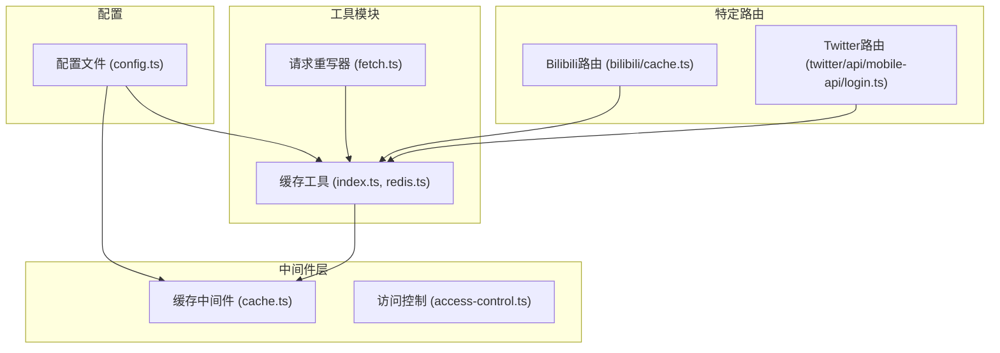
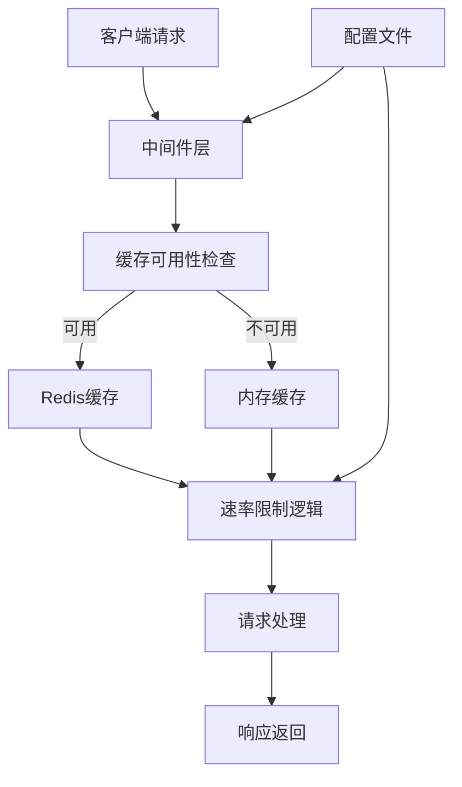
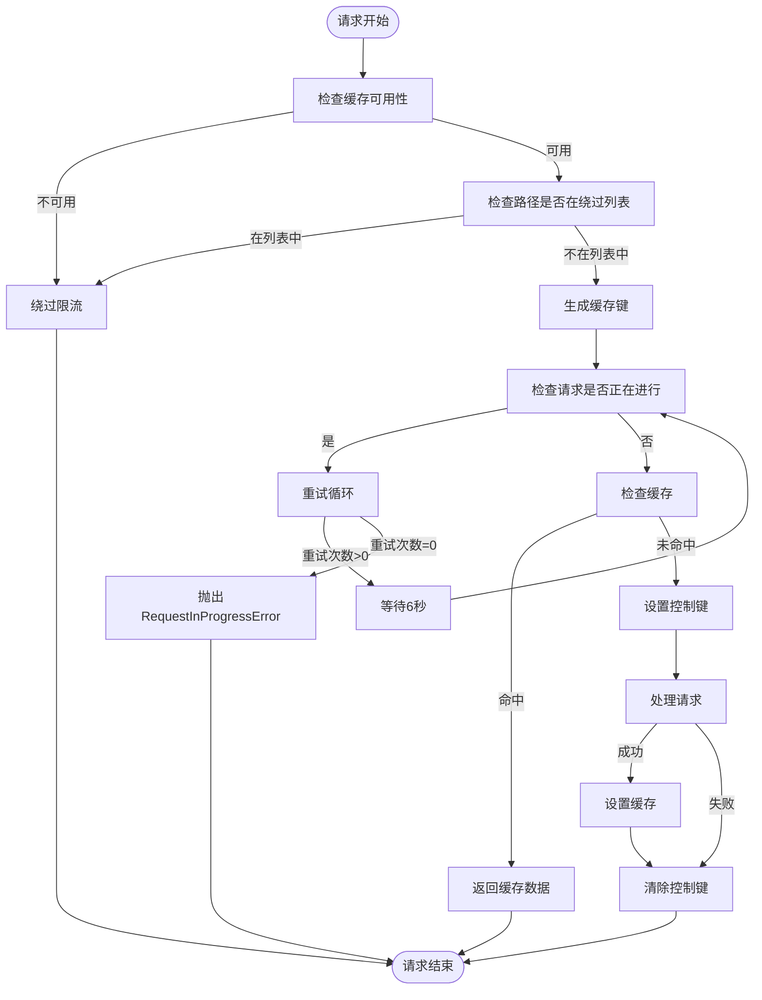
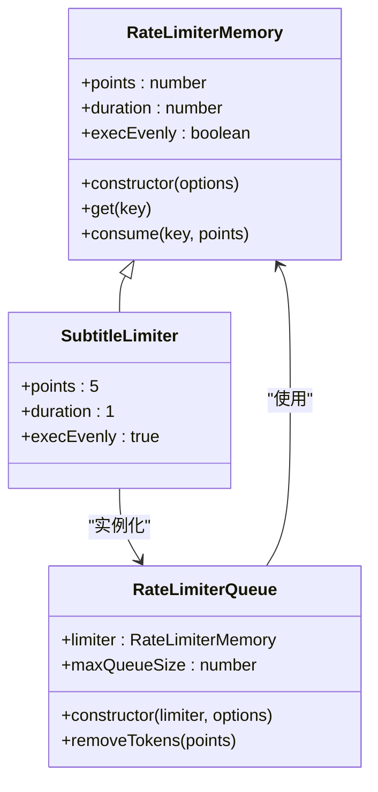
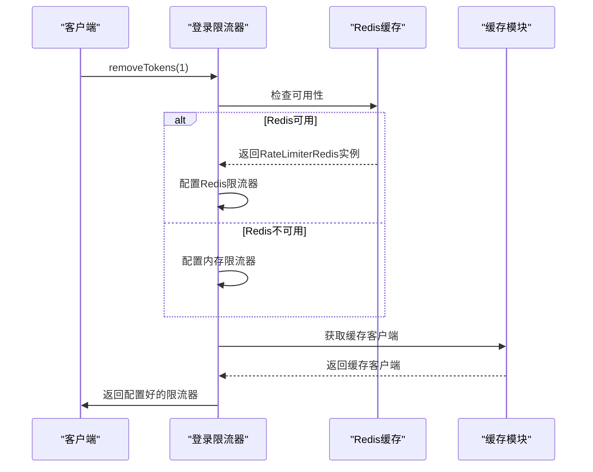
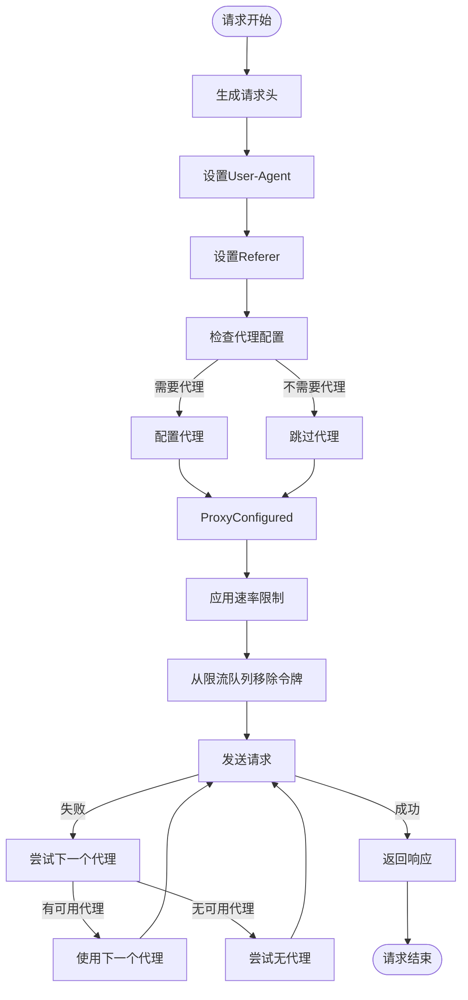
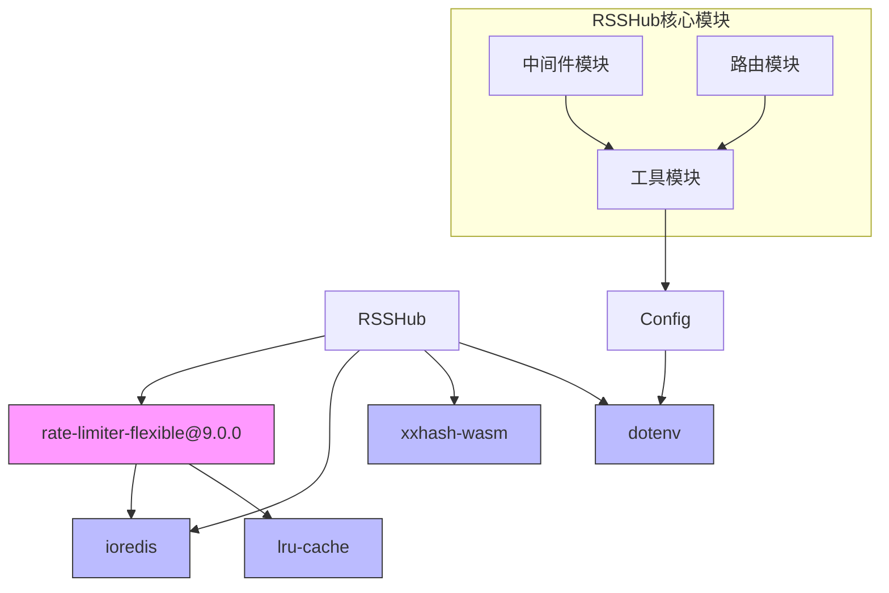

# 请求频率限制

<cite>
**本文档引用的文件**
- [cache.ts](file://lib/middleware/cache.ts)
- [config.ts](file://lib/config.ts)
- [index.ts](file://lib/utils/cache/index.ts)
- [redis.ts](file://lib/utils/cache/redis.ts)
- [bilibili/cache.ts](file://lib/routes/bilibili/cache.ts)
- [twitter/api/mobile-api/login.ts](file://lib/routes/twitter/api/mobile-api/login.ts)
- [twitter/api/web-api/login.ts](file://lib/routes/twitter/api/web-api/login.ts)
- [request-rewriter/fetch.ts](file://lib/utils/request-rewriter/fetch.ts)
- [app-bootstrap.tsx](file://lib/app-bootstrap.tsx)
</cite>

## 目录
1. [引言](#引言)
2. [项目结构](#项目结构)
3. [核心组件](#核心组件)
4. [架构概述](#架构概述)
5. [详细组件分析](#详细组件分析)
6. [依赖分析](#依赖分析)
7. [性能考虑](#性能考虑)
8. [故障排除指南](#故障排除指南)
9. [结论](#结论)

## 引言
RSSHub的请求频率限制功能是保护服务器资源、防止滥用和DDoS攻击的关键机制。该功能通过基于Redis的计数器实现、时间窗口管理和限流算法，确保系统在高负载下仍能稳定运行。本文档将深入分析速率限制的实现机制，包括其配置选项、差异化限流策略以及对合法用户的影响。

## 项目结构
RSSHub的请求频率限制功能主要分布在中间件和工具模块中，通过Redis或内存缓存实现计数器功能。系统利用`rate-limiter-flexible`库提供灵活的限流策略，同时通过配置文件支持环境变量的自定义设置。

**图表来源**
- [cache.ts](file://lib/middleware/cache.ts#L1-L84)
- [config.ts](file://lib/config.ts#L1-L791)
- [index.ts](file://lib/utils/cache/index.ts#L16-L60)

**章节来源**
- [cache.ts](file://lib/middleware/cache.ts#L1-L84)
- [config.ts](file://lib/config.ts#L1-L791)

## 核心组件
请求频率限制的核心组件包括基于Redis的计数器实现、时间窗口管理机制和限流算法。系统通过`cache.ts`中间件实现并发请求的限制，当缓存不可用时会记录错误日志。配置文件`config.ts`定义了缓存类型、超时时间和过期策略等关键参数。

**章节来源**
- [cache.ts](file://lib/middleware/cache.ts#L1-L84)
- [config.ts](file://lib/config.ts#L243-L791)

## 架构概述
RSSHub的请求频率限制架构采用分层设计，从中间件到工具模块再到具体路由实现，形成了完整的限流体系。系统优先使用Redis作为缓存存储，当Redis不可用时回退到内存缓存，确保限流功能的可靠性。

**图表来源**
- [app-bootstrap.tsx](file://lib/app-bootstrap.tsx#L1-L54)
- [cache.ts](file://lib/middleware/cache.ts#L1-L84)

## 详细组件分析

### 缓存中间件分析
缓存中间件是请求频率限制的核心，负责检查和管理请求状态。当请求到达时，中间件首先检查缓存是否可用，然后根据请求路径生成唯一的缓存键。

#### 缓存中间件流程图

**图表来源**
- [cache.ts](file://lib/middleware/cache.ts#L1-L84)

**章节来源**
- [cache.ts](file://lib/middleware/cache.ts#L1-L84)

### 速率限制器分析
RSSHub使用`rate-limiter-flexible`库实现精细的速率控制，特别是在Bilibili和Twitter等特定路由中。这些实现展示了如何根据业务需求配置不同的限流策略。

#### Bilibili字幕限流器

**图表来源**
- [bilibili/cache.ts](file://lib/routes/bilibili/cache.ts#L1-L390)

**章节来源**
- [bilibili/cache.ts](file://lib/routes/bilibili/cache.ts#L1-L390)

#### Twitter登录限流器

**图表来源**
- [twitter/api/mobile-api/login.ts](file://lib/routes/twitter/api/mobile-api/login.ts#L1-L215)
- [twitter/api/web-api/login.ts](file://lib/routes/twitter/api/web-api/login.ts#L1-L75)

**章节来源**
- [twitter/api/mobile-api/login.ts](file://lib/routes/twitter/api/mobile-api/login.ts#L1-L215)
- [twitter/api/web-api/login.ts](file://lib/routes/twitter/api/web-api/login.ts#L1-L75)

### 请求重写器分析
请求重写器模块实现了全局的请求频率限制，确保所有外部请求都经过统一的限流控制。

#### 请求重写器限流流程

**图表来源**
- [request-rewriter/fetch.ts](file://lib/utils/request-rewriter/fetch.ts#L1-L128)

**章节来源**
- [request-rewriter/fetch.ts](file://lib/utils/request-rewriter/fetch.ts#L1-L128)

## 依赖分析
RSSHub的请求频率限制功能依赖于多个关键组件和库，形成了复杂的依赖关系网络。

**图表来源**
- [pnpm-lock.yaml](file://pnpm-lock.yaml#L5234-L5236)
- [config.ts](file://lib/config.ts#L1-L791)

**章节来源**
- [pnpm-lock.yaml](file://pnpm-lock.yaml#L5234-L5236)
- [config.ts](file://lib/config.ts#L1-L791)

## 性能考虑
RSSHub的请求频率限制设计充分考虑了性能因素，通过多种机制确保系统在高负载下的稳定运行。系统使用XXH64哈希算法缩小键大小，提高缓存效率。同时，通过配置`CACHE_REQUEST_TIMEOUT`和`CACHE_EXPIRE`等参数，可以优化缓存策略以适应不同的服务器性能和业务需求。

当缓存不可用时，系统会记录错误日志并继续执行，避免因缓存问题导致服务中断。这种设计确保了即使在Redis故障的情况下，系统仍能提供基本服务，只是失去了并发请求限制的能力。

## 故障排除指南
当遇到请求频率限制相关问题时，可以按照以下步骤进行排查：

1. **检查缓存配置**：确认`CACHE_TYPE`环境变量是否正确设置为`redis`或`memory`
2. **验证Redis连接**：如果使用Redis，检查`REDIS_URL`配置是否正确，Redis服务是否正常运行
3. **查看日志信息**：检查是否有"Cache not available"等错误日志，这表明缓存系统不可用
4. **调整限流参数**：根据服务器性能和业务需求，适当调整`CACHE_EXPIRE`和`CACHE_CONTENT_EXPIRE`等参数
5. **测试绕过列表**：确认需要绕过限流的路径（如根路径、robots.txt等）是否在`bypassList`中

**章节来源**
- [cache.ts](file://lib/middleware/cache.ts#L1-L84)
- [index.ts](file://lib/utils/cache/index.ts#L16-L60)
- [redis.ts](file://lib/utils/cache/redis.ts#L1-L77)

## 结论
RSSHub的请求频率限制功能通过多层次的设计实现了有效的防滥用保护。系统利用Redis或内存缓存作为计数器存储，结合`rate-limiter-flexible`库提供灵活的限流策略。通过配置文件支持环境变量的自定义设置，可以针对不同用户级别实施差异化限流策略。

该实现不仅保护了服务器资源免受DDoS攻击，还通过合理的缓存策略提高了系统性能。对于合法用户，系统提供了白名单机制和可配置的限流阈值，确保在安全性和可用性之间取得平衡。未来可以进一步优化限流算法，支持更复杂的基于用户身份的差异化策略。