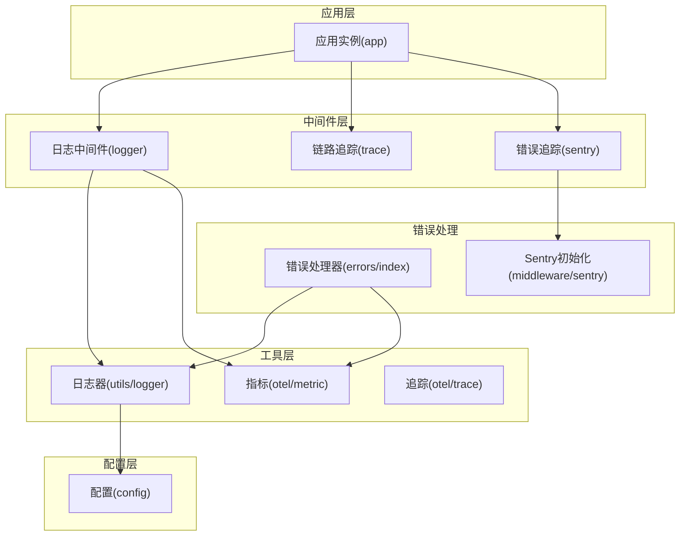
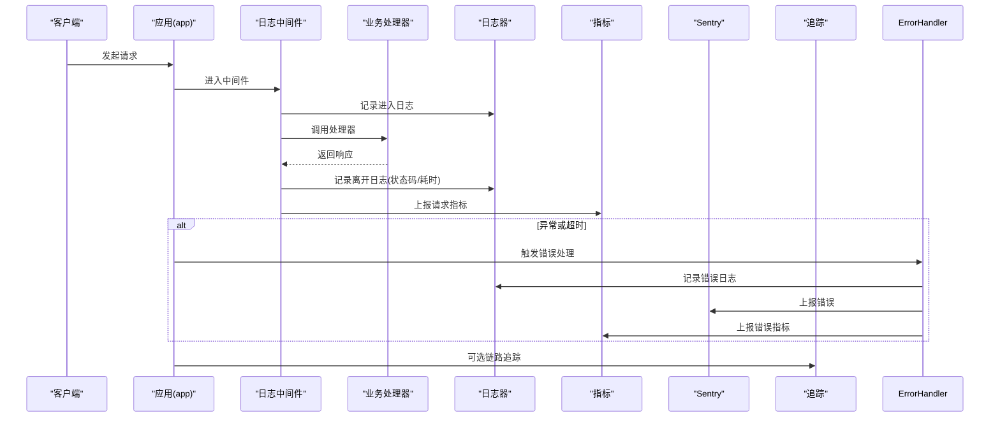
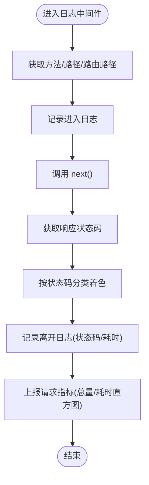
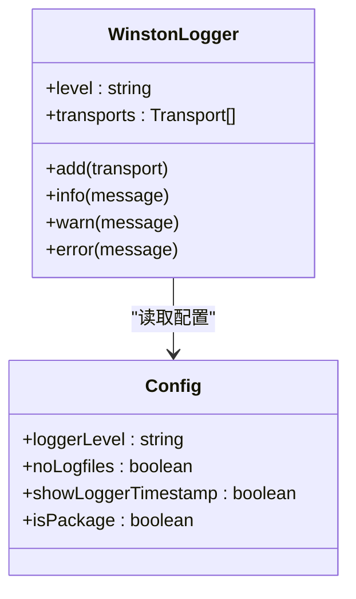
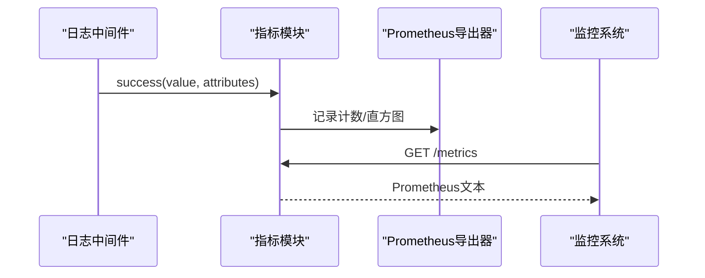
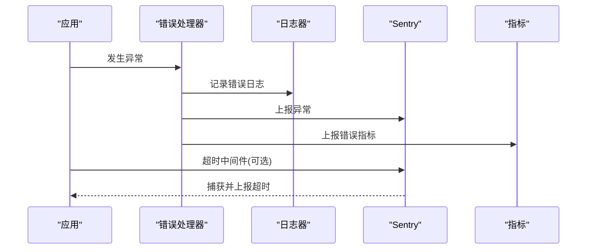
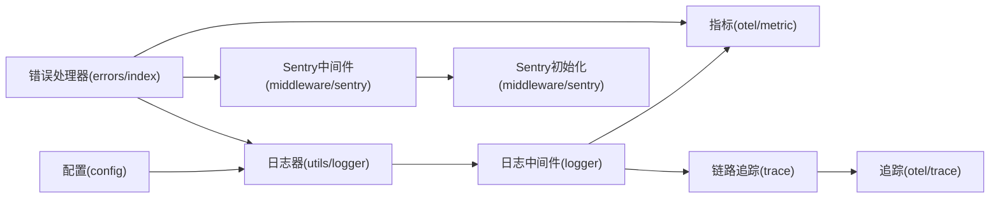

# 日志系统

<cite>
**本文引用的文件**
- [lib/middleware/logger.ts](file://lib/middleware/logger.ts)
- [lib/utils/logger.ts](file://lib/utils/logger.ts)
- [lib/config.ts](file://lib/config.ts)
- [lib/app-bootstrap.tsx](file://lib/app-bootstrap.tsx)
- [lib/utils/otel/metric.ts](file://lib/utils/otel/metric.ts)
- [lib/utils/otel/trace.ts](file://lib/utils/otel/trace.ts)
- [lib/middleware/sentry.ts](file://lib/middleware/sentry.ts)
- [lib/errors/index.tsx](file://lib/errors/index.tsx)
- [lib/middleware/debug.ts](file://lib/middleware/debug.ts)
- [lib/utils/proxy/unify-proxy.ts](file://lib/utils/proxy/unify-proxy.ts)
- [lib/routes/metrics.ts](file://lib/routes/metrics.ts)
- [lib/middleware/CLAUDE.md](file://lib/middleware/CLAUDE.md)
</cite>

## 目录
1. [简介](#简介)
2. [项目结构](#项目结构)
3. [核心组件](#核心组件)
4. [架构总览](#架构总览)
5. [详细组件分析](#详细组件分析)
6. [依赖关系分析](#依赖关系分析)
7. [性能考量](#性能考量)
8. [故障排查指南](#故障排查指南)
9. [结论](#结论)
10. [附录](#附录)

## 简介
本文件面向RSSHub的日志系统，系统性阐述日志中间件的实现机制与架构设计，覆盖日志级别管理、日志格式化、日志输出与轮转（基于Winston文件传输）、日志与监控（OpenTelemetry）及错误追踪（Sentry）的集成方式，并提供在不同部署环境下的配置建议与最佳实践，帮助读者快速理解并正确使用日志系统进行运维与排障。

## 项目结构
日志系统主要由以下部分组成：
- 中间件层：请求进入与返回阶段的日志记录，负责记录请求方法、路径、状态码与耗时等信息。
- 工具层：基于Winston的日志器，负责将日志写入控制台与文件，支持级别过滤与JSON格式化。
- 配置层：从环境变量读取日志相关配置，如日志级别、是否禁用文件输出、是否显示时间戳等。
- 监控与追踪：OpenTelemetry指标与链路追踪，用于采集请求总量、错误量、耗时直方图与分布式追踪。
- 错误处理：全局错误处理器在发生异常时记录错误日志并上报Sentry。
- Sentry中间件：对超时路由进行错误上报。

图表来源
- [lib/app-bootstrap.tsx](file://lib/app-bootstrap.tsx#L27-L46)
- [lib/middleware/logger.ts](file://lib/middleware/logger.ts#L29-L43)
- [lib/utils/logger.ts](file://lib/utils/logger.ts#L1-L48)
- [lib/utils/otel/metric.ts](file://lib/utils/otel/metric.ts#L1-L69)
- [lib/utils/otel/trace.ts](file://lib/utils/otel/trace.ts#L1-L29)
- [lib/middleware/sentry.ts](file://lib/middleware/sentry.ts#L1-L28)
- [lib/errors/index.tsx](file://lib/errors/index.tsx#L1-L82)
- [lib/config.ts](file://lib/config.ts#L769-L783)

章节来源
- [lib/app-bootstrap.tsx](file://lib/app-bootstrap.tsx#L27-L46)
- [lib/middleware/CLAUDE.md](file://lib/middleware/CLAUDE.md#L76-L92)

## 核心组件
- 日志中间件：在请求进入与返回时分别记录“进入/离开”日志，包含方法、路径、状态码与耗时；同时向OpenTelemetry上报请求指标。
- 日志器：基于Winston，支持控制台彩色输出与文件输出（默认写入logs目录），支持按级别过滤与JSON格式化。
- 配置：从环境变量读取日志级别、是否禁用文件输出、是否显示时间戳、Sentry DSN与超时阈值等。
- OpenTelemetry指标：记录请求总量、错误总量、耗时直方图（秒/毫秒），并提供Prometheus导出接口。
- OpenTelemetry追踪：全局Tracer Provider，支持分布式链路追踪。
- 错误处理：全局错误处理器在异常时记录错误日志并上报Sentry，同时更新调试统计。
- Sentry中间件：对超过阈值的路由进行超时错误上报。

章节来源
- [lib/middleware/logger.ts](file://lib/middleware/logger.ts#L29-L43)
- [lib/utils/logger.ts](file://lib/utils/logger.ts#L1-L48)
- [lib/config.ts](file://lib/config.ts#L769-L783)
- [lib/utils/otel/metric.ts](file://lib/utils/otel/metric.ts#L1-L69)
- [lib/utils/otel/trace.ts](file://lib/utils/otel/trace.ts#L1-L29)
- [lib/errors/index.tsx](file://lib/errors/index.tsx#L1-L82)
- [lib/middleware/sentry.ts](file://lib/middleware/sentry.ts#L1-L28)

## 架构总览
日志系统通过中间件链集成到应用中，形成“请求进入—记录—处理—返回—记录—上报”的完整闭环。日志中间件负责请求生命周期内的日志记录与指标上报；日志器负责将日志输出到控制台与文件；配置层决定日志行为；错误处理与Sentry中间件负责异常与超时的错误追踪；OpenTelemetry负责指标与追踪数据的采集与导出。

图表来源
- [lib/app-bootstrap.tsx](file://lib/app-bootstrap.tsx#L27-L46)
- [lib/middleware/logger.ts](file://lib/middleware/logger.ts#L29-L43)
- [lib/errors/index.tsx](file://lib/errors/index.tsx#L1-L82)
- [lib/utils/otel/metric.ts](file://lib/utils/otel/metric.ts#L1-L69)
- [lib/utils/otel/trace.ts](file://lib/utils/otel/trace.ts#L1-L29)
- [lib/middleware/sentry.ts](file://lib/middleware/sentry.ts#L1-L28)

## 详细组件分析

### 日志中间件（请求生命周期日志）
- 功能要点
  - 在请求进入时记录“进入”日志，包含方法与路径。
  - 在请求返回时记录“离开”日志，包含状态码与耗时；状态码按类别着色便于识别。
  - 调用OpenTelemetry指标模块上报成功请求的指标（总量、毫秒/秒直方图）。
- 关键流程
  - 获取请求方法、原始URL与路由路径。
  - 记录进入日志。
  - 调用next()执行后续中间件与业务逻辑。
  - 读取响应状态码，记录离开日志并上报指标。

图表来源
- [lib/middleware/logger.ts](file://lib/middleware/logger.ts#L29-L43)

章节来源
- [lib/middleware/logger.ts](file://lib/middleware/logger.ts#L29-L43)

### 日志器（Winston）
- 功能要点
  - 支持控制台输出与文件输出（默认写入logs目录）。
  - 控制台输出支持彩色级别与可选的时间戳前缀。
  - 文件输出按级别分离（错误单独文件，其余合并文件）。
  - JSON格式化输出，便于日志收集与分析。
  - 受配置项影响：日志级别、是否禁用文件输出、是否显示时间戳。
- 行为说明
  - 当未禁用文件输出且非特定平台时，默认启用文件传输。
  - 控制台仅在非打包模式下添加，测试环境下静默。
  - 在生产环境可通过环境变量调整输出目标与格式。

图表来源
- [lib/utils/logger.ts](file://lib/utils/logger.ts#L1-L48)
- [lib/config.ts](file://lib/config.ts#L769-L783)

章节来源
- [lib/utils/logger.ts](file://lib/utils/logger.ts#L1-L48)
- [lib/config.ts](file://lib/config.ts#L769-L783)

### 配置（环境变量与默认值）
- 关键配置项
  - 日志级别：默认info，支持从环境变量覆盖。
  - 是否禁用文件输出：默认false，可在特定平台或场景关闭。
  - 是否显示时间戳：默认false，开启后控制台输出带时间戳。
  - Sentry：DSN与路由超时阈值，用于超时错误上报。
  - OpenTelemetry：秒/毫秒直方图桶边界，用于指标导出。
  - 其他：调试信息开关、远程配置加载等。
- 默认值与转换
  - 布尔值转换：空字符串、0、false视为false，否则为true。
  - 数值转换：缺失时采用默认值。
  - 字符串拼接：如代理配置中的协议与端口组合。

章节来源
- [lib/config.ts](file://lib/config.ts#L769-L783)
- [lib/config.ts](file://lib/config.ts#L715-L800)

### OpenTelemetry指标与导出
- 指标定义
  - 请求总量计数器：按方法、路径、状态属性聚合。
  - 错误总量计数器：按相同属性聚合。
  - 耗时直方图：毫秒与秒两个维度，桶边界来自配置。
- 导出与访问
  - Prometheus导出器，提供metrics路由以收集与序列化指标。
  - 可通过路由获取Prometheus格式文本，供监控系统抓取。

图表来源
- [lib/middleware/logger.ts](file://lib/middleware/logger.ts#L41-L43)
- [lib/utils/otel/metric.ts](file://lib/utils/otel/metric.ts#L1-L69)
- [lib/routes/metrics.ts](file://lib/routes/metrics.ts#L1-L13)

章节来源
- [lib/utils/otel/metric.ts](file://lib/utils/otel/metric.ts#L1-L69)
- [lib/routes/metrics.ts](file://lib/routes/metrics.ts#L1-L13)

### OpenTelemetry链路追踪
- 提供全局Tracer Provider与BatchSpanProcessor，支持分布式追踪。
- trace中间件在调试模式下启动span，便于定位请求链路。
- 可结合Sentry与错误处理器进行异常上下文关联。

章节来源
- [lib/utils/otel/trace.ts](file://lib/utils/otel/trace.ts#L1-L29)
- [lib/middleware/trace.ts](file://lib/middleware/trace.ts#L1-L26)

### 错误处理与Sentry集成
- 全局错误处理器
  - 统计错误路径与错误路由，更新调试信息。
  - 根据错误类型映射HTTP状态码。
  - 记录错误日志并上报Sentry（若已配置）。
  - 上报错误指标。
- Sentry中间件
  - 对超过阈值的路由进行超时错误上报，携带路由标签。
- 代理配置中的日志
  - 在代理参数解析过程中记录警告与错误日志，便于排查配置问题。

图表来源
- [lib/errors/index.tsx](file://lib/errors/index.tsx#L1-L82)
- [lib/middleware/sentry.ts](file://lib/middleware/sentry.ts#L1-L28)
- [lib/utils/proxy/unify-proxy.ts](file://lib/utils/proxy/unify-proxy.ts#L34-L61)

章节来源
- [lib/errors/index.tsx](file://lib/errors/index.tsx#L1-L82)
- [lib/middleware/sentry.ts](file://lib/middleware/sentry.ts#L1-L28)
- [lib/utils/proxy/unify-proxy.ts](file://lib/utils/proxy/unify-proxy.ts#L34-L61)

### 调试中间件与日志联动
- 调试中间件统计请求总量、命中缓存次数、ETag命中次数、热路径与热路由等。
- 与日志中间件配合，便于在开发与调试阶段观察请求行为与性能特征。

章节来源
- [lib/middleware/debug.ts](file://lib/middleware/debug.ts#L1-L41)

## 依赖关系分析
- 中间件链顺序
  - 日志中间件位于模板渲染之后、访问控制之前，确保记录到完整的请求生命周期。
  - 链路追踪与Sentry中间件紧随其后，保证追踪与错误上报的完整性。
- 组件耦合
  - 日志中间件依赖日志器与指标模块。
  - 错误处理器依赖日志器、指标模块与Sentry。
  - 日志器依赖配置模块。
  - 指标模块依赖OpenTelemetry导出器与配置。
- 外部依赖
  - Winston：日志输出与格式化。
  - OpenTelemetry：指标与追踪。
  - Sentry：错误追踪。

图表来源
- [lib/app-bootstrap.tsx](file://lib/app-bootstrap.tsx#L27-L46)
- [lib/utils/logger.ts](file://lib/utils/logger.ts#L1-L48)
- [lib/middleware/logger.ts](file://lib/middleware/logger.ts#L29-L43)
- [lib/utils/otel/metric.ts](file://lib/utils/otel/metric.ts#L1-L69)
- [lib/utils/otel/trace.ts](file://lib/utils/otel/trace.ts#L1-L29)
- [lib/middleware/sentry.ts](file://lib/middleware/sentry.ts#L1-L28)
- [lib/errors/index.tsx](file://lib/errors/index.tsx#L1-L82)

章节来源
- [lib/app-bootstrap.tsx](file://lib/app-bootstrap.tsx#L27-L46)
- [lib/middleware/CLAUDE.md](file://lib/middleware/CLAUDE.md#L76-L92)

## 性能考量
- 日志级别与输出
  - 生产环境建议使用info或更高级别，避免过多debug日志带来的I/O开销。
  - 控制台输出在非打包模式下启用，测试环境静默，减少不必要的输出。
- 文件输出与轮转
  - 当前实现通过Winston文件传输写入固定文件，未见内置轮转配置。
  - 建议在容器或系统层面配置日志轮转（例如使用logrotate或Docker日志驱动的轮转策略），以避免单文件过大。
- 指标与追踪
  - 指标直方图桶边界可按业务负载调优，避免过细导致内存占用过高。
  - 追踪批量导出器有队列大小与延迟配置，可根据吞吐量调整。
- 中间件顺序
  - 将日志中间件置于关键处理之前，有助于更准确地统计耗时与状态。

[本节为通用指导，不直接分析具体文件]

## 故障排查指南
- 常见问题与定位
  - 无日志输出：检查是否禁用了文件输出、是否处于测试环境、是否在特定平台（如特定环境变量）下跳过文件输出。
  - 日志级别无效：确认环境变量是否正确设置，注意布尔值与数值转换规则。
  - Sentry未上报：确认DSN是否配置，路由超时阈值是否合理，超时中间件是否生效。
  - 指标未导出：确认Prometheus导出器可用，路由是否可达，桶边界配置是否正确。
- 实用技巧
  - 开启调试信息查看请求统计与热路径，辅助定位热点与异常。
  - 在代理配置解析失败时，关注相关日志输出，修正协议、端口与主机配置。
  - 结合Sentry与错误处理器的错误日志，快速定位异常路由与堆栈信息。

章节来源
- [lib/utils/logger.ts](file://lib/utils/logger.ts#L1-L48)
- [lib/config.ts](file://lib/config.ts#L769-L783)
- [lib/middleware/sentry.ts](file://lib/middleware/sentry.ts#L1-L28)
- [lib/utils/proxy/unify-proxy.ts](file://lib/utils/proxy/unify-proxy.ts#L34-L61)
- [lib/errors/index.tsx](file://lib/errors/index.tsx#L1-L82)

## 结论
RSSHub的日志系统通过中间件链实现了对请求生命周期的完整记录，并与OpenTelemetry指标、链路追踪以及Sentry错误追踪紧密集成。日志器基于Winston，具备控制台与文件输出能力，并通过配置项灵活适配不同运行环境。建议在生产环境中合理设置日志级别与输出策略，并结合系统级日志轮转与监控系统抓取指标，以获得稳定、可观测的日志体验。

[本节为总结，不直接分析具体文件]

## 附录

### 配置选项与使用方法
- 日志级别
  - 环境变量：LOGGER_LEVEL
  - 默认值：info
  - 作用：控制日志器的最低输出级别
- 是否禁用文件输出
  - 环境变量：NO_LOGFILES
  - 默认值：false
  - 作用：在特定平台或场景下禁用文件输出
- 是否显示时间戳
  - 环境变量：SHOW_LOGGER_TIMESTAMP
  - 默认值：false
  - 作用：控制台输出是否包含时间戳
- Sentry
  - 环境变量：SENTRY、SENTRY_ROUTE_TIMEOUT
  - 作用：配置DSN与路由超时阈值，用于超时错误上报
- OpenTelemetry
  - 环境变量：OTEL_SECONDS_BUCKET、OTEL_MILLISECONDS_BUCKET
  - 作用：配置指标直方图桶边界
- 调试信息
  - 环境变量：DEBUG_INFO
  - 作用：控制调试页面与统计信息的展示范围

章节来源
- [lib/config.ts](file://lib/config.ts#L769-L783)

### 实际配置示例（环境变量）
- 开发环境
  - LOGGER_LEVEL=debug
  - SHOW_LOGGER_TIMESTAMP=true
  - DEBUG_INFO=true
- 生产环境
  - LOGGER_LEVEL=info
  - NO_LOGFILES=false
  - SENTRY=your_dsn
  - SENTRY_ROUTE_TIMEOUT=30000
  - OTEL_SECONDS_BUCKET=0.01,0.1,1,2,5,15,30,60
  - OTEL_MILLISECONDS_BUCKET=10,20,50,100,250,500,1000,5000,15000
- 容器/平台
  - 在容器内通过环境变量注入上述配置；如需禁用文件输出，可设置NO_LOGFILES=true

[本节为示例说明，不直接分析具体文件]

### 最佳实践
- 日志级别
  - 开发：debug；生产：info或更高
- 输出策略
  - 控制台用于本地开发与调试；生产环境优先文件输出并配合系统级轮转
- 指标与监控
  - 配置Prometheus导出路由，定期抓取指标；根据业务负载调整桶边界
- 错误追踪
  - 正确配置Sentry DSN与超时阈值；结合错误处理器与超时中间件，提升异常可见性
- 调试与排障
  - 利用调试中间件统计热路径与错误分布；在代理配置解析失败时，依据日志快速修正

[本节为通用指导，不直接分析具体文件]