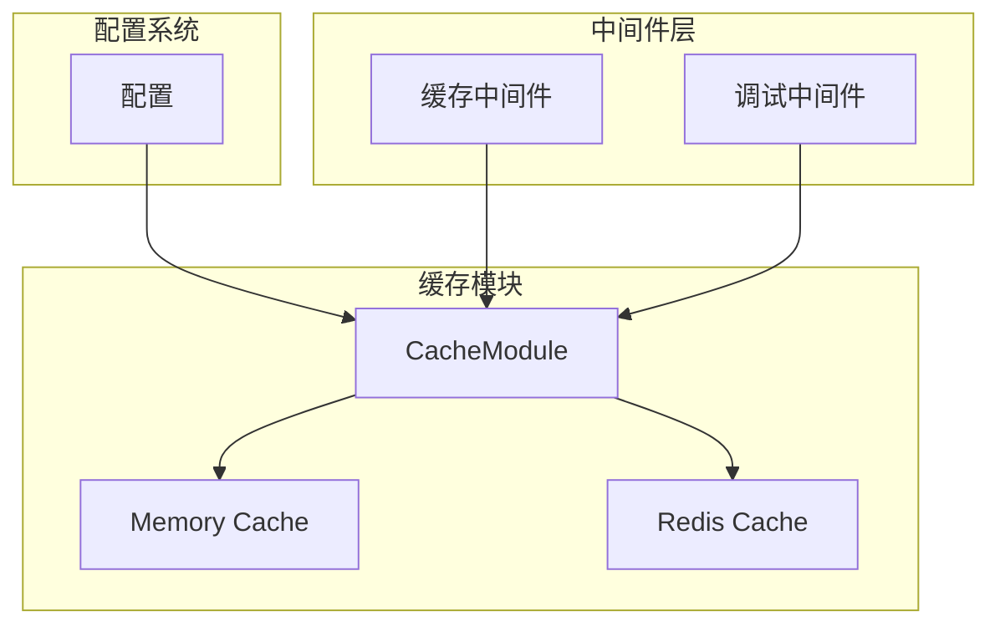
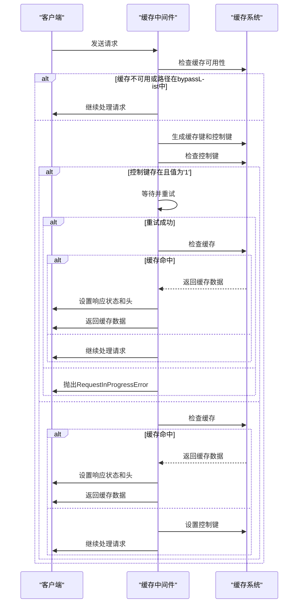
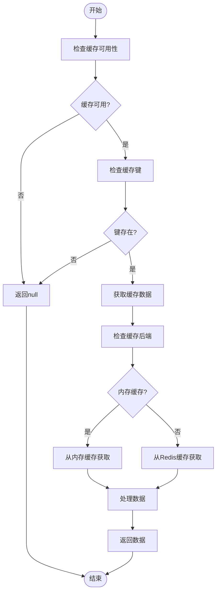
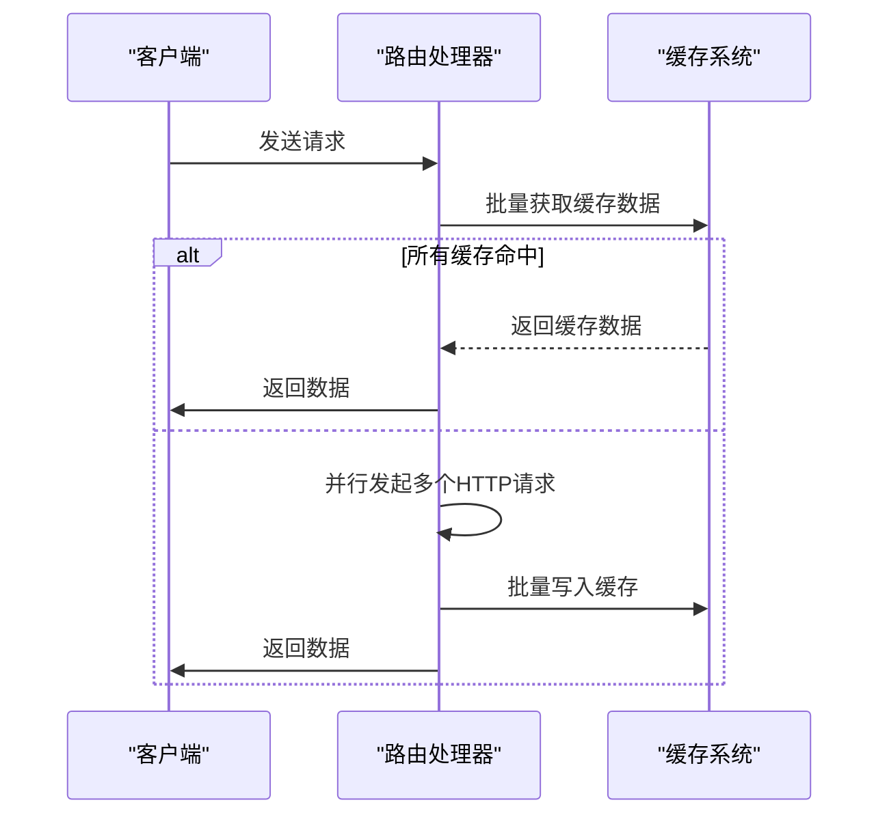
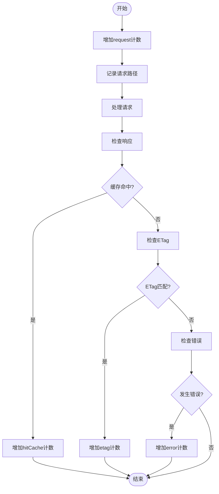
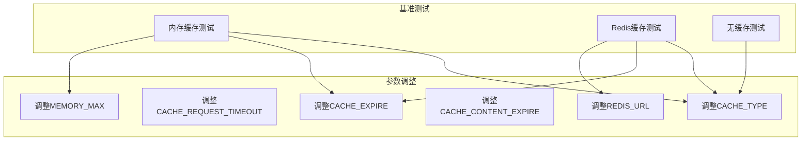
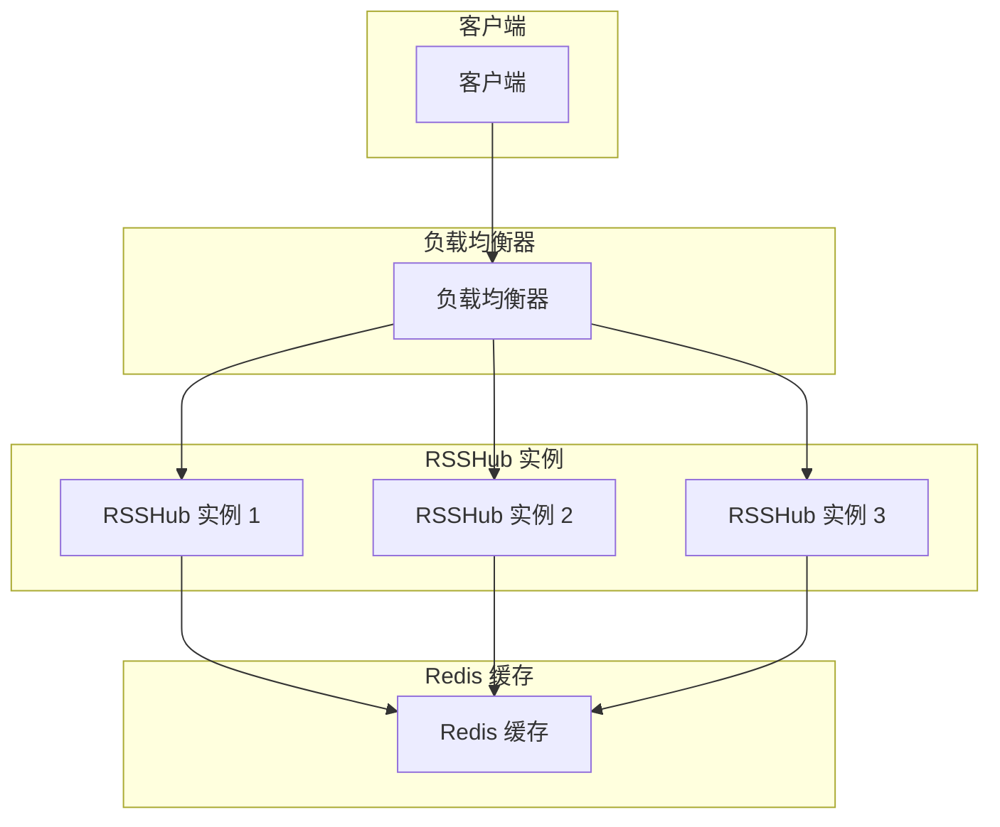

# 性能优化

<cite>
**本文档引用的文件**   
- [cache.ts](file://lib/middleware/cache.ts)
- [cache.test.ts](file://lib/middleware/cache.test.ts)
- [index.ts](file://lib/utils/cache/index.ts)
- [memory.ts](file://lib/utils/cache/memory.ts)
- [redis.ts](file://lib/utils/cache/redis.ts)
- [base.ts](file://lib/utils/cache/base.ts)
- [config.ts](file://lib/config.ts)
- [debug-info.ts](file://lib/utils/debug-info.ts)
- [debug.ts](file://lib/middleware/debug.ts)
- [docker-compose.yml](file://docker-compose.yml)
</cite>

## 目录
1. [引言](#引言)
2. [缓存系统架构](#缓存系统架构)
3. [缓存命中率优化](#缓存命中率优化)
4. [缓存读写性能调优](#缓存读写性能调优)
5. [内存使用效率提升](#内存使用效率提升)
6. [缓存预热与批量操作](#缓存预热与批量操作)
7. [性能监控指标](#性能监控指标)
8. [基准测试与参数调整](#基准测试与参数调整)
9. [高并发场景下的性能挑战](#高并发场景下的性能挑战)
10. [结论](#结论)

## 引言

RSSHub 是一个开源的 RSS 生成器，其缓存系统在提升系统性能和用户体验方面起着至关重要的作用。本文档全面分析 RSSHub 缓存系统的性能优化技术，包括缓存命中率优化、缓存读写性能调优和内存使用效率提升。详细解释如何通过缓存预热、缓存压缩和批量操作提高系统性能。描述缓存系统的性能监控指标，如缓存命中率、平均响应时间和内存使用率。提供性能基准测试方法和结果分析，以及如何根据性能数据调整缓存参数。讨论在高并发场景下的性能挑战和解决方案，包括连接池管理、异步操作和负载均衡策略。

## 缓存系统架构

RSSHub 的缓存系统采用模块化设计，支持多种缓存后端，包括内存缓存和 Redis 缓存。系统通过中间件机制集成到请求处理流程中，实现了高效的缓存管理和性能优化。



**图表来源**
- [cache.ts](file://lib/middleware/cache.ts#L1-L84)
- [index.ts](file://lib/utils/cache/index.ts#L1-L60)
- [config.ts](file://lib/config.ts#L239-L800)

**章节来源**
- [cache.ts](file://lib/middleware/cache.ts#L1-L84)
- [index.ts](file://lib/utils/cache/index.ts#L1-L60)

## 缓存命中率优化

RSSHub 通过多种机制优化缓存命中率，确保系统能够高效地服务大量请求。首先，系统使用 XXH64 哈希算法对请求路径进行哈希处理，以缩小缓存键的大小，提高缓存查找效率。其次，系统通过 `bypassList` 集合排除特定路径（如根路径、robots.txt、logo.png 和 favicon.ico）的缓存，避免不必要的缓存开销。

当请求到达时，系统首先检查缓存是否可用且请求路径不在 `bypassList` 中。如果条件满足，系统会生成缓存键和控制键，并检查控制键是否存在。如果控制键存在且值为 '1'，表示该路径正在被请求，系统会等待一段时间后重试，最多重试 10 次。如果重试失败，系统会抛出 `RequestInProgressError` 错误，提示用户稍后再试。

如果控制键不存在或值不为 '1'，系统会尝试从缓存中获取数据。如果缓存命中，系统会设置响应状态为 200，并在响应头中添加 `RSSHub-Cache-Status: HIT`，然后将缓存数据解析并设置到上下文中，继续执行后续中间件。如果缓存未命中，系统会设置控制键，表示该路径正在被请求，然后继续执行后续中间件。



**图表来源**
- [cache.ts](file://lib/middleware/cache.ts#L1-L84)

**章节来源**
- [cache.ts](file://lib/middleware/cache.ts#L1-L84)

## 缓存读写性能调优

RSSHub 通过优化缓存读写操作来提高系统性能。系统支持两种缓存后端：内存缓存和 Redis 缓存。内存缓存使用 `lru-cache` 库实现，支持 LRU（最近最少使用）淘汰策略，确保缓存中存储的是最常用的数据。Redis 缓存使用 `ioredis` 库实现，支持分布式缓存，适用于多实例部署场景。

在读取缓存时，系统首先检查缓存键是否存在且缓存系统可用。如果条件满足，系统会从缓存中获取数据。对于内存缓存，系统使用 `memoryCache.get` 方法获取数据，并设置 `updateAgeOnGet` 参数为 `false`，避免更新缓存项的年龄。对于 Redis 缓存，系统使用 `redisClient.get` 方法获取数据，并通过 `mget` 命令同时获取缓存数据和缓存过期时间。如果缓存数据存在且需要刷新，系统会重新设置缓存过期时间。

在写入缓存时，系统首先检查缓存键是否存在且缓存系统可用。如果条件满足，系统会将数据写入缓存。对于内存缓存，系统使用 `memoryCache.set` 方法写入数据，并设置 `ttl` 参数为 `maxAge * 1000`，单位为毫秒。对于 Redis 缓存，系统使用 `redisClient.set` 方法写入数据，并设置 `EX` 参数为 `maxAge`，单位为秒。如果 `maxAge` 不等于默认的 `contentExpire` 值，系统会额外存储缓存过期时间，以便在读取时正确处理。



**图表来源**
- [memory.ts](file://lib/utils/cache/memory.ts#L1-L44)
- [redis.ts](file://lib/utils/cache/redis.ts#L1-L77)

**章节来源**
- [memory.ts](file://lib/utils/cache/memory.ts#L1-L44)
- [redis.ts](file://lib/utils/cache/redis.ts#L1-L77)

## 内存使用效率提升

RSSHub 通过多种机制提升内存使用效率，确保系统在高负载下仍能稳定运行。首先，系统通过配置 `MEMORY_MAX` 环境变量来限制内存缓存的最大容量，防止内存溢出。默认情况下，`MEMORY_MAX` 的值为 256，表示最多存储 256 个缓存项。

其次，系统使用 LRU（最近最少使用）淘汰策略来管理内存缓存。当缓存项数量超过最大容量时，系统会自动淘汰最近最少使用的缓存项，确保缓存中存储的是最常用的数据。此外，系统通过 `ttl` 参数设置缓存项的过期时间，确保缓存数据不会无限期存储，从而释放内存空间。

对于 Redis 缓存，系统通过 `EX` 参数设置缓存项的过期时间，确保缓存数据不会无限期存储。如果 `maxAge` 不等于默认的 `contentExpire` 值，系统会额外存储缓存过期时间，以便在读取时正确处理。这种机制可以有效减少 Redis 中的无效数据，提高内存使用效率。

```mermaid
classDiagram
class MemoryCache {
+ttl : number
+max : number
+get(key : string, refresh : boolean) : string | undefined
+set(key : string, value : string, maxAge : number) : void
}
class RedisCache {
+url : string
+get(key : string, refresh : boolean) : Promise<string | null>
+set(key : string, value : string, maxAge : number) : void
}
class CacheModule {
+init() : void
+get(key : string, refresh : boolean) : Promise<string | null> | string | null
+set(key : string, value : string, maxAge : number) : any
+status : { available : boolean }
+clients : { redisClient? : Redis, memoryCache? : LRUCache<any, any> }
}
MemoryCache --> CacheModule : "实现"
RedisCache --> CacheModule : "实现"
```

**图表来源**
- [memory.ts](file://lib/utils/cache/memory.ts#L1-L44)
- [redis.ts](file://lib/utils/cache/redis.ts#L1-L77)
- [base.ts](file://lib/utils/cache/base.ts#L1-L17)

**章节来源**
- [memory.ts](file://lib/utils/cache/memory.ts#L1-L44)
- [redis.ts](file://lib/utils/cache/redis.ts#L1-L77)

## 缓存预热与批量操作

RSSHub 通过缓存预热和批量操作进一步提升系统性能。缓存预热是指在系统启动或特定条件下，预先将常用数据加载到缓存中，以减少首次请求的延迟。虽然 RSSHub 的代码中没有显式的缓存预热逻辑，但可以通过配置 `CACHE_EXPIRE` 和 `CACHE_CONTENT_EXPIRE` 环境变量来控制缓存项的过期时间，从而间接实现缓存预热的效果。

批量操作是指在处理大量数据时，通过批量读取和写入缓存来减少 I/O 操作次数，提高系统性能。例如，在 `wired/tag.ts` 路由中，系统使用 `Promise.all` 并行处理多个请求，并通过 `cache.tryGet` 方法批量获取缓存数据。如果缓存未命中，系统会并行发起多个 HTTP 请求，获取数据后批量写入缓存。



**图表来源**
- [wired/tag.ts](file://lib/routes/wired/tag.ts#L46-L66)

**章节来源**
- [wired/tag.ts](file://lib/routes/wired/tag.ts#L46-L66)

## 性能监控指标

RSSHub 提供了丰富的性能监控指标，帮助开发者和运维人员了解系统的运行状态。系统通过 `debug-info.ts` 文件定义了 `DebugInfo` 类型，包含以下性能指标：

- `hitCache`: 缓存命中的次数
- `request`: 总请求次数
- `etag`: ETag 匹配的次数
- `error`: 错误请求的次数
- `paths`: 各路径的请求次数
- `routes`: 各路由的请求次数
- `errorPaths`: 各路径的错误请求次数
- `errorRoutes`: 各路由的错误请求次数

系统通过 `middleware/debug.ts` 中间件收集这些性能指标。当请求到达时，中间件会增加 `request` 计数，并记录请求路径。当请求处理完成后，中间件会检查响应头中的 `RSSHub-Cache-Status`，如果存在且值为 'HIT'，则增加 `hitCache` 计数。如果响应状态为 304，则增加 `etag` 计数。如果请求处理过程中发生错误，则增加 `error` 计数。



**图表来源**
- [debug-info.ts](file://lib/utils/debug-info.ts#L1-L25)
- [debug.ts](file://lib/middleware/debug.ts#L1-L40)

**章节来源**
- [debug-info.ts](file://lib/utils/debug-info.ts#L1-L25)
- [debug.ts](file://lib/middleware/debug.ts#L1-L40)

## 基准测试与参数调整

RSSHub 提供了详细的基准测试方法，帮助开发者评估系统的性能。系统通过 `cache.test.ts` 文件中的测试用例验证缓存系统的正确性和性能。测试用例涵盖了内存缓存、Redis 缓存、无缓存等多种场景，确保系统在不同配置下都能正常工作。

在基准测试中，系统通过 `wait` 函数模拟请求延迟，并通过 `parser.parseString` 方法解析 RSS 响应。测试用例验证了缓存命中、缓存过期、并发请求等关键功能。例如，在 `memory` 测试用例中，系统首先发送两个请求，验证缓存命中；然后等待一段时间，再次发送请求，验证缓存过期；最后发送更多请求，验证缓存更新。

根据基准测试结果，开发者可以调整缓存参数以优化系统性能。主要的缓存参数包括：

- `CACHE_TYPE`: 缓存类型，支持 'memory' 和 'redis'，设为空可以禁止缓存
- `CACHE_REQUEST_TIMEOUT`: 请求超时时间，单位为秒
- `CACHE_EXPIRE`: 路由缓存时间，单位为秒
- `CACHE_CONTENT_EXPIRE`: 不变内容缓存时间，单位为秒
- `MEMORY_MAX`: 内存缓存的最大容量
- `REDIS_URL`: Redis 服务器的 URL

通过调整这些参数，开发者可以根据实际需求优化缓存系统的性能。例如，增加 `CACHE_EXPIRE` 可以延长缓存项的过期时间，提高缓存命中率；增加 `MEMORY_MAX` 可以提高内存缓存的容量，减少缓存淘汰；使用 Redis 缓存可以支持分布式部署，提高系统的可扩展性。



**图表来源**
- [cache.test.ts](file://lib/middleware/cache.test.ts#L1-L191)
- [config.ts](file://lib/config.ts#L239-L800)

**章节来源**
- [cache.test.ts](file://lib/middleware/cache.test.ts#L1-L191)
- [config.ts](file://lib/config.ts#L239-L800)

## 高并发场景下的性能挑战

在高并发场景下，RSSHub 面临着多种性能挑战，包括连接池管理、异步操作和负载均衡策略。为了应对这些挑战，系统采用了多种优化措施。

首先，系统通过 `ioredis` 库管理 Redis 连接池，确保在高并发下能够高效地处理大量请求。`ioredis` 库支持连接池管理，可以自动处理连接的创建、复用和关闭，减少连接开销。此外，系统通过 `redisClient.on('error')` 和 `redisClient.on('end')` 事件监听连接错误和断开，及时更新缓存状态，避免因连接问题导致的性能下降。

其次，系统通过异步操作提高并发处理能力。所有缓存读写操作都使用 `async/await` 语法，确保在等待 I/O 操作完成时不会阻塞主线程。例如，在 `cache.ts` 中间件中，系统使用 `await cacheModule.globalCache.get(key)` 和 `await cacheModule.globalCache.set(key, body, config.cache.routeExpire)` 异步读取和写入缓存，确保在高并发下仍能保持良好的性能。

最后，系统通过负载均衡策略提高系统的可扩展性。虽然 RSSHub 本身不直接提供负载均衡功能，但可以通过外部负载均衡器（如 Nginx、HAProxy）将请求分发到多个 RSSHub 实例。每个实例可以独立运行，使用共享的 Redis 缓存，确保缓存数据的一致性。这种架构可以有效提高系统的并发处理能力和可用性。



**图表来源**
- [redis.ts](file://lib/utils/cache/redis.ts#L1-L77)
- [cache.ts](file://lib/middleware/cache.ts#L1-L84)
- [docker-compose.yml](file://docker-compose.yml#L36-L62)

**章节来源**
- [redis.ts](file://lib/utils/cache/redis.ts#L1-L77)
- [cache.ts](file://lib/middleware/cache.ts#L1-L84)
- [docker-compose.yml](file://docker-compose.yml#L36-L62)

## 结论

RSSHub 的缓存系统通过多种机制实现了高效的性能优化。系统支持内存缓存和 Redis 缓存，通过 XXH64 哈希算法和 LRU 淘汰策略优化缓存命中率和内存使用效率。系统通过异步操作和连接池管理提高并发处理能力，并通过负载均衡策略提高系统的可扩展性。此外，系统提供了丰富的性能监控指标和基准测试方法，帮助开发者评估和优化系统性能。通过合理配置缓存参数，开发者可以根据实际需求进一步提升系统的性能和稳定性。