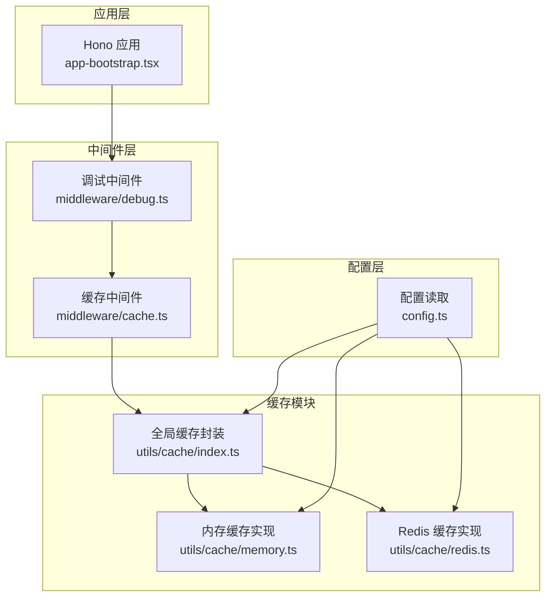
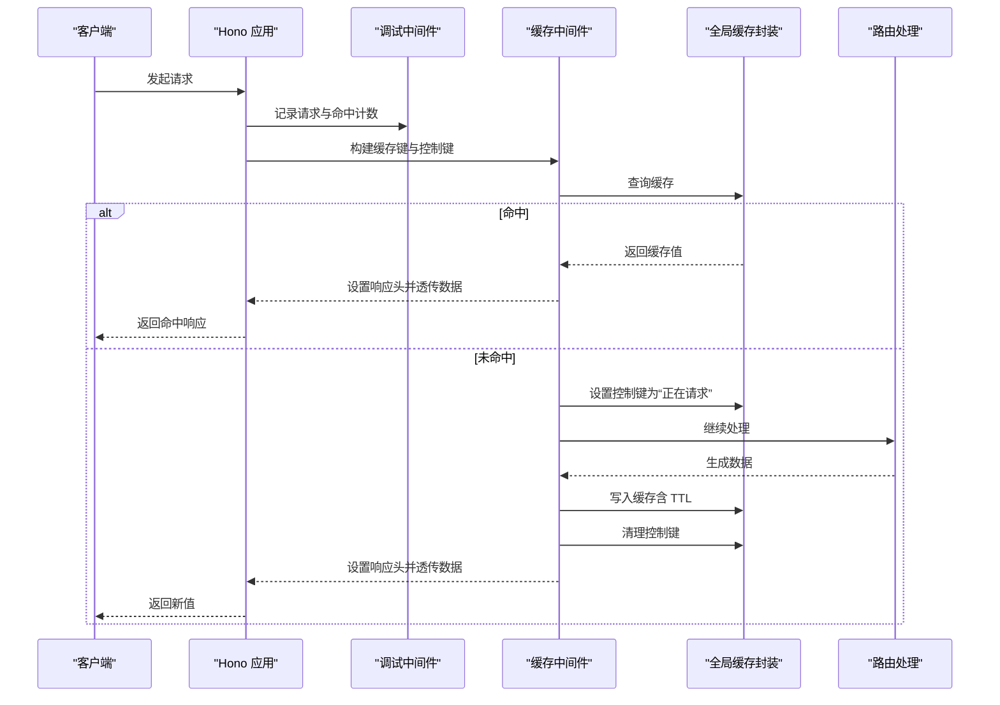
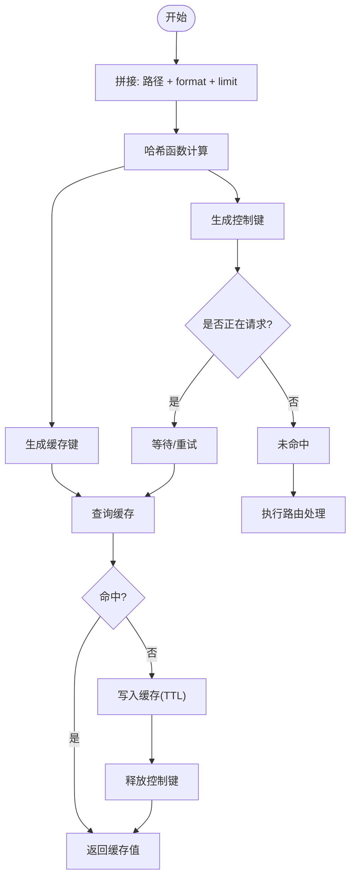
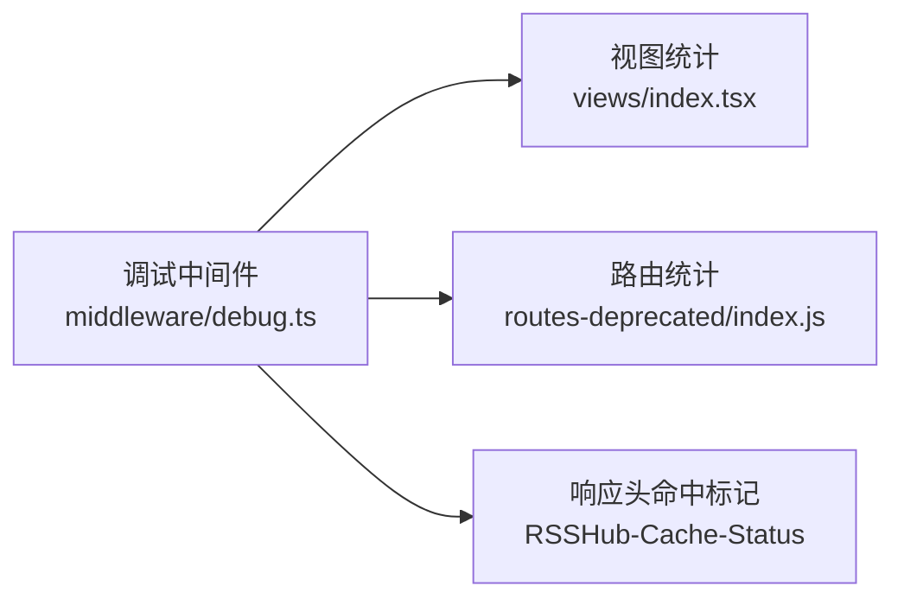
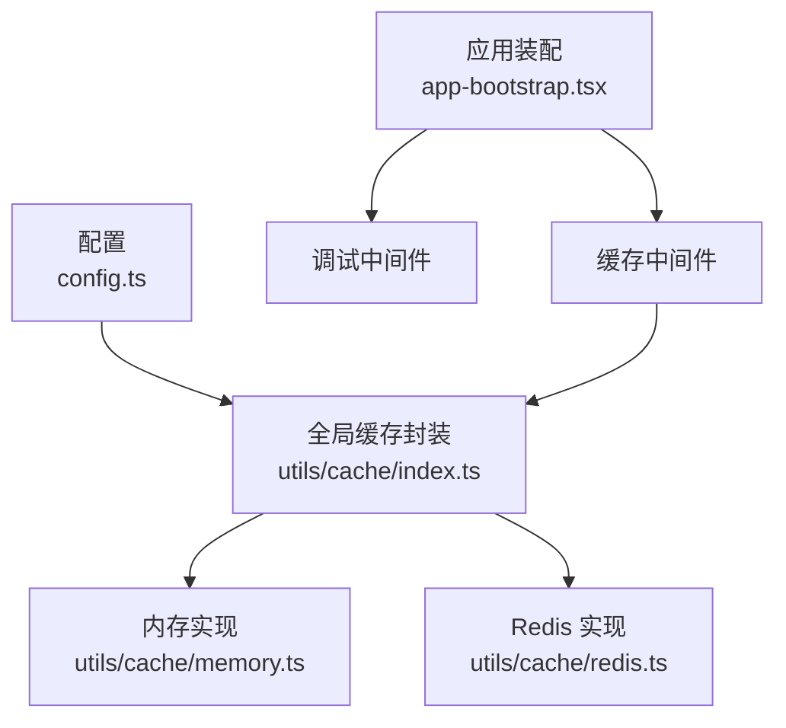

# 缓存命中率优化

<cite>
**本文引用的文件**
- [lib/middleware/cache.ts](file://lib/middleware/cache.ts)
- [lib/utils/cache/index.ts](file://lib/utils/cache/index.ts)
- [lib/utils/cache/memory.ts](file://lib/utils/cache/memory.ts)
- [lib/utils/cache/redis.ts](file://lib/utils/cache/redis.ts)
- [lib/config.ts](file://lib/config.ts)
- [lib/app-bootstrap.tsx](file://lib/app-bootstrap.tsx)
- [lib/middleware/debug.ts](file://lib/middleware/debug.ts)
- [lib/views/index.tsx](file://lib/views/index.tsx)
- [lib/routes-deprecated/index.js](file://lib/routes-deprecated/index.js)
- [lib/middleware/cache.test.ts](file://lib/middleware/cache.test.ts)
- [lib/utils/cache.test.ts](file://lib/utils/cache.test.ts)
</cite>

## 目录
1. [引言](#引言)
2. [项目结构](#项目结构)
3. [核心组件](#核心组件)
4. [架构总览](#架构总览)
5. [详细组件分析](#详细组件分析)
6. [依赖关系分析](#依赖关系分析)
7. [性能考量与优化建议](#性能考量与优化建议)
8. [故障排查指南](#故障排查指南)
9. [结论](#结论)
10. [附录](#附录)

## 引言
本文件围绕 RSSHub 的缓存命中率优化展开，系统性分析缓存键设计、缓存预热机制与缓存失效策略，并结合代码实现给出可操作的优化建议与监控方案。重点覆盖：
- 如何通过合理的缓存键命名规则与数据分片提升命中率
- 启动时预热与定时预热的实现思路
- 失效策略（TTL、LFU、LRU）在当前实现中的表现与影响
- 命中率监控与性能调优建议，以及如何按业务场景选择合适策略

## 项目结构
RSSHub 的缓存系统由中间件层与通用缓存模块组成，中间件负责请求级缓存控制，通用模块抽象了内存与 Redis 两种后端，配置层提供 TTL、最大条目数等参数。

图表来源
- [lib/app-bootstrap.tsx](file://lib/app-bootstrap.tsx#L1-L54)
- [lib/middleware/cache.ts](file://lib/middleware/cache.ts#L1-L84)
- [lib/utils/cache/index.ts](file://lib/utils/cache/index.ts#L1-L100)
- [lib/utils/cache/memory.ts](file://lib/utils/cache/memory.ts#L1-L45)
- [lib/utils/cache/redis.ts](file://lib/utils/cache/redis.ts#L1-L78)
- [lib/config.ts](file://lib/config.ts#L735-L748)

章节来源
- [lib/app-bootstrap.tsx](file://lib/app-bootstrap.tsx#L1-L54)
- [lib/middleware/cache.ts](file://lib/middleware/cache.ts#L1-L84)
- [lib/utils/cache/index.ts](file://lib/utils/cache/index.ts#L1-L100)
- [lib/utils/cache/memory.ts](file://lib/utils/cache/memory.ts#L1-L45)
- [lib/utils/cache/redis.ts](file://lib/utils/cache/redis.ts#L1-L78)
- [lib/config.ts](file://lib/config.ts#L735-L748)

## 核心组件
- 缓存中间件：负责构建缓存键、并发去重、命中返回、未命中写入与控制键管理
- 全局缓存封装：统一对外接口，按配置选择内存或 Redis 实现
- 内存缓存：基于 LRU 算法，支持 TTL 与最大条目数
- Redis 缓存：支持 TTL、键过期刷新、自定义 TTL 键存储
- 配置：提供缓存类型、请求超时、路由缓存 TTL、内容缓存 TTL、内存最大条目数、Redis 连接地址等

章节来源
- [lib/middleware/cache.ts](file://lib/middleware/cache.ts#L1-L84)
- [lib/utils/cache/index.ts](file://lib/utils/cache/index.ts#L1-L100)
- [lib/utils/cache/memory.ts](file://lib/utils/cache/memory.ts#L1-L45)
- [lib/utils/cache/redis.ts](file://lib/utils/cache/redis.ts#L1-L78)
- [lib/config.ts](file://lib/config.ts#L735-L748)

## 架构总览
缓存中间件在路由处理前执行，依据请求路径与查询参数生成稳定缓存键；命中则直接返回，未命中则标记“正在请求”的控制键，避免同时发起多次重复抓取；成功后写入缓存并释放控制键。

图表来源
- [lib/middleware/cache.ts](file://lib/middleware/cache.ts#L1-L84)
- [lib/utils/cache/index.ts](file://lib/utils/cache/index.ts#L1-L100)
- [lib/middleware/debug.ts](file://lib/middleware/debug.ts#L1-L40)

## 详细组件分析

### 缓存键设计与数据分片
- 键构成要素
  - 路径：请求路径
  - format：查询参数 format，默认 rss
  - limit：查询参数 limit（存在时参与）
- 哈希策略
  - 使用哈希函数对“路径+format+limit”进行哈希，得到固定长度字符串作为键名的一部分
  - 控制键用于并发去重，避免同一路径同时被多个请求触发抓取
- 分片与稳定性
  - 通过将 format、limit 纳入键，天然实现“格式/数量”维度的数据分片，降低热点路径的串扰
  - 对于高频路径，不同 format/limit 的组合会形成独立键空间，有助于分散热点

图表来源
- [lib/middleware/cache.ts](file://lib/middleware/cache.ts#L1-L84)

章节来源
- [lib/middleware/cache.ts](file://lib/middleware/cache.ts#L1-L84)

### 并发去重与请求控制
- 控制键机制
  - 在未命中时设置控制键为“正在请求”，其他并发请求轮询检测，直到非“正在请求”状态再继续
  - 若超时仍未结束，抛出错误，避免无限等待
- 作用
  - 有效防止缓存击穿与雪崩，保障高并发下的稳定性

章节来源
- [lib/middleware/cache.ts](file://lib/middleware/cache.ts#L26-L81)

### 缓存预热机制
- 启动时预热
  - 可在应用启动后主动访问高频路径，触发缓存写入；该逻辑需在业务侧实现，中间件不内置自动预热
- 定时预热
  - 可通过外部调度器定期访问热点路径，配合中间件的缓存写入流程，提前填充缓存
- 数据分片与预热策略
  - 针对不同 format/limit 的组合分别预热，确保各分片均被覆盖

说明：当前仓库未发现内置的自动预热实现，建议在业务侧结合监控指标制定预热计划。

章节来源
- [lib/middleware/cache.ts](file://lib/middleware/cache.ts#L56-L81)

### 失效策略与 TTL 行为
- TTL 策略
  - 路由缓存 TTL：用于中间件缓存键的过期
  - 内容缓存 TTL：用于具体 RSS 内容的过期
  - Redis 实现中，若设置了非默认内容 TTL，会额外存储一个 TTL 键，以便命中时刷新主键与 TTL 键的过期
- LRU/LFU 策略
  - 内存缓存采用 LRU 算法，具备淘汰能力
  - Redis 默认使用 LRU 淘汰策略（取决于 Redis 配置），但 RSSHub 中间件未显式启用 LFU
- 影响分析
  - TTL 适合静态/低频更新内容；LRU 更适合动态热点内容，能减少无效缓存占用
  - 当前实现以 TTL 为主，LRU 仅在内存缓存生效，Redis 侧未见 LFU 开关

章节来源
- [lib/config.ts](file://lib/config.ts#L735-L748)
- [lib/utils/cache/memory.ts](file://lib/utils/cache/memory.ts#L1-L45)
- [lib/utils/cache/redis.ts](file://lib/utils/cache/redis.ts#L36-L77)

### 命中率监控与可观测性
- 调试中间件统计
  - 记录请求总量、命中缓存次数、ETag 匹配次数等
  - 通过响应头 RSSHub-Cache-Status 标记命中
- 视图展示
  - 提供页面展示命中率、热路径、热路由等指标
- 测试验证
  - 单元测试覆盖了缓存命中、过期、无缓存等情况，可用于回归验证

图表来源
- [lib/middleware/debug.ts](file://lib/middleware/debug.ts#L1-L40)
- [lib/views/index.tsx](file://lib/views/index.tsx#L60-L95)
- [lib/routes-deprecated/index.js](file://lib/routes-deprecated/index.js#L46-L100)

章节来源
- [lib/middleware/debug.ts](file://lib/middleware/debug.ts#L1-L40)
- [lib/views/index.tsx](file://lib/views/index.tsx#L60-L95)
- [lib/routes-deprecated/index.js](file://lib/routes-deprecated/index.js#L46-L100)
- [lib/middleware/cache.test.ts](file://lib/middleware/cache.test.ts#L1-L190)
- [lib/utils/cache.test.ts](file://lib/utils/cache.test.ts#L1-L92)

## 依赖关系分析
- 中间件依赖
  - 缓存中间件依赖全局缓存封装与配置
  - 全局缓存封装根据配置选择内存或 Redis 实现
- 配置依赖
  - 缓存类型、请求超时、路由 TTL、内容 TTL、内存最大条目数、Redis 地址等
- 应用装配
  - 中间件在应用启动时按顺序注册，缓存中间件位于调试与路由之间

图表来源
- [lib/config.ts](file://lib/config.ts#L735-L748)
- [lib/utils/cache/index.ts](file://lib/utils/cache/index.ts#L1-L100)
- [lib/utils/cache/memory.ts](file://lib/utils/cache/memory.ts#L1-L45)
- [lib/utils/cache/redis.ts](file://lib/utils/cache/redis.ts#L1-L78)
- [lib/app-bootstrap.tsx](file://lib/app-bootstrap.tsx#L1-L54)

章节来源
- [lib/config.ts](file://lib/config.ts#L735-L748)
- [lib/utils/cache/index.ts](file://lib/utils/cache/index.ts#L1-L100)
- [lib/utils/cache/memory.ts](file://lib/utils/cache/memory.ts#L1-L45)
- [lib/utils/cache/redis.ts](file://lib/utils/cache/redis.ts#L1-L78)
- [lib/app-bootstrap.tsx](file://lib/app-bootstrap.tsx#L1-L54)

## 性能考量与优化建议
- 缓存键设计
  - 将 format、limit 等关键参数纳入键，实现数据分片，降低热点路径串扰
  - 对于长尾路径，可考虑进一步细分维度（如语言、分类）以提升命中率
- 并发去重
  - 控制键超时与重试策略已内置，建议结合业务 QPS 调整请求超时阈值
- 失效策略选择
  - 静态/低频内容：优先 TTL，简单可靠
  - 动态热点内容：优先 LRU（内存缓存）；Redis 侧可结合业务配置调整淘汰策略
  - 若需更精细的热度控制，可在业务侧引入 LFU（需 Redis 支持），但当前中间件未显式启用
- 预热策略
  - 启动后预热高频路径；定时任务预热热点组合（format/limit）
  - 结合命中率监控，动态调整预热范围与频率
- 监控与调优
  - 利用调试中间件与视图统计，持续观察命中率、热路径与热路由
  - 针对命中率低的路径，检查键设计是否合理、是否需要预热、TTL 是否过短

[本节为通用指导，无需列出章节来源]

## 故障排查指南
- 缓存不可用
  - 当配置为禁用缓存或 Redis 连接异常时，中间件会跳过缓存并记录日志
- 控制键冲突
  - 若同一路径并发过高，控制键可能长时间为“正在请求”，可通过调整请求超时或降低并发峰值缓解
- TTL 键冲突
  - Redis 实现保留了内部 TTL 键前缀，用户键不应使用该前缀，否则会抛出错误
- 命中率低
  - 检查键设计是否包含关键参数；确认预热是否到位；评估 TTL 是否过短或过长

章节来源
- [lib/utils/cache/index.ts](file://lib/utils/cache/index.ts#L50-L60)
- [lib/utils/cache/redis.ts](file://lib/utils/cache/redis.ts#L13-L18)
- [lib/utils/cache.test.ts](file://lib/utils/cache.test.ts#L80-L92)
- [lib/middleware/cache.test.ts](file://lib/middleware/cache.test.ts#L136-L171)

## 结论
RSSHub 的缓存系统以 TTL 为主、LRU 为辅，通过并发去重与数据分片有效提升了命中率与稳定性。建议在业务侧结合监控指标实施预热与动态调优，并根据内容特性选择合适的失效策略。对于需要更细粒度热度控制的场景，可探索 LFU 或更复杂的分片策略。

[本节为总结，无需列出章节来源]

## 附录
- 关键配置项
  - 缓存类型：memory/redis/禁用
  - 请求超时：控制键超时
  - 路由缓存 TTL：中间件缓存键过期
  - 内容缓存 TTL：RSS 内容过期
  - 内存最大条目数：LRU 最大容量
  - Redis 地址：连接字符串

章节来源
- [lib/config.ts](file://lib/config.ts#L735-L748)