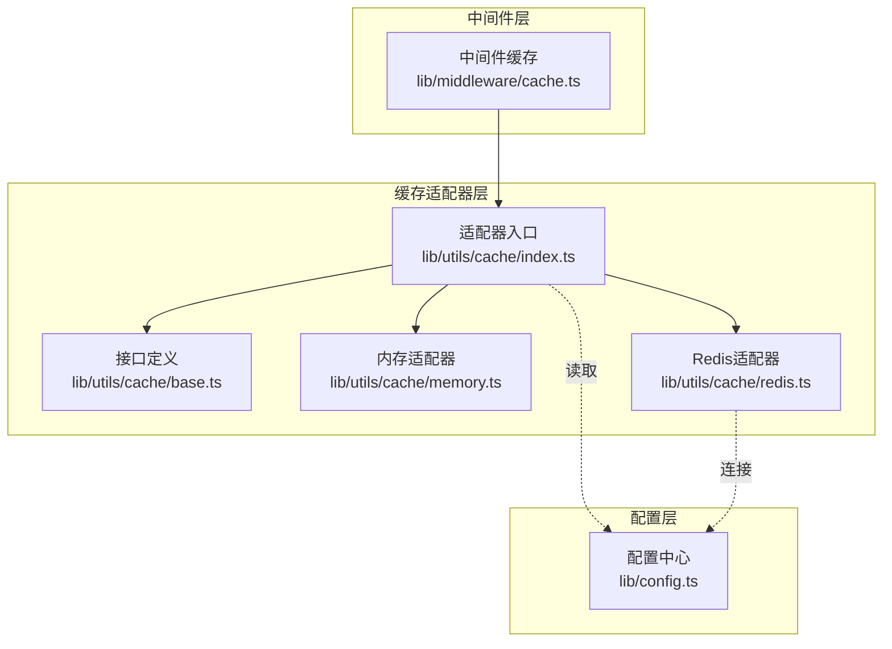
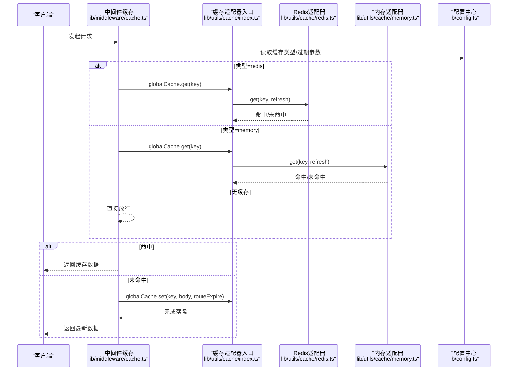
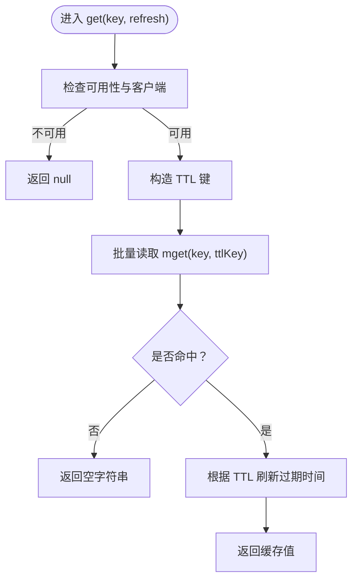
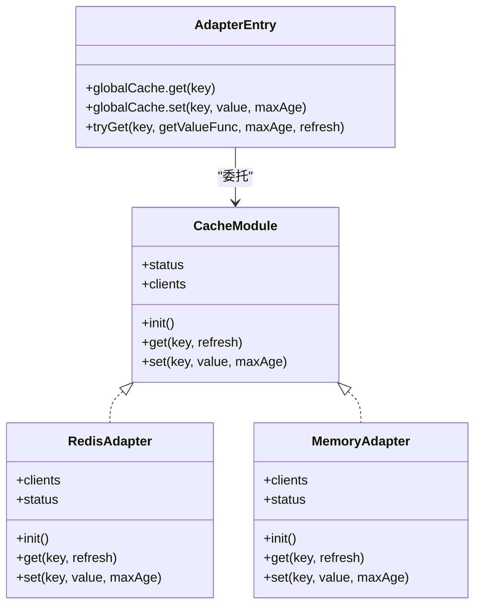
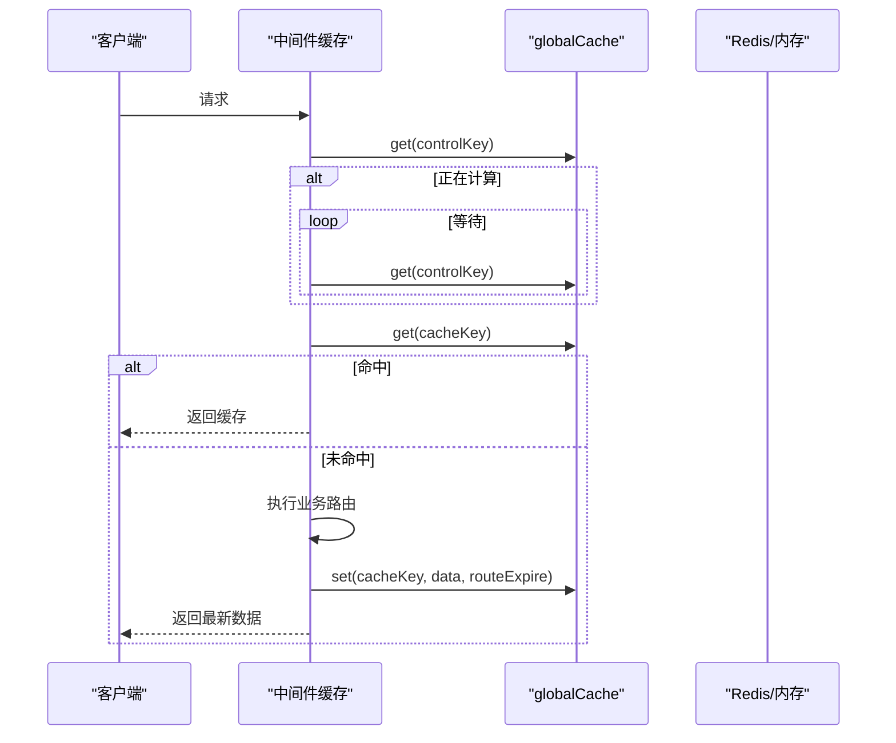
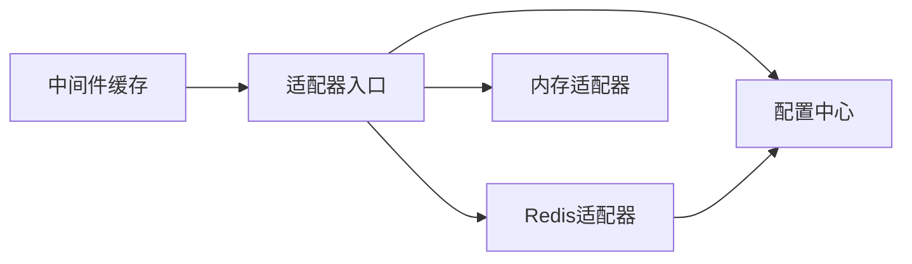

# 读写性能优化

<cite>
**本文引用的文件列表**
- [lib/utils/cache/index.ts](file://lib/utils/cache/index.ts)
- [lib/utils/cache/redis.ts](file://lib/utils/cache/redis.ts)
- [lib/utils/cache/memory.ts](file://lib/utils/cache/memory.ts)
- [lib/utils/cache/base.ts](file://lib/utils/cache/base.ts)
- [lib/middleware/cache.ts](file://lib/middleware/cache.ts)
- [lib/config.ts](file://lib/config.ts)
- [lib/middleware/cache.test.ts](file://lib/middleware/cache.test.ts)
- [lib/utils/cache.test.ts](file://lib/utils/cache.test.ts)
- [lib/utils/wait.ts](file://lib/utils/wait.ts)
- [lib/routes/telegram/channel-media.ts](file://lib/routes/telegram/channel-media.ts)
</cite>

## 目录
1. [简介](#简介)
2. [项目结构与定位](#项目结构与定位)
3. [核心组件](#核心组件)
4. [架构总览](#架构总览)
5. [关键组件深度解析](#关键组件深度解析)
6. [依赖关系分析](#依赖关系分析)
7. [性能考量与优化建议](#性能考量与优化建议)
8. [故障排查指南](#故障排查指南)
9. [结论](#结论)
10. [附录：基准测试与最佳实践](#附录：基准测试与最佳实践)

## 简介
本文件聚焦RSSHub缓存系统的读写性能优化，围绕异步读写、批量操作、连接池管理与并发控制展开，解释如何通过异步非阻塞I/O提升吞吐量，如何利用批量获取/批量存储降低RTT与CPU开销，并结合Redis连接状态与配置参数分析其对性能的影响。同时给出可落地的基准测试方法与高并发场景下的最佳实践。

## 项目结构与定位
RSSHub的缓存子系统位于工具层，采用“模块化适配器”模式：
- 适配器接口定义于基础模块，统一对外暴露初始化、get、set、状态与客户端句柄等能力
- 内置两种后端：内存LRU与Redis
- 中间件层负责请求级并发控制与命中/未命中路径
- 配置层提供运行期参数（缓存类型、过期策略、Redis地址等）

图表来源
- [lib/middleware/cache.ts](file://lib/middleware/cache.ts#L1-L84)
- [lib/utils/cache/index.ts](file://lib/utils/cache/index.ts#L1-L100)
- [lib/utils/cache/base.ts](file://lib/utils/cache/base.ts#L1-L17)
- [lib/utils/cache/memory.ts](file://lib/utils/cache/memory.ts#L1-L44)
- [lib/utils/cache/redis.ts](file://lib/utils/cache/redis.ts#L1-L77)
- [lib/config.ts](file://lib/config.ts#L734-L760)

章节来源
- [lib/utils/cache/index.ts](file://lib/utils/cache/index.ts#L1-L100)
- [lib/utils/cache/redis.ts](file://lib/utils/cache/redis.ts#L1-L77)
- [lib/utils/cache/memory.ts](file://lib/utils/cache/memory.ts#L1-L44)
- [lib/middleware/cache.ts](file://lib/middleware/cache.ts#L1-L84)
- [lib/config.ts](file://lib/config.ts#L734-L760)

## 核心组件
- 适配器接口与选择逻辑
  - 依据配置选择内存或Redis适配器；若禁用则降级为不可用状态
  - 提供全局缓存访问器，封装不同后端的get/set差异
- Redis适配器
  - 初始化连接，监听错误/断连事件，维护可用性状态
  - 支持批量读取（mget）与按需刷新TTL
- 内存适配器
  - 基于LRU缓存，支持TTL与容量限制
- 中间件缓存
  - 请求级并发控制：同一路径在同一窗口内仅允许一次计算
  - 命中直接返回，未命中才执行业务路由并落盘

章节来源
- [lib/utils/cache/index.ts](file://lib/utils/cache/index.ts#L1-L100)
- [lib/utils/cache/redis.ts](file://lib/utils/cache/redis.ts#L1-L77)
- [lib/utils/cache/memory.ts](file://lib/utils/cache/memory.ts#L1-L44)
- [lib/middleware/cache.ts](file://lib/middleware/cache.ts#L1-L84)

## 架构总览
下图展示从HTTP请求到缓存读写的完整链路，以及并发控制与批量读取的关键节点。

图表来源
- [lib/middleware/cache.ts](file://lib/middleware/cache.ts#L1-L84)
- [lib/utils/cache/index.ts](file://lib/utils/cache/index.ts#L1-L100)
- [lib/utils/cache/redis.ts](file://lib/utils/cache/redis.ts#L1-L77)
- [lib/utils/cache/memory.ts](file://lib/utils/cache/memory.ts#L1-L44)
- [lib/config.ts](file://lib/config.ts#L734-L760)

## 关键组件深度解析

### 组件A：Redis适配器（异步读写与批量读取）
- 异步读写
  - get/set均为异步函数，内部使用Redis客户端的异步API
  - 通过mget一次性读取主值与TTL键，减少RTT
- TTL刷新策略
  - 命中时根据TTL键更新主键与TTL键的过期时间
  - 若未显式设置TTL键，则使用默认内容过期时间
- 连接状态管理
  - 订阅error/end/connect事件，维护可用性标志位
  - 可用于降级或快速失败

图表来源
- [lib/utils/cache/redis.ts](file://lib/utils/cache/redis.ts#L1-L77)

章节来源
- [lib/utils/cache/redis.ts](file://lib/utils/cache/redis.ts#L1-L77)

### 组件B：内存适配器（LRU与TTL）
- LRU容量与TTL
  - 使用LRU缓存，基于max与ttl控制容量与生命周期
  - get/set均支持refresh参数，影响LRU年龄更新策略
- 适用场景
  - 低延迟、高QPS但数据体量有限的场景
  - 与Redis相比，避免网络RTT，但不具备持久化与跨进程共享能力

章节来源
- [lib/utils/cache/memory.ts](file://lib/utils/cache/memory.ts#L1-L44)

### 组件C：缓存适配器入口与全局缓存
- 适配器选择
  - 根据配置选择redis或memory，动态绑定globalCache.get/set
- tryGet
  - 提供“先读缓存，缺失再拉取并回填”的原子流程
  - 自动JSON解析与类型安全提示

图表来源
- [lib/utils/cache/base.ts](file://lib/utils/cache/base.ts#L1-L17)
- [lib/utils/cache/redis.ts](file://lib/utils/cache/redis.ts#L1-L77)
- [lib/utils/cache/memory.ts](file://lib/utils/cache/memory.ts#L1-L44)
- [lib/utils/cache/index.ts](file://lib/utils/cache/index.ts#L1-L100)

章节来源
- [lib/utils/cache/index.ts](file://lib/utils/cache/index.ts#L1-L100)
- [lib/utils/cache/base.ts](file://lib/utils/cache/base.ts#L1-L17)

### 组件D：中间件缓存（并发控制与命中路径）
- 并发控制
  - 对同一路径+格式+limit组合生成唯一key，使用controlKey标记“正在计算”
  - 若检测到正在计算，等待固定间隔直至结束或超时
- 命中/未命中
  - 命中：直接返回缓存数据，设置响应头
  - 未命中：执行业务路由，成功后落盘
- 特殊路由
  - 某些媒体类路由会主动解除锁，避免长时间占用

图表来源
- [lib/middleware/cache.ts](file://lib/middleware/cache.ts#L1-L84)
- [lib/utils/cache/index.ts](file://lib/utils/cache/index.ts#L1-L100)

章节来源
- [lib/middleware/cache.ts](file://lib/middleware/cache.ts#L1-L84)
- [lib/routes/telegram/channel-media.ts](file://lib/routes/telegram/channel-media.ts#L142-L146)

## 依赖关系分析
- 组件耦合
  - 中间件依赖适配器入口与配置中心
  - 适配器入口依赖具体后端实现与配置中心
  - Redis适配器依赖ioredis客户端与配置中心
- 外部依赖
  - Redis客户端库（ioredis），负责连接、命令发送与事件回调
  - LRU缓存库（lru-cache），负责内存缓存的淘汰与过期
- 潜在循环依赖
  - 当前结构清晰，无直接循环导入

图表来源
- [lib/middleware/cache.ts](file://lib/middleware/cache.ts#L1-L84)
- [lib/utils/cache/index.ts](file://lib/utils/cache/index.ts#L1-L100)
- [lib/utils/cache/redis.ts](file://lib/utils/cache/redis.ts#L1-L77)
- [lib/utils/cache/memory.ts](file://lib/utils/cache/memory.ts#L1-L44)
- [lib/config.ts](file://lib/config.ts#L734-L760)

章节来源
- [lib/middleware/cache.ts](file://lib/middleware/cache.ts#L1-L84)
- [lib/utils/cache/index.ts](file://lib/utils/cache/index.ts#L1-L100)
- [lib/utils/cache/redis.ts](file://lib/utils/cache/redis.ts#L1-L77)
- [lib/utils/cache/memory.ts](file://lib/utils/cache/memory.ts#L1-L44)
- [lib/config.ts](file://lib/config.ts#L734-L760)

## 性能考量与优化建议

### 异步非阻塞I/O与吞吐提升
- 使用异步API
  - Redis适配器的get/set均为异步，避免阻塞事件循环
  - 中间件在等待期间不阻塞其他请求
- 批量读取降低RTT
  - Redis适配器使用mget同时读取主值与TTL键，减少往返
- 并发控制避免风暴
  - 同一路径在同一窗口内仅一次计算，其余请求等待，避免重复抓取

章节来源
- [lib/utils/cache/redis.ts](file://lib/utils/cache/redis.ts#L1-L77)
- [lib/middleware/cache.ts](file://lib/middleware/cache.ts#L1-L84)

### 批量获取与批量存储的实现机制与优势
- 批量获取
  - Redis适配器在命中时使用mget同时获取内容与TTL键，随后统一刷新过期时间
  - 优势：减少一次RTT，降低CPU与网络开销
- 批量存储
  - 适配器入口在选择后端时，将globalCache.set委托给对应后端
  - Redis后端使用单条SET命令带EX参数设置过期时间，避免额外EXPIRE调用
  - 内存后端使用LRU的set接口，具备TTL与容量控制

章节来源
- [lib/utils/cache/redis.ts](file://lib/utils/cache/redis.ts#L1-L77)
- [lib/utils/cache/memory.ts](file://lib/utils/cache/memory.ts#L1-L44)
- [lib/utils/cache/index.ts](file://lib/utils/cache/index.ts#L1-L100)

### Redis连接池与配置参数对性能的影响
- 连接可用性与降级
  - 适配器订阅error/end/connect事件，维护可用性状态
  - 当连接异常或断开时，后续读写可能返回null或降级行为
- 关键配置项
  - 缓存类型：决定使用Redis还是内存
  - 内容过期与路由过期：影响缓存命中率与内存占用
  - Redis地址：决定网络RTT与可用性
- 连接池管理
  - 代码中未显式创建自定义连接池参数，使用默认ioredis行为
  - 在高并发场景建议结合部署环境与Redis实例能力，评估连接数上限与超时策略

章节来源
- [lib/utils/cache/redis.ts](file://lib/utils/cache/redis.ts#L1-L77)
- [lib/config.ts](file://lib/config.ts#L734-L760)

### 高并发场景最佳实践
- 合理设置过期时间
  - 内容过期与路由过期应匹配业务热点周期，避免频繁失效导致抖动
- 控制并发窗口
  - 中间件已内置同一路径并发控制，避免风暴
- 避免长耗时路由进入缓存
  - 对媒体类等长耗时路由可主动释放锁，减少等待
- 选择合适后端
  - 热点且跨进程共享：优先Redis
  - 本地短命数据：优先内存LRU

章节来源
- [lib/middleware/cache.ts](file://lib/middleware/cache.ts#L1-L84)
- [lib/routes/telegram/channel-media.ts](file://lib/routes/telegram/channel-media.ts#L142-L146)

## 故障排查指南
- 缓存不可用
  - 当缓存类型被禁用或连接异常时，中间件会直接放行，不会限制并发
- Redis连接错误
  - 适配器记录错误日志并置为不可用，后续读写返回null
- 测试验证
  - 单测覆盖了Redis连接关闭、错误URL、禁用缓存等场景
  - 中间件测试验证了命中、过期、并发等待与错误处理

章节来源
- [lib/utils/cache.test.ts](file://lib/utils/cache.test.ts#L1-L92)
- [lib/middleware/cache.test.ts](file://lib/middleware/cache.test.ts#L1-L190)
- [lib/utils/cache/redis.ts](file://lib/utils/cache/redis.ts#L1-L77)

## 结论
RSSHub缓存系统通过“适配器+中间件”的分层设计，在保证易用性的同时提供了良好的性能扩展点。Redis适配器采用异步I/O与批量读取，中间件实现请求级并发控制，整体在高并发下具备较好的稳定性与吞吐表现。针对连接池与超时等更细粒度的参数，可在部署层面结合Redis实例能力进行优化。

## 附录：基准测试与最佳实践

### 基准测试方法
- 场景一：纯命中率测试
  - 使用中间件测试用例思路，构造相同路径+查询参数，统计命中率与响应时间
  - 参考路径：[lib/middleware/cache.test.ts](file://lib/middleware/cache.test.ts#L1-L190)
- 场景二：并发风暴测试
  - 同一路径短时间内发起大量请求，验证中间件并发控制是否生效
  - 参考路径：[lib/middleware/cache.ts](file://lib/middleware/cache.ts#L1-L84)
- 场景三：Redis可用性测试
  - 断开/重启Redis，观察缓存降级与错误日志
  - 参考路径：[lib/utils/cache.test.ts](file://lib/utils/cache.test.ts#L1-L92)

### 优化建议
- 读取路径
  - 优先使用Redis适配器的mget批量读取，减少RTT
  - 对热点键启用TTL刷新，避免过早过期
- 写入路径
  - 使用单条SET命令带EX参数，避免额外EXPIRE调用
  - 对长耗时路由主动释放锁，缩短等待时间
- 连接与超时
  - 在部署层面评估Redis连接数与超时策略，确保高并发稳定
  - 监控连接错误事件，及时发现网络或服务端问题