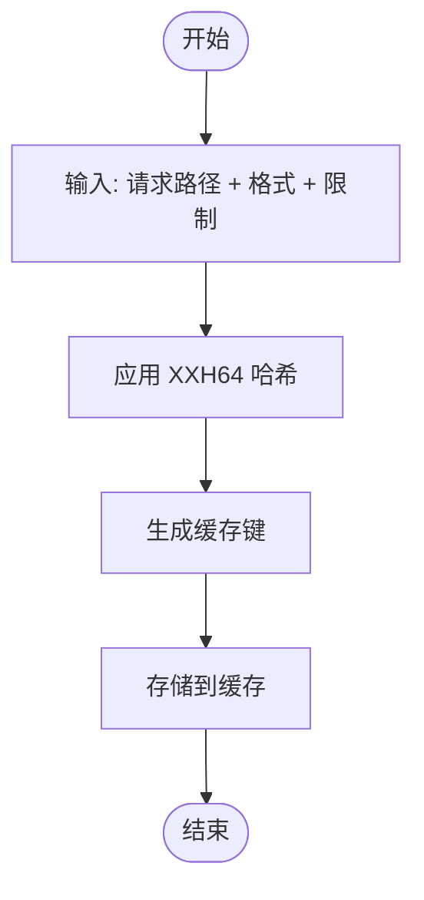
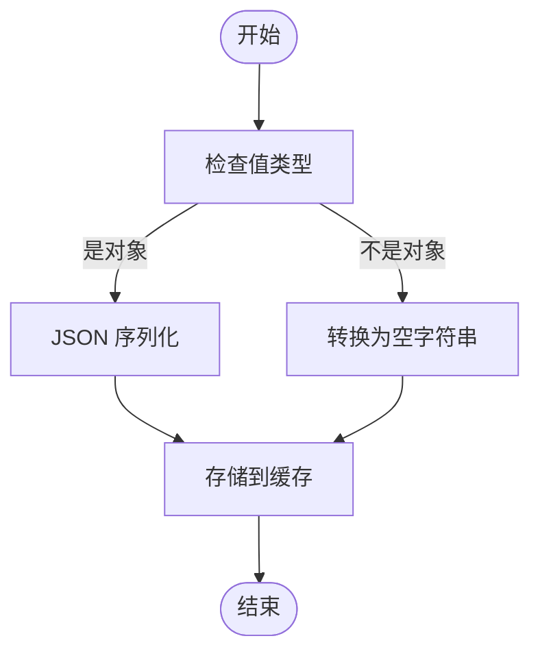
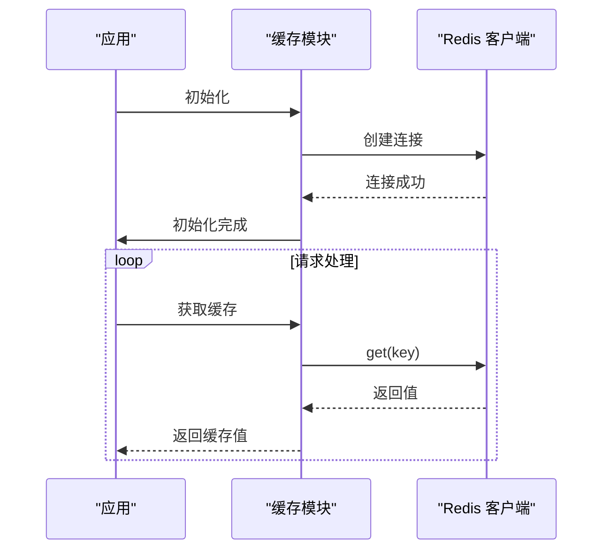
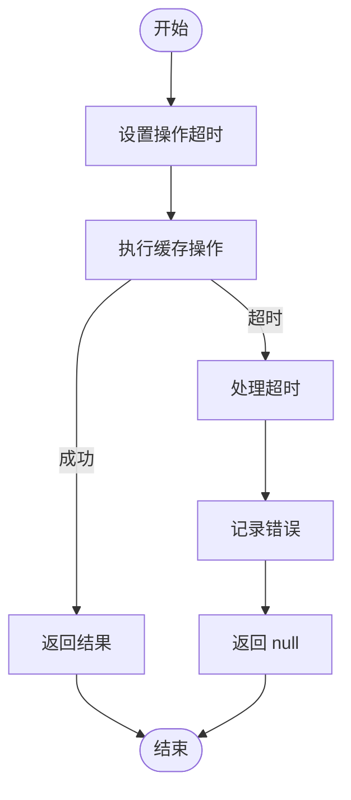
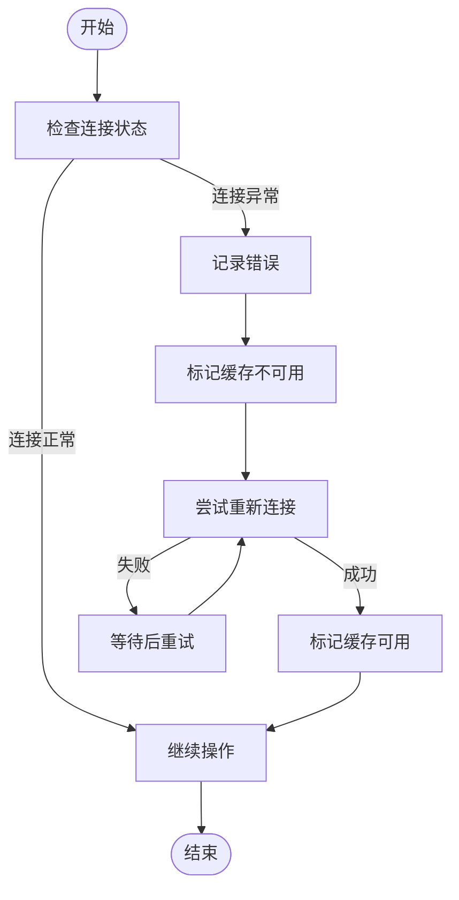
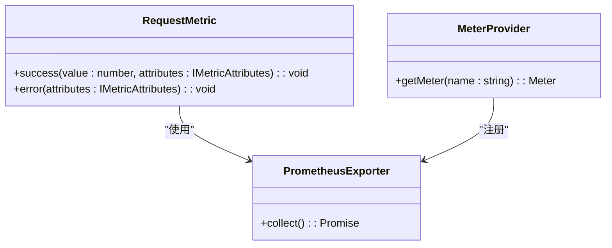
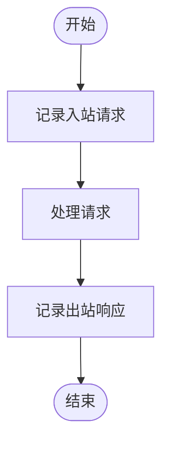
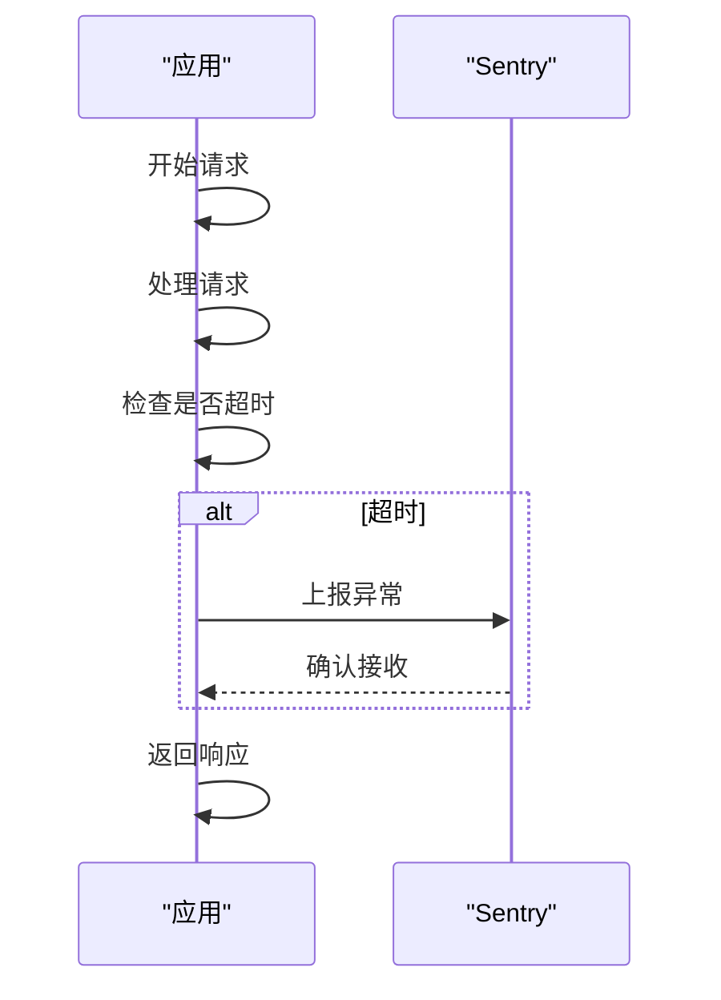
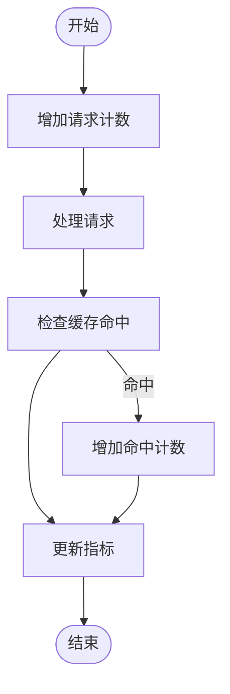
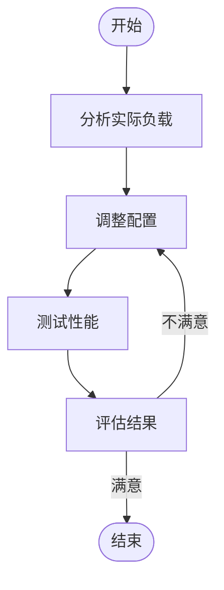

# 资源管理优化

<cite>
**本文档引用的文件**
- [cache.ts](file://lib/middleware/cache.ts)
- [cache.test.ts](file://lib/middleware/cache.test.ts)
- [index.ts](file://lib/utils/cache/index.ts)
- [memory.ts](file://lib/utils/cache/memory.ts)
- [redis.ts](file://lib/utils/cache/redis.ts)
- [base.ts](file://lib/utils/cache/base.ts)
- [config.ts](file://lib/config.ts)
- [metric.ts](file://lib/utils/otel/metric.ts)
- [trace.ts](file://lib/utils/otel/trace.ts)
- [logger.ts](file://lib/utils/logger.ts)
- [debug.ts](file://lib/middleware/debug.ts)
- [debug-info.ts](file://lib/utils/debug-info.ts)
</cite>

## 目录
1. [引言](#引言)
2. [内存使用效率优化](#内存使用效率优化)
3. [连接管理策略](#连接管理策略)
4. [性能监控系统](#性能监控系统)
5. [资源使用分析与调优建议](#资源使用分析与调优建议)
6. [结论](#结论)

## 引言
RSSHub 是一个开源的 RSS 生成器，其缓存系统在资源管理方面进行了多项优化，以提高内存使用效率、优化连接管理和增强性能监控能力。本文档全面介绍 RSSHub 缓存系统的资源管理优化方案，包括内存使用效率、连接管理和性能监控。详细说明如何通过数据压缩、序列化优化和内存回收机制降低内存占用。描述连接管理策略，包括连接复用、超时控制和错误处理。解释性能监控系统的实现，包括关键指标采集、日志记录和告警机制。提供资源使用分析工具和调优建议，帮助用户根据实际负载优化资源配置。

**Section sources**
- [cache.ts](file://lib/middleware/cache.ts#L1-L84)
- [config.ts](file://lib/config.ts#L263-L272)

## 内存使用效率优化

RSSHub 缓存系统通过多种机制优化内存使用效率，包括数据压缩、序列化优化和内存回收。

### 数据压缩与键值优化
为了减少缓存键的大小，RSSHub 使用 XXH64 哈希算法对请求路径、格式和限制参数进行哈希处理，生成较短的键。这不仅减少了内存占用，还提高了缓存查找的效率。



**Diagram sources**
- [cache.ts](file://lib/middleware/cache.ts#L22-L23)

### 序列化优化
在将数据存储到缓存之前，RSSHub 会对对象进行 JSON 序列化。对于非对象类型的值，系统会将其转换为空字符串，确保数据的一致性和可预测性。



**Diagram sources**
- [index.ts](file://lib/utils/cache/index.ts#L42-L43)
- [memory.ts](file://lib/utils/cache/memory.ts#L35-L36)
- [redis.ts](file://lib/utils/cache/redis.ts#L64-L65)

### 内存回收机制
RSSHub 使用 LRU（最近最少使用）算法来管理内存缓存。当缓存达到最大容量时，最久未使用的条目将被自动清除，确保内存的有效利用。

```mermaid
classDiagram
class LRUCache {
+ttl : number
+max : number
+get(key : string) : string | undefined
+set(key : string, value : string) : void
}
class MemoryCache {
-clients : { memoryCache? : LRUCache<any, any> }
+init() : void
+get(key : string, refresh : boolean) : string | null
+set(key : string, value : string, maxAge : number) : void
}
MemoryCache --> LRUCache : "使用"
```

**Diagram sources**
- [memory.ts](file://lib/utils/cache/memory.ts#L14-L17)

**Section sources**
- [memory.ts](file://lib/utils/cache/memory.ts#L1-L44)
- [index.ts](file://lib/utils/cache/index.ts#L39-L47)

## 连接管理策略

RSSHub 的缓存系统支持多种缓存类型，包括内存缓存和 Redis 缓存。连接管理策略确保了连接的高效复用、超时控制和错误处理。

### 连接复用
对于 Redis 缓存，RSSHub 在初始化时创建一个全局的 Redis 客户端实例，并在整个应用生命周期中复用该连接，避免了频繁创建和销毁连接的开销。



**Diagram sources**
- [redis.ts](file://lib/utils/cache/redis.ts#L21-L34)

### 超时控制
RSSHub 为缓存操作设置了合理的超时时间，防止因网络延迟或服务器故障导致请求长时间挂起。同时，系统还实现了请求超时控制，确保在高并发场景下不会因单个请求阻塞整个系统。



**Diagram sources**
- [config.ts](file://lib/config.ts#L266-L267)
- [redis.ts](file://lib/utils/cache/redis.ts#L37-L55)

### 错误处理
当 Redis 连接出现错误时，RSSHub 会记录错误日志并标记缓存不可用。系统还会定期尝试重新连接，确保在 Redis 服务恢复后能够自动恢复正常工作。



**Diagram sources**
- [redis.ts](file://lib/utils/cache/redis.ts#L24-L34)

**Section sources**
- [redis.ts](file://lib/utils/cache/redis.ts#L1-L78)
- [config.ts](file://lib/config.ts#L273-L274)

## 性能监控系统

RSSHub 的性能监控系统通过采集关键指标、记录日志和设置告警机制，帮助开发者和运维人员及时发现和解决问题。

### 关键指标采集
系统使用 OpenTelemetry 采集请求总数、错误总数、请求持续时间等关键指标，并通过 Prometheus 导出器暴露给监控系统。



**Diagram sources**
- [metric.ts](file://lib/utils/otel/metric.ts#L34-L45)

### 日志记录
RSSHub 使用 Winston 日志库记录详细的运行日志，包括请求的进出、状态码、响应时间等信息。日志格式化为 JSON，便于后续分析和处理。



**Diagram sources**
- [logger.ts](file://lib/middleware/logger.ts#L33-L41)

### 告警机制
通过 Sentry 集成，RSSHub 可以捕获并上报异常，特别是路由超时等严重问题。系统会在请求耗时超过预设阈值时触发告警，帮助快速定位性能瓶颈。



**Diagram sources**
- [sentry.ts](file://lib/middleware/sentry.ts#L18-L24)

**Section sources**
- [metric.ts](file://lib/utils/otel/metric.ts#L1-L69)
- [logger.ts](file://lib/middleware/logger.ts#L1-L45)
- [sentry.ts](file://lib/middleware/sentry.ts#L1-L28)

## 资源使用分析与调优建议

RSSHub 提供了多种工具和配置选项，帮助用户分析资源使用情况并进行调优。

### 缓存命中率分析
通过调试中间件，RSSHub 记录了缓存命中次数、总请求数等信息，计算缓存命中率，帮助评估缓存效果。



**Diagram sources**
- [debug.ts](file://lib/middleware/debug.ts#L7-L37)
- [debug-info.ts](file://lib/utils/debug-info.ts#L1-L24)

### 配置调优建议
根据实际负载情况，用户可以通过调整以下配置来优化资源使用：
- `CACHE_TYPE`: 选择合适的缓存类型（memory 或 redis）
- `MEMORY_MAX`: 设置内存缓存的最大条目数
- `CACHE_EXPIRE`: 调整路由缓存过期时间
- `CACHE_CONTENT_EXPIRE`: 调整内容缓存过期时间



**Diagram sources**
- [config.ts](file://lib/config.ts#L263-L272)

**Section sources**
- [debug.ts](file://lib/middleware/debug.ts#L1-L40)
- [debug-info.ts](file://lib/utils/debug-info.ts#L1-L24)
- [config.ts](file://lib/config.ts#L263-L272)

## 结论
RSSHub 的缓存系统通过一系列精心设计的优化措施，在内存使用效率、连接管理和性能监控方面表现出色。通过数据压缩、序列化优化和内存回收机制，系统有效降低了内存占用；通过连接复用、超时控制和错误处理，确保了连接的稳定性和可靠性；通过关键指标采集、日志记录和告警机制，提供了全面的性能监控能力。这些优化不仅提升了系统的整体性能，也为用户提供了强大的资源使用分析和调优工具，帮助其根据实际需求进行精细化配置。