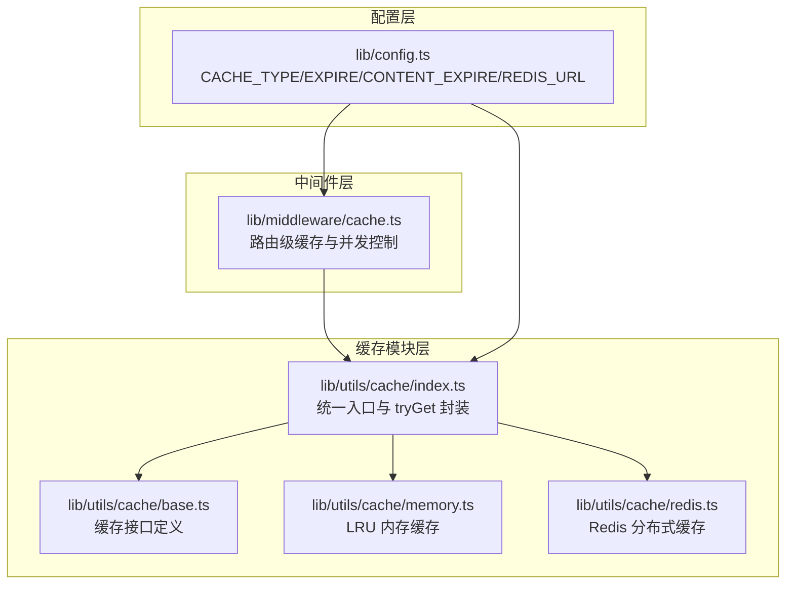
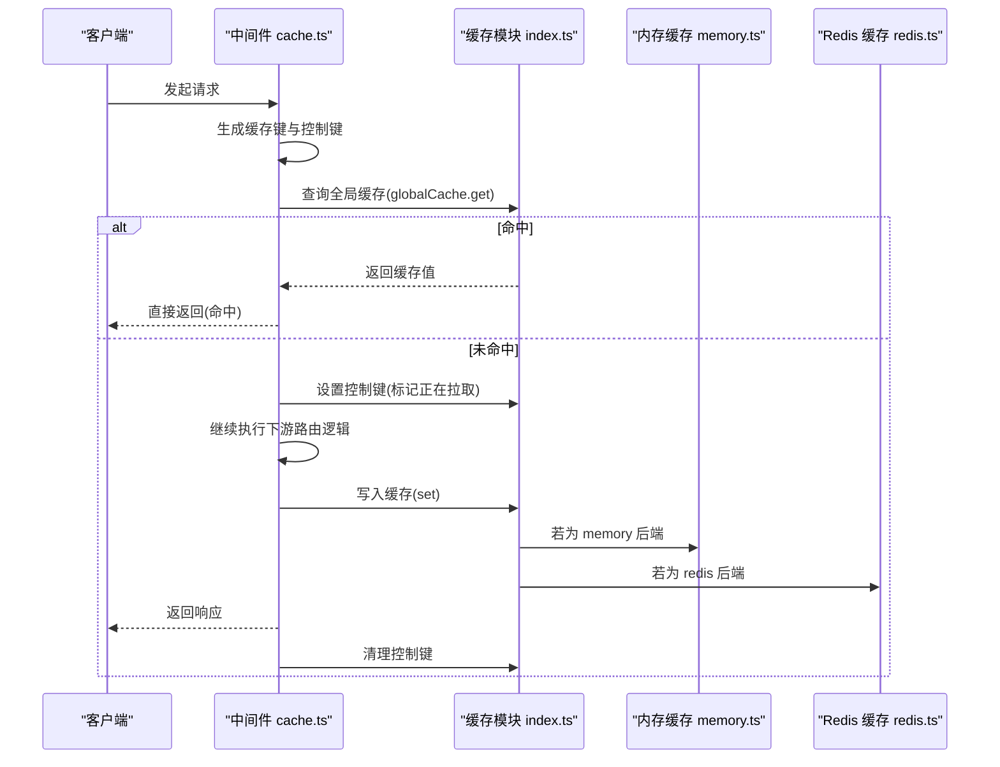
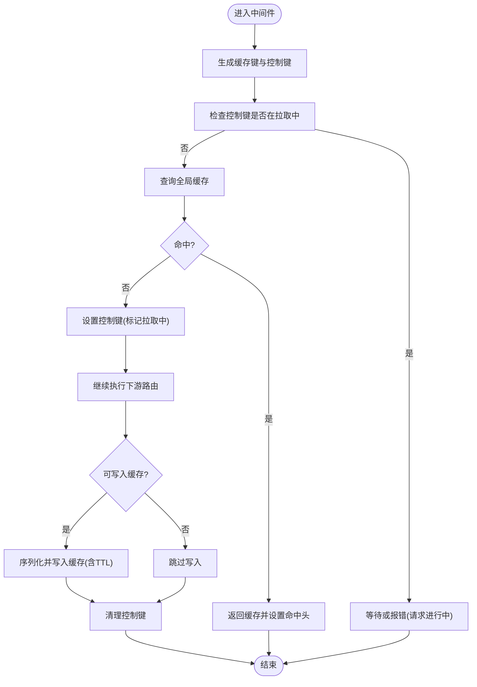
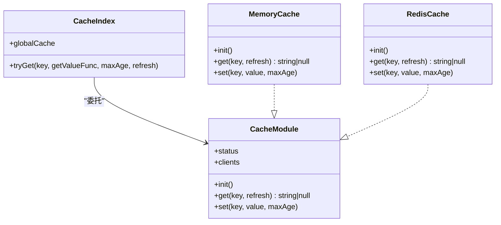
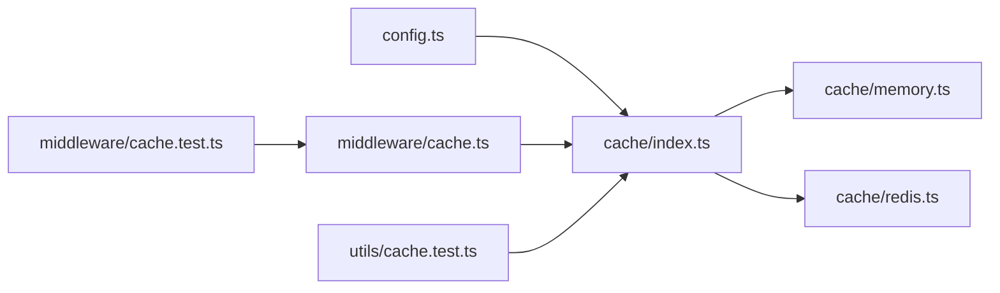

# 缓存策略

<cite>
**本文引用的文件列表**
- [lib/middleware/cache.ts](file://lib/middleware/cache.ts)
- [lib/utils/cache/index.ts](file://lib/utils/cache/index.ts)
- [lib/utils/cache/base.ts](file://lib/utils/cache/base.ts)
- [lib/utils/cache/memory.ts](file://lib/utils/cache/memory.ts)
- [lib/utils/cache/redis.ts](file://lib/utils/cache/redis.ts)
- [lib/config.ts](file://lib/config.ts)
- [lib/middleware/cache.test.ts](file://lib/middleware/cache.test.ts)
- [lib/utils/cache.test.ts](file://lib/utils/cache.test.ts)
- [lib/routes/zaker/utils.ts](file://lib/routes/zaker/utils.ts)
- [lib/routes/newrank/utils.ts](file://lib/routes/newrank/utils.ts)
</cite>

## 目录
1. [简介](#简介)
2. [项目结构与入口](#项目结构与入口)
3. [核心组件](#核心组件)
4. [架构总览](#架构总览)
5. [关键组件深度解析](#关键组件深度解析)
6. [依赖关系分析](#依赖关系分析)
7. [性能与容量特性](#性能与容量特性)
8. [故障排查指南](#故障排查指南)
9. [结论](#结论)
10. [附录：配置与最佳实践](#附录配置与最佳实践)

## 简介
本文件围绕 RSSHub 的缓存系统进行系统化分析，重点覆盖：
- 缓存键生成规则与层级结构
- 过期时间管理与 TTL 策略
- 分布式缓存实现（基于 Redis）
- 并发控制与请求去重
- LRU 与 TTL 的协同工作方式
- 缓存穿透、击穿、雪崩的应对思路
- 配置项与不同内容源的缓存时间建议
- 性能影响与策略调优

## 项目结构与入口
RSSHub 的缓存体系由三层组成：
- 中间件层：负责路由级缓存命中、并发控制与键生成
- 缓存模块层：抽象内存与 Redis 两种后端，统一对外接口
- 配置层：集中定义缓存类型、过期时间、Redis 地址等

图表来源
- [lib/middleware/cache.ts](file://lib/middleware/cache.ts#L1-L84)
- [lib/utils/cache/index.ts](file://lib/utils/cache/index.ts#L1-L101)
- [lib/utils/cache/base.ts](file://lib/utils/cache/base.ts#L1-L18)
- [lib/utils/cache/memory.ts](file://lib/utils/cache/memory.ts#L1-L45)
- [lib/utils/cache/redis.ts](file://lib/utils/cache/redis.ts#L1-L56)
- [lib/config.ts](file://lib/config.ts#L735-L768)

章节来源
- [lib/middleware/cache.ts](file://lib/middleware/cache.ts#L1-L84)
- [lib/utils/cache/index.ts](file://lib/utils/cache/index.ts#L1-L101)
- [lib/utils/cache/base.ts](file://lib/utils/cache/base.ts#L1-L18)
- [lib/utils/cache/memory.ts](file://lib/utils/cache/memory.ts#L1-L45)
- [lib/utils/cache/redis.ts](file://lib/utils/cache/redis.ts#L1-L56)
- [lib/config.ts](file://lib/config.ts#L735-L768)

## 核心组件
- 路由级缓存中间件：负责生成缓存键、并发控制、命中返回、写入缓存
- 缓存模块：统一对外 get/set 接口，按配置选择内存或 Redis 后端
- 内存缓存：基于 LRU，支持 TTL；适合单实例或小规模部署
- Redis 缓存：支持分布式共享，具备持久化与高可用能力
- 配置中心：集中管理缓存类型、过期时间、Redis 地址等

章节来源
- [lib/middleware/cache.ts](file://lib/middleware/cache.ts#L1-L84)
- [lib/utils/cache/index.ts](file://lib/utils/cache/index.ts#L1-L101)
- [lib/utils/cache/memory.ts](file://lib/utils/cache/memory.ts#L1-L45)
- [lib/utils/cache/redis.ts](file://lib/utils/cache/redis.ts#L1-L56)
- [lib/config.ts](file://lib/config.ts#L735-L768)

## 架构总览
下面以“请求到响应”的视角展示缓存链路与并发控制：

图表来源
- [lib/middleware/cache.ts](file://lib/middleware/cache.ts#L1-L84)
- [lib/utils/cache/index.ts](file://lib/utils/cache/index.ts#L1-L101)
- [lib/utils/cache/memory.ts](file://lib/utils/cache/memory.ts#L1-L45)
- [lib/utils/cache/redis.ts](file://lib/utils/cache/redis.ts#L1-L56)

## 关键组件深度解析

### 1) 路由级缓存中间件（并发控制与键生成）
- 键生成规则
  - 基础键：包含路径、格式(format)、限制(limit)等参数，使用哈希函数压缩长度
  - 控制键：用于并发控制，避免同一路径在短时间内重复拉取
- 并发控制
  - 未命中时设置控制键并在配置的超时时间内避免重复拉取
  - 若超时仍未完成，抛出特定错误，提示稍后再试
- 命中与写入
  - 命中：直接返回缓存数据，并设置响应头标识
  - 未命中：执行下游逻辑，成功后写入缓存，同时清理控制键

图表来源
- [lib/middleware/cache.ts](file://lib/middleware/cache.ts#L1-L84)

章节来源
- [lib/middleware/cache.ts](file://lib/middleware/cache.ts#L1-L84)

### 2) 缓存模块统一入口与 tryGet
- 统一接口
  - get/set：面向上游模块的统一访问
  - tryGet：先查缓存，未命中则调用回调函数获取数据并写入缓存
- 后端选择
  - memory：LRU + TTL
  - redis：分布式键值存储
  - 无缓存：禁用缓存功能

图表来源
- [lib/utils/cache/index.ts](file://lib/utils/cache/index.ts#L1-L101)
- [lib/utils/cache/base.ts](file://lib/utils/cache/base.ts#L1-L18)
- [lib/utils/cache/memory.ts](file://lib/utils/cache/memory.ts#L1-L45)
- [lib/utils/cache/redis.ts](file://lib/utils/cache/redis.ts#L1-L56)

章节来源
- [lib/utils/cache/index.ts](file://lib/utils/cache/index.ts#L1-L101)
- [lib/utils/cache/base.ts](file://lib/utils/cache/base.ts#L1-L18)

### 3) 内存缓存（LRU + TTL）
- LRU 容量上限：由配置项决定
- TTL：按内容类型分别设置 routeExpire/contentExpire
- 访问刷新：支持按需刷新访问时间

章节来源
- [lib/utils/cache/memory.ts](file://lib/utils/cache/memory.ts#L1-L45)
- [lib/config.ts](file://lib/config.ts#L735-L768)

### 4) Redis 分布式缓存
- 初始化：从配置读取 Redis URL，建立连接
- TTL 管理：内部维护“缓存TTL键”，用于记录每个缓存项的过期时间
- 访问刷新：命中时根据 TTL 键更新主键与 TTL 键的过期时间

章节来源
- [lib/utils/cache/redis.ts](file://lib/utils/cache/redis.ts#L1-L56)
- [lib/config.ts](file://lib/config.ts#L745-L747)

### 5) 配置项与默认值
- CACHE_TYPE：缓存类型(memory/redis/禁用)
- CACHE_EXPIRE：路由级缓存过期时间（秒）
- CACHE_CONTENT_EXPIRE：不变内容缓存过期时间（秒）
- MEMORY_MAX：内存缓存最大条目数
- REDIS_URL：Redis 连接地址

章节来源
- [lib/config.ts](file://lib/config.ts#L23-L28)
- [lib/config.ts](file://lib/config.ts#L735-L768)

## 依赖关系分析
- 中间件依赖缓存模块提供的全局缓存接口
- 缓存模块根据配置动态绑定具体后端（memory/redis）
- Redis 后端依赖 ioredis 客户端
- 测试覆盖了内存与 Redis 的行为差异、TTL 键保护、并发控制等

图表来源
- [lib/config.ts](file://lib/config.ts#L735-L768)
- [lib/utils/cache/index.ts](file://lib/utils/cache/index.ts#L1-L101)
- [lib/utils/cache/memory.ts](file://lib/utils/cache/memory.ts#L1-L45)
- [lib/utils/cache/redis.ts](file://lib/utils/cache/redis.ts#L1-L56)
- [lib/middleware/cache.ts](file://lib/middleware/cache.ts#L1-L84)
- [lib/middleware/cache.test.ts](file://lib/middleware/cache.test.ts#L1-L190)
- [lib/utils/cache.test.ts](file://lib/utils/cache.test.ts#L1-L92)

章节来源
- [lib/middleware/cache.test.ts](file://lib/middleware/cache.test.ts#L1-L190)
- [lib/utils/cache.test.ts](file://lib/utils/cache.test.ts#L1-L92)

## 性能与容量特性
- 单机场景（memory）
  - LRU 容量受 MEMORY_MAX 限制，TTL 保证热点数据常驻
  - 适合低并发、小规模部署
- 分布式场景（redis）
  - 支持多实例共享缓存，提升命中率
  - TTL 与访问刷新减少冷数据占用
- 并发控制
  - 控制键避免“击穿”：同一路径在请求期间不重复拉取
  - 通过请求超时与重试策略降低竞争条件

章节来源
- [lib/utils/cache/memory.ts](file://lib/utils/cache/memory.ts#L1-L45)
- [lib/utils/cache/redis.ts](file://lib/utils/cache/redis.ts#L1-L56)
- [lib/middleware/cache.ts](file://lib/middleware/cache.ts#L1-L84)

## 故障排查指南
- Redis 连接异常
  - 现象：缓存读写返回 null，日志出现 Redis 错误
  - 处理：检查 REDIS_URL，确认网络连通性与认证
- 缓存未生效
  - 现象：未命中或命中率低
  - 处理：确认 CACHE_TYPE、CACHE_EXPIRE、CACHE_CONTENT_EXPIRE 设置；检查键生成是否包含必要参数
- 并发冲突
  - 现象：同一路径频繁报“请求进行中”
  - 处理：适当提高 CACHE_REQUEST_TIMEOUT；优化下游路由耗时
- TTL 键冲突
  - 现象：尝试使用内部保留前缀的键会抛错
  - 处理：不要使用以特定前缀开头的自定义键

章节来源
- [lib/utils/cache/redis.ts](file://lib/utils/cache/redis.ts#L1-L56)
- [lib/utils/cache.test.ts](file://lib/utils/cache.test.ts#L1-L92)
- [lib/middleware/cache.test.ts](file://lib/middleware/cache.test.ts#L1-L190)

## 结论
RSSHub 的缓存策略通过“中间件 + 统一缓存模块 + 可插拔后端”的架构实现了灵活、可扩展的缓存能力。其键生成规则清晰、并发控制完善、TTL 管理合理，并在内存与 Redis 之间提供了平滑切换。针对穿透、击穿、雪崩等常见问题，系统通过控制键与 TTL 刷新提供了基础防护。结合业务特征调整过期时间与后端类型，可在性能与一致性之间取得平衡。

## 附录：配置与最佳实践

### A. 配置项说明
- CACHE_TYPE：选择 memory 或 redis；留空或 NO 表示禁用缓存
- CACHE_EXPIRE：路由级缓存过期时间（秒），用于 RSS 输出等变化较快的内容
- CACHE_CONTENT_EXPIRE：不变内容缓存过期时间（秒），用于静态资源或稳定数据
- MEMORY_MAX：内存缓存最大条目数
- REDIS_URL：Redis 连接字符串

章节来源
- [lib/config.ts](file://lib/config.ts#L23-L28)
- [lib/config.ts](file://lib/config.ts#L735-L768)

### B. 键生成与层级
- 基础键：包含路径、format、limit 等参数，经哈希压缩
- 控制键：用于并发控制，避免重复拉取
- 层级结构：以命名空间前缀区分用途（如路由缓存、控制键）

章节来源
- [lib/middleware/cache.ts](file://lib/middleware/cache.ts#L1-L84)

### C. 过期时间与 TTL 策略
- 路由缓存：适用于 RSS 输出、分页等随时间变化的内容
- 内容缓存：适用于静态文本、图片等长期稳定的资源
- Redis 访问刷新：命中时根据 TTL 键延长主键与 TTL 键的过期时间

章节来源
- [lib/config.ts](file://lib/config.ts#L735-L768)
- [lib/utils/cache/redis.ts](file://lib/utils/cache/redis.ts#L1-L56)

### D. 并发控制与请求去重
- 控制键在请求期间设置，其他并发请求等待或报错
- 请求超时与重试策略降低竞争窗口

章节来源
- [lib/middleware/cache.ts](file://lib/middleware/cache.ts#L1-L84)

### E. 缓存穿透、击穿、雪崩的应对思路
- 穿透：对不存在的键也做短 TTL 缓存，避免持续穿透
- 击穿：热点键使用控制键防抖，或预热
- 雪崩：为 TTL 加随机抖动；优先使用 Redis 集群，避免单点

（本节为通用指导，不直接对应具体代码实现）

### F. 不同内容源的缓存时间建议
- 动态列表类（如新闻、微博）：CACHE_EXPIRE 设为分钟级
- 静态页面/图片：CACHE_CONTENT_EXPIRE 设为小时级或更长
- 临时性内容（如验证码、一次性令牌）：极短 TTL 或不缓存

（本节为通用指导，不直接对应具体代码实现）

### G. 实际使用中的缓存示例
- 使用 tryGet 在路由内按需缓存：先查缓存，未命中再抓取并写入
- 使用全局缓存键与控制键：确保并发安全与命中率

章节来源
- [lib/utils/cache/index.ts](file://lib/utils/cache/index.ts#L62-L101)
- [lib/routes/zaker/utils.ts](file://lib/routes/zaker/utils.ts#L48-L154)
- [lib/routes/newrank/utils.ts](file://lib/routes/newrank/utils.ts#L46-L78)