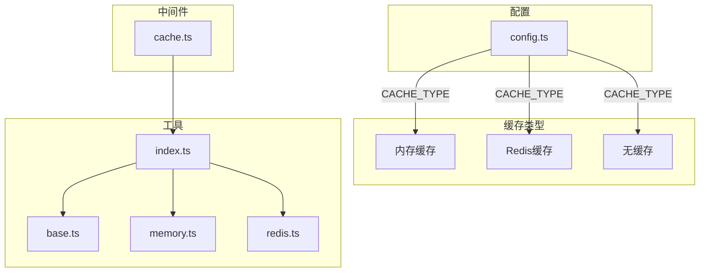
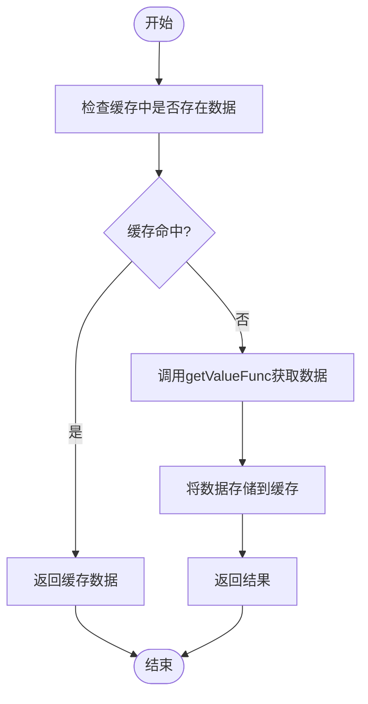
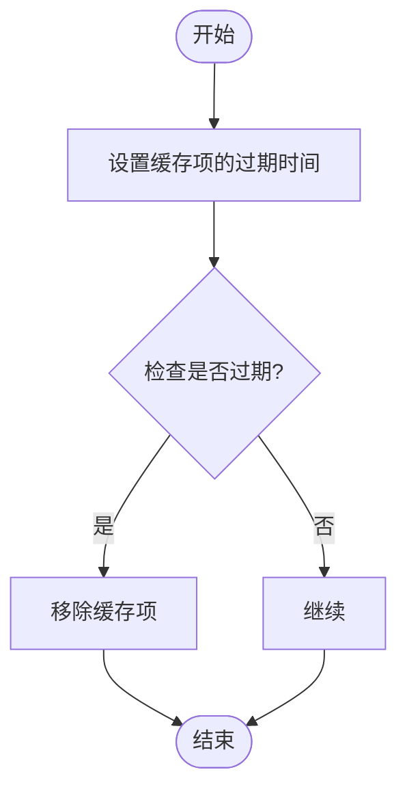

# 缓存操作管理

<cite>
**本文档引用文件**   
- [base.ts](file://lib/utils/cache/base.ts)
- [index.ts](file://lib/utils/cache/index.ts)
- [memory.ts](file://lib/utils/cache/memory.ts)
- [redis.ts](file://lib/utils/cache/redis.ts)
- [cache.ts](file://lib/middleware/cache.ts)
- [config.ts](file://lib/config.ts)
</cite>

## 目录
1. [引言](#引言)
2. [缓存系统架构](#缓存系统架构)
3. [缓存预热机制](#缓存预热机制)
4. [缓存清理策略](#缓存清理策略)
5. [缓存管理API](#缓存管理api)
6. [清理策略适用场景](#清理策略适用场景)
7. [高并发环境下的操作注意事项](#高并发环境下的操作注意事项)
8. [最佳实践](#最佳实践)
9. [结论](#结论)

## 引言
RSSHub的缓存系统是提升系统响应速度和降低后端负载的关键组件。本文档全面介绍RSSHub缓存系统的操作管理功能，包括缓存预热机制的实现和使用方法、缓存清理策略以及缓存管理API的完整文档。通过深入了解这些功能，用户可以有效地管理缓存，提高系统性能，并在高并发环境下保持系统的稳定性和可靠性。

## 缓存系统架构
RSSHub的缓存系统支持多种缓存类型，包括内存缓存和Redis缓存。系统通过配置文件中的`CACHE_TYPE`环境变量来决定使用哪种缓存类型。如果未设置或设置为空，则禁用缓存。



**Diagram sources**
- [config.ts](file://lib/config.ts#L735-L747)
- [cache.ts](file://lib/middleware/cache.ts#L4-L8)
- [index.ts](file://lib/utils/cache/index.ts#L18-L49)

**Section sources**
- [config.ts](file://lib/config.ts#L735-L747)
- [cache.ts](file://lib/middleware/cache.ts#L4-L8)
- [index.ts](file://lib/utils/cache/index.ts#L18-L49)

## 缓存预热机制
缓存预热是一种优化技术，通过预先加载数据到缓存中，以减少首次请求时的延迟。RSSHub的缓存预热机制主要通过`tryGet`方法实现。该方法尝试从缓存中获取数据，如果缓存中不存在，则调用提供的函数获取数据并将其存储在缓存中。

### 实现原理
`tryGet`方法首先检查缓存中是否存在指定键的数据。如果存在，则直接返回缓存中的数据；如果不存在，则调用提供的函数获取数据，并将结果存储在缓存中，然后返回结果。



**Diagram sources**
- [index.ts](file://lib/utils/cache/index.ts#L75-L97)

**Section sources**
- [index.ts](file://lib/utils/cache/index.ts#L75-L97)

### 使用方法
要使用缓存预热功能，可以在路由处理函数中调用`cache.tryGet`方法。例如，在Bilibili模块中，可以通过以下方式预热用户信息：

```typescript
const getUsernameFromUID = (uid) => {
    const key = 'bili-username-from-uid-' + uid;
    return cache.tryGet(key, async () => {
        const cookie = await getCookie();
        const wbiVerifyString = await getWbiVerifyString();
        const params = utils.addWbiVerifyInfo(`mid=${uid}&token=&platform=web&web_location=1550101`, wbiVerifyString);
        const { data: nameResponse } = await got(`https://api.bilibili.com/x/space/wbi/acc/info?${params}`, {
            headers: {
                Referer: `https://space.bilibili.com/${uid}/`,
                Cookie: cookie,
            },
        });
        return nameResponse.data ? nameResponse.data.name : undefined;
    });
};
```

**Section sources**
- [bilibili/cache.ts](file://lib/routes/bilibili/cache.ts#L121-L141)

## 缓存清理策略
RSSHub提供了多种缓存清理策略，包括按键清除、批量清理和基于策略的自动清理。

### 按键清除
按键清除是最基本的清理策略，允许用户根据特定的键来清除缓存。这通常用于更新单个资源的数据。

```typescript
await cache.set('mock', undefined);
```

### 批量清理
批量清理允许用户一次性清除多个缓存项。虽然RSSHub当前没有直接提供批量清理的API，但可以通过遍历键列表并逐个清除来实现。

### 基于策略的自动清理
基于策略的自动清理依赖于缓存的过期时间设置。当缓存项的生存时间（TTL）到期后，它们会自动被清除。此外，还可以通过配置文件中的`CACHE_CONTENT_EXPIRE`和`CACHE_EXPIRE`参数来控制不同类型的缓存项的过期时间。



**Diagram sources**
- [config.ts](file://lib/config.ts#L738-L739)
- [index.ts](file://lib/utils/cache/index.ts#L38-L48)
- [redis.ts](file://lib/utils/cache/redis.ts#L68-L72)

**Section sources**
- [config.ts](file://lib/config.ts#L738-L739)
- [index.ts](file://lib/utils/cache/index.ts#L38-L48)
- [redis.ts](file://lib/utils/cache/redis.ts#L68-L72)

## 缓存管理API
RSSHub的缓存管理API提供了对缓存的全面控制，包括获取、设置、清除等操作。

### API端点
- `GET /cache/:key`：获取指定键的缓存值。
- `POST /cache/:key`：设置指定键的缓存值。
- `DELETE /cache/:key`：清除指定键的缓存值。

### 请求参数
- `key`：缓存键，必须是字符串。
- `value`：缓存值，可以是字符串或对象。
- `maxAge`：缓存的最大生存时间，单位为秒。

### 响应格式
- 成功响应：返回HTTP状态码200和相应的数据。
- 错误响应：返回相应的HTTP状态码和错误信息。

### 使用示例
```typescript
// 获取缓存
const value = await cache.get('my-key');

// 设置缓存
await cache.set('my-key', 'my-value', 3600);

// 清除缓存
await cache.set('my-key', null);
```

**Section sources**
- [index.ts](file://lib/utils/cache/index.ts#L6-L14)
- [base.ts](file://lib/utils/cache/base.ts#L5-L7)

## 清理策略适用场景
不同的清理策略适用于不同的场景。按键清除适用于需要立即更新单个资源的情况；批量清理适用于需要同时更新多个相关资源的情况；基于策略的自动清理适用于大多数常规情况，可以有效减少手动干预的需求。

### 性能影响
- **按键清除**：对性能影响较小，因为只涉及单个缓存项的操作。
- **批量清理**：可能对性能有一定影响，特别是在大量缓存项需要清除时。
- **基于策略的自动清理**：对性能影响最小，因为它是在后台自动进行的。

**Section sources**
- [index.ts](file://lib/utils/cache/index.ts#L38-L48)
- [redis.ts](file://lib/utils/cache/redis.ts#L68-L72)

## 高并发环境下的操作注意事项
在高并发环境下，缓存系统的稳定性和性能至关重要。以下是一些需要注意的事项：

- **避免缓存雪崩**：确保缓存项的过期时间分布均匀，避免大量缓存项同时过期。
- **合理设置缓存大小**：根据系统资源和需求合理设置缓存的最大容量，避免内存溢出。
- **监控缓存命中率**：定期监控缓存的命中率，及时发现和解决缓存效率低下的问题。

**Section sources**
- [config.ts](file://lib/config.ts#L742-L744)
- [memory.ts](file://lib/utils/cache/memory.ts#L14-L17)

## 最佳实践
- **使用合适的缓存类型**：根据应用场景选择合适的缓存类型，如内存缓存适合小规模数据，Redis缓存适合大规模数据。
- **合理设置过期时间**：根据数据的更新频率合理设置缓存的过期时间，避免数据过期过快或过慢。
- **定期清理无效缓存**：定期检查和清理不再使用的缓存项，释放系统资源。

**Section sources**
- [config.ts](file://lib/config.ts#L738-L739)
- [index.ts](file://lib/utils/cache/index.ts#L38-L48)

## 结论
RSSHub的缓存系统通过灵活的配置和丰富的API，为用户提供了一套完整的缓存管理解决方案。通过合理使用缓存预热和清理策略，可以显著提升系统的响应速度和稳定性。在高并发环境下，遵循最佳实践和注意事项，可以确保缓存系统的高效运行。