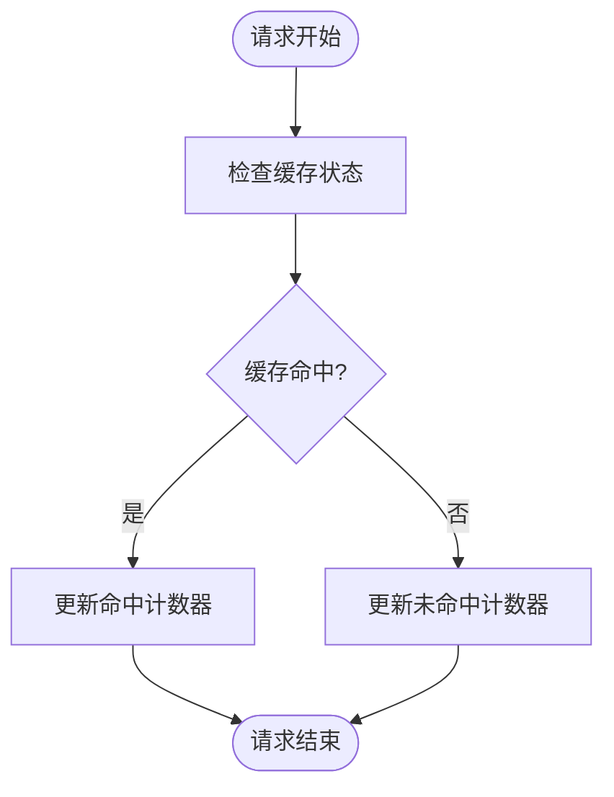
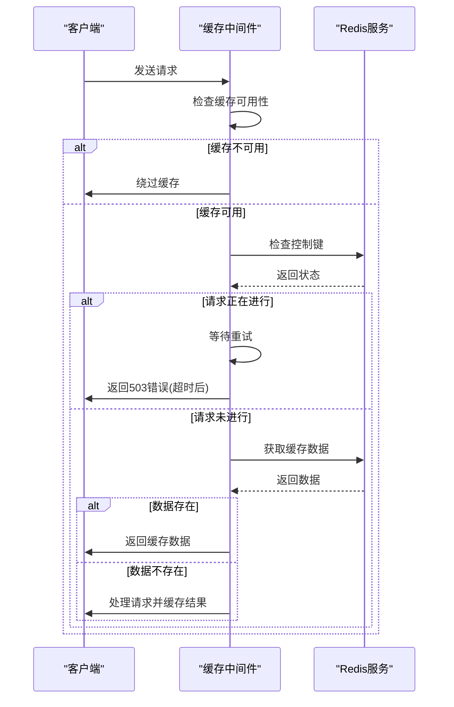
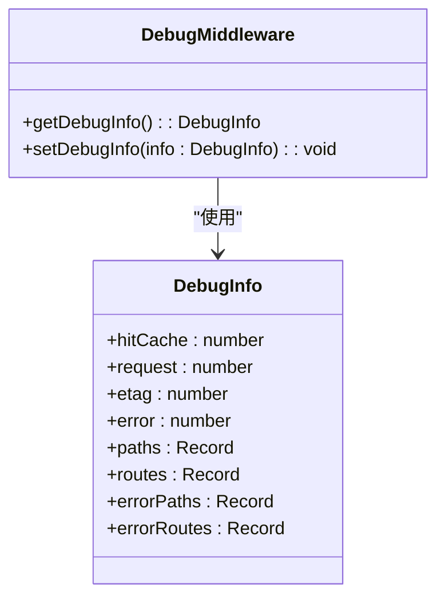
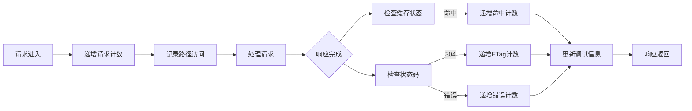
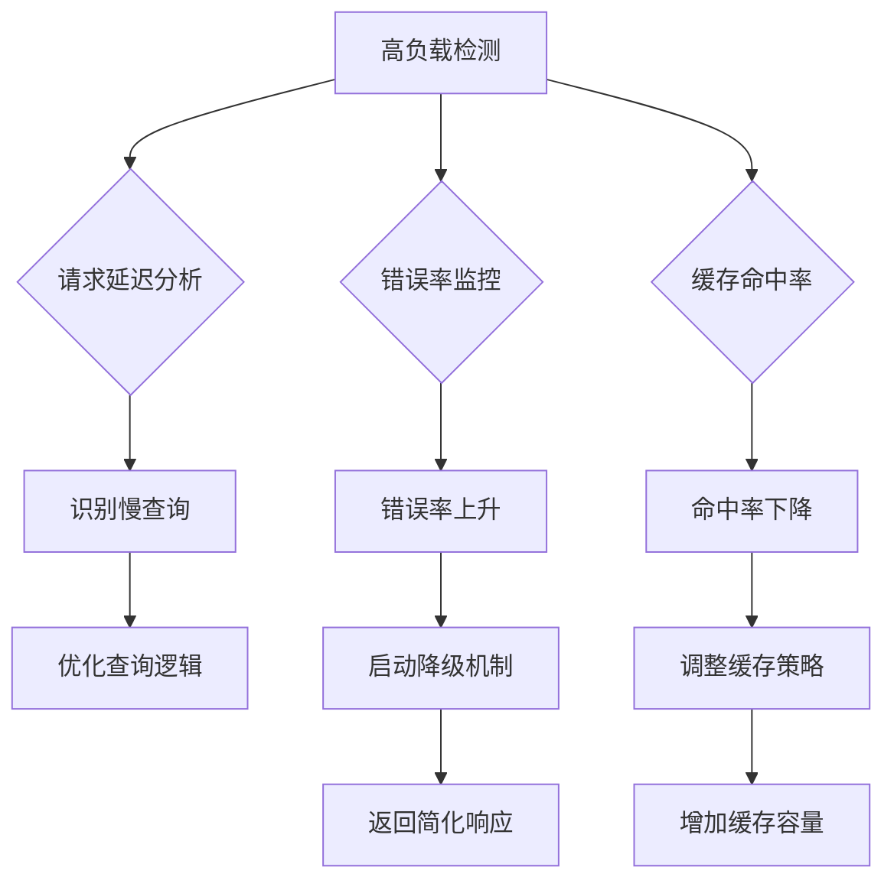

# 缓存监控与诊断

<cite>
**本文档引用的文件**
- [cache.ts](file://lib/middleware/cache.ts)
- [debug.ts](file://lib/middleware/debug.ts)
- [index.tsx](file://lib/views/index.tsx)
- [debug-info.ts](file://lib/utils/debug-info.ts)
- [config.ts](file://lib/config.ts)
- [metric.ts](file://lib/utils/otel/metric.ts)
- [index.ts](file://lib/utils/cache/index.ts)
- [redis.ts](file://lib/utils/cache/redis.ts)
- [memory.ts](file://lib/utils/cache/memory.ts)
</cite>

## 目录
1. [缓存监控指标](#缓存监控指标)
2. [缓存健康检查机制](#缓存健康检查机制)
3. [缓存诊断工具](#缓存诊断工具)
4. [监控数据收集与展示](#监控数据收集与展示)
5. [高负载场景监控策略](#高负载场景监控策略)

## 缓存监控指标

RSSHub提供了全面的缓存监控指标，用于评估缓存系统的性能和健康状况。系统通过中间件和工具模块收集关键指标，包括缓存命中率、缓存大小和内存使用情况等。

缓存命中率是衡量缓存效率的核心指标，计算公式为缓存命中次数除以总请求数。系统通过在响应头中设置`RSSHub-Cache-Status`来标识缓存状态，当值为`HIT`时表示缓存命中。监控系统会统计命中和未命中的请求数量，从而计算出缓存命中率。

**图示来源**
- [cache.ts](file://lib/middleware/cache.ts#L48-L54)
- [debug.ts](file://lib/middleware/debug.ts#L29-L31)

系统还监控请求频率、ETag匹配率和系统健康度等指标。请求频率通过计算单位时间内的请求数量来评估系统负载。ETag匹配率反映了客户端缓存的有效性，而系统健康度则通过错误率来衡量，计算公式为1减去错误请求数除以总请求数。

**本节来源**
- [debug.ts](file://lib/middleware/debug.ts#L6-L40)
- [index.tsx](file://lib/views/index.tsx#L60-L73)

## 缓存健康检查机制

RSSHub的缓存健康检查机制通过多层检测确保缓存服务的可用性和稳定性。系统实现了缓存可用性检测、并发请求控制和错误恢复机制。

缓存可用性检测通过`cacheModule.status.available`属性来判断缓存服务是否正常运行。当使用Redis作为缓存后端时，系统会监听Redis连接事件，在连接建立时设置`available`为true，在连接断开或发生错误时设置为false。对于内存缓存，系统在初始化LRU缓存实例时设置`available`为true。

**图示来源**
- [redis.ts](file://lib/utils/cache/redis.ts#L20-L35)
- [memory.ts](file://lib/utils/cache/memory.ts#L12-L19)
- [cache.ts](file://lib/middleware/cache.ts#L14-L17)

并发请求控制机制防止同一资源的重复获取。系统使用控制键（controlKey）来标记正在处理的请求，当一个请求开始处理时，系统会设置控制键的值为'1'，其他相同资源的请求会检测到这一状态并进入等待。如果等待超时，系统会返回503错误，提示用户稍后重试。

**本节来源**
- [cache.ts](file://lib/middleware/cache.ts#L26-L44)
- [request-in-progress.ts](file://lib/errors/types/request-in-progress.ts#L1-L5)

## 缓存诊断工具

RSSHub提供了多种缓存诊断工具，帮助开发者和运维人员分析缓存状态、性能瓶颈和排查问题。这些工具包括缓存状态查询、性能分析和问题排查功能。

缓存状态查询功能通过调试中间件收集和展示系统运行时的详细信息。系统维护一个全局的调试信息对象，记录请求数量、缓存命中数、ETag匹配数、错误数以及各路由和路径的访问统计。这些信息可以通过系统首页或特定API端点查询。

**图示来源**
- [debug-info.ts](file://lib/utils/debug-info.ts#L1-L24)
- [debug.ts](file://lib/middleware/debug.ts#L4-L40)

性能分析工具通过OpenTelemetry集成提供详细的性能指标。系统使用Prometheus导出器收集请求延迟、请求总数和错误总数等指标。这些指标按方法、路径和状态码进行维度划分，支持细粒度的性能分析。延迟指标分为秒级和毫秒级直方图，便于在不同时间尺度上分析性能特征。

问题排查功能包括热点路由分析和错误路径追踪。系统记录每个路由和路径的访问次数，按访问频率排序展示热点路由，帮助识别高负载的资源。同时，系统还记录错误路由和错误路径，便于快速定位问题源头。

**本节来源**
- [metric.ts](file://lib/utils/otel/metric.ts#L34-L56)
- [index.tsx](file://lib/views/index.tsx#L78-L124)

## 监控数据收集与展示

RSSHub的监控数据收集机制通过中间件链式调用实现，确保在请求处理的各个阶段都能准确收集相关指标。系统采用轻量级的内存数据结构存储监控数据，避免对性能造成显著影响。

数据收集流程始于请求进入时的调试中间件，该中间件会递增全局请求计数器，并记录当前路径的访问次数。在请求处理完成后，中间件会根据响应状态更新相应的指标，如缓存命中数、ETag匹配数和错误数。

**图示来源**
- [debug.ts](file://lib/middleware/debug.ts#L6-L37)
- [cache.ts](file://lib/middleware/cache.ts#L48-L54)

监控数据的展示通过系统首页的调试信息面板实现。系统将收集的原始数据转换为用户友好的格式，如将缓存命中率转换为百分比形式，将请求频率转换为每分钟请求数。展示内容包括缓存持续时间、请求总量、请求频率、缓存命中率、ETag匹配率、系统健康度、运行时间以及热点路由和路径的排行榜。

数据优化策略基于监控数据的分析结果。通过观察缓存命中率，可以调整缓存过期时间以平衡数据新鲜度和性能。通过分析热点路由，可以针对性地优化高负载资源的缓存策略，如缩短缓存过期时间或增加预热机制。

**本节来源**
- [index.tsx](file://lib/views/index.tsx#L50-L127)
- [config.ts](file://lib/config.ts#L23-L28)

## 高负载场景监控策略

在高负载场景下，RSSHub采用多层次的监控策略和预警机制，确保系统稳定性和服务质量。这些策略包括负载均衡、资源限制、自动降级和告警通知。

负载监控通过OpenTelemetry的直方图指标实现，系统记录每个请求的处理时间，并按预设的桶边界进行分类统计。这些数据可用于绘制请求延迟的分布图，识别性能瓶颈和异常情况。配置文件中的`OTEL_SECONDS_BUCKET`和`OTEL_MILLISECONDS_BUCKET`环境变量定义了直方图的边界，支持自定义监控粒度。

**图示来源**
- [metric.ts](file://lib/utils/otel/metric.ts#L36-L45)
- [config.ts](file://lib/config.ts#L48-L49)

预警机制通过外部监控系统集成实现。系统暴露Prometheus指标端点，允许外部监控工具如Prometheus和Grafana定期抓取监控数据。当检测到异常指标，如错误率超过阈值或缓存命中率显著下降时，监控系统会触发告警，通知运维人员及时处理。

资源限制策略通过配置文件中的`MEMORY_MAX`参数实现，该参数定义了内存缓存的最大条目数。当使用内存缓存时，系统会创建LRU缓存实例，自动淘汰最久未使用的条目，防止内存无限增长。对于Redis缓存，系统依赖Redis自身的内存管理机制。

**本节来源**
- [memory.ts](file://lib/utils/cache/memory.ts#L16-L17)
- [metric.ts](file://lib/utils/otel/metric.ts#L21-L28)
- [config.ts](file://lib/config.ts#L27-L28)