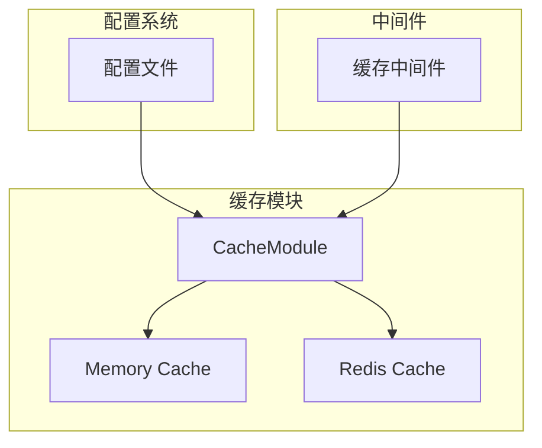
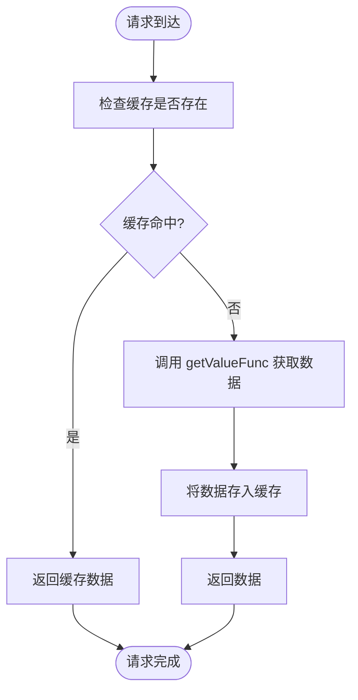
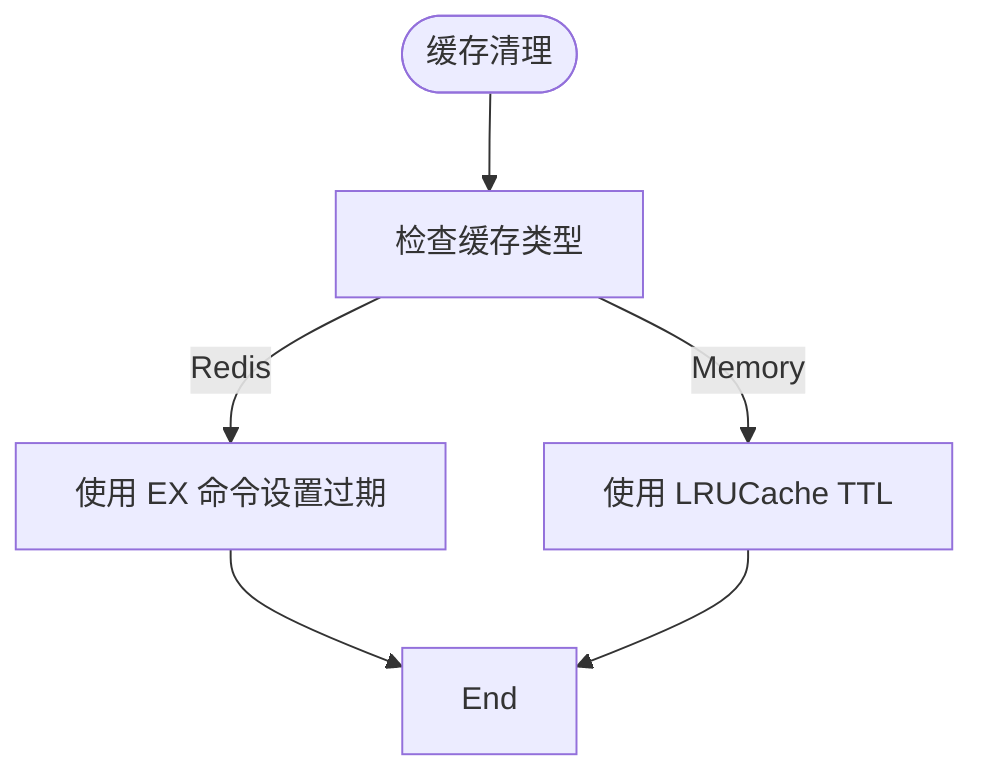
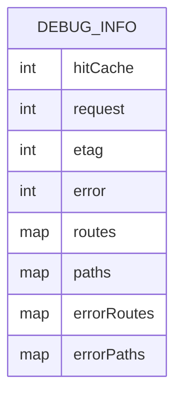
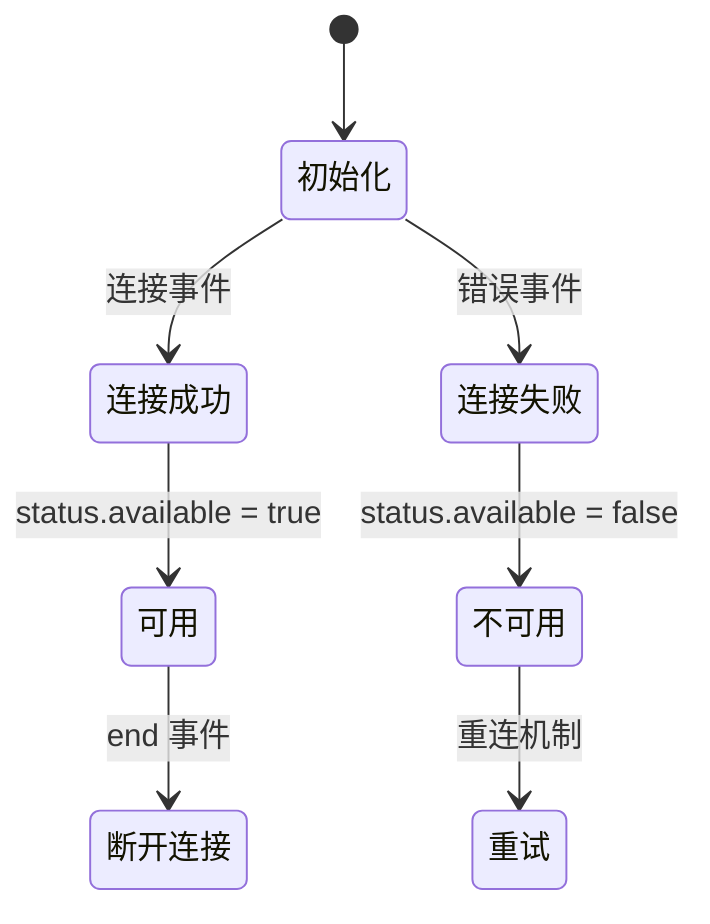
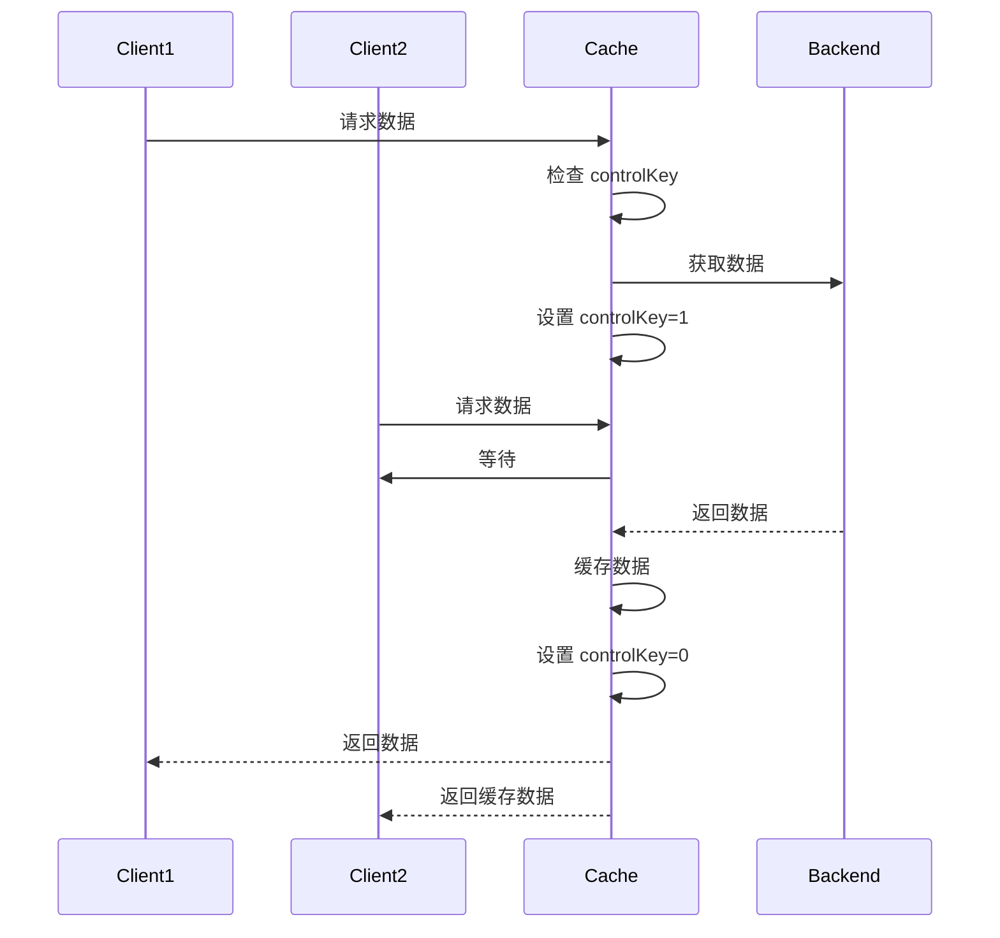

# 缓存管理

<cite>
**本文档引用的文件**  
- [cache.ts](file://lib/middleware/cache.ts)
- [config.ts](file://lib/config.ts)
- [base.ts](file://lib/utils/cache/base.ts)
- [index.ts](file://lib/utils/cache/index.ts)
- [memory.ts](file://lib/utils/cache/memory.ts)
- [redis.ts](file://lib/utils/cache/redis.ts)
- [cache.test.ts](file://lib/utils/cache.test.ts)
</cite>

## 目录
1. [引言](#引言)
2. [缓存系统架构](#缓存系统架构)
3. [缓存管理功能](#缓存管理功能)
4. [配置文件管理](#配置文件管理)
5. [缓存健康检查](#缓存健康检查)
6. [缓存管理API](#缓存管理api)
7. [系统影响与高并发策略](#系统影响与高并发策略)

## 引言

RSSHub 是一个全球最大的 RSS 网络，其核心功能依赖于高效的缓存系统来提升性能和稳定性。缓存系统不仅减少了对源网站的重复请求，还显著提升了响应速度和用户体验。本文档详细描述了 RSSHub 的缓存管理系统，涵盖缓存预热、清理、监控、诊断工具以及配置管理等方面。

**Section sources**
- [README.md](file://README.md#L1-L62)

## 缓存系统架构

RSSHub 的缓存系统支持两种主要的缓存类型：内存缓存（memory）和 Redis 缓存。系统通过配置文件动态选择缓存类型，并初始化相应的缓存客户端。缓存模块的设计遵循模块化原则，通过统一的接口抽象不同缓存实现的差异。

**Diagram sources**
- [config.ts](file://lib/config.ts#L735-L747)
- [index.ts](file://lib/utils/cache/index.ts#L18-L49)
- [base.ts](file://lib/utils/cache/base.ts#L4-L14)

**Section sources**
- [config.ts](file://lib/config.ts#L735-L747)
- [index.ts](file://lib/utils/cache/index.ts#L1-L60)
- [base.ts](file://lib/utils/cache/base.ts#L1-L17)

## 缓存管理功能

### 缓存预热机制

RSSHub 的缓存预热机制通过 `tryGet` 方法实现。当请求到达时，系统首先尝试从缓存中获取数据。如果缓存未命中，则调用 `getValueFunc` 函数获取数据并将其存入缓存。这一机制确保了热门内容能够被快速响应，同时减少了对后端服务的负载。

**Diagram sources**
- [index.ts](file://lib/utils/cache/index.ts#L75-L97)

**Section sources**
- [index.ts](file://lib/utils/cache/index.ts#L75-L97)

### 缓存清理策略

RSSHub 的缓存清理策略基于 TTL（Time To Live）机制。每条缓存记录都有一个过期时间，系统在获取缓存时会自动检查其有效性。对于 Redis 缓存，系统使用 `EX` 命令设置过期时间；对于内存缓存，则通过 `LRUCache` 的 `ttl` 选项实现。

此外，系统还提供了手动清理功能，允许管理员清除特定缓存或批量清理。例如，在 `newrank/utils.ts` 中，`clearCookie` 函数通过将缓存值设为 `null` 来实现清理。

**Diagram sources**
- [redis.ts](file://lib/utils/cache/redis.ts#L72)
- [memory.ts](file://lib/utils/cache/memory.ts#L39)

**Section sources**
- [redis.ts](file://lib/utils/cache/redis.ts#L57-L72)
- [memory.ts](file://lib/utils/cache/memory.ts#L31-L40)
- [utils.ts](file://lib/routes/newrank/utils.ts#L76-L78)

### 缓存监控和诊断工具

RSSHub 提供了详细的缓存监控功能，包括缓存命中率、请求频率、ETag 匹配情况等。这些信息通过调试页面展示，帮助管理员了解系统的运行状态。

**Diagram sources**
- [debug-info.ts](file://lib/utils/debug-info.ts#L1-L21)

**Section sources**
- [debug-info.ts](file://lib/utils/debug-info.ts#L1-L24)
- [index.tsx](file://lib/views/index.tsx#L60-L95)

## 配置文件管理

### 启用/禁用缓存

通过配置文件中的 `CACHE_TYPE` 环境变量，可以启用或禁用缓存。当 `CACHE_TYPE` 为空时，缓存功能将被禁用；设置为 `memory` 或 `redis` 则分别启用内存缓存或 Redis 缓存。

### 设置缓存大小限制

内存缓存的最大容量由 `MEMORY_MAX` 环境变量控制，默认值为 256。该值对应 `LRUCache` 的 `max` 参数，决定了缓存中最多可保留的项目数量。

### 配置缓存持久化

Redis 缓存的持久化通过 `REDIS_URL` 环境变量配置，系统会根据该 URL 连接到指定的 Redis 实例。Redis 的持久化策略由 Redis 服务器自身配置决定。

**Section sources**
- [config.ts](file://lib/config.ts#L735-L747)

## 缓存健康检查

缓存健康检查通过 `status.available` 标志实现。在初始化缓存客户端时，系统会监听连接事件，并根据连接状态更新 `available` 标志。例如，Redis 客户端在连接成功时将 `available` 设为 `true`，在连接断开或发生错误时设为 `false`。

**Diagram sources**
- [redis.ts](file://lib/utils/cache/redis.ts#L24-L34)

**Section sources**
- [redis.ts](file://lib/utils/cache/redis.ts#L24-L34)

## 缓存管理API

### 手动清除特定缓存

通过调用 `cache.set(key, null)` 可以手动清除特定缓存。例如，在 `newrank/utils.ts` 中，`clearCookie` 函数通过将 `newrank_cookie_token` 的值设为 `null` 来清除相关缓存。

### 批量清理

批量清理功能可以通过遍历缓存键并逐个清除实现。虽然当前代码中未直接提供批量清理接口，但可通过扩展 `globalCache` 对象实现。

### 缓存状态查询

缓存状态可通过 `status.available` 属性查询，该属性反映了当前缓存客户端的可用性。此外，调试页面提供了更详细的缓存统计信息，如命中率、请求量等。

**Section sources**
- [index.ts](file://lib/utils/cache/index.ts#L8-L14)
- [utils.ts](file://lib/routes/newrank/utils.ts#L76-L78)

## 系统影响与高并发策略

### 对系统稳定性和性能的影响

缓存系统的引入显著提升了 RSSHub 的性能和稳定性。通过减少对源网站的重复请求，降低了网络延迟和服务器负载。同时，缓存命中率的提升也改善了用户体验。

### 高并发场景下的管理策略

在高并发场景下，RSSHub 采用请求锁机制防止缓存击穿。当一个请求正在获取数据时，其他相同请求会被阻塞，直到数据被缓存。这一机制通过 `controlKey` 实现，确保同一路径的请求不会同时执行。

**Diagram sources**
- [cache.ts](file://lib/middleware/cache.ts#L26-L44)

**Section sources**
- [cache.ts](file://lib/middleware/cache.ts#L1-L84)