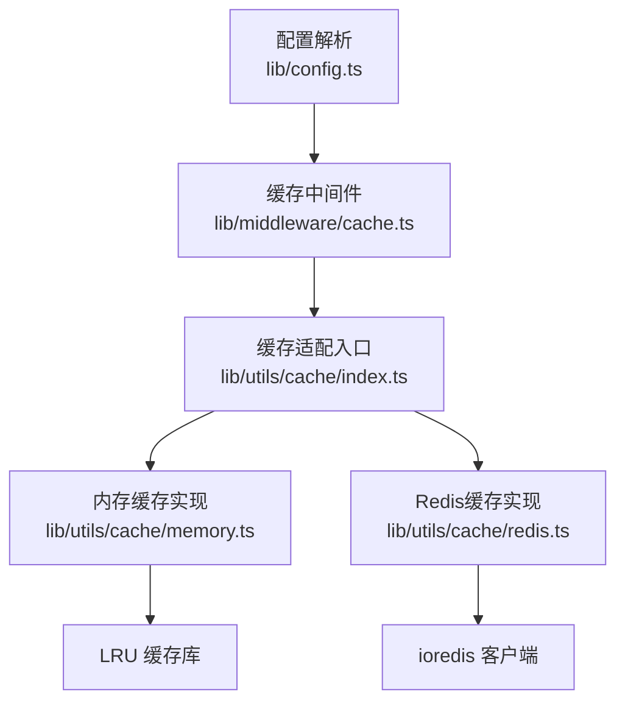
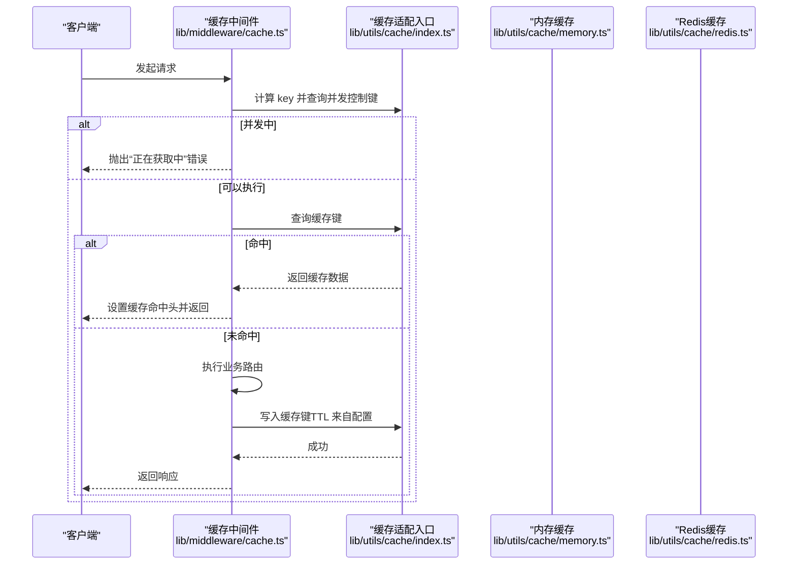
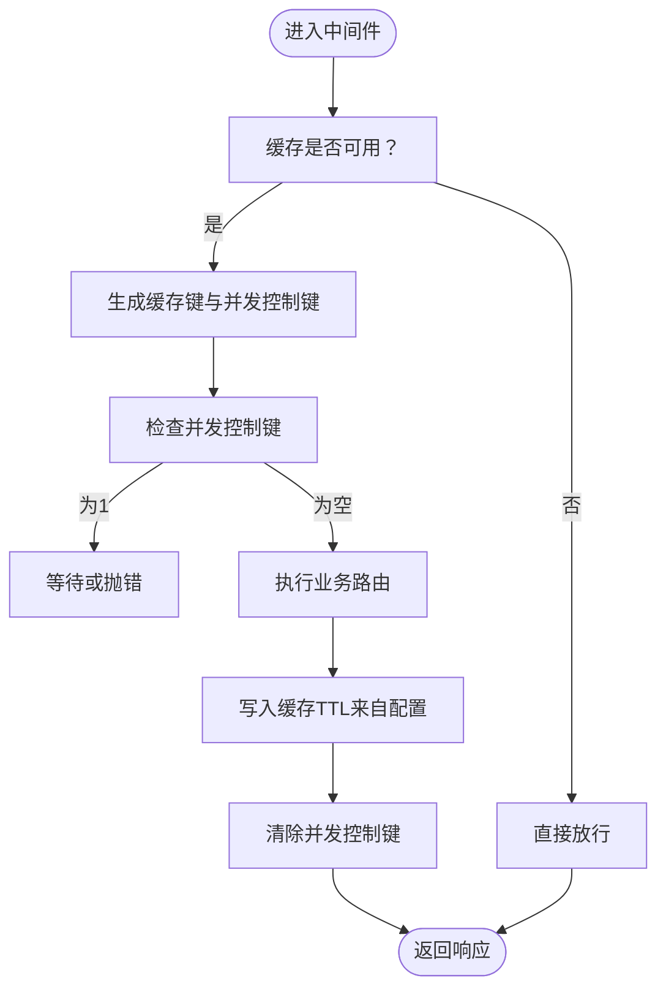
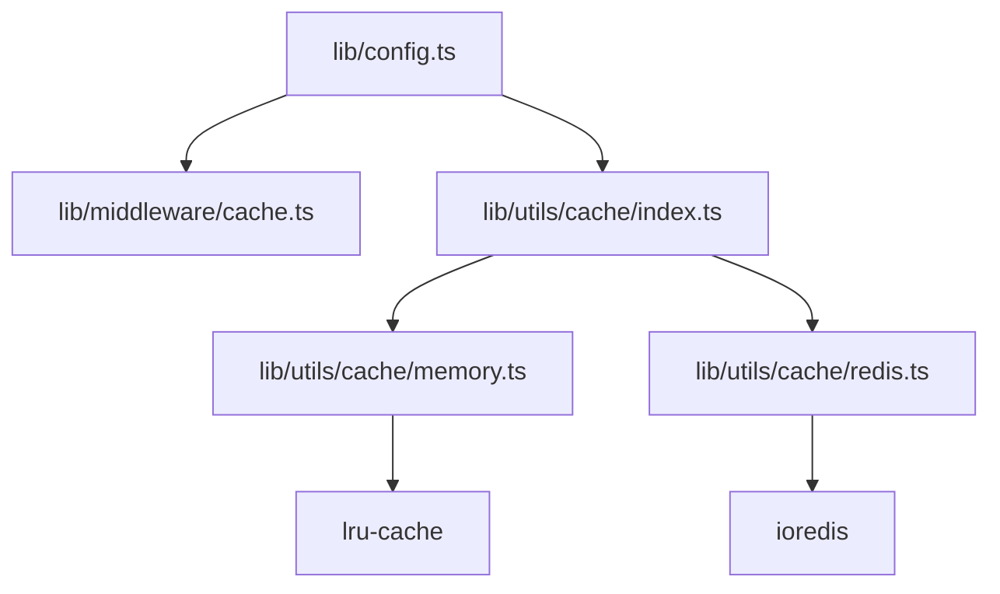

# 缓存配置管理

<cite>
**本文引用的文件列表**
- [lib/config.ts](file://lib/config.ts)
- [lib/middleware/cache.ts](file://lib/middleware/cache.ts)
- [lib/utils/cache/index.ts](file://lib/utils/cache/index.ts)
- [lib/utils/cache/memory.ts](file://lib/utils/cache/memory.ts)
- [lib/utils/cache/redis.ts](file://lib/utils/cache/redis.ts)
- [lib/utils/cache/base.ts](file://lib/utils/cache/base.ts)
- [lib/middleware/cache.test.ts](file://lib/middleware/cache.test.ts)
- [lib/utils/cache.test.ts](file://lib/utils/cache.test.ts)
- [docker-compose.yml](file://docker-compose.yml)
- [scripts/ansible/rsshub.env](file://scripts/ansible/rsshub.env)
- [flake.nix](file://flake.nix)
</cite>

## 目录
1. [简介](#简介)
2. [项目结构与缓存相关模块](#项目结构与缓存相关模块)
3. [核心配置项与默认行为](#核心配置项与默认行为)
4. [架构总览](#架构总览)
5. [组件详解](#组件详解)
6. [依赖关系分析](#依赖关系分析)
7. [性能与容量规划](#性能与容量规划)
8. [部署环境配置示例](#部署环境配置示例)
9. [故障排查与常见问题](#故障排查与常见问题)
10. [结论](#结论)

## 简介
本文件系统性阐述 RSSHub 的缓存配置与实现机制，覆盖以下主题：
- 如何通过配置文件启用/禁用缓存、设置缓存过期时间、配置缓存大小限制与持久化策略
- 内存缓存与 Redis 缓存两种模式的配置方法与参数含义
- 针对开发、测试、生产的部署环境差异建议
- 配置项之间的相互影响（如缓存大小与性能、持久化与数据安全）
- 最佳实践与常见错误排查

## 项目结构与缓存相关模块
RSSHub 的缓存体系由“配置解析层 → 中间件层 → 缓存适配层（内存/Redis）”构成，整体以中间件形式拦截路由请求，统一处理并发控制、命中判断与写入。

图表来源
- [lib/config.ts](file://lib/config.ts#L735-L747)
- [lib/middleware/cache.ts](file://lib/middleware/cache.ts#L1-L83)
- [lib/utils/cache/index.ts](file://lib/utils/cache/index.ts#L1-L60)
- [lib/utils/cache/memory.ts](file://lib/utils/cache/memory.ts#L1-L45)
- [lib/utils/cache/redis.ts](file://lib/utils/cache/redis.ts#L1-L78)

章节来源
- [lib/config.ts](file://lib/config.ts#L735-L747)
- [lib/middleware/cache.ts](file://lib/middleware/cache.ts#L1-L83)
- [lib/utils/cache/index.ts](file://lib/utils/cache/index.ts#L1-L60)
- [lib/utils/cache/memory.ts](file://lib/utils/cache/memory.ts#L1-L45)
- [lib/utils/cache/redis.ts](file://lib/utils/cache/redis.ts#L1-L78)

## 核心配置项与默认行为
RSSHub 通过环境变量驱动缓存行为，关键配置项如下：

- 缓存类型与开关
  - CACHE_TYPE：可选值为 "memory"、"redis" 或空字符串/非上述值。当设为空字符串或非上述值时，缓存被禁用，中间件不进行缓存读写。
  - 默认值：未显式设置时，默认使用 "memory"。

- 过期时间
  - CACHE_EXPIRE：路由级缓存过期时间（秒），用于中间件写入缓存时的 TTL。
  - CACHE_CONTENT_EXPIRE：内容级缓存过期时间（秒），用于缓存适配层在未指定 maxAge 时的默认 TTL。
  - 默认值：CACHE_EXPIRE 默认 5 分钟；CACHE_CONTENT_EXPIRE 默认 1 小时。

- 并发控制超时
  - CACHE_REQUEST_TIMEOUT：并发控制键的过期时间（秒），用于避免同一路径同时并发拉取。
  - 默认值：60 秒。

- 内存缓存大小限制
  - MEMORY_MAX：内存缓存最大条目数（正整数）。
  - 默认值：2^8（即 256）。

- Redis 连接地址
  - REDIS_URL：Redis 连接字符串。
  - 默认值："redis://localhost:6379/"。

- 其他网络与代理配置（与缓存间接相关）
  - REQUEST_RETRY、REQUEST_TIMEOUT、ALLOW_ORIGIN 等，影响上游抓取与响应质量，从而影响缓存命中率与延迟。

章节来源
- [lib/config.ts](file://lib/config.ts#L735-L747)
- [lib/middleware/cache.ts](file://lib/middleware/cache.ts#L1-L83)
- [lib/utils/cache/index.ts](file://lib/utils/cache/index.ts#L1-L60)
- [lib/utils/cache/memory.ts](file://lib/utils/cache/memory.ts#L1-L45)
- [lib/utils/cache/redis.ts](file://lib/utils/cache/redis.ts#L1-L78)

## 架构总览
缓存工作流分为“请求拦截 → 并发控制 → 命中检查 → 写入缓存 → 返回响应”的闭环。

图表来源
- [lib/middleware/cache.ts](file://lib/middleware/cache.ts#L1-L83)
- [lib/utils/cache/index.ts](file://lib/utils/cache/index.ts#L1-L60)
- [lib/utils/cache/memory.ts](file://lib/utils/cache/memory.ts#L1-L45)
- [lib/utils/cache/redis.ts](file://lib/utils/cache/redis.ts#L1-L78)

## 组件详解

### 配置解析与默认值
- 配置项定义与默认值均在配置文件中集中声明，包含缓存类型、过期时间、内存上限、Redis 地址等。
- 关键点：
  - CACHE_TYPE 为空字符串或非 "memory"/"redis" 时，缓存被禁用，中间件直接放行。
  - 默认过期时间与内存上限提供开箱即用的体验，便于快速启动。

章节来源
- [lib/config.ts](file://lib/config.ts#L735-L747)

### 缓存中间件
- 功能要点：
  - 对特定路径（如根路径、robots.txt、静态资源）绕过缓存。
  - 使用哈希算法生成稳定键，结合 format、limit 参数区分缓存键。
  - 通过“并发控制键”避免同一路径的重复并发请求，提升稳定性。
  - 命中缓存时设置响应头标识，并直接返回缓存数据。
  - 未命中时调用下游路由生成数据，按配置写入缓存。

- 并发控制流程图：

图表来源
- [lib/middleware/cache.ts](file://lib/middleware/cache.ts#L1-L83)

章节来源
- [lib/middleware/cache.ts](file://lib/middleware/cache.ts#L1-L83)

### 缓存适配入口（内存/Redis）
- 选择逻辑：
  - 当 CACHE_TYPE 为 "redis" 时，初始化 Redis 客户端，全局缓存读写委托给 Redis 实现。
  - 当 CACHE_TYPE 为 "memory" 时，初始化 LRU 内存缓存，全局缓存读写委托给内存实现。
  - 否则禁用缓存，所有读写均为 null。

- 通用能力：
  - 提供 tryGet 方法，支持“缓存命中则返回，未命中则回调生成并缓存”的模式。
  - 支持 maxAge 与 refresh 参数，灵活控制 TTL 与命中刷新。

章节来源
- [lib/utils/cache/index.ts](file://lib/utils/cache/index.ts#L1-L60)
- [lib/utils/cache/index.ts](file://lib/utils/cache/index.ts#L65-L100)

### 内存缓存实现
- 初始化参数：
  - ttl：由路由过期时间决定（毫秒）。
  - max：由内存上限决定。
- 行为特征：
  - 命中时可选择是否刷新 TTL。
  - 写入前会将对象序列化为字符串，未定义值会被转为空字符串。

章节来源
- [lib/utils/cache/memory.ts](file://lib/utils/cache/memory.ts#L1-L45)

### Redis 缓存实现
- 初始化参数：
  - 使用 REDIS_URL 连接 Redis。
  - 监听连接事件，维护可用状态。
- 行为特征：
  - 读取时可选择刷新 TTL，并自动续期。
  - 写入时支持自定义 maxAge；若非默认值，则额外存储一个 TTL 键以便后续读取刷新。
  - 对内部保留前缀的 TTL 键进行保护，防止用户误用。

章节来源
- [lib/utils/cache/redis.ts](file://lib/utils/cache/redis.ts#L1-L78)

### 缓存接口基类
- 统一的缓存模块接口，定义了 init、get、set、status、clients 等字段，便于扩展其他后端。

章节来源
- [lib/utils/cache/base.ts](file://lib/utils/cache/base.ts#L1-L17)

## 依赖关系分析
- 配置层依赖 dotenv 解析环境变量，形成运行时配置对象。
- 中间件依赖配置与缓存适配入口，负责请求拦截与并发控制。
- 缓存适配入口根据配置动态绑定内存或 Redis 实现。
- 内存实现依赖 LRU 库，Redis 实现依赖 ioredis 客户端。

图表来源
- [lib/config.ts](file://lib/config.ts#L735-L747)
- [lib/middleware/cache.ts](file://lib/middleware/cache.ts#L1-L83)
- [lib/utils/cache/index.ts](file://lib/utils/cache/index.ts#L1-L60)
- [lib/utils/cache/memory.ts](file://lib/utils/cache/memory.ts#L1-L45)
- [lib/utils/cache/redis.ts](file://lib/utils/cache/redis.ts#L1-L78)

章节来源
- [lib/config.ts](file://lib/config.ts#L735-L747)
- [lib/middleware/cache.ts](file://lib/middleware/cache.ts#L1-L83)
- [lib/utils/cache/index.ts](file://lib/utils/cache/index.ts#L1-L60)
- [lib/utils/cache/memory.ts](file://lib/utils/cache/memory.ts#L1-L45)
- [lib/utils/cache/redis.ts](file://lib/utils/cache/redis.ts#L1-L78)

## 性能与容量规划
- 缓存类型选择
  - 内存缓存：适合单实例、低延迟场景；受进程内存限制，重启丢失。
  - Redis 缓存：适合多实例、高可用场景；持久化需结合 Redis 配置；网络延迟影响命中速度。
- 过期时间与命中率
  - CACHE_EXPIRE 与 CACHE_CONTENT_EXPIRE 影响缓存命中率与新鲜度。较长 TTL 提升命中率但可能降低数据新鲜度。
- 内存上限与并发
  - MEMORY_MAX 控制内存缓存容量，过大可能导致内存压力与 GC 抖动；过小导致频繁淘汰。
- 并发控制
  - CACHE_REQUEST_TIMEOUT 控制并发锁持有时间，过短可能引发抖动，过长可能阻塞后续请求。
- 测试与验证
  - 单测覆盖了不同配置下的行为，包括无缓存、内存缓存、Redis 缓存、连接异常与退出等场景，有助于验证配置正确性。

章节来源
- [lib/middleware/cache.test.ts](file://lib/middleware/cache.test.ts#L1-L190)
- [lib/utils/cache.test.ts](file://lib/utils/cache.test.ts#L1-L92)

## 部署环境配置示例
以下示例基于仓库中的实际部署文件，展示不同环境的典型配置方式。

- 开发环境（本地）
  - 使用内存缓存，便于调试与快速迭代。
  - 示例参考：[scripts/ansible/rsshub.env](file://scripts/ansible/rsshub.env#L1-L4)
  - 关键点：CACHE_TYPE=memory（或不设置，默认 memory）

- 测试/预发布环境（容器编排）
  - 使用 Redis 缓存，便于多副本共享缓存。
  - 示例参考：[docker-compose.yml](file://docker-compose.yml#L1-L63)
  - 关键点：CACHE_TYPE=redis，REDIS_URL 指向 redis 服务

- 生产环境（容器编排）
  - 使用 Redis 缓存，结合健康检查与持久化卷。
  - 示例参考：[docker-compose.yml](file://docker-compose.yml#L1-L63)
  - 关键点：NODE_ENV=production，CACHE_TYPE=redis，REDIS_URL 指向 redis 服务

- Nix 配置示例
  - flake.nix 提供了环境变量与 Redis 选项的示例，便于在 Nix 环境中统一管理。
  - 示例参考：[flake.nix](file://flake.nix#L152-L188)

章节来源
- [scripts/ansible/rsshub.env](file://scripts/ansible/rsshub.env#L1-L4)
- [docker-compose.yml](file://docker-compose.yml#L1-L63)
- [flake.nix](file://flake.nix#L152-L188)

## 故障排查与常见问题
- 缓存未生效
  - 检查 CACHE_TYPE 是否被设为空字符串或非 "memory"/"redis"，此时缓存被禁用。
  - 检查中间件是否绕过了目标路径（如根路径、robots.txt、静态资源）。
  - 参考测试用例：[lib/middleware/cache.test.ts](file://lib/middleware/cache.test.ts#L1-L190)

- Redis 连接失败或断开
  - 检查 REDIS_URL 是否正确，容器编排中应指向 redis 服务。
  - 观察日志中 Redis 连接事件与错误事件，确认可用状态。
  - 参考测试用例：[lib/utils/cache.test.ts](file://lib/utils/cache.test.ts#L1-L92)

- 并发请求冲突
  - 若出现“正在获取中”错误，说明同一路径的并发控制键仍处于占用状态，等待其超时或检查上游路由耗时。
  - 参考中间件逻辑：[lib/middleware/cache.ts](file://lib/middleware/cache.ts#L1-L83)

- TTL 与刷新行为异常
  - Redis 读取时会根据内部 TTL 键刷新主键 TTL；若自定义 maxAge，需确保与预期一致。
  - 参考实现：[lib/utils/cache/redis.ts](file://lib/utils/cache/redis.ts#L1-L78)

- 内存缓存容量不足
  - 调整 MEMORY_MAX，平衡内存占用与命中率。
  - 参考实现：[lib/utils/cache/memory.ts](file://lib/utils/cache/memory.ts#L1-L45)

- 缓存键命名冲突
  - tryGet 要求 key 必须为字符串，否则抛出类型错误。
  - 参考实现：[lib/utils/cache/index.ts](file://lib/utils/cache/index.ts#L65-L100)

章节来源
- [lib/middleware/cache.ts](file://lib/middleware/cache.ts#L1-L83)
- [lib/utils/cache/index.ts](file://lib/utils/cache/index.ts#L65-L100)
- [lib/utils/cache/memory.ts](file://lib/utils/cache/memory.ts#L1-L45)
- [lib/utils/cache/redis.ts](file://lib/utils/cache/redis.ts#L1-L78)
- [lib/middleware/cache.test.ts](file://lib/middleware/cache.test.ts#L1-L190)
- [lib/utils/cache.test.ts](file://lib/utils/cache.test.ts#L1-L92)

## 结论
RSSHub 的缓存系统通过“配置驱动 + 中间件拦截 + 适配层抽象”的设计，实现了灵活且可扩展的缓存能力。合理设置 CACHE_TYPE、过期时间、内存上限与 Redis 连接，可在不同部署环境下取得最佳的性能与稳定性平衡。建议在生产环境优先采用 Redis 缓存，并结合监控与日志持续优化 TTL 与容量参数。