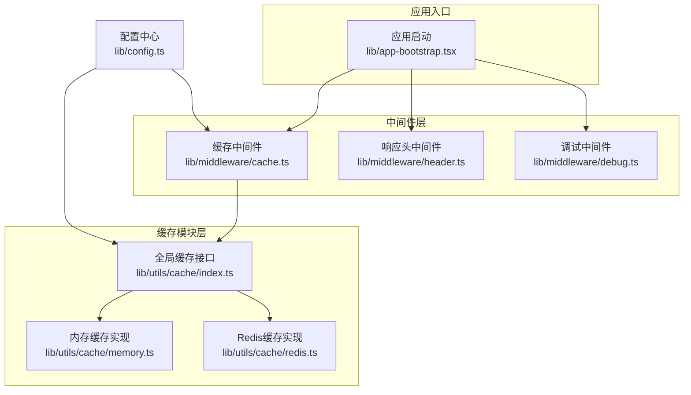
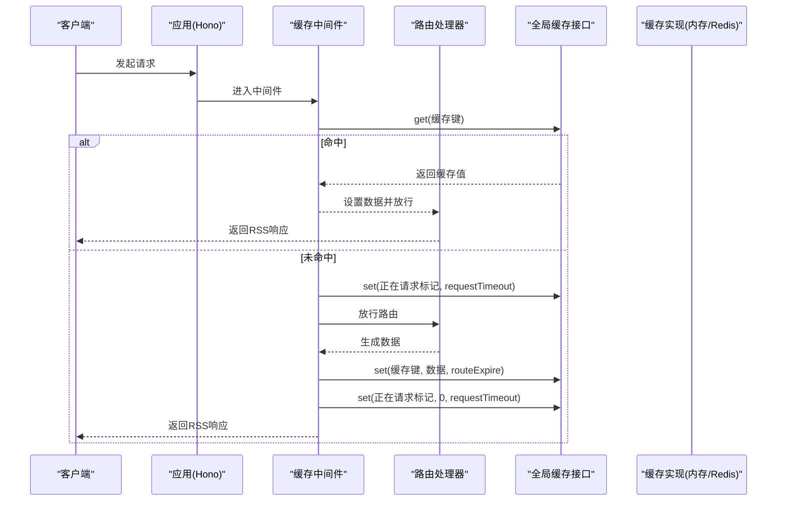
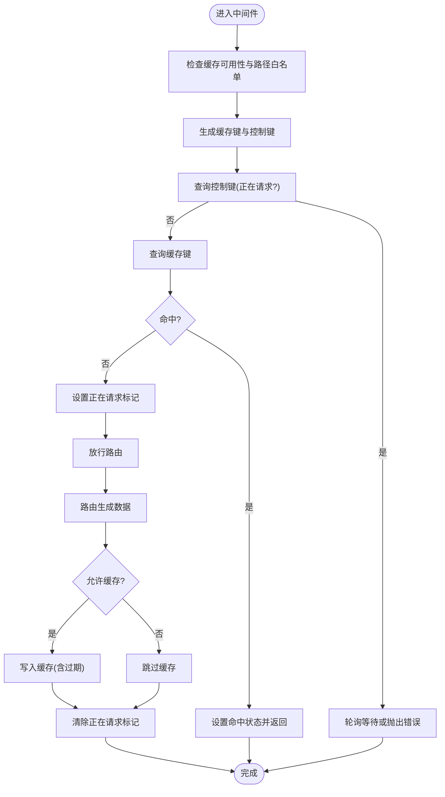
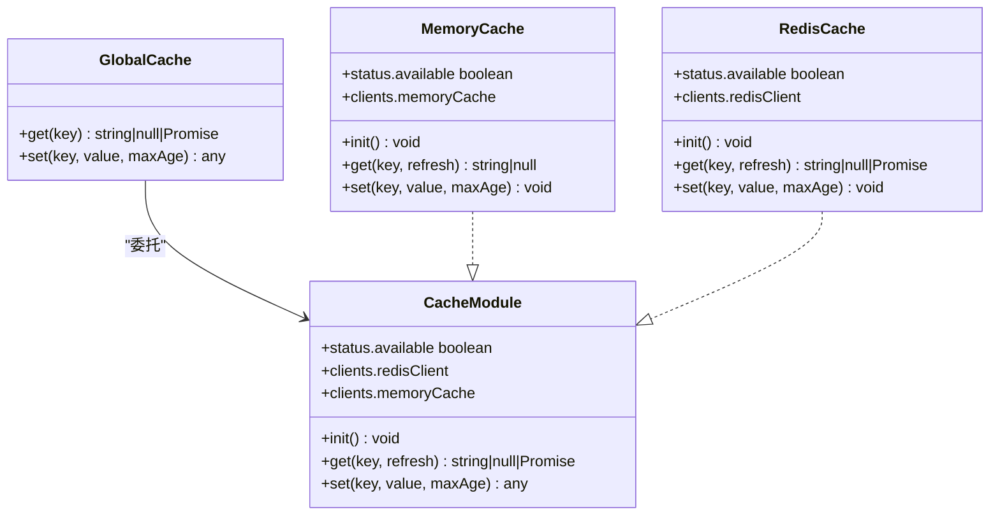
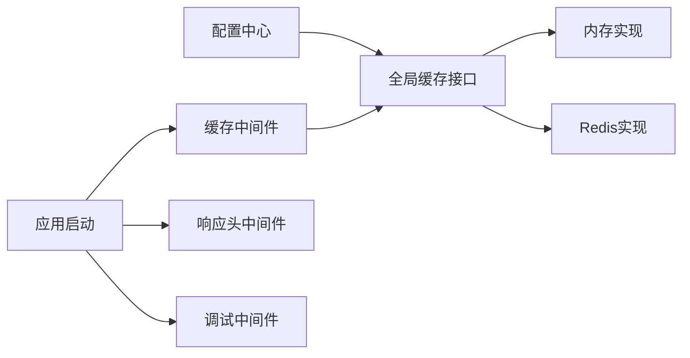

# 缓存系统

<cite>
**本文引用的文件**
- [lib/middleware/cache.ts](file://lib/middleware/cache.ts)
- [lib/utils/cache/index.ts](file://lib/utils/cache/index.ts)
- [lib/utils/cache/memory.ts](file://lib/utils/cache/memory.ts)
- [lib/utils/cache/redis.ts](file://lib/utils/cache/redis.ts)
- [lib/config.ts](file://lib/config.ts)
- [lib/app-bootstrap.tsx](file://lib/app-bootstrap.tsx)
- [lib/middleware/header.ts](file://lib/middleware/header.ts)
- [lib/middleware/debug.ts](file://lib/middleware/debug.ts)
- [lib/middleware/cache.test.ts](file://lib/middleware/cache.test.ts)
- [lib/routes/test/index.ts](file://lib/routes/test/index.ts)
- [lib/errors/index.test.ts](file://lib/errors/index.test.ts)
- [flake.nix](file://flake.nix)
</cite>

## 目录
1. [简介](#简介)
2. [项目结构](#项目结构)
3. [核心组件](#核心组件)
4. [架构总览](#架构总览)
5. [详细组件分析](#详细组件分析)
6. [依赖关系分析](#依赖关系分析)
7. [性能考量](#性能考量)
8. [故障排查指南](#故障排查指南)
9. [结论](#结论)
10. [附录：配置与最佳实践](#附录配置与最佳实践)

## 简介
本文件面向RSSHub的缓存系统，聚焦于缓存中间件的实现机制与架构设计，涵盖：
- 缓存策略与过期时间管理
- 缓存键生成规则
- 并发控制与缓存穿透防护
- 分布式缓存（Redis）与本地缓存（内存LRU）的实现
- 配置项与使用方法
- 与其他组件（路由系统、代理系统、ETag）的交互关系
- 命中率监控与失效策略建议

## 项目结构
缓存系统围绕“中间件 + 缓存模块 + 配置”的分层组织：
- 中间件层：在请求进入路由前进行缓存命中判断与并发控制
- 缓存模块层：抽象出统一接口，按配置选择内存或Redis实现
- 配置层：集中定义缓存类型、过期时间、Redis连接等参数

图表来源
- [lib/app-bootstrap.tsx](file://lib/app-bootstrap.tsx#L30-L46)
- [lib/middleware/cache.ts](file://lib/middleware/cache.ts#L13-L81)
- [lib/utils/cache/index.ts](file://lib/utils/cache/index.ts#L1-L101)
- [lib/utils/cache/memory.ts](file://lib/utils/cache/memory.ts#L1-L45)
- [lib/utils/cache/redis.ts](file://lib/utils/cache/redis.ts#L1-L78)
- [lib/config.ts](file://lib/config.ts#L735-L768)

章节来源
- [lib/app-bootstrap.tsx](file://lib/app-bootstrap.tsx#L30-L46)
- [lib/middleware/cache.ts](file://lib/middleware/cache.ts#L13-L81)
- [lib/utils/cache/index.ts](file://lib/utils/cache/index.ts#L1-L101)
- [lib/config.ts](file://lib/config.ts#L735-L768)

## 核心组件
- 缓存中间件：负责生成缓存键、并发控制、命中/未命中分支处理、写入缓存
- 全局缓存接口：根据配置动态绑定内存或Redis实现，并提供统一get/set
- 内存缓存：基于LRU，适合单实例部署
- Redis缓存：支持分布式共享，具备持久化与高可用能力
- 配置中心：集中管理缓存类型、过期时间、Redis连接URL等

章节来源
- [lib/middleware/cache.ts](file://lib/middleware/cache.ts#L13-L81)
- [lib/utils/cache/index.ts](file://lib/utils/cache/index.ts#L1-L101)
- [lib/utils/cache/memory.ts](file://lib/utils/cache/memory.ts#L1-L45)
- [lib/utils/cache/redis.ts](file://lib/utils/cache/redis.ts#L1-L78)
- [lib/config.ts](file://lib/config.ts#L735-L768)

## 架构总览
缓存中间件在路由执行前拦截请求，先尝试从全局缓存读取，命中则直接返回；未命中则设置“正在请求”标记，避免雪崩；随后调用路由生成数据，若允许缓存则写回缓存。同时，响应头中间件设置公共缓存策略，调试中间件统计命中情况。

图表来源
- [lib/middleware/cache.ts](file://lib/middleware/cache.ts#L13-L81)
- [lib/utils/cache/index.ts](file://lib/utils/cache/index.ts#L1-L101)
- [lib/middleware/header.ts](file://lib/middleware/header.ts#L1-L55)

## 详细组件分析

### 缓存中间件（并发与命中）
- 缓存键生成：以路径+格式+限制参数拼接后经哈希缩容，形成稳定且短小的键
- 并发控制：通过“正在请求”控制键在请求期间设置超时，其他并发请求等待或报错
- 命中分支：命中时设置状态与响应头，直接返回
- 未命中分支：写入“正在请求”标记，放行路由，路由可设置缓存键；成功后写入缓存并清除标记

图表来源
- [lib/middleware/cache.ts](file://lib/middleware/cache.ts#L13-L81)

章节来源
- [lib/middleware/cache.ts](file://lib/middleware/cache.ts#L13-L81)

### 全局缓存接口与实现
- 统一接口：对外暴露get/set，内部根据配置选择具体实现
- 内存实现：LRU缓存，按路由过期时间设置TTL，支持刷新TTL
- Redis实现：支持自定义TTL键存储，自动刷新主键TTL；连接事件驱动可用性状态

图表来源
- [lib/utils/cache/index.ts](file://lib/utils/cache/index.ts#L1-L101)
- [lib/utils/cache/memory.ts](file://lib/utils/cache/memory.ts#L1-L45)
- [lib/utils/cache/redis.ts](file://lib/utils/cache/redis.ts#L1-L78)
- [lib/utils/cache/base.ts](file://lib/utils/cache/base.ts#L1-L17)

章节来源
- [lib/utils/cache/index.ts](file://lib/utils/cache/index.ts#L1-L101)
- [lib/utils/cache/memory.ts](file://lib/utils/cache/memory.ts#L1-L45)
- [lib/utils/cache/redis.ts](file://lib/utils/cache/redis.ts#L1-L78)
- [lib/utils/cache/base.ts](file://lib/utils/cache/base.ts#L1-L17)

### 配置与键生成规则
- 缓存类型：支持memory、redis、禁用（空字符串）
- 过期时间：
  - 路由缓存：routeExpire（默认分钟级）
  - 内容缓存：contentExpire（默认小时级）
  - 正在请求标记：requestTimeout（默认秒级）
- 键生成：路径+format+limit参数组合后哈希，前缀统一，避免冲突
- Redis连接：通过环境变量配置URL

章节来源
- [lib/config.ts](file://lib/config.ts#L735-L768)
- [lib/middleware/cache.ts](file://lib/middleware/cache.ts#L19-L24)
- [lib/utils/cache/redis.ts](file://lib/utils/cache/redis.ts#L13-L18)
- [flake.nix](file://flake.nix#L152-L188)

### 与路由系统和代理系统的交互
- 路由侧：中间件会向上下文注入缓存键与控制键，路由可自行决定是否缓存
- 代理系统：缓存中间件不直接参与代理逻辑，但可通过路由扩展影响缓存行为
- ETag：响应头中间件计算ETag，结合缓存可实现条件请求与304返回

章节来源
- [lib/middleware/cache.ts](file://lib/middleware/cache.ts#L60-L61)
- [lib/middleware/header.ts](file://lib/middleware/header.ts#L1-L55)
- [lib/app-bootstrap.tsx](file://lib/app-bootstrap.tsx#L30-L46)

### 命中率监控与失效策略
- 命中率：调试中间件统计RSSHub-Cache-Status为HIT的次数
- 失效策略：按路由过期时间到期；Redis实现支持自定义TTL键；内存LRU按容量与TTL淘汰

章节来源
- [lib/middleware/debug.ts](file://lib/middleware/debug.ts#L1-L40)
- [lib/utils/cache/memory.ts](file://lib/utils/cache/memory.ts#L1-L45)
- [lib/utils/cache/redis.ts](file://lib/utils/cache/redis.ts#L36-L74)

## 依赖关系分析
- 中间件依赖：缓存中间件依赖全局缓存接口与配置中心
- 缓存实现依赖：内存实现依赖LRU库；Redis实现依赖ioredis
- 应用注册：中间件在应用启动时按顺序注册，确保在路由前生效

图表来源
- [lib/config.ts](file://lib/config.ts#L735-L768)
- [lib/utils/cache/index.ts](file://lib/utils/cache/index.ts#L1-L101)
- [lib/utils/cache/memory.ts](file://lib/utils/cache/memory.ts#L1-L45)
- [lib/utils/cache/redis.ts](file://lib/utils/cache/redis.ts#L1-L78)
- [lib/middleware/cache.ts](file://lib/middleware/cache.ts#L13-L81)
- [lib/app-bootstrap.tsx](file://lib/app-bootstrap.tsx#L30-L46)

章节来源
- [lib/app-bootstrap.tsx](file://lib/app-bootstrap.tsx#L30-L46)
- [lib/middleware/cache.ts](file://lib/middleware/cache.ts#L13-L81)
- [lib/utils/cache/index.ts](file://lib/utils/cache/index.ts#L1-L101)

## 性能考量
- 哈希缩容：使用哈希算法将长键压缩，降低内存占用与网络传输开销
- 并发限流：通过“正在请求”控制键避免同一路径的并发风暴
- LRU淘汰：内存缓存按容量与TTL淘汰，减少热点键长期驻留
- Redis TTL：支持自定义TTL键，便于精细化控制不同资源的过期策略
- 响应缓存策略：设置公共缓存头，提升浏览器与反向代理缓存命中率

章节来源
- [lib/middleware/cache.ts](file://lib/middleware/cache.ts#L19-L24)
- [lib/utils/cache/memory.ts](file://lib/utils/cache/memory.ts#L1-L45)
- [lib/utils/cache/redis.ts](file://lib/utils/cache/redis.ts#L36-L74)
- [lib/middleware/header.ts](file://lib/middleware/header.ts#L1-L55)

## 故障排查指南
- 缓存不可用：当缓存类型为禁用或Redis连接异常时，中间件会绕过缓存并记录日志
- 并发冲突：若多个请求同时触发同一路径，后续请求将等待或收到错误提示
- TTL键冲突：Redis实现保留了内部TTL键前缀，用户自定义键不得使用该前缀
- 测试验证：测试覆盖了内存/Redis缓存、连接断开、错误URL等场景

章节来源
- [lib/utils/cache/index.ts](file://lib/utils/cache/index.ts#L49-L60)
- [lib/utils/cache/redis.ts](file://lib/utils/cache/redis.ts#L13-L18)
- [lib/middleware/cache.test.ts](file://lib/middleware/cache.test.ts#L136-L190)
- [lib/errors/index.test.ts](file://lib/errors/index.test.ts#L30-L41)

## 结论
RSSHub缓存系统通过中间件前置拦截、全局缓存接口抽象、以及内存/Redis双实现，实现了高效、可扩展的缓存方案。其并发控制与键生成策略有效降低了雪崩风险，配合ETag与公共缓存头进一步提升了整体性能。建议在生产环境中优先采用Redis实现，并结合业务特性合理设置过期时间与TTL键策略。

## 附录：配置与最佳实践

### 配置项说明
- 缓存类型：CACHE_TYPE（memory/redis/空字符串）
- 路由缓存过期：CACHE_EXPIRE（秒）
- 内容缓存过期：CACHE_CONTENT_EXPIRE（秒）
- 正在请求标记超时：CACHE_REQUEST_TIMEOUT（秒）
- 内存缓存容量：MEMORY_MAX
- Redis连接URL：REDIS_URL

章节来源
- [lib/config.ts](file://lib/config.ts#L735-L768)
- [flake.nix](file://flake.nix#L152-L188)

### 使用方法与示例
- 在路由中使用上下文注入的缓存键进行自定义缓存
- 对于大体积媒体资源，可在路由中主动清除“正在请求”标记以避免锁阻塞
- 使用tryGet进行带过期时间的缓存读取，支持JSON解析与默认值

章节来源
- [lib/middleware/cache.ts](file://lib/middleware/cache.ts#L60-L61)
- [lib/utils/cache/index.ts](file://lib/utils/cache/index.ts#L75-L98)
- [lib/routes/test/index.ts](file://lib/routes/test/index.ts#L111-L148)

### 最佳实践
- 优先使用Redis实现以获得跨实例共享缓存
- 为热点路由设置更短的路由过期时间，降低陈旧数据影响
- 对于不变内容，使用较长的内容过期时间
- 合理设置requestTimeout，平衡并发与用户体验
- 结合ETag与公共缓存头，充分利用客户端与反向代理缓存