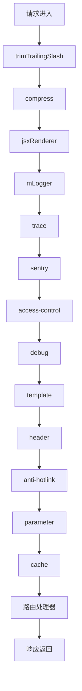
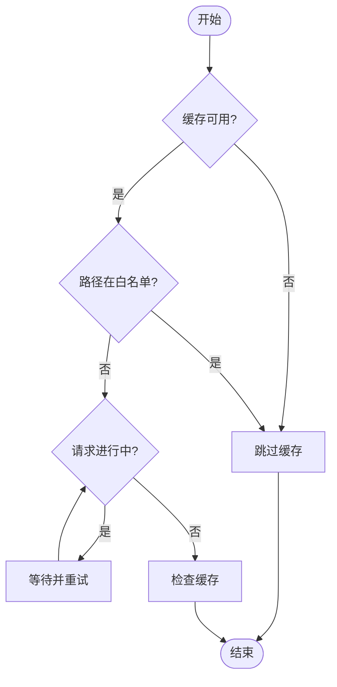
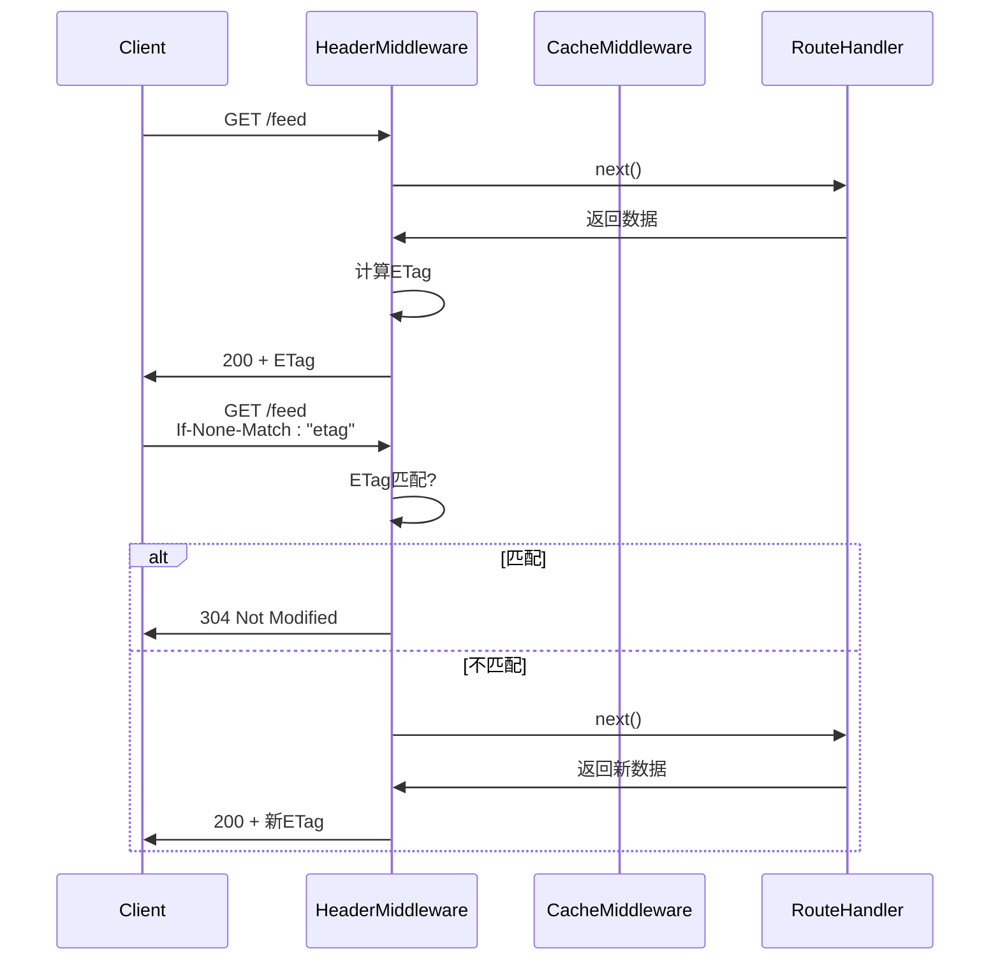

# 中间件集成

<cite>
**本文档中引用的文件**  
- [cache.ts](file://lib/middleware/cache.ts)
- [access-control.ts](file://lib/middleware/access-control.ts)
- [logger.ts](file://lib/middleware/logger.ts)
- [header.ts](file://lib/middleware/header.ts)
- [app-bootstrap.tsx](file://lib/app-bootstrap.tsx)
- [config.ts](file://lib/config.ts)
- [cache/index.ts](file://lib/utils/cache/index.ts)
</cite>

## 目录
1. [引言](#引言)
2. [中间件管道执行顺序](#中间件管道执行顺序)
3. [缓存中间件的前置条件检查](#缓存中间件的前置条件检查)
4. [缓存中间件的后置处理逻辑](#缓存中间件的后置处理逻辑)
5. [与其他中间件的协同工作](#与其他中间件的协同工作)
6. [条件请求与ETag验证](#条件请求与etag验证)
7. [错误处理与降级策略](#错误处理与降级策略)
8. [配置与扩展](#配置与扩展)

## 引言

缓存中间件在 RSSHub 的中间件管道中扮演着关键角色，负责优化请求处理性能、减少后端负载并提升用户体验。该中间件通过智能缓存策略，结合访问控制、日志记录、请求重写等其他中间件，构建了一个高效、安全且可扩展的请求处理流程。本文档详细描述缓存中间件的集成模式、执行顺序、前置与后置处理逻辑，以及与其他中间件的协同工作机制。

**Section sources**
- [cache.ts](file://lib/middleware/cache.ts#L1-L84)
- [app-bootstrap.tsx](file://lib/app-bootstrap.tsx#L1-L54)

## 中间件管道执行顺序

在 RSSHub 中，中间件按照严格的顺序执行，确保每个请求在到达最终路由处理器之前经过一系列预处理步骤。缓存中间件位于管道的较后位置，确保在访问控制、参数处理等关键步骤完成后才进行缓存检查。

**Diagram sources**
- [app-bootstrap.tsx](file://lib/app-bootstrap.tsx#L27-L45)

**Section sources**
- [app-bootstrap.tsx](file://lib/app-bootstrap.tsx#L27-L45)

## 缓存中间件的前置条件检查

缓存中间件在执行缓存查找前会进行多项前置条件检查，以决定是否跳过缓存逻辑或进入缓存处理流程。

### 缓存可用性检查
中间件首先检查缓存系统是否可用（`cacheModule.status.available`），若不可用则直接跳过缓存逻辑，继续执行后续中间件。

### 路径白名单检查
对于根路径、robots.txt、favicon.ico 等静态资源路径，中间件会直接跳过缓存，避免不必要的缓存操作。

### 并发请求控制
中间件使用 `controlKey` 来标记当前路径是否正在被请求。若检测到同一路径的请求正在进行，中间件会进入等待状态，最多重试 10 次（测试环境为 1 次），每次等待 6 秒。若超时仍未完成，则抛出 `RequestInProgressError` 错误，提示用户稍后重试。

**Diagram sources**
- [cache.ts](file://lib/middleware/cache.ts#L14-L44)

**Section sources**
- [cache.ts](file://lib/middleware/cache.ts#L14-L44)

## 缓存中间件的后置处理逻辑

当请求未命中缓存时，缓存中间件会在路由处理器执行后进行后置处理，将生成的数据存入缓存。

### 缓存键生成
缓存键由请求路径、格式参数和限制参数通过 XXH64 哈希算法生成，确保键的唯一性和紧凑性。

### 数据缓存存储
在路由处理器成功返回数据后，中间件会将数据序列化为 JSON 字符串，并通过 `globalCache.set` 方法存入缓存，设置过期时间为 `config.cache.routeExpire`。

### 控制键清理
无论是否成功设置缓存，中间件都会将 `controlKey` 设置为 '0'，表示该路径的请求已完成，允许后续请求正常进入处理流程。

**Section sources**
- [cache.ts](file://lib/middleware/cache.ts#L46-L81)

## 与其他中间件的协同工作

缓存中间件与多个其他中间件协同工作，共同构建完整的请求处理流程。

### 与访问控制中间件协同
访问控制中间件（`access-control`）在缓存中间件之前执行，确保只有通过身份验证的请求才能进入缓存检查流程。这防止了未授权用户绕过访问控制直接获取缓存内容。

### 与日志记录中间件协同
日志记录中间件（`logger`）在请求开始和结束时记录日志，包括缓存状态（HIT/MISS）。这有助于监控缓存命中率和系统性能。

### 与请求头处理中间件协同
请求头处理中间件（`header`）负责设置 ETag 和 Last-Modified 头，这些头信息与缓存机制紧密相关，用于支持条件请求和 304 Not Modified 响应。

**Section sources**
- [access-control.ts](file://lib/middleware/access-control.ts#L1-L27)
- [logger.ts](file://lib/middleware/logger.ts#L1-L46)
- [header.ts](file://lib/middleware/header.ts#L1-L56)

## 条件请求与ETag验证

缓存中间件与 `header` 中间件配合，支持 HTTP 条件请求机制。

### ETag生成与验证
`header` 中间件在响应生成后计算内容的 ETag，并将其设置为响应头。当下一个请求携带 `If-None-Match` 头时，中间件会比对 ETag，若匹配则返回 304 状态码，告知客户端使用本地缓存。

### Last-Modified支持
中间件会自动更新 `lastBuildDate` 字段，并将其作为 `Last-Modified` 头返回，支持基于时间的条件请求。

**Diagram sources**
- [header.ts](file://lib/middleware/header.ts#L18-L53)

**Section sources**
- [header.ts](file://lib/middleware/header.ts#L18-L53)

## 错误处理与降级策略

缓存中间件具备完善的错误处理机制，确保在缓存服务不可用时系统仍能正常运行。

### 缓存服务不可用
当 Redis 或内存缓存不可用时，`cacheModule.status.available` 将为 `false`，中间件会自动跳过缓存逻辑，直接执行后续处理。此时系统降级为无缓存模式，所有请求都将重新生成内容。

### 异常捕获与清理
在 `try-catch` 块中执行 `next()`，若路由处理器抛出异常，中间件会捕获异常并确保 `controlKey` 被正确清理，避免死锁状态。

### 配置驱动的降级
通过 `config.cache.type` 配置项，可以动态启用或禁用缓存功能。当设置为 'NO' 或空字符串时，缓存功能完全禁用，系统进入降级模式。

**Section sources**
- [cache.ts](file://lib/middleware/cache.ts#L63-L68)
- [cache/index.ts](file://lib/utils/cache/index.ts#L18-L60)

## 配置与扩展

缓存行为通过 `config.ts` 中的配置项进行控制，支持灵活的扩展和定制。

### 主要配置项
- `CACHE_TYPE`: 缓存类型，支持 'memory'、'redis' 或禁用
- `CACHE_EXPIRE`: 路由缓存过期时间（秒）
- `CACHE_CONTENT_EXPIRE`: 内容缓存过期时间（秒）
- `CACHE_REQUEST_TIMEOUT`: 请求超时控制时间

### 扩展点
开发者可以通过实现自定义的缓存模块（如 `memory` 或 `redis`）来扩展缓存功能，或通过中间件管道注入自定义逻辑。

**Section sources**
- [config.ts](file://lib/config.ts#L23-L28)
- [cache/index.ts](file://lib/utils/cache/index.ts#L18-L60)