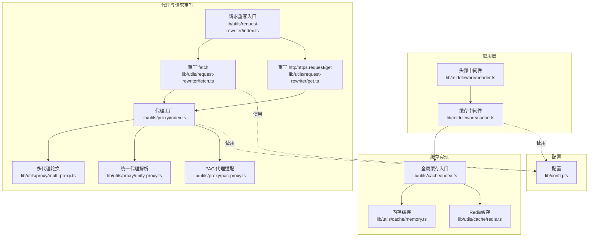
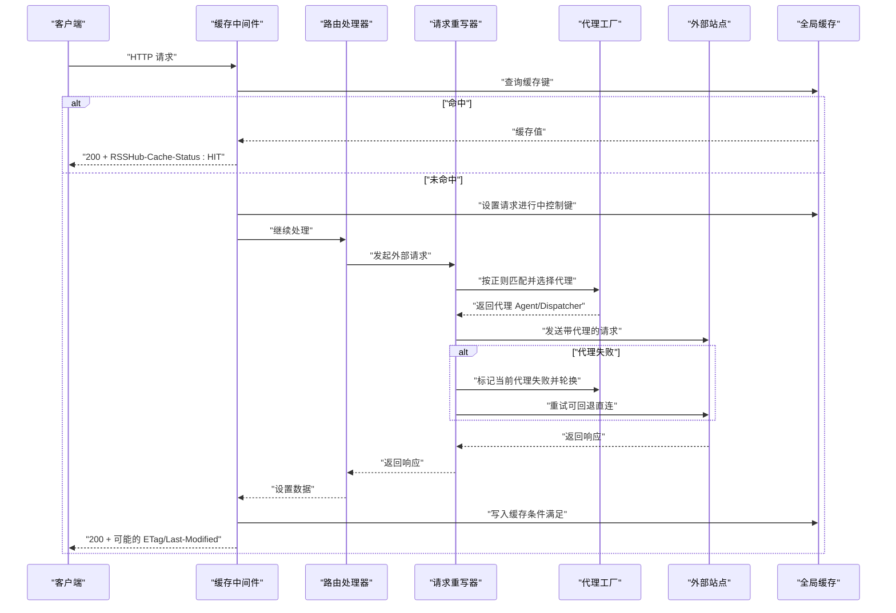
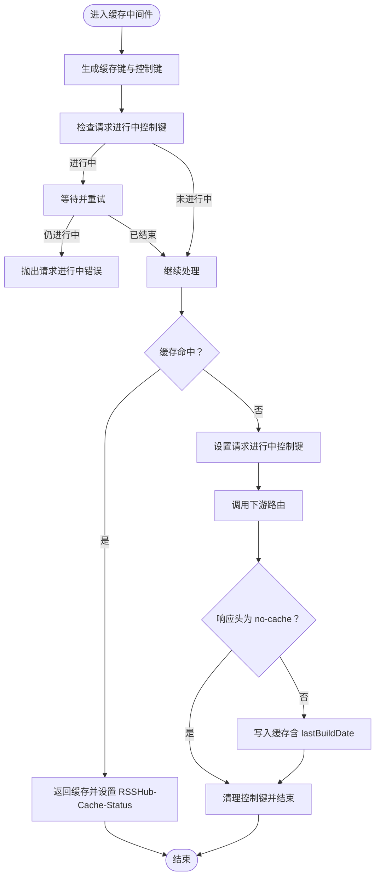
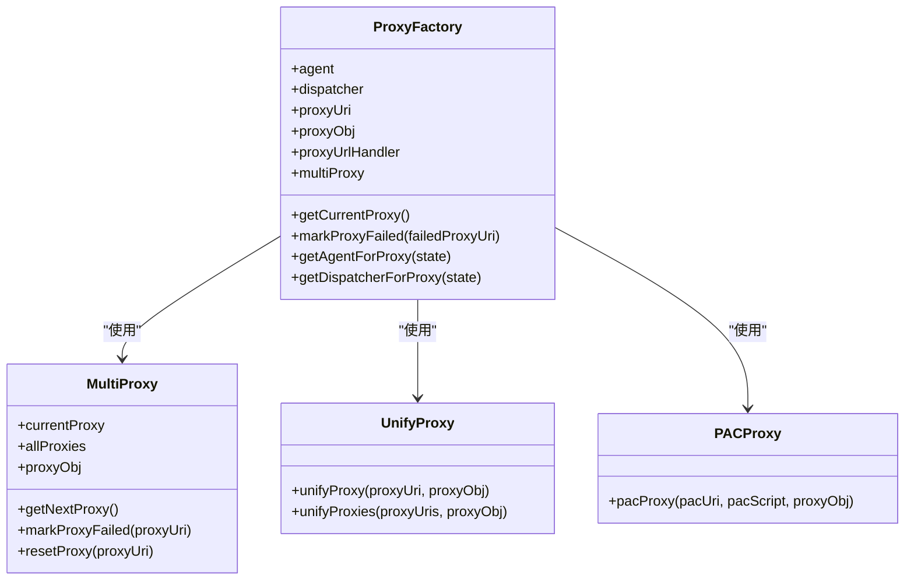
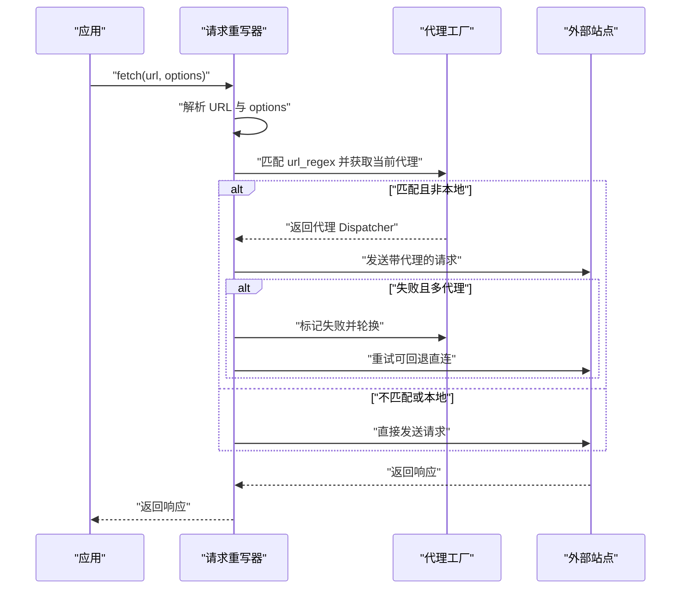
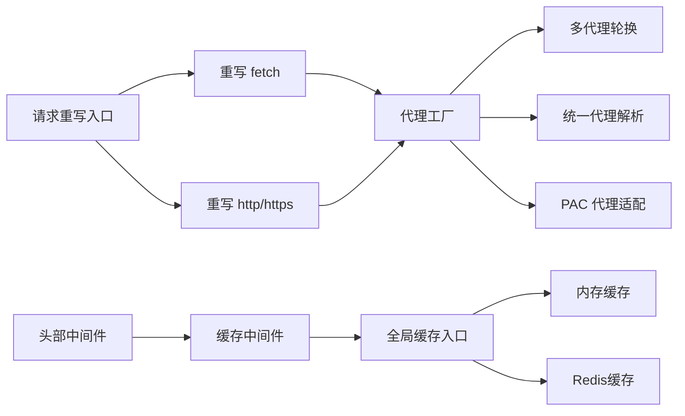

# 代理集成

<cite>
**本文引用的文件**
- [lib/middleware/cache.ts](file://lib/middleware/cache.ts)
- [lib/middleware/header.ts](file://lib/middleware/header.ts)
- [lib/utils/cache/index.ts](file://lib/utils/cache/index.ts)
- [lib/utils/cache/memory.ts](file://lib/utils/cache/memory.ts)
- [lib/utils/cache/redis.ts](file://lib/utils/cache/redis.ts)
- [lib/utils/proxy/index.ts](file://lib/utils/proxy/index.ts)
- [lib/utils/proxy/multi-proxy.ts](file://lib/utils/proxy/multi-proxy.ts)
- [lib/utils/proxy/unify-proxy.ts](file://lib/utils/proxy/unify-proxy.ts)
- [lib/utils/proxy/pac-proxy.ts](file://lib/utils/proxy/pac-proxy.ts)
- [lib/utils/request-rewriter/index.ts](file://lib/utils/request-rewriter/index.ts)
- [lib/utils/request-rewriter/fetch.ts](file://lib/utils/request-rewriter/fetch.ts)
- [lib/utils/request-rewriter/get.ts](file://lib/utils/request-rewriter/get.ts)
- [lib/config.ts](file://lib/config.ts)
- [lib/middleware/cache.test.ts](file://lib/middleware/cache.test.ts)
- [lib/utils/request-rewriter.test.ts](file://lib/utils/request-rewriter.test.ts)
- [lib/routes/telegram/channel-media.ts](file://lib/routes/telegram/channel-media.ts)
</cite>

## 目录
1. [简介](#简介)
2. [项目结构](#项目结构)
3. [核心组件](#核心组件)
4. [架构总览](#架构总览)
5. [详细组件分析](#详细组件分析)
6. [依赖关系分析](#依赖关系分析)
7. [性能考量](#性能考量)
8. [故障排查指南](#故障排查指南)
9. [结论](#结论)
10. [附录：配置示例与最佳实践](#附录配置示例与最佳实践)

## 简介
本文件聚焦 RSSHub 中“代理系统与缓存系统”的协同工作机制，围绕以下目标展开：
- 通过代理获取外部内容时，缓存系统如何处理代理相关的请求头、认证信息与地理位置差异；
- 代理失败时的缓存回退策略，以及如何缓存代理响应的元数据；
- 代理轮换机制与缓存失效的协调，防止因代理IP变化导致的内容差异被错误缓存；
- 提供代理与缓存协同工作的配置示例与性能优化建议。

## 项目结构
从仓库中可以看到，代理与缓存的协作主要分布在如下模块：
- 缓存中间件与缓存实现：lib/middleware/cache.ts、lib/utils/cache/index.ts、lib/utils/cache/memory.ts、lib/utils/cache/redis.ts
- 请求重写与代理：lib/utils/request-rewriter/index.ts、lib/utils/request-rewriter/fetch.ts、lib/utils/request-rewriter/get.ts
- 代理工厂与多代理轮换：lib/utils/proxy/index.ts、lib/utils/proxy/multi-proxy.ts、lib/utils/proxy/unify-proxy.ts、lib/utils/proxy/pac-proxy.ts
- 配置项：lib/config.ts
- 测试用例：lib/middleware/cache.test.ts、lib/utils/request-rewriter.test.ts
- 特定路由示例（媒体类路由禁用并发锁）：lib/routes/telegram/channel-media.ts

图表来源
- [lib/middleware/cache.ts](file://lib/middleware/cache.ts#L1-L84)
- [lib/utils/cache/index.ts](file://lib/utils/cache/index.ts#L1-L60)
- [lib/utils/cache/memory.ts](file://lib/utils/cache/memory.ts#L1-L45)
- [lib/utils/cache/redis.ts](file://lib/utils/cache/redis.ts#L1-L78)
- [lib/utils/request-rewriter/index.ts](file://lib/utils/request-rewriter/index.ts#L1-L21)
- [lib/utils/request-rewriter/fetch.ts](file://lib/utils/request-rewriter/fetch.ts#L79-L127)
- [lib/utils/proxy/index.ts](file://lib/utils/proxy/index.ts#L1-L142)
- [lib/utils/proxy/multi-proxy.ts](file://lib/utils/proxy/multi-proxy.ts#L1-L140)
- [lib/utils/proxy/unify-proxy.ts](file://lib/utils/proxy/unify-proxy.ts#L1-L116)
- [lib/utils/proxy/pac-proxy.ts](file://lib/utils/proxy/pac-proxy.ts#L1-L73)
- [lib/config.ts](file://lib/config.ts#L737-L768)

章节来源
- [lib/middleware/cache.ts](file://lib/middleware/cache.ts#L1-L84)
- [lib/utils/cache/index.ts](file://lib/utils/cache/index.ts#L1-L60)
- [lib/utils/proxy/index.ts](file://lib/utils/proxy/index.ts#L1-L142)
- [lib/utils/request-rewriter/index.ts](file://lib/utils/request-rewriter/index.ts#L1-L21)
- [lib/config.ts](file://lib/config.ts#L737-L768)

## 核心组件
- 缓存中间件：负责生成缓存键、并发请求控制、命中/未命中分支、缓存写入与状态头设置；同时向下游路由暴露缓存控制键以便路由自定义行为。
- 全局缓存入口：根据配置选择内存或 Redis 实现，并提供 get/set 接口。
- 代理工厂：支持单代理、多代理轮换、PAC 代理；统一代理 URI 解析与认证头注入；提供 Agent 与 Dispatcher。
- 请求重写：拦截 fetch 与 http/https 的 request/get，按正则匹配决定是否走代理；在多代理场景下失败自动切换并回退到直连。
- 头部中间件：设置公共响应头、ETag/Last-Modified、跨域等。

章节来源
- [lib/middleware/cache.ts](file://lib/middleware/cache.ts#L1-L84)
- [lib/utils/cache/index.ts](file://lib/utils/cache/index.ts#L1-L60)
- [lib/utils/proxy/index.ts](file://lib/utils/proxy/index.ts#L1-L142)
- [lib/utils/request-rewriter/fetch.ts](file://lib/utils/request-rewriter/fetch.ts#L79-L127)
- [lib/middleware/header.ts](file://lib/middleware/header.ts#L1-L56)

## 架构总览
代理与缓存的协同流程如下：
- 请求进入后，先经缓存中间件计算缓存键并检查命中；若未命中，则设置“请求进行中”控制键，避免并发风暴。
- 下游路由执行业务逻辑，通常会通过重写的 fetch 或 http/https 发起对外请求；请求重写器根据配置与正则判断是否启用代理，并注入代理认证头。
- 外部请求可能因代理失败而重试；在多代理模式下，失败会触发轮换，直至可用或回退直连。
- 响应返回后，缓存中间件根据响应头与数据决定是否写入缓存；同时设置 RSSHub-Cache-Status 等状态头。

图表来源
- [lib/middleware/cache.ts](file://lib/middleware/cache.ts#L1-L84)
- [lib/utils/request-rewriter/fetch.ts](file://lib/utils/request-rewriter/fetch.ts#L79-L127)
- [lib/utils/proxy/index.ts](file://lib/utils/proxy/index.ts#L1-L142)
- [lib/utils/cache/index.ts](file://lib/utils/cache/index.ts#L1-L60)

## 详细组件分析

### 缓存中间件与缓存实现
- 缓存键生成：基于路径、format、limit 组合，使用哈希缩短键长度；同时生成“请求进行中”控制键用于并发控制。
- 并发控制：当检测到同一路径有请求在进行时，等待一段时间后重试；若仍处于进行中则抛出“请求进行中”错误。
- 命中与未命中：命中直接返回缓存并设置 RSSHub-Cache-Status；未命中则允许后续写入缓存。
- 写入缓存：仅当响应头不为 no-cache 且存在数据时写入；写入前更新 lastBuildDate 为当前 UTC 时间。
- 控制键清理：无论成功与否，最终都会清除“请求进行中”控制键，确保后续请求可正常处理。

图表来源
- [lib/middleware/cache.ts](file://lib/middleware/cache.ts#L1-L84)

章节来源
- [lib/middleware/cache.ts](file://lib/middleware/cache.ts#L1-L84)
- [lib/utils/cache/index.ts](file://lib/utils/cache/index.ts#L1-L60)
- [lib/utils/cache/memory.ts](file://lib/utils/cache/memory.ts#L1-L45)
- [lib/utils/cache/redis.ts](file://lib/utils/cache/redis.ts#L1-L78)

### 代理工厂与多代理轮换
- 单代理/多代理/PAC 三种模式：优先级 PAC > 多代理 > 单代理；多代理内部维护代理列表、健康检查与失败计数。
- 代理认证：支持 HTTP(S) 代理 Basic 认证头注入；SOCKS 代理不注入认证头。
- 代理切换：失败时标记当前代理失败并轮换下一个活跃代理；若无可用代理则回退直连。
- 代理选择：getNextProxy 按顺序轮询活跃代理；健康检查定时器将超时未恢复的代理重新置为活跃。

图表来源
- [lib/utils/proxy/index.ts](file://lib/utils/proxy/index.ts#L1-L142)
- [lib/utils/proxy/multi-proxy.ts](file://lib/utils/proxy/multi-proxy.ts#L1-L140)
- [lib/utils/proxy/unify-proxy.ts](file://lib/utils/proxy/unify-proxy.ts#L1-L116)
- [lib/utils/proxy/pac-proxy.ts](file://lib/utils/proxy/pac-proxy.ts#L1-L73)

章节来源
- [lib/utils/proxy/index.ts](file://lib/utils/proxy/index.ts#L1-L142)
- [lib/utils/proxy/multi-proxy.ts](file://lib/utils/proxy/multi-proxy.ts#L1-L140)
- [lib/utils/proxy/unify-proxy.ts](file://lib/utils/proxy/unify-proxy.ts#L1-L116)
- [lib/utils/proxy/pac-proxy.ts](file://lib/utils/proxy/pac-proxy.ts#L1-L73)

### 请求重写与代理注入
- 重写入口：将 fetch、http.get、http.request、https.get、https.request 替换为重写版本。
- 代理注入：根据配置中的 url_regex 正则匹配目标 URL，若匹配且非本地回环，则为请求注入代理 Dispatcher；同时注入代理认证头。
- 失败重试：在多代理模式下，若请求失败且已使用代理，则尝试切换到下一个代理；若无可用代理则回退直连。

图表来源
- [lib/utils/request-rewriter/index.ts](file://lib/utils/request-rewriter/index.ts#L1-L21)
- [lib/utils/request-rewriter/fetch.ts](file://lib/utils/request-rewriter/fetch.ts#L79-L127)
- [lib/utils/proxy/index.ts](file://lib/utils/proxy/index.ts#L1-L142)

章节来源
- [lib/utils/request-rewriter/index.ts](file://lib/utils/request-rewriter/index.ts#L1-L21)
- [lib/utils/request-rewriter/fetch.ts](file://lib/utils/request-rewriter/fetch.ts#L79-L127)
- [lib/utils/request-rewriter/get.ts](file://lib/utils/request-rewriter/get.ts#L1-L46)
- [lib/utils/proxy/index.ts](file://lib/utils/proxy/index.ts#L1-L142)

### 头部中间件与缓存元数据
- 设置公共响应头：如 Cache-Control、X-Content-Type-Options、节点标识等。
- ETag/304：在路由返回数据后，若未显式设置 ETag，则根据数据生成 ETag；若 If-None-Match 匹配则返回 304。
- 路由追踪：记录 X-RSSHub-Route，便于调试与统计。

章节来源
- [lib/middleware/header.ts](file://lib/middleware/header.ts#L1-L56)

### 特定路由的缓存行为
- 媒体类路由（如 Telegram Channel Media）明确禁用并发锁，以避免大体积资源的锁竞争；这类路由通常不适用缓存或采用其他策略。

章节来源
- [lib/routes/telegram/channel-media.ts](file://lib/routes/telegram/channel-media.ts#L142-L146)

## 依赖关系分析
- 缓存中间件依赖全局缓存入口；全局缓存入口根据配置选择内存或 Redis 实现。
- 请求重写器依赖代理工厂；代理工厂根据配置选择单/多/PAC 模式，并在多代理模式下依赖健康检查与失败计数。
- 头部中间件与缓存中间件共同影响响应元数据与缓存命中率。

图表来源
- [lib/middleware/cache.ts](file://lib/middleware/cache.ts#L1-L84)
- [lib/utils/cache/index.ts](file://lib/utils/cache/index.ts#L1-L60)
- [lib/utils/request-rewriter/index.ts](file://lib/utils/request-rewriter/index.ts#L1-L21)
- [lib/utils/proxy/index.ts](file://lib/utils/proxy/index.ts#L1-L142)

章节来源
- [lib/middleware/cache.ts](file://lib/middleware/cache.ts#L1-L84)
- [lib/utils/cache/index.ts](file://lib/utils/cache/index.ts#L1-L60)
- [lib/utils/proxy/index.ts](file://lib/utils/proxy/index.ts#L1-L142)
- [lib/utils/request-rewriter/index.ts](file://lib/utils/request-rewriter/index.ts#L1-L21)

## 性能考量
- 缓存键设计：通过路径、format、limit 组合形成稳定键空间，避免不同参数组合导致的缓存污染。
- 并发控制：请求进行中控制键有效降低重复抓取带来的压力；测试用例验证了并发请求的正确行为。
- 代理轮换：多代理失败阈值与健康检查间隔可平衡稳定性与切换成本；失败时自动回退直连，减少长时间不可用。
- 大体积资源：媒体类路由禁用并发锁，避免阻塞；同时可结合路由自身策略（如不缓存或短 TTL）。
- ETag/304：利用 ETag 减少传输负载，提升边缘缓存命中率。

章节来源
- [lib/middleware/cache.test.ts](file://lib/middleware/cache.test.ts#L1-L190)
- [lib/utils/request-rewriter.test.ts](file://lib/utils/request-rewriter.test.ts#L40-L214)
- [lib/routes/telegram/channel-media.ts](file://lib/routes/telegram/channel-media.ts#L142-L146)

## 故障排查指南
- 代理认证问题：确认 PROXY_AUTH 仅对 HTTP(S) 代理生效；若使用 PAC 或 SOCKS，需注意认证注入限制。
- 代理协议与端口：统一代理解析会对协议、主机、端口进行校验与警告；请确保配置一致。
- 多代理失败：观察日志中“标记为不活跃/切换到代理/无可用代理”的提示；必要时手动 reset。
- 缓存未命中：检查 RSSHub-Cache-Status 是否为 MISS；确认 Cache-Control 是否为 no-cache；核对缓存键生成规则。
- ETag/304：若出现 304，确认客户端 If-None-Match 与服务端 ETag 是否匹配。

章节来源
- [lib/utils/proxy/unify-proxy.ts](file://lib/utils/proxy/unify-proxy.ts#L1-L116)
- [lib/utils/proxy/pac-proxy.ts](file://lib/utils/proxy/pac-proxy.ts#L1-L73)
- [lib/utils/proxy/multi-proxy.ts](file://lib/utils/proxy/multi-proxy.ts#L1-L140)
- [lib/middleware/cache.ts](file://lib/middleware/cache.ts#L1-L84)
- [lib/middleware/header.ts](file://lib/middleware/header.ts#L1-L56)

## 结论
RSSHub 的代理与缓存协同机制通过“请求重写 + 代理工厂 + 缓存中间件”的组合，实现了：
- 对代理请求的透明注入与失败回退；
- 基于路径与参数的稳定缓存键与并发控制；
- 响应元数据（ETag/Last-Modified/Cache-Control）的合理使用；
- 多代理轮换与健康检查，降低代理失效对系统的影响。

在代理IP变化导致的内容差异方面，通过“请求进行中控制键 + 缓存写入条件 + ETag/304”等机制，避免了错误缓存的传播；同时特定路由可禁用并发锁以适配大体积资源。

## 附录：配置示例与最佳实践

- 代理配置要点
  - 单代理：设置 PROXY_URI 或 PROXY_PROTOCOL/HOST/PORT；若使用 HTTP(S) 代理，可通过 PROXY_AUTH 注入认证头。
  - 多代理：设置 PROXY_URIS 列表，系统将自动轮换；可配置 url_regex 控制哪些请求走代理。
  - PAC：设置 PAC_URI 或 PAC_SCRIPT；注意协议与认证头的兼容性。
  - 关键参数参考：PROXY_URI/PROXY_URIS、PROXY_PROTOCOL/HOST/PORT/AUTH、PROXY_URL_REGEX、PROXY_STRATEGY、PROXY_HEALTH_CHECK_INTERVAL、PROXY_FAILOVER_TIMEOUT。

- 缓存配置要点
  - CACHE_TYPE：选择 memory 或 redis；redis 需要 REDIS_URL。
  - CACHE_EXPIRE：路由缓存过期时间；CACHE_CONTENT_EXPIRE：不变内容缓存过期时间。
  - CACHE_REQUEST_TIMEOUT：请求进行中控制键的过期时间。

- 代理与缓存协同的最佳实践
  - 将“代理失败回退直连”与“缓存写入条件”配合使用，避免代理IP变化导致的错误缓存。
  - 对大体积资源（如媒体）禁用并发锁，或采用短 TTL + ETag 304。
  - 使用 url_regex 精确控制走代理的目标站点，减少不必要的代理开销。
  - 合理设置多代理失败阈值与健康检查间隔，兼顾稳定性与切换速度。

章节来源
- [lib/config.ts](file://lib/config.ts#L737-L768)
- [lib/utils/proxy/index.ts](file://lib/utils/proxy/index.ts#L1-L142)
- [lib/utils/proxy/multi-proxy.ts](file://lib/utils/proxy/multi-proxy.ts#L1-L140)
- [lib/utils/cache/index.ts](file://lib/utils/cache/index.ts#L1-L60)
- [lib/middleware/cache.ts](file://lib/middleware/cache.ts#L1-L84)
- [lib/routes/telegram/channel-media.ts](file://lib/routes/telegram/channel-media.ts#L142-L146)