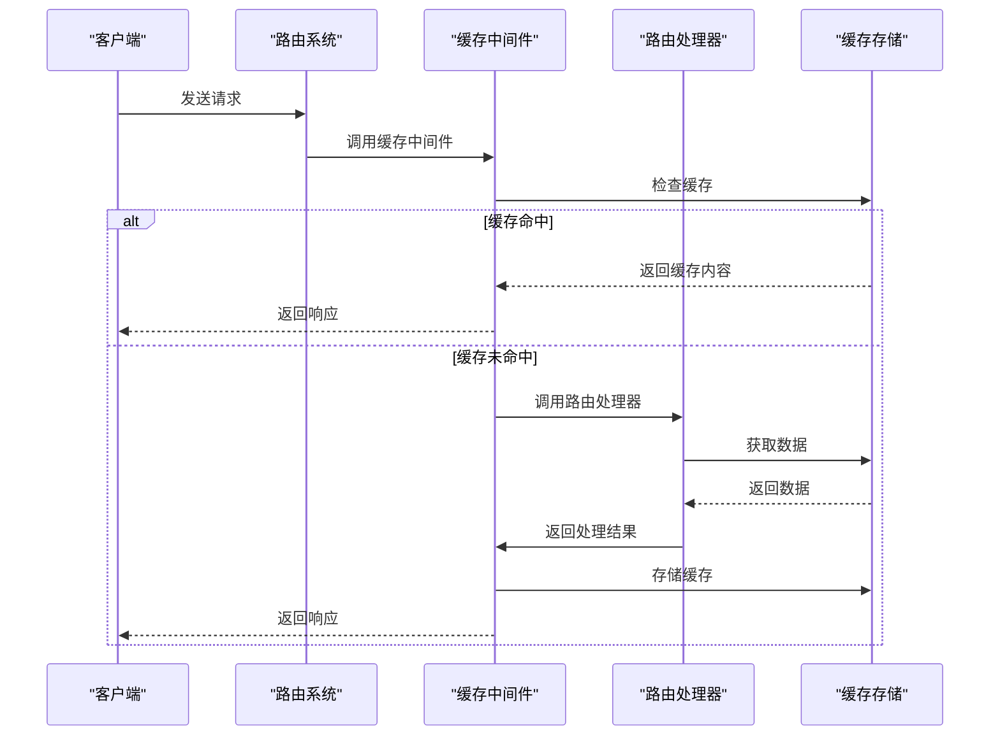
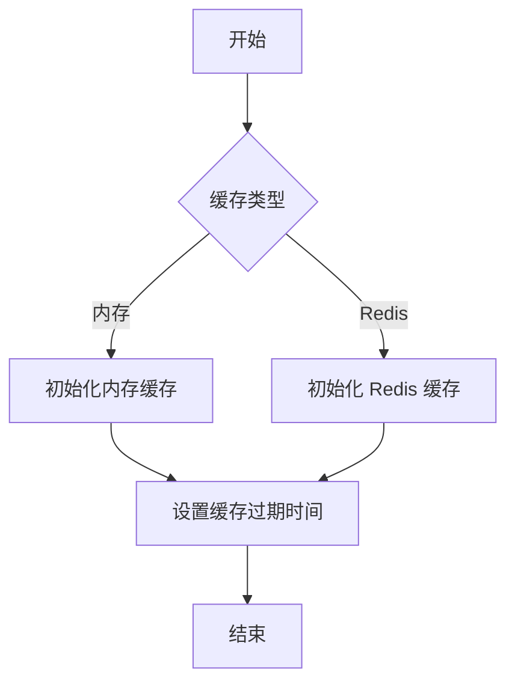
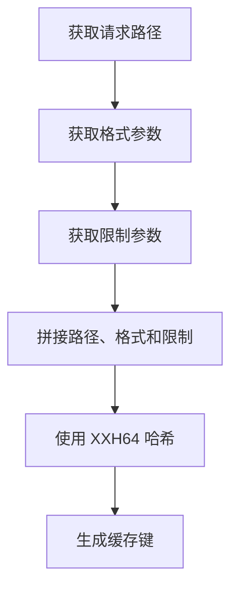
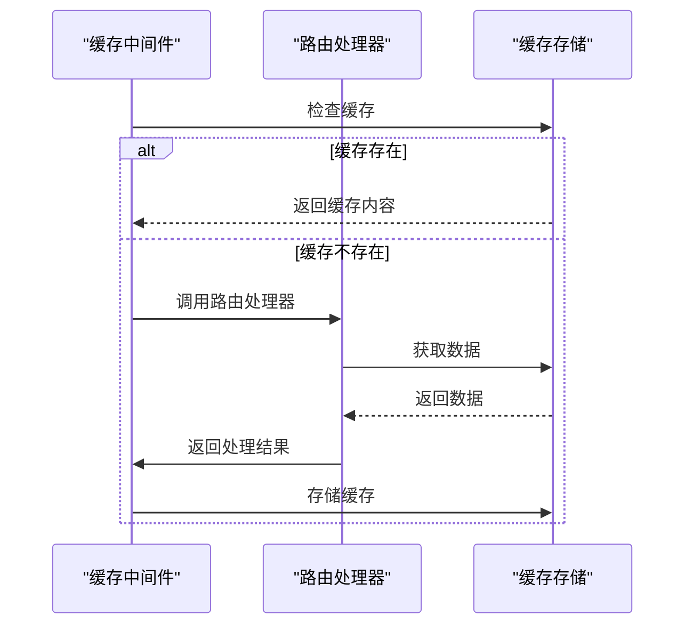
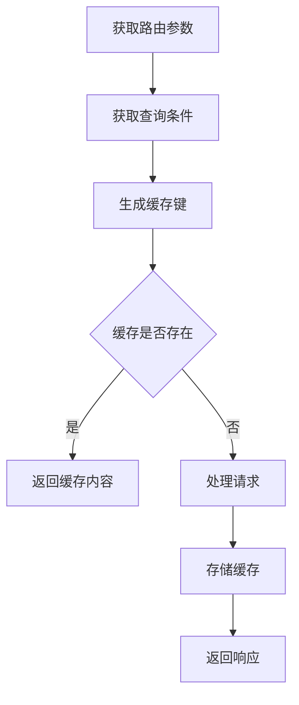
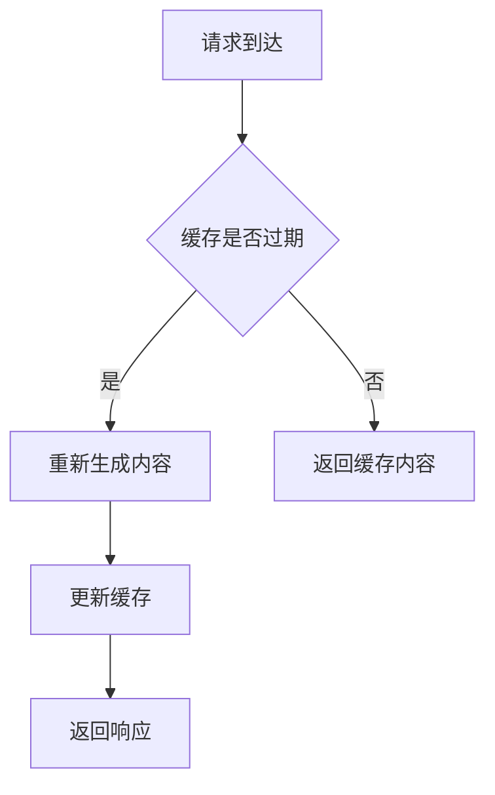
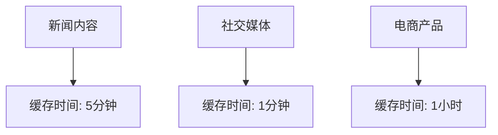

# 路由集成

<cite>
**本文档中引用的文件**  
- [cache.ts](file://lib/middleware/cache.ts)
- [router.js](file://lib/router.js)
- [config.ts](file://lib/config.ts)
- [index.ts](file://lib/utils/cache/index.ts)
- [memory.ts](file://lib/utils/cache/memory.ts)
- [redis.ts](file://lib/utils/cache/redis.ts)
- [header.ts](file://lib/middleware/header.ts)
</cite>

## 目录
1. [引言](#引言)
2. [缓存系统与路由系统的集成机制](#缓存系统与路由系统的集成机制)
3. [缓存策略配置](#缓存策略配置)
4. [缓存键生成规则](#缓存键生成规则)
5. [路由处理器与缓存中间件的交互流程](#路由处理器与缓存中间件的交互流程)
6. [动态路由和参数化路由的缓存处理](#动态路由和参数化路由的缓存处理)
7. [路由级别的缓存失效策略](#路由级别的缓存失效策略)
8. [路由缓存配置最佳实践](#路由缓存配置最佳实践)
9. [结论](#结论)

## 引言
RSSHub 是一个开源的 RSS 生成器，通过集成缓存系统与路由系统，实现了高效的内容分发。本文档详细描述了缓存系统与路由系统的集成机制，包括缓存策略配置、缓存键生成规则、路由处理器与缓存中间件的交互流程、动态路由和参数化路由的缓存处理方式，以及路由级别的缓存失效策略。同时，提供了不同内容类型的差异化缓存策略最佳实践。

**Section sources**
- [cache.ts](file://lib/middleware/cache.ts#L1-L84)
- [router.js](file://lib/router.js#L1-L800)

## 缓存系统与路由系统的集成机制
RSSHub 的缓存系统与路由系统通过中间件机制紧密集成。当一个请求到达时，路由系统首先匹配相应的路由处理器，然后缓存中间件在请求处理过程中检查缓存状态。如果缓存命中，则直接返回缓存内容；否则，继续执行路由处理器，并在处理完成后将结果存入缓存。

**Diagram sources**
- [cache.ts](file://lib/middleware/cache.ts#L13-L83)
- [router.js](file://lib/router.js#L8-L16)

**Section sources**
- [cache.ts](file://lib/middleware/cache.ts#L13-L83)
- [router.js](file://lib/router.js#L8-L16)

## 缓存策略配置
RSSHub 的缓存策略通过配置文件进行定义，主要包括缓存类型、缓存过期时间等参数。缓存类型可以是内存缓存或 Redis 缓存，通过 `config.cache.type` 配置项指定。缓存过期时间分为路由缓存时间和内容缓存时间，分别通过 `config.cache.routeExpire` 和 `config.cache.contentExpire` 配置项定义。

**Diagram sources**
- [config.ts](file://lib/config.ts#L737-L768)
- [index.ts](file://lib/utils/cache/index.ts#L18-L60)

**Section sources**
- [config.ts](file://lib/config.ts#L737-L768)
- [index.ts](file://lib/utils/cache/index.ts#L18-L60)

## 缓存键生成规则
缓存键的生成规则是确保缓存唯一性和有效性的关键。RSSHub 使用请求路径、格式和限制参数生成缓存键。具体来说，缓存键由请求路径、格式查询参数和限制查询参数拼接后，通过 XXH64 哈希算法生成。这种生成方式既保证了缓存键的唯一性，又避免了过长的键名。

**Diagram sources**
- [cache.ts](file://lib/middleware/cache.ts#L19-L23)

**Section sources**
- [cache.ts](file://lib/middleware/cache.ts#L19-L23)

## 路由处理器与缓存中间件的交互流程
路由处理器与缓存中间件的交互流程是 RSSHub 缓存机制的核心。当请求到达时，缓存中间件首先检查缓存状态。如果缓存存在且未过期，则直接返回缓存内容；否则，调用路由处理器处理请求，并在处理完成后将结果存入缓存。这一流程确保了高并发场景下的性能和稳定性。

**Diagram sources**
- [cache.ts](file://lib/middleware/cache.ts#L46-L76)

**Section sources**
- [cache.ts](file://lib/middleware/cache.ts#L46-L76)

## 动态路由和参数化路由的缓存处理
动态路由和参数化路由的缓存处理需要考虑路由参数和查询条件的变化。RSSHub 通过将路由参数和查询条件纳入缓存键的生成过程，确保不同参数组合的请求能够正确地命中或未命中缓存。这种方式既支持了动态内容的缓存，又避免了缓存污染。

**Diagram sources**
- [cache.ts](file://lib/middleware/cache.ts#L19-L23)
- [router.js](file://lib/router.js#L8-L16)

**Section sources**
- [cache.ts](file://lib/middleware/cache.ts#L19-L23)
- [router.js](file://lib/router.js#L8-L16)

## 路由级别的缓存失效策略
路由级别的缓存失效策略是确保内容及时更新的重要机制。RSSHub 通过设置缓存过期时间和使用控制键（controlKey）来管理缓存的生命周期。当缓存过期或需要强制刷新时，系统会重新生成内容并更新缓存。此外，通过 `Cache-Control: no-cache` 头部可以临时禁用缓存，确保获取最新内容。

**Diagram sources**
- [cache.ts](file://lib/middleware/cache.ts#L71-L76)
- [header.ts](file://lib/middleware/header.ts#L11)

**Section sources**
- [cache.ts](file://lib/middleware/cache.ts#L71-L76)
- [header.ts](file://lib/middleware/header.ts#L11)

## 路由缓存配置最佳实践
针对不同内容类型，RSSHub 提供了差异化的缓存策略最佳实践。例如，新闻内容通常具有较高的更新频率，建议设置较短的缓存时间；社交媒体内容可能包含用户生成的内容，需要更频繁地刷新缓存；电商产品信息则相对稳定，可以设置较长的缓存时间。通过合理配置缓存策略，可以在保证内容新鲜度的同时，最大化缓存的性能优势。

**Diagram sources**
- [config.ts](file://lib/config.ts#L737-L739)

**Section sources**
- [config.ts](file://lib/config.ts#L737-L739)

## 结论
RSSHub 通过精心设计的缓存系统与路由系统的集成机制，实现了高效的内容分发和缓存管理。通过合理的缓存策略配置、精确的缓存键生成规则、高效的路由处理器与缓存中间件交互流程，以及灵活的路由级别缓存失效策略，RSSHub 能够在保证内容新鲜度的同时，提供卓越的性能表现。不同内容类型的差异化缓存策略最佳实践，进一步提升了系统的灵活性和实用性。