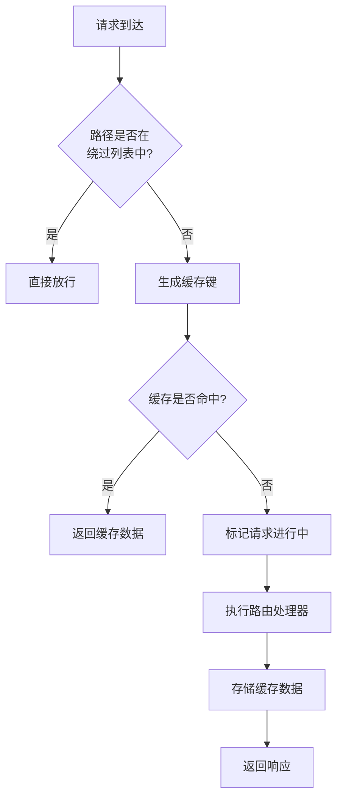
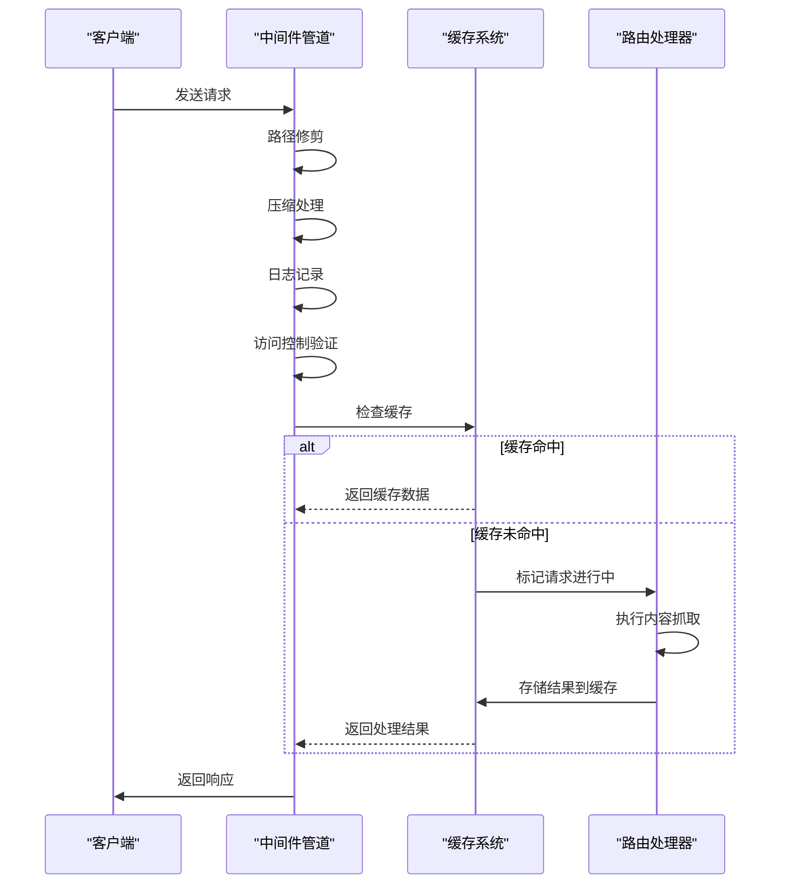
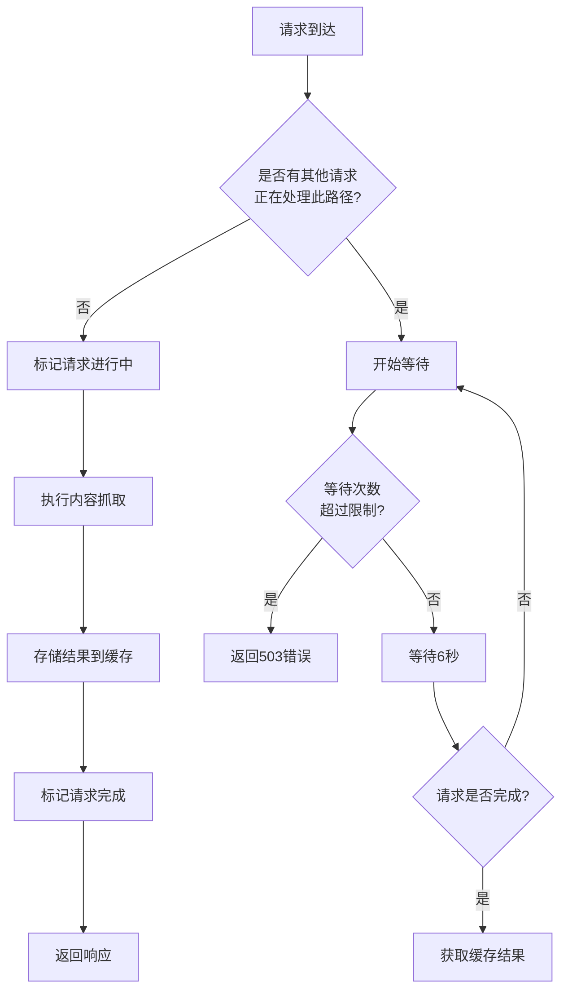
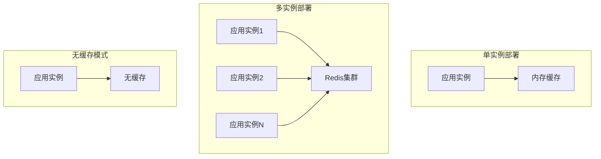

# 集成模式

<cite>
**本文档引用的文件**
- [cache.ts](file://lib/middleware/cache.ts)
- [app-bootstrap.tsx](file://lib/app-bootstrap.tsx)
- [config.ts](file://lib/config.ts)
- [access-control.ts](file://lib/middleware/access-control.ts)
- [logger.ts](file://lib/middleware/logger.ts)
- [index.ts](file://lib/utils/cache/index.ts)
- [memory.ts](file://lib/utils/cache/memory.ts)
- [redis.ts](file://lib/utils/cache/redis.ts)
- [debug.ts](file://lib/middleware/debug.ts)
</cite>

## 目录
1. [缓存系统与路由系统的集成](#缓存系统与路由系统的集成)
2. [缓存中间件在请求处理管道中的位置和执行顺序](#缓存中间件在请求处理管道中的位置和执行顺序)
3. [缓存系统与内容抓取模块的集成](#缓存系统与内容抓取模块的集成)
4. [集成模式的最佳实践](#集成模式的最佳实践)
5. [分布式部署环境下的集成挑战和解决方案](#分布式部署环境下的集成挑战和解决方案)

## 缓存系统与路由系统的集成

缓存系统与路由系统的集成主要通过中间件机制实现。在RSSHub中，缓存中间件被注册到应用的中间件管道中，对所有路由请求进行拦截和处理。当请求到达时，缓存中间件首先检查请求路径是否在绕过列表中（如根路径、robots.txt等），如果在则直接放行请求。

对于需要缓存的路由，系统会根据请求路径、格式和限制参数生成唯一的缓存键。使用XXH64哈希算法将键名缩短，以提高Redis等缓存系统的性能。缓存键的生成遵循特定的命名约定，以"rsshub:koa-redis-cache:"为前缀，确保键名的唯一性和可识别性。



**图示来源**
- [cache.ts](file://lib/middleware/cache.ts#L13-L83)
- [app-bootstrap.tsx](file://lib/app-bootstrap.tsx#L45)

## 缓存中间件在请求处理管道中的位置和执行顺序

缓存中间件在请求处理管道中的位置至关重要，它决定了与其他中间件的协同工作方式。在RSSHub中，中间件的执行顺序经过精心设计，确保了系统的安全性和性能。

中间件的执行顺序如下：
1. 路径修剪中间件(trimTrailingSlash)
2. 压缩中间件(compress)
3. 日志记录中间件(logger)
4. 请求追踪中间件(trace)
5. Sentry错误监控中间件(sentry)
6. 访问控制中间件(access-control)
7. 调试中间件(debug)
8. 模板渲染中间件(template)
9. 响应头设置中间件(header)
10. 防盗链中间件(anti-hotlink)
11. 参数处理中间件(parameter)
12. **缓存中间件(cache)**

这种顺序设计确保了在缓存检查之前完成必要的安全验证（如访问控制）和请求预处理。同时，在缓存之后执行内容抓取和处理，保证了缓存数据的正确性。



**图示来源**
- [app-bootstrap.tsx](file://lib/app-bootstrap.tsx#L27-L45)
- [cache.ts](file://lib/middleware/cache.ts#L13-L83)

**本节来源**
- [app-bootstrap.tsx](file://lib/app-bootstrap.tsx#L27-L45)
- [cache.ts](file://lib/middleware/cache.ts#L13-L83)
- [access-control.ts](file://lib/middleware/access-control.ts#L11-L26)
- [logger.ts](file://lib/middleware/logger.ts#L29-L45)

## 缓存系统与内容抓取模块的集成

缓存系统与内容抓取模块的集成是RSSHub性能优化的核心。当缓存未命中时，系统会执行内容抓取流程，并将结果存储到缓存中供后续请求使用。

缓存系统支持两种存储后端：内存缓存和Redis缓存。通过配置文件中的`CACHE_TYPE`环境变量来选择缓存类型。内存缓存使用LRU（最近最少使用）算法，适合单实例部署；Redis缓存支持分布式部署，适合多实例环境。

对于动态内容和个性化内容的缓存处理，系统采用了智能的缓存键生成策略。缓存键包含了请求路径、格式和限制参数，确保不同参数的请求能够获得正确的缓存结果。同时，系统通过`Cache-Control: no-cache`头部来控制特定内容不被缓存，为需要实时更新的内容提供支持。

```mermaid
classDiagram
class CacheModule {
+status : { available : boolean }
+clients : { redisClient? : Redis, memoryCache? : LRUCache }
+init() : void
+get(key : string, refresh? : boolean) : Promise~string | null~
+set(key : string, value? : string | Record~string, any~, maxAge? : number) : any
}
class RedisCache {
+init() : void
+get(key : string, refresh? : boolean) : Promise~string | null~
+set(key : string, value? : string | Record~string, any~, maxAge? : number) : any
}
class MemoryCache {
+init() : void
+get(key : string, refresh? : boolean) : string | undefined
+set(key : string, value? : string | Record~string, any~, maxAge? : number) : boolean
}
class CacheMiddleware {
+bypassList : Set~string~
+middleware : MiddlewareHandler
}
CacheModule <|-- RedisCache : "实现"
CacheModule <|-- MemoryCache : "实现"
CacheMiddleware --> CacheModule : "使用"
```

**图示来源**
- [index.ts](file://lib/utils/cache/index.ts#L16-L60)
- [memory.ts](file://lib/utils/cache/memory.ts#L12-L44)
- [redis.ts](file://lib/utils/cache/redis.ts#L20-L77)
- [cache.ts](file://lib/middleware/cache.ts#L13-L83)

**本节来源**
- [index.ts](file://lib/utils/cache/index.ts#L16-L60)
- [memory.ts](file://lib/utils/cache/memory.ts#L12-L44)
- [redis.ts](file://lib/utils/cache/redis.ts#L20-L77)
- [cache.ts](file://lib/middleware/cache.ts#L70-L76)

## 集成模式的最佳实践

### 错误处理策略

缓存系统的错误处理策略设计周密，确保了系统的稳定性和用户体验。当Redis连接失败或不可用时，系统会记录错误日志但不会中断服务，而是降级为无缓存模式运行。

对于并发请求的处理，系统采用了请求进行中控制机制。当一个请求正在处理某个路径时，后续请求会进入等待状态，最多等待10次（测试环境为1次），每次等待6秒。如果等待超时，系统会返回503错误，提示用户稍后重试。



**图示来源**
- [cache.ts](file://lib/middleware/cache.ts#L28-L43)
- [errors.tsx](file://lib/errors/index.tsx#L53-L55)

### 超时管理和重试策略

缓存系统的超时管理和重试策略通过配置文件中的多个参数进行控制：

- `CACHE_REQUEST_TIMEOUT`: 请求超时时间，用于控制请求进行中标记的有效期
- `CACHE_EXPIRE`: 路由缓存过期时间，单位为秒
- `CACHE_CONTENT_EXPIRE`: 内容缓存过期时间，单位为秒

系统还实现了智能的缓存刷新机制。当缓存命中时，系统会自动更新缓存的过期时间，延长数据的有效期。对于不变内容，使用较长的过期时间（默认1小时）；对于路由级别内容，使用较短的过期时间（默认5分钟）。

**本节来源**
- [cache.ts](file://lib/middleware/cache.ts#L29-L40)
- [config.ts](file://lib/config.ts#L737-L739)
- [errors.tsx](file://lib/errors/index.tsx#L53-L55)

## 分布式部署环境下的集成挑战和解决方案

在分布式部署环境下，缓存系统的集成面临多个挑战，RSSHub通过一系列设计模式和配置选项提供了有效的解决方案。

### 分布式缓存挑战

1. **数据一致性**: 多个实例之间需要共享缓存数据，避免数据不一致
2. **并发控制**: 需要跨实例协调并发请求，避免重复抓取
3. **故障恢复**: 单个实例故障不应影响整体缓存系统的可用性

### 解决方案

RSSHub通过Redis作为分布式缓存后端解决了上述挑战。Redis的原子操作特性确保了并发控制的可靠性，所有实例共享同一个Redis实例或集群，保证了数据的一致性。

系统还提供了灵活的缓存配置选项，允许根据部署环境选择合适的缓存策略：

- 单实例部署：使用内存缓存，简单高效
- 多实例部署：使用Redis缓存，支持数据共享
- 无缓存模式：禁用缓存，适用于开发和调试环境



**图示来源**
- [index.ts](file://lib/utils/cache/index.ts#L18-L49)
- [config.ts](file://lib/config.ts#L735-L747)

**本节来源**
- [index.ts](file://lib/utils/cache/index.ts#L18-L49)
- [config.ts](file://lib/config.ts#L735-L747)
- [redis.ts](file://lib/utils/cache/redis.ts#L20-L35)