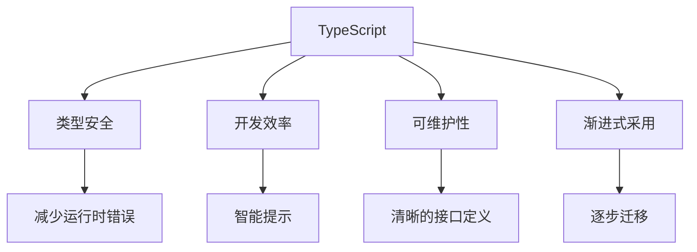
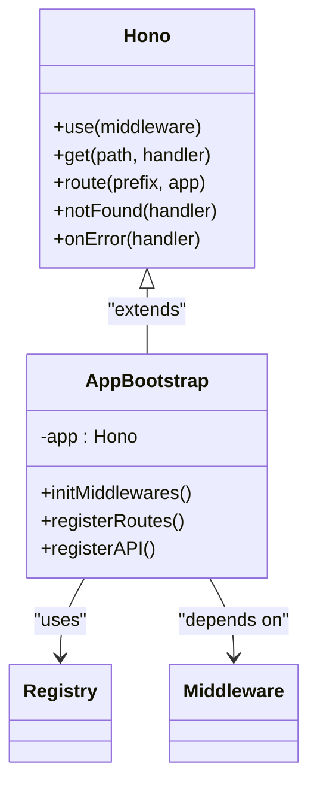
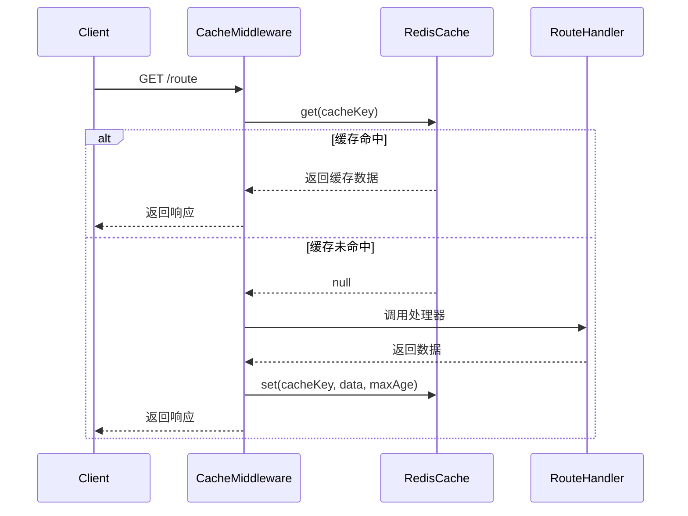

# 技术栈与依赖

<cite>
**本文档引用的文件**   
- [package.json](file://package.json)
- [tsconfig.json](file://tsconfig.json)
- [eslint.config.mjs](file://eslint.config.mjs)
- [.prettierrc](file://.prettierrc)
- [lib/app-bootstrap.tsx](file://lib/app-bootstrap.tsx)
- [lib/registry.ts](file://lib/registry.ts)
- [lib/config.ts](file://lib/config.ts)
- [lib/middleware/cache.ts](file://lib/middleware/cache.ts)
- [lib/utils/cache/redis.ts](file://lib/utils/cache/redis.ts)
- [lib/middleware/sentry.ts](file://lib/middleware/sentry.ts)
- [lib/utils/wechat-mp.ts](file://lib/utils/wechat-mp.ts)
- [lib/routes/bloomberg/utils.ts](file://lib/routes/bloomberg/utils.ts)
- [lib/routes/netflix/newsroom.ts](file://lib/routes/netflix/newsroom.ts)
- [patches/rss-parser@3.13.0.patch](file://patches/rss-parser@3.13.0.patch)
</cite>

## 目录
1. [项目概述](#项目概述)
2. [核心技术栈](#核心技术栈)
3. [依赖库详解](#依赖库详解)
4. [构建与质量保证](#构建与质量保证)
5. [配置与环境管理](#配置与环境管理)
6. [缓存系统](#缓存系统)
7. [中间件架构](#中间件架构)
8. [内容解析与渲染](#内容解析与渲染)
9. [依赖管理策略](#依赖管理策略)

## 项目概述

RSSHub 是一个开源的 RSS 生成器，旨在为任何内容提供 RSS 订阅源。该项目采用现代化的技术栈，以 TypeScript 作为主要编程语言，基于 Node.js 运行时环境，并使用 Hono 作为核心 Web 框架。项目结构清晰，模块化程度高，便于扩展和维护。

**Section sources**
- [package.json](file://package.json#L2-L17)
- [CLAUDE.md](file://CLAUDE.md#L1-L8)

## 核心技术栈

### TypeScript 优势

RSSHub 选择 TypeScript 作为主要编程语言，主要基于以下优势：
- **类型安全**：在编译期捕获类型错误，减少运行时异常，提高代码可靠性。
- **开发效率**：提供强大的 IDE 支持，包括智能提示、自动补全和重构功能。
- **可维护性**：清晰的类型定义使代码更易于理解和维护，尤其在大型项目中。
- **渐进式采用**：可以逐步将 JavaScript 代码迁移到 TypeScript，降低迁移成本。

TypeScript 的配置在 `tsconfig.json` 中定义，目标为 ESNext，模块系统为 ESNext，支持 JSX，并启用了严格模式。



**Diagram sources **
- [tsconfig.json](file://tsconfig.json#L1-L23)

### Node.js 运行时

项目指定使用 Node.js 22 或更高版本，这确保了对最新 ECMAScript 特性的支持，并能利用最新的性能优化和安全更新。Node.js 的非阻塞 I/O 模型非常适合处理 RSSHub 这类 I/O 密集型的网络应用。

**Section sources**
- [package.json](file://package.json#L208-L210)

### Hono Web 框架

Hono 是一个轻量级、高性能的 Web 框架，专为现代 JavaScript 运行时（如 Node.js、Deno、Bun 和 Cloudflare Workers）设计。在 RSSHub 中，Hono 的作用包括：
- **路由管理**：提供简洁的 API 来定义和处理 HTTP 路由。
- **中间件支持**：通过 `app.use()` 方法链式注册中间件，实现功能解耦。
- **JSX 渲染**：内置 JSX 支持，用于生成 XML/HTML 响应，如 RSS/Atom 订阅源。
- **性能优化**：框架本身非常轻量，对性能影响小。

Hono 应用在 `app-bootstrap.tsx` 中初始化，并通过 `registry.ts` 注册所有路由。



**Diagram sources **
- [lib/app-bootstrap.tsx](file://lib/app-bootstrap.tsx#L1-L53)
- [lib/registry.ts](file://lib/registry.ts#L1-L272)

## 依赖库详解

### ioredis (Redis 客户端)

`ioredis` 是一个功能强大的 Redis 客户端，用于实现 RSSHub 的缓存层。它支持 Redis 集群、哨兵模式、管道和 Lua 脚本。在项目中，`ioredis` 被封装在 `lib/utils/cache/redis.ts` 中，提供 `get` 和 `set` 方法，与内存缓存 (`lru-cache`) 一起构成统一的缓存接口。

**Section sources**
- [package.json](file://package.json#L102)
- [lib/utils/cache/redis.ts](file://lib/utils/cache/redis.ts#L1-L78)

### cheerio (HTML 解析)

`cheerio` 是一个服务器端的 jQuery 核心实现，用于解析和操作 HTML 文档。在 RSSHub 中，它被广泛用于从网页中提取数据。例如，在 `lib/utils/wechat-mp.ts` 中，`cheerio` 被用来加载和解析微信公众号文章的 HTML，提取标题、作者、发布时间和正文内容。

**Section sources**
- [package.json](file://package.json#L79)
- [lib/utils/wechat-mp.ts](file://lib/utils/wechat-mp.ts#L28-L35)

### art-template (模板引擎)

`art-template` 是一个高性能的 JavaScript 模板引擎，用于生成复杂的 HTML 内容。在 RSSHub 中，它被用于渲染包含媒体内容（如图片、视频、音频）的文章。例如，在 `lib/routes/bloomberg/utils.ts` 中，`art-template` 被用来根据模板文件生成带有图注和版权信息的图片 HTML。

**Section sources**
- [package.json](file://package.json#L78)
- [lib/routes/bloomberg/utils.ts](file://lib/routes/bloomberg/utils.ts#L10-L11)

### puppeteer (浏览器自动化)

`puppeteer-real-browser` 和 `rebrowser-puppeteer` 是 Puppeteer 的变体，用于控制真实的 Chrome 浏览器实例。这在需要处理由 JavaScript 动态生成内容的网站时非常有用。通过模拟真实用户行为，可以绕过一些反爬虫机制，获取完整的页面数据。

**Section sources**
- [package.json](file://package.json#L122-L123)

## 构建与质量保证

### 构建工具链

项目使用 `tsdown` 作为主要的构建工具，将 TypeScript 代码编译为 JavaScript。`tsdown` 是一个轻量级的 TypeScript 编译器，专注于快速构建。构建脚本在 `package.json` 中定义，如 `build` 和 `dev` 脚本。

### 代码格式化 (Prettier)

`Prettier` 用于统一代码格式。配置在 `.prettierrc` 文件中，包括打印宽度、制表符宽度、单引号使用、尾随逗号等。这确保了团队协作时代码风格的一致性。

```json
{
    "printWidth": 233,
    "tabWidth": 4,
    "singleQuote": true,
    "trailingComma": "es5",
    "arrowParens": "always"
}
```

**Section sources**
- [.prettierrc](file://.prettierrc#L1-L8)

### 代码质量检查 (ESLint)

`ESLint` 用于静态代码分析，发现潜在的错误和代码异味。配置在 `eslint.config.mjs` 中，集成了 `@typescript-eslint`、`eslint-plugin-unicorn` 等插件。规则涵盖了可能的问题、最佳实践、格式化等多个方面。例如，禁止使用 `.catch(() => null)` 这样的错误处理方式。

**Section sources**
- [package.json](file://package.json#L174-L185)
- [eslint.config.mjs](file://eslint.config.mjs#L1-L363)

## 配置与环境管理

项目通过 `dotenv` 加载环境变量，并在 `lib/config.ts` 中进行集中管理和类型定义。配置项覆盖了应用、网络、缓存、代理、访问控制、日志记录等多个方面。例如，`CACHE_TYPE` 决定使用内存还是 Redis 缓存，`REDIS_URL` 指定 Redis 服务器地址。

```typescript
interface Config {
    cache: {
        type: string; // 'memory' | 'redis'
        routeExpire: number;
        contentExpire: number;
    };
    redis: {
        url: string;
    };
    // ... 其他配置
}
```

**Section sources**
- [package.json](file://package.json#L87)
- [lib/config.ts](file://lib/config.ts#L1-L800)

## 缓存系统

RSSHub 实现了一个分层的缓存系统。`lib/middleware/cache.ts` 是缓存中间件，负责在请求处理过程中检查和设置缓存。它根据配置选择使用内存缓存或 Redis 缓存。`lib/utils/cache/redis.ts` 提供了对 Redis 的具体操作，包括处理非默认的缓存过期时间。



**Diagram sources **
- [lib/middleware/cache.ts](file://lib/middleware/cache.ts#L1-L100)
- [lib/utils/cache/redis.ts](file://lib/utils/cache/redis.ts#L1-L78)

## 中间件架构

RSSHub 使用 Hono 的中间件机制来组织应用逻辑。中间件按特定顺序执行，形成一个处理链。例如，在 `app-bootstrap.tsx` 中，中间件按以下顺序注册：`trimTrailingSlash` -> `compress` -> `jsxRenderer` -> `mLogger` -> `trace` -> `sentry` -> `accessControl` -> `debug` -> `template` -> `header` -> `antiHotlink` -> `parameter` -> `cache`。

这种设计使得每个中间件职责单一，易于测试和复用。例如，`sentry.ts` 中间件集成 Sentry 错误监控，当路由处理时间超过阈值时，会自动上报超时错误。

**Section sources**
- [lib/app-bootstrap.tsx](file://lib/app-bootstrap.tsx#L27-L45)
- [lib/middleware/sentry.ts](file://lib/middleware/sentry.ts#L1-L28)

## 内容解析与渲染

对于复杂的内容结构，RSSHub 实现了专门的解析器。例如，`lib/routes/netflix/newsroom.ts` 中的 `render` 函数，能够递归地将一个包含段落、标题、链接、图片、视频等节点的文档对象模型（DOM）树，转换为标准的 HTML 字符串。这确保了从不同来源获取的内容都能以一致的格式呈现。

**Section sources**
- [lib/routes/netflix/newsroom.ts](file://lib/routes/netflix/newsroom.ts#L90-L207)

## 依赖管理策略

项目使用 `pnpm` 作为包管理器，其 `pnpm-lock.yaml` 文件确保了依赖版本的确定性。`package.json` 中的 `devDependencies` 包含了所有开发工具，如 `typescript`、`vitest` 等。对于特定依赖，项目使用了 `pnpm` 的 `overrides` 和 `patchedDependencies` 功能来解决版本冲突或应用补丁，例如对 `rss-parser` 库应用了补丁以支持 gzip 压缩。

**Section sources**
- [package.json](file://package.json#L149-L247)
- [pnpm-lock.yaml](file://pnpm-lock.yaml#L1568-L1599)
- [patches/rss-parser@3.13.0.patch](file://patches/rss-parser@3.13.0.patch#L1-L36)