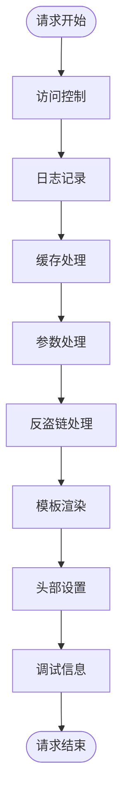
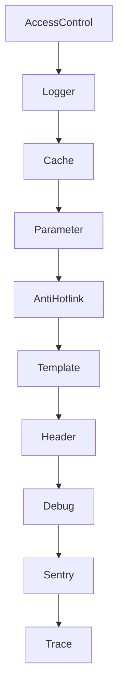

# 中间件架构

<cite>
**本文档中引用的文件**  
- [access-control.ts](file://lib/middleware/access-control.ts)
- [cache.ts](file://lib/middleware/cache.ts)
- [parameter.ts](file://lib/middleware/parameter.ts)
- [template.tsx](file://lib/middleware/template.tsx)
- [header.ts](file://lib/middleware/header.ts)
- [logger.ts](file://lib/middleware/logger.ts)
- [anti-hotlink.ts](file://lib/middleware/anti-hotlink.ts)
- [debug.ts](file://lib/middleware/debug.ts)
- [sentry.ts](file://lib/middleware/sentry.ts)
- [trace.ts](file://lib/middleware/trace.ts)
</cite>

## 目录
1. [引言](#引言)
2. [中间件执行流程](#中间件执行流程)
3. [核心中间件分析](#核心中间件分析)
4. [中间件依赖关系](#中间件依赖关系)
5. [自定义中间件开发指南](#自定义中间件开发指南)
6. [性能与安全考虑](#性能与安全考虑)
7. [结论](#结论)

## 引言

RSSHub 是一个基于 Hono 框架构建的 RSS 生成器，其核心架构依赖于一系列精心设计的中间件来处理请求。这些中间件在请求处理管道中串联工作，每个中间件负责特定的功能，如访问控制、缓存、日志记录、参数处理和模板渲染等。本文档旨在深入分析 `lib/middleware/` 目录下的所有中间件实现，解释其设计模式、执行流程、配置选项和使用场景，并为开发者提供优化建议。

**Section sources**
- [access-control.ts](file://lib/middleware/access-control.ts)
- [cache.ts](file://lib/middleware/cache.ts)
- [parameter.ts](file://lib/middleware/parameter.ts)
- [template.tsx](file://lib/middleware/template.tsx)

## 中间件执行流程

RSSHub 的中间件遵循 Hono 框架的中间件模式，通过 `next()` 函数实现请求处理的串联。中间件的执行顺序至关重要，通常按照以下流程进行：

1. **访问控制**：首先检查请求的访问权限，确保只有授权用户可以访问受保护的资源。
2. **日志记录**：记录请求的进入和离开，便于调试和监控。
3. **缓存处理**：检查缓存中是否存在请求的结果，如果存在则直接返回，避免重复计算。
4. **参数处理**：解析和处理请求参数，如过滤、排序、限制等。
5. **反盗链处理**：处理图片和多媒体资源的防盗链，确保资源的安全性。
6. **模板渲染**：根据请求的格式（如 RSS、Atom、JSON）渲染最终的响应内容。
7. **头部设置**：设置响应头，包括缓存控制、内容类型等。
8. **调试信息**：收集和记录调试信息，用于性能分析和错误追踪。

**Diagram sources**
- [access-control.ts](file://lib/middleware/access-control.ts)
- [logger.ts](file://lib/middleware/logger.ts)
- [cache.ts](file://lib/middleware/cache.ts)
- [parameter.ts](file://lib/middleware/parameter.ts)
- [anti-hotlink.ts](file://lib/middleware/anti-hotlink.ts)
- [template.tsx](file://lib/middleware/template.tsx)
- [header.ts](file://lib/middleware/header.ts)
- [debug.ts](file://lib/middleware/debug.ts)

## 核心中间件分析

### 访问控制中间件

访问控制中间件负责验证请求的访问权限。它通过检查请求中的 `key` 或 `code` 参数来确定是否允许访问。如果配置了访问密钥，则必须提供正确的密钥或通过 MD5 哈希生成的验证码。

**Section sources**
- [access-control.ts](file://lib/middleware/access-control.ts)

### 缓存中间件

缓存中间件负责管理请求结果的缓存。它使用 Redis 或内存作为缓存存储，通过哈希算法生成缓存键，并在请求处理过程中检查缓存是否存在。如果缓存命中，则直接返回缓存结果；否则，继续处理请求并将结果存入缓存。

**Section sources**
- [cache.ts](file://lib/middleware/cache.ts)

### 参数处理中间件

参数处理中间件负责解析和处理请求中的各种参数，如过滤、排序、限制、全文模式等。它支持多种过滤方式，包括正则表达式和 RE2 引擎，并可以根据配置选择不同的过滤引擎。

**Section sources**
- [parameter.ts](file://lib/middleware/parameter.ts)

### 模板渲染中间件

模板渲染中间件负责根据请求的格式（如 RSS、Atom、JSON）渲染最终的响应内容。它支持多种输出格式，并可以根据配置生成不同的响应内容，如调试信息、重定向等。

**Section sources**
- [template.tsx](file://lib/middleware/template.tsx)

### 头部设置中间件

头部设置中间件负责设置响应头，包括缓存控制、内容类型、ETag 等。它还支持条件请求，通过 ETag 和 `If-None-Match` 头部实现 304 Not Modified 响应。

**Section sources**
- [header.ts](file://lib/middleware/header.ts)

### 日志记录中间件

日志记录中间件负责记录请求的进入和离开，包括请求方法、路径、状态码和处理时间。它使用颜色编码来区分不同类型的日志信息，便于快速识别问题。

**Section sources**
- [logger.ts](file://lib/middleware/logger.ts)

### 反盗链中间件

反盗链中间件负责处理图片和多媒体资源的防盗链。它通过配置模板来替换资源的 URL，确保资源的安全性。支持用户自定义模板，并可以通过配置文件强制启用特定模板。

**Section sources**
- [anti-hotlink.ts](file://lib/middleware/anti-hotlink.ts)

### 调试信息中间件

调试信息中间件负责收集和记录调试信息，包括请求次数、缓存命中率、ETag 匹配等。这些信息可以用于性能分析和错误追踪。

**Section sources**
- [debug.ts](file://lib/middleware/debug.ts)

### Sentry 中间件

Sentry 中间件负责集成 Sentry 错误追踪服务。它在请求处理过程中捕获异常，并将错误信息发送到 Sentry 服务器，便于开发者及时发现和修复问题。

**Section sources**
- [sentry.ts](file://lib/middleware/sentry.ts)

### 跟踪中间件

跟踪中间件负责在调试模式下启用 OpenTelemetry 跟踪。它记录请求的处理过程，并生成跟踪信息，便于性能分析和问题定位。

**Section sources**
- [trace.ts](file://lib/middleware/trace.ts)

## 中间件依赖关系

中间件之间的依赖关系主要体现在数据传递和执行顺序上。例如，缓存中间件依赖于参数处理中间件生成的缓存键，而模板渲染中间件依赖于参数处理中间件处理后的数据。此外，头部设置中间件依赖于缓存中间件生成的 ETag，以实现条件请求。

**Diagram sources**
- [access-control.ts](file://lib/middleware/access-control.ts)
- [logger.ts](file://lib/middleware/logger.ts)
- [cache.ts](file://lib/middleware/cache.ts)
- [parameter.ts](file://lib/middleware/parameter.ts)
- [anti-hotlink.ts](file://lib/middleware/anti-hotlink.ts)
- [template.tsx](file://lib/middleware/template.tsx)
- [header.ts](file://lib/middleware/header.ts)
- [debug.ts](file://lib/middleware/debug.ts)
- [sentry.ts](file://lib/middleware/sentry.ts)
- [trace.ts](file://lib/middleware/trace.ts)

## 自定义中间件开发指南

### 最佳实践

1. **单一职责**：每个中间件应只负责一个特定的功能，避免功能耦合。
2. **可配置性**：中间件应支持通过配置文件进行配置，便于灵活调整。
3. **错误处理**：中间件应妥善处理异常，避免影响整个请求处理流程。
4. **性能优化**：中间件应尽量减少不必要的计算和 I/O 操作，提高处理效率。

### 常见陷阱

1. **阻塞操作**：避免在中间件中执行阻塞操作，如同步 I/O 操作，以免影响性能。
2. **内存泄漏**：注意中间件中的变量引用，避免造成内存泄漏。
3. **安全漏洞**：确保中间件不会引入安全漏洞，如 XSS 攻击、SQL 注入等。

**Section sources**
- [access-control.ts](file://lib/middleware/access-control.ts)
- [cache.ts](file://lib/middleware/cache.ts)
- [parameter.ts](file://lib/middleware/parameter.ts)
- [template.tsx](file://lib/middleware/template.tsx)

## 性能与安全考虑

### 性能影响

1. **缓存策略**：合理设置缓存过期时间，避免频繁的缓存失效和重建。
2. **并发处理**：利用异步处理和并发请求，提高处理效率。
3. **资源优化**：优化中间件中的资源使用，如减少不必要的网络请求和数据库查询。

### 安全考虑

1. **访问控制**：严格验证访问权限，防止未授权访问。
2. **输入验证**：对所有输入参数进行验证，防止恶意输入。
3. **日志安全**：避免在日志中记录敏感信息，如密码、密钥等。

**Section sources**
- [access-control.ts](file://lib/middleware/access-control.ts)
- [cache.ts](file://lib/middleware/cache.ts)
- [parameter.ts](file://lib/middleware/parameter.ts)

## 结论

RSSHub 的中间件架构设计精巧，通过一系列中间件的串联工作，实现了高效、安全的请求处理。每个中间件都有明确的职责和配置选项，开发者可以根据需求进行定制和优化。通过深入理解中间件的设计模式和执行流程，可以更好地利用 RSSHub 的功能，为用户提供高质量的 RSS 服务。