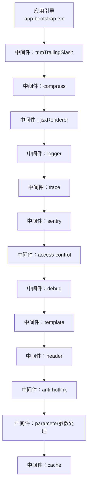
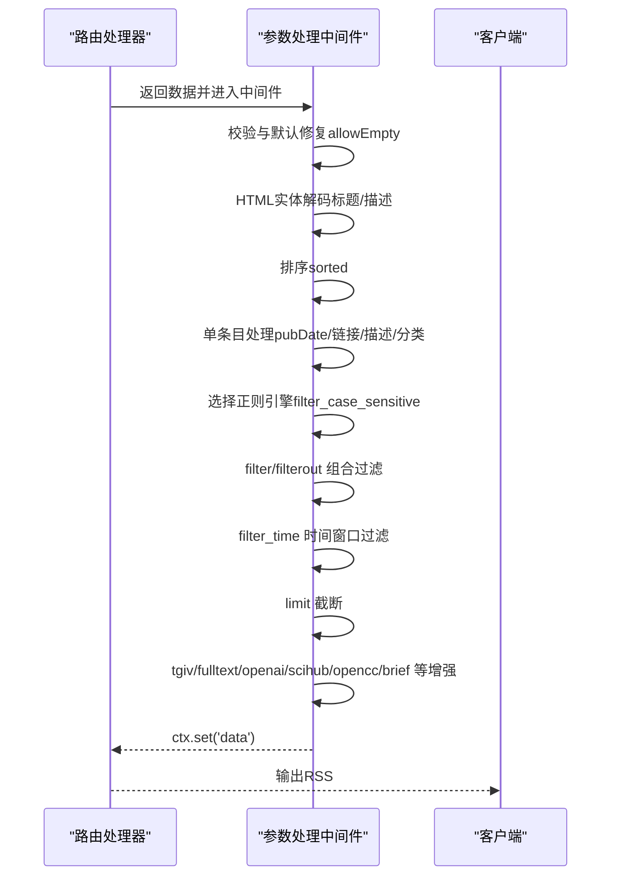
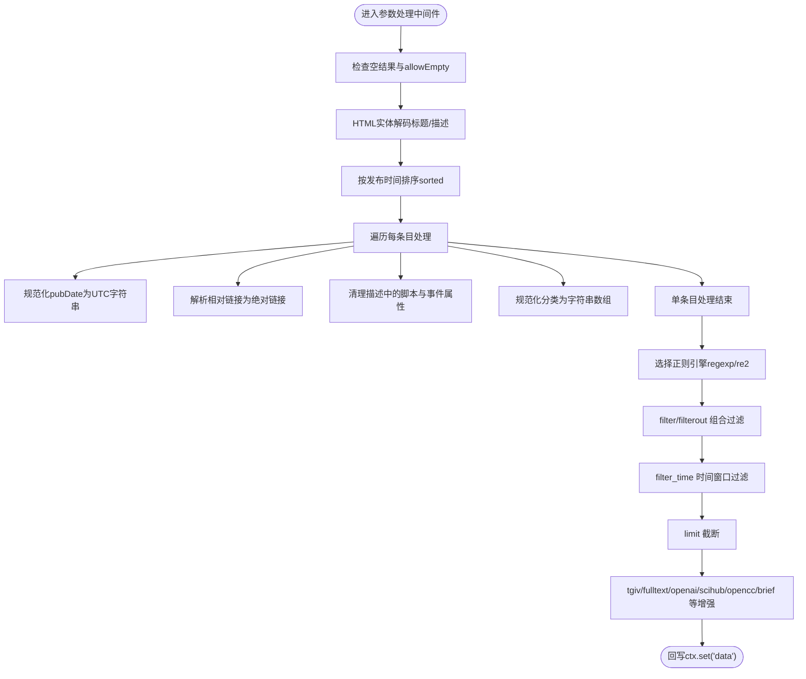
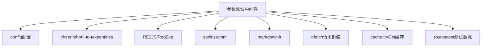

# 参数处理中间件

<cite>
**本文引用的文件**
- [lib/middleware/parameter.ts](file://lib/middleware/parameter.ts)
- [lib/middleware/parameter.test.ts](file://lib/middleware/parameter.test.ts)
- [lib/middleware/anti-hotlink.ts](file://lib/middleware/anti-hotlink.ts)
- [lib/middleware/CLAUDE.md](file://lib/middleware/CLAUDE.md)
- [lib/app-bootstrap.tsx](file://lib/app-bootstrap.tsx)
- [lib/config.ts](file://lib/config.ts)
- [lib/utils/ofetch.ts](file://lib/utils/ofetch.ts)
- [lib/errors/types/invalid-parameter.ts](file://lib/errors/types/invalid-parameter.ts)
- [lib/middleware/filter-engine.test.ts](file://lib/middleware/filter-engine.test.ts)
- [lib/routes/test/index.ts](file://lib/routes/test/index.ts)
</cite>

## 目录
1. [简介](#简介)
2. [项目结构](#项目结构)
3. [核心组件](#核心组件)
4. [架构总览](#架构总览)
5. [详细组件分析](#详细组件分析)
6. [依赖关系分析](#依赖关系分析)
7. [性能考量](#性能考量)
8. [故障排查指南](#故障排查指南)
9. [结论](#结论)
10. [附录：自定义参数处理规则开发指南](#附录自定义参数处理规则开发指南)

## 简介
本文件深入解析 RSSHub 的“参数处理中间件”，聚焦于查询参数的解析、验证与规范化流程，覆盖特殊参数（如 limit、filter、filterout、filter_time、filter_case_sensitive、brief、opencc、tgiv、mode=fulltext、chatgpt、scihub 等）的处理逻辑。文档还阐述参数类型转换、默认值设置、错误处理策略，并提供扩展参数验证器与新增参数处理器的实践指南，最后分析参数处理对系统安全性与性能的影响。

## 项目结构
参数处理中间件位于 lib/middleware/parameter.ts，作为 Hono 中间件在路由处理链中处于较靠后的阶段，用于对已生成的数据进行二次加工与过滤。其执行顺序由应用引导文件定义，参数处理中间件位于热链保护之后、缓存之前。

图表来源
- [lib/app-bootstrap.tsx](file://lib/app-bootstrap.tsx#L27-L45)

章节来源
- [lib/app-bootstrap.tsx](file://lib/app-bootstrap.tsx#L27-L45)
- [lib/middleware/CLAUDE.md](file://lib/middleware/CLAUDE.md#L76-L92)

## 核心组件
- 参数处理中间件：对 ctx.get('data') 进行二次加工，包括排序、HTML 实体解码、相对链接解析、过滤（filter/filterout）、时间窗口过滤、限制条目数（limit）、Telegram Instant View 链接转换、全文模式抓取、ChatGPT/AI 文本增强、Sci-Hub DOI 转换、简繁转换、摘要截断等。
- 测试用例：覆盖 filter/filterout 组合、filter_case_sensitive、limit、sorted、tgiv、空结果与 allowEmpty、fulltext 模式、复杂描述处理、多媒体描述、排序、opencc、brief、多参数组合等场景。
- 配置项：通过 config.feature.filter_regex_engine 控制正则引擎（regexp 或 re2），以及 openai、scihub、hotlink 等相关开关与模板。

章节来源
- [lib/middleware/parameter.ts](file://lib/middleware/parameter.ts#L67-L429)
- [lib/middleware/parameter.test.ts](file://lib/middleware/parameter.test.ts#L1-L463)
- [lib/config.ts](file://lib/config.ts#L1-L200)

## 架构总览
参数处理中间件在路由处理器返回数据后执行，读取 ctx.get('data') 并按查询参数逐项应用处理逻辑。其内部流程可概括为：数据校验与默认修复 → HTML 实体解码 → 排序 → 单条目处理（日期、链接、描述、分类）→ 正则过滤引擎选择 → filter/filterout 组合过滤 → 时间窗口过滤 → limit 截断 → 其他增强处理（tgiv、fulltext、openai、scihub、opencc、brief）→ 回写 ctx.set('data')。

图表来源
- [lib/middleware/parameter.ts](file://lib/middleware/parameter.ts#L67-L429)

## 详细组件分析

### 查询参数解析、验证与规范化流程
- 解析来源：所有参数均来自 ctx.req.query()，以字符串形式获取。
- 类型转换：对数值类参数使用 Number.parseInt/Number.parseFloat 进行转换；布尔类参数通过字符串比较判断（如 'false' 视为 false）；正则表达式根据 engine 选择 RegExp 或 RE2JS。
- 默认值与行为：
  - sorted 默认开启（除非显式传入 sorted=false）。
  - filter_case_sensitive 默认大小写敏感；当传入 filter_case_sensitive=false 时切换为不区分大小写。
  - filter_regex_engine 受 config.feature.filter_regex_engine 控制，默认值见配置文件。
  - brief 仅当传入的数字满足特定格式时生效，否则抛出错误。
- 规范化：
  - pubDate 统一转为 UTC 字符串。
  - link 与描述中的相对链接基于 baseUrl 解析为绝对链接。
  - 描述中移除 script 标签，清理 img 的 onclick/onerror/onload 等事件属性，补充 referrerpolicy=no-referrer。
  - 分类 category 统一为字符串数组，过滤非字符串元素。

章节来源
- [lib/middleware/parameter.ts](file://lib/middleware/parameter.ts#L70-L179)
- [lib/config.ts](file://lib/config.ts#L1-L200)

### 特殊参数处理逻辑
- limit
  - 功能：限制返回条目数量。
  - 行为：将 data.item 截断到 limit 指定的数量；当 limit=0 且 allowEmpty=true 时可返回空集。
  - 测试：limit=3 场景通过测试。
- filter/filter_case_sensitive
  - 功能：基于正则表达式过滤标题、描述、作者、分类。
  - 行为：当 filter 存在时优先使用 filter；否则分别使用 filter_title/filter_description/filter_author/filter_category。
  - 引擎：由 config.feature.filter_regex_engine 决定（regexp 或 re2）。非法引擎值会抛错。
  - 测试：大小写敏感性、组合过滤、RE2 防 ReDoS 攻击等均有覆盖。
- filterout
  - 功能：反向过滤，排除匹配项。
  - 行为：与 filter 类似，但取反逻辑。
- filter_time
  - 功能：按发布时间与当前时间差进行过滤（秒）。
  - 行为：对 pubDate 进行解析并比较，异常输入会被忽略。
- sorted
  - 功能：是否按发布时间降序排序。
  - 行为：默认开启；传入 sorted=false 关闭排序。
- tgiv
  - 功能：将每条目 link 转换为 Telegram Instant View 链接。
- mode=fulltext
  - 功能：抓取原文内容并替换描述。
  - 行为：使用 mercury-parser 解析页面内容，失败时回退默认描述；结果缓存以避免重复抓取。
- chatgpt/openai
  - 功能：调用 OpenAI API 对标题或描述进行改写或增强。
  - 行为：根据 config.openai.inputOption 决定处理范围；失败时不写入缓存并保持默认内容。
- scihub
  - 功能：将条目 link 转换为 Sci-Hub 可访问的直链。
- opencc
  - 功能：简繁转换。
  - 行为：对标题与描述进行转换。
- brief
  - 功能：对描述进行纯文本提取并截断到指定长度。
  - 行为：若传入格式不合法，抛出错误。

章节来源
- [lib/middleware/parameter.ts](file://lib/middleware/parameter.ts#L180-L420)
- [lib/middleware/parameter.test.ts](file://lib/middleware/parameter.test.ts#L1-L463)
- [lib/middleware/filter-engine.test.ts](file://lib/middleware/filter-engine.test.ts#L1-L39)

### 参数类型转换、默认值与错误处理策略
- 类型转换
  - 数值：limit、filter_time 使用 parseInt；brief 使用 parseInt 并配合正则校验。
  - 布尔：sorted=false、filter_case_sensitive=false。
  - 正则：根据 engine 选择 RegExp 或 RE2JS；非法 engine 抛错。
- 默认值
  - sorted 默认 true。
  - filter_case_sensitive 默认 true。
  - filter_regex_engine 默认值由配置决定。
- 错误处理
  - brief 非法格式：抛出错误并提示参考文档。
  - filter_regex_engine 非法值：抛出错误。
  - filter_time 异常输入：忽略该过滤条件。
  - openai 失败：不写入缓存并保持默认内容。
  - 空结果：当 data.item 为空且未设置 allowEmpty 时抛错；allowEmpty=true 则允许空输出。

章节来源
- [lib/middleware/parameter.ts](file://lib/middleware/parameter.ts#L274-L420)
- [lib/middleware/parameter.test.ts](file://lib/middleware/parameter.test.ts#L300-L320)
- [lib/errors/types/invalid-parameter.ts](file://lib/errors/types/invalid-parameter.ts#L1-L5)

### 与其他中间件的协作
- anti-hotlink：在参数处理前完成媒体链接替换，参数处理阶段不再处理热链模板，避免重复处理。
- cache：参数处理完成后才进入缓存中间件，确保最终数据被缓存。

章节来源
- [lib/middleware/anti-hotlink.ts](file://lib/middleware/anti-hotlink.ts#L102-L168)
- [lib/middleware/parameter.ts](file://lib/middleware/parameter.ts#L420-L429)

### 数据流与处理顺序
参数处理中间件对数据的处理顺序如下图所示，体现了“先通用后特例”的设计思路：先做基础清洗与排序，再进行过滤与增强。

图表来源
- [lib/middleware/parameter.ts](file://lib/middleware/parameter.ts#L67-L429)

## 依赖关系分析
- 外部库依赖
  - 正则引擎：RE2JS（高性能，防 ReDoS）与 RegExp（兼容性）。
  - HTML 解析与清洗：cheerio、sanitize-html、entities。
  - 文本处理：html-to-text、markdown-it。
  - HTTP 请求：ofetch（带重试与代理偏好）。
  - AI 能力：OpenAI Chat Completions。
  - 缓存：cache.tryGet。
- 内部依赖
  - config：读取 feature.filter_regex_engine、openai、scihub、hotlink 等配置。
  - utils/ofetch：统一网络请求封装，含重试与日志。
  - routes/test：提供测试数据与路由，便于验证参数处理效果。

图表来源
- [lib/middleware/parameter.ts](file://lib/middleware/parameter.ts#L1-L66)
- [lib/config.ts](file://lib/config.ts#L1-L200)
- [lib/utils/ofetch.ts](file://lib/utils/ofetch.ts#L1-L45)
- [lib/routes/test/index.ts](file://lib/routes/test/index.ts#L20-L58)

章节来源
- [lib/middleware/parameter.ts](file://lib/middleware/parameter.ts#L1-L66)
- [lib/utils/ofetch.ts](file://lib/utils/ofetch.ts#L1-L45)
- [lib/config.ts](file://lib/config.ts#L1-L200)

## 性能考量
- 正则引擎选择
  - 使用 RE2JS 可有效防止 ReDoS 攻击，提升安全性与稳定性；在高并发场景下更稳健。
  - 当需要兼容旧正则语法时可回退到 RegExp，但需谨慎评估风险。
- 并发与缓存
  - fulltext 模式与 openai 增强采用 Promise.all 并发处理，显著提升吞吐量。
  - 使用 cache.tryGet 缓存 Mercury 解析结果与 OpenAI 结果，避免重复抓取与计算。
- I/O 与超时
  - ofetch 提供重试与代理偏好设置，有助于在网络波动时提升成功率。
  - openai 请求受配置限制，失败时不会写入缓存，避免污染缓存。
- CPU 与内存
  - HTML 清洗与转换（entities、sanitize-html、html-to-text、markdown-it）会产生额外 CPU 开销；建议在必要时启用。
  - brief 与 opencc 会对文本进行处理，注意批量处理时的内存占用。

章节来源
- [lib/middleware/parameter.ts](file://lib/middleware/parameter.ts#L306-L386)
- [lib/utils/ofetch.ts](file://lib/utils/ofetch.ts#L1-L45)
- [lib/middleware/filter-engine.test.ts](file://lib/middleware/filter-engine.test.ts#L1-L39)

## 故障排查指南
- 正则引擎错误
  - 现象：filter 参数导致 503 错误并提示 RE2JSSyntaxException。
  - 原因：使用了不安全的正则表达式触发 ReDoS。
  - 处理：改为安全正则或切换到 regexp 引擎（仅在确认风险可控时）。
- brief 参数非法
  - 现象：抛出错误并提示参考文档。
  - 处理：确保传入的是满足格式要求的数字。
- 空结果与 allowEmpty
  - 现象：未设置 allowEmpty 时返回错误；设置后可返回空集。
  - 处理：根据业务需求设置 allowEmpty=true。
- filter_case_sensitive 默认行为
  - 现象：大小写敏感导致过滤结果与预期不符。
  - 处理：显式传入 filter_case_sensitive=false。
- filter_time 输入异常
  - 现象：异常输入被忽略，无过滤效果。
  - 处理：确保传入合法数值（秒）。

章节来源
- [lib/middleware/filter-engine.test.ts](file://lib/middleware/filter-engine.test.ts#L1-L39)
- [lib/middleware/parameter.test.ts](file://lib/middleware/parameter.test.ts#L1-L120)
- [lib/middleware/parameter.ts](file://lib/middleware/parameter.ts#L274-L285)

## 结论
参数处理中间件通过“先清洗、后过滤、再增强”的流水线式处理，实现了对 RSSHub 输出数据的精细化控制。它在保证安全（RE2JS 防 ReDoS）、提升性能（并发与缓存）的同时，提供了丰富的参数能力（limit、filter、filterout、filter_time、tgiv、fulltext、openai、scihub、opencc、brief 等）。对于开发者而言，理解参数处理的执行顺序与默认行为，是构建稳定、可维护路由的关键。

## 附录：自定义参数处理规则开发指南
- 新增参数处理器步骤
  - 在参数处理中间件中添加新参数分支，遵循现有模式：读取 ctx.req.query('xxx')，进行类型转换与校验，应用到 data.item 或 data 上，最后回写 ctx.set('data')。
  - 若涉及外部服务（如 API、数据库），务必使用缓存与错误兜底，避免失败影响整体响应。
  - 若涉及正则，请优先使用 RE2JS 并提供 filter_case_sensitive 的兼容逻辑。
- 扩展参数验证器
  - 对于数值型参数，使用 Number.parseInt/parseFloat 并增加边界检查。
  - 对于字符串型参数，使用正则或枚举值进行白名单校验。
  - 对于布尔型参数，明确默认值与取反逻辑（如 'false'）。
- 安全与性能建议
  - 严格限制参数长度与范围，避免过长的正则或过大的 limit。
  - 对外部请求设置合理的超时与重试策略。
  - 对可能产生大量 I/O 的操作（如 fulltext、openai）采用并发与缓存结合的方式。
  - 对用户输入的模板参数（如 anti-hotlink 的模板）进行严格的属性白名单校验，防止 SSRF 与 XSS。

章节来源
- [lib/middleware/parameter.ts](file://lib/middleware/parameter.ts#L67-L429)
- [lib/middleware/anti-hotlink.ts](file://lib/middleware/anti-hotlink.ts#L90-L131)
- [lib/config.ts](file://lib/config.ts#L1-L200)