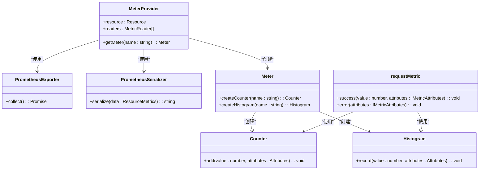

# 日志系统

<cite>
**本文档引用的文件**
- [logger.ts](file://lib/middleware/logger.ts)
- [sentry.ts](file://lib/middleware/sentry.ts)
- [logger.ts](file://lib/utils/logger.ts)
- [config.ts](file://lib/config.ts)
- [metric.ts](file://lib/utils/otel/metric.ts)
- [index.tsx](file://lib/errors/index.tsx)
</cite>

## 目录
1. [简介](#简介)
2. [日志系统架构](#日志系统架构)
3. [核心组件分析](#核心组件分析)
4. [日志配置指南](#日志配置指南)
5. [性能监控与指标](#性能监控与指标)
6. [错误处理与异常追踪](#错误处理与异常追踪)
7. [日志性能开销与最佳实践](#日志性能开销与最佳实践)
8. [故障排查与系统优化](#故障排查与系统优化)

## 简介
RSSHub的日志系统是一个全面的监控和调试框架，集成了请求/响应日志记录、错误追踪、性能监控和外部服务集成。该系统基于Winston日志库构建，通过中间件模式捕获HTTP请求生命周期中的关键信息，并与Sentry和OpenTelemetry等外部监控服务集成，提供完整的可观测性解决方案。日志系统不仅记录基本的请求信息，还包含详细的性能指标、错误追踪和调试信息，为系统维护和优化提供了坚实的基础。

## 日志系统架构


**Diagram sources**
- [logger.ts](file://lib/middleware/logger.ts)
- [sentry.ts](file://lib/middleware/sentry.ts)
- [config.ts](file://lib/config.ts)

**Section sources**
- [logger.ts](file://lib/middleware/logger.ts)
- [sentry.ts](file://lib/middleware/sentry.ts)
- [config.ts](file://lib/config.ts)

## 核心组件分析

### 日志中间件分析


**Diagram sources**
- [logger.ts](file://lib/middleware/logger.ts)

**Section sources**
- [logger.ts](file://lib/middleware/logger.ts)

### 日志格式化策略


**Diagram sources**
- [logger.ts](file://lib/utils/logger.ts)

**Section sources**
- [logger.ts](file://lib/utils/logger.ts)

## 日志配置指南

### 日志配置选项

| 配置项 | 环境变量 | 默认值 | 说明 |
|-------|---------|-------|------|
| 日志级别 | LOGGER_LEVEL | info | 日志输出级别，支持 debug, info, warn, error |
| 显示时间戳 | SHOW_LOGGER_TIMESTAMP | false | 是否在日志中显示时间戳 |
| 禁用日志文件 | NO_LOGFILES | false | 是否禁用日志文件输出 |
| Sentry DSN | SENTRY | undefined | Sentry服务的DSN地址 |
| Sentry路由超时 | SENTRY_ROUTE_TIMEOUT | 30000 | 路由处理超时阈值（毫秒） |
| OpenTelemetry秒级桶 | OTEL_SECONDS_BUCKET | 0.01,0.1,1,2,5,15,30,60 | 秒级性能指标的桶边界 |
| OpenTelemetry毫秒级桶 | OTEL_MILLISECONDS_BUCKET | 10,20,50,100,250,500,1000,5000,15000 | 毫秒级性能指标的桶边界 |

**Section sources**
- [config.ts](file://lib/config.ts)

### 日志输出目标配置

RSSHub的日志系统支持多种输出目标，可以通过配置进行灵活控制：

- **控制台输出**：在非生产环境和非Vercel部署中，默认启用控制台输出，便于开发和调试
- **文件输出**：在logs目录下生成error.log和combined.log两个文件，分别记录错误日志和所有日志
- **外部服务**：通过Sentry集成实现错误追踪和性能监控

配置示例：
```env
# 启用详细日志
LOGGER_LEVEL=debug
# 显示时间戳
SHOW_LOGGER_TIMESTAMP=true
# 禁用日志文件（适用于云环境）
NO_LOGFILES=true
# 配置Sentry DSN
SENTRY=https://example@sentry.io/12345
# 设置路由超时警告
SENTRY_ROUTE_TIMEOUT=20000
```

**Section sources**
- [config.ts](file://lib/config.ts)
- [logger.ts](file://lib/utils/logger.ts)

## 性能监控与指标

### OpenTelemetry指标系统



**Diagram sources**
- [metric.ts](file://lib/utils/otel/metric.ts)

**Section sources**
- [metric.ts](file://lib/utils/otel/metric.ts)

### 性能指标详情

RSSHub通过OpenTelemetry收集以下性能指标：

- **请求总数**：`rsshub_request_total` - 记录所有成功请求的计数
- **错误请求总数**：`rsshub_request_error_total` - 记录所有错误请求的计数
- **请求耗时（秒级）**：`rsshub_request_duration_seconds_bucket` - 按秒级桶记录请求耗时分布
- **请求耗时（毫秒级）**：`rsshub_request_duration_milliseconds_bucket` - 按毫秒级桶记录请求耗时分布

这些指标通过Prometheus格式暴露在`/metrics`端点，可用于监控系统性能和设置告警。

**Section sources**
- [metric.ts](file://lib/utils/otel/metric.ts)
- [routes/metrics.ts](file://lib/routes/metrics.ts)

## 错误处理与异常追踪

### Sentry集成机制


**Diagram sources**
- [sentry.ts](file://lib/middleware/sentry.ts)
- [index.tsx](file://lib/errors/index.tsx)

**Section sources**
- [sentry.ts](file://lib/middleware/sentry.ts)
- [index.tsx](file://lib/errors/index.tsx)

### 错误处理流程

RSSHub的错误处理系统具有以下特点：

1. **多类型错误识别**：系统能够识别多种错误类型，包括HTTPError、RequestError、FetchError等，并根据错误类型设置相应的HTTP状态码
2. **详细的错误信息收集**：收集请求路径、匹配路由、错误计数等信息，用于调试和分析
3. **Sentry集成**：当配置了Sentry DSN时，所有错误都会被发送到Sentry服务进行追踪
4. **响应格式化**：根据客户端请求格式（JSON或HTML）返回相应的错误响应

错误类型处理策略：
- **HTTPError/RequestError/FetchError**：返回503服务不可用状态码
- **RequestInProgressError**：返回503状态码并设置缓存控制头
- **RejectError**：返回403禁止访问状态码
- **NotFoundError**：返回404未找到状态码

**Section sources**
- [index.tsx](file://lib/errors/index.tsx)

## 日志性能开销与最佳实践

### 日志性能考虑

RSSHub的日志系统在设计时充分考虑了性能影响，采用了以下优化策略：

- **条件式日志输出**：仅在非生产环境或非Vercel部署时启用控制台输出，减少生产环境的I/O开销
- **异步日志记录**：使用Winston的异步机制，避免阻塞主请求处理流程
- **选择性文件输出**：通过NO_LOGFILES配置项可以完全禁用文件输出，适用于云环境
- **智能级别过滤**：通过LOGGER_LEVEL配置项控制日志输出级别，避免过多的调试信息影响性能

### 日志最佳实践

1. **开发环境**：使用debug级别日志，配合SHOW_LOGGER_TIMESTAMP=true，便于调试和问题定位
2. **生产环境**：使用info级别日志，避免过多的日志输出影响系统性能
3. **云环境部署**：设置NO_LOGFILES=true，依赖云平台的日志收集机制
4. **性能监控**：配置Sentry DSN和适当的SENTRY_ROUTE_TIMEOUT，及时发现性能瓶颈
5. **敏感信息保护**：避免在日志中记录敏感信息，如API密钥、用户凭证等

**Section sources**
- [logger.ts](file://lib/utils/logger.ts)
- [config.ts](file://lib/config.ts)

## 故障排查与系统优化

### 日志驱动的故障排查

RSSHub的日志系统为故障排查提供了强大的支持：

1. **请求生命周期追踪**：通过日志中间件记录每个请求的开始和结束，包括方法、路径、状态码和耗时
2. **错误上下文记录**：在错误处理中记录详细的错误信息、堆栈跟踪和请求上下文
3. **性能瓶颈识别**：通过Sentry的路由超时检测和OpenTelemetry的性能指标，识别慢请求和性能瓶颈
4. **缓存效果分析**：通过调试信息中的hitCache计数，分析缓存命中率和效果

### 系统优化建议

基于日志系统的数据分析，可以采取以下优化措施：

- **慢请求优化**：通过分析Sentry报告的超时请求，优化相关路由的实现
- **错误率监控**：监控errorPaths和errorRoutes的统计信息，识别高频错误的路由
- **资源使用分析**：结合性能指标，分析系统资源使用模式，优化资源配置
- **缓存策略调整**：根据缓存命中率数据，调整缓存过期时间和缓存策略

**Section sources**
- [logger.ts](file://lib/middleware/logger.ts)
- [sentry.ts](file://lib/middleware/sentry.ts)
- [index.tsx](file://lib/errors/index.tsx)
- [metric.ts](file://lib/utils/otel/metric.ts)