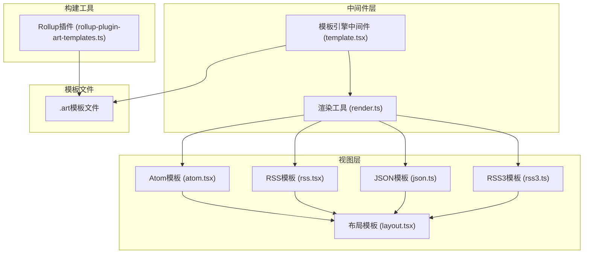
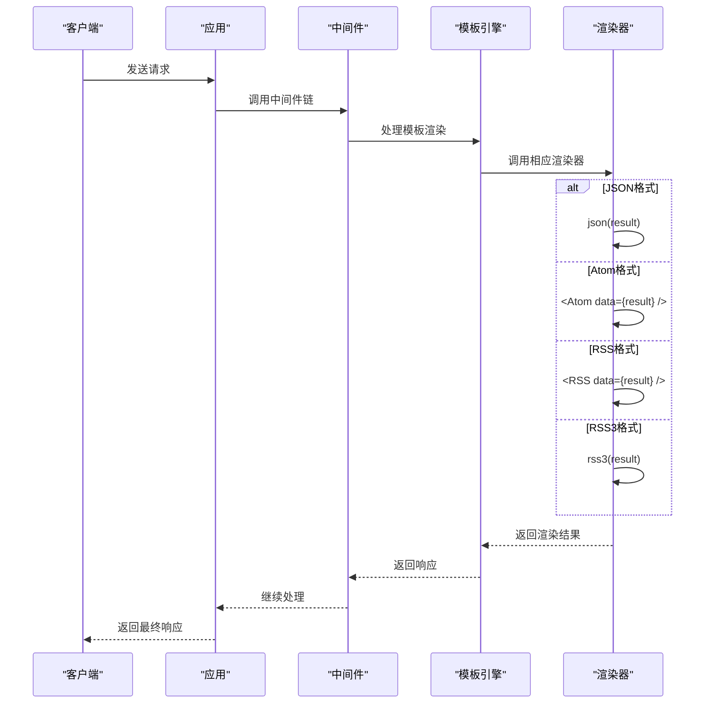
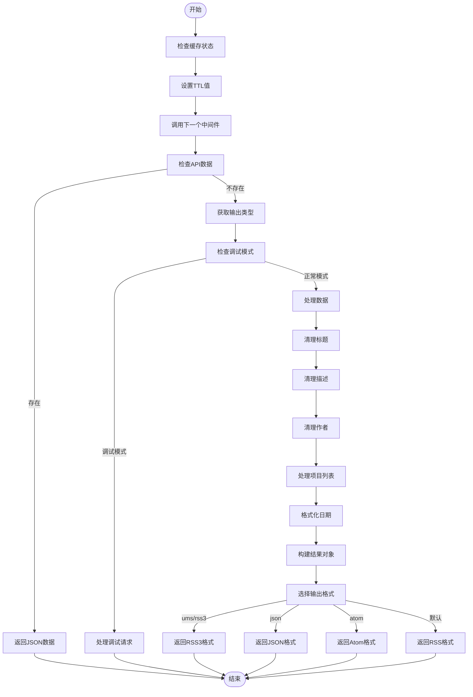
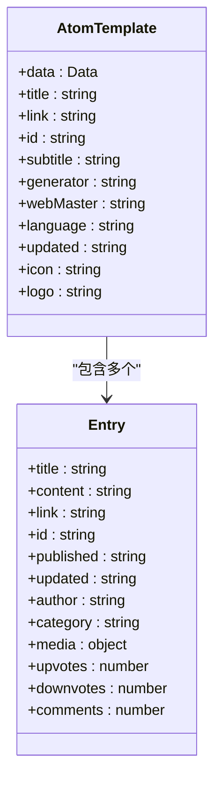
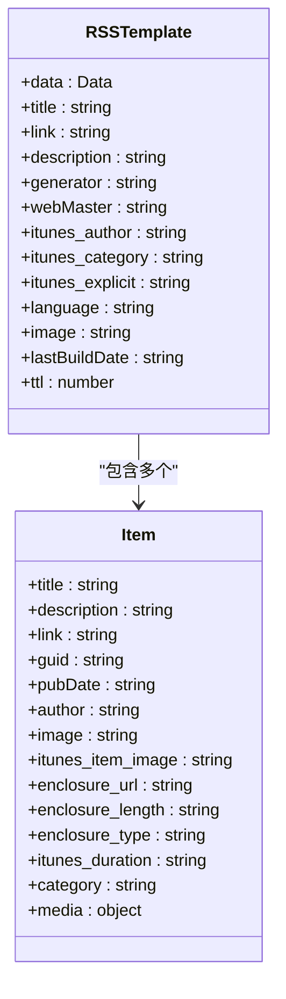
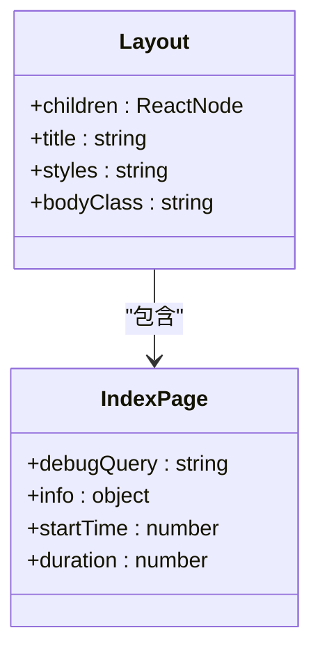
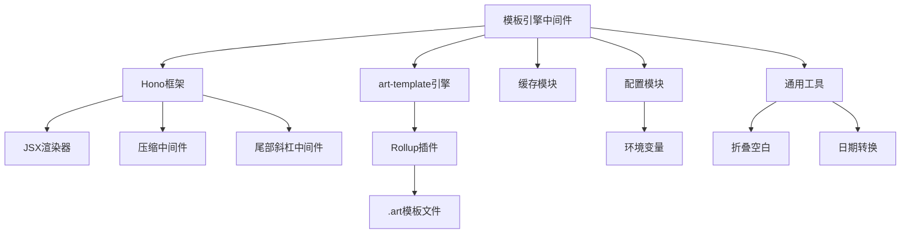

# 模板引擎中间件

<cite>
**本文档引用的文件**
- [template.tsx](file://lib/middleware/template.tsx)
- [render.ts](file://lib/utils/render.ts)
- [layout.tsx](file://lib/views/layout.tsx)
- [atom.tsx](file://lib/views/atom.tsx)
- [rss.tsx](file://lib/views/rss.tsx)
- [app-bootstrap.tsx](file://lib/app-bootstrap.tsx)
- [config.ts](file://lib/config.ts)
- [rollup-plugin-art-templates.ts](file://plugins/rollup-plugin-art-templates.ts)
- [iframe.art](file://lib/middleware/templates/iframe.art)
- [description.art](file://lib/routes/005/templates/description.art)
</cite>

## 目录
1. [引言](#引言)
2. [项目结构](#项目结构)
3. [核心组件](#核心组件)
4. [架构概述](#架构概述)
5. [详细组件分析](#详细组件分析)
6. [依赖分析](#依赖分析)
7. [性能考虑](#性能考虑)
8. [故障排除指南](#故障排除指南)
9. [结论](#结论)

## 引言
本文档全面文档化RSSHub模板引擎中间件的实现。详细解释art-template引擎的集成方式，模板渲染流程，以及动态内容注入机制。描述视图层的组织结构，包括布局模板、Atom/RSS格式模板的实现细节。提供自定义模板开发指南，涵盖模板语法、变量传递和错误处理。讨论模板缓存策略、安全性考虑（如XSS防护）和性能优化技巧。

## 项目结构
RSSHub的模板引擎中间件主要由以下几个核心部分组成：中间件处理逻辑、视图渲染组件、布局模板和具体的模板文件。系统采用Hono框架作为基础，通过中间件链式调用的方式处理请求，并最终通过模板引擎渲染输出不同格式的订阅内容。

**图表来源**
- [template.tsx](file://lib/middleware/template.tsx)
- [render.ts](file://lib/utils/render.ts)
- [layout.tsx](file://lib/views/layout.tsx)
- [atom.tsx](file://lib/views/atom.tsx)
- [rss.tsx](file://lib/views/rss.tsx)
- [rollup-plugin-art-templates.ts](file://plugins/rollup-plugin-art-templates.ts)

**章节来源**
- [template.tsx](file://lib/middleware/template.tsx)
- [render.ts](file://lib/utils/render.ts)
- [layout.tsx](file://lib/views/layout.tsx)

## 核心组件
模板引擎中间件的核心功能是处理请求并根据请求参数渲染相应的模板。中间件首先处理缓存设置，然后根据请求的格式参数选择相应的渲染方式。系统支持多种输出格式，包括RSS、Atom、JSON等。

**章节来源**
- [template.tsx](file://lib/middleware/template.tsx)
- [config.ts](file://lib/config.ts)

## 架构概述
RSSHub的模板引擎采用分层架构设计，从请求处理到最终输出，经过多个中间件的处理。模板引擎中间件位于中间件链的后半部分，负责将处理好的数据渲染成最终的输出格式。

**图表来源**
- [template.tsx](file://lib/middleware/template.tsx)
- [app-bootstrap.tsx](file://lib/app-bootstrap.tsx)

**章节来源**
- [template.tsx](file://lib/middleware/template.tsx)
- [app-bootstrap.tsx](file://lib/app-bootstrap.tsx)

## 详细组件分析

### 模板引擎中间件分析
模板引擎中间件是整个系统的核心组件之一，负责处理所有与模板渲染相关的逻辑。中间件首先根据缓存状态设置RSS的TTL值，然后处理请求参数，对数据进行预处理，最后根据请求的格式参数选择相应的渲染方式。

**图表来源**
- [template.tsx](file://lib/middleware/template.tsx)

**章节来源**
- [template.tsx](file://lib/middleware/template.tsx)

### 视图渲染组件分析
视图渲染组件负责将数据渲染成具体的XML或HTML格式。系统提供了多种预定义的模板，包括Atom、RSS、JSON和RSS3格式。这些模板使用Hono的JSX功能实现，可以方便地生成结构化的XML内容。

#### Atom模板实现
Atom模板实现了Atom 1.0规范，生成符合标准的Atom订阅内容。模板包含feed元素，其中包含标题、链接、ID、副标题、生成器、网站管理员、语言、更新时间、作者等元数据，以及包含每个条目的entry元素。

**图表来源**
- [atom.tsx](file://lib/views/atom.tsx)

**章节来源**
- [atom.tsx](file://lib/views/atom.tsx)

#### RSS模板实现
RSS模板实现了RSS 2.0规范，生成符合标准的RSS订阅内容。模板包含rss元素，其中包含channel元素，channel元素中包含标题、链接、描述、生成器、网站管理员、iTunes元数据、语言、图片、最后构建日期、TTL等元数据，以及包含每个条目的item元素。

**图表来源**
- [rss.tsx](file://lib/views/rss.tsx)

**章节来源**
- [rss.tsx](file://lib/views/rss.tsx)

### 布局模板分析
布局模板提供了统一的HTML结构，用于渲染Web界面。模板使用JSX语法定义，包含HTML文档的基本结构，包括head和body元素。head元素中包含页面标题、Tailwind CSS框架的CDN链接以及自定义样式。

**图表来源**
- [layout.tsx](file://lib/views/layout.tsx)
- [index.tsx](file://lib/views/index.tsx)

**章节来源**
- [layout.tsx](file://lib/views/layout.tsx)
- [index.tsx](file://lib/views/index.tsx)

## 依赖分析
模板引擎中间件依赖于多个核心组件和工具，包括Hono框架、art-template引擎、缓存模块等。构建过程中还使用了Rollup插件来处理模板文件。

**图表来源**
- [template.tsx](file://lib/middleware/template.tsx)
- [app-bootstrap.tsx](file://lib/app-bootstrap.tsx)
- [render.ts](file://lib/utils/render.ts)
- [rollup-plugin-art-templates.ts](file://plugins/rollup-plugin-art-templates.ts)
- [config.ts](file://lib/config.ts)

**章节来源**
- [template.tsx](file://lib/middleware/template.tsx)
- [app-bootstrap.tsx](file://lib/app-bootstrap.tsx)
- [render.ts](file://lib/utils/render.ts)
- [rollup-plugin-art-templates.ts](file://plugins/rollup-plugin-art-templates.ts)
- [config.ts](file://lib/config.ts)

## 性能考虑
模板引擎在性能方面做了多项优化，包括缓存策略、数据预处理和高效的模板渲染。

1. **缓存策略**：系统根据缓存的可用性动态设置RSS的TTL值，有效减少重复请求。
2. **数据预处理**：在渲染前对数据进行清理和格式化，包括清理空白字符、限制标题长度、移除控制字符等。
3. **模板编译**：使用Rollup插件在构建时编译模板文件，提高运行时性能。
4. **条件渲染**：根据数据特征动态决定是否包含特定的命名空间，减少不必要的XML开销。

**章节来源**
- [template.tsx](file://lib/middleware/template.tsx)
- [rollup-plugin-art-templates.ts](file://plugins/rollup-plugin-art-templates.ts)
- [config.ts](file://lib/config.ts)

## 故障排除指南
在使用模板引擎时可能会遇到一些常见问题，以下是一些故障排除建议：

1. **模板文件未找到**：确保模板文件路径正确，并且在构建过程中被正确处理。
2. **数据渲染异常**：检查数据结构是否符合预期，特别是日期格式和特殊字符。
3. **缓存问题**：检查缓存配置是否正确，确保缓存服务正常运行。
4. **性能问题**：监控系统性能，检查是否有大量重复请求或慢速响应。

**章节来源**
- [template.tsx](file://lib/middleware/template.tsx)
- [config.ts](file://lib/config.ts)

## 结论
RSSHub的模板引擎中间件通过精心设计的架构和高效的实现，提供了灵活而强大的模板渲染功能。系统支持多种输出格式，具有良好的扩展性和可维护性。通过合理的缓存策略和性能优化，确保了系统的高效运行。开发者可以基于现有的模板系统轻松创建自定义模板，满足不同的需求。