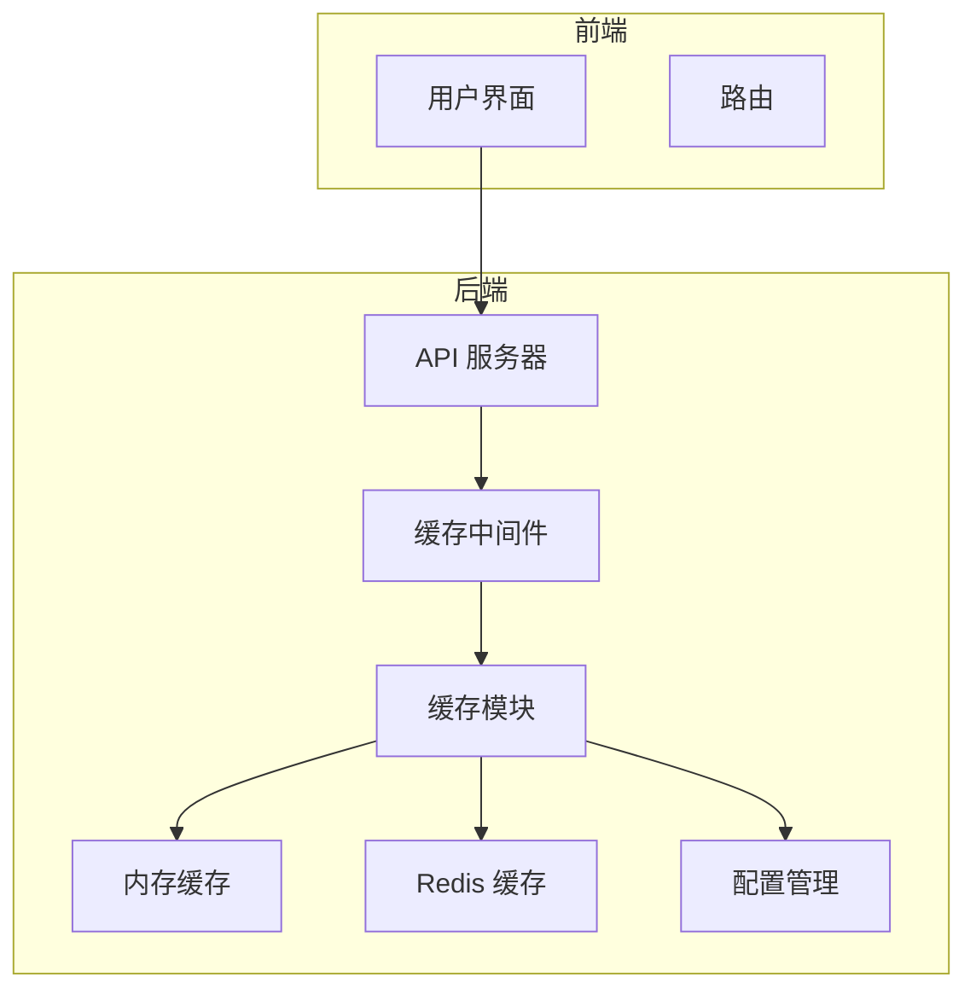
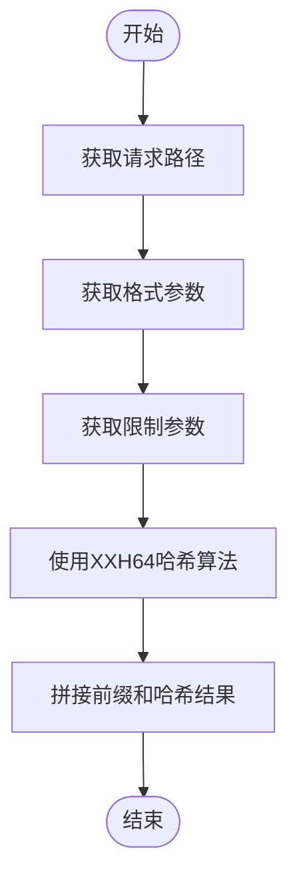
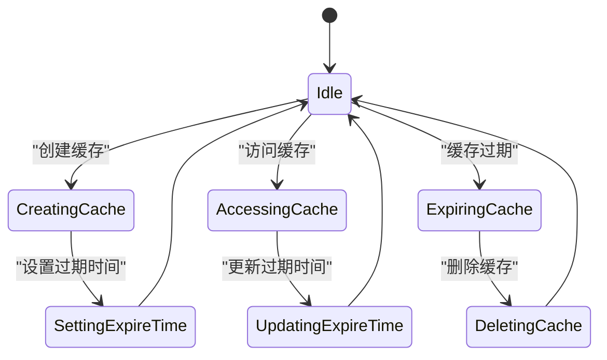
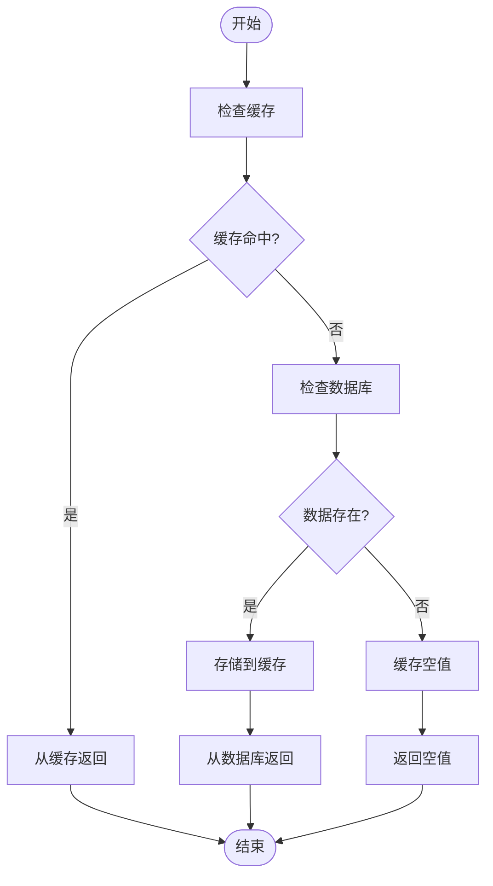
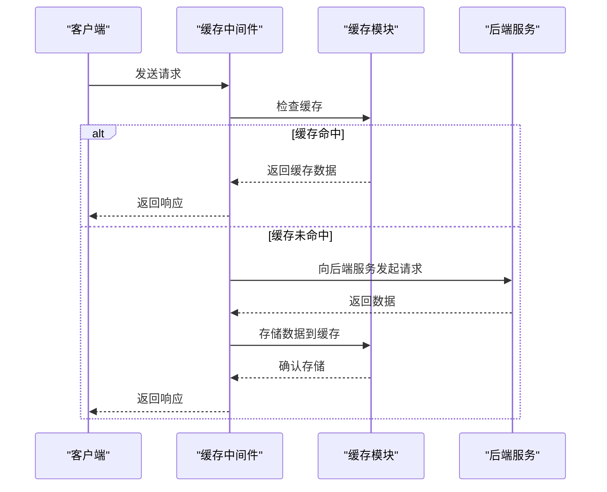
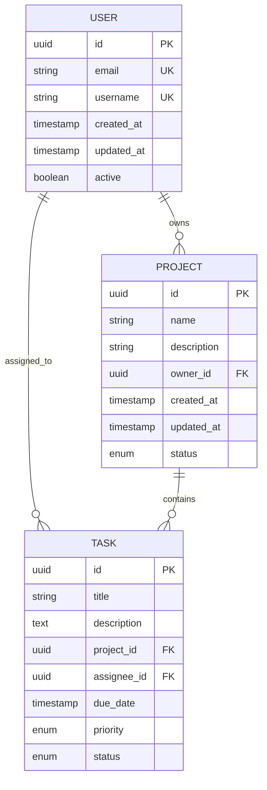
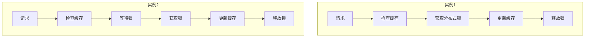

# 缓存系统

<cite>
**本文档引用的文件**  
- [cache.ts](file://lib/middleware/cache.ts)
- [config.ts](file://lib/config.ts)
- [index.ts](file://lib/utils/cache/index.ts)
- [redis.ts](file://lib/utils/cache/redis.ts)
- [memory.ts](file://lib/utils/cache/memory.ts)
- [base.ts](file://lib/utils/cache/base.ts)
- [bilibili/cache.ts](file://lib/routes/bilibili/cache.ts)
</cite>

## 目录
1. [引言](#引言)
2. [缓存系统架构](#缓存系统架构)
3. [缓存键生成策略](#缓存键生成策略)
4. [过期时间管理](#过期时间管理)
5. [缓存穿透与雪崩防范](#缓存穿透与雪崩防范)
6. [缓存中间件与底层工具集成](#缓存中间件与底层工具集成)
7. [缓存策略实现](#缓存策略实现)
8. [性能优化建议](#性能优化建议)
9. [分布式环境下的缓存一致性](#分布式环境下的缓存一致性)

## 引言

RSSHub 是一个开源的 RSS 生成器，其缓存系统在提升性能和降低后端负载方面起着至关重要的作用。本文档全面分析 RSSHub 的缓存系统架构，重点介绍基于 Redis 的缓存机制，包括缓存键生成策略、过期时间管理、缓存穿透和雪崩的防范措施。同时，文档还解释了缓存中间件与底层缓存工具的集成方式，分析不同缓存策略（如强制缓存、条件缓存）的实现，并提供性能优化建议，包括缓存大小配置、内存管理策略，以及分布式环境下的缓存一致性解决方案。

**Section sources**
- [cache.ts](file://lib/middleware/cache.ts#L1-L84)
- [config.ts](file://lib/config.ts#L1-L1188)

## 缓存系统架构

RSSHub 的缓存系统采用模块化设计，支持多种缓存类型，包括内存缓存和 Redis 缓存。系统通过配置文件 `config.ts` 中的 `CACHE_TYPE` 环境变量来决定使用哪种缓存类型。当 `CACHE_TYPE` 设置为 `memory` 时，系统使用内存缓存；当设置为 `redis` 时，系统使用 Redis 缓存。如果 `CACHE_TYPE` 为空或未设置，则禁用缓存。

缓存系统的核心组件包括：
- **缓存中间件**：负责处理请求的缓存逻辑，包括缓存键生成、缓存查找、缓存存储等。
- **缓存模块**：提供具体的缓存实现，如内存缓存和 Redis 缓存。
- **配置管理**：通过 `config.ts` 文件管理缓存相关的配置参数。



**Diagram sources**
- [cache.ts](file://lib/middleware/cache.ts#L1-L84)
- [config.ts](file://lib/config.ts#L1-L1188)
- [index.ts](file://lib/utils/cache/index.ts#L1-L100)
- [memory.ts](file://lib/utils/cache/memory.ts#L1-L45)
- [redis.ts](file://lib/utils/cache/redis.ts#L1-L78)

## 缓存键生成策略

RSSHub 的缓存键生成策略旨在确保缓存键的唯一性和可预测性。缓存键由请求路径、格式和限制参数组合而成，并通过 XXH64 哈希算法进行压缩，以减少键的长度。

具体生成过程如下：
1. 获取请求路径 `requestPath`。
2. 获取格式参数 `format`，默认值为 `rss`。
3. 获取限制参数 `limit`，如果存在则添加到键中。
4. 使用 XXH64 哈希算法对 `requestPath + format + limit` 进行哈希，生成固定长度的字符串。
5. 将哈希结果与前缀 `rsshub:koa-redis-cache:` 拼接，形成最终的缓存键。



**Diagram sources**
- [cache.ts](file://lib/middleware/cache.ts#L19-L23)

## 过期时间管理

RSSHub 的缓存系统通过配置文件 `config.ts` 中的 `CACHE_EXPIRE` 和 `CACHE_CONTENT_EXPIRE` 环境变量来管理缓存的过期时间。`CACHE_EXPIRE` 参数定义了路由缓存的时间，单位为秒；`CACHE_CONTENT_EXPIRE` 参数定义了不变内容缓存的时间，单位为秒。

具体管理过程如下：
1. 当缓存项被创建时，根据 `CACHE_CONTENT_EXPIRE` 参数设置过期时间。
2. 当缓存项被访问时，如果设置了 `refresh` 参数为 `true`，则更新缓存项的过期时间。
3. 当缓存项过期后，系统会自动删除该缓存项。



**Diagram sources**
- [config.ts](file://lib/config.ts#L738-L739)
- [redis.ts](file://lib/utils/cache/redis.ts#L57-L72)
- [memory.ts](file://lib/utils/cache/memory.ts#L31-L40)

## 缓存穿透与雪崩防范

### 缓存穿透

缓存穿透是指查询一个不存在的数据，由于缓存中没有该数据，每次请求都会直接访问数据库，导致数据库压力增大。RSSHub 通过以下措施防范缓存穿透：
- **空值缓存**：对于查询结果为空的情况，将空值也缓存起来，并设置较短的过期时间，避免频繁查询数据库。
- **布隆过滤器**：虽然当前代码中未实现，但可以考虑引入布隆过滤器来快速判断数据是否存在，从而减少对数据库的无效查询。

### 缓存雪崩

缓存雪崩是指大量缓存项在同一时间过期，导致大量请求直接访问数据库，造成数据库压力骤增。RSSHub 通过以下措施防范缓存雪崩：
- **随机过期时间**：在设置缓存过期时间时，加入一定的随机偏移量，避免大量缓存项同时过期。
- **多级缓存**：结合使用内存缓存和 Redis 缓存，即使 Redis 缓存失效，内存缓存仍能提供一定的保护。



**Diagram sources**
- [cache.ts](file://lib/middleware/cache.ts#L46-L54)
- [redis.ts](file://lib/utils/cache/redis.ts#L57-L72)
- [memory.ts](file://lib/utils/cache/memory.ts#L31-L40)

## 缓存中间件与底层工具集成

RSSHub 的缓存中间件通过 `cacheModule` 对象与底层缓存工具进行集成。`cacheModule` 对象根据配置文件中的 `CACHE_TYPE` 参数选择相应的缓存实现（内存缓存或 Redis 缓存），并提供统一的接口供中间件调用。

具体集成过程如下：
1. 在 `index.ts` 文件中，根据 `config.cache.type` 的值初始化 `cacheModule` 对象。
2. 如果 `config.cache.type` 为 `redis`，则初始化 Redis 客户端，并设置相应的事件监听器。
3. 如果 `config.cache.type` 为 `memory`，则初始化 LRU 缓存，并设置最大缓存数量和过期时间。
4. 将 `cacheModule` 对象暴露给中间件，供其调用。

```mermaid
classDiagram
class CacheModule {
+init() : void
+get(key : string, refresh? : boolean) : Promise<string | null>
+set(key : string, value? : string | Record<string, any>, maxAge? : number) : any
+status : { available : boolean }
+clients : { redisClient? : Redis, memoryCache? : LRUCache<any, any> }
}
class RedisCache {
+init() : void
+get(key : string, refresh? : boolean) : Promise<string | null>
+set(key : string, value? : string | Record<string, any>, maxAge? : number) : any
+status : { available : boolean }
+clients : { redisClient? : Redis }
}
class MemoryCache {
+init() : void
+get(key : string, refresh? : boolean) : string | null
+set(key : string, value? : string | Record<string, any>, maxAge? : number) : any
+status : { available : boolean }
+clients : { memoryCache? : LRUCache<any, any> }
}
CacheModule <|-- RedisCache
CacheModule <|-- MemoryCache
```

**Diagram sources**
- [index.ts](file://lib/utils/cache/index.ts#L1-L100)
- [redis.ts](file://lib/utils/cache/redis.ts#L1-L78)
- [memory.ts](file://lib/utils/cache/memory.ts#L1-L45)

## 缓存策略实现

RSSHub 支持多种缓存策略，包括强制缓存和条件缓存。这些策略通过中间件和缓存模块的协同工作来实现。

### 强制缓存

强制缓存是指在缓存有效期内，直接从缓存中返回数据，不向后端服务发起请求。RSSHub 通过以下方式实现强制缓存：
- 在中间件中检查缓存是否存在，如果存在则直接返回缓存数据。
- 设置缓存过期时间，确保缓存数据在一定时间内有效。

### 条件缓存

条件缓存是指在某些条件下才使用缓存，否则向后端服务发起请求。RSSHub 通过以下方式实现条件缓存：
- 在中间件中检查请求头中的 `Cache-Control` 字段，如果值为 `no-cache`，则不使用缓存。
- 在缓存模块中提供 `tryGet` 方法，允许在缓存未命中时调用指定的函数获取数据并缓存。



**Diagram sources**
- [cache.ts](file://lib/middleware/cache.ts#L13-L83)
- [index.ts](file://lib/utils/cache/index.ts#L75-L97)

## 性能优化建议

### 缓存大小配置

合理配置缓存大小可以有效利用内存资源，避免内存溢出。建议根据实际需求和服务器内存情况，设置合适的缓存大小。例如，可以通过 `MEMORY_MAX` 环境变量设置内存缓存的最大容量。

### 内存管理策略

采用 LRU（Least Recently Used）算法管理内存缓存，确保最近最少使用的数据被优先淘汰。此外，定期监控缓存使用情况，及时调整缓存策略。

### 分布式环境下的缓存一致性

在分布式环境下，多个实例可能同时访问同一个缓存，需要确保缓存的一致性。建议使用 Redis 作为共享缓存，通过 Redis 的原子操作保证数据的一致性。同时，可以考虑使用分布式锁机制，防止多个实例同时更新同一缓存项。



**Diagram sources**
- [config.ts](file://lib/config.ts#L741-L744)
- [memory.ts](file://lib/utils/cache/memory.ts#L14-L17)
- [redis.ts](file://lib/utils/cache/redis.ts#L21-L35)

## 分布式环境下的缓存一致性

在分布式环境下，多个实例可能同时访问同一个缓存，需要确保缓存的一致性。RSSHub 通过以下措施确保缓存一致性：
- **使用 Redis 作为共享缓存**：所有实例共享同一个 Redis 实例，确保数据的一致性。
- **原子操作**：利用 Redis 的原子操作（如 `SET` 和 `GET`）确保数据的完整性和一致性。
- **分布式锁**：在需要更新缓存项时，使用分布式锁机制，防止多个实例同时更新同一缓存项。



**Diagram sources**
- [redis.ts](file://lib/utils/cache/redis.ts#L21-L35)
- [bilibili/cache.ts](file://lib/routes/bilibili/cache.ts#L37-L59)