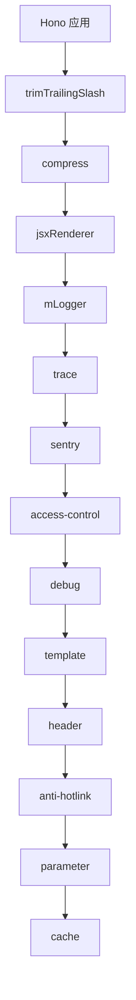
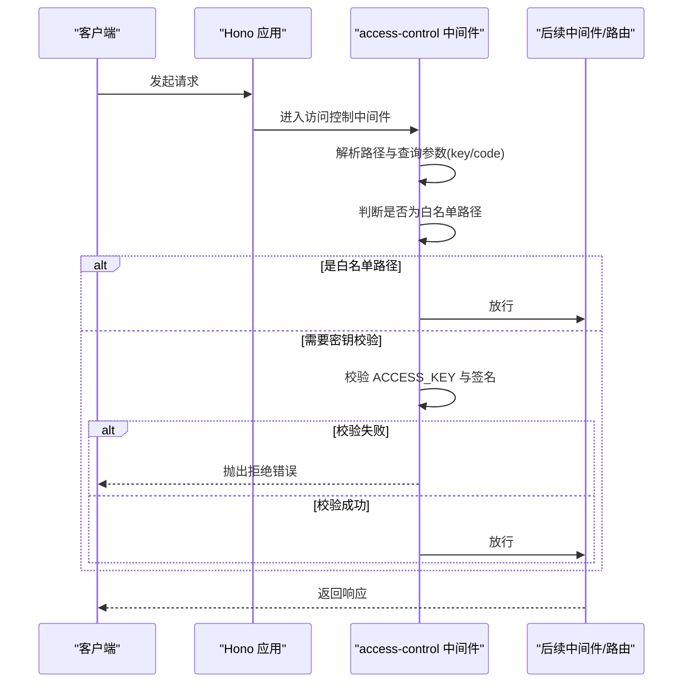
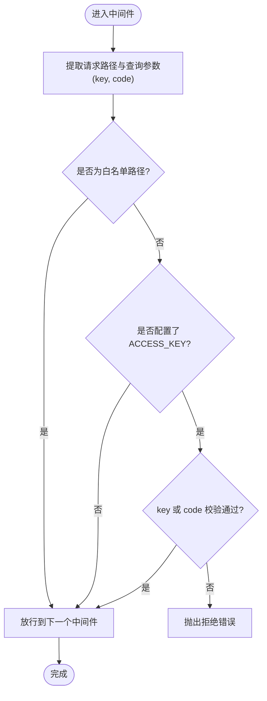
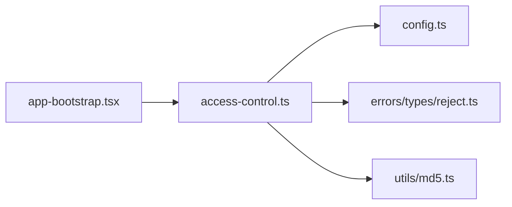

# 访问控制中间件

<cite>
**本文引用的文件**
- [access-control.ts](file://lib/middleware/access-control.ts)
- [access-control.test.ts](file://lib/middleware/access-control.test.ts)
- [config.ts](file://lib/config.ts)
- [reject.ts](file://lib/errors/types/reject.ts)
- [app-bootstrap.tsx](file://lib/app-bootstrap.tsx)
- [CLAUDE.md](file://lib/middleware/CLAUDE.md)
- [cache/index.ts](file://lib/utils/cache/index.ts)
- [cache.ts](file://lib/middleware/cache.ts)
</cite>

## 目录
1. [简介](#简介)
2. [项目结构](#项目结构)
3. [核心组件](#核心组件)
4. [架构总览](#架构总览)
5. [详细组件分析](#详细组件分析)
6. [依赖关系分析](#依赖关系分析)
7. [性能考量](#性能考量)
8. [故障排查指南](#故障排查指南)
9. [结论](#结论)
10. [附录](#附录)

## 简介
本文件深入分析 RSSHub 的访问控制中间件实现，重点覆盖以下方面：
- IP 白名单与黑名单机制：当前实现未内置 IP 级别的白名单/黑名单，但可通过上游网关或反向代理实现；本文给出可选方案与注意事项。
- API 密钥验证流程：基于查询参数 key 或 code 的双重校验，以及与路径组合的签名算法。
- 请求频率限制策略：当前未内置通用限流中间件，但可通过缓存模块与并发控制实现部分缓解；本文提供可行的替代方案。
- 配置选项说明：ACCESS_KEY 的使用方式与生效范围。
- 安全策略与最佳实践：如何在现有基础上增强访问控制与防护。
- 自定义访问控制规则：如何扩展中间件以满足特定需求。

## 项目结构
访问控制中间件位于中间件层，作为请求处理链中的一个环节，紧随链路追踪与错误追踪之后，早于调试、模板、请求头、热链保护、参数处理与缓存等中间件。

图表来源
- [app-bootstrap.tsx](file://lib/app-bootstrap.tsx#L27-L45)
- [CLAUDE.md](file://lib/middleware/CLAUDE.md#L76-L92)

章节来源
- [app-bootstrap.tsx](file://lib/app-bootstrap.tsx#L27-L45)
- [CLAUDE.md](file://lib/middleware/CLAUDE.md#L76-L92)

## 核心组件
- 访问控制中间件：负责对非公开静态资源进行密钥校验，拒绝未授权访问。
- 配置模块：读取 ACCESS_KEY 环境变量并暴露给中间件。
- 错误类型：统一抛出拒绝错误，便于上层错误处理器捕获与输出一致的拒绝响应。
- 缓存模块：为并发请求与限流提供基础能力，若不可用会发出警告提示。

章节来源
- [access-control.ts](file://lib/middleware/access-control.ts#L1-L26)
- [config.ts](file://lib/config.ts#L767-L769)
- [reject.ts](file://lib/errors/types/reject.ts#L1-L6)
- [cache/index.ts](file://lib/utils/cache/index.ts#L16-L60)

## 架构总览
访问控制中间件在请求进入路由处理之前执行，对路径进行白名单放行判断，随后根据配置决定是否进行密钥校验。其执行顺序如下：

图表来源
- [access-control.ts](file://lib/middleware/access-control.ts#L11-L24)
- [app-bootstrap.tsx](file://lib/app-bootstrap.tsx#L36-L45)

## 详细组件分析

### 访问控制中间件实现
- 路径白名单：对根路径、robots.txt、favicon.ico、logo.png 等静态资源不做密钥校验，直接放行。
- 密钥校验：
  - 查询参数 key：与配置中的 ACCESS_KEY 完全匹配。
  - 查询参数 code：对“路径 + ACCESS_KEY”的字符串进行哈希计算，与 code 匹配。
- 拒绝行为：当密钥校验失败时，抛出统一的拒绝错误类型，交由全局错误处理器处理。

图表来源
- [access-control.ts](file://lib/middleware/access-control.ts#L11-L24)

章节来源
- [access-control.ts](file://lib/middleware/access-control.ts#L1-L26)
- [access-control.test.ts](file://lib/middleware/access-control.test.ts#L17-L47)

### 配置选项与生效范围
- ACCESS_KEY：通过环境变量配置，用于启用访问控制与生成签名。中间件在每次请求时读取该配置。
- 生效范围：对除白名单路径外的所有动态路由生效；静态资源默认放行。
- 注意事项：
  - 若未设置 ACCESS_KEY，则不进行任何密钥校验。
  - code 签名基于“请求路径 + ACCESS_KEY”，因此不同路径会产生不同的签名，便于细粒度授权。

章节来源
- [config.ts](file://lib/config.ts#L767-L769)
- [access-control.ts](file://lib/middleware/access-control.ts#L11-L24)

### 错误处理与拒绝响应
- 统一错误类型：访问控制失败时抛出专用错误类型，便于上层错误处理器识别并返回一致的拒绝响应。
- 全局错误处理：由应用的错误处理器捕获并输出标准错误页面或状态码。

章节来源
- [reject.ts](file://lib/errors/types/reject.ts#L1-L6)
- [app-bootstrap.tsx](file://lib/app-bootstrap.tsx#L50-L51)

### 并发与缓存对限流的影响
- 缓存模块：提供内存或 Redis 的全局缓存能力，用于并发请求控制与结果缓存。
- 当缓存不可用时，会记录警告，提示并发请求可能不受限，存在潜在风险。
- 限流现状：访问控制中间件本身不内置通用限流逻辑；可通过缓存模块的并发键与 TTL 控制实现部分缓解。

章节来源
- [cache/index.ts](file://lib/utils/cache/index.ts#L16-L60)
- [cache.ts](file://lib/middleware/cache.ts#L1-L26)

## 依赖关系分析
访问控制中间件的直接依赖关系如下：

图表来源
- [access-control.ts](file://lib/middleware/access-control.ts#L1-L26)
- [config.ts](file://lib/config.ts#L767-L769)
- [reject.ts](file://lib/errors/types/reject.ts#L1-L6)
- [app-bootstrap.tsx](file://lib/app-bootstrap.tsx#L36-L45)

章节来源
- [access-control.ts](file://lib/middleware/access-control.ts#L1-L26)
- [app-bootstrap.tsx](file://lib/app-bootstrap.tsx#L36-L45)

## 性能考量
- 中间件链位置：访问控制位于链路追踪与错误追踪之后，避免对监控与异常处理造成干扰。
- 计算开销：密钥校验仅涉及字符串比较与一次哈希计算，开销极低。
- 缓存可用性：若缓存不可用，可能导致并发请求不受限，建议启用 Redis 以获得更好的并发控制与限流效果。
- 静态资源放行：白名单路径不进行密钥校验，减少不必要的 CPU 开销。

章节来源
- [CLAUDE.md](file://lib/middleware/CLAUDE.md#L76-L92)
- [cache/index.ts](file://lib/utils/cache/index.ts#L16-L60)

## 故障排查指南
- 403 拒绝访问：
  - 检查是否正确传递 key 或 code。
  - 确认 ACCESS_KEY 已正确设置且大小写一致。
  - 若使用 code，请确认路径与 ACCESS_KEY 组合无误。
- 白名单路径仍被拒绝：
  - 确认请求路径是否确实在白名单中。
- 缓存不可用导致并发问题：
  - 查看日志中关于缓存不可用的警告，并启用 Redis。
- 测试用例参考：
  - 单测覆盖了 key 与 code 的正反用例，可对照验证配置与签名是否正确。

章节来源
- [access-control.test.ts](file://lib/middleware/access-control.test.ts#L17-L47)
- [cache/index.ts](file://lib/utils/cache/index.ts#L59-L60)

## 结论
RSSHub 的访问控制中间件通过查询参数 key 与 code 提供了轻量级的 API 密钥验证能力，并结合白名单路径实现了对静态资源的放行。当前实现未内置 IP 白名单/黑名单与通用限流策略，但可通过上游网关或反向代理实现前者；后者可通过缓存模块与并发控制实现部分缓解。建议在生产环境中：
- 明确 ACCESS_KEY 的使用范围与分发策略；
- 对关键路由采用 code 签名，避免长期暴露；
- 启用 Redis 缓存以提升并发控制与稳定性；
- 在网关层补充 IP 白名单/黑名单与速率限制策略。

## 附录

### 配置项说明
- ACCESS_KEY：启用访问控制并作为密钥校验与签名生成的基础。

章节来源
- [config.ts](file://lib/config.ts#L767-L769)

### 场景化配置示例（以路径引用代替具体代码）
- 使用 key 进行访问控制
  - 请求示例路径：GET /test/2?key=你的ACCESS_KEY
  - 参考断言与期望：[access-control.test.ts](file://lib/middleware/access-control.test.ts#L31-L47)
- 使用 code 进行访问控制
  - 请求示例路径：GET /test/2?code=对“/test/2+ACCESS_KEY”进行哈希后的值
  - 参考断言与期望：[access-control.test.ts](file://lib/middleware/access-control.test.ts#L19-L26)
- 静态资源放行
  - 示例路径：/、/robots.txt、/favicon.ico、/logo.png
  - 参考放行逻辑：[access-control.ts](file://lib/middleware/access-control.ts#L16-L18)

### 自定义访问控制规则建议
- 增加 IP 白名单/黑名单：
  - 在访问控制中间件中增加对请求源 IP 的检查，或通过上游网关/反向代理实现。
- 增加通用限流：
  - 基于缓存模块的并发键与 TTL，实现每路径/每用户限流。
- 增强签名安全性：
  - 引入时间戳与随机数，使 code 具备时效性与一次性特性。