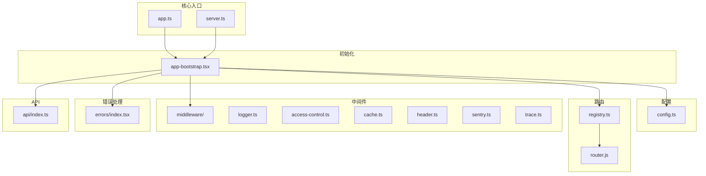
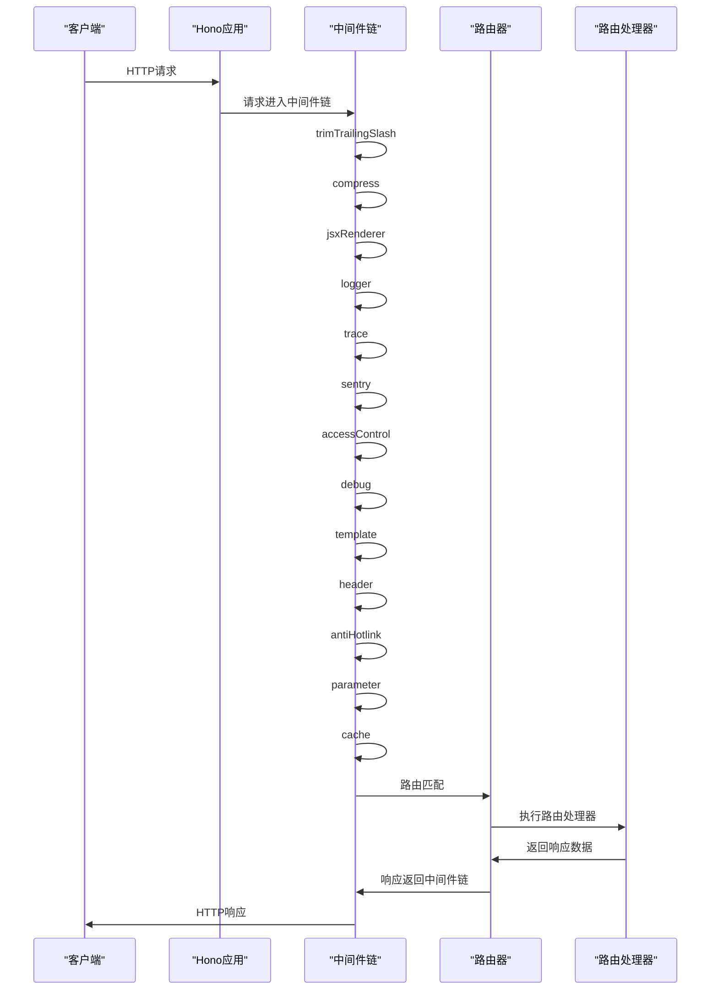
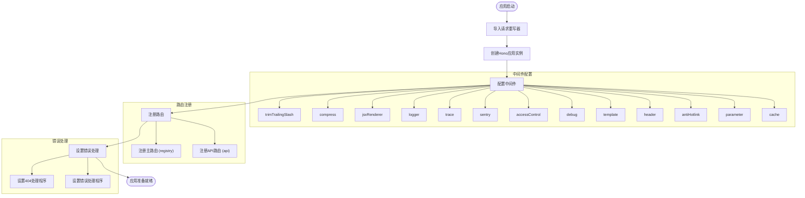
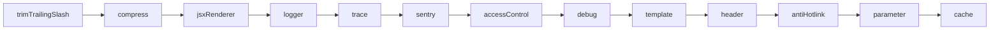
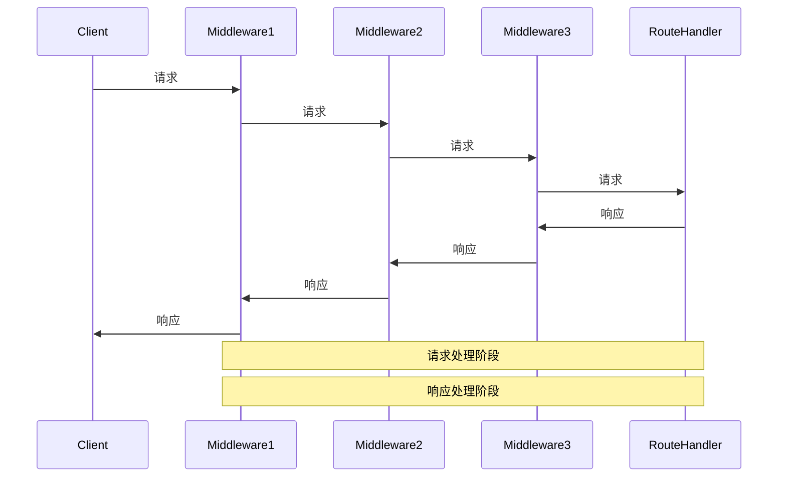
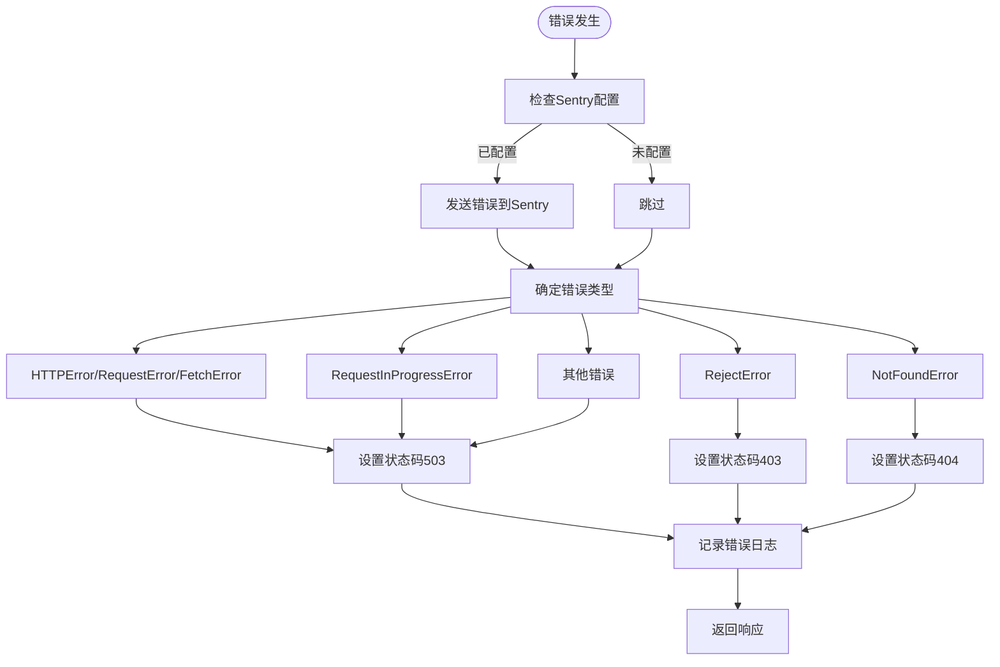
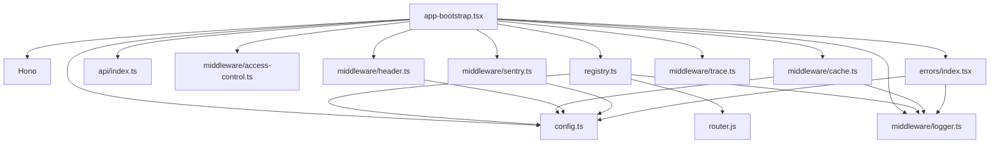

# 应用入口

<cite>
**本文档引用的文件**   
- [app.ts](file://lib/app.ts)
- [server.ts](file://lib/server.ts)
- [app-bootstrap.tsx](file://lib/app-bootstrap.tsx)
- [config.ts](file://lib/config.ts)
- [registry.ts](file://lib/registry.ts)
- [router.js](file://lib/router.js)
- [middleware/logger.ts](file://lib/middleware/logger.ts)
- [middleware/access-control.ts](file://lib/middleware/access-control.ts)
- [middleware/cache.ts](file://lib/middleware/cache.ts)
- [middleware/header.ts](file://lib/middleware/header.ts)
- [middleware/sentry.ts](file://lib/middleware/sentry.ts)
- [middleware/trace.ts](file://lib/middleware/trace.ts)
- [errors/index.tsx](file://lib/errors/index.tsx)
- [api/index.ts](file://lib/api/index.ts)
</cite>

## 目录
1. [应用入口](#应用入口)
2. [项目结构](#项目结构)
3. [核心组件](#核心组件)
4. [架构概述](#架构概述)
5. [详细组件分析](#详细组件分析)
6. [依赖分析](#依赖分析)
7. [性能考虑](#性能考虑)
8. [故障排除指南](#故障排除指南)
9. [结论](#结论)

## 项目结构

RSSHub应用入口的项目结构清晰地组织了核心功能模块。`lib/`目录包含了应用的核心组件，其中`app.ts`和`server.ts`作为应用的入口文件，`app-bootstrap.tsx`负责应用的初始化和配置，`config.ts`管理环境变量和配置，`registry.ts`处理路由注册，`middleware/`目录包含各种中间件实现。



**图源**
- [app.ts](file://lib/app.ts)
- [server.ts](file://lib/server.ts)
- [app-bootstrap.tsx](file://lib/app-bootstrap.tsx)
- [config.ts](file://lib/config.ts)
- [registry.ts](file://lib/registry.ts)
- [router.js](file://lib/router.js)
- [middleware/logger.ts](file://lib/middleware/logger.ts)
- [middleware/access-control.ts](file://lib/middleware/access-control.ts)
- [middleware/cache.ts](file://lib/middleware/cache.ts)
- [middleware/header.ts](file://lib/middleware/header.ts)
- [middleware/sentry.ts](file://lib/middleware/sentry.ts)
- [middleware/trace.ts](file://lib/middleware/trace.ts)
- [errors/index.tsx](file://lib/errors/index.tsx)
- [api/index.ts](file://lib/api/index.ts)

**章节源**
- [app.ts](file://lib/app.ts)
- [server.ts](file://lib/server.ts)

## 核心组件

RSSHub应用入口的核心组件包括`app.ts`、`server.ts`和`app-bootstrap.tsx`。`app.ts`和`server.ts`作为应用的入口文件，主要负责导入请求重写器并导出从`app-bootstrap.tsx`导入的默认应用实例。`app-bootstrap.tsx`是应用的核心初始化文件，负责创建Hono应用实例、配置中间件、注册路由和设置错误处理机制。

**章节源**
- [app.ts](file://lib/app.ts#L1-L6)
- [server.ts](file://lib/server.ts#L1-L6)
- [app-bootstrap.tsx](file://lib/app-bootstrap.tsx#L1-L53)

## 架构概述

RSSHub应用采用模块化架构，以Hono框架为核心，通过中间件链处理HTTP请求。应用启动时，`app-bootstrap.tsx`文件创建Hono应用实例，并按特定顺序注册一系列中间件，包括日志记录、跟踪、错误监控、访问控制、调试、模板渲染、头部设置、反盗链、参数处理和缓存。随后，应用注册主路由和API路由，并设置404和错误处理程序。



**图源**
- [app-bootstrap.tsx](file://lib/app-bootstrap.tsx#L25-L53)
- [middleware/logger.ts](file://lib/middleware/logger.ts)
- [middleware/access-control.ts](file://lib/middleware/access-control.ts)
- [middleware/cache.ts](file://lib/middleware/cache.ts)
- [middleware/header.ts](file://lib/middleware/header.ts)
- [middleware/sentry.ts](file://lib/middleware/sentry.ts)
- [middleware/trace.ts](file://lib/middleware/trace.ts)
- [registry.ts](file://lib/registry.ts)

## 详细组件分析

### 应用启动流程分析

RSSHub应用的启动流程始于`app.ts`或`server.ts`文件的导入。这两个文件都导入了请求重写器并导出了从`app-bootstrap.tsx`导入的默认应用实例。`app-bootstrap.tsx`文件是应用初始化的核心，它创建Hono应用实例并配置各种中间件和路由。



**图源**
- [app.ts](file://lib/app.ts#L1-L6)
- [server.ts](file://lib/server.ts#L1-L6)
- [app-bootstrap.tsx](file://lib/app-bootstrap.tsx#L25-L53)

**章节源**
- [app.ts](file://lib/app.ts#L1-L6)
- [server.ts](file://lib/server.ts#L1-L6)
- [app-bootstrap.tsx](file://lib/app-bootstrap.tsx#L1-L53)

### Hono框架集成分析

Hono框架的集成主要在`app-bootstrap.tsx`文件中完成。应用通过`new Hono()`创建实例，并使用`app.use()`方法按特定顺序注册中间件。Hono的JSX渲染器被配置为生成XML文档，以支持RSS/Atom feed的生成。路由通过`app.route()`方法注册，将主路由和API路由分别挂载到根路径和`/api`路径。

**章节源**
- [app-bootstrap.tsx](file://lib/app-bootstrap.tsx#L25-L49)

### 中间件加载顺序分析

中间件的加载顺序在`app-bootstrap.tsx`文件中明确定义，这个顺序对于应用的正确运行至关重要。每个中间件都有特定的职责，按顺序执行以确保请求被正确处理。



**图源**
- [app-bootstrap.tsx](file://lib/app-bootstrap.tsx#L27-L45)

**章节源**
- [app-bootstrap.tsx](file://lib/app-bootstrap.tsx#L27-L45)

### 中间件执行流程分析

中间件的执行流程遵循Koa风格的洋葱模型。请求从外层向内层传递，经过每个中间件的处理，然后响应从内层向外层返回。这种模型允许中间件在请求处理前后执行逻辑，如日志记录、错误处理和响应修改。



**图源**
- [app-bootstrap.tsx](file://lib/app-bootstrap.tsx)
- [middleware/logger.ts](file://lib/middleware/logger.ts)
- [middleware/cache.ts](file://lib/middleware/cache.ts)

### 环境变量处理分析

环境变量的处理在`config.ts`文件中实现。文件使用`dotenv/config`导入环境变量，并定义了`ConfigEnv`类型来描述所有可能的环境变量键。配置值通过`calculateValue()`函数计算，该函数将环境变量转换为适当的类型（如布尔值、整数），并应用默认值。

```mermaid
classDiagram
class Config {
+disallowRobot : boolean
+enableCluster? : string
+isPackage : boolean
+nodeName? : string
+connect : { port : number }
+listenInaddrAny : boolean
+requestRetry : number
+requestTimeout : number
+ua : string
+trueUA : string
+allowOrigin? : string
+cache : { type : string, requestTimeout : number, routeExpire : number, contentExpire : number }
+memory : { max : number }
+redis : { url : string }
+proxyUri? : string
+proxyUris? : string[]
+proxy : { protocol? : string, host? : string, port? : string, auth? : string, url_regex : string, strategy : 'on_retry' | 'all', failoverTimeout? : number, healthCheckInterval? : number }
+pacUri? : string
+pacScript? : string
+accessKey? : string
+debugInfo : string
+loggerLevel : string
+noLogfiles? : boolean
+otel : { seconds_bucket? : string, milliseconds_bucket? : string }
+showLoggerTimestamp? : boolean
+sentry : { dsn? : string, routeTimeout : number }
+enableRemoteDebugging? : boolean
+hotlink : { template? : string, includePaths? : string[], excludePaths? : string[] }
+feature : { allow_user_hotlink_template : boolean, filter_regex_engine : string, allow_user_supply_unsafe_domain : boolean, disable_nsfw : boolean }
+suffix? : string
+titleLengthLimit : number
+openai : { apiKey? : string, model? : string, temperature? : number, maxTokens? : number, endpoint : string, inputOption : string, promptTitle : string, promptDescription : string }
+follow : { ownerUserId? : string, description? : string, price? : number, userLimit? : number }
+bilibili : { cookies : Record<string, string | undefined>, dmImgList? : string, dmImgInter? : string, excludeSubtitles? : boolean }
+bitbucket : { username? : string, password? : string }
+btbyr : { host? : string, cookies? : string }
+bupt : { portal_cookie? : string }
+caixin : { cookie? : string }
+civitai : { cookie? : string }
+dianping : { cookie? : string }
+dida365 : { username? : string, password? : string }
+discord : { authorization? : string }
+discourse : { config : Record<string, string | undefined> }
+discuz : { cookies : Record<string, string | undefined> }
+disqus : { api_key? : string }
+douban : { cookie? : string }
+ehentai : { ipb_member_id? : string, ipb_pass_hash? : string, sk? : string, igneous? : string, star? : string, img_proxy? : string }
+email : { config : Record<string, string | undefined> }
+fanbox : { session? : string }
+fanfou : { consumer_key? : string, consumer_secret? : string, username? : string, password? : string }
+fantia : { cookies? : string }
+game4399 : { cookie? : string }
+gelbooru : { apiKey? : string, userId? : string }
+github : { access_token? : string }
+gitee : { access_token? : string }
+google : { fontsApiKey? : string }
+guozaoke : { cookies? : string }
+hefeng : { key? : string, apiHost? : string }
+infzm : { cookie? : string }
+initium : { username? : string, password? : string, bearertoken? : string }
+instagram : { username? : string, password? : string, proxy? : string, cookie? : string }
+iwara : { username? : string, password? : string }
+javdb : { session? : string }
+jumeili : { cookie? : string }
+keylol : { cookie? : string }
+lastfm : { api_key? : string }
+lightnovel : { cookie? : string }
+lofter : { cookies? : string }
+lorientlejour : { token? : string, username? : string, password? : string }
+malaysiakini : { email? : string, password? : string, refreshToken? : string }
+mangadex : { username? : string, password? : string, clientId? : string, clientSecret? : string, refreshToken? : string }
+manhuagui : { cookie? : string }
+mastodon : { apiHost? : string, accessToken? : string, acctDomain? : string }
+medium : { cookies : Record<string, string | undefined>, articleCookie? : string }
+mihoyo : { cookie? : string }
+miniflux : { instance? : string, token? : string }
+misskey : { accessToken? : string }
+mixi2 : { authToken? : string, authKey? : string }
+mox : { cookie : string }
+ncm : { cookies? : string }
+newrank : { cookie? : string }
+nga : { uid? : string, cid? : string }
+nhentai : { username? : string, password? : string }
+notion : { key? : string }
+patreon : { sessionId? : string }
+pianyuan : { cookie? : string }
+pixabay : { key? : string }
+pixiv : { refreshToken? : string, bypassCdn? : boolean, bypassCdnHostname? : string, bypassCdnDoh? : string, imgProxy? : string }
+pkubbs : { cookie? : string }
+qingting : { id? : string }
+readwise : { accessToken? : string }
+saraba1st : { cookie? : string, host? : string }
+sehuatang : { cookie? : string }
+scboy : { token? : string }
+scihub : { host? : string }
+sdo : { ff14risingstones? : string, ua? : string }
+sis001 : { baseUrl? : string }
+skeb : { bearerToken? : string }
+sorrycc : { cookie? : string }
+spotify : { clientId? : string, clientSecret? : string, refreshToken? : string }
+sspai : { bearertoken? : string }
+telegram : { token? : string, session? : string, apiId? : number, apiHash? : string, maxConcurrentDownloads? : number, proxy? : { host? : string, port? : number, secret? : string } }
+tophub : { cookie? : string }
+tsdm39 : { cookie : string }
+tumblr : { clientId? : string, clientSecret? : string, refreshToken? : string }
+twitter : { username? : string[], password? : string[], authenticationSecret? : string[], phoneOrEmail? : string[], authToken? : string[], thirdPartyApi? : string }
+uestc : { bbsCookie? : string, bbsAuthStr? : string }
+weibo : { app_key? : string, app_secret? : string, cookies? : string, redirect_url? : string }
+wenku8 : { cookie? : string }
+wordpress : { cdnUrl? : string }
+xiaoyuzhou : { device_id? : string, refresh_token? : string }
+xiaohongshu : { cookie? : string }
+ximalaya : { token? : string }
+xsijishe : { cookie? : string, userAgent? : string }
+xueqiu : { cookies? : string }
+yamibo : { salt? : string, auth? : string }
+youtube : { key? : string, clientId? : string, clientSecret? : string, refreshToken? : string }
+zhihu : { cookies? : string }
+zodgame : { cookie? : string }
+zsxq : { accessToken? : string }
+smzdm : { cookie? : string }
}
class ConfigEnv {
+DISALLOW_ROBOT : string
+ENABLE_CLUSTER : string
+IS_PACKAGE : string
+NODE_NAME : string
+PUPPETEER_REAL_BROWSER_SERVICE : string
+PUPPETEER_WS_ENDPOINT : string
+CHROMIUM_EXECUTABLE_PATH : string
+PORT : string
+LISTEN_INADDR_ANY : string
+REQUEST_RETRY : string
+REQUEST_TIMEOUT : string
+UA : string
+NO_RANDOM_UA : string
+ALLOW_ORIGIN : string
+CACHE_TYPE : string
+CACHE_REQUEST_TIMEOUT : string
+CACHE_EXPIRE : string
+CACHE_CONTENT_EXPIRE : string
+MEMORY_MAX : string
+REDIS_URL : string
+PROXY_URI : string
+PROXY_URIS : string
+PROXY_PROTOCOL : string
+PROXY_HOST : string
+PROXY_PORT : string
+PROXY_AUTH : string
+PROXY_URL_REGEX : string
+PROXY_STRATEGY : string
+PROXY_FAILOVER_TIMEOUT : string
+PROXY_HEALTH_CHECK_INTERVAL : string
+PAC_URI : string
+PAC_SCRIPT : string
+ACCESS_KEY : string
+DEBUG_INFO : string
+LOGGER_LEVEL : string
+NO_LOGFILES : string
+OTEL_SECONDS_BUCKET : string
+OTEL_MILLISECONDS_BUCKET : string
+SHOW_LOGGER_TIMESTAMP : string
+SENTRY : string
+SENTRY_ROUTE_TIMEOUT : string
+ENABLE_REMOTE_DEBUGGING : string
+HOTLINK_TEMPLATE : string
+HOTLINK_INCLUDE_PATHS : string
+HOTLINK_EXCLUDE_PATHS : string
+ALLOW_USER_HOTLINK_TEMPLATE : string
+FILTER_REGEX_ENGINE : string
+ALLOW_USER_SUPPLY_UNSAFE_DOMAIN : string
+DISABLE_NSFW : string
+SUFFIX : string
+TITLE_LENGTH_LIMIT : string
+OPENAI_API_KEY : string
+OPENAI_MODEL : string
+OPENAI_TEMPERATURE : string
+OPENAI_MAX_TOKENS : string
+OPENAI_API_ENDPOINT : string
+OPENAI_INPUT_OPTION : string
+OPENAI_PROMPT : string
+OPENAI_PROMPT_TITLE : string
+FOLLOW_OWNER_USER_ID : string
+FOLLOW_DESCRIPTION : string
+FOLLOW_PRICE : string
+FOLLOW_USER_LIMIT : string
+BILIBILI_COOKIE_${string} : string
+BILIBILI_DM_IMG_LIST : string
+BILIBILI_DM_IMG_INTER : string
+BILIBILI_EXCLUDE_SUBTITLES : string
+BITBUCKET_USERNAME : string
+BITBUCKET_PASSWORD : string
+BTBYR_HOST : string
+BTBYR_COOKIE : string
+BUPT_PORTAL_COOKIE : string
+CAIXIN_COOKIE : string
+CIVITAI_COOKIE : string
+DIANPING_COOKIE : string
+DIDA365_USERNAME : string
+DIDA365_PASSWORD : string
+DISCORD_AUTHORIZATION : string
+DISCOURSE_CONFIG_${string} : string
+DISCUZ_COOKIE_${string} : string
+DISQUS_API_KEY : string
+DOUBAN_COOKIE : string
+EH_IPB_MEMBER_ID : string
+EH_IPB_PASS_HASH : string
+EH_SK : string
+EH_IGNEOUS : string
+EH_STAR : string
+EH_IMG_PROXY : string
+EMAIL_CONFIG_${string} : string
+FANBOX_SESSION_ID : string
+FANFOU_CONSUMER_KEY : string
+FANFOU_CONSUMER_SECRET : string
+FANFOU_USERNAME : string
+FANFOU_PASSWORD : string
+FANTIA_COOKIE : string
+GAME_4399 : string
+GELBOORU_API_KEY : string
+GELBOORU_USER_ID : string
+GITHUB_ACCESS_TOKEN : string
+GITEE_ACCESS_TOKEN : string
+GOOGLE_FONTS_API_KEY : string
+GUOZAOKE_COOKIES : string
+HEFENG_KEY : string
+HEFENG_API_HOST : string
+INFZM_COOKIE : string
+INITIUM_USERNAME : string
+INITIUM_PASSWORD : string
+INITIUM_BEARER_TOKEN : string
+IG_USERNAME : string
+IG_PASSWORD : string
+IG_PROXY : string
+IG_COOKIE : string
+IWARA_USERNAME : string
+IWARA_PASSWORD : string
+JAVDB_SESSION : string
+JUMEILI_COOKIE : string
+KEYLOL_COOKIE : string
+LASTFM_API_KEY : string
+SECURITY_KEY : string
+LOFTER_COOKIE : string
+LORIENTLEJOUR_TOKEN : string
+LORIENTLEJOUR_USERNAME : string
+LORIENTLEJOUR_PASSWORD : string
+MALAYSIAKINI_EMAIL : string
+MALAYSIAKINI_PASSWORD : string
+MALAYSIAKINI_REFRESHTOKEN : string
+MANGADEX_USERNAME : string
+MANGADEX_PASSWORD : string
+MANGADEX_CLIENT_ID : string
+MANGADEX_CLIENT_SECRET : string
+MANGADEX_REFRESH_TOKEN : string
+MHGUI_COOKIE : string
+MASTODON_API_HOST : string
+MASTODON_API_ACCESS_TOKEN : string
+MASTODON_API_ACCT_DOMAIN : string
+MEDIUM_COOKIE_${string} : string
+MEDIUM_ARTICLE_COOKIE : string
+MIHOYO_COOKIE : string
+MINIFLUX_INSTANCE : string
+MINIFLUX_TOKEN : string
+MISSKEY_ACCESS_TOKEN : string
+MIXI2_AUTH_TOKEN : string
+MIXI2_AUTH_KEY : string
+MOX_COOKIE : string
+NCM_COOKIES : string
+NEWRANK_COOKIE : string
+NGA_PASSPORT_UID : string
+NGA_PASSPORT_CID : string
+NHENTAI_USERNAME : string
+NHENTAI_PASSWORD : string
+NOTION_TOKEN : string
+PATREON_SESSION_ID : string
+PIANYUAN_COOKIE : string
+PIXABAY_KEY : string
+PIXIV_REFRESHTOKEN : string
+PIXIV_BYPASS_CDN : string
+PIXIV_BYPASS_HOSTNAME : string
+PIXIV_BYPASS_DOH : string
+PIXIV_IMG_PROXY : string
+PKUBBS_COOKIE : string
+QINGTING_ID : string
+READWISE_ACCESS_TOKEN : string
+SARABA1ST_COOKIE : string
+SARABA1ST_HOST : string
+SEHUATANG_COOKIE : string
+SCBOY_BBS_TOKEN : string
+SCIHUB_HOST : string
+SDO_FF14RISINGSTONES : string
+SDO_UA : string
+SIS001_BASE_URL : string
+SKEB_BEARER_TOKEN : string
+SORRYCC_COOKIES : string
+SPOTIFY_CLIENT_ID : string
+SPOTIFY_CLIENT_SECRET : string
+SPOTIFY_REFRESHTOKEN : string
+SSPAI_BEARERTOKEN : string
+TELEGRAM_TOKEN : string
+TELEGRAM_SESSION : string
+TELEGRAM_API_ID : string
+TELEGRAM_API_HASH : string
+TELEGRAM_MAX_CONCURRENT_DOWNLOADS : string
+TELEGRAM_PROXY_HOST : string
+TELEGRAM_PROXY_PORT : string
+TELEGRAM_PROXY_SECRET : string
+TOPHUB_COOKIE : string
+TSDM39_COOKIES : string
+TUMBLR_CLIENT_ID : string
+TUMBLR_CLIENT_SECRET : string
+TUMBLR_REFRESH_TOKEN : string
+TWITTER_USERNAME : string
+TWITTER_PASSWORD : string
+TWITTER_AUTHENTICATION_SECRET : string
+TWITTER_PHONE_OR_EMAIL : string
+TWITTER_AUTH_TOKEN : string
+TWITTER_THIRD_PARTY_API : string
+UESTC_BBS_COOKIE : string
+UESTC_BBS_AUTH_STR : string
+WEIBO_APP_KEY : string
+WEIBO_APP_SECRET : string
+WEIBO_COOKIES : string
+WEIBO_REDIRECT_URL : string
+WENKU8_COOKIE : string
+WORDPRESS_CDN : string
+XIAOYUZHOU_ID : string
+XIAOYUZHOU_TOKEN : string
+XIAOHONGSHU_COOKIE : string
+XIMALAYA_TOKEN : string
+XSIJISHE_COOKIE : string
+XSIJISHE_USER_AGENT : string
+XUEQIU_COOKIES : string
+YAMIBO_SALT : string
+YAMIBO_AUTH : string
+YOUTUBE_KEY : string
+YOUTUBE_CLIENT_ID : string
+YOUTUBE_CLIENT_SECRET : string
+YOUTUBE_REFRESH_TOKEN : string
+ZHIHU_COOKIES : string
+ZODGAME_COOKIE : string
+ZSXQ_ACCESS_TOKEN : string
+SMZDM_COOKIE : string
+REMOTE_CONFIG : string
+REMOTE_CONFIG_AUTH : string
}
ConfigEnv --> Config : "转换"
```

**图源**
- [config.ts](file://lib/config.ts#L1-L800)

**章节源**
- [config.ts](file://lib/config.ts#L1-L800)

### 错误处理机制分析

错误处理机制在`errors/index.tsx`文件中实现。文件导出`errorHandler`和`notFoundHandler`两个函数，分别用于处理应用错误和404错误。`errorHandler`函数根据错误类型设置相应的HTTP状态码，并将错误信息记录到日志中。如果配置了Sentry，错误信息还会被发送到Sentry进行监控。



**图源**
- [errors/index.tsx](file://lib/errors/index.tsx#L13-L82)

**章节源**
- [errors/index.tsx](file://lib/errors/index.tsx#L13-L82)

### 性能优化策略分析

性能优化策略主要体现在缓存机制和连接池管理上。缓存中间件使用Redis或内存缓存来存储路由响应，减少重复请求的处理时间。连接池管理通过配置请求超时和重试次数来优化网络请求性能。

**章节源**
- [middleware/cache.ts](file://lib/middleware/cache.ts)
- [config.ts](file://lib/config.ts)

## 依赖分析

RSSHub应用入口的依赖关系清晰，核心依赖包括Hono框架、各种中间件模块、配置模块、路由模块和错误处理模块。这些模块通过`app-bootstrap.tsx`文件组合在一起，形成一个完整的应用。



**图源**
- [app-bootstrap.tsx](file://lib/app-bootstrap.tsx)
- [config.ts](file://lib/config.ts)
- [registry.ts](file://lib/registry.ts)
- [api/index.ts](file://lib/api/index.ts)
- [middleware/logger.ts](file://lib/middleware/logger.ts)
- [middleware/access-control.ts](file://lib/middleware/access-control.ts)
- [middleware/cache.ts](file://lib/middleware/cache.ts)
- [middleware/header.ts](file://lib/middleware/header.ts)
- [middleware/sentry.ts](file://lib/middleware/sentry.ts)
- [middleware/trace.ts](file://lib/middleware/trace.ts)
- [errors/index.tsx](file://lib/errors/index.tsx)

**章节源**
- [app-bootstrap.tsx](file://lib/app-bootstrap.tsx)
- [config.ts](file://lib/config.ts)
- [registry.ts](file://lib/registry.ts)
- [api/index.ts](file://lib/api/index.ts)
- [middleware/logger.ts](file://lib/middleware/logger.ts)
- [middleware/access-control.ts](file://lib/middleware/access-control.ts)
- [middleware/cache.ts](file://lib/middleware/cache.ts)
- [middleware/header.ts](file://lib/middleware/header.ts)
- [middleware/sentry.ts](file://lib/middleware/sentry.ts)
- [middleware/trace.ts](file://lib/middleware/trace.ts)
- [errors/index.tsx](file://lib/errors/index.tsx)

## 性能考虑

RSSHub应用入口的性能考虑主要体现在以下几个方面：首先，通过Hono框架的轻量级设计和中间件的高效实现，确保了应用的快速响应。其次，缓存机制有效减少了重复请求的处理时间，提高了系统的整体性能。最后，通过合理的错误处理和日志记录，确保了系统的稳定性和可维护性。

## 故障排除指南

当遇到问题时，可以按照以下步骤进行排查：首先检查环境变量配置是否正确，特别是`PORT`、`CACHE_TYPE`和`REDIS_URL`等关键配置。其次，查看日志输出，特别是错误日志，以确定问题的具体原因。如果问题与特定路由相关，可以检查该路由的实现代码和依赖项。最后，如果问题仍然无法解决，可以尝试禁用相关中间件或功能，以确定问题的根源。

**章节源**
- [config.ts](file://lib/config.ts)
- [errors/index.tsx](file://lib/errors/index.tsx)
- [middleware/logger.ts](file://lib/middleware/logger.ts)

## 结论

RSSHub应用入口的设计体现了模块化和可扩展性的原则。通过Hono框架和中间件机制，应用能够高效地处理HTTP请求，并通过配置文件和环境变量实现灵活的部署。应用的启动流程清晰，中间件加载顺序合理，错误处理机制完善，为开发者提供了良好的开发和维护体验。