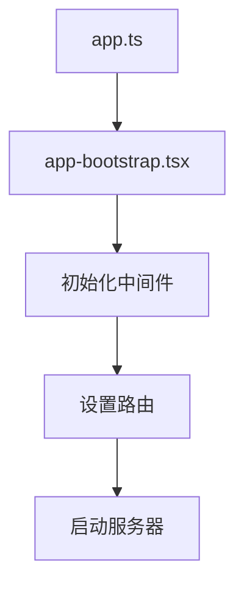
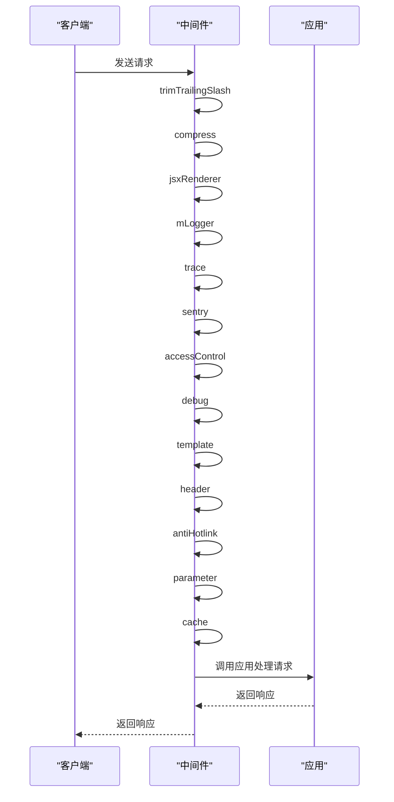
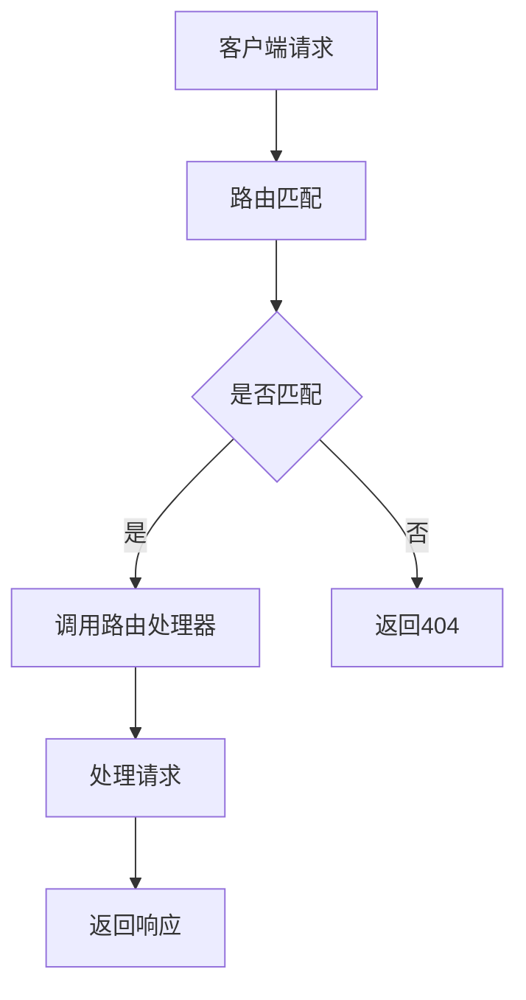
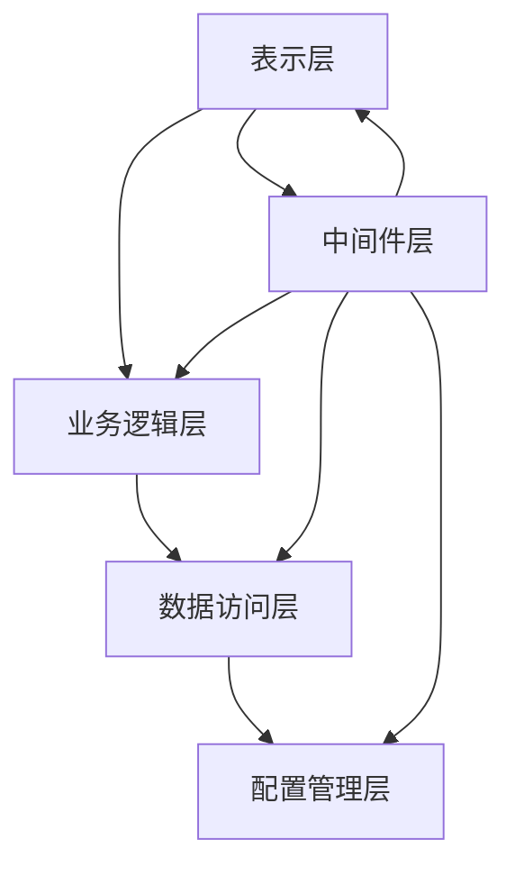
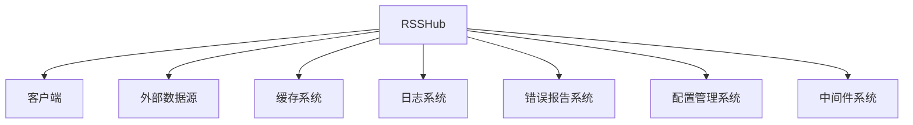
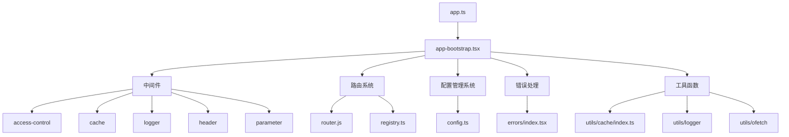

# 核心架构

<cite>
**本文档中引用的文件**   
- [app.ts](file://lib/app.ts)
- [config.ts](file://lib/config.ts)
- [server.ts](file://lib/server.ts)
- [router.js](file://lib/router.js)
- [app-bootstrap.tsx](file://lib/app-bootstrap.tsx)
- [registry.ts](file://lib/registry.ts)
- [index.ts](file://lib/index.ts)
- [middleware/access-control.ts](file://lib/middleware/access-control.ts)
- [middleware/cache.ts](file://lib/middleware/cache.ts)
- [middleware/logger.ts](file://lib/middleware/logger.ts)
- [middleware/header.ts](file://lib/middleware/header.ts)
- [middleware/parameter.ts](file://lib/middleware/parameter.ts)
- [utils/cache/index.ts](file://lib/utils/cache/index.ts)
- [errors/index.tsx](file://lib/errors/index.tsx)
</cite>

## 目录
1. [简介](#简介)
2. [项目结构](#项目结构)
3. [应用入口点](#应用入口点)
4. [配置管理系统](#配置管理系统)
5. [中间件架构](#中间件架构)
6. [路由系统](#路由系统)
7. [分层架构设计](#分层架构设计)
8. [系统上下文图](#系统上下文图)
9. [组件图](#组件图)
10. [可扩展性与维护性](#可扩展性与维护性)

## 简介
RSSHub 是一个开源的 RSS 生成器，旨在为各种网站和服务提供 RSS 订阅功能。本文档详细描述了 RSSHub 的核心架构，包括应用入口点、配置管理系统、中间件架构、路由系统以及分层架构设计。通过这些组件的协同工作，RSSHub 能够高效地处理不同内容源的请求，并为用户提供高质量的 RSS 订阅服务。

## 项目结构
RSSHub 的项目结构清晰，主要分为以下几个部分：
- **assets/**: 静态资源文件，如 HTML、CSS 和 JavaScript 文件。
- **eslint-plugins/**: ESLint 插件，用于代码质量检查。
- **lib/**: 核心逻辑代码，包含 API、错误处理、中间件、路由、工具函数等。
- **patches/**: 代码补丁文件。
- **plugins/**: 构建插件。
- **scripts/**: 各种脚本文件，用于自动化任务。
- **.envrc**: 环境变量配置文件。
- **package.json**: 项目依赖和脚本配置。
- **tsconfig.json**: TypeScript 配置文件。

**Diagram sources**
- [lib/app.ts](file://lib/app.ts#L1-L6)
- [lib/config.ts](file://lib/config.ts#L1-L800)
- [lib/server.ts](file://lib/server.ts#L1-L6)
- [lib/router.js](file://lib/router.js#L1-L800)

**Section sources**
- [lib/app.ts](file://lib/app.ts#L1-L6)
- [lib/config.ts](file://lib/config.ts#L1-L800)
- [lib/server.ts](file://lib/server.ts#L1-L6)
- [lib/router.js](file://lib/router.js#L1-L800)

## 应用入口点
RSSHub 的应用入口点是 `app.ts` 文件，它负责协调各个模块的工作。`app.ts` 文件通过导入 `app-bootstrap.tsx` 来初始化应用，并设置必要的中间件和路由。

**Diagram sources**
- [lib/app.ts](file://lib/app.ts#L1-L6)
- [lib/app-bootstrap.tsx](file://lib/app-bootstrap.tsx#L1-L54)

**Section sources**
- [lib/app.ts](file://lib/app.ts#L1-L6)
- [lib/app-bootstrap.tsx](file://lib/app-bootstrap.tsx#L1-L54)

## 配置管理系统
RSSHub 的配置管理系统由 `config.ts` 文件实现，它定义了应用的各种配置选项。配置选项包括应用配置、网络配置、缓存配置、代理配置、访问控制、日志记录、Feed 配置等。

### 配置选项
- **应用配置**:
  - `DISALLOW_ROBOT`: 是否禁止机器人访问。
  - `ENABLE_CLUSTER`: 是否启用集群模式。
  - `IS_PACKAGE`: 是否为打包模式。
  - `NODE_NAME`: 节点名称。
  - `PUPPETEER_REAL_BROWSER_SERVICE`: Puppeteer 实际浏览器服务。
  - `PUPPETEER_WS_ENDPOINT`: Puppeteer WebSocket 端点。
  - `CHROMIUM_EXECUTABLE_PATH`: Chromium 可执行文件路径。

- **网络配置**:
  - `PORT`: 监听端口。
  - `LISTEN_INADDR_ANY`: 是否允许公网连接。
  - `REQUEST_RETRY`: 请求失败重试次数。
  - `REQUEST_TIMEOUT`: 请求超时时间（毫秒）。
  - `UA`: 用户代理字符串。
  - `NO_RANDOM_UA`: 是否禁用随机用户代理。
  - `ALLOW_ORIGIN`: 允许的来源。

- **缓存配置**:
  - `CACHE_TYPE`: 缓存类型，支持 'memory' 和 'redis'。
  - `CACHE_REQUEST_TIMEOUT`: 缓存请求超时时间。
  - `CACHE_EXPIRE`: 路由缓存时间（秒）。
  - `CACHE_CONTENT_EXPIRE`: 不变内容缓存时间（秒）。
  - `MEMORY_MAX`: 内存缓存最大项数。
  - `REDIS_URL`: Redis 服务器地址。

- **代理配置**:
  - `PROXY_URI`: 代理 URI。
  - `PROXY_URIS`: 多个代理 URI。
  - `PROXY_PROTOCOL`: 代理协议。
  - `PROXY_HOST`: 代理主机。
  - `PROXY_PORT`: 代理端口。
  - `PROXY_AUTH`: 代理认证信息。
  - `PROXY_URL_REGEX`: 代理 URL 正则表达式。
  - `PROXY_STRATEGY`: 代理策略，'on_retry' 或 'all'。
  - `PROXY_FAILOVER_TIMEOUT`: 代理故障转移超时时间。
  - `PROXY_HEALTH_CHECK_INTERVAL`: 代理健康检查间隔时间。

- **访问控制**:
  - `ACCESS_KEY`: 访问密钥。

- **日志记录**:
  - `DEBUG_INFO`: 是否显示调试信息。
  - `LOGGER_LEVEL`: 日志级别。
  - `NO_LOGFILES`: 是否禁用日志文件。
  - `OTEL_SECONDS_BUCKET`: OpenTelemetry 秒级桶。
  - `OTEL_MILLISECONDS_BUCKET`: OpenTelemetry 毫秒级桶。
  - `SHOW_LOGGER_TIMESTAMP`: 是否显示日志时间戳。
  - `SENTRY`: Sentry DSN。
  - `SENTRY_ROUTE_TIMEOUT`: Sentry 路由超时时间。
  - `ENABLE_REMOTE_DEBUGGING`: 是否启用远程调试。

- **Feed 配置**:
  - `HOTLINK_TEMPLATE`: 热链模板。
  - `HOTLINK_INCLUDE_PATHS`: 热链包含路径。
  - `HOTLINK_EXCLUDE_PATHS`: 热链排除路径。
  - `ALLOW_USER_HOTLINK_TEMPLATE`: 是否允许用户自定义热链模板。
  - `FILTER_REGEX_ENGINE`: 过滤正则引擎。
  - `ALLOW_USER_SUPPLY_UNSAFE_DOMAIN`: 是否允许用户提供不安全域名。
  - `DISABLE_NSFW`: 是否禁用 NSFW 内容。
  - `SUFFIX`: 后缀。
  - `TITLE_LENGTH_LIMIT`: 标题长度限制。

**Diagram sources**
- [lib/config.ts](file://lib/config.ts#L1-L800)

**Section sources**
- [lib/config.ts](file://lib/config.ts#L1-L800)

## 中间件架构
RSSHub 的中间件架构设计模式基于 Hono 框架，通过一系列中间件来处理请求和响应。中间件按顺序执行，每个中间件负责特定的功能，如访问控制、缓存、日志记录等。

### 中间件执行流程
1. **trimTrailingSlash**: 去除 URL 末尾的斜杠。
2. **compress**: 压缩响应内容。
3. **jsxRenderer**: 渲染 JSX 内容。
4. **mLogger**: 记录请求和响应日志。
5. **trace**: 记录请求跟踪信息。
6. **sentry**: 集成 Sentry 错误报告。
7. **accessControl**: 访问控制，验证请求密钥。
8. **debug**: 调试中间件，根据配置显示调试信息。
9. **template**: 模板中间件，处理模板渲染。
10. **header**: 设置响应头。
11. **antiHotlink**: 防止热链。
12. **parameter**: 处理请求参数。
13. **cache**: 缓存中间件，处理缓存逻辑。

**Diagram sources**
- [lib/app-bootstrap.tsx](file://lib/app-bootstrap.tsx#L1-L54)
- [lib/middleware/access-control.ts](file://lib/middleware/access-control.ts#L1-L27)
- [lib/middleware/cache.ts](file://lib/middleware/cache.ts#L1-L84)
- [lib/middleware/logger.ts](file://lib/middleware/logger.ts#L1-L46)
- [lib/middleware/header.ts](file://lib/middleware/header.ts#L1-L56)
- [lib/middleware/parameter.ts](file://lib/middleware/parameter.ts#L1-L429)

**Section sources**
- [lib/app-bootstrap.tsx](file://lib/app-bootstrap.tsx#L1-L54)
- [lib/middleware/access-control.ts](file://lib/middleware/access-control.ts#L1-L27)
- [lib/middleware/cache.ts](file://lib/middleware/cache.ts#L1-L84)
- [lib/middleware/logger.ts](file://lib/middleware/logger.ts#L1-L46)
- [lib/middleware/header.ts](file://lib/middleware/header.ts#L1-L56)
- [lib/middleware/parameter.ts](file://lib/middleware/parameter.ts#L1-L429)

## 路由系统
RSSHub 的路由系统设计原理基于 Hono 框架的路由机制，通过 `router.js` 文件定义和管理路由。路由系统支持动态加载和懒加载，确保性能和灵活性。

### 路由实现机制
1. **路由定义**: 在 `router.js` 文件中定义路由，使用 `lazyloadRouteHandler` 函数实现懒加载。
2. **路由注册**: 通过 `registry.ts` 文件注册路由，动态扫描路由目录并加载路由定义。
3. **路由匹配**: 使用 Hono 的路由匹配机制，根据请求路径匹配相应的路由处理器。
4. **路由排序**: 对路由进行排序，确保字面量路径优先于参数路径。

**Diagram sources**
- [lib/router.js](file://lib/router.js#L1-L800)
- [lib/registry.ts](file://lib/registry.ts#L1-L272)

**Section sources**
- [lib/router.js](file://lib/router.js#L1-L800)
- [lib/registry.ts](file://lib/registry.ts#L1-L272)

## 分层架构设计
RSSHub 的分层架构设计遵循典型的 MVC（Model-View-Controller）模式，但更侧重于模块化和可扩展性。各层之间的交互方式如下：

1. **表示层 (Presentation Layer)**: 负责处理 HTTP 请求和响应，主要由 `app.ts` 和 `app-bootstrap.tsx` 文件实现。
2. **业务逻辑层 (Business Logic Layer)**: 负责处理具体的业务逻辑，如数据抓取、解析和转换，主要由 `routes` 目录下的各个路由文件实现。
3. **数据访问层 (Data Access Layer)**: 负责与外部数据源交互，如数据库、API 接口等，主要由 `utils` 目录下的工具函数实现。
4. **配置管理层 (Configuration Management Layer)**: 负责管理应用的配置，主要由 `config.ts` 文件实现。
5. **中间件层 (Middleware Layer)**: 负责处理通用的请求和响应逻辑，如日志记录、缓存、访问控制等，主要由 `middleware` 目录下的中间件文件实现。

**Diagram sources**
- [lib/app.ts](file://lib/app.ts#L1-L6)
- [lib/app-bootstrap.tsx](file://lib/app-bootstrap.tsx#L1-L54)
- [lib/routes](file://lib/routes)
- [lib/utils](file://lib/utils)
- [lib/config.ts](file://lib/config.ts#L1-L800)
- [lib/middleware](file://lib/middleware)

**Section sources**
- [lib/app.ts](file://lib/app.ts#L1-L6)
- [lib/app-bootstrap.tsx](file://lib/app-bootstrap.tsx#L1-L54)
- [lib/routes](file://lib/routes)
- [lib/utils](file://lib/utils)
- [lib/config.ts](file://lib/config.ts#L1-L800)
- [lib/middleware](file://lib/middleware)

## 系统上下文图
系统上下文图展示了 RSSHub 与其他系统和组件的交互关系。

**Diagram sources**
- [lib/app.ts](file://lib/app.ts#L1-L6)
- [lib/app-bootstrap.tsx](file://lib/app-bootstrap.tsx#L1-L54)
- [lib/config.ts](file://lib/config.ts#L1-L800)
- [lib/middleware](file://lib/middleware)
- [lib/utils](file://lib/utils)
- [lib/routes](file://lib/routes)

**Section sources**
- [lib/app.ts](file://lib/app.ts#L1-L6)
- [lib/app-bootstrap.tsx](file://lib/app-bootstrap.tsx#L1-L54)
- [lib/config.ts](file://lib/config.ts#L1-L800)
- [lib/middleware](file://lib/middleware)
- [lib/utils](file://lib/utils)
- [lib/routes](file://lib/routes)

## 组件图
组件图展示了 RSSHub 内部各个组件的结构和关系。

**Diagram sources**
- [lib/app.ts](file://lib/app.ts#L1-L6)
- [lib/app-bootstrap.tsx](file://lib/app-bootstrap.tsx#L1-L54)
- [lib/middleware](file://lib/middleware)
- [lib/router.js](file://lib/router.js#L1-L800)
- [lib/registry.ts](file://lib/registry.ts#L1-L272)
- [lib/config.ts](file://lib/config.ts#L1-L800)
- [lib/errors/index.tsx](file://lib/errors/index.tsx#L1-L83)
- [lib/utils/cache/index.ts](file://lib/utils/cache/index.ts#L1-L101)
- [lib/utils/logger](file://lib/utils/logger)
- [lib/utils/ofetch](file://lib/utils/ofetch)

**Section sources**
- [lib/app.ts](file://lib/app.ts#L1-L6)
- [lib/app-bootstrap.tsx](file://lib/app-bootstrap.tsx#L1-L54)
- [lib/middleware](file://lib/middleware)
- [lib/router.js](file://lib/router.js#L1-L800)
- [lib/registry.ts](file://lib/registry.ts#L1-L272)
- [lib/config.ts](file://lib/config.ts#L1-L800)
- [lib/errors/index.tsx](file://lib/errors/index.tsx#L1-L83)
- [lib/utils/cache/index.ts](file://lib/utils/cache/index.ts#L1-L101)
- [lib/utils/logger](file://lib/utils/logger)
- [lib/utils/ofetch](file://lib/utils/ofetch)

## 可扩展性与维护性
RSSHub 的设计充分考虑了可扩展性和维护性，通过模块化的设计和清晰的分层架构，使得系统易于扩展和维护。

### 可扩展性
- **模块化设计**: 每个功能模块独立，可以单独开发和测试。
- **动态加载**: 路由系统支持动态加载，可以轻松添加新的路由。
- **插件机制**: 支持插件机制，可以通过插件扩展功能。

### 维护性
- **清晰的分层**: 分层架构使得代码结构清晰，易于理解和维护。
- **详细的文档**: 提供详细的文档和注释，帮助开发者快速上手。
- **自动化测试**: 支持自动化测试，确保代码质量和稳定性。

**Section sources**
- [lib/app.ts](file://lib/app.ts#L1-L6)
- [lib/app-bootstrap.tsx](file://lib/app-bootstrap.tsx#L1-L54)
- [lib/config.ts](file://lib/config.ts#L1-L800)
- [lib/middleware](file://lib/middleware)
- [lib/router.js](file://lib/router.js#L1-L800)
- [lib/registry.ts](file://lib/registry.ts#L1-L272)
- [lib/index.ts](file://lib/index.ts#L1-L64)
- [lib/errors/index.tsx](file://lib/errors/index.tsx#L1-L83)
- [lib/utils/cache/index.ts](file://lib/utils/cache/index.ts#L1-L101)