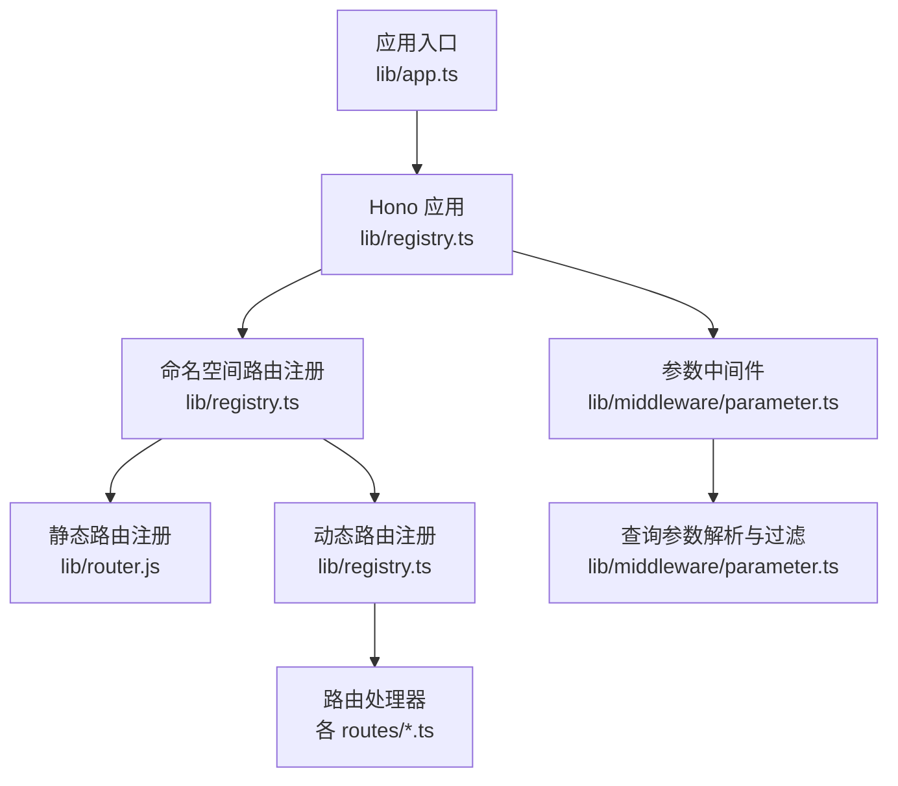
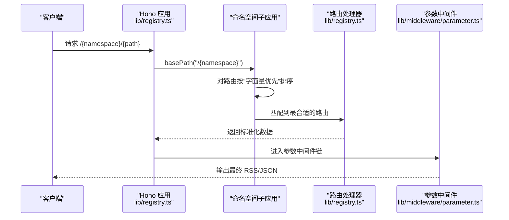
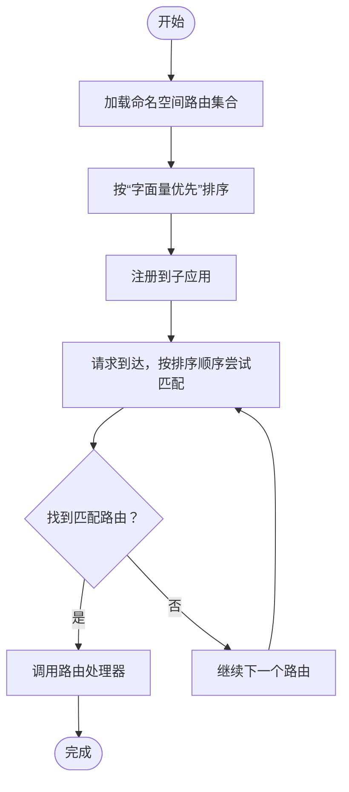
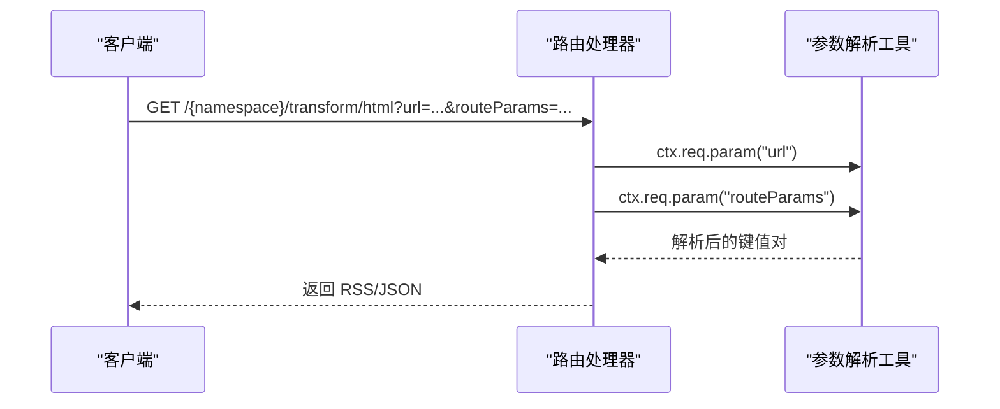
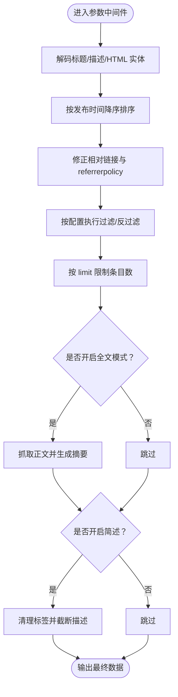
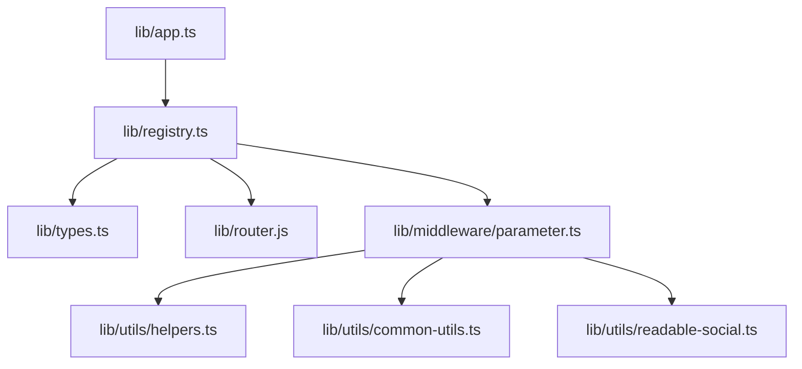

# 路由匹配

<cite>
**本文引用的文件**
- [lib/router.js](file://lib/router.js)
- [lib/registry.ts](file://lib/registry.ts)
- [lib/middleware/parameter.ts](file://lib/middleware/parameter.ts)
- [lib/app.ts](file://lib/app.ts)
- [lib/types.ts](file://lib/types.ts)
- [lib/utils/helpers.ts](file://lib/utils/helpers.ts)
- [lib/utils/common-utils.ts](file://lib/utils/common-utils.ts)
- [lib/utils/readable-social.ts](file://lib/utils/readable-social.ts)
- [lib/routes/rsshub/transform/html.ts](file://lib/routes/rsshub/transform/html.ts)
- [lib/routes/rsshub/transform/json.ts](file://lib/routes/rsshub/transform/json.ts)
- [lib/routes/voronoiapp/search.ts](file://lib/routes/voronoiapp/search.ts)
- [lib/api/radar/rules/one.ts](file://lib/api/radar/rules/one.ts)
- [lib/middleware/filter-engine.test.ts](file://lib/middleware/filter-engine.test.ts)
- [scripts/workflow/build-routes.ts](file://scripts/workflow/build-routes.ts)
</cite>

## 目录
1. [简介](#简介)
2. [项目结构](#项目结构)
3. [核心组件](#核心组件)
4. [架构总览](#架构总览)
5. [详细组件分析](#详细组件分析)
6. [依赖关系分析](#依赖关系分析)
7. [性能考量](#性能考量)
8. [故障排查指南](#故障排查指南)
9. [结论](#结论)
10. [附录](#附录)

## 简介
本文件围绕 RSSHub 的路由匹配与参数解析进行深入解析，重点覆盖以下方面：
- 路由注册与匹配：基于 Hono 的路由系统如何注册静态路径与动态参数段，以及匹配顺序与优先级规则。
- 参数提取与解析：如何从路径参数与查询参数中提取数据，以及参数类型转换与默认值处理。
- 参数中间件：参数解析与过滤、排序、限制等后处理流程。
- 性能特征：时间复杂度与内存使用评估，以及潜在的优化方向。
- 冲突解决与最佳匹配：当存在多个候选路由时，如何通过优先级规则选择最佳匹配。
- 复杂场景示例：嵌套路由、通配符参数、条件路由与正则表达式路由的实现方式与注意事项。

## 项目结构
RSSHub 的路由系统主要由三部分组成：
- 路由注册与匹配：Hono 应用在命名空间下注册路由，并对路由进行排序以确保精确匹配优先于参数匹配。
- 路由处理器：每个路由对应一个 handler，负责抓取数据并返回标准化的数据结构。
- 参数中间件：统一处理参数解析、过滤、排序、限制等通用逻辑。

图表来源
- [lib/app.ts](file://lib/app.ts#L1-L6)
- [lib/registry.ts](file://lib/registry.ts#L154-L216)
- [lib/router.js](file://lib/router.js#L1-L120)
- [lib/middleware/parameter.ts](file://lib/middleware/parameter.ts#L67-L429)

章节来源
- [lib/app.ts](file://lib/app.ts#L1-L6)
- [lib/registry.ts](file://lib/registry.ts#L154-L216)
- [lib/router.js](file://lib/router.js#L1-L120)

## 核心组件
- Hono 应用与路由注册：在命名空间下注册路由，对路由路径进行排序，确保“字面量段优先于参数段”的匹配优先级。
- 路由处理器：每个路由定义包含路径、名称、示例、参数说明、特性、雷达规则等元信息，处理器负责产出标准化数据结构。
- 参数中间件：对响应数据进行统一处理，包括解码、排序、链接修正、过滤、限制、全文抓取、AI摘要、简述等。

章节来源
- [lib/registry.ts](file://lib/registry.ts#L154-L216)
- [lib/types.ts](file://lib/types.ts#L259-L371)
- [lib/middleware/parameter.ts](file://lib/middleware/parameter.ts#L67-L429)

## 架构总览
RSSHub 的路由匹配采用“命名空间 + 路径段优先级”的两级结构：
- 命名空间：按命名空间划分路由集合，便于组织与扩展。
- 路由排序：对同一命名空间内的路由进行排序，确保字面量段优先于参数段，从而避免参数段误匹配更具体的静态路径。

图表来源
- [lib/registry.ts](file://lib/registry.ts#L154-L216)
- [lib/middleware/parameter.ts](file://lib/middleware/parameter.ts#L67-L429)

## 详细组件分析

### 路由注册与匹配（lib/registry.ts）
- 命名空间注册：为每个命名空间创建子应用，并将该命名空间下的路由注册到子应用上。
- 路由排序：对路由路径进行排序，比较规则为逐段比较，若某段一个是字面量而另一个是参数，则字面量优先；若前缀段完全相同，则保持相对顺序不变。
- 路由匹配：Hono 在匹配时遵循“最长前缀 + 更具体优先”的原则，结合上述排序可确保静态路径优先于参数路径。

图表来源
- [lib/registry.ts](file://lib/registry.ts#L154-L216)

章节来源
- [lib/registry.ts](file://lib/registry.ts#L154-L216)

### 路由处理器与数据结构（lib/types.ts）
- 路由定义：包含 path、name、example、parameters、features、radar 等字段，用于生成文档与雷达规则。
- 数据结构：统一的 Data 与 DataItem 结构，保证输出的一致性，供参数中间件进行后续处理。

章节来源
- [lib/types.ts](file://lib/types.ts#L259-L371)
- [lib/types.ts](file://lib/types.ts#L31-L100)

### 参数提取与解析（lib/routes/rsshub/transform/html.ts、lib/routes/rsshub/transform/json.ts、lib/routes/voronoiapp/search.ts）
- 路径参数：通过 ctx.req.param() 获取路径参数，例如 /voronoiapp/search/:keyword。
- 查询参数：通过 ctx.req.query() 获取查询参数，例如 /transform/html?url=...&routeParams=...。
- 参数解析：将查询参数字符串解析为 URLSearchParams，再从中提取各个键值，用于驱动处理器行为。

图表来源
- [lib/routes/rsshub/transform/html.ts](file://lib/routes/rsshub/transform/html.ts#L49-L84)
- [lib/routes/rsshub/transform/json.ts](file://lib/routes/rsshub/transform/json.ts#L57-L93)
- [lib/routes/voronoiapp/search.ts](file://lib/routes/voronoiapp/search.ts#L1-L34)

章节来源
- [lib/routes/rsshub/transform/html.ts](file://lib/routes/rsshub/transform/html.ts#L49-L84)
- [lib/routes/rsshub/transform/json.ts](file://lib/routes/rsshub/transform/json.ts#L57-L93)
- [lib/routes/voronoiapp/search.ts](file://lib/routes/voronoiapp/search.ts#L1-L34)

### 参数中间件（lib/middleware/parameter.ts）
参数中间件在路由处理器之后执行，对响应数据进行统一处理，包括但不限于：
- 解码与排序：对标题、描述进行实体解码；按发布时间降序排序。
- 链接修正：将相对链接转换为绝对链接，修正 referrerpolicy。
- 过滤与限制：支持多种过滤引擎（正则/RE2），支持按标题、描述、作者、分类过滤或反向过滤；支持按时间窗口过滤；支持限制条目数量。
- 全文抓取与 AI 摘要：可选模式下抓取正文并生成摘要。
- 简述功能：对描述进行截断与清理。
- 其他增强：Telegram Instant View、Sci-Hub、OpenCC 等。

图表来源
- [lib/middleware/parameter.ts](file://lib/middleware/parameter.ts#L67-L429)

章节来源
- [lib/middleware/parameter.ts](file://lib/middleware/parameter.ts#L67-L429)

### 路由冲突解决与最佳匹配规则
- 优先级规则：字面量段优先于参数段。这意味着 /foo/bar 会优先于 /foo/:id。
- 排序策略：在同一命名空间内，对路由路径进行排序，逐段比较，确保更具体的静态路径排在前面。
- 最佳匹配：Hono 的匹配器会在排序后的列表中按顺序尝试，第一个匹配成功的即为最佳匹配。

章节来源
- [lib/registry.ts](file://lib/registry.ts#L154-L216)

### 复杂路由匹配场景示例
- 嵌套路由：通过 basePath("/namespace") 将路由按命名空间组织，便于管理与扩展。
- 通配符参数：在路径中使用通配符（如 path*）以捕获剩余路径片段，常用于多段参数的场景。
- 条件路由：根据查询参数或环境变量决定是否启用某些功能（如全文模式、Sci-Hub、OpenCC 等）。
- 正则表达式路由：虽然 Hono 默认不支持正则表达式，但可通过参数中间件的过滤引擎（正则/RE2）实现灵活的过滤逻辑。

章节来源
- [lib/router.js](file://lib/router.js#L156-L163)
- [lib/middleware/parameter.ts](file://lib/middleware/parameter.ts#L184-L213)
- [lib/middleware/filter-engine.test.ts](file://lib/middleware/filter-engine.test.ts#L1-L39)

## 依赖关系分析
- 应用入口依赖请求重写器，确保请求在进入应用前完成必要的预处理。
- Hono 应用依赖路由注册模块，后者负责将路由按命名空间与优先级注册到子应用。
- 路由处理器依赖类型定义，确保返回数据结构一致。
- 参数中间件依赖配置与工具函数，用于参数解析、过滤、排序与限制。

图表来源
- [lib/app.ts](file://lib/app.ts#L1-L6)
- [lib/registry.ts](file://lib/registry.ts#L1-L153)
- [lib/types.ts](file://lib/types.ts#L259-L371)
- [lib/router.js](file://lib/router.js#L1-L120)
- [lib/middleware/parameter.ts](file://lib/middleware/parameter.ts#L67-L429)
- [lib/utils/helpers.ts](file://lib/utils/helpers.ts#L1-L43)
- [lib/utils/common-utils.ts](file://lib/utils/common-utils.ts#L1-L48)
- [lib/utils/readable-social.ts](file://lib/utils/readable-social.ts#L1-L56)

章节来源
- [lib/app.ts](file://lib/app.ts#L1-L6)
- [lib/registry.ts](file://lib/registry.ts#L1-L153)
- [lib/types.ts](file://lib/types.ts#L259-L371)
- [lib/router.js](file://lib/router.js#L1-L120)
- [lib/middleware/parameter.ts](file://lib/middleware/parameter.ts#L67-L429)
- [lib/utils/helpers.ts](file://lib/utils/helpers.ts#L1-L43)
- [lib/utils/common-utils.ts](file://lib/utils/common-utils.ts#L1-L48)
- [lib/utils/readable-social.ts](file://lib/utils/readable-social.ts#L1-L56)

## 性能考量
- 时间复杂度
  - 路由注册阶段：对每个命名空间内的路由进行排序，排序复杂度为 O(N log N)，其中 N 为该命名空间路由数量。
  - 路由匹配阶段：Hono 的匹配器通常为线性扫描，但由于已按“字面量优先”排序，命中静态路径时可快速短路，平均情况下接近 O(M)，M 为该命名空间内候选路由数量。
  - 参数中间件：对每条 RSS 条目执行统一处理，整体复杂度为 O(K)，K 为条目数量。
- 内存使用
  - 路由注册：仅保存路由路径与处理器引用，内存占用与路由数量线性相关。
  - 参数中间件：在过滤、全文抓取、AI 摘要等场景可能产生额外内存开销，建议合理设置 limit 与过滤条件以控制规模。
- 优化建议
  - 合理组织命名空间，减少单命名空间内路由数量。
  - 使用更具体的静态路径替代参数路径，提升匹配效率。
  - 控制查询参数的复杂度，避免过长的过滤表达式导致 RE2 匹配耗时增加。

[本节为通用性能讨论，不直接分析具体文件]

## 故障排查指南
- 路由未命中或误命中
  - 检查是否存在更具体的静态路径被参数路径覆盖。可通过“字面量优先”排序确认。
  - 确认路径段顺序与参数位置是否正确。
- 过滤引擎异常
  - 若使用 RE2 引擎，注意避免 ReDoS 表达式；可切换到正则引擎或调整表达式。
- 参数解析错误
  - 确认路径参数与查询参数的键名与类型是否正确。
  - 对于数组类查询参数，注意中间件的解析与默认值处理。

章节来源
- [lib/middleware/filter-engine.test.ts](file://lib/middleware/filter-engine.test.ts#L1-L39)
- [lib/utils/readable-social.ts](file://lib/utils/readable-social.ts#L1-L56)
- [lib/utils/helpers.ts](file://lib/utils/helpers.ts#L1-L43)

## 结论
RSSHub 的路由匹配体系以 Hono 为基础，结合“字面量优先”的排序策略，实现了高效且可维护的路由匹配。参数中间件进一步提供了强大的参数解析与后处理能力，满足多样化的订阅需求。通过合理的命名空间组织与静态路径设计，可以在保证性能的同时提升可维护性与可扩展性。

[本节为总结性内容，不直接分析具体文件]

## 附录
- 路由路径类型生成：构建脚本会生成路由路径类型文件，便于类型安全与文档生成。
- 雷达规则：API 提供按域名获取雷达规则的能力，便于前端集成与自动化订阅。

章节来源
- [scripts/workflow/build-routes.ts](file://scripts/workflow/build-routes.ts#L112-L127)
- [lib/api/radar/rules/one.ts](file://lib/api/radar/rules/one.ts#L35-L74)