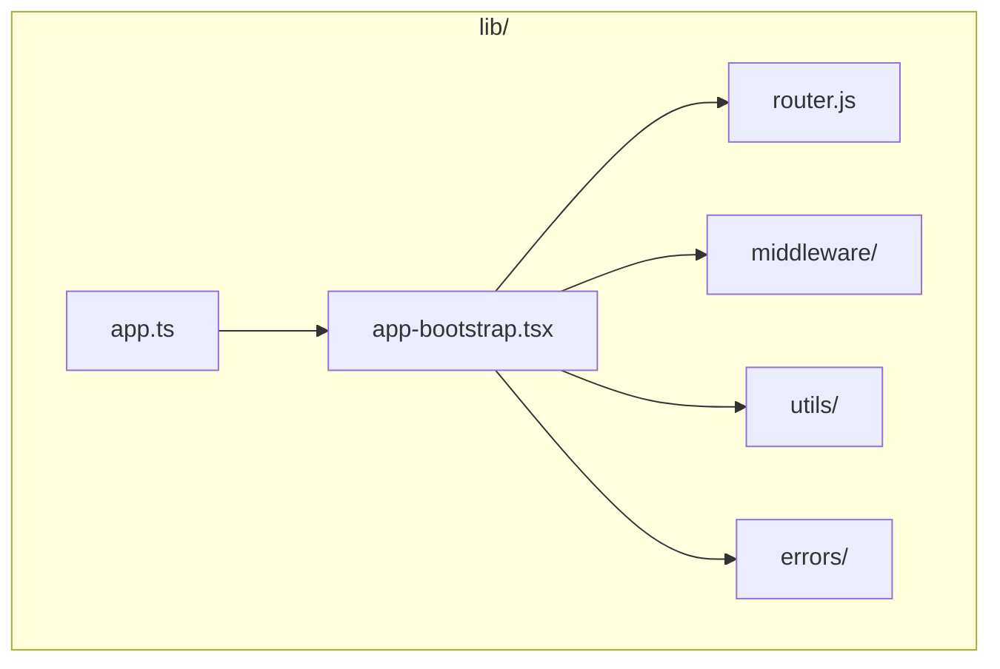
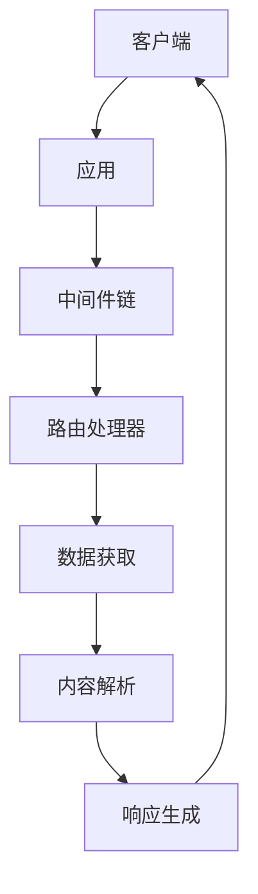
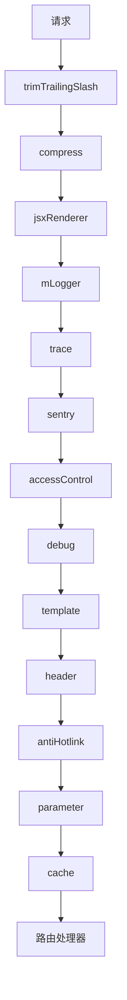
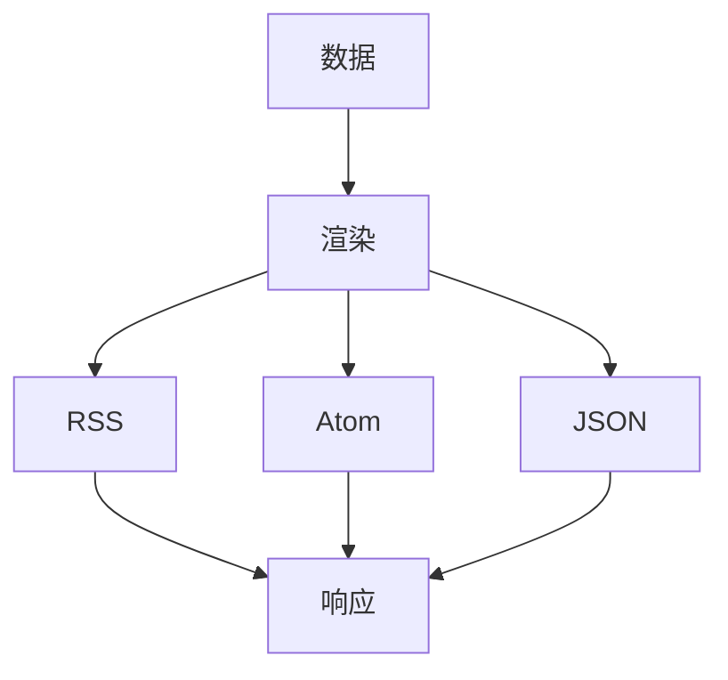
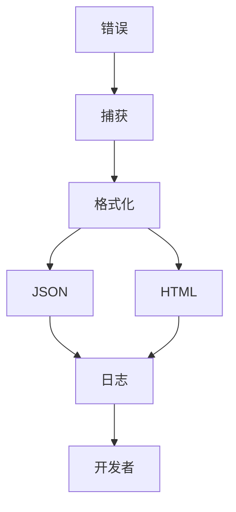
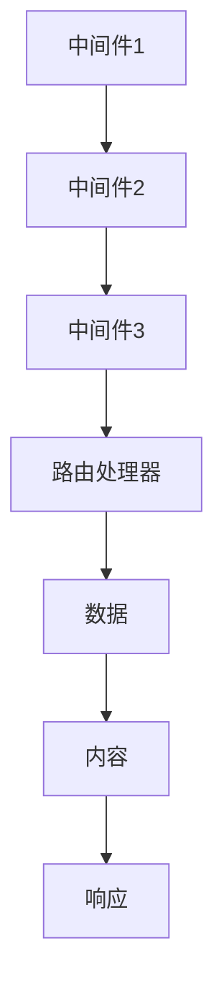

# 路由处理

<cite>
**本文档中引用的文件**  
- [app.ts](file://lib/app.ts)
- [app-bootstrap.tsx](file://lib/app-bootstrap.tsx)
- [router.js](file://lib/router.js)
- [cache.ts](file://lib/middleware/cache.ts)
- [logger.ts](file://lib/middleware/logger.ts)
- [debug.ts](file://lib/middleware/debug.ts)
- [header.ts](file://lib/middleware/header.ts)
- [parameter.ts](file://lib/middleware/parameter.ts)
- [access-control.ts](file://lib/middleware/access-control.ts)
- [render.ts](file://lib/utils/render.ts)
- [index.tsx](file://lib/errors/index.tsx)
- [index.ts](file://lib/utils/cache/index.ts)
- [template.tsx](file://lib/middleware/template.tsx)
</cite>

## 目录
1. [简介](#简介)
2. [项目结构](#项目结构)
3. [核心组件](#核心组件)
4. [架构概述](#架构概述)
5. [详细组件分析](#详细组件分析)
6. [依赖分析](#依赖分析)
7. [性能考虑](#性能考虑)
8. [故障排除指南](#故障排除指南)
9. [结论](#结论)

## 简介
RSSHub 是一个基于 Node.js 的轻量级 RSS 生成器，能够为各种网站和在线资源提供 RSS 订阅支持。其路由处理流程是整个系统的核心，负责处理用户请求、获取数据、生成内容并返回响应。本文档将全面阐述 RSSHub 的路由处理流程，从请求进入开始，详细描述路由处理的完整生命周期。

## 项目结构
RSSHub 的项目结构清晰，主要分为以下几个目录：
- `assets/`: 静态资源文件
- `eslint-plugins/`: ESLint 插件
- `lib/`: 核心代码库
- `patches/`: 补丁文件
- `plugins/`: 插件
- `scripts/`: 脚本文件

其中，`lib/` 目录是核心代码库，包含了路由处理、中间件、错误处理等关键组件。

**图表来源**
- [app.ts](file://lib/app.ts)
- [app-bootstrap.tsx](file://lib/app-bootstrap.tsx)
- [router.js](file://lib/router.js)

**章节来源**
- [app.ts](file://lib/app.ts)
- [app-bootstrap.tsx](file://lib/app-bootstrap.tsx)
- [router.js](file://lib/router.js)

## 核心组件
RSSHub 的核心组件包括路由处理、中间件链、数据获取、内容解析和响应生成。这些组件协同工作，确保用户请求能够被正确处理并返回相应的 RSS 内容。

**章节来源**
- [app-bootstrap.tsx](file://lib/app-bootstrap.tsx)
- [router.js](file://lib/router.js)

## 架构概述
RSSHub 的架构基于 Koa 框架，使用 Hono 作为路由处理器。整个系统通过中间件链来处理请求，每个中间件负责特定的任务，如日志记录、缓存、参数处理等。

**图表来源**
- [app-bootstrap.tsx](file://lib/app-bootstrap.tsx)
- [router.js](file://lib/router.js)

## 详细组件分析

### 路由处理分析
RSSHub 的路由处理流程从请求进入开始，经过中间件链的处理，最终生成并返回 RSS 内容。以下是详细的处理流程：

#### 中间件链执行顺序
RSSHub 的中间件链按照以下顺序执行：
1. `trimTrailingSlash`: 去除路径末尾的斜杠
2. `compress`: 压缩响应内容
3. `jsxRenderer`: 设置 JSX 渲染器
4. `mLogger`: 日志记录
5. `trace`: 跟踪请求
6. `sentry`: 错误报告
7. `accessControl`: 访问控制
8. `debug`: 调试信息
9. `template`: 模板处理
10. `header`: 设置响应头
11. `antiHotlink`: 防盗链
12. `parameter`: 参数处理
13. `cache`: 缓存处理

**图表来源**
- [app-bootstrap.tsx](file://lib/app-bootstrap.tsx)

**章节来源**
- [app-bootstrap.tsx](file://lib/app-bootstrap.tsx)

#### 数据获取与内容解析
在路由处理器中，系统会根据请求路径加载相应的路由处理文件，并执行数据获取和内容解析。数据获取通常涉及网络请求，如 HTTP 请求或数据库查询。内容解析则包括 HTML 解析、JSON 解析等。

**章节来源**
- [router.js](file://lib/router.js)

#### 响应生成
响应生成是路由处理的最后一步，系统会根据请求的格式参数（如 `format=rss` 或 `format=json`）生成相应的响应内容。`lib/utils/render.ts` 文件中定义了不同格式的渲染器，如 RSS、Atom、JSON 等。

**图表来源**
- [render.ts](file://lib/utils/render.ts)

**章节来源**
- [render.ts](file://lib/utils/render.ts)

### 错误处理机制
RSSHub 的错误处理机制包括异常捕获、错误响应格式化和日志记录。当请求处理过程中发生错误时，系统会捕获异常并返回相应的错误响应。

#### 异常捕获
系统通过 `try-catch` 语句捕获异常，并在 `errorHandler` 中处理。不同的错误类型会返回不同的 HTTP 状态码，如 403（拒绝访问）、404（未找到）和 503（服务不可用）。

#### 错误响应格式化
错误响应会根据请求的格式参数进行格式化。如果请求的是 JSON 格式，系统会返回 JSON 格式的错误信息；否则，返回 HTML 格式的错误页面。

#### 日志记录
系统会记录所有错误信息，包括错误类型、错误消息和请求路径。这些日志信息有助于开发者诊断和修复问题。

**图表来源**
- [index.tsx](file://lib/errors/index.tsx)

**章节来源**
- [index.tsx](file://lib/errors/index.tsx)

## 依赖分析
RSSHub 的依赖关系主要体现在中间件链和路由处理器之间的调用。每个中间件都依赖于前一个中间件的输出，并将结果传递给下一个中间件。路由处理器依赖于中间件链提供的数据和上下文。

**图表来源**
- [app-bootstrap.tsx](file://lib/app-bootstrap.tsx)
- [router.js](file://lib/router.js)

**章节来源**
- [app-bootstrap.tsx](file://lib/app-bootstrap.tsx)
- [router.js](file://lib/router.js)

## 性能考虑
RSSHub 在性能优化方面采取了多种策略，如缓存机制和异步处理。

#### 缓存机制
系统使用 Redis 或内存缓存来存储已生成的 RSS 内容。当相同的请求再次到达时，系统可以直接从缓存中读取内容，避免重复的数据获取和内容解析。

#### 异步处理
系统使用异步处理来提高性能。例如，在数据获取过程中，系统会并发地发起多个网络请求，以减少总的处理时间。

**章节来源**
- [cache.ts](file://lib/middleware/cache.ts)
- [parameter.ts](file://lib/middleware/parameter.ts)

## 故障排除指南
当 RSSHub 出现问题时，可以通过以下步骤进行故障排除：
1. 检查日志文件，查看是否有错误信息。
2. 确认请求路径是否正确。
3. 检查中间件链的配置，确保所有中间件都正常工作。
4. 确认缓存配置是否正确，避免缓存导致的问题。

**章节来源**
- [errors/index.tsx](file://lib/errors/index.tsx)
- [logger.ts](file://lib/middleware/logger.ts)

## 结论
RSSHub 的路由处理流程是一个复杂但高效的系统，通过中间件链、数据获取、内容解析和响应生成等多个组件协同工作，为用户提供高质量的 RSS 订阅服务。通过深入理解这一流程，开发者可以更好地维护和优化系统，确保其稳定运行。