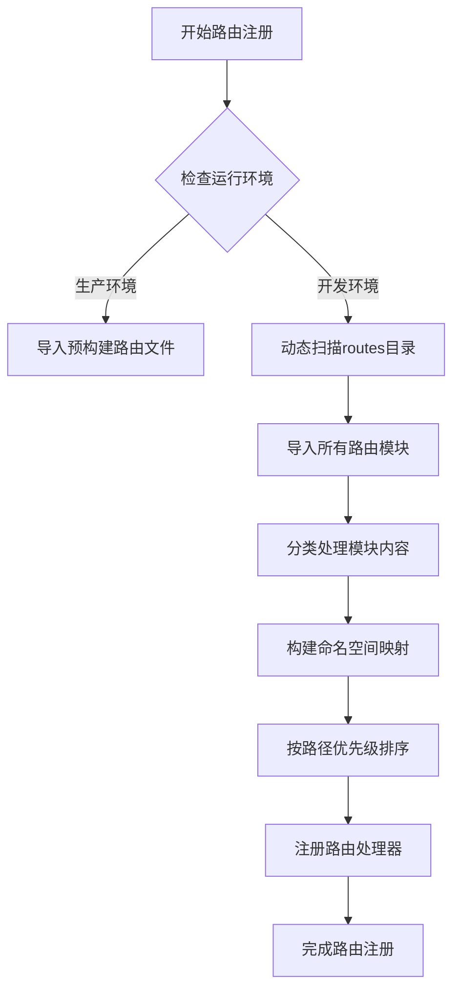
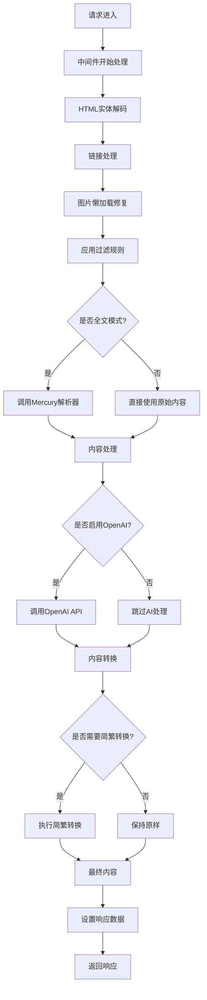
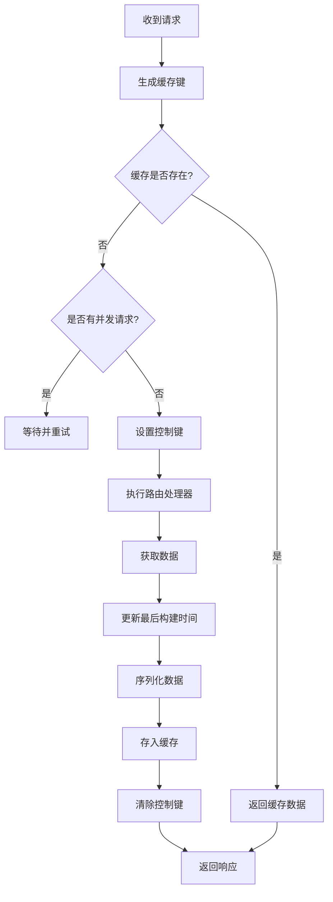
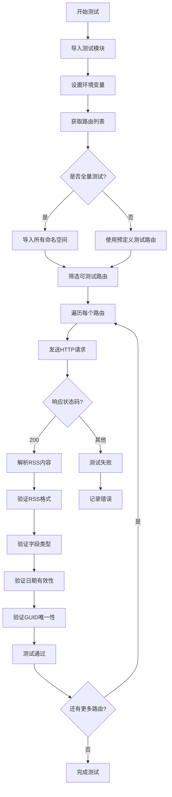

# 路由开发指南

<cite>
**本文档中引用的文件**   
- [README.md](file://README.md)
- [CONTRIBUTING.md](file://CONTRIBUTING.md)
- [lib/router.js](file://lib/router.js)
- [lib/config.ts](file://lib/config.ts)
- [lib/registry.ts](file://lib/registry.ts)
- [lib/types.ts](file://lib/types.ts)
- [lib/middleware/parameter.ts](file://lib/middleware/parameter.ts)
- [lib/middleware/cache.ts](file://lib/middleware/cache.ts)
- [lib/utils/ofetch.ts](file://lib/utils/ofetch.ts)
- [lib/utils/cache/index.ts](file://lib/utils/cache/index.ts)
</cite>

## 目录
1. [简介](#简介)
2. [环境设置](#环境设置)
3. [路由代码结构](#路由代码结构)
4. [路由注册机制](#路由注册机制)
5. [数据处理与中间件](#数据处理与中间件)
6. [网络请求与缓存](#网络请求与缓存)
7. [不同类型源内容的处理](#不同类型源内容的处理)
8. [错误处理与最佳实践](#错误处理与最佳实践)
9. [测试方法](#测试方法)
10. [常见问题解决方案](#常见问题解决方案)

## 简介

RSSHub 是一个开源的 RSS 生成器，旨在为各种网站和在线服务提供 RSS 订阅功能。本指南将详细介绍如何从零开始创建新的 RSSHub 路由，包括环境设置、代码结构、最佳实践以及常见问题的解决方案。

RSSHub 的核心目标是让所有内容都可订阅（Everything is RSSible），通过创建路由来抓取和转换各种来源的内容为 RSS 格式。路由开发是 RSSHub 的核心功能之一，开发者可以通过编写路由来支持新的网站和服务。

**Section sources**
- [README.md](file://README.md#L1-L62)

## 环境设置

要开始开发 RSSHub 路由，首先需要设置开发环境。这包括克隆代码库、安装依赖和配置必要的环境变量。

首先，克隆 RSSHub 代码库并安装依赖：

```bash
git clone https://github.com/DIYgod/RSSHub.git
cd RSSHub
pnpm install
```

RSSHub 使用 pnpm 作为包管理器，因此需要安装 pnpm。然后，可以通过以下命令启动开发服务器：

```bash
pnpm dev
```

环境变量配置是路由开发的重要部分。在 `lib/config.ts` 文件中定义了各种配置选项，包括网络、缓存、代理和特定于路由的配置。这些配置可以通过环境变量进行覆盖。

关键的环境变量包括：
- `PORT`: 服务器监听的端口，默认为 1200
- `CACHE_TYPE`: 缓存类型，支持 'memory' 和 'redis'
- `REQUEST_RETRY`: 请求失败重试次数
- `REQUEST_TIMEOUT`: 请求超时时间（毫秒）
- `PROXY_URI`: 代理服务器地址

对于需要认证的路由，还需要设置相应的环境变量，如 `GITHUB_ACCESS_TOKEN`、`WEIBO_COOKIES` 等。

**Section sources**
- [lib/config.ts](file://lib/config.ts#L1-L800)
- [README.md](file://README.md#L38-L40)

## 路由代码结构

RSSHub 路由的代码结构遵循一定的模式，位于 `lib/routes` 目录下。每个路由通常包含一个或多个 TypeScript 文件，定义了路由的路径、处理器函数和相关配置。

路由的基本结构包括：
1. 路径定义：使用 Hono 路由语法定义 URL 路径
2. 处理器函数：处理请求并返回数据的核心函数
3. 配置对象：包含路由的元数据，如名称、描述、参数等

在 `lib/types.ts` 文件中定义了路由相关的类型，包括 `Route`、`Data` 和 `DataItem` 等接口。这些类型确保了路由实现的一致性和类型安全。

`Route` 接口定义了路由的基本属性：
- `path`: 路由路径，支持字符串或字符串数组
- `name`: 路由的名称
- `url`: 对应网站的 URL
- `maintainers`: 维护者列表
- `handler`: 处理器函数
- `example`: 示例 URL
- `parameters`: 参数描述
- `description`: 详细描述
- `categories`: 分类
- `features`: 特性，如是否需要 Puppeteer、反爬虫机制等

**Section sources**
- [lib/types.ts](file://lib/types.ts#L1-L464)
- [lib/routes](file://lib/routes)

## 路由注册机制

RSSHub 使用动态路由注册机制，通过 `lib/registry.ts` 文件中的代码实现。这种机制允许在运行时动态加载和注册路由，提高了系统的灵活性和可扩展性。

路由注册的核心是 `directoryImport` 函数，它会扫描 `lib/routes` 目录并导入所有路由模块。注册过程如下：

1. 检查运行环境，决定是否使用预构建的路由文件或动态导入
2. 扫描 `lib/routes` 目录，导入所有路由模块
3. 根据模块内容（namespace、route 或 apiRoute）进行分类和注册
4. 构建命名空间和路由的映射关系

路由注册还支持按命名空间组织路由。每个命名空间可以包含多个路由，通过 `namespace` 属性进行分组。这种结构使得路由管理更加有序，便于维护和扩展。

在 `lib/registry.ts` 中，路由按照路径的字面量优先级进行排序，确保更具体的路径优先匹配。排序规则是：字面量段优先于参数段，较短路径优先于较长路径。



**Diagram sources**
- [lib/registry.ts](file://lib/registry.ts#L1-L272)
- [lib/router.js](file://lib/router.js#L1-L800)

**Section sources**
- [lib/registry.ts](file://lib/registry.ts#L1-L272)
- [lib/router.js](file://lib/router.js#L1-L800)

## 数据处理与中间件

RSSHub 使用中间件机制来处理请求和响应数据。中间件在路由处理器执行前后进行数据处理，确保输出的一致性和质量。

`lib/middleware/parameter.ts` 文件中的中间件负责处理各种参数和数据转换。主要功能包括：

1. **HTML 实体解码**：对标题和描述中的 HTML 实体进行解码
2. **链接处理**：解析相对链接，确保所有链接都是绝对 URL
3. **图片懒加载处理**：修复图片的懒加载问题，确保图片能够正确显示
4. **过滤功能**：支持基于正则表达式的过滤，包括标题、描述、作者和分类的过滤
5. **全文获取**：通过 Mercury 解析器获取文章的全文内容
6. **OpenAI 集成**：使用 OpenAI API 对标题或描述进行智能处理
7. **简体繁体转换**：支持简体和繁体中文的转换
8. **摘要生成**：生成内容摘要

中间件还处理各种查询参数，如 `limit`（限制条目数量）、`sorted`（排序）、`mode=fulltext`（全文模式）等。这些参数使得用户可以灵活地定制输出内容。



**Diagram sources**
- [lib/middleware/parameter.ts](file://lib/middleware/parameter.ts#L1-L429)

**Section sources**
- [lib/middleware/parameter.ts](file://lib/middleware/parameter.ts#L1-L429)

## 网络请求与缓存

RSSHub 使用 `ofetch` 库进行网络请求，并实现了完善的缓存机制来提高性能和减少服务器负载。

`lib/utils/ofetch.ts` 文件中封装了网络请求功能，提供了以下特性：
- 自动重试机制：对特定状态码（如 400, 408, 429, 500 等）进行重试
- 重试次数和延迟配置
- 错误处理和日志记录
- 响应重定向处理

缓存机制在 `lib/middleware/cache.ts` 中实现，主要特点包括：
- 支持内存缓存和 Redis 缓存
- 缓存键使用 XXH64 哈希算法生成，确保键的唯一性和长度控制
- 并发请求控制，避免同一路径的重复请求
- 缓存过期时间配置

缓存流程如下：
1. 生成缓存键，基于请求路径、格式和限制参数
2. 检查缓存是否存在，如果存在则直接返回缓存数据
3. 如果缓存不存在，设置控制键防止并发请求
4. 执行路由处理器获取数据
5. 将数据存入缓存，设置过期时间
6. 清除控制键，允许后续请求



**Diagram sources**
- [lib/utils/ofetch.ts](file://lib/utils/ofetch.ts#L1-L45)
- [lib/middleware/cache.ts](file://lib/middleware/cache.ts#L1-L84)
- [lib/utils/cache/index.ts](file://lib/utils/cache/index.ts#L1-L101)

**Section sources**
- [lib/utils/ofetch.ts](file://lib/utils/ofetch.ts#L1-L45)
- [lib/middleware/cache.ts](file://lib/middleware/cache.ts#L1-L84)
- [lib/utils/cache/index.ts](file://lib/utils/cache/index.ts#L1-L101)

## 不同类型源内容的处理

RSSHub 需要处理各种类型的源内容，包括 HTML 页面、JSON API 和需要浏览器渲染的内容。每种类型都有相应的处理策略和工具。

### HTML 页面处理

对于 HTML 页面，通常使用 Cheerio 库进行解析。Cheerio 提供了类似 jQuery 的 API，可以方便地选择和操作 DOM 元素。

处理步骤：
1. 使用 `ofetch` 获取 HTML 内容
2. 使用 Cheerio 加载 HTML
3. 选择需要的元素并提取数据
4. 处理相对链接和图片懒加载
5. 生成 RSS 项

### JSON API 处理

对于 JSON API，直接解析返回的 JSON 数据即可。通常需要处理分页、认证和错误响应。

处理步骤：
1. 构造 API 请求，包括必要的认证信息
2. 发送请求并获取 JSON 响应
3. 解析 JSON 数据，提取所需信息
4. 转换为 RSS 格式

### 浏览器渲染内容处理

对于需要 JavaScript 渲染的页面，使用 Puppeteer 进行处理。Puppeteer 可以启动一个无头浏览器实例来渲染页面。

在 `lib/config.ts` 中配置 Puppeteer 相关选项：
- `PUPPETEER_WS_ENDPOINT`: Puppeteer WebSocket 端点
- `CHROMIUM_EXECUTABLE_PATH`: Chromium 可执行文件路径

使用 Puppeteer 的步骤：
1. 启动浏览器实例或连接到现有实例
2. 创建新页面
3. 导航到目标 URL
4. 等待页面加载完成
5. 执行 JavaScript 提取数据
6. 关闭页面

### 特殊内容类型

RSSHub 还支持处理特殊内容类型，如：
- **PDF 文档**：通过解析 PDF 链接生成 RSS
- **视频内容**：提取视频信息和缩略图
- **播客**：支持音频附件和 iTunes 元数据
- **BitTorrent**：支持种子文件链接

**Section sources**
- [lib/utils/ofetch.ts](file://lib/utils/ofetch.ts#L1-L45)
- [lib/middleware/parameter.ts](file://lib/middleware/parameter.ts#L1-L429)
- [lib/config.ts](file://lib/config.ts#L1-L800)

## 错误处理与最佳实践

良好的错误处理是路由开发的关键。RSSHub 提供了完善的错误处理机制和最佳实践指南。

### 错误处理

路由处理器应该妥善处理各种可能的错误情况：
- 网络请求失败
- 数据解析错误
- 认证失败
- 反爬虫机制触发

在 `lib/errors/types/` 目录下定义了各种错误类型，如 `RequestInProgressError`。这些错误类型确保了错误信息的一致性和可追溯性。

最佳实践包括：
- 使用 `try-catch` 块捕获异步操作中的错误
- 提供有意义的错误消息
- 记录错误日志以便调试
- 在生产环境中避免暴露敏感信息

### 代码组织

良好的代码组织有助于维护和扩展：
- 按功能模块组织代码
- 使用清晰的变量和函数命名
- 添加详细的注释和文档
- 遵循一致的代码风格

### 性能优化

性能优化是路由开发的重要考虑因素：
- 合理设置缓存过期时间
- 避免不必要的网络请求
- 使用流式处理大文件
- 优化数据解析算法

### 安全性

安全性是不可忽视的方面：
- 验证用户输入
- 防止 XSS 攻击
- 正确处理敏感信息
- 遵守目标网站的使用条款

**Section sources**
- [lib/errors/types/](file://lib/errors/types/)
- [lib/middleware/parameter.ts](file://lib/middleware/parameter.ts#L1-L429)
- [lib/utils/logger.ts](file://lib/utils/logger.ts)

## 测试方法

RSSHub 提供了完善的测试框架来确保路由的正确性和稳定性。测试主要在 `lib/routes.test.ts` 文件中实现。

测试流程：
1. 导入必要的模块和配置
2. 定义测试路由和示例 URL
3. 使用 Vitest 框架进行并发测试
4. 验证响应状态码和 RSS 格式

测试内容包括：
- 响应状态码是否为 200
- RSS 格式是否正确
- 必需字段是否存在且类型正确
- 发布日期是否合理
- GUID 是否唯一

测试配置可以通过环境变量 `FULL_ROUTES_TEST` 控制是否运行完整测试。在 CI/CD 环境中，通常只测试有示例的路由。



**Diagram sources**
- [lib/routes.test.ts](file://lib/routes.test.ts#L1-L87)

**Section sources**
- [lib/routes.test.ts](file://lib/routes.test.ts#L1-L87)

## 常见问题解决方案

在路由开发过程中，经常会遇到各种问题。以下是常见问题及其解决方案。

### 反爬虫策略

许多网站都有反爬虫机制，常见的解决方案包括：
- 设置合理的 User-Agent
- 添加请求间隔
- 使用代理服务器
- 模拟浏览器行为
- 处理验证码

在 `lib/config.ts` 中配置代理相关选项可以有效应对 IP 封禁问题。

### 认证机制

对于需要登录的网站，有几种认证方式：
- Cookie 认证：通过环境变量传递 Cookie
- Token 认证：使用 API Token
- OAuth 认证：实现 OAuth 流程

在 `lib/config.ts` 中定义了大量特定于路由的认证配置，如 `GITHUB_ACCESS_TOKEN`、`WEIBO_COOKIES` 等。

### 数据解析技巧

数据解析是路由开发的核心，常见技巧包括：
- 使用正则表达式提取复杂模式
- 处理动态生成的内容
- 解析 JSONP 响应
- 处理编码问题

### 调试技巧

有效的调试方法包括：
- 启用详细日志
- 使用远程调试
- 逐步执行代码
- 检查网络请求

在开发环境中，可以通过设置 `DEBUG_INFO` 环境变量来启用调试信息。

**Section sources**
- [lib/config.ts](file://lib/config.ts#L1-L800)
- [lib/middleware/parameter.ts](file://lib/middleware/parameter.ts#L1-L429)
- [lib/utils/logger.ts](file://lib/utils/logger.ts)