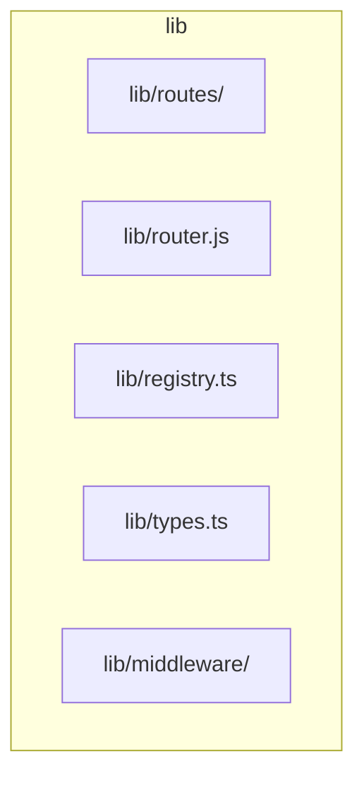
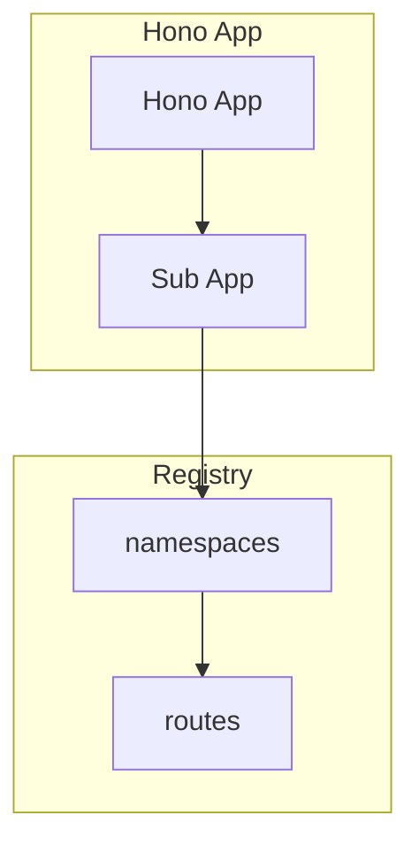
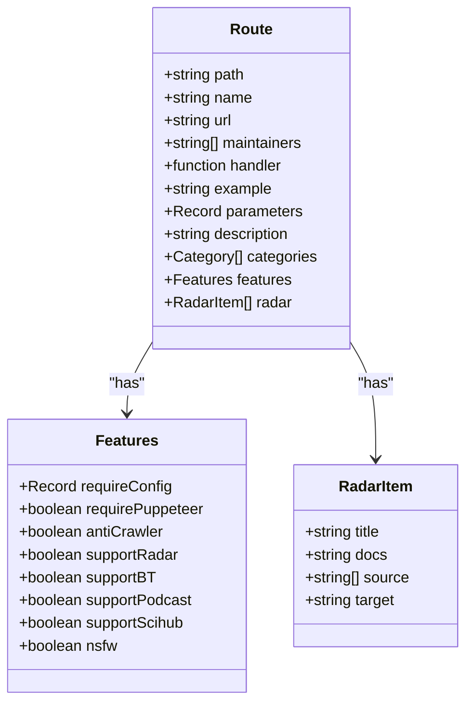
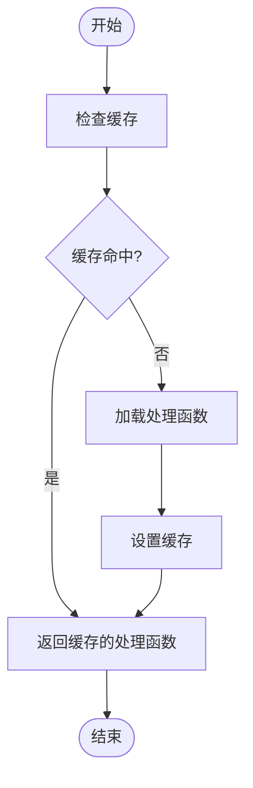
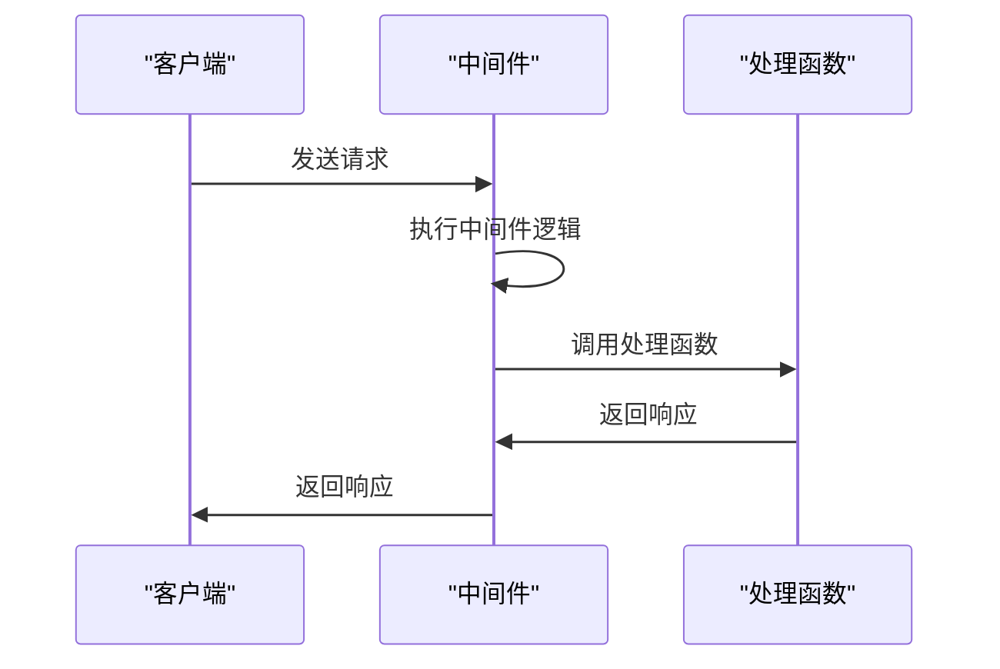
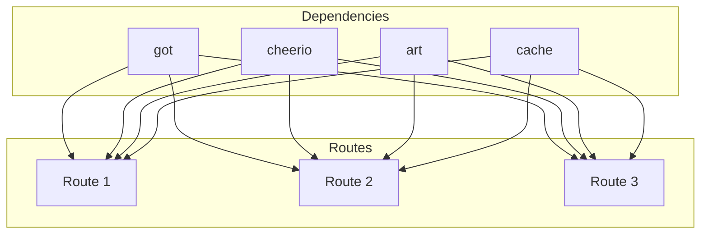

# 路由注册

<cite>
**本文档中引用的文件**  
- [router.js](file://lib/router.js)
- [registry.ts](file://lib/registry.ts)
- [types.ts](file://lib/types.ts)
- [index.ts](file://lib/routes/005/index.ts)
- [index.ts](file://lib/routes/36kr/index.ts)
- [index.ts](file://lib/routes/423down/index.ts)
- [app-bootstrap.tsx](file://lib/app-bootstrap.tsx)
- [logger.ts](file://lib/middleware/logger.ts)
</cite>

## 目录
1. [引言](#引言)
2. [项目结构](#项目结构)
3. [核心组件](#核心组件)
4. [架构概述](#架构概述)
5. [详细组件分析](#详细组件分析)
6. [依赖分析](#依赖分析)
7. [性能考虑](#性能考虑)
8. [故障排除指南](#故障排除指南)
9. [结论](#结论)

## 引言
RSSHub 是一个开源的 RSS 聚合工具，其路由注册机制是整个系统的核心部分。本文档深入分析了 RSSHub 的路由注册机制，包括路由模块的定义与组织、路由注册的实现原理、最佳实践以及不同类型的路由示例。

## 项目结构
RSSHub 的项目结构清晰，主要分为以下几个部分：
- `lib/routes/`：存放所有路由模块
- `lib/router.js`：路由注册的核心文件
- `lib/registry.ts`：路由注册表
- `lib/types.ts`：类型定义
- `lib/middleware/`：中间件



**图表来源**
- [router.js](file://lib/router.js#L1-L800)
- [registry.ts](file://lib/registry.ts#L1-L272)
- [types.ts](file://lib/types.ts#L1-L464)

**章节来源**
- [router.js](file://lib/router.js#L1-L800)
- [registry.ts](file://lib/registry.ts#L1-L272)

## 核心组件
RSSHub 的核心组件包括路由注册、中间件链式调用和依赖注入。这些组件共同构成了 RSSHub 的基础架构。

**章节来源**
- [router.js](file://lib/router.js#L1-L800)
- [registry.ts](file://lib/registry.ts#L1-L272)

## 架构概述
RSSHub 的架构基于 Hono 框架，使用 Koa 风格的中间件和路由系统。路由注册通过 `lib/registry.ts` 文件中的 `namespaces` 对象进行管理，每个命名空间包含一组路由。



**图表来源**
- [registry.ts](file://lib/registry.ts#L1-L272)
- [app-bootstrap.tsx](file://lib/app-bootstrap.tsx#L1-L54)

## 详细组件分析

### 路由模块定义与组织
在 `lib/routes/` 目录中，每个路由模块都以命名空间为单位进行组织。例如，`lib/routes/005/index.ts` 定义了 `005` 命名空间下的路由。

#### 路由模块示例


**图表来源**
- [types.ts](file://lib/types.ts#L259-L464)
- [index.ts](file://lib/routes/005/index.ts#L1-L156)

### 路由注册实现原理
`lib/router.js` 中的 `lazyloadRouteHandler` 函数实现了路由的懒加载。当路由首次被请求时，才会加载对应的处理函数。

#### 路由注册流程


**图表来源**
- [router.js](file://lib/router.js#L8-L16)
- [registry.ts](file://lib/registry.ts#L195-L214)

### 最佳实践
#### 命名规范
- 路由路径应简洁明了
- 参数命名应具有描述性
- 避免使用特殊字符

#### 错误处理
- 使用 `try-catch` 捕获异常
- 返回适当的 HTTP 状态码
- 记录错误日志

#### 文档注释
- 为每个路由提供详细的描述
- 包含示例 URL
- 说明参数和返回值

**章节来源**
- [index.ts](file://lib/routes/005/index.ts#L101-L155)
- [index.ts](file://lib/routes/36kr/index.ts#L20-L35)

### 路由示例
#### 静态路由
```typescript
router.get('/benedictevans', lazyloadRouteHandler('./routes/benedictevans/recent.js'));
```

#### 动态参数路由
```typescript
router.get('/disqus/posts/:forum', lazyloadRouteHandler('./routes/disqus/posts'));
```

#### 通配符路由
```typescript
router.get('/cqu/jwc/:path*', lazyloadRouteHandler('./routes/universities/cqu/jwc/announcement'));
```

**章节来源**
- [router.js](file://lib/router.js#L21-L157)

### 依赖注入与中间件链式调用
RSSHub 使用 Hono 的中间件机制实现依赖注入和链式调用。中间件按顺序执行，每个中间件可以修改请求或响应对象。

#### 中间件调用流程


**图表来源**
- [app-bootstrap.tsx](file://lib/app-bootstrap.tsx#L30-L45)
- [logger.ts](file://lib/middleware/logger.ts#L1-L46)

## 依赖分析
RSSHub 的依赖关系主要体现在路由模块之间的相互引用和中间件的链式调用上。



**图表来源**
- [index.ts](file://lib/routes/005/index.ts#L1-L156)
- [index.ts](file://lib/routes/36kr/index.ts#L1-L77)
- [index.ts](file://lib/routes/423down/index.ts#L1-L280)

**章节来源**
- [index.ts](file://lib/routes/005/index.ts#L1-L156)
- [index.ts](file://lib/routes/36kr/index.ts#L1-L77)
- [index.ts](file://lib/routes/423down/index.ts#L1-L280)

## 性能考虑
- 使用懒加载减少启动时间
- 缓存处理函数提高响应速度
- 优化中间件执行顺序

## 故障排除指南
- 检查路由路径是否正确
- 确认处理函数是否正确加载
- 查看日志文件获取错误信息

**章节来源**
- [logger.ts](file://lib/middleware/logger.ts#L1-L46)
- [registry.ts](file://lib/registry.ts#L195-L214)

## 结论
RSSHub 的路由注册机制设计精巧，通过懒加载、中间件链式调用和依赖注入等技术，实现了高效、灵活的路由管理。开发者应遵循最佳实践，确保路由模块的可维护性和扩展性。