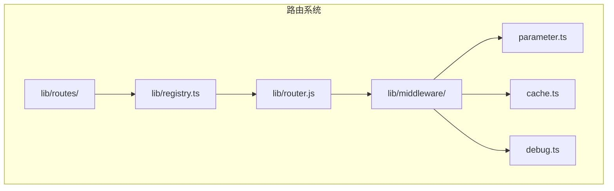
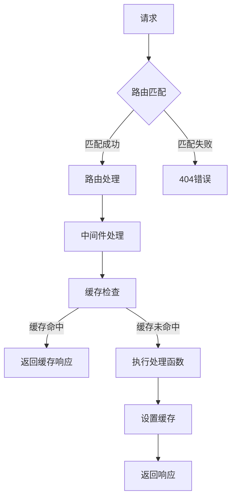
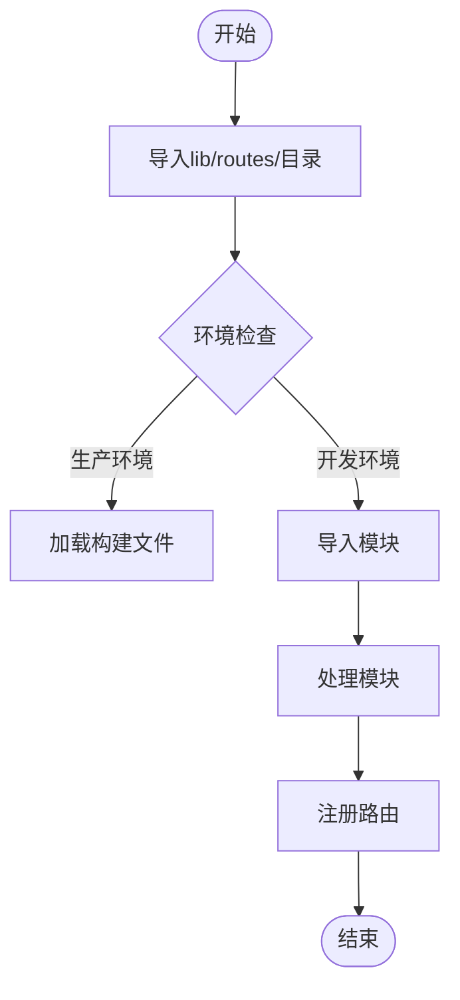
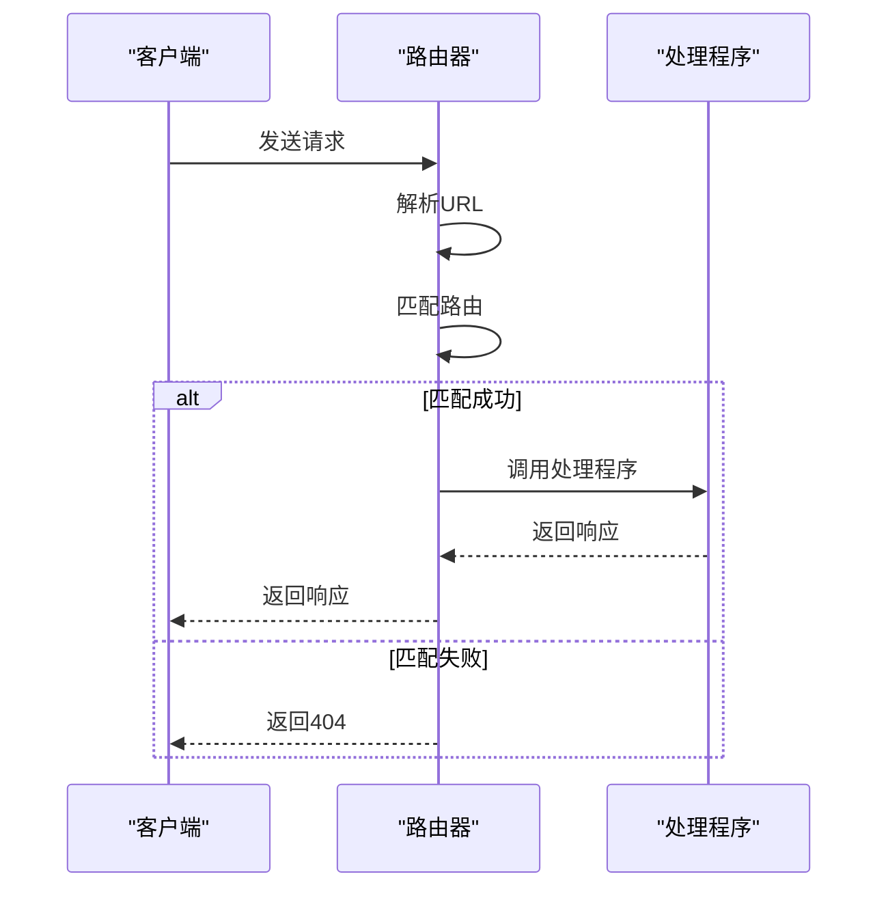
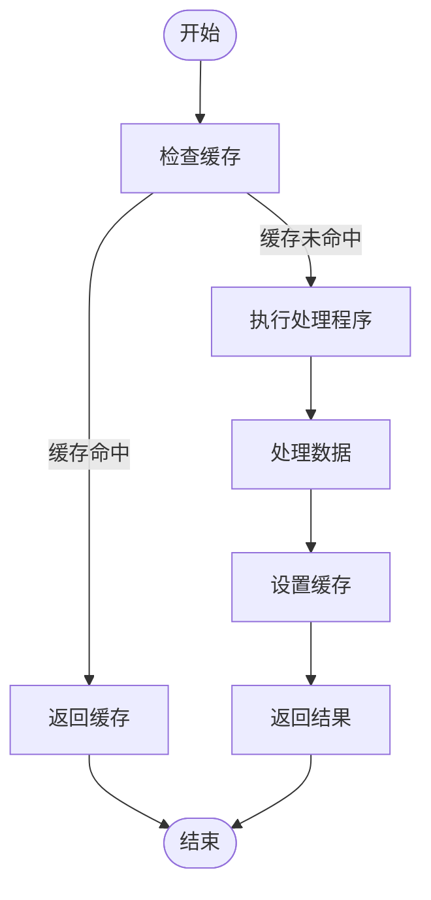
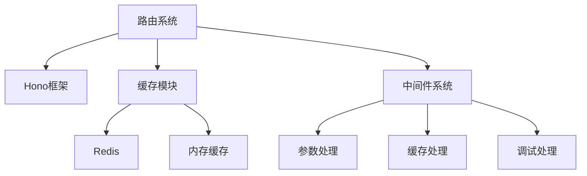

# 路由系统

<cite>
**本文档中引用的文件**  
- [router.js](file://lib/router.js)
- [registry.ts](file://lib/registry.ts)
- [types.ts](file://lib/types.ts)
- [parameter.ts](file://lib/middleware/parameter.ts)
- [cache.ts](file://lib/middleware/cache.ts)
- [routes](file://lib/routes)
</cite>

## 目录
1. [简介](#简介)
2. [项目结构](#项目结构)
3. [核心组件](#核心组件)
4. [架构概述](#架构概述)
5. [详细组件分析](#详细组件分析)
6. [依赖分析](#依赖分析)
7. [性能考虑](#性能考虑)
8. [故障排除指南](#故障排除指南)
9. [结论](#结论)

## 简介
RSSHub的路由系统是其核心功能之一，负责处理所有传入的HTTP请求并将其分发到相应的处理程序。该系统基于Hono框架构建，采用模块化设计，支持动态路由、路由分组和参数化路由。路由系统的设计目标是提供高性能、可扩展和易于维护的路由机制，同时支持丰富的功能如缓存、参数处理和错误处理。

## 项目结构
RSSHub的路由系统主要由`lib/routes/`目录和`lib/router.js`文件组成。`lib/routes/`目录包含了所有路由的实现，每个子目录代表一个命名空间，包含该命名空间下的所有路由。`lib/router.js`文件负责路由的注册和匹配，是整个路由系统的核心。

**图源**
- [registry.ts](file://lib/registry.ts)
- [router.js](file://lib/router.js)
- [parameter.ts](file://lib/middleware/parameter.ts)
- [cache.ts](file://lib/middleware/cache.ts)

**节源**
- [registry.ts](file://lib/registry.ts)
- [router.js](file://lib/router.js)

## 核心组件
路由系统的核心组件包括路由注册、路由匹配和路由处理。路由注册负责将所有路由加载到内存中，路由匹配负责根据请求URL找到对应的路由，路由处理负责执行路由的处理逻辑并返回响应。

**节源**
- [registry.ts](file://lib/registry.ts)
- [router.js](file://lib/router.js)

## 架构概述
RSSHub的路由系统采用分层架构，从上到下分为路由定义层、路由注册层、路由匹配层和路由处理层。路由定义层负责定义路由的路径、参数和处理函数，路由注册层负责将路由注册到Hono应用中，路由匹配层负责根据请求URL匹配到相应的路由，路由处理层负责执行路由的处理逻辑。

**图源**
- [registry.ts](file://lib/registry.ts)
- [router.js](file://lib/router.js)
- [cache.ts](file://lib/middleware/cache.ts)

## 详细组件分析

### 路由注册分析
路由注册是路由系统的第一步，负责将所有路由加载到内存中。RSSHub使用`directoryImport`函数从`lib/routes/`目录中导入所有路由模块，并将它们注册到`namespaces`对象中。每个路由模块可以导出`route`、`namespace`或`apiRoute`对象，分别表示单个路由、命名空间和API路由。

#### 路由注册流程

**图源**
- [registry.ts](file://lib/registry.ts)

**节源**
- [registry.ts](file://lib/registry.ts)

### 路由匹配分析
路由匹配是路由系统的核心，负责根据请求URL找到对应的路由。RSSHub使用Hono的路由匹配机制，支持动态路由、通配符路由和正则表达式路由。路由匹配的优先级规则是字面量段优先于参数段，较短路径优先于较长路径。

#### 路由匹配流程

**图源**
- [router.js](file://lib/router.js)

**节源**
- [router.js](file://lib/router.js)

### 路由处理分析
路由处理是路由系统的最后一步，负责执行路由的处理逻辑并返回响应。RSSHub的路由处理程序通常返回一个`Data`对象，该对象包含RSS feed的所有信息。处理程序可以使用中间件来处理参数、缓存和错误。

#### 路由处理流程

**图源**
- [cache.ts](file://lib/middleware/cache.ts)
- [parameter.ts](file://lib/middleware/parameter.ts)

**节源**
- [cache.ts](file://lib/middleware/cache.ts)
- [parameter.ts](file://lib/middleware/parameter.ts)

## 依赖分析
路由系统依赖于多个核心组件，包括Hono框架、缓存模块和中间件系统。这些组件共同协作，提供完整的路由功能。

**图源**
- [registry.ts](file://lib/registry.ts)
- [cache.ts](file://lib/middleware/cache.ts)
- [parameter.ts](file://lib/middleware/parameter.ts)

**节源**
- [registry.ts](file://lib/registry.ts)
- [cache.ts](file://lib/middleware/cache.ts)
- [parameter.ts](file://lib/middleware/parameter.ts)

## 性能考虑
路由系统的性能主要受路由匹配算法、缓存机制和中间件处理的影响。通过优化路由匹配算法、合理使用缓存和减少中间件处理开销，可以显著提高路由系统的性能。

**节源**
- [registry.ts](file://lib/registry.ts)
- [cache.ts](file://lib/middleware/cache.ts)

## 故障排除指南
当路由系统出现问题时，可以通过检查日志、调试信息和缓存状态来定位问题。常见的问题包括路由未注册、参数处理错误和缓存失效。

**节源**
- [debug.ts](file://lib/middleware/debug.ts)
- [cache.ts](file://lib/middleware/cache.ts)

## 结论
RSSHub的路由系统是一个高效、可扩展和易于维护的路由机制。通过深入分析路由系统的架构和实现，我们可以更好地理解和使用这一强大的功能。未来的工作可以集中在进一步优化路由匹配算法、增强缓存机制和提供更多调试工具上。