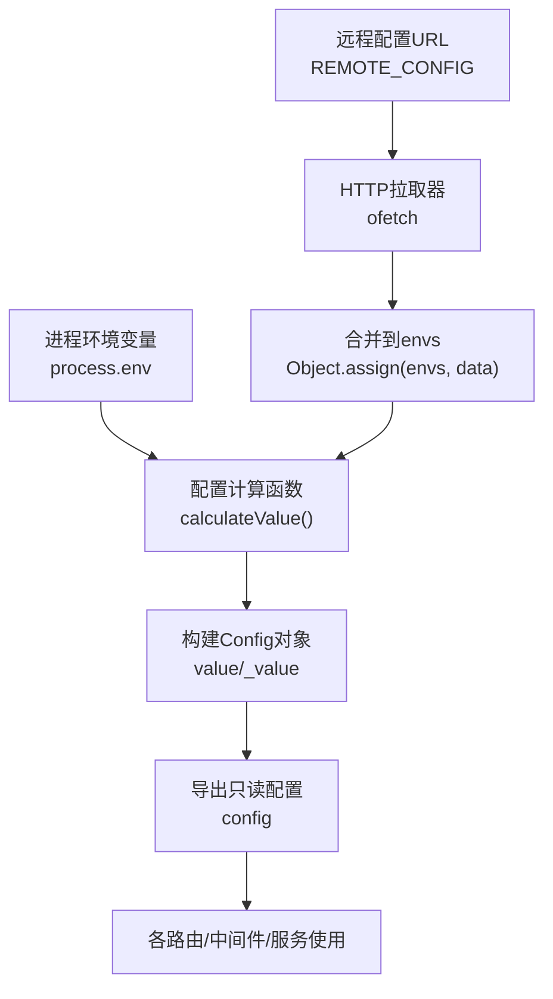
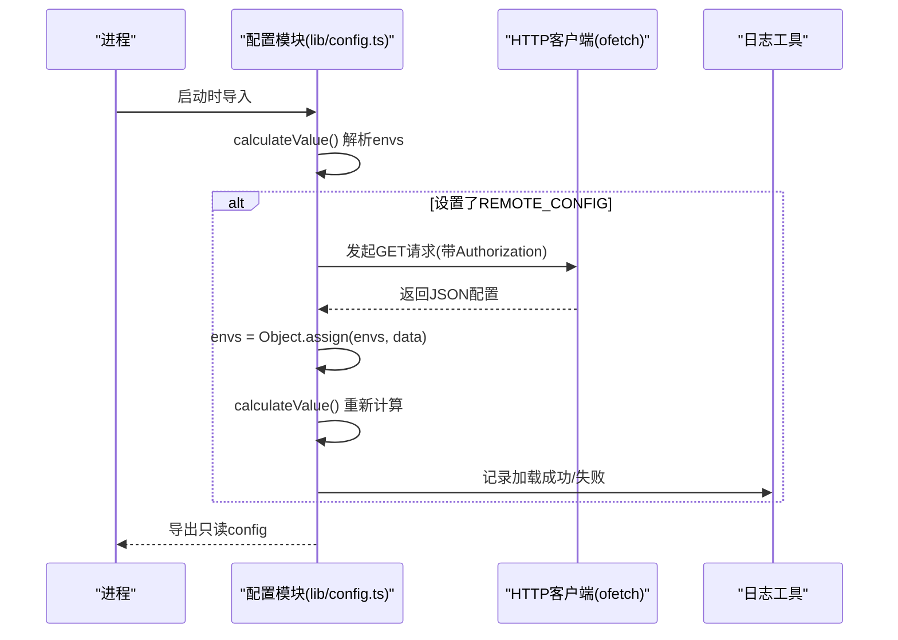
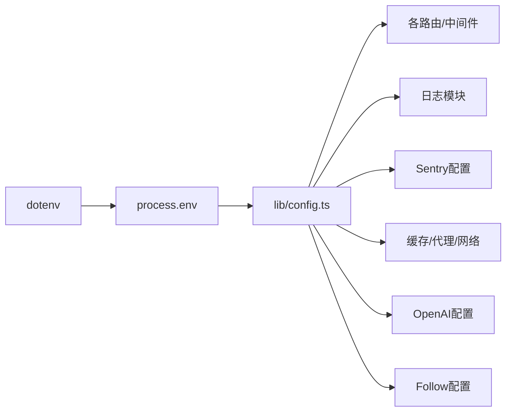

# 配置系统

<cite>
**本文引用的文件列表**
- [lib/config.ts](file://lib/config.ts)
- [lib/config.test.ts](file://lib/config.test.ts)
- [lib/routes/discourse/utils.ts](file://lib/routes/discourse/utils.ts)
- [lib/errors/types/config-not-found.ts](file://lib/errors/types/config-not-found.ts)
- [scripts/ansible/rsshub.env](file://scripts/ansible/rsshub.env)
- [flake.nix](file://flake.nix)
</cite>

## 目录
1. [简介](#简介)
2. [项目结构](#项目结构)
3. [核心组件](#核心组件)
4. [架构总览](#架构总览)
5. [详细组件分析](#详细组件分析)
6. [依赖分析](#依赖分析)
7. [性能考虑](#性能考虑)
8. [故障排除指南](#故障排除指南)
9. [结论](#结论)
10. [附录：配置清单与示例](#附录配置清单与示例)

## 简介
本文件面向RSSHub使用者与维护者，系统化梳理配置系统的设计与实现，重点解析lib/config.ts中的配置项层次结构、类型定义、默认值、环境变量与远程配置的加载与优先级、以及错误处理与验证机制。同时提供开发与生产环境的配置示例、性能调优建议与安全最佳实践，并给出常见问题的排查步骤。

## 项目结构
RSSHub的配置系统以单文件lib/config.ts为核心，通过环境变量驱动，按模块化分层组织配置项，支持运行时动态加载远程配置并合并到当前环境变量中，最终生成只读的全局配置对象供全站使用。

图表来源
- [lib/config.ts](file://lib/config.ts#L1159-L1187)

章节来源
- [lib/config.ts](file://lib/config.ts#L1-L120)

## 核心组件
- 类型与键集合：通过ConfigEnvKeys枚举与Config接口定义了所有可识别的配置键及结构化类型，覆盖应用、网络、缓存、代理、访问控制、日志、订阅源特性、OpenAI、Follow、以及大量站点特定配置。
- 计算与转换：toBoolean与toInt两个基础转换器负责将字符串环境变量转为布尔或整数；calculateValue遍历envs，按前缀规则聚合多值配置（如BILIBILI_COOKIE_、EMAIL_CONFIG_等），并填充默认值与派生字段。
- 远程配置：当设置REMOTE_CONFIG时，系统会以Basic认证方式拉取远端JSON配置，成功后与本地envs合并并重新计算，实现集中式配置管理。
- 导出与更新：导出只读config对象；提供setConfig用于测试或动态注入场景，便于重算。

章节来源
- [lib/config.ts](file://lib/config.ts#L1-L120)
- [lib/config.ts](file://lib/config.ts#L679-L713)
- [lib/config.ts](file://lib/config.ts#L715-L1156)
- [lib/config.ts](file://lib/config.ts#L1159-L1187)

## 架构总览
配置系统采用“环境变量驱动 + 运行时合并”的架构，确保：
- 配置来源清晰：本地环境变量为主，远程配置为辅；
- 结构稳定：统一的Config接口约束；
- 可扩展：新增站点配置遵循前缀约定；
- 可观测：日志记录远程配置加载状态。

图表来源
- [lib/config.ts](file://lib/config.ts#L1159-L1187)

## 详细组件分析

### 1) 配置键与类型体系
- 键集合：ConfigEnvKeys枚举覆盖应用、网络、缓存、代理、访问控制、日志、订阅源特性、OpenAI、Follow、以及大量站点前缀（如BILIBILI_COOKIE_、DISCOURSE_CONFIG_、DISCUZ_COOKIE_、MEDIUM_COOKIE_、EMAIL_CONFIG_等）。
- 类型定义：Config接口将键映射为强类型字段，包含嵌套对象（如cache、proxy、hotlink、openai、telegram等）与可选字段，确保编译期约束。

章节来源
- [lib/config.ts](file://lib/config.ts#L1-L120)
- [lib/config.ts](file://lib/config.ts#L243-L673)

### 2) 默认值与转换逻辑
- 布尔转换：toBoolean将空字符串、'0'、'false'视为false，其余视为true；未设置时使用默认值。
- 整数转换：toInt将未设置或非数字字符串回退到默认值；对可选数值字段提供合理默认。
- UA策略：若开启NO_RANDOM_UA，则固定UA为RSSHub真机UA；否则随机UA。
- 缓存类型：CACHE_TYPE默认memory；为空字符串可禁用缓存。
- 其他默认：端口、超时、过期时间、内存缓存上限、Redis URL、代理健康检查间隔等均有明确默认。

章节来源
- [lib/config.ts](file://lib/config.ts#L679-L713)
- [lib/config.ts](file://lib/config.ts#L715-L764)
- [lib/config.ts](file://lib/config.ts#L735-L747)

### 3) 多值配置的前缀聚合
- BILIBILI_COOKIE_*：按UID收集cookies，形成cookies映射。
- EMAIL_CONFIG_*：按邮箱域名收集令牌，形成config映射。
- DISCUZ_COOKIE_*：按论坛ID收集cookies，形成cookies映射。
- MEDIUM_COOKIE_*：按用户名收集cookies，键名小写化，形成cookies映射。
- DISCOURSE_CONFIG_*：按ID收集JSON配置，自动JSON.parse。

章节来源
- [lib/config.ts](file://lib/config.ts#L696-L713)
- [lib/config.test.ts](file://lib/config.test.ts#L1-L100)

### 4) 远程配置加载与优先级
- 触发条件：设置REMOTE_CONFIG即启用远程配置。
- 认证方式：REMOTE_CONFIG_AUTH作为Basic认证凭据。
- 加载流程：成功返回数据则与本地envs合并，重新计算；失败记录错误日志。
- 优先级：远程配置与本地环境变量合并后，后者覆盖前者同名键（见setConfig行为）。

章节来源
- [lib/config.ts](file://lib/config.ts#L235-L236)
- [lib/config.ts](file://lib/config.ts#L1159-L1187)
- [lib/config.ts](file://lib/config.ts#L1184-L1187)

### 5) 错误处理与验证
- 远程配置异常：捕获HTTP错误并记录日志，不影响本地配置生效。
- 路由侧校验：部分路由在缺少必要配置时抛出ConfigNotFoundError，提示用户补充相关配置。
- 测试覆盖：单元测试验证多值前缀聚合、UA切换、远程配置加载等关键路径。

章节来源
- [lib/config.ts](file://lib/config.ts#L1159-L1187)
- [lib/routes/discourse/utils.ts](file://lib/routes/discourse/utils.ts#L1-L11)
- [lib/errors/types/config-not-found.ts](file://lib/errors/types/config-not-found.ts#L1-L5)
- [lib/config.test.ts](file://lib/config.test.ts#L1-L100)

### 6) 环境变量与配置文件的关系
- 环境变量：RSSHub通过dotenv加载.env至process.env，随后被配置模块消费。
- 配置文件：仓库提供了Ansible示例脚本与环境文件，演示如何在部署环境中设置NODE_ENV、CACHE_TYPE、PUPPETEER_WS_ENDPOINT等。
- Nix集成：flake.nix提供环境变量选项与Redis开关，支持自动生成环境文件并可选择本地Redis实例。

章节来源
- [lib/config.ts](file://lib/config.ts#L1-L5)
- [scripts/ansible/rsshub.env](file://scripts/ansible/rsshub.env#L1-L4)
- [flake.nix](file://flake.nix#L152-L227)

## 依赖分析
- 内部依赖
  - ofetch：用于远程配置拉取。
  - 日志模块：记录远程配置加载状态。
- 外部依赖
  - dotenv：加载.env文件到process.env。
- 路由/中间件依赖
  - 订阅源特性、代理、缓存、日志、Sentry、OpenAI、Follow等配置被各模块直接读取。

图表来源
- [lib/config.ts](file://lib/config.ts#L1-L5)
- [lib/config.ts](file://lib/config.ts#L1159-L1187)

## 性能考虑
- 缓存策略
  - 路由缓存与内容缓存分别控制，合理设置CACHE_EXPIRE与CACHE_CONTENT_EXPIRE可降低重复抓取压力。
  - MEMORY_MAX限制LRU容量，避免内存膨胀。
  - 使用Redis缓存时，建议独立部署并监控连接池与键空间大小。
- 网络与代理
  - REQUEST_RETRY与REQUEST_TIMEOUT影响整体吞吐与响应时间，需结合上游稳定性调整。
  - PROXY_STRATEGY支持仅重试时启用代理，减少不必要的代理开销。
- 并发与集群
  - ENABLE_CLUSTER与NODE_NAME可用于容器化部署的节点隔离与负载均衡。
- 日志与遥测
  - LOGGER_LEVEL与otel桶配置影响可观测性成本，生产环境建议适度降噪。
  - SENTRY_ROUTE_TIMEOUT控制上报阈值，避免慢请求拖累性能。

[本节为通用指导，不直接分析具体文件]

## 故障排除指南
- 远程配置未生效
  - 检查REMOTE_CONFIG是否设置且可达；确认REMOTE_CONFIG_AUTH是否正确；查看日志中“Remote config loaded.”或“Remote config load failed.”提示。
  - 章节来源
    - [lib/config.ts](file://lib/config.ts#L1159-L1187)
- UA不符合预期
  - 若设置了NO_RANDOM_UA，UA将固定为RSSHub真机UA；否则使用随机UA。
  - 章节来源
    - [lib/config.ts](file://lib/config.ts#L729-L733)
- 多值配置未聚合
  - 确认前缀命名正确（如BILIBILI_COOKIE_、EMAIL_CONFIG_、DISCUZ_COOKIE_、MEDIUM_COOKIE_、DISCOURSE_CONFIG_）；检查单元测试用例以核对格式。
  - 章节来源
    - [lib/config.ts](file://lib/config.ts#L696-L713)
    - [lib/config.test.ts](file://lib/config.test.ts#L1-L100)
- 路由报“缺少配置”
  - 当某路由需要特定配置而未提供时会抛出ConfigNotFoundError，请根据错误提示补充相应键值。
  - 章节来源
    - [lib/routes/discourse/utils.ts](file://lib/routes/discourse/utils.ts#L1-L11)
    - [lib/errors/types/config-not-found.ts](file://lib/errors/types/config-not-found.ts#L1-L5)
- 缓存异常
  - 若CACHE_TYPE设为''将禁用缓存；Redis连接失败请检查REDIS_URL与网络连通性。
  - 章节来源
    - [lib/config.ts](file://lib/config.ts#L735-L747)
- 代理/健康检查问题
  - PROXY_HEALTH_CHECK_INTERVAL与PROXY_FAILOVER_TIMEOUT影响代理切换与恢复速度；确认PROXY_STRATEGY与PROXY_URL_REGEX匹配目标站点。
  - 章节来源
    - [lib/config.ts](file://lib/config.ts#L755-L764)

## 结论
RSSHub配置系统以环境变量为中心，通过强类型接口与默认值保障一致性，借助前缀聚合与远程配置实现灵活扩展与集中管理。配合严格的错误处理与可观测日志，可在复杂部署环境下保持稳定与可维护性。建议在生产环境优先使用Redis缓存、合理设置超时与重试、严格管理远程配置访问权限，并通过测试用例持续验证关键配置路径。

[本节为总结性内容，不直接分析具体文件]

## 附录：配置清单与示例

### A. 配置项与默认值概览（节选）
- 应用与网络
  - PORT：默认1200
  - LISTEN_INADDR_ANY：默认true
  - REQUEST_RETRY：默认2
  - REQUEST_TIMEOUT：默认30000
  - UA：默认随机UA；NO_RANDOM_UA=true时为RSSHub真机UA
  - ALLOW_ORIGIN：可选
- 缓存
  - CACHE_TYPE：默认'memory'；设为空字符串可禁用
  - CACHE_REQUEST_TIMEOUT：默认60
  - CACHE_EXPIRE：默认5*60
  - CACHE_CONTENT_EXPIRE：默认1*60*60
  - MEMORY_MAX：默认2^8
  - REDIS_URL：默认redis://localhost:6379/
- 代理
  - PROXY_URI/PROXY_URIS：可选
  - PROXY_PROTOCOL/HOST/PORT/AUTH：可选
  - PROXY_URL_REGEX：默认'.*'
  - PROXY_STRATEGY：默认'all'
  - PROXY_FAILOVER_TIMEOUT：默认5000
  - PROXY_HEALTH_CHECK_INTERVAL：默认60000
  - PAC_URI/PAC_SCRIPT：可选
- 安全与访问控制
  - ACCESS_KEY：可选
- 日志与遥测
  - DEBUG_INFO：默认'true'
  - LOGGER_LEVEL：默认'info'
  - NO_LOGFILES：默认false
  - OTEL_SECONDS_BUCKET/OTEL_MILLISECONDS_BUCKET：默认预设值
  - SHOW_LOGGER_TIMESTAMP：默认false
  - SENTRY：DSN可选；SENTRY_ROUTE_TIMEOUT：默认30000
  - ENABLE_REMOTE_DEBUGGING：默认false
- 订阅源特性
  - HOTLINK_TEMPLATE/HOTLINK_INCLUDE_PATHS/HOTLINK_EXCLUDE_PATHS：可选
  - ALLOW_USER_HOTLINK_TEMPLATE：默认false
  - FILTER_REGEX_ENGINE：默认're2'
  - ALLOW_USER_SUPPLY_UNSAFE_DOMAIN：默认false
  - DISABLE_NSFW：默认false
  - SUFFIX/TITLE_LENGTH_LIMIT：可选/默认150
- OpenAI
  - OPENAI_API_KEY/MODEL/TEMPERATURE/MAX_TOKENS/API_ENDPOINT/INPUT_OPTION/PROMPT_TITLE/PROMPT_DESCRIPTION：可选或有默认
- Follow
  - FOLLOW_OWNER_USER_ID/DESCRIPTION/PRICE/USER_LIMIT：可选
- 远程配置
  - REMOTE_CONFIG：可选
  - REMOTE_CONFIG_AUTH：可选

章节来源
- [lib/config.ts](file://lib/config.ts#L715-L814)
- [lib/config.ts](file://lib/config.ts#L735-L814)
- [lib/config.ts](file://lib/config.ts#L749-L767)
- [lib/config.ts](file://lib/config.ts#L768-L814)
- [lib/config.ts](file://lib/config.ts#L770-L814)
- [lib/config.ts](file://lib/config.ts#L785-L814)
- [lib/config.ts](file://lib/config.ts#L798-L814)
- [lib/config.ts](file://lib/config.ts#L808-L814)
- [lib/config.ts](file://lib/config.ts#L1159-L1187)

### B. 开发与生产环境示例
- 开发环境
  - 示例键值：NODE_ENV=development、PORT=1200、CACHE_TYPE=memory、DEBUG_INFO=true
  - 参考来源
    - [scripts/ansible/rsshub.env](file://scripts/ansible/rsshub.env#L1-L4)
- 生产环境
  - 示例键值：NODE_ENV=production、CACHE_TYPE=redis、REDIS_URL=redis://your-redis-host:6379/、SENTRY_DSN=your-dsn、ACCESS_KEY=your-key
  - 参考来源
    - [scripts/ansible/rsshub.env](file://scripts/ansible/rsshub.env#L1-L4)
    - [flake.nix](file://flake.nix#L152-L227)

### C. 站点特定配置示例（前缀）
- BILIBILI_COOKIE_<uid>=...
- EMAIL_CONFIG_<domain>=...
- DISCUZ_COOKIE_<cid>=...
- MEDIUM_COOKIE_<username>=...
- DISCOURSE_CONFIG_<id>=JSON字符串
- TWITTER_USERNAME/PASSWORD/AUTH_TOKEN等可为逗号分隔的多值
- TELEGRAM_*、YOUTUBE_*、SPOTIFY_*、MANGADEX_*等按站点键命名

章节来源
- [lib/config.ts](file://lib/config.ts#L696-L713)
- [lib/config.ts](file://lib/config.ts#L1088-L1095)
- [lib/config.ts](file://lib/config.ts#L1065-L1076)
- [lib/config.ts](file://lib/config.ts#L1133-L1138)

### D. 安全最佳实践
- 限制远程配置访问：仅在可信网络内暴露REMOTE_CONFIG，使用HTTPS与强认证（REMOTE_CONFIG_AUTH）。
- 最小权限原则：为各站点前缀配置仅授予必要权限（如Twitter、Instagram、GitHub等令牌）。
- 代理与PAC：谨慎配置代理策略与健康检查，避免成为攻击面。
- 日志与敏感信息：避免在日志中输出敏感配置；生产环境适当降低DEBUG级别。
- 缓存与隐私：NSFW过滤与标题长度限制等特性应按业务需求启用。

[本节为通用指导，不直接分析具体文件]