# 性能监控

<cite>
**本文档中引用的文件**  
- [metrics.ts](file://lib/routes/metrics.ts)
- [metric.ts](file://lib/utils/otel/metric.ts)
- [trace.ts](file://lib/utils/otel/trace.ts)
- [trace.ts](file://lib/middleware/trace.ts)
- [config.ts](file://lib/config.ts)
- [logger.ts](file://lib/middleware/logger.ts)
- [debug.ts](file://lib/middleware/debug.ts)
- [debug-info.ts](file://lib/utils/debug-info.ts)
- [index.tsx](file://lib/views/index.tsx)
</cite>

## 目录
1. [简介](#简介)
2. [性能指标系统架构](#性能指标系统架构)
3. [核心性能指标](#核心性能指标)
4. [OpenTelemetry集成](#opentelemetry集成)
5. [Prometheus集成指南](#prometheus集成指南)
6. [分布式追踪系统](#分布式追踪系统)
7. [性能基准测试](#性能基准测试)
8. [性能优化建议](#性能优化建议)
9. [监控告警与可视化](#监控告警与可视化)
10. [调试信息与健康检查](#调试信息与健康检查)

## 简介
RSSHub的性能监控系统基于OpenTelemetry标准构建，提供全面的性能指标收集、分布式追踪和监控集成能力。该系统允许开发者监控请求延迟、缓存命中率、错误率等关键性能指标，并通过Prometheus等监控系统进行可视化和告警。性能监控功能在系统中通过多个组件协同工作，包括指标收集、追踪、日志记录和调试信息收集。

**Section sources**
- [metrics.ts](file://lib/routes/metrics.ts#L1-L14)
- [metric.ts](file://lib/utils/otel/metric.ts#L1-L68)

## 性能指标系统架构
RSSHub的性能监控系统采用分层架构设计，由指标收集、数据导出和监控集成三个主要部分组成。系统使用OpenTelemetry SDK收集性能数据，通过Prometheus导出器暴露指标，并提供REST API端点供监控系统抓取。

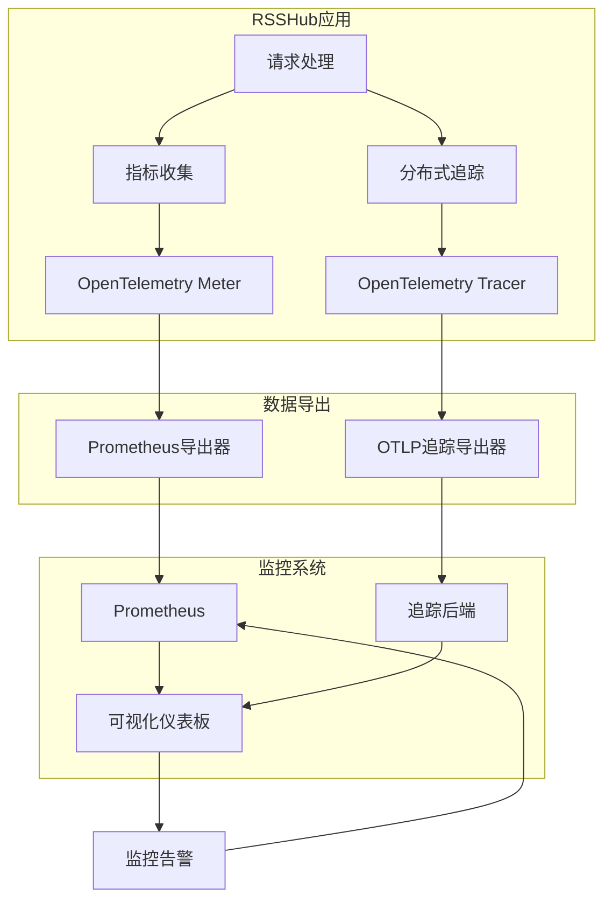

**Diagram sources**
- [metric.ts](file://lib/utils/otel/metric.ts#L1-L68)
- [trace.ts](file://lib/utils/otel/trace.ts#L1-L29)

**Section sources**
- [metric.ts](file://lib/utils/otel/metric.ts#L1-L68)
- [trace.ts](file://lib/utils/otel/trace.ts#L1-L29)

## 核心性能指标
RSSHub暴露多种关键性能指标，用于监控系统健康状况和性能表现。这些指标分为请求统计、延迟分布和错误统计三大类。

### 请求统计指标
系统收集请求总量和成功请求量，用于计算请求速率和系统吞吐量。

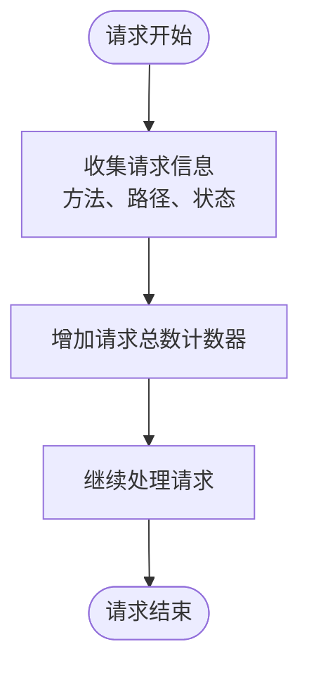

### 延迟分布指标
系统记录请求处理时间，提供毫秒和秒两个时间维度的直方图数据。

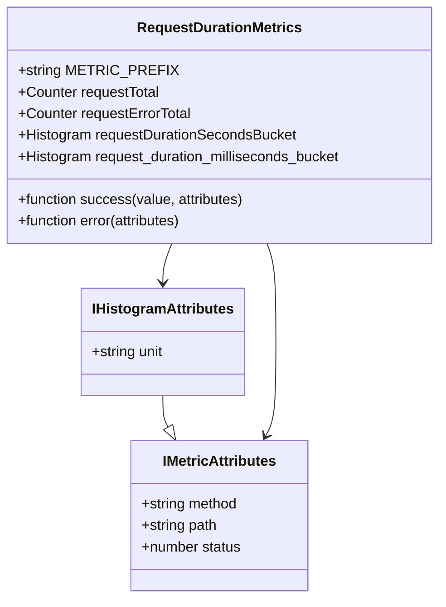

**Diagram sources**
- [metric.ts](file://lib/utils/otel/metric.ts#L34-L56)

**Section sources**
- [metric.ts](file://lib/utils/otel/metric.ts#L34-L56)
- [logger.ts](file://lib/middleware/logger.ts#L42-L43)

## OpenTelemetry集成
RSSHub通过OpenTelemetry SDK实现标准化的性能监控和分布式追踪。系统配置了指标和追踪提供者，支持与各种监控后端集成。

### OpenTelemetry配置
系统通过`@/utils/otel`模块统一管理OpenTelemetry配置，包括指标和追踪的初始化。

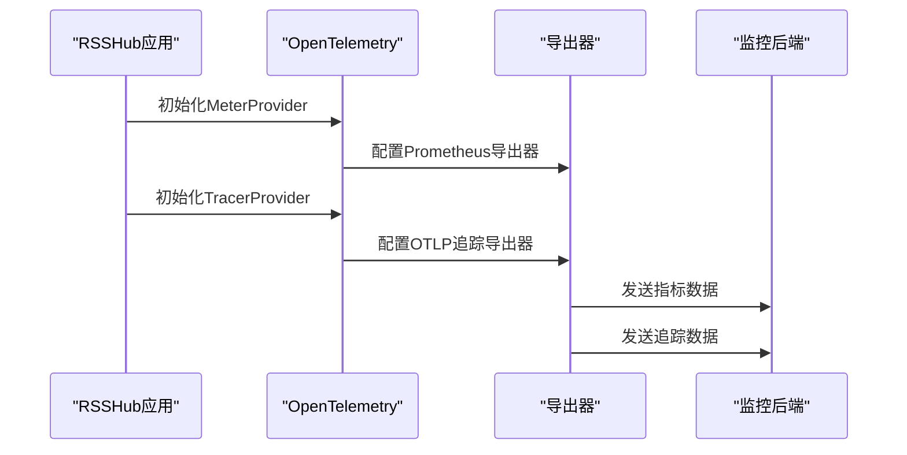

### 指标收集实现
指标收集通过OpenTelemetry的Meter API实现，系统创建了多个计数器和直方图来记录不同维度的性能数据。

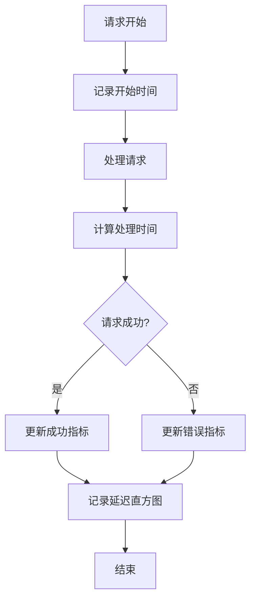

**Diagram sources**
- [metric.ts](file://lib/utils/otel/metric.ts#L21-L32)
- [trace.ts](file://lib/utils/otel/trace.ts#L7-L28)

**Section sources**
- [metric.ts](file://lib/utils/otel/metric.ts#L1-L68)
- [trace.ts](file://lib/utils/otel/trace.ts#L1-L29)

## Prometheus集成指南
RSSHub通过Prometheus导出器暴露性能指标，允许Prometheus服务器抓取和存储这些数据。系统提供了专门的路由端点来暴露指标。

### 指标端点配置
系统通过`/metrics`路由暴露Prometheus格式的性能指标，该端点由`metrics.ts`文件实现。

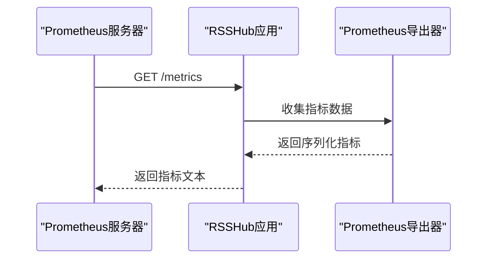

### 指标数据格式
RSSHub暴露的指标遵循Prometheus数据格式规范，包含指标名称、标签和值。

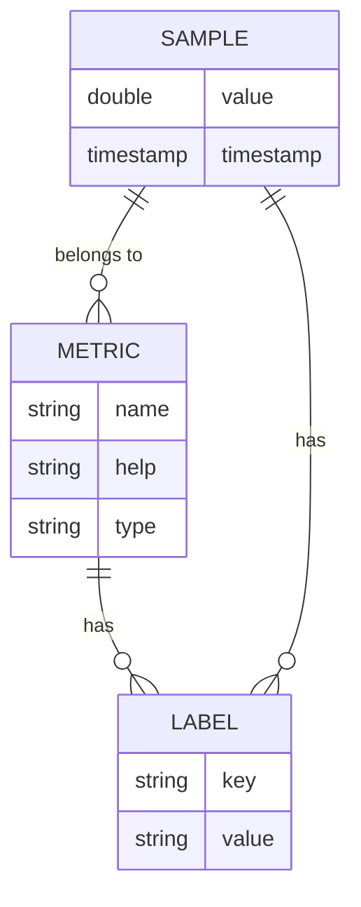

**Diagram sources**
- [metrics.ts](file://lib/routes/metrics.ts#L1-L14)
- [metric.ts](file://lib/utils/otel/metric.ts#L21-L32)

**Section sources**
- [metrics.ts](file://lib/routes/metrics.ts#L1-L14)
- [metric.ts](file://lib/utils/otel/metric.ts#L21-L32)

## 分布式追踪系统
RSSHub实现了分布式追踪功能，用于分析请求处理链路中的性能瓶颈。系统使用OpenTelemetry追踪API创建和管理追踪跨度。

### 追踪中间件
系统通过中间件实现分布式追踪，只有在调试模式启用时才会收集追踪数据。

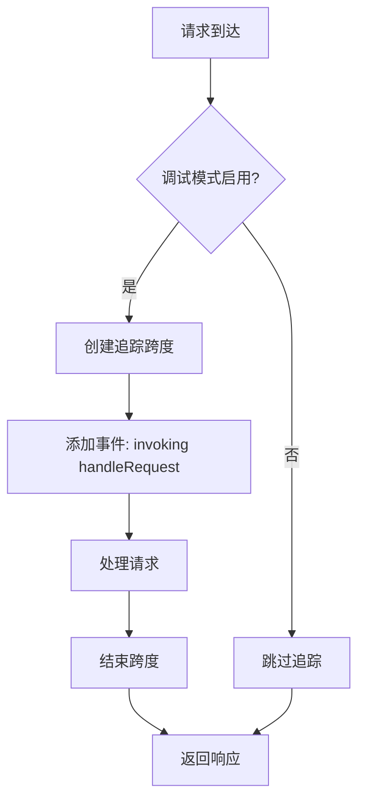

### 追踪配置
追踪系统配置了OTLP导出器，将追踪数据发送到指定的后端服务。

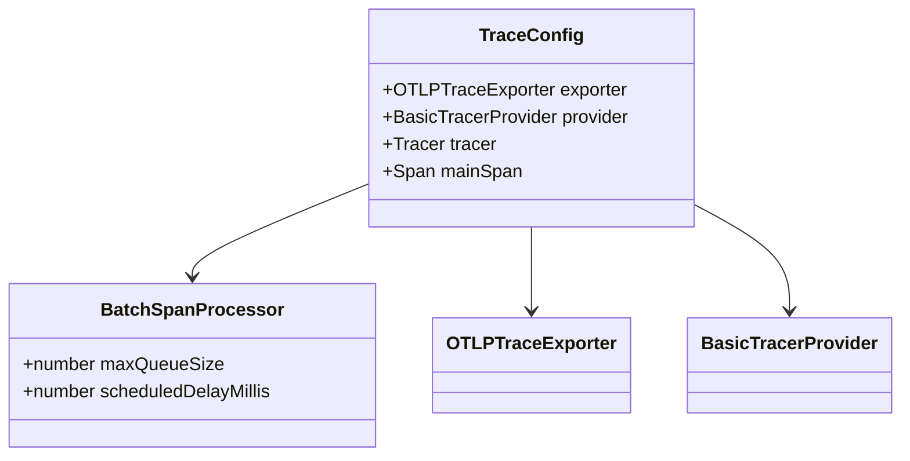

**Diagram sources**
- [trace.ts](file://lib/middleware/trace.ts#L7-L26)
- [trace.ts](file://lib/utils/otel/trace.ts#L7-L29)

**Section sources**
- [trace.ts](file://lib/middleware/trace.ts#L1-L27)
- [trace.ts](file://lib/utils/otel/trace.ts#L1-L29)

## 性能基准测试
RSSHub提供了多种性能基准测试方法，帮助开发者评估系统性能和识别性能瓶颈。

### 基准测试指标
系统收集的性能指标可用于基准测试，包括请求延迟、吞吐量和错误率。

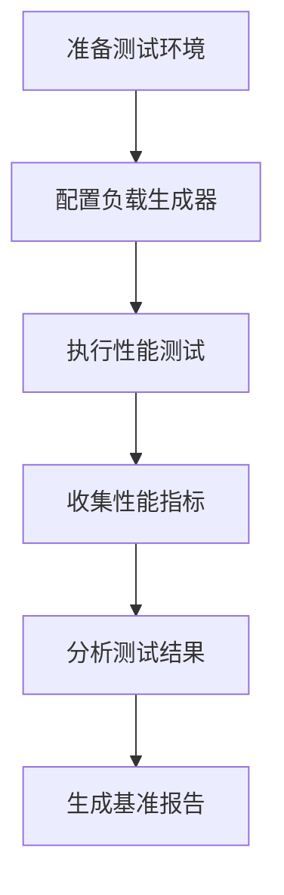

### 测试方法
建议使用标准的性能测试工具（如wrk、k6）对RSSHub进行基准测试。

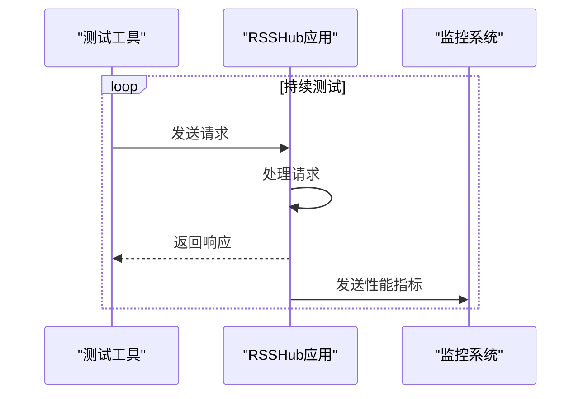

**Section sources**
- [metric.ts](file://lib/utils/otel/metric.ts#L34-L56)
- [debug-info.ts](file://lib/utils/debug-info.ts#L1-L25)

## 性能优化建议
基于RSSHub的性能监控数据，可以采取多种优化措施来提升系统性能。

### 缓存优化
利用系统提供的缓存命中率指标，优化缓存策略。

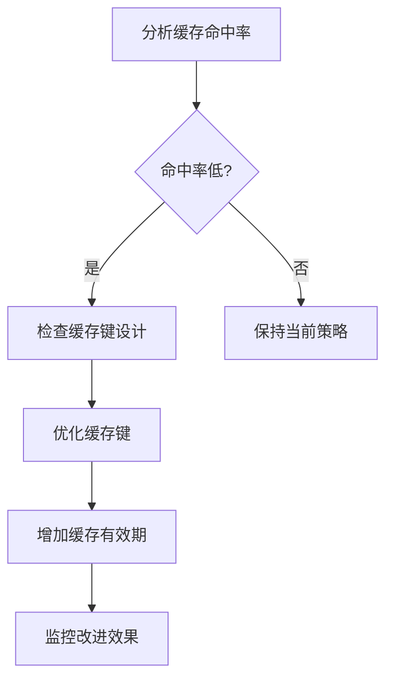

### 请求处理优化
根据请求延迟分布，识别和优化慢速请求。

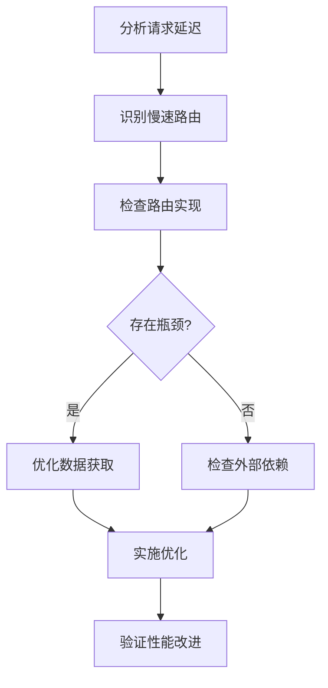

**Section sources**
- [metric.ts](file://lib/utils/otel/metric.ts#L36-L45)
- [debug-info.ts](file://lib/utils/debug-info.ts#L2-L5)

## 监控告警与可视化
RSSHub的性能指标可以与Prometheus、Grafana等监控系统集成，实现可视化和告警功能。

### 告警规则
基于关键性能指标设置告警规则，及时发现系统异常。

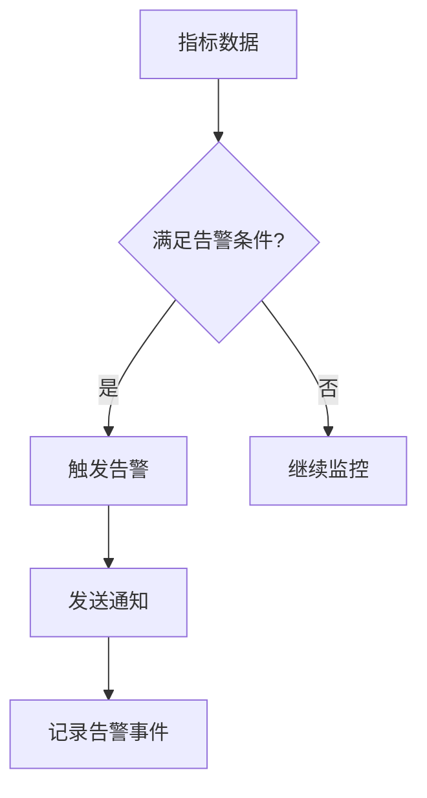

### 可视化仪表板
使用Grafana等工具创建性能监控仪表板，直观展示系统状态。

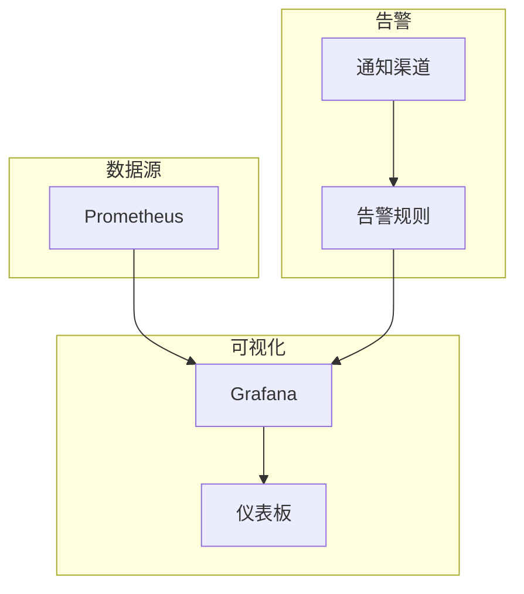

**Section sources**
- [metric.ts](file://lib/utils/otel/metric.ts#L34-L56)
- [metrics.ts](file://lib/routes/metrics.ts#L1-L14)

## 调试信息与健康检查
RSSHub提供详细的调试信息和健康检查功能，帮助开发者监控系统状态。

### 调试信息指标
系统收集多种调试信息，包括缓存命中率、ETag匹配率和健康度。

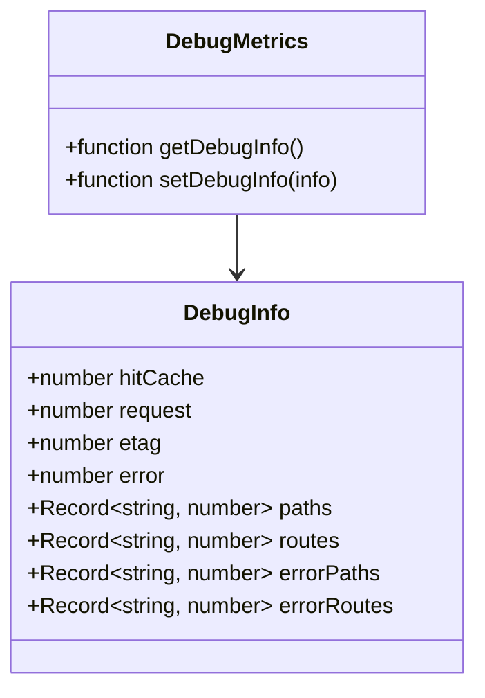

### 健康检查实现
调试信息通过中间件收集，并在主页面上显示。

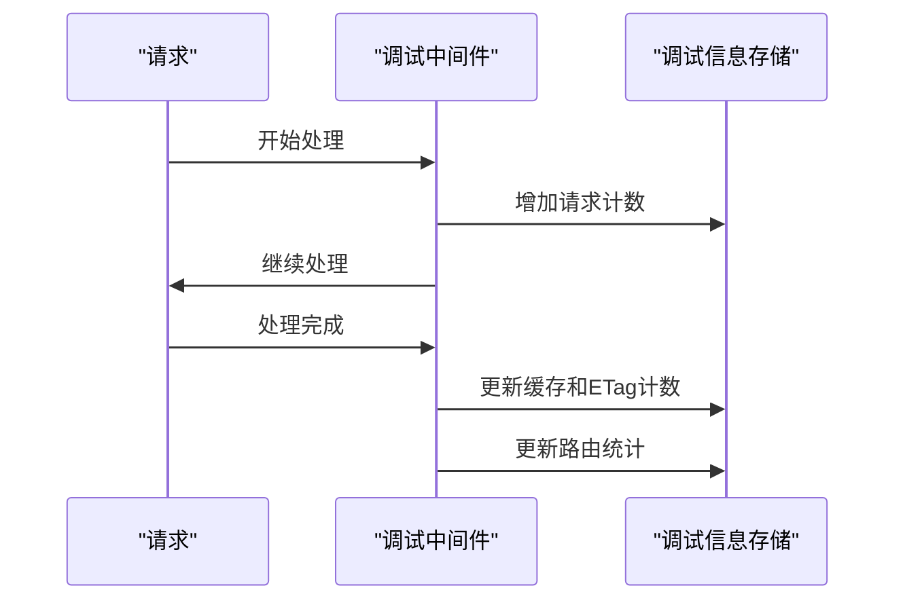

**Diagram sources**
- [debug-info.ts](file://lib/utils/debug-info.ts#L1-L25)
- [debug.ts](file://lib/middleware/debug.ts#L1-L40)

**Section sources**
- [debug-info.ts](file://lib/utils/debug-info.ts#L1-L25)
- [debug.ts](file://lib/middleware/debug.ts#L1-L40)
- [index.tsx](file://lib/views/index.tsx#L60-L125)