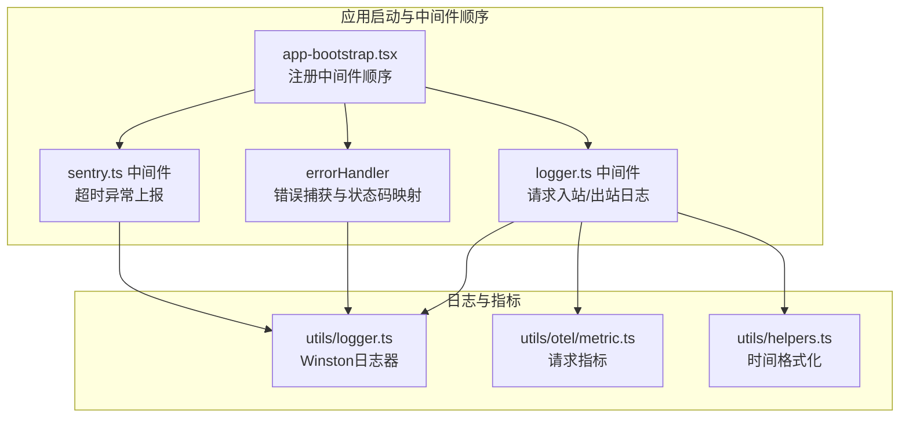
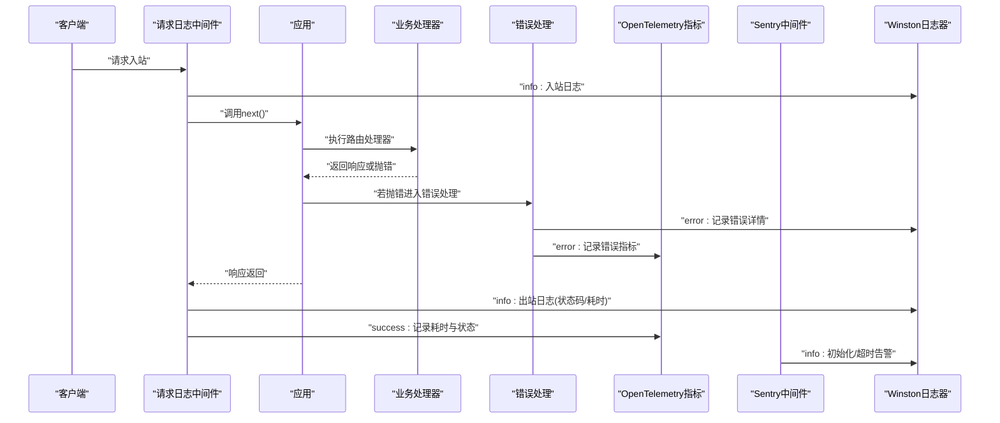
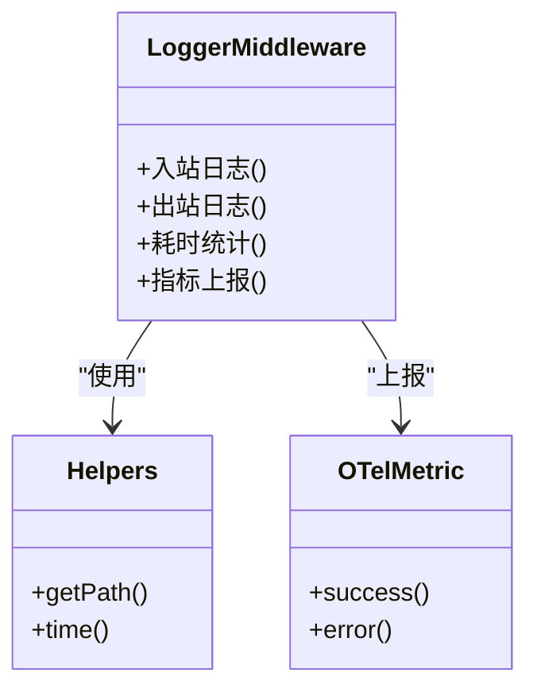
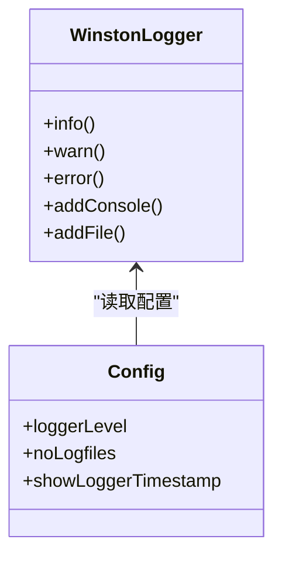
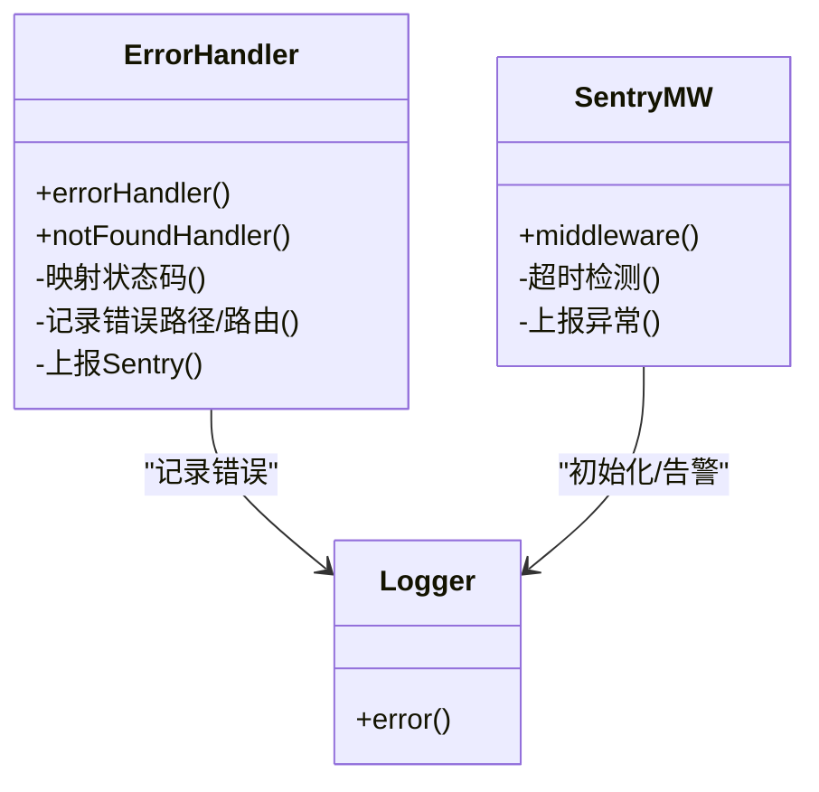
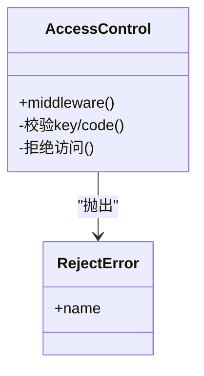
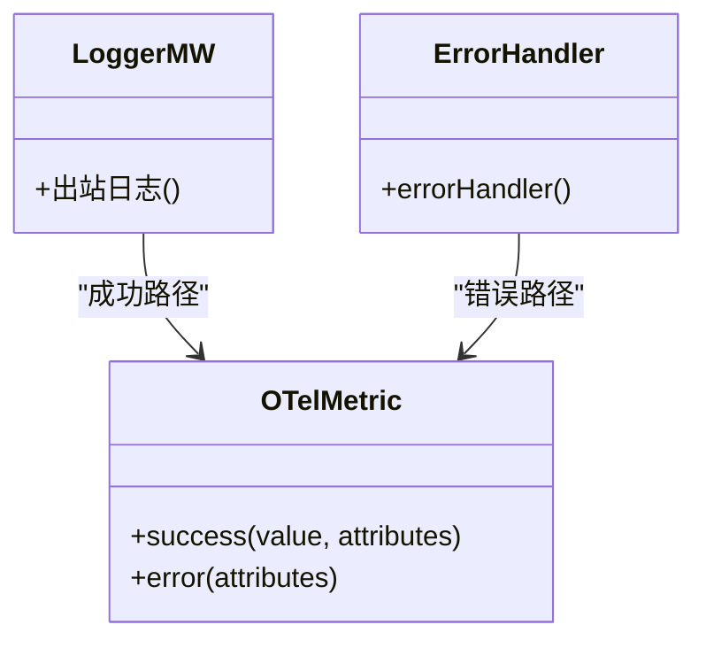
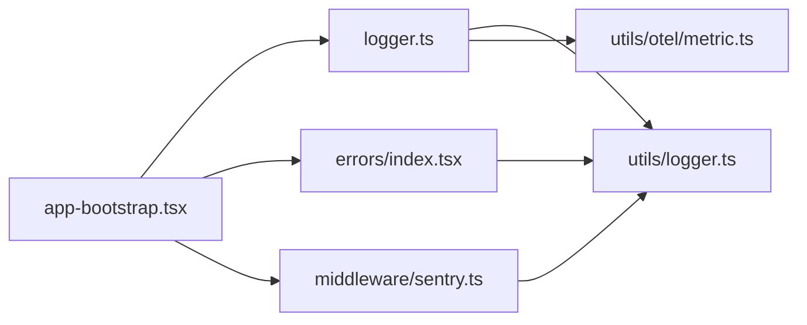
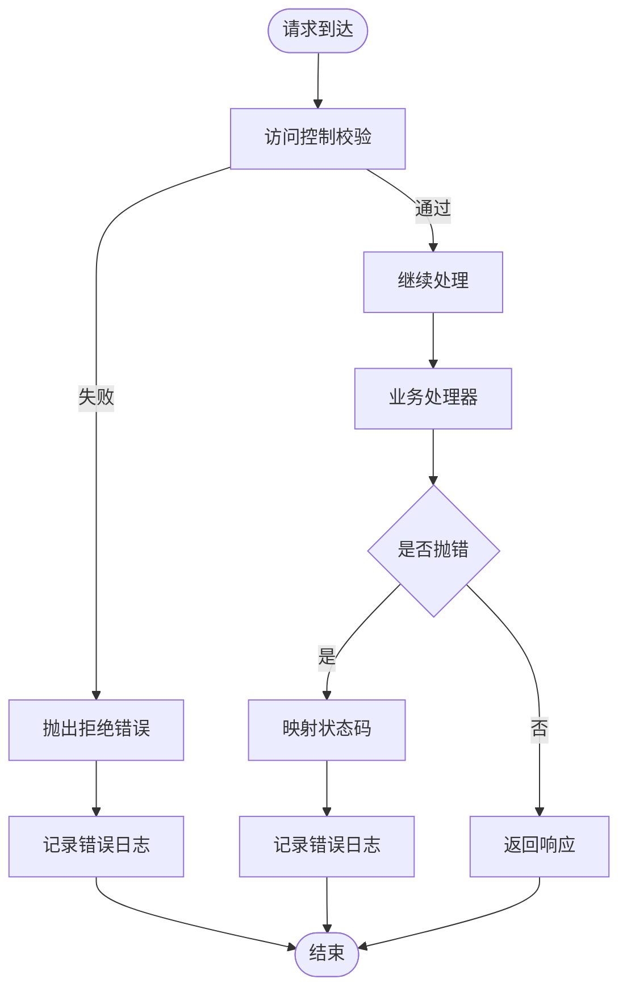
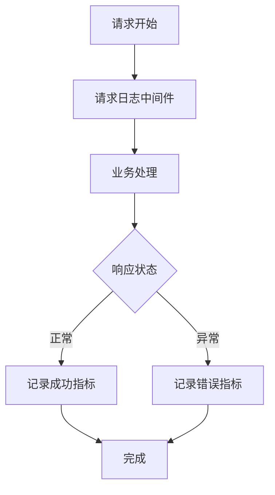

# 日志分析

<cite>
**本文引用的文件**
- [lib/middleware/logger.ts](file://lib/middleware/logger.ts)
- [lib/utils/logger.ts](file://lib/utils/logger.ts)
- [lib/app-bootstrap.tsx](file://lib/app-bootstrap.tsx)
- [lib/errors/index.tsx](file://lib/errors/index.tsx)
- [lib/middleware/access-control.ts](file://lib/middleware/access-control.ts)
- [lib/middleware/sentry.ts](file://lib/middleware/sentry.ts)
- [lib/utils/otel/metric.ts](file://lib/utils/otel/metric.ts)
- [lib/utils/helpers.ts](file://lib/utils/helpers.ts)
- [lib/config.ts](file://lib/config.ts)
- [lib/middleware/debug.ts](file://lib/middleware/debug.ts)
- [lib/utils/debug-info.ts](file://lib/utils/debug-info.ts)
- [lib/utils/cache/index.ts](file://lib/utils/cache/index.ts)
- [lib/utils/cache/memory.ts](file://lib/utils/cache/memory.ts)
- [lib/utils/proxy/unify-proxy.ts](file://lib/utils/proxy/unify-proxy.ts)
- [lib/routes/test/index.ts](file://lib/routes/test/index.ts)
- [lib/errors/types/reject.ts](file://lib/errors/types/reject.ts)
- [lib/errors/types/request-in-progress.ts](file://lib/errors/types/request-in-progress.ts)
- [lib/errors/types/invalid-parameter.ts](file://lib/errors/types/invalid-parameter.ts)
- [lib/middleware/CLAUDE.md](file://lib/middleware/CLAUDE.md)
</cite>

## 目录
1. [简介](#简介)
2. [项目结构与日志相关组件](#项目结构与日志相关组件)
3. [核心日志组件](#核心日志组件)
4. [架构总览](#架构总览)
5. [详细组件分析](#详细组件分析)
6. [依赖关系分析](#依赖关系分析)
7. [性能与日志开销](#性能与日志开销)
8. [日志格式与字段解读](#日志格式与字段解读)
9. [访问控制日志与错误日志](#访问控制日志与错误日志)
10. [性能日志与指标](#性能日志与指标)
11. [日志分析最佳实践](#日志分析最佳实践)
12. [常见问题与诊断流程](#常见问题与诊断流程)
13. [日志轮转、存储与安全](#日志轮转存储与安全)
14. [结论](#结论)

## 简介
本文件面向RSSHub使用者与运维人员，系统化梳理RSSHub的日志体系，重点围绕logger.ts的实现与日志格式展开，解释不同日志级别（debug/info/warn/error）的使用场景，覆盖访问控制日志、错误日志与性能日志的结构与解读方法，并提供基于grep/awk等工具的高效日志分析技巧，以及针对路由匹配失败、缓存问题与第三方API错误的诊断流程。同时讨论日志轮转、存储策略与安全注意事项，帮助快速定位问题并持续优化系统稳定性与性能。

## 项目结构与日志相关组件
RSSHub的日志系统由“中间件层日志”“全局日志记录器”“错误处理与Sentry集成”“OpenTelemetry指标”四部分组成，贯穿请求生命周期，形成“请求入站/出站”“错误捕获/上报”“性能度量”的闭环。



图表来源
- [lib/app-bootstrap.tsx](file://lib/app-bootstrap.tsx#L1-L54)
- [lib/middleware/logger.ts](file://lib/middleware/logger.ts#L1-L46)
- [lib/errors/index.tsx](file://lib/errors/index.tsx#L1-L82)
- [lib/middleware/sentry.ts](file://lib/middleware/sentry.ts#L1-L28)
- [lib/utils/logger.ts](file://lib/utils/logger.ts#L1-L48)
- [lib/utils/otel/metric.ts](file://lib/utils/otel/metric.ts#L30-L68)
- [lib/utils/helpers.ts](file://lib/utils/helpers.ts#L1-L66)

章节来源
- [lib/middleware/CLAUDE.md](file://lib/middleware/CLAUDE.md#L76-L92)
- [lib/app-bootstrap.tsx](file://lib/app-bootstrap.tsx#L1-L54)

## 核心日志组件
- 请求日志中间件：记录请求入站与出站信息，包含方法、路径、状态码与耗时。
- 全局日志器：基于Winston，输出JSON格式日志到控制台与文件，支持级别过滤与时间戳。
- 错误处理：统一捕获异常，映射状态码，记录错误消息，并向Sentry上报。
- 性能指标：通过OpenTelemetry记录请求总量、错误总量与耗时直方图。
- 访问控制：对未授权访问抛出特定错误，便于审计与告警。
- 调试信息：统计命中缓存、ETag命中、错误数、热路径/路由等，辅助性能分析。

章节来源
- [lib/middleware/logger.ts](file://lib/middleware/logger.ts#L1-L46)
- [lib/utils/logger.ts](file://lib/utils/logger.ts#L1-L48)
- [lib/errors/index.tsx](file://lib/errors/index.tsx#L1-L82)
- [lib/utils/otel/metric.ts](file://lib/utils/otel/metric.ts#L30-L68)
- [lib/middleware/access-control.ts](file://lib/middleware/access-control.ts#L1-L26)
- [lib/middleware/debug.ts](file://lib/middleware/debug.ts#L1-L40)
- [lib/utils/debug-info.ts](file://lib/utils/debug-info.ts#L1-L24)

## 架构总览
下面以序列图展示一次典型请求的“日志与指标”生成流程。



图表来源
- [lib/middleware/logger.ts](file://lib/middleware/logger.ts#L1-L46)
- [lib/errors/index.tsx](file://lib/errors/index.tsx#L1-L82)
- [lib/utils/otel/metric.ts](file://lib/utils/otel/metric.ts#L30-L68)
- [lib/middleware/sentry.ts](file://lib/middleware/sentry.ts#L1-L28)
- [lib/utils/logger.ts](file://lib/utils/logger.ts#L1-L48)

## 详细组件分析

### 请求日志中间件（logger.ts）
- 功能要点
  - 记录入站请求：方法、路径、时间戳。
  - 记录出站响应：方法、路径、状态码（带颜色）、耗时。
  - 统计耗时并上报OpenTelemetry指标。
- 日志级别
  - 入站/出站使用info级别，便于常规观察。
- 可视化类图



图表来源
- [lib/middleware/logger.ts](file://lib/middleware/logger.ts#L1-L46)
- [lib/utils/helpers.ts](file://lib/utils/helpers.ts#L1-L66)
- [lib/utils/otel/metric.ts](file://lib/utils/otel/metric.ts#L30-L68)

章节来源
- [lib/middleware/logger.ts](file://lib/middleware/logger.ts#L1-L46)
- [lib/utils/helpers.ts](file://lib/utils/helpers.ts#L1-L66)

### 全局日志器（utils/logger.ts）
- 功能要点
  - 基于Winston创建日志器，支持控制台与文件输出。
  - 文件输出：error.log（仅error级别）、combined.log（全部级别）。
  - 控制台输出：彩色级别、可选时间戳。
  - JSON格式化，便于机器解析与日志平台接入。
- 日志级别
  - 通过配置项决定默认级别，支持info/warn/error/debug等。
- 可视化类图



图表来源
- [lib/utils/logger.ts](file://lib/utils/logger.ts#L1-L48)
- [lib/config.ts](file://lib/config.ts#L764-L791)

章节来源
- [lib/utils/logger.ts](file://lib/utils/logger.ts#L1-L48)
- [lib/config.ts](file://lib/config.ts#L764-L791)

### 错误处理与Sentry集成（errors/index.tsx 与 middleware/sentry.ts）
- 错误处理
  - 统一捕获异常，映射状态码（如404/403/503），记录错误消息。
  - 统计错误路径/路由，用于热点问题定位。
- Sentry中间件
  - 若启用DSN，记录超时异常并上报。
- 可视化类图



图表来源
- [lib/errors/index.tsx](file://lib/errors/index.tsx#L1-L82)
- [lib/middleware/sentry.ts](file://lib/middleware/sentry.ts#L1-L28)
- [lib/utils/logger.ts](file://lib/utils/logger.ts#L1-L48)

章节来源
- [lib/errors/index.tsx](file://lib/errors/index.tsx#L1-L82)
- [lib/middleware/sentry.ts](file://lib/middleware/sentry.ts#L1-L28)

### 访问控制日志（middleware/access-control.ts）
- 行为
  - 对非公开路径进行鉴权，未通过时抛出特定错误类型，便于审计与告警。
- 可视化类图



图表来源
- [lib/middleware/access-control.ts](file://lib/middleware/access-control.ts#L1-L26)
- [lib/errors/types/reject.ts](file://lib/errors/types/reject.ts#L1-L5)

章节来源
- [lib/middleware/access-control.ts](file://lib/middleware/access-control.ts#L1-L26)
- [lib/errors/types/reject.ts](file://lib/errors/types/reject.ts#L1-L5)

### 性能日志与指标（OpenTelemetry）
- 指标
  - 请求总量、错误总量、耗时直方图（秒/毫秒）。
  - 上报属性：路径、方法、状态码。
- 可视化类图



图表来源
- [lib/utils/otel/metric.ts](file://lib/utils/otel/metric.ts#L30-L68)
- [lib/middleware/logger.ts](file://lib/middleware/logger.ts#L1-L46)
- [lib/errors/index.tsx](file://lib/errors/index.tsx#L1-L82)

章节来源
- [lib/utils/otel/metric.ts](file://lib/utils/otel/metric.ts#L30-L68)

### 调试信息与缓存日志（middleware/debug.ts 与 cache）
- 调试信息
  - 统计请求数、命中缓存次数、ETag命中次数、错误数、热路径/路由。
- 缓存日志
  - 当未启用缓存时，记录警告提示，避免并发请求导致的异常行为。
- 可视化类图

```mermaid
classDiagram
class DebugMW {
+middleware()
-统计路径/路由()
-统计命中缓存/ETag()
}
class DebugInfo {
+hitCache
+request
+etag
+error
+paths
+routes
+errorPaths
+errorRoutes
}
class CacheIndex {
+init()
+get()/set()
-记录缓存不可用警告()
}
DebugMW --> DebugInfo : "更新"
CacheIndex --> Logger : "error : 缓存不可用"
```

图表来源
- [lib/middleware/debug.ts](file://lib/middleware/debug.ts#L1-L40)
- [lib/utils/debug-info.ts](file://lib/utils/debug-info.ts#L1-L24)
- [lib/utils/cache/index.ts](file://lib/utils/cache/index.ts#L1-L60)
- [lib/utils/cache/memory.ts](file://lib/utils/cache/memory.ts#L1-L45)

章节来源
- [lib/middleware/debug.ts](file://lib/middleware/debug.ts#L1-L40)
- [lib/utils/debug-info.ts](file://lib/utils/debug-info.ts#L1-L24)
- [lib/utils/cache/index.ts](file://lib/utils/cache/index.ts#L1-L60)
- [lib/utils/cache/memory.ts](file://lib/utils/cache/memory.ts#L1-L45)

## 依赖关系分析
- 中间件顺序影响日志与指标的采集时机，确保logger.ts在trace/sentry之后、access-control之前，以便获得更准确的耗时与状态。
- 错误处理位于路由注册之后，保证所有异常均被统一捕获与记录。
- OpenTelemetry指标与Winston日志相互独立，既可用于本地排查，也可对接监控平台。



图表来源
- [lib/app-bootstrap.tsx](file://lib/app-bootstrap.tsx#L1-L54)
- [lib/middleware/logger.ts](file://lib/middleware/logger.ts#L1-L46)
- [lib/errors/index.tsx](file://lib/errors/index.tsx#L1-L82)
- [lib/middleware/sentry.ts](file://lib/middleware/sentry.ts#L1-L28)
- [lib/utils/logger.ts](file://lib/utils/logger.ts#L1-L48)
- [lib/utils/otel/metric.ts](file://lib/utils/otel/metric.ts#L30-L68)

章节来源
- [lib/middleware/CLAUDE.md](file://lib/middleware/CLAUDE.md#L76-L92)
- [lib/app-bootstrap.tsx](file://lib/app-bootstrap.tsx#L1-L54)

## 性能与日志开销
- 日志级别与输出目标
  - 控制台输出便于开发调试，生产环境建议关闭控制台或降低级别，减少I/O开销。
  - 文件输出按级别分离，error.log仅记录错误，combined.log记录全部，便于分级检索。
- 指标与日志的权衡
  - 指标适合大规模聚合分析，日志适合细粒度定位。两者结合可兼顾可观测性与成本。
- 建议
  - 生产环境默认info级别，必要时临时提升至debug。
  - 对高频路径开启采样或限流，避免日志风暴。

[本节为通用建议，无需列出具体文件来源]

## 日志格式与字段解读
- JSON字段
  - timestamp：日志时间戳（YYYY-MM-DD HH:mm:ss.SSS）。
  - level：日志级别（info/warn/error等）。
  - message：日志内容（字符串）。
- 控制台输出
  - 彩色级别标识，可选显示时间戳，便于终端查看。
- 字段解读示例
  - 入站日志：包含请求方法与路径，用于识别访问来源与路由。
  - 出站日志：包含状态码与耗时，用于评估性能与异常。
  - 错误日志：包含错误名称与消息，便于快速定位问题类型。

章节来源
- [lib/utils/logger.ts](file://lib/utils/logger.ts#L1-L48)
- [lib/middleware/logger.ts](file://lib/middleware/logger.ts#L1-L46)

## 访问控制日志与错误日志
- 访问控制
  - 未通过鉴权会抛出特定错误类型，便于在日志中识别并报警。
- 错误日志
  - 统一映射状态码，记录错误消息与路径/路由信息，支持错误热点分析。
- 常见错误类型
  - 访问拒绝：403，通常与鉴权参数不匹配有关。
  - 路由不存在：404，可能为路由已删除或参数错误。
  - 第三方API错误：503，常由网络超时或上游服务异常引起。
- 可视化流程图



图表来源
- [lib/middleware/access-control.ts](file://lib/middleware/access-control.ts#L1-L26)
- [lib/errors/index.tsx](file://lib/errors/index.tsx#L1-L82)

章节来源
- [lib/middleware/access-control.ts](file://lib/middleware/access-control.ts#L1-L26)
- [lib/errors/index.tsx](file://lib/errors/index.tsx#L1-L82)

## 性能日志与指标
- 指标维度
  - 路径、方法、状态码、耗时（毫秒/秒）。
- 指标用途
  - 识别慢请求、高错误率路径与异常状态码分布。
- 可视化流程图



图表来源
- [lib/middleware/logger.ts](file://lib/middleware/logger.ts#L1-L46)
- [lib/utils/otel/metric.ts](file://lib/utils/otel/metric.ts#L30-L68)

章节来源
- [lib/utils/otel/metric.ts](file://lib/utils/otel/metric.ts#L30-L68)

## 日志分析最佳实践
- 结构化查询
  - 使用JSON字段过滤：按level筛选info/warn/error；按message关键字匹配特定问题。
- 时间范围与排序
  - 按timestamp排序，结合grep/awk筛选时间段内的日志。
- 高效命令示例（概念性说明）
  - 过滤错误：grep '"level":"error"' combined.log
  - 统计状态码分布：awk '{print $NF}' combined.log | sort | uniq -c
  - 提取耗时大于阈值的请求：awk '/耗时/ {if ($NF > 阈值) print}' combined.log
  - 查看最近N条日志：tail -n N combined.log
- 工具选择
  - jq：解析JSON字段，便于机器消费。
  - grep/awk/sed：文本过滤与格式化。
  - 日志平台：集中收集与可视化（如ELK/Graylog/Loki）。

[本节为通用实践指导，无需列出具体文件来源]

## 常见问题与诊断流程
- 路由匹配失败
  - 现象：404错误，错误消息提示路由不存在或已删除。
  - 诊断：检查路由参数、路径拼写；查看错误日志中的路径与匹配路由。
  - 参考
    - [lib/errors/index.tsx](file://lib/errors/index.tsx#L1-L82)
    - [lib/routes/test/index.ts](file://lib/routes/test/index.ts#L20-L58)
- 缓存问题
  - 现象：缓存不可用警告；命中率低或ETag频繁命中。
  - 诊断：确认缓存类型与可用性；查看缓存初始化与get/set逻辑；关注命中缓存/ETag统计。
  - 参考
    - [lib/utils/cache/index.ts](file://lib/utils/cache/index.ts#L1-L60)
    - [lib/utils/cache/memory.ts](file://lib/utils/cache/memory.ts#L1-L45)
    - [lib/middleware/debug.ts](file://lib/middleware/debug.ts#L1-L40)
    - [lib/utils/debug-info.ts](file://lib/utils/debug-info.ts#L1-L24)
- 第三方API错误
  - 现象：503错误，常见于网络超时或上游服务异常。
  - 诊断：检查上游接口状态、代理配置与重试策略；关注Sentry超时告警。
  - 参考
    - [lib/errors/index.tsx](file://lib/errors/index.tsx#L1-L82)
    - [lib/middleware/sentry.ts](file://lib/middleware/sentry.ts#L1-L28)
    - [lib/utils/proxy/unify-proxy.ts](file://lib/utils/proxy/unify-proxy.ts#L34-L61)
- 访问控制失败
  - 现象：403错误，鉴权参数不匹配或缺失。
  - 诊断：核对key/code参数与md5计算规则；查看拒绝错误日志。
  - 参考
    - [lib/middleware/access-control.ts](file://lib/middleware/access-control.ts#L1-L26)
    - [lib/errors/types/reject.ts](file://lib/errors/types/reject.ts#L1-L5)

章节来源
- [lib/errors/index.tsx](file://lib/errors/index.tsx#L1-L82)
- [lib/utils/cache/index.ts](file://lib/utils/cache/index.ts#L1-L60)
- [lib/utils/cache/memory.ts](file://lib/utils/cache/memory.ts#L1-L45)
- [lib/middleware/debug.ts](file://lib/middleware/debug.ts#L1-L40)
- [lib/utils/debug-info.ts](file://lib/utils/debug-info.ts#L1-L24)
- [lib/middleware/sentry.ts](file://lib/middleware/sentry.ts#L1-L28)
- [lib/utils/proxy/unify-proxy.ts](file://lib/utils/proxy/unify-proxy.ts#L34-L61)
- [lib/middleware/access-control.ts](file://lib/middleware/access-control.ts#L1-L26)
- [lib/errors/types/reject.ts](file://lib/errors/types/reject.ts#L1-L5)
- [lib/routes/test/index.ts](file://lib/routes/test/index.ts#L20-L58)

## 日志轮转、存储与安全
- 存储策略
  - 文件输出：error.log（仅error）、combined.log（全部）。建议结合系统日志轮转工具（如logrotate）进行定期轮转与压缩。
- 安全考虑
  - 控制台输出在生产环境建议关闭或限制级别，避免敏感信息泄露。
  - 敏感参数（如鉴权key）不应出现在日志中，需在记录前脱敏。
  - 日志访问权限应最小化，防止未授权读取。
- 配置项参考
  - 日志级别、是否输出文件、是否显示时间戳等。
  - 参考
    - [lib/config.ts](file://lib/config.ts#L764-L791)
    - [lib/utils/logger.ts](file://lib/utils/logger.ts#L1-L48)

章节来源
- [lib/config.ts](file://lib/config.ts#L764-L791)
- [lib/utils/logger.ts](file://lib/utils/logger.ts#L1-L48)

## 结论
RSSHub的日志系统以中间件为核心，结合Winston与OpenTelemetry，实现了从请求入站/出站、错误捕获到性能指标的完整可观测性闭环。通过合理配置日志级别、使用结构化日志与指标，配合grep/awk等工具，可以高效定位路由匹配失败、缓存问题与第三方API错误等常见问题。建议在生产环境中采用文件轮转与最小权限原则，确保日志系统的稳定性与安全性。