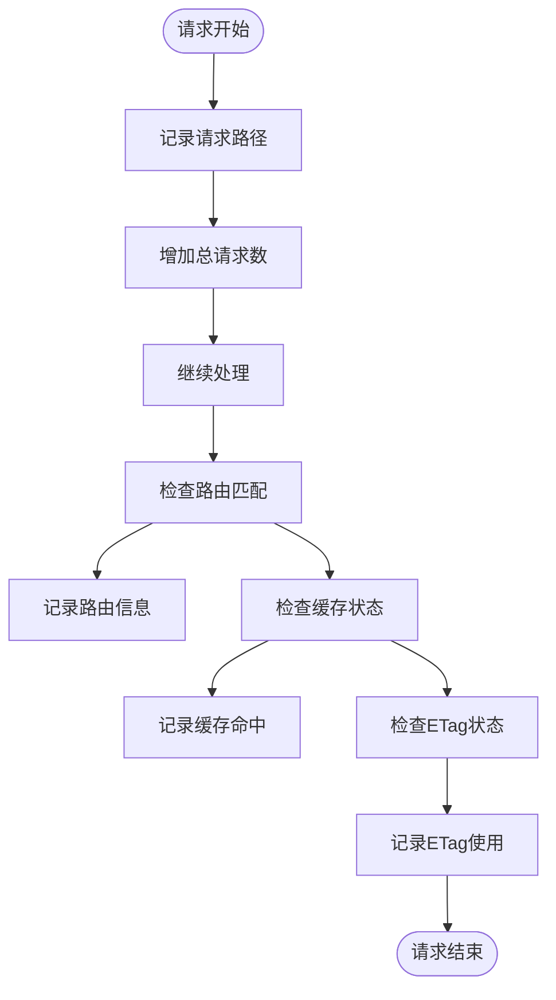
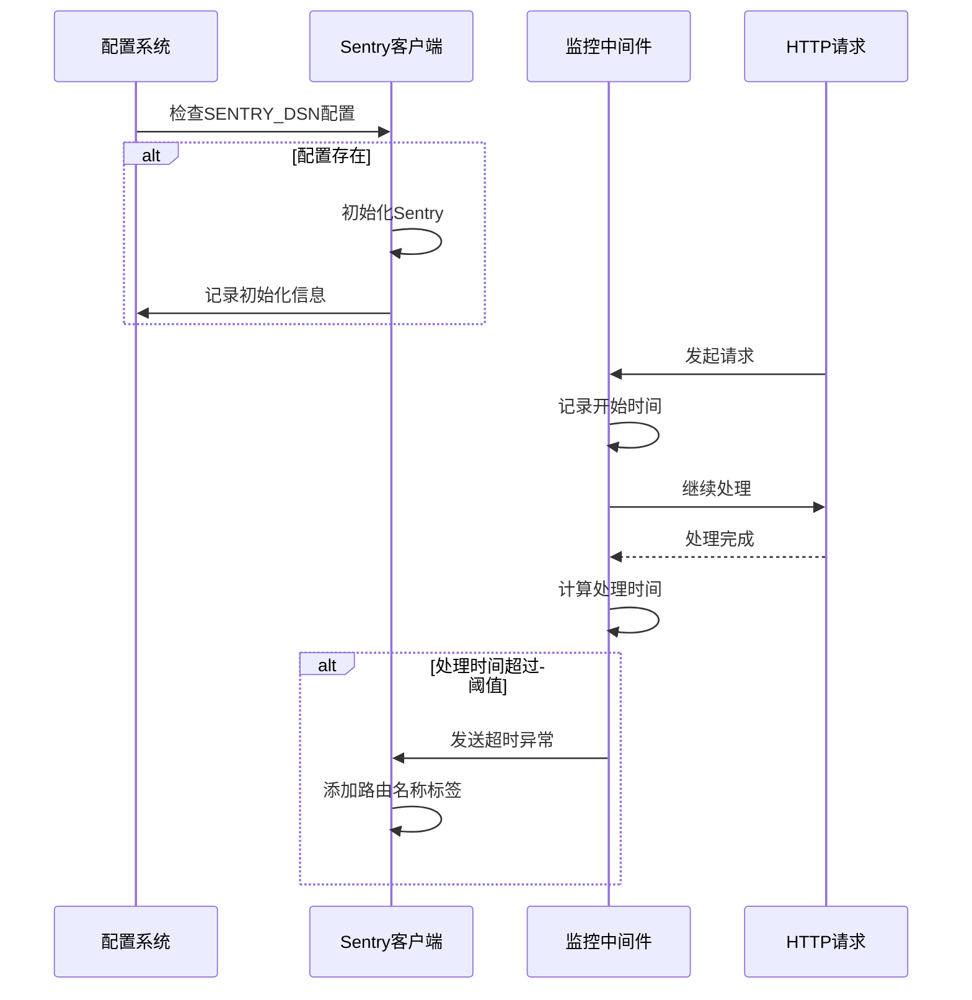
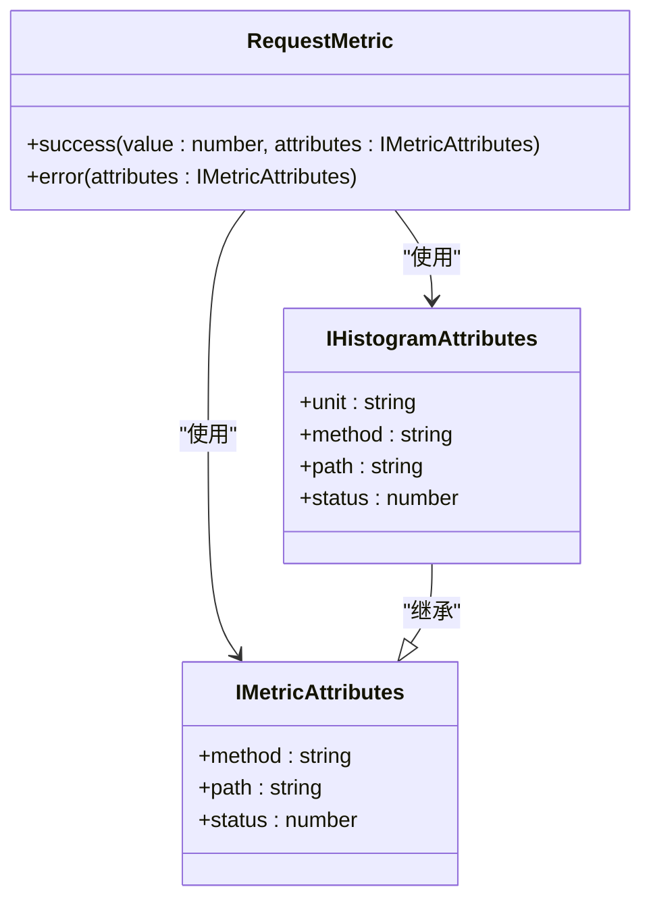
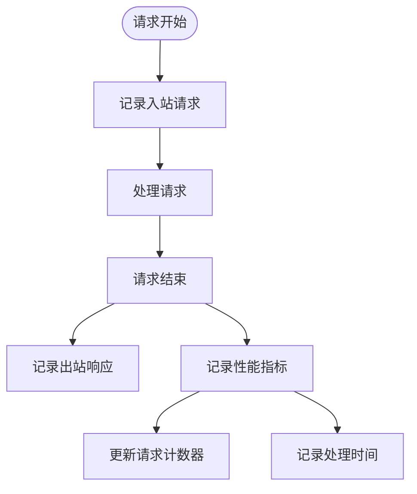
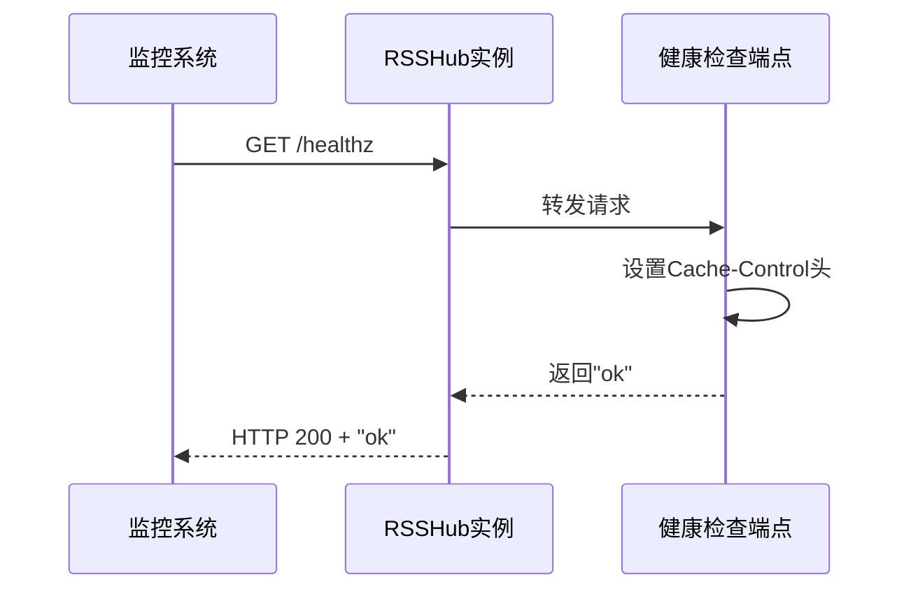

# 调试与监控

<cite>
**本文档中引用的文件**  
- [debug.ts](file://lib/middleware/debug.ts)
- [sentry.ts](file://lib/middleware/sentry.ts)
- [logger.ts](file://lib/middleware/logger.ts)
- [metrics.ts](file://lib/routes/metrics.ts)
- [debug-info.ts](file://lib/utils/debug-info.ts)
- [otel/metric.ts](file://lib/utils/otel/metric.ts)
- [config.ts](file://lib/config.ts)
- [healthz.ts](file://lib/routes/healthz.ts)
- [app-bootstrap.tsx](file://lib/app-bootstrap.tsx)
</cite>

## 目录
1. [简介](#简介)
2. [调试工具](#调试工具)
3. [错误监控](#错误监控)
4. [性能监控](#性能监控)
5. [日志分析](#日志分析)
6. [常见问题诊断](#常见问题诊断)
7. [系统健康检查](#系统健康检查)

## 简介
RSSHub 提供了一套完整的调试与监控系统，帮助开发者和运维人员有效管理和维护实例。本文档详细介绍了内置的调试工具、错误监控系统（如 Sentry）、性能监控指标的收集与分析、日志分析指南、常见问题的诊断流程以及系统健康检查方法。

## 调试工具

RSSHub 内置了多种调试中间件，用于收集和分析系统运行时的详细信息。这些工具可以帮助开发者理解请求处理流程、识别性能瓶颈和调试路由问题。

### 调试中间件使用方法
调试中间件通过 `debug.ts` 文件实现，它在请求处理过程中收集各种统计信息。该中间件会记录每个路径的请求次数、缓存命中情况和 ETag 使用情况。

**Diagram sources**
- [debug.ts](file://lib/middleware/debug.ts#L6-L37)

### 调试信息解读
调试信息通过 `debug-info.ts` 文件中的 `DebugInfo` 类型定义，包含以下关键指标：
- `hitCache`: 缓存命中次数
- `request`: 总请求数
- `etag`: ETag 响应次数
- `paths`: 各路径的请求次数统计
- `routes`: 各路由的匹配次数统计

这些信息可以帮助开发者分析流量模式、识别热门路由和评估缓存效率。

**Section sources**
- [debug-info.ts](file://lib/utils/debug-info.ts#L1-L25)
- [debug.ts](file://lib/middleware/debug.ts#L1-L41)

## 错误监控

RSSHub 集成了 Sentry 错误监控系统，用于捕获和报告运行时错误，特别是超时问题。

### Sentry 集成配置
Sentry 集成通过 `sentry.ts` 文件实现。当配置了 `SENTRY_DSN` 环境变量时，系统会自动初始化 Sentry 客户端。

**Diagram sources**
- [sentry.ts](file://lib/middleware/sentry.ts#L8-L28)

### 错误监控使用
Sentry 中间件会监控每个请求的处理时间，当处理时间超过 `SENTRY_ROUTE_TIMEOUT` 配置的阈值时，会自动上报超时异常。系统还会为每个异常添加节点名称和路由名称标签，便于问题定位。

**Section sources**
- [sentry.ts](file://lib/middleware/sentry.ts#L1-L29)
- [config.ts](file://lib/config.ts#L301-L304)

## 性能监控

RSSHub 使用 OpenTelemetry 收集详细的性能监控指标，帮助分析系统性能和识别瓶颈。

### 性能指标收集
性能指标通过 `otel/metric.ts` 文件实现，使用 Prometheus 格式导出以下关键指标：
- 请求总数 (`rsshub_request_total`)
- 请求错误总数 (`rsshub_request_error_total`)
- 请求持续时间直方图 (`rsshub_request_duration_seconds_bucket`)
- 请求持续时间毫秒直方图 (`rsshub_request_duration_milliseconds_bucket`)

**Diagram sources**
- [otel/metric.ts](file://lib/utils/otel/metric.ts#L34-L56)

### 性能数据分析
通过 `/metrics` 端点可以获取系统性能数据。这些数据包括：
- 各路由的请求频率
- 不同状态码的分布
- 请求处理时间的分布情况
- 性能瓶颈识别

性能数据的收集受 `DEBUG_INFO` 配置控制，只有在启用调试模式时才会激活。

**Section sources**
- [metrics.ts](file://lib/routes/metrics.ts#L1-L14)
- [otel/metric.ts](file://lib/utils/otel/metric.ts#L1-L69)
- [registry.ts](file://lib/registry.ts#L257-L259)

## 日志分析

RSSHub 提供了详细的日志记录功能，帮助从日志中识别问题和性能瓶颈。

### 日志格式与内容
日志系统通过 `logger.ts` 文件实现，记录每个请求的详细信息，包括：
- 请求方法和路径
- 响应状态码（带颜色编码）
- 处理时间
- 错误信息

**Diagram sources**
- [logger.ts](file://lib/middleware/logger.ts#L29-L43)

### 问题识别方法
通过分析日志可以识别以下问题：
- 高频率的 5xx 错误：表明系统存在严重问题
- 长时间运行的请求：可能指示性能瓶颈
- 特定路由的异常行为：可能需要优化或调试
- 缓存未命中的模式：可能需要调整缓存策略

日志级别由 `LOGGER_LEVEL` 配置控制，支持不同的详细程度。

**Section sources**
- [logger.ts](file://lib/middleware/logger.ts#L1-L46)
- [utils/logger.ts](file://lib/utils/logger.ts#L1-L49)

## 常见问题诊断

本节提供常见问题的诊断流程和解决方案。

### 请求超时问题
**诊断流程：**
1. 检查 Sentry 是否报告了超时异常
2. 查看日志中长时间运行的请求
3. 分析特定路由的性能指标
4. 检查外部服务的响应时间

**解决方案：**
- 增加 `SENTRY_ROUTE_TIMEOUT` 阈值
- 优化慢速路由的实现
- 检查网络连接和代理设置
- 考虑使用缓存减少外部请求

### 缓存问题
**诊断流程：**
1. 检查 `hitCache` 调试计数器的增长情况
2. 分析缓存命中率
3. 检查缓存配置（`CACHE_TYPE`, `CACHE_EXPIRE`）
4. 验证 Redis 连接（如果使用 Redis 缓存）

**解决方案：**
- 调整缓存过期时间
- 确保缓存服务正常运行
- 检查缓存键的生成逻辑
- 监控缓存内存使用情况

### 路由匹配问题
**诊断流程：**
1. 检查 `routes` 调试计数器的统计
2. 验证路由定义是否正确
3. 检查中间件执行顺序
4. 分析请求路径的规范化处理

**解决方案：**
- 修正路由定义
- 调整中间件顺序
- 确保路径处理逻辑正确
- 使用调试模式验证路由匹配

**Section sources**
- [debug.ts](file://lib/middleware/debug.ts#L1-L41)
- [config.ts](file://lib/config.ts#L263-L274)
- [app-bootstrap.tsx](file://lib/app-bootstrap.tsx#L27-L45)

## 系统健康检查

RSSHub 提供了自动化监控和健康检查功能，确保系统稳定运行。

### 健康检查端点
系统提供了 `/healthz` 健康检查端点，返回简单的 "ok" 响应。这个端点可用于：
- 负载均衡器的健康检查
- 容器编排系统的存活探针
- 监控系统的可达性测试

**Diagram sources**
- [healthz.ts](file://lib/routes/healthz.ts#L1-L9)

### 自动化监控设置
建议的自动化监控设置包括：
1. **存活检查**：定期调用 `/healthz` 端点
2. **性能监控**：集成 Prometheus 收集 `/metrics` 数据
3. **错误监控**：配置 Sentry 捕获异常
4. **日志监控**：集中收集和分析日志文件

通过这些监控措施，可以及时发现和解决系统问题，确保 RSSHub 实例的稳定运行。

**Section sources**
- [healthz.ts](file://lib/routes/healthz.ts#L1-L9)
- [registry.ts](file://lib/registry.ts#L255)
- [config.ts](file://lib/config.ts#L293-L304)