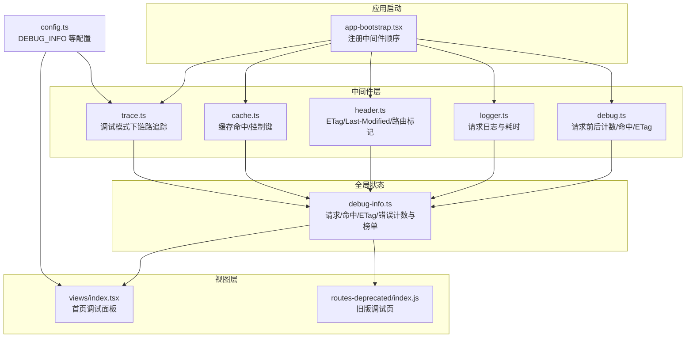
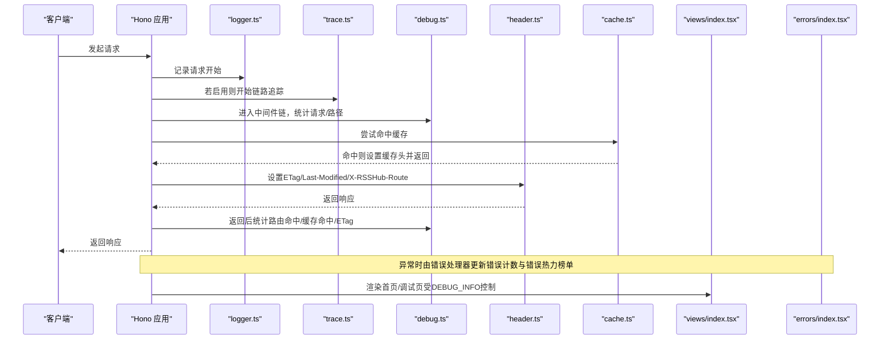
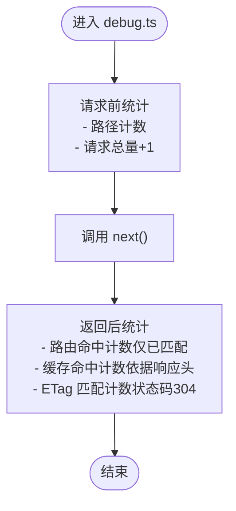

# 调试工具

<cite>
**本文引用的文件**
- [lib/middleware/debug.ts](file://lib/middleware/debug.ts)
- [lib/utils/debug-info.ts](file://lib/utils/debug-info.ts)
- [lib/app-bootstrap.tsx](file://lib/app-bootstrap.tsx)
- [lib/config.ts](file://lib/config.ts)
- [lib/middleware/logger.ts](file://lib/middleware/logger.ts)
- [lib/middleware/cache.ts](file://lib/middleware/cache.ts)
- [lib/middleware/header.ts](file://lib/middleware/header.ts)
- [lib/middleware/trace.ts](file://lib/middleware/trace.ts)
- [lib/errors/index.tsx](file://lib/errors/index.tsx)
- [lib/views/index.tsx](file://lib/views/index.tsx)
- [lib/routes-deprecated/index.js](file://lib/routes-deprecated/index.js)
- [lib/middleware/debug.test.ts](file://lib/middleware/debug.test.ts)
</cite>

## 目录
1. [简介](#简介)
2. [项目结构](#项目结构)
3. [核心组件](#核心组件)
4. [架构总览](#架构总览)
5. [组件详解](#组件详解)
6. [依赖关系分析](#依赖关系分析)
7. [性能与指标](#性能与指标)
8. [故障排查指南](#故障排查指南)
9. [结论](#结论)
10. [附录：使用示例与最佳实践](#附录使用示例与最佳实践)

## 简介
本文件系统性梳理 RSSHub 内置的调试中间件体系，重点围绕 debug.ts 中间件的实现原理、工作流程与配置启用方式，解释调试信息的输出格式与内容解读，并结合缓存命中、ETag 匹配、路由匹配等关键指标，帮助开发者快速定位路由问题、性能瓶颈与配置错误。同时说明调试工具与其他中间件（如缓存、日志、链路追踪）的交互关系，并给出不同部署环境下的调试策略与安全注意事项。

## 项目结构
RSSHub 的调试能力由“中间件 + 全局调试状态 + 视图渲染”三部分组成：
- 中间件层：debug.ts 在请求前后采集统计信息；logger.ts 输出请求日志；cache.ts 与 header.ts 影响缓存与 ETag 行为；trace.ts 在调试模式下开启链路追踪。
- 全局状态：debug-info.ts 维护全局调试计数器与热力榜单（路径/路由/错误路径/错误路由）。
- 视图层：views/index.tsx 与 routes-deprecated/index.js 将调试数据渲染到首页或调试页，受配置项控制是否显示。

图表来源
- [lib/app-bootstrap.tsx](file://lib/app-bootstrap.tsx#L25-L46)
- [lib/middleware/debug.ts](file://lib/middleware/debug.ts#L6-L38)
- [lib/utils/debug-info.ts](file://lib/utils/debug-info.ts#L1-L25)
- [lib/middleware/logger.ts](file://lib/middleware/logger.ts#L29-L45)
- [lib/middleware/cache.ts](file://lib/middleware/cache.ts#L1-L68)
- [lib/middleware/header.ts](file://lib/middleware/header.ts#L1-L55)
- [lib/middleware/trace.ts](file://lib/middleware/trace.ts#L1-L26)
- [lib/views/index.tsx](file://lib/views/index.tsx#L1-L127)
- [lib/routes-deprecated/index.js](file://lib/routes-deprecated/index.js#L1-L100)
- [lib/config.ts](file://lib/config.ts#L764-L791)

章节来源
- [lib/app-bootstrap.tsx](file://lib/app-bootstrap.tsx#L25-L46)
- [lib/config.ts](file://lib/config.ts#L764-L791)

## 核心组件
- 调试中间件 debug.ts：在请求进入前与返回后分别更新全局调试状态，统计请求总量、路径/路由命中次数、缓存命中次数、ETag 匹配次数。
- 全局调试状态 debug-info.ts：提供 get/set 接口，维护请求计数、命中计数、ETag 计数、错误计数及热力榜单（paths/routes/errorPaths/errorRoutes）。
- 视图渲染 views/index.tsx 与 routes-deprecated/index.js：根据配置决定是否显示调试面板，展示节点名、请求量、缓存命中率、ETag 匹配、运行时长、热门路由/路径、错误路由/路径等。
- 配置项 config.ts：DEBUG_INFO 控制调试信息的显示策略；enableRemoteDebugging 控制远程调试能力；loggerLevel/noLogfiles 等影响日志输出。

章节来源
- [lib/middleware/debug.ts](file://lib/middleware/debug.ts#L6-L38)
- [lib/utils/debug-info.ts](file://lib/utils/debug-info.ts#L1-L25)
- [lib/views/index.tsx](file://lib/views/index.tsx#L1-L127)
- [lib/routes-deprecated/index.js](file://lib/routes-deprecated/index.js#L1-L100)
- [lib/config.ts](file://lib/config.ts#L764-L791)

## 架构总览
调试工具的工作流如下：
- 应用启动时按固定顺序注册中间件，debug.ts 位于日志与链路追踪之后、模板与头部处理之前，确保能覆盖到路由匹配与缓存/ETag 的最终结果。
- 请求进入时，debug.ts 在 next() 前对路径与请求总量进行计数；返回后根据路由路径、缓存头与状态码更新命中/ETag/错误等统计。
- 错误处理器 errors/index.tsx 同样会更新错误计数与错误热力榜单，保证异常场景也能被统计。
- 视图层根据 DEBUG_INFO 配置决定是否渲染调试面板，展示各类指标与热力榜单。

图表来源
- [lib/app-bootstrap.tsx](file://lib/app-bootstrap.tsx#L25-L46)
- [lib/middleware/debug.ts](file://lib/middleware/debug.ts#L6-L38)
- [lib/middleware/logger.ts](file://lib/middleware/logger.ts#L29-L45)
- [lib/middleware/trace.ts](file://lib/middleware/trace.ts#L1-L26)
- [lib/middleware/cache.ts](file://lib/middleware/cache.ts#L1-L68)
- [lib/middleware/header.ts](file://lib/middleware/header.ts#L1-L55)
- [lib/errors/index.tsx](file://lib/errors/index.tsx#L13-L82)
- [lib/views/index.tsx](file://lib/views/index.tsx#L1-L127)

## 组件详解

### 调试中间件 debug.ts 实现原理与工作流程
- 请求进入前：
  - 对当前请求路径与请求总量进行自增计数。
- 执行 next() 后：
  - 获取已匹配的路由路径（若未匹配则为通配），仅对已匹配路由进行统计。
  - 若响应头包含特定缓存标识，则增加缓存命中计数。
  - 若状态码为 304，则增加 ETag 匹配计数。
- 该中间件不修改响应体，仅收集统计信息，便于后续视图层渲染。

图表来源
- [lib/middleware/debug.ts](file://lib/middleware/debug.ts#L6-L38)

章节来源
- [lib/middleware/debug.ts](file://lib/middleware/debug.ts#L6-L38)

### 全局调试状态 debug-info.ts
- 数据结构包含：
  - 请求总量、缓存命中、ETag 匹配、错误总数
  - 路由命中热力榜、路径命中热力榜
  - 错误路由热力榜、错误路径热力榜
- 提供 getDebugInfo 与 setDebugInfo 两个接口，用于读写全局状态。

章节来源
- [lib/utils/debug-info.ts](file://lib/utils/debug-info.ts#L1-L25)

### 视图层调试面板渲染
- views/index.tsx：
  - 根据 DEBUG_INFO 决定是否显示调试面板。
  - 展示节点名、Git 版本/日期、缓存时长、请求总量、请求频率、缓存命中率、ETag 匹配、运行时长、热门路由/路径、错误路由/路径等。
- routes-deprecated/index.js：
  - 旧版调试页同样基于 debug-info 的数据生成热门榜单与错误榜单。

章节来源
- [lib/views/index.tsx](file://lib/views/index.tsx#L1-L127)
- [lib/routes-deprecated/index.js](file://lib/routes-deprecated/index.js#L1-L100)

### 配置启用与显示策略
- DEBUG_INFO：
  - 取值为 'true' 时永久显示调试面板；
  - 取值为 'false' 时永远隐藏；
  - 取值为任意字符串时，需在请求中携带查询参数 ?debug=该字符串才显示。
- enableRemoteDebugging：
  - 控制远程调试能力（例如网络调试工具集成），与调试中间件无直接耦合，但可配合调试面板使用。

章节来源
- [lib/config.ts](file://lib/config.ts#L764-L791)

### 与其他中间件的交互关系
- 与缓存中间件 cache.ts：
  - cache.ts 在命中时设置特定响应头，debug.ts 通过检测该头判断缓存命中并计数。
- 与头部中间件 header.ts：
  - header.ts 生成 ETag 并可能将状态码改为 304，debug.ts 检测状态码并计数 ETag 匹配。
- 与日志中间件 logger.ts：
  - logger.ts 记录请求/响应与耗时，debug.ts 与之互补：前者聚焦统计与热力榜单，后者聚焦日志输出。
- 与链路追踪 trace.ts：
  - 仅在调试模式下启用，便于观察请求生命周期内的性能事件。
- 与错误处理器 errors/index.tsx：
  - 错误发生时更新错误计数与错误热力榜单，保证异常场景也能被统计。

章节来源
- [lib/middleware/cache.ts](file://lib/middleware/cache.ts#L1-L68)
- [lib/middleware/header.ts](file://lib/middleware/header.ts#L1-L55)
- [lib/middleware/logger.ts](file://lib/middleware/logger.ts#L29-L45)
- [lib/middleware/trace.ts](file://lib/middleware/trace.ts#L1-L26)
- [lib/errors/index.tsx](file://lib/errors/index.tsx#L13-L82)

## 依赖关系分析
- 中间件注册顺序（app-bootstrap.tsx）：
  - trimTrailingSlash → compress → jsxRenderer → mLogger → trace → sentry → access-control → debug → template → header → antiHotlink → parameter → cache
- 调试中间件位置：
  - debug.ts 位于 header 之前，确保 header.ts 生成的 ETag/Last-Modified 与 cache.ts 的缓存头能在 debug.ts 返回阶段被正确统计。
- 配置依赖：
  - DEBUG_INFO 决定调试面板是否渲染；
  - enableRemoteDebugging 影响远程调试能力；
  - loggerLevel/noLogfiles 控制日志输出级别与文件输出。

图表来源
- [lib/app-bootstrap.tsx](file://lib/app-bootstrap.tsx#L25-L46)

章节来源
- [lib/app-bootstrap.tsx](file://lib/app-bootstrap.tsx#L25-L46)
- [lib/config.ts](file://lib/config.ts#L764-L791)

## 性能与指标
- 请求总量与请求频率：
  - 通过调试面板展示请求总量与每分钟请求频率，辅助评估负载与突发流量。
- 缓存命中率：
  - 命中率 = 缓存命中次数 / 请求总量，用于评估缓存策略有效性。
- ETag 匹配：
  - 304 状态码计数反映客户端缓存复用程度，有助于判断前端缓存策略与 Last-Modified/ETag 生成是否合理。
- 热门路由/路径：
  - 基于 paths/routes 与 errorPaths/errorRoutes 的排序，快速识别高流量与高错误的路由，指导优化与限流。
- 链路追踪：
  - 在调试模式下开启 trace.ts，可观察请求生命周期内的事件与耗时，辅助定位慢点。

章节来源
- [lib/views/index.tsx](file://lib/views/index.tsx#L1-L127)
- [lib/routes-deprecated/index.js](file://lib/routes-deprecated/index.js#L1-L100)
- [lib/middleware/debug.ts](file://lib/middleware/debug.ts#L6-L38)
- [lib/middleware/cache.ts](file://lib/middleware/cache.ts#L1-L68)
- [lib/middleware/header.ts](file://lib/middleware/header.ts#L1-L55)
- [lib/middleware/trace.ts](file://lib/middleware/trace.ts#L1-L26)

## 故障排查指南
- 如何启用调试模式
  - 设置环境变量 DEBUG_INFO 为 'true'/'false'/任意字符串，并在请求中携带 ?debug=该字符串以临时显示调试面板。
  - 参考：[lib/config.ts](file://lib/config.ts#L764-L791)
- 如何查看调试信息
  - 访问首页或调试页，确认调试面板是否显示；若未显示，检查 DEBUG_INFO 与请求参数。
  - 参考：[lib/views/index.tsx](file://lib/views/index.tsx#L1-L127)、[lib/routes-deprecated/index.js](file://lib/routes-deprecated/index.js#L1-L100)
- 路由问题诊断
  - 查看“热门路由”与“错误路由”，定位高频或错误集中的路由，结合路由实现与上游服务状态排查。
  - 参考：[lib/middleware/debug.ts](file://lib/middleware/debug.ts#L6-L38)、[lib/errors/index.tsx](file://lib/errors/index.tsx#L13-L82)
- 性能瓶颈定位
  - 结合链路追踪（trace.ts）与日志耗时（logger.ts），观察慢点与异常；关注缓存命中率与 ETag 匹配，评估缓存策略与客户端缓存复用。
  - 参考：[lib/middleware/trace.ts](file://lib/middleware/trace.ts#L1-L26)、[lib/middleware/logger.ts](file://lib/middleware/logger.ts#L29-L45)
- 配置错误排查
  - 检查 DEBUG_INFO、enableRemoteDebugging、loggerLevel、noLogfiles 等配置项是否符合预期。
  - 参考：[lib/config.ts](file://lib/config.ts#L764-L791)
- 单元测试参考
  - 测试用例演示了 ETag 304 场景与请求计数、ETag 计数的断言，可作为调试行为验证的参考。
  - 参考：[lib/middleware/debug.test.ts](file://lib/middleware/debug.test.ts#L1-L42)

章节来源
- [lib/config.ts](file://lib/config.ts#L764-L791)
- [lib/views/index.tsx](file://lib/views/index.tsx#L1-L127)
- [lib/routes-deprecated/index.js](file://lib/routes-deprecated/index.js#L1-L100)
- [lib/middleware/debug.ts](file://lib/middleware/debug.ts#L6-L38)
- [lib/middleware/debug.test.ts](file://lib/middleware/debug.test.ts#L1-L42)
- [lib/errors/index.tsx](file://lib/errors/index.tsx#L13-L82)

## 结论
RSSHub 的调试工具通过 debug.ts 中间件与 debug-info.ts 全局状态，实现了对请求总量、缓存命中、ETag 匹配、错误计数与热力榜单的实时统计，并由视图层统一呈现。配合链路追踪与日志中间件，可在开发与生产环境中快速定位路由问题、性能瓶颈与配置错误。通过 DEBUG_INFO 等配置项，可灵活控制调试信息的显示范围与粒度，兼顾可观测性与安全性。

## 附录：使用示例与最佳实践

### 启用调试模式
- 方案一：永久显示
  - 设置环境变量 DEBUG_INFO='true'，重启服务后首页即显示调试面板。
  - 参考：[lib/config.ts](file://lib/config.ts#L764-L791)
- 方案二：按需显示
  - 设置 DEBUG_INFO='任意字符串'，请求时携带 ?debug=该字符串即可显示调试面板。
  - 参考：[lib/views/index.tsx](file://lib/views/index.tsx#L1-L127)、[lib/routes-deprecated/index.js](file://lib/routes-deprecated/index.js#L1-L100)

### 常见使用场景
- 诊断路由问题
  - 查看“热门路由/路径”与“错误路由/路径”，定位异常集中区域；结合路由实现与上游服务状态排查。
  - 参考：[lib/middleware/debug.ts](file://lib/middleware/debug.ts#L6-L38)、[lib/errors/index.tsx](file://lib/errors/index.tsx#L13-L82)
- 评估缓存效果
  - 关注“缓存命中率”与“ETag 匹配”；若命中率低且 ETag 匹配少，可优化缓存键与客户端缓存策略。
  - 参考：[lib/middleware/cache.ts](file://lib/middleware/cache.ts#L1-L68)、[lib/middleware/header.ts](file://lib/middleware/header.ts#L1-L55)
- 定位性能瓶颈
  - 在调试模式下开启链路追踪（trace.ts），观察慢点与异常；结合日志耗时（logger.ts）进行综合分析。
  - 参考：[lib/middleware/trace.ts](file://lib/middleware/trace.ts#L1-L26)、[lib/middleware/logger.ts](file://lib/middleware/logger.ts#L29-L45)

### 生产环境使用建议
- 限制调试信息可见范围
  - 将 DEBUG_INFO 设为特定字符串，并通过内部渠道传递该字符串，避免对外暴露调试面板。
  - 参考：[lib/config.ts](file://lib/config.ts#L764-L791)
- 控制日志输出
  - 使用 loggerLevel/noLogfiles 控制日志级别与文件输出，避免敏感信息泄露。
  - 参考：[lib/config.ts](file://lib/config.ts#L764-L791)
- 安全注意事项
  - 调试面板可能暴露内部路由与运行时信息，仅在受控网络内启用；必要时配合访问控制中间件。
  - 参考：[lib/app-bootstrap.tsx](file://lib/app-bootstrap.tsx#L25-L46)