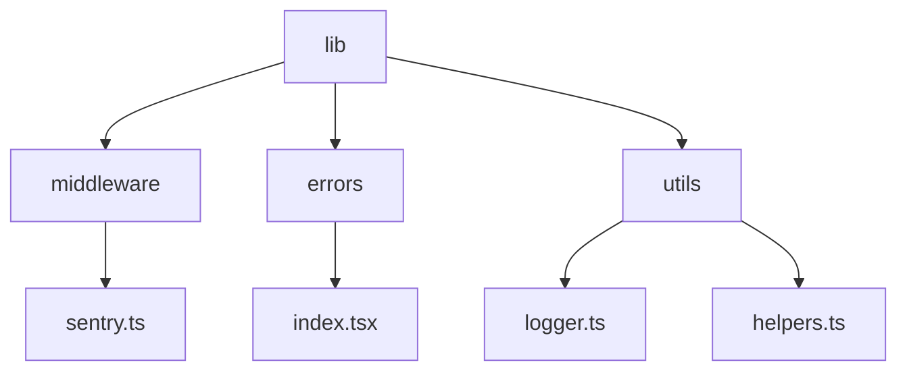
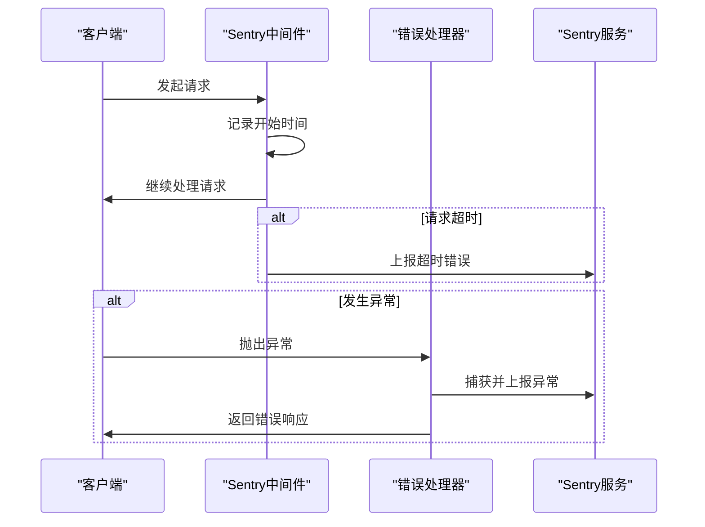
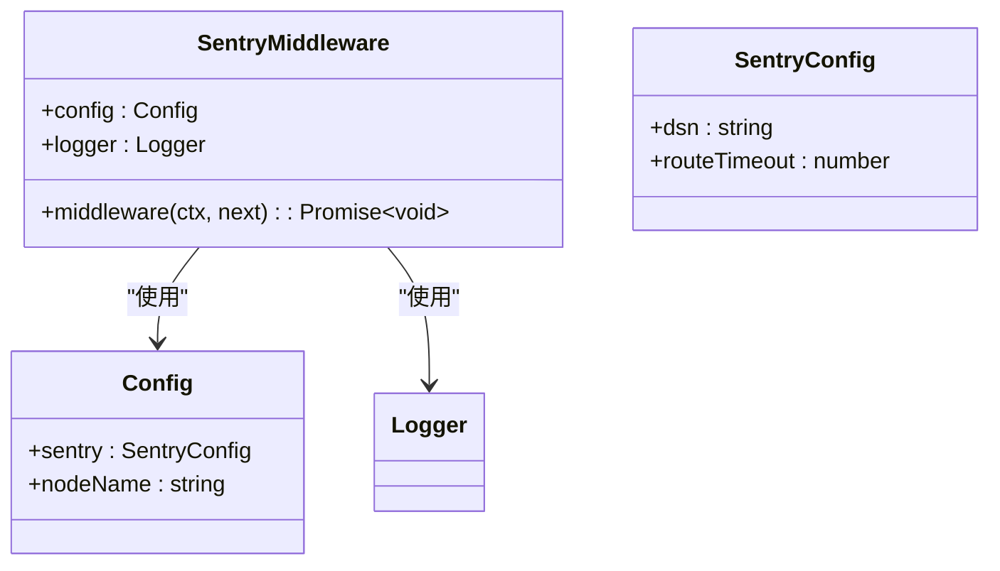
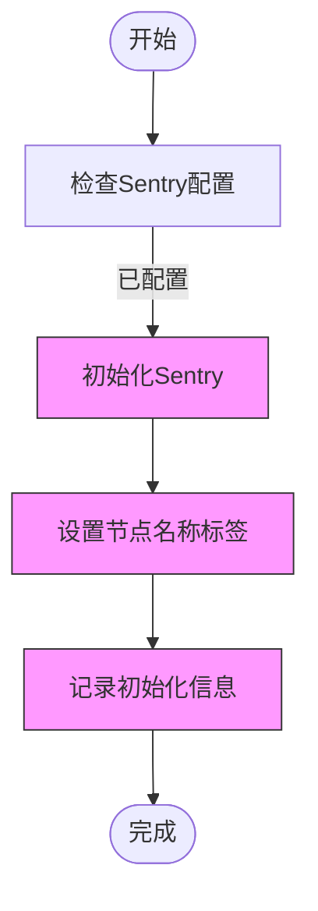
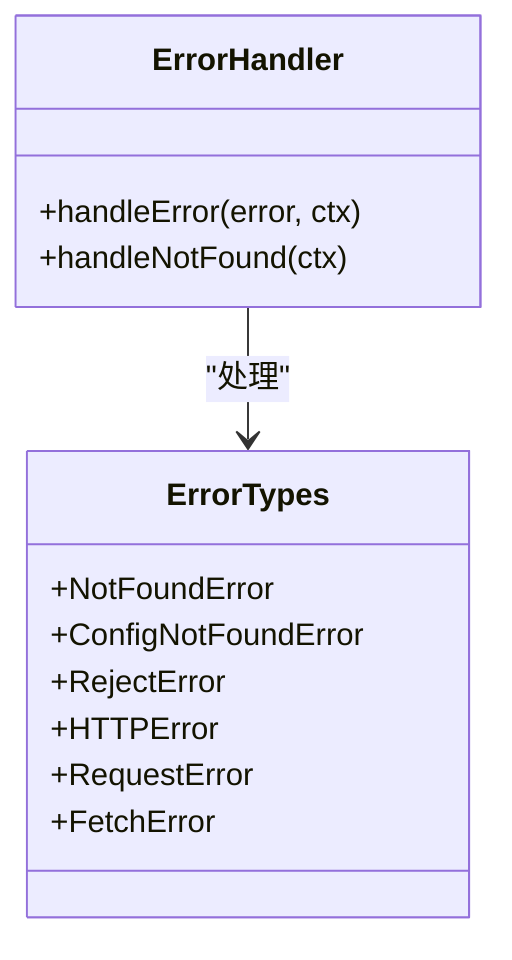

# 错误监控

<cite>
**本文档引用的文件**
- [sentry.ts](file://lib/middleware/sentry.ts)
- [index.tsx](file://lib/errors/index.tsx)
- [config.ts](file://lib/config.ts)
- [helpers.ts](file://lib/utils/helpers.ts)
- [logger.ts](file://lib/utils/logger.ts)
- [not-found.ts](file://lib/errors/types/not-found.ts)
- [config-not-found.ts](file://lib/errors/types/config-not-found.ts)
- [reject.ts](file://lib/errors/types/reject.ts)
- [error.tsx](file://lib/views/error.tsx)
</cite>

## 目录
1. [简介](#简介)
2. [项目结构](#项目结构)
3. [核心组件](#核心组件)
4. [架构概述](#架构概述)
5. [详细组件分析](#详细组件分析)
6. [依赖分析](#依赖分析)
7. [性能考虑](#性能考虑)
8. [故障排除指南](#故障排除指南)
9. [结论](#结论)

## 简介
RSSHub 是一个开源的 RSS 生成器，通过集成 Sentry 实现了全面的错误监控系统。本文档详细介绍了 RSSHub 与 Sentry 的集成实现和使用方法，包括错误捕获机制、配置选项、错误分类和处理策略。文档还讨论了错误监控与日志系统的协同工作方式，以及如何建立有效的错误告警机制。

## 项目结构
RSSHub 的项目结构清晰，主要组件位于 `lib` 目录下。错误监控相关的核心文件包括 `middleware/sentry.ts` 和 `errors/index.tsx`，这些文件负责与 Sentry 集成和错误处理。



**图源**
- [sentry.ts](file://lib/middleware/sentry.ts)
- [index.tsx](file://lib/errors/index.tsx)
- [logger.ts](file://lib/utils/logger.ts)
- [helpers.ts](file://lib/utils/helpers.ts)

## 核心组件
RSSHub 的错误监控系统由多个核心组件构成，包括 Sentry 中间件、错误处理器和日志记录器。这些组件协同工作，确保错误能够被及时捕获、记录和上报。

**节源**
- [sentry.ts](file://lib/middleware/sentry.ts)
- [index.tsx](file://lib/errors/index.tsx)

## 架构概述
RSSHub 的错误监控架构基于 Sentry 实现，通过中间件和错误处理器捕获和上报错误。系统在启动时初始化 Sentry，并在请求处理过程中监控超时和异常。



**图源**
- [sentry.ts](file://lib/middleware/sentry.ts)
- [index.tsx](file://lib/errors/index.tsx)

## 详细组件分析

### Sentry中间件分析
Sentry 中间件负责监控请求处理时间，并在超时时上报错误。中间件在系统启动时根据配置初始化 Sentry。



**图源**
- [sentry.ts](file://lib/middleware/sentry.ts)
- [config.ts](file://lib/config.ts)

### 错误处理器分析
错误处理器负责捕获和处理各种类型的错误，包括 HTTP 错误、请求错误和自定义错误。处理器会根据错误类型设置相应的 HTTP 状态码，并将错误信息上报到 Sentry。



**图源**
- [index.tsx](file://lib/errors/index.tsx)
- [config.ts](file://lib/config.ts)

### 错误分类和处理策略
RSSHub 定义了多种错误类型，每种类型都有相应的处理策略。系统能够区分客户端错误、服务器错误和第三方服务错误，并采取不同的响应措施。



**图源**
- [index.tsx](file://lib/errors/index.tsx)
- [not-found.ts](file://lib/errors/types/not-found.ts)
- [config-not-found.ts](file://lib/errors/types/config-not-found.ts)
- [reject.ts](file://lib/errors/types/reject.ts)

## 依赖分析
RSSHub 的错误监控系统依赖于多个外部库和内部模块。主要依赖包括 Sentry SDK、Hono 框架和 Winston 日志库。

```mermaid
graph LR
A[Sentry中间件] --> B[@sentry/node]
A --> C[Hono]
D[错误处理器] --> B
D --> C
E[日志记录器] --> F[winston]
A --> E
D --> E
```

**图源**
- [sentry.ts](file://lib/middleware/sentry.ts)
- [index.tsx](file://lib/errors/index.tsx)
- [logger.ts](file://lib/utils/logger.ts)
- [pnpm-lock.yaml](file://pnpm-lock.yaml)

**节源**
- [sentry.ts](file://lib/middleware/sentry.ts)
- [index.tsx](file://lib/errors/index.tsx)
- [logger.ts](file://lib/utils/logger.ts)
- [pnpm-lock.yaml](file://pnpm-lock.yaml)

## 性能考虑
错误监控系统对性能的影响经过精心设计，确保在捕获错误的同时不会显著影响系统性能。Sentry 的初始化和错误上报都是异步进行的，避免阻塞主请求处理流程。

**节源**
- [sentry.ts](file://lib/middleware/sentry.ts)
- [index.tsx](file://lib/errors/index.tsx)

## 故障排除指南
当遇到错误监控相关问题时，可以参考以下步骤进行排查：

1. 检查 Sentry DSN 配置是否正确
2. 验证网络连接是否正常
3. 查看日志文件中的错误信息
4. 确认 Sentry 服务是否可用

**节源**
- [sentry.ts](file://lib/middleware/sentry.ts)
- [index.tsx](file://lib/errors/index.tsx)
- [logger.ts](file://lib/utils/logger.ts)

## 结论
RSSHub 通过集成 Sentry 实现了全面的错误监控系统，能够有效捕获和处理各种类型的错误。系统的架构设计合理，性能影响小，为生产环境的稳定运行提供了有力保障。