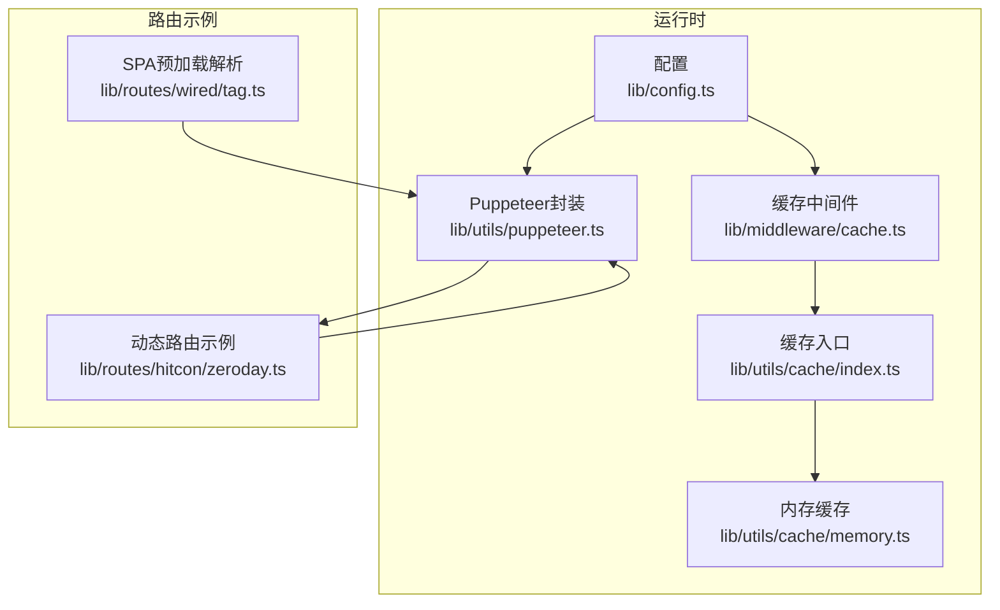
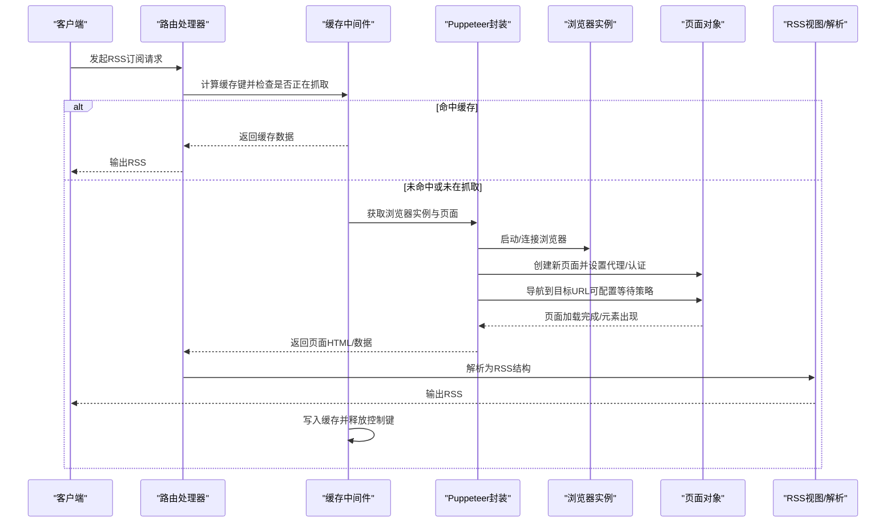
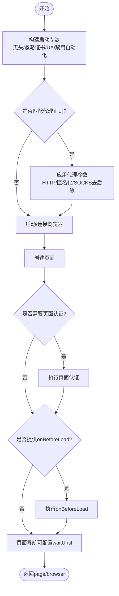
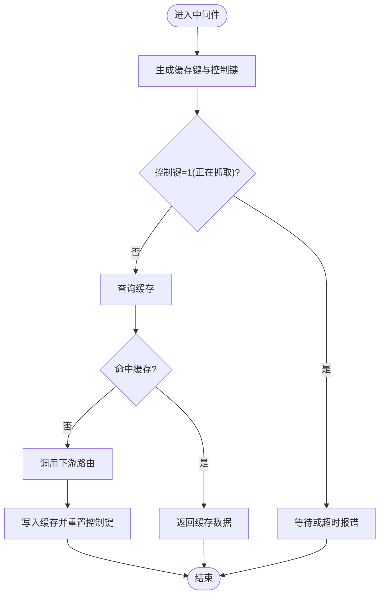
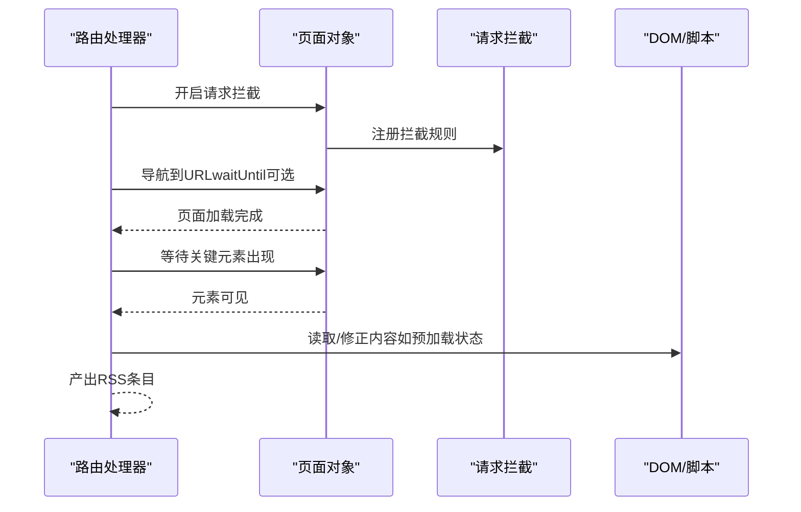
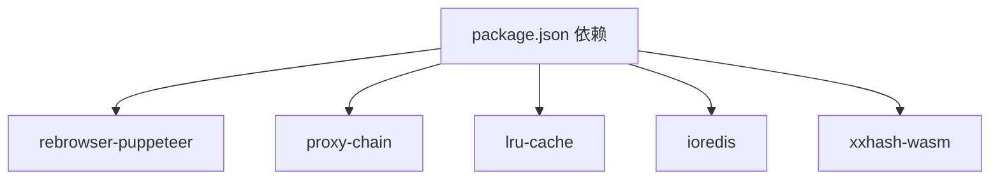

# 动态解析

<cite>
**本文引用的文件列表**
- [.puppeteerrc.cjs](file://.puppeteerrc.cjs)
- [lib/config.ts](file://lib/config.ts)
- [lib/utils/puppeteer.ts](file://lib/utils/puppeteer.ts)
- [lib/utils/puppeteer.test.ts](file://lib/utils/puppeteer.test.ts)
- [lib/middleware/cache.ts](file://lib/middleware/cache.ts)
- [lib/utils/cache/index.ts](file://lib/utils/cache/index.ts)
- [lib/utils/cache/memory.ts](file://lib/utils/cache/memory.ts)
- [lib/routes/hitcon/zeroday.ts](file://lib/routes/hitcon/zeroday.ts)
- [lib/routes/wired/tag.ts](file://lib/routes/wired/tag.ts)
- [lib/routes/telegram/channel-media.ts](file://lib/routes/telegram/channel-media.ts)
- [lib/routes.test.ts](file://lib/routes.test.ts)
- [package.json](file://package.json)
- [README.md](file://README.md)
</cite>

## 目录
1. [引言](#引言)
2. [项目结构](#项目结构)
3. [核心组件](#核心组件)
4. [架构总览](#架构总览)
5. [详细组件分析](#详细组件分析)
6. [依赖关系分析](#依赖关系分析)
7. [性能考量](#性能考量)
8. [故障排查指南](#故障排查指南)
9. [结论](#结论)
10. [附录](#附录)

## 引言
本技术文档围绕“动态内容解析”展开，系统性阐述在RSSHub中如何利用puppeteer处理JavaScript渲染的动态网页，完成从页面加载、资源拦截、元素等待、异步数据请求，到最终生成RSS的完整流程。文档同时覆盖浏览器实例管理、代理与反爬虫策略、缓存与并发控制、以及与静态解析的性能对比，帮助读者在真实生产环境中平衡性能与稳定性。

## 项目结构
RSSHub采用模块化组织，动态解析能力主要由以下模块协同实现：
- 浏览器与页面管理：lib/utils/puppeteer.ts
- 配置与环境变量：lib/config.ts、.puppeteerrc.cjs
- 缓存中间件与存储：lib/middleware/cache.ts、lib/utils/cache/index.ts、lib/utils/cache/memory.ts
- 路由示例与用法：lib/routes/hitcon/zeroday.ts、lib/routes/wired/tag.ts 等
- 测试与验证：lib/utils/puppeteer.test.ts、lib/routes.test.ts

图表来源
- [lib/config.ts](file://lib/config.ts#L240-L339)
- [lib/utils/puppeteer.ts](file://lib/utils/puppeteer.ts#L1-L191)
- [lib/middleware/cache.ts](file://lib/middleware/cache.ts#L1-L84)
- [lib/utils/cache/index.ts](file://lib/utils/cache/index.ts#L1-L60)
- [lib/utils/cache/memory.ts](file://lib/utils/cache/memory.ts#L1-L44)
- [lib/routes/hitcon/zeroday.ts](file://lib/routes/hitcon/zeroday.ts#L51-L65)
- [lib/routes/wired/tag.ts](file://lib/routes/wired/tag.ts#L46-L66)

章节来源
- [lib/config.ts](file://lib/config.ts#L240-L339)
- [lib/utils/puppeteer.ts](file://lib/utils/puppeteer.ts#L1-L191)
- [lib/middleware/cache.ts](file://lib/middleware/cache.ts#L1-L84)
- [lib/utils/cache/index.ts](file://lib/utils/cache/index.ts#L1-L60)
- [lib/utils/cache/memory.ts](file://lib/utils/cache/memory.ts#L1-L44)
- [lib/routes/hitcon/zeroday.ts](file://lib/routes/hitcon/zeroday.ts#L51-L65)
- [lib/routes/wired/tag.ts](file://lib/routes/wired/tag.ts#L46-L66)

## 核心组件
- 浏览器实例与页面管理：提供统一的浏览器启动、连接、代理注入、页面创建与导航策略封装，支持WS端点直连与本地Chromium可执行路径。
- 缓存中间件：基于全局控制键与路由参数生成缓存键，避免同一路径并发重复抓取；支持内存与Redis两种后端。
- 配置中心：集中管理UA、代理、Puppeteer WS端点、Chromium可执行路径等运行参数。
- 路由示例：展示如何在路由中使用puppeteer进行请求拦截、等待元素、评估DOM并产出RSS。

章节来源
- [lib/utils/puppeteer.ts](file://lib/utils/puppeteer.ts#L1-L191)
- [lib/middleware/cache.ts](file://lib/middleware/cache.ts#L1-L84)
- [lib/config.ts](file://lib/config.ts#L240-L339)

## 架构总览
下图展示了从请求进入、缓存命中判断、浏览器实例获取、页面导航与拦截、到最终RSS输出的整体流程。

图表来源
- [lib/middleware/cache.ts](file://lib/middleware/cache.ts#L1-L84)
- [lib/utils/puppeteer.ts](file://lib/utils/puppeteer.ts#L64-L191)
- [lib/routes/hitcon/zeroday.ts](file://lib/routes/hitcon/zeroday.ts#L51-L65)

## 详细组件分析

### 组件A：Puppeteer浏览器与页面管理
- 浏览器启动与连接
  - 支持通过WS端点连接远程浏览器，或使用本地Chromium可执行路径启动。
  - 自动注入无头模式、忽略证书错误、禁用自动化特征、窗口位置等启动参数。
  - 可根据UA配置设置User-Agent。
- 代理与认证
  - 支持HTTP代理与部分SOCKS代理（去除协议后缀以适配Chromium）。
  - 对带认证的HTTP代理进行匿名化处理；对SOCKS/HTTPS代理带认证场景给出警告并跳过。
  - 页面级认证用于需要站点登录或鉴权的场景。
- 页面导航与拦截
  - 提供onBeforeLoad钩子，可在goto前执行自定义逻辑（如设置请求拦截、注入脚本等）。
  - 支持noGoto模式，允许外部自行控制导航。
  - 导航失败时，若启用多代理，会标记当前代理失败并抛出异常。
- 生命周期与资源回收
  - 为每个浏览器实例设置定时关闭，避免长时间占用进程。
  - 提供destroy回调用于显式关闭浏览器。

图表来源
- [lib/utils/puppeteer.ts](file://lib/utils/puppeteer.ts#L1-L191)

章节来源
- [lib/utils/puppeteer.ts](file://lib/utils/puppeteer.ts#L1-L191)
- [.puppeteerrc.cjs](file://.puppeteerrc.cjs#L1-L10)

### 组件B：缓存中间件与并发控制
- 缓存键生成
  - 使用路径、格式（默认rss）、limit参数组合计算哈希作为缓存键。
  - 控制键用于标识某路径是否正在抓取，避免并发重复抓取。
- 并发控制
  - 若检测到控制键为“正在抓取”，则轮询等待或超时后抛出“请求进行中”错误。
  - 抓取完成后写回缓存并重置控制键。
- 缓存后端
  - 支持内存LRU与Redis两种后端，按配置选择；当缓存不可用时记录告警并放宽限制。

图表来源
- [lib/middleware/cache.ts](file://lib/middleware/cache.ts#L1-L84)
- [lib/utils/cache/index.ts](file://lib/utils/cache/index.ts#L1-L60)
- [lib/utils/cache/memory.ts](file://lib/utils/cache/memory.ts#L1-L44)

章节来源
- [lib/middleware/cache.ts](file://lib/middleware/cache.ts#L1-L84)
- [lib/utils/cache/index.ts](file://lib/utils/cache/index.ts#L1-L60)
- [lib/utils/cache/memory.ts](file://lib/utils/cache/memory.ts#L1-L44)

### 组件C：配置中心与运行参数
- 关键配置项
  - puppeteerWSEndpoint：远程浏览器WS端点，用于连接已有浏览器实例。
  - chromiumExecutablePath：本地Chromium可执行路径，便于指定特定版本。
  - ua：User-Agent字符串，影响反爬虫与兼容性。
  - proxy：代理协议、主机、端口、认证、URL匹配正则、策略与健康检查等。
- 环境变量与默认值
  - 通过环境变量注入，结合默认值形成最终配置。

章节来源
- [lib/config.ts](file://lib/config.ts#L240-L339)

### 组件D：路由示例与最佳实践
- 请求拦截与懒加载
  - 在页面加载前开启请求拦截，仅放行document类型请求，阻断图片、脚本、样式等非必要资源，加速首屏渲染。
  - 通过等待元素出现（如特定表格单元）确保SPA或异步数据已就绪。
- SPA与预加载状态
  - 从脚本标签中提取预加载状态，结合DOM修正视频等媒体属性，保证RSS内容完整性。
- 多代理失败降级
  - 导航失败时，若启用多代理，标记当前代理失败并抛出异常，便于上层重试或切换代理。

图表来源
- [lib/routes/hitcon/zeroday.ts](file://lib/routes/hitcon/zeroday.ts#L51-L65)
- [lib/routes/wired/tag.ts](file://lib/routes/wired/tag.ts#L46-L66)

章节来源
- [lib/routes/hitcon/zeroday.ts](file://lib/routes/hitcon/zeroday.ts#L51-L65)
- [lib/routes/wired/tag.ts](file://lib/routes/wired/tag.ts#L46-L66)

## 依赖关系分析
- 运行时依赖
  - rebrowser-puppeteer：浏览器自动化核心库。
  - proxy-chain：代理匿名化工具。
  - lru-cache/ioredis：内存与Redis缓存后端。
  - xxhash-wasm：短键生成。
- 路由与测试
  - 路由示例演示了请求拦截、元素等待、预加载状态解析等典型场景。
  - 测试覆盖了浏览器生命周期、反检测效果与代理认证等关键行为。

图表来源
- [package.json](file://package.json#L118-L147)

章节来源
- [package.json](file://package.json#L118-L147)

## 性能考量
- 无头模式与资源优化
  - 默认启用无头模式，减少UI开销；通过请求拦截仅保留文档请求，显著降低网络与渲染成本。
- 缓存策略
  - 路由级缓存与全局并发控制相结合，避免重复抓取；内存与Redis双后端提升吞吐。
- 并发与超时
  - 控制键机制防止同一路径并发抓取；超时后自动释放，避免资源泄漏。
- 代理与反爬虫
  - UA轮换、代理匿名化、禁用自动化特征等手段降低被识别概率；多代理失败标记有助于快速降级。
- 与静态解析对比
  - 静态解析适合纯HTML源站，速度快但无法处理JS渲染；动态解析适合SPA/懒加载，准确性高但资源消耗更大。建议优先尝试静态解析，仅在必要时启用动态解析。

章节来源
- [lib/utils/puppeteer.ts](file://lib/utils/puppeteer.ts#L1-L191)
- [lib/middleware/cache.ts](file://lib/middleware/cache.ts#L1-L84)
- [lib/utils/cache/index.ts](file://lib/utils/cache/index.ts#L1-L60)

## 故障排查指南
- 浏览器启动失败
  - 检查chromiumExecutablePath是否正确；确认WS端点可用；查看日志中的代理配置与认证信息。
- 导航超时或失败
  - 调整waitUntil策略（如从domcontentloaded到networkidle0）；启用请求拦截减少非必要资源；在多代理场景下观察代理标记日志。
- 缓存命中异常
  - 确认缓存后端可用；检查控制键是否长期为1；核对路由参数变化导致的缓存键差异。
- 代理认证问题
  - HTTP代理带认证需匿名化；SOCKS/HTTPS代理带认证不被Chromium直接支持，应改用其他方案或移除认证。
- 反爬虫检测
  - 使用更贴近真实用户的UA；启用禁用自动化特征；适当增加等待时间；必要时引入验证码处理策略（如人工干预或第三方服务）。

章节来源
- [lib/utils/puppeteer.ts](file://lib/utils/puppeteer.ts#L1-L191)
- [lib/middleware/cache.ts](file://lib/middleware/cache.ts#L1-L84)
- [lib/utils/puppeteer.test.ts](file://lib/utils/puppeteer.test.ts#L1-L63)

## 结论
RSSHub在动态内容解析方面提供了完整的基础设施：稳定的浏览器实例管理、灵活的页面导航与拦截、完善的缓存与并发控制、以及可扩展的代理与反爬虫策略。通过合理配置与路由实践，可以在保证准确性的同时最大化性能与稳定性。建议在生产环境中结合静态解析与动态解析的混合策略，按站点特性选择最优方案。

## 附录
- 实际案例参考
  - 请求拦截与懒加载：参见 [lib/routes/hitcon/zeroday.ts](file://lib/routes/hitcon/zeroday.ts#L51-L65)
  - SPA预加载状态解析：参见 [lib/routes/wired/tag.ts](file://lib/routes/wired/tag.ts#L46-L66)
- 测试与验证
  - 浏览器生命周期与反检测测试：参见 [lib/utils/puppeteer.test.ts](file://lib/utils/puppeteer.test.ts#L1-L63)
  - RSS输出校验：参见 [lib/routes.test.ts](file://lib/routes.test.ts#L41-L86)
- 项目背景
  - 项目简介与部署参考：参见 [README.md](file://README.md#L1-L62)