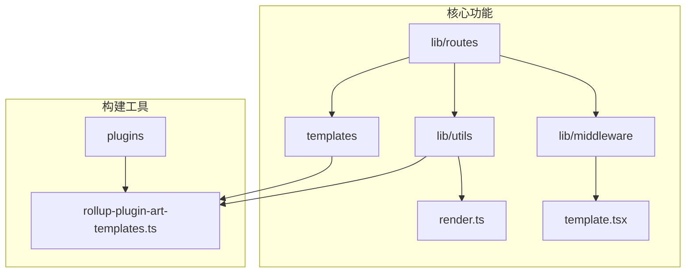
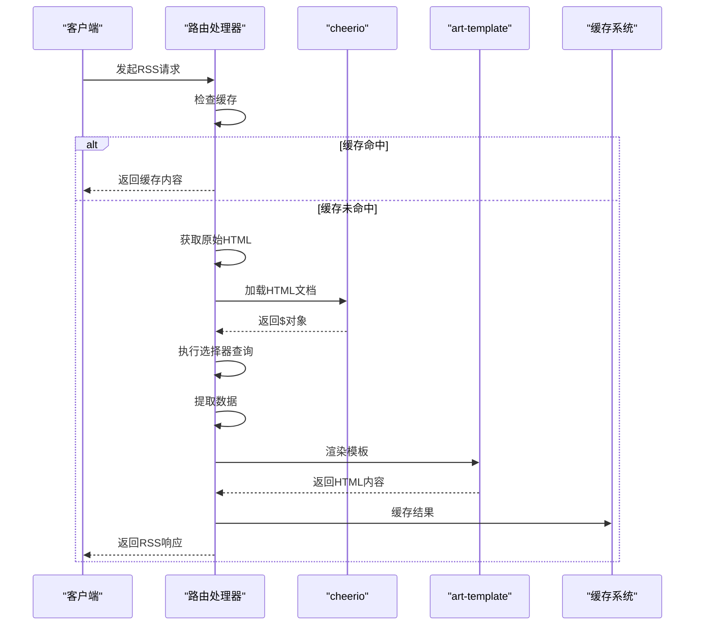
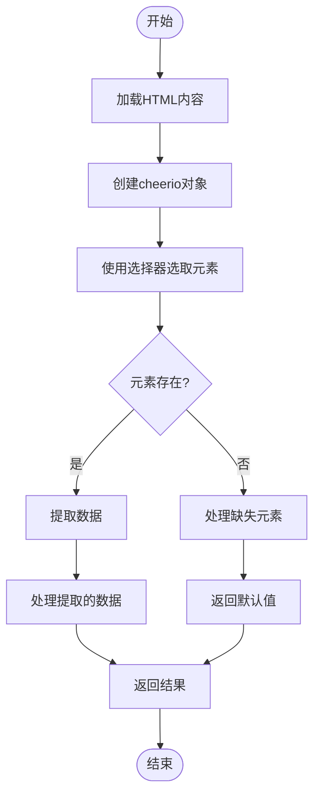
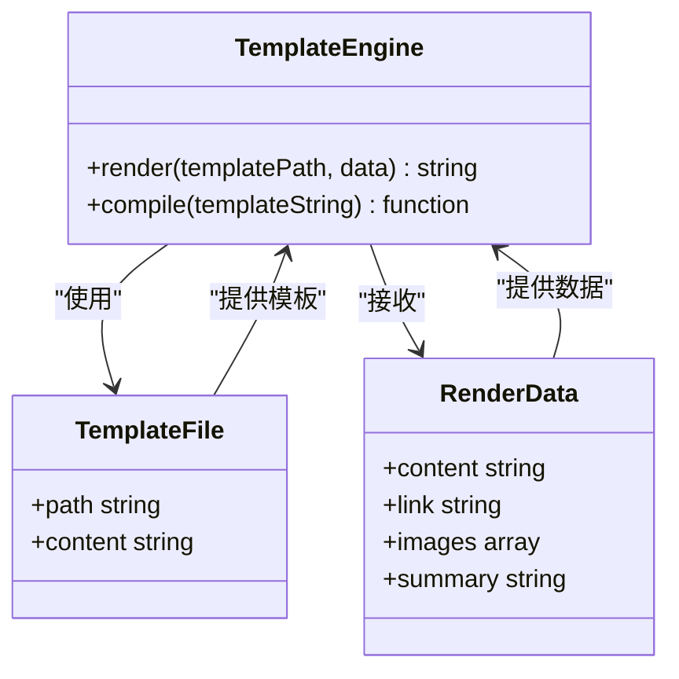
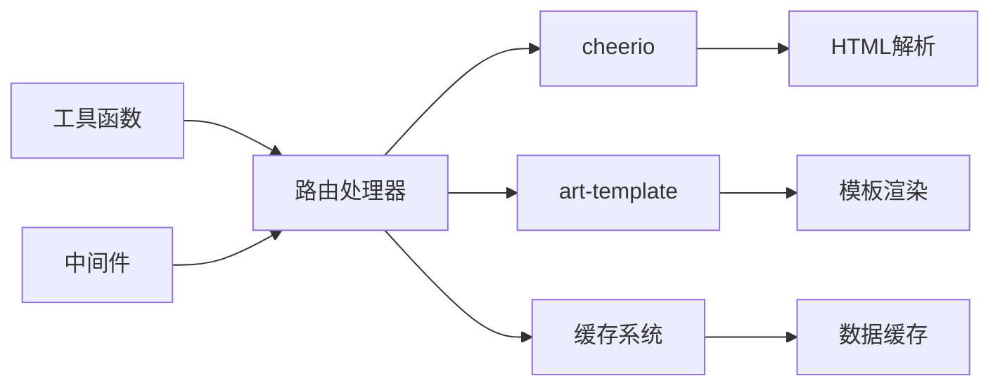

# 静态解析

<cite>
**本文档中引用的文件**  
- [utils/render.ts](file://lib/utils/render.ts)
- [rollup-plugin-art-templates.ts](file://plugins/rollup-plugin-art-templates.ts)
- [transformer-circuits/index.ts](file://lib/routes/transformer-circuits/index.ts)
- [instagram/common-utils.ts](file://lib/routes/instagram/common-utils.ts)
- [transformer-circuits/templates/article.art](file://lib/routes/transformer-circuits/templates/article.art)
- [instagram/templates/images.art](file://lib/routes/instagram/templates/images.art)
- [instagram/templates/video.art](file://lib/routes/instagram/templates/video.art)
- [gdut/oa-news.ts](file://lib/routes/gdut/oa-news.ts)
- [wechat-mp.ts](file://lib/utils/wechat-mp.ts)
- [parameter.ts](file://lib/middleware/parameter.ts)
- [eprice/rss.ts](file://lib/routes/eprice/rss.ts)
</cite>

## 目录
1. [介绍](#介绍)
2. [项目结构](#项目结构)
3. [核心组件](#核心组件)
4. [架构概述](#架构概述)
5. [详细组件分析](#详细组件分析)
6. [依赖分析](#依赖分析)
7. [性能考虑](#性能考虑)
8. [故障排除指南](#故障排除指南)
9. [结论](#结论)

## 介绍
本文档详细介绍了在RSSHub项目中使用cheerio进行HTML解析和art-template进行内容渲染的完整技术方案。文档涵盖了从原始HTML解析到结构化RSS输出的整个流程，重点讲解了选择器语法、DOM遍历、数据提取技巧、模板渲染和错误处理机制。

## 项目结构
RSSHub项目采用模块化结构，将HTML解析和内容渲染功能分布在不同的目录中。核心解析逻辑位于`lib/routes`目录下的各个路由实现中，而模板文件则分散在各个路由的`templates`子目录中。工具函数和中间件分别位于`lib/utils`和`lib/middleware`目录中，提供了通用的解析和处理功能。

**图源**  
- [render.ts](file://lib/utils/render.ts)
- [rollup-plugin-art-templates.ts](file://plugins/rollup-plugin-art-templates.ts)

**节源**  
- [render.ts](file://lib/utils/render.ts)
- [rollup-plugin-art-templates.ts](file://plugins/rollup-plugin-art-templates.ts)

## 核心组件
项目的核心组件包括cheerio用于HTML解析，art-template用于内容渲染，以及自定义的工具函数用于处理特定的解析需求。这些组件协同工作，实现了从原始HTML到结构化RSS内容的转换。

**节源**  
- [render.ts](file://lib/utils/render.ts)
- [transformer-circuits/index.ts](file://lib/routes/transformer-circuits/index.ts)

## 架构概述
系统的整体架构基于请求-处理-响应模式，通过中间件链处理RSS请求。当接收到请求时，系统会获取原始HTML内容，使用cheerio进行解析和数据提取，然后通过art-template将提取的数据渲染为格式化的RSS内容。

**图源**  
- [transformer-circuits/index.ts](file://lib/routes/transformer-circuits/index.ts)
- [common-utils.ts](file://lib/routes/instagram/common-utils.ts)

## 详细组件分析

### cheerio解析分析
cheerio在项目中被广泛用于HTML解析和数据提取。它提供了类似于jQuery的API，使得DOM操作变得简单直观。

#### 选择器语法和DOM遍历

**图源**  
- [transformer-circuits/index.ts](file://lib/routes/transformer-circuits/index.ts)
- [gdut/oa-news.ts](file://lib/routes/gdut/oa-news.ts)

**节源**  
- [transformer-circuits/index.ts](file://lib/routes/transformer-circuits/index.ts)
- [gdut/oa-news.ts](file://lib/routes/gdut/oa-news.ts)

### art-template渲染分析
art-template用于将提取的数据渲染为格式化的HTML内容，支持变量绑定、条件渲染和循环等特性。

#### 模板语法和渲染流程

**图源**  
- [common-utils.ts](file://lib/routes/instagram/common-utils.ts)
- [images.art](file://lib/routes/instagram/templates/images.art)
- [video.art](file://lib/routes/instagram/templates/video.art)

**节源**  
- [common-utils.ts](file://lib/routes/instagram/common-utils.ts)
- [images.art](file://lib/routes/instagram/templates/images.art)
- [video.art](file://lib/routes/instagram/templates/video.art)

## 依赖分析
项目依赖关系清晰，各个组件之间的耦合度适中。核心依赖包括cheerio用于HTML解析，art-template用于模板渲染，以及各种工具函数用于辅助处理。

**图源**  
- [render.ts](file://lib/utils/render.ts)
- [transformer-circuits/index.ts](file://lib/routes/transformer-circuits/index.ts)

**节源**  
- [render.ts](file://lib/utils/render.ts)
- [transformer-circuits/index.ts](file://lib/routes/transformer-circuits/index.ts)

## 性能考虑
在处理HTML解析和内容渲染时，性能优化是关键考虑因素。项目通过缓存机制、选择器优化和资源管理来提高整体性能。

### 缓存策略
项目实现了多层缓存机制，包括内存缓存和分布式缓存，有效减少了重复的HTML解析操作。通过`cache.tryGet`方法，系统能够检查缓存中是否已存在处理结果，避免重复工作。

### 选择器优化
在使用cheerio选择器时，建议使用具体的选择器而不是过于宽泛的选择器，以提高查询效率。例如，使用类选择器或ID选择器比使用标签选择器更高效。

### 内存管理
通过及时清理不必要的DOM元素和属性，系统有效控制了内存使用。在`gdut/oa-news.ts`中可以看到清理样式和冗余属性的示例代码。

**节源**  
- [transformer-circuits/index.ts](file://lib/routes/transformer-circuits/index.ts)
- [gdut/oa-news.ts](file://lib/routes/gdut/oa-news.ts)
- [parameter.ts](file://lib/middleware/parameter.ts)

## 故障排除指南
在HTML解析和内容渲染过程中可能会遇到各种问题，以下是一些常见问题及其解决方案。

### 处理空值和缺失元素
当使用cheerio选择器查询元素时，应始终检查元素是否存在，以避免空指针异常。可以使用条件语句或提供默认值来处理缺失元素的情况。

### 处理异常HTML结构
对于不规范的HTML结构，cheerio通常能够很好地处理。但在极端情况下，可能需要预处理HTML内容或使用更灵活的选择器策略。

### 错误处理机制
项目中实现了完善的错误处理机制，包括try-catch块和日志记录。在`transformer-circuits/index.ts`中可以看到错误处理的示例，当获取文章内容失败时，系统会记录错误日志并返回null值。

**节源**  
- [transformer-circuits/index.ts](file://lib/routes/transformer-circuits/index.ts)
- [wechat-mp.ts](file://lib/utils/wechat-mp.ts)
- [eprice/rss.ts](file://lib/routes/eprice/rss.ts)

## 结论
RSSHub项目通过cheerio和art-template的组合，实现了高效、灵活的HTML解析和内容渲染功能。cheerio提供了强大的DOM操作能力，使得从复杂HTML结构中提取数据变得简单直观。art-template则提供了丰富的模板语法，支持变量绑定、条件渲染和循环等特性，能够将提取的数据渲染为格式化的RSS内容。通过合理的缓存策略和错误处理机制，系统在性能和稳定性方面表现出色。这种技术方案为静态内容解析提供了一个完整的解决方案，适用于各种复杂的HTML解析场景。