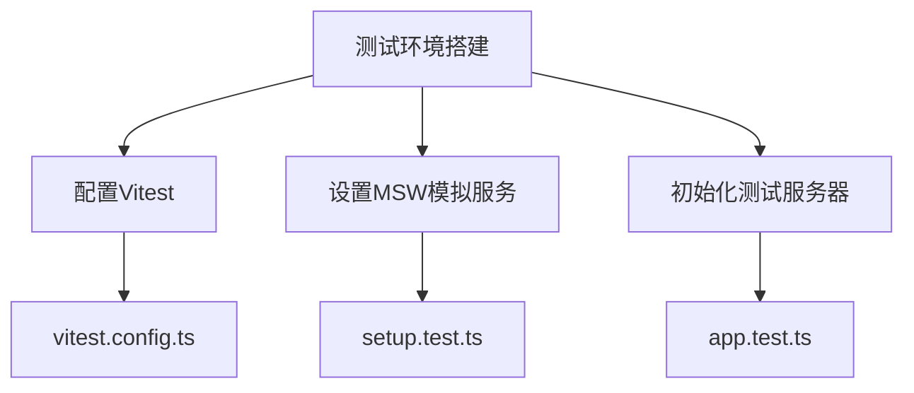
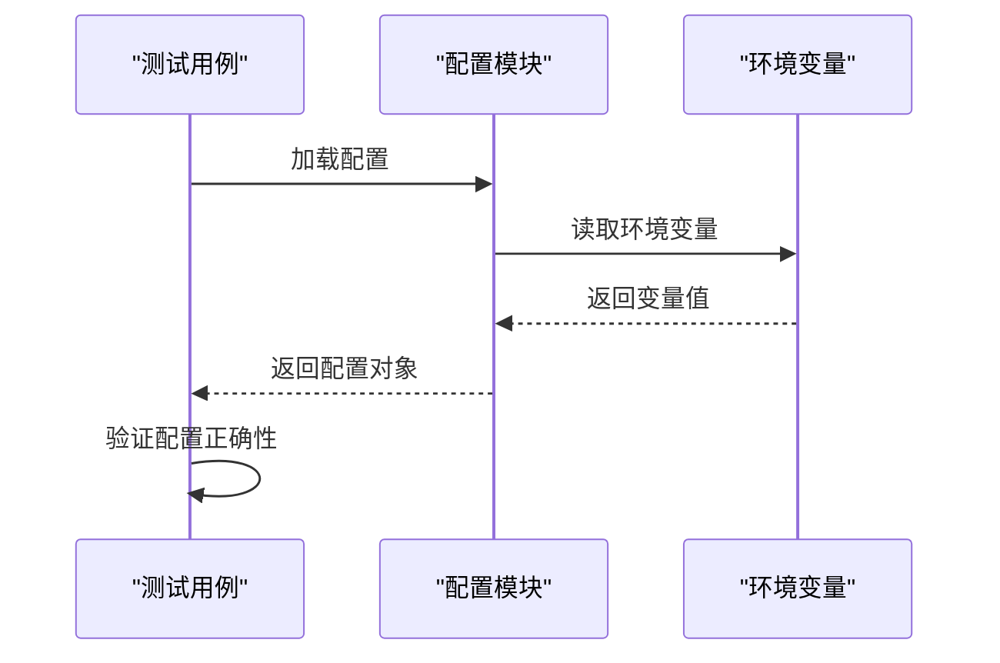
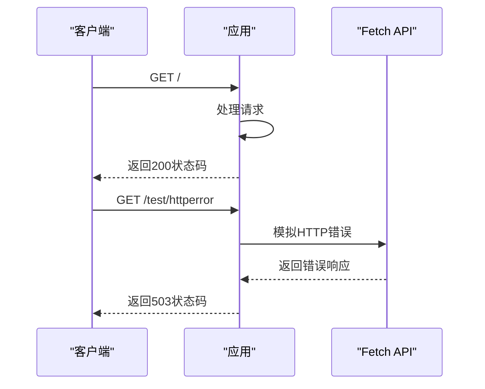
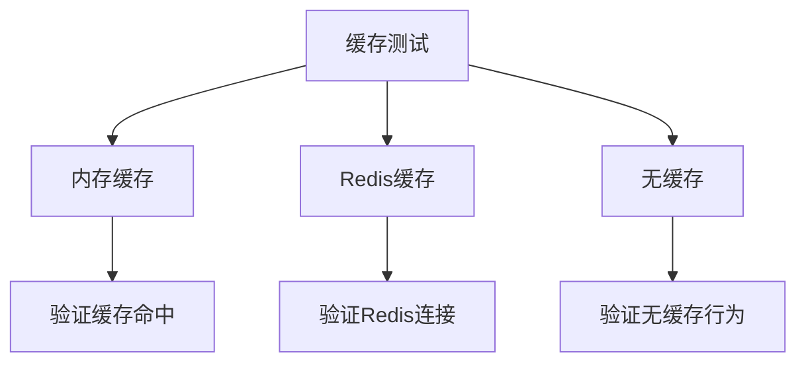
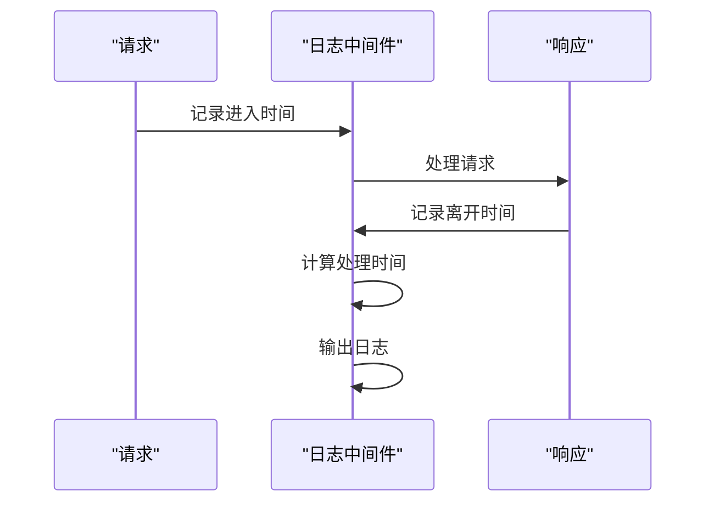
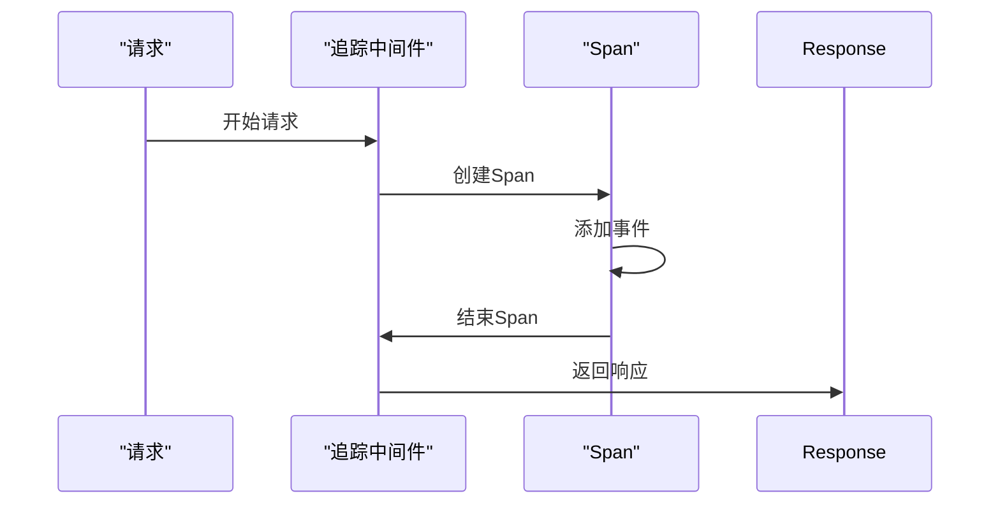
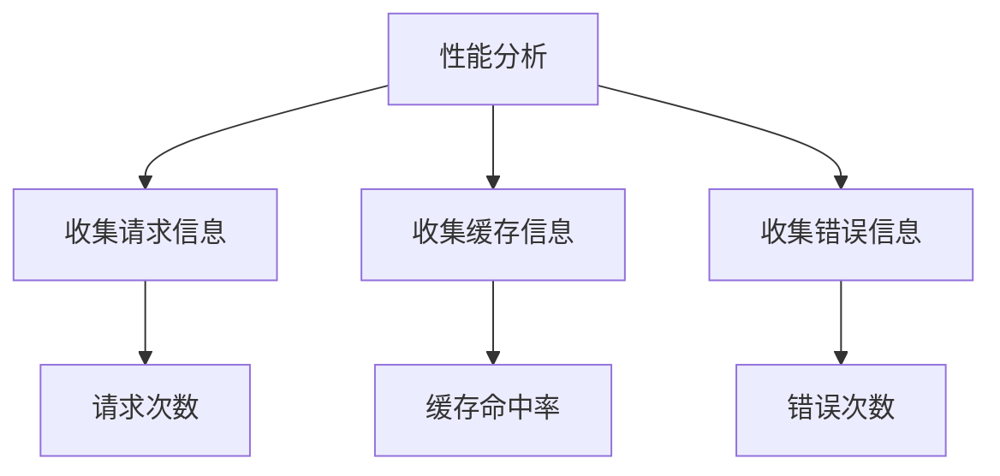
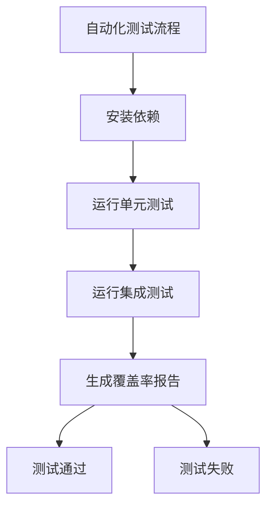
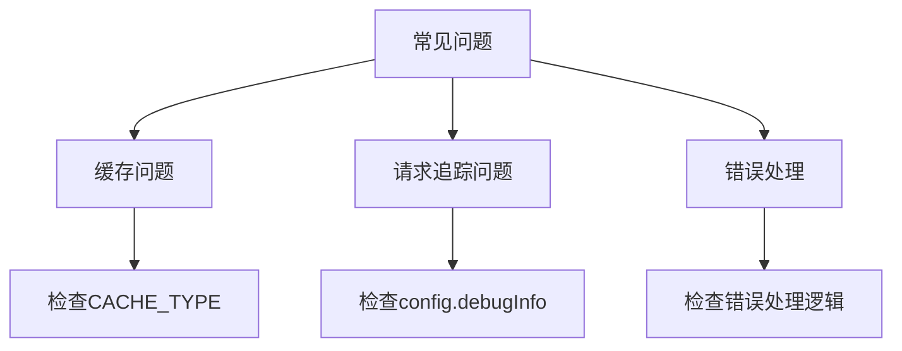

# 测试与调试

<cite>
**本文档引用的文件**  
- [vitest.config.ts](file://vitest.config.ts)
- [app.test.ts](file://lib/app.test.ts)
- [config.test.ts](file://lib/config.test.ts)
- [cache.test.ts](file://lib/middleware/cache.test.ts)
- [access-control.test.ts](file://lib/middleware/access-control.test.ts)
- [header.test.ts](file://lib/middleware/header.test.ts)
- [parameter.test.ts](file://lib/middleware/parameter.test.ts)
- [template.test.ts](file://lib/middleware/template.test.ts)
- [errors/index.test.ts](file://lib/errors/index.test.ts)
- [setup.test.ts](file://lib/setup.test.ts)
- [logger.ts](file://lib/middleware/logger.ts)
- [debug.ts](file://lib/middleware/debug.ts)
- [trace.ts](file://lib/middleware/trace.ts)
- [debug-info.ts](file://lib/utils/debug-info.ts)
</cite>

## 目录
1. [简介](#简介)
2. [测试环境搭建](#测试环境搭建)
3. [单元测试与集成测试](#单元测试与集成测试)
4. [HTTP响应模拟与边界条件测试](#http响应模拟与边界条件测试)
5. [调试工具使用](#调试工具使用)
6. [自动化测试流程](#自动化测试流程)
7. [常见问题排查](#常见问题排查)
8. [结论](#结论)

## 简介
RSSHub项目提供了一套完整的测试与调试机制，帮助开发者验证新路由的正确性和稳定性。本指南详细介绍了如何编写单元测试和集成测试，如何使用调试工具进行日志分析、请求追踪和性能分析，以及如何搭建测试环境进行路由测试。通过本指南，开发者可以确保代码质量和向后兼容性，快速定位和解决常见问题。

## 测试环境搭建

RSSHub使用Vitest作为测试框架，通过MSW（Mock Service Worker）进行HTTP请求的模拟。测试环境的搭建主要通过`vitest.config.ts`和`lib/setup.test.ts`文件进行配置。



**Diagram sources**
- [vitest.config.ts](file://vitest.config.ts#L1-L23)
- [setup.test.ts](file://lib/setup.test.ts#L1-L252)
- [app.test.ts](file://lib/app.test.ts#L1-L26)

**Section sources**
- [vitest.config.ts](file://vitest.config.ts#L1-L23)
- [setup.test.ts](file://lib/setup.test.ts#L1-L252)

## 单元测试与集成测试

RSSHub的测试策略包括单元测试和集成测试。单元测试主要验证单个函数或组件的正确性，而集成测试则验证多个组件之间的交互。

### 单元测试

单元测试通过Vitest框架实现，测试文件通常以`.test.ts`结尾。例如，`lib/config.test.ts`文件测试了配置模块的正确性。



**Diagram sources**
- [config.test.ts](file://lib/config.test.ts#L1-L100)

**Section sources**
- [config.test.ts](file://lib/config.test.ts#L1-L100)

### 集成测试

集成测试通过模拟HTTP请求来验证路由的正确性。例如，`lib/app.test.ts`文件测试了应用的根路径和请求重写功能。



**Diagram sources**
- [app.test.ts](file://lib/app.test.ts#L1-L26)

**Section sources**
- [app.test.ts](file://lib/app.test.ts#L1-L26)

## HTTP响应模拟与边界条件测试

RSSHub使用MSW来模拟HTTP响应，确保测试的稳定性和可重复性。`lib/setup.test.ts`文件定义了多个模拟请求，覆盖了各种边界条件。

### HTTP响应模拟

MSW通过拦截浏览器的fetch请求来模拟HTTP响应。例如，模拟OpenAI API的响应：

```typescript
http.post(`https://api.openai.mock/v1/chat/completions`, () =>
    HttpResponse.json({
        choices: [
            {
                message: {
                    content: 'AI processed content.',
                },
            },
        ],
    })
)
```

### 边界条件测试

边界条件测试包括测试缓存命中、ETag验证、错误处理等。例如，`lib/middleware/cache.test.ts`文件测试了不同缓存类型的行为。



**Diagram sources**
- [cache.test.ts](file://lib/middleware/cache.test.ts#L1-L191)

**Section sources**
- [cache.test.ts](file://lib/middleware/cache.test.ts#L1-L191)

## 调试工具使用

RSSHub提供了多种调试工具，包括日志记录、请求追踪和性能分析。

### 日志记录

`lib/middleware/logger.ts`文件实现了日志中间件，记录每个请求的进入和离开时间。



**Diagram sources**
- [logger.ts](file://lib/middleware/logger.ts#L1-L46)

**Section sources**
- [logger.ts](file://lib/middleware/logger.ts#L1-L46)

### 请求追踪

`lib/middleware/trace.ts`文件实现了请求追踪功能，使用OpenTelemetry进行分布式追踪。



**Diagram sources**
- [trace.ts](file://lib/middleware/trace.ts#L1-L27)

**Section sources**
- [trace.ts](file://lib/middleware/trace.ts#L1-L27)

### 性能分析

`lib/utils/debug-info.ts`文件提供了调试信息的收集功能，包括请求次数、缓存命中率等。



**Diagram sources**
- [debug-info.ts](file://lib/utils/debug-info.ts#L1-L25)

**Section sources**
- [debug-info.ts](file://lib/utils/debug-info.ts#L1-L25)

## 自动化测试流程

RSSHub的自动化测试流程通过GitHub Actions实现，确保每次代码提交都经过完整的测试。

### 测试流程

1. 安装依赖
2. 运行单元测试
3. 运行集成测试
4. 生成测试覆盖率报告



**Section sources**
- [vitest.config.ts](file://vitest.config.ts#L1-L23)

## 常见问题排查

### 缓存问题

如果缓存未按预期工作，检查`CACHE_TYPE`环境变量是否正确设置。

### 请求追踪问题

如果请求追踪未生效，检查`config.debugInfo`是否启用。

### 错误处理

如果遇到未处理的错误，检查`lib/errors/index.test.ts`文件中的错误处理逻辑。



**Diagram sources**
- [errors/index.test.ts](file://lib/errors/index.test.ts#L1-L100)

**Section sources**
- [errors/index.test.ts](file://lib/errors/index.test.ts#L1-L100)

## 结论

通过本指南，开发者可以全面了解RSSHub的测试与调试机制，确保新路由的正确性和稳定性。建议在开发新功能时，始终编写相应的测试用例，并使用调试工具进行充分的验证。