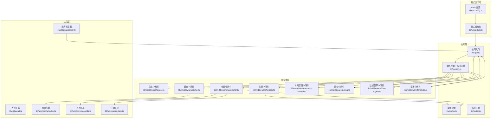
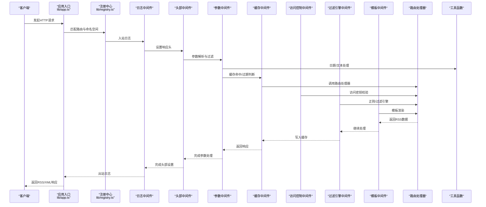
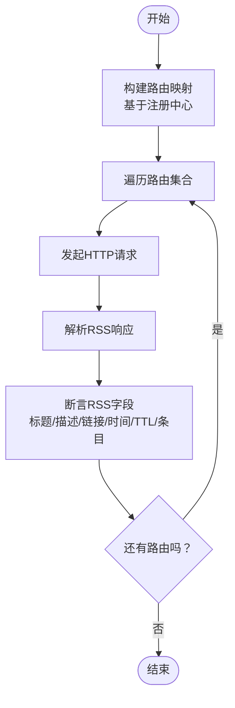
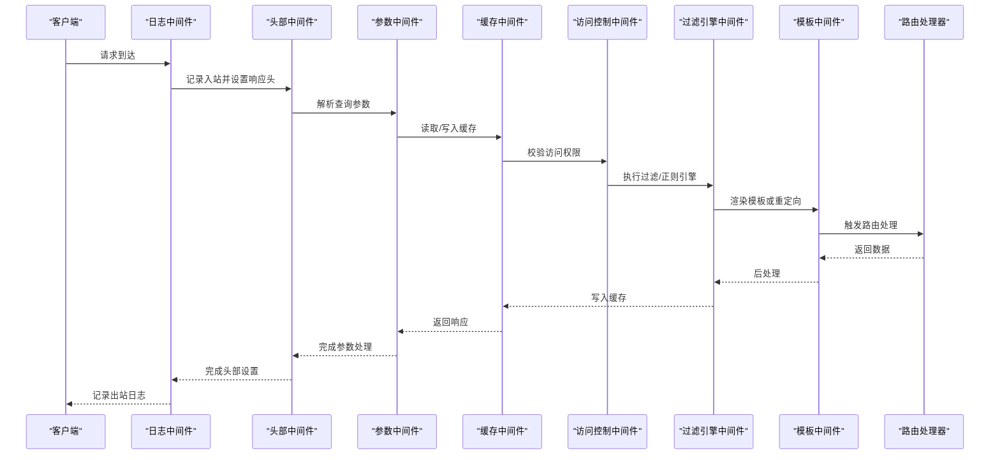
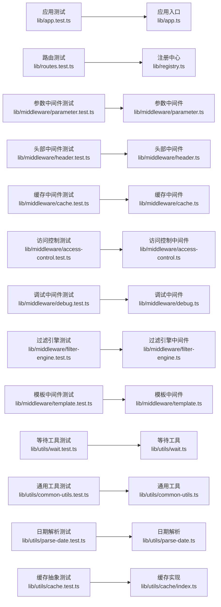

# 单元测试

<cite>
**本文引用的文件**
- [vitest.config.ts](file://vitest.config.ts)
- [package.json](file://package.json)
- [lib/app.test.ts](file://lib/app.test.ts)
- [lib/app.ts](file://lib/app.ts)
- [lib/config.ts](file://lib/config.ts)
- [lib/middleware/cache.test.ts](file://lib/middleware/cache.test.ts)
- [lib/middleware/cache.ts](file://lib/middleware/cache.ts)
- [lib/middleware/access-control.test.ts](file://lib/middleware/access-control.test.ts)
- [lib/middleware/access-control.ts](file://lib/middleware/access-control.ts)
- [lib/middleware/parameter.test.ts](file://lib/middleware/parameter.test.ts)
- [lib/middleware/parameter.ts](file://lib/middleware/parameter.ts)
- [lib/middleware/header.test.ts](file://lib/middleware/header.test.ts)
- [lib/middleware/header.ts](file://lib/middleware/header.ts)
- [lib/middleware/debug.test.ts](file://lib/middleware/debug.test.ts)
- [lib/middleware/debug.ts](file://lib/middleware/debug.ts)
- [lib/middleware/filter-engine.test.ts](file://lib/middleware/filter-engine.test.ts)
- [lib/middleware/filter-engine.ts](file://lib/middleware/filter-engine.ts)
- [lib/middleware/template.test.ts](file://lib/middleware/template.test.ts)
- [lib/middleware/template.ts](file://lib/middleware/template.ts)
- [lib/middleware/logger.ts](file://lib/middleware/logger.ts)
- [lib/routes.test.ts](file://lib/routes.test.ts)
- [lib/registry.ts](file://lib/registry.ts)
- [lib/utils/cache.test.ts](file://lib/utils/cache.test.ts)
- [lib/utils/cache/index.ts](file://lib/utils/cache/index.ts)
- [lib/utils/wait.test.ts](file://lib/utils/wait.test.ts)
- [lib/utils/wait.ts](file://lib/utils/wait.ts)
- [lib/utils/common-utils.test.ts](file://lib/utils/common-utils.test.ts)
- [lib/utils/common-utils.ts](file://lib/utils/common-utils.ts)
- [lib/utils/parse-date.test.ts](file://lib/utils/parse-date.test.ts)
- [lib/utils/parse-date.ts](file://lib/utils/parse-date.ts)
- [lib/utils/puppeteer.test.ts](file://lib/utils/puppeteer.test.ts)
- [lib/utils/puppeteer.ts](file://lib/utils/puppeteer.ts)
- [lib/errors/index.test.ts](file://lib/errors/index.test.ts)
- [lib/errors/index.tsx](file://lib/errors/index.tsx)
- [lib/router.js](file://lib/router.js)
- [lib/setup.test.ts](file://lib/setup.test.ts)
- [lib/types.ts](file://lib/types.ts)
</cite>

## 目录
1. [简介](#简介)
2. [项目结构](#项目结构)
3. [核心组件](#核心组件)
4. [架构总览](#架构总览)
5. [详细组件分析](#详细组件分析)
6. [依赖关系分析](#依赖关系分析)
7. [性能考量](#性能考量)
8. [故障排查指南](#故障排查指南)
9. [结论](#结论)
10. [附录](#附录)

## 简介
本指南聚焦于RSSHub中各模块的单元测试实践，覆盖路由、中间件与工具函数的隔离测试策略。内容包括：
- 使用Vitest/Jest风格的测试框架进行断言与异步测试
- 使用mock与spy控制外部依赖（如HTTP客户端、缓存、Redis）
- 验证路由参数解析、中间件链执行顺序、缓存键生成逻辑
- 测试覆盖率配置与报告
- 断言最佳实践、测试数据准备方法与性能优化建议
- 常见陷阱与规避策略

## 项目结构
RSSHub采用Hono应用作为入口，通过注册中心动态挂载路由与中间件，并以Vitest进行端到端与单元测试。测试配置集中在根目录的Vitest配置文件中，脚本通过NPM命令触发。

图表来源
- [vitest.config.ts](file://vitest.config.ts#L1-L22)
- [lib/app.ts](file://lib/app.ts#L1-L200)
- [lib/registry.ts](file://lib/registry.ts#L150-L218)
- [lib/middleware/logger.ts](file://lib/middleware/logger.ts#L1-L45)
- [lib/middleware/header.ts](file://lib/middleware/header.ts#L1-L200)
- [lib/middleware/parameter.ts](file://lib/middleware/parameter.ts#L1-L200)
- [lib/middleware/cache.ts](file://lib/middleware/cache.ts#L1-L200)
- [lib/middleware/access-control.ts](file://lib/middleware/access-control.ts#L1-L200)
- [lib/middleware/debug.ts](file://lib/middleware/debug.ts#L1-L40)
- [lib/middleware/filter-engine.ts](file://lib/middleware/filter-engine.ts#L1-L200)
- [lib/middleware/template.ts](file://lib/middleware/template.ts#L1-L200)
- [lib/utils/cache/index.ts](file://lib/utils/cache/index.ts#L16-L60)
- [lib/utils/common-utils.ts](file://lib/utils/common-utils.ts#L1-L48)
- [lib/utils/parse-date.ts](file://lib/utils/parse-date.ts#L1-L200)
- [lib/utils/wait.ts](file://lib/utils/wait.ts#L1-L200)
- [lib/utils/puppeteer.ts](file://lib/utils/puppeteer.ts#L1-L200)

章节来源
- [vitest.config.ts](file://vitest.config.ts#L1-L22)
- [lib/app.ts](file://lib/app.ts#L1-L200)
- [lib/registry.ts](file://lib/registry.ts#L150-L218)

## 核心组件
- 应用与路由注册：应用入口负责构建Hono实例并挂载中间件；注册中心按命名空间与路径排序加载路由处理器。
- 中间件体系：日志、头部设置、参数处理、缓存、访问控制、调试、过滤引擎、模板等中间件协同工作。
- 工具函数：等待、缓存抽象、通用字符串与日期处理、无头浏览器等。
- 测试配置：Vitest配置启用覆盖率、超时、setup文件与排除规则。

章节来源
- [lib/app.ts](file://lib/app.ts#L1-L200)
- [lib/registry.ts](file://lib/registry.ts#L150-L218)
- [lib/middleware/logger.ts](file://lib/middleware/logger.ts#L1-L45)
- [lib/middleware/header.ts](file://lib/middleware/header.ts#L1-L200)
- [lib/middleware/parameter.ts](file://lib/middleware/parameter.ts#L1-L200)
- [lib/middleware/cache.ts](file://lib/middleware/cache.ts#L1-L200)
- [lib/middleware/access-control.ts](file://lib/middleware/access-control.ts#L1-L200)
- [lib/middleware/debug.ts](file://lib/middleware/debug.ts#L1-L40)
- [lib/middleware/filter-engine.ts](file://lib/middleware/filter-engine.ts#L1-L200)
- [lib/middleware/template.ts](file://lib/middleware/template.ts#L1-L200)
- [lib/utils/cache/index.ts](file://lib/utils/cache/index.ts#L16-L60)
- [lib/utils/common-utils.ts](file://lib/utils/common-utils.ts#L1-L48)
- [lib/utils/parse-date.ts](file://lib/utils/parse-date.ts#L1-L200)
- [lib/utils/wait.ts](file://lib/utils/wait.ts#L1-L200)
- [lib/utils/puppeteer.ts](file://lib/utils/puppeteer.ts#L1-L200)
- [vitest.config.ts](file://vitest.config.ts#L1-L22)

## 架构总览
下图展示了从请求进入应用到返回RSS响应的关键路径，以及中间件在请求/响应阶段的执行顺序与职责。

图表来源
- [lib/app.ts](file://lib/app.ts#L1-L200)
- [lib/registry.ts](file://lib/registry.ts#L150-L218)
- [lib/middleware/logger.ts](file://lib/middleware/logger.ts#L1-L45)
- [lib/middleware/header.ts](file://lib/middleware/header.ts#L1-L200)
- [lib/middleware/parameter.ts](file://lib/middleware/parameter.ts#L1-L200)
- [lib/middleware/cache.ts](file://lib/middleware/cache.ts#L1-L200)
- [lib/middleware/access-control.ts](file://lib/middleware/access-control.ts#L1-L200)
- [lib/middleware/filter-engine.ts](file://lib/middleware/filter-engine.ts#L1-L200)
- [lib/middleware/template.ts](file://lib/middleware/template.ts#L1-L200)
- [lib/utils/common-utils.ts](file://lib/utils/common-utils.ts#L1-L48)
- [lib/utils/parse-date.ts](file://lib/utils/parse-date.ts#L1-L200)
- [lib/utils/cache/index.ts](file://lib/utils/cache/index.ts#L16-L60)

## 详细组件分析

### 路由与注册中心测试
- 目标：验证路由是否能正确返回RSS结构，检查标题、描述、链接、最后构建时间、TTL、条目唯一GUID等。
- 方法：通过应用实例发起请求，解析RSS并断言字段类型与范围；并发执行以提升效率。
- 关键点：全量路由测试可通过环境变量开启，遍历注册中心的命名空间与路由集合构造示例URL。

图表来源
- [lib/routes.test.ts](file://lib/routes.test.ts#L1-L87)
- [lib/registry.ts](file://lib/registry.ts#L150-L218)

章节来源
- [lib/routes.test.ts](file://lib/routes.test.ts#L1-L87)
- [lib/registry.ts](file://lib/registry.ts#L150-L218)

### 中间件链执行顺序与行为验证
- 日志中间件：记录入站/出站请求、状态码与耗时，便于调试与指标上报。
- 头部中间件：设置跨域、内容类型、缓存控制、Last-Modified、ETag、节点名、路由标识等。
- 参数中间件：支持过滤、限制、排序、全文模式、简短摘要、OpenCC转换、多参数组合等。
- 缓存中间件：内存/Redis双栈缓存，验证命中、过期、刷新、错误场景与TTL键冲突。
- 访问控制中间件：基于ACCESS_KEY与签名校验，拒绝未授权访问。
- 过滤引擎中间件：正则/RE2引擎切换，防止ReDoS攻击。
- 调试中间件：统计请求次数、命中缓存次数、ETag匹配次数、热路径与错误路径。
- 模板中间件：重定向与API返回结构校验。

图表来源
- [lib/middleware/logger.ts](file://lib/middleware/logger.ts#L1-L45)
- [lib/middleware/header.ts](file://lib/middleware/header.ts#L1-L200)
- [lib/middleware/parameter.ts](file://lib/middleware/parameter.ts#L1-L200)
- [lib/middleware/cache.ts](file://lib/middleware/cache.ts#L1-L200)
- [lib/middleware/access-control.ts](file://lib/middleware/access-control.ts#L1-L200)
- [lib/middleware/filter-engine.ts](file://lib/middleware/filter-engine.ts#L1-L200)
- [lib/middleware/template.ts](file://lib/middleware/template.ts#L1-L200)
- [lib/middleware/debug.ts](file://lib/middleware/debug.ts#L1-L40)

章节来源
- [lib/middleware/logger.ts](file://lib/middleware/logger.ts#L1-L45)
- [lib/middleware/header.ts](file://lib/middleware/header.ts#L1-L200)
- [lib/middleware/parameter.ts](file://lib/middleware/parameter.ts#L1-L200)
- [lib/middleware/cache.ts](file://lib/middleware/cache.ts#L1-L200)
- [lib/middleware/access-control.ts](file://lib/middleware/access-control.ts#L1-L200)
- [lib/middleware/filter-engine.ts](file://lib/middleware/filter-engine.ts#L1-L200)
- [lib/middleware/template.ts](file://lib/middleware/template.ts#L1-L200)
- [lib/middleware/debug.ts](file://lib/middleware/debug.ts#L1-L40)

### 工具函数测试
- 等待工具：验证延时精度范围，确保异步等待符合预期。
- 通用工具：标题大小写转换、空白折叠、日期转ISO8601、本地地址获取。
- 日期解析：相对时间表达式解析，覆盖中文与英文多种格式。
- 缓存抽象：内存/Redis/禁用三种模式下的读写与错误处理，TTL键冲突保护。

章节来源
- [lib/utils/wait.test.ts](file://lib/utils/wait.test.ts#L1-L16)
- [lib/utils/wait.ts](file://lib/utils/wait.ts#L1-L200)
- [lib/utils/common-utils.test.ts](file://lib/utils/common-utils.test.ts#L1-L43)
- [lib/utils/common-utils.ts](file://lib/utils/common-utils.ts#L1-L48)
- [lib/utils/parse-date.test.ts](file://lib/utils/parse-date.test.ts#L1-L165)
- [lib/utils/parse-date.ts](file://lib/utils/parse-date.ts#L1-L200)
- [lib/utils/cache.test.ts](file://lib/utils/cache.test.ts#L1-L93)
- [lib/utils/cache/index.ts](file://lib/utils/cache/index.ts#L16-L60)

### 异步函数与外部依赖测试
- 使用Vitest的异步断言与超时控制，结合等待工具与定时器模拟。
- 使用mock/spy替换外部依赖（如HTTP客户端、Redis连接），避免真实网络与数据库影响。
- 对需要真实浏览器的场景，使用无头浏览器工具并在测试结束后清理资源。

章节来源
- [lib/app.test.ts](file://lib/app.test.ts#L1-L26)
- [lib/utils/puppeteer.test.ts](file://lib/utils/puppeteer.test.ts#L1-L37)
- [lib/utils/puppeteer.ts](file://lib/utils/puppeteer.ts#L1-L200)

### 路由参数解析与中间件链执行顺序
- 参数解析：过滤、限制、排序、全文模式、简短摘要、OpenCC转换、多参数组合优先级等。
- 中间件顺序：日志→头部→参数→缓存→访问控制→过滤引擎→模板→路由。
- 缓存键生成：基于路由路径与查询参数组合，确保命中与过期策略一致。

章节来源
- [lib/middleware/parameter.test.ts](file://lib/middleware/parameter.test.ts#L1-L463)
- [lib/middleware/header.test.ts](file://lib/middleware/header.test.ts#L1-L41)
- [lib/middleware/cache.test.ts](file://lib/middleware/cache.test.ts#L1-L191)
- [lib/middleware/logger.ts](file://lib/middleware/logger.ts#L1-L45)

## 依赖关系分析
- 测试对应用入口与注册中心的依赖：通过动态导入应用实例，绕开模块缓存，保证每次测试独立性。
- 中间件之间的耦合度低，职责清晰，便于单独测试。
- 工具函数与中间件之间存在松耦合，通过显式参数传递与返回值进行交互。

图表来源
- [lib/app.test.ts](file://lib/app.test.ts#L1-L26)
- [lib/routes.test.ts](file://lib/routes.test.ts#L1-L87)
- [lib/middleware/parameter.test.ts](file://lib/middleware/parameter.test.ts#L1-L463)
- [lib/middleware/header.test.ts](file://lib/middleware/header.test.ts#L1-L41)
- [lib/middleware/cache.test.ts](file://lib/middleware/cache.test.ts#L1-L191)
- [lib/middleware/access-control.test.ts](file://lib/middleware/access-control.test.ts#L1-L49)
- [lib/middleware/debug.test.ts](file://lib/middleware/debug.test.ts#L1-L42)
- [lib/middleware/filter-engine.test.ts](file://lib/middleware/filter-engine.test.ts#L1-L39)
- [lib/middleware/template.test.ts](file://lib/middleware/template.test.ts#L1-L126)
- [lib/utils/wait.test.ts](file://lib/utils/wait.test.ts#L1-L16)
- [lib/utils/common-utils.test.ts](file://lib/utils/common-utils.test.ts#L1-L43)
- [lib/utils/parse-date.test.ts](file://lib/utils/parse-date.test.ts#L1-L165)
- [lib/utils/cache.test.ts](file://lib/utils/cache.test.ts#L1-L93)
- [lib/app.ts](file://lib/app.ts#L1-L200)
- [lib/registry.ts](file://lib/registry.ts#L150-L218)
- [lib/middleware/parameter.ts](file://lib/middleware/parameter.ts#L1-L200)
- [lib/middleware/header.ts](file://lib/middleware/header.ts#L1-L200)
- [lib/middleware/cache.ts](file://lib/middleware/cache.ts#L1-L200)
- [lib/middleware/access-control.ts](file://lib/middleware/access-control.ts#L1-L200)
- [lib/middleware/debug.ts](file://lib/middleware/debug.ts#L1-L40)
- [lib/middleware/filter-engine.ts](file://lib/middleware/filter-engine.ts#L1-L200)
- [lib/middleware/template.ts](file://lib/middleware/template.ts#L1-L200)
- [lib/utils/wait.ts](file://lib/utils/wait.ts#L1-L200)
- [lib/utils/common-utils.ts](file://lib/utils/common-utils.ts#L1-L48)
- [lib/utils/parse-date.ts](file://lib/utils/parse-date.ts#L1-L200)
- [lib/utils/cache/index.ts](file://lib/utils/cache/index.ts#L16-L60)

## 性能考量
- 并发测试：路由测试使用并发执行以缩短整体耗时。
- 超时与重试：为长耗时任务（如全文模式）设置合理超时，避免阻塞。
- 缓存策略：利用中间件缓存减少重复请求，提高测试稳定性与速度。
- 资源释放：无头浏览器测试在每个用例后清理浏览器实例，避免进程泄漏。

章节来源
- [lib/routes.test.ts](file://lib/routes.test.ts#L72-L87)
- [lib/middleware/parameter.test.ts](file://lib/middleware/parameter.test.ts#L331-L338)
- [lib/utils/puppeteer.test.ts](file://lib/utils/puppeteer.test.ts#L1-L37)

## 故障排查指南
- 访问控制失败：检查ACCESS_KEY与签名生成逻辑，确认请求参数与签名匹配。
- 缓存异常：区分内存/Redis/禁用三种模式，验证TTL键冲突与客户端错误处理。
- 过滤引擎报错：切换正则/RE2引擎，确认ReDoS防护生效。
- 调试信息：通过调试中间件查看请求次数、命中缓存次数、ETag匹配次数与热路径统计。
- 错误页面：错误页面组件会汇总热错误路径与错误路由，辅助定位问题。

章节来源
- [lib/middleware/access-control.test.ts](file://lib/middleware/access-control.test.ts#L1-L49)
- [lib/middleware/cache.test.ts](file://lib/middleware/cache.test.ts#L1-L191)
- [lib/middleware/filter-engine.test.ts](file://lib/middleware/filter-engine.test.ts#L1-L39)
- [lib/middleware/debug.test.ts](file://lib/middleware/debug.test.ts#L1-L42)
- [lib/errors/index.test.ts](file://lib/errors/index.test.ts#L73-L99)

## 结论
RSSHub的单元测试体系围绕应用入口、注册中心、中间件与工具函数展开，通过Vitest配置与动态导入机制实现隔离与并发执行。测试覆盖了路由参数解析、中间件链顺序、缓存键生成、异步与外部依赖模拟、以及错误与调试场景。建议持续完善覆盖率与断言策略，保持测试可维护性与稳定性。

## 附录

### 测试覆盖率与报告
- 覆盖率范围：仅统计lib目录下TS文件，排除路由与废弃路由目录。
- 报告格式：启用Junit报告以便CI集成。
- 超时与初始化：统一测试超时与setup文件，确保环境一致性。

章节来源
- [vitest.config.ts](file://vitest.config.ts#L1-L22)
- [package.json](file://package.json#L44-L49)

### 断言最佳实践
- 明确断言目标：针对RSS结构字段、HTTP状态码、响应头、ETag与Last-Modified等。
- 使用类型与范围断言：日期字段使用范围断言，避免时区与时钟漂移导致的不稳定。
- 并发与异步：对长耗时操作设置超时，使用等待工具与定时器模拟。
- 外部依赖：使用mock/spy替换HTTP客户端、Redis连接等，确保测试可重复。

章节来源
- [lib/app.test.ts](file://lib/app.test.ts#L1-L26)
- [lib/middleware/header.test.ts](file://lib/middleware/header.test.ts#L1-L41)
- [lib/middleware/cache.test.ts](file://lib/middleware/cache.test.ts#L1-L191)
- [lib/utils/parse-date.test.ts](file://lib/utils/parse-date.test.ts#L1-L165)

### 测试数据准备方法
- 动态导入应用实例：在每个测试用例中动态导入应用，避免模块缓存影响。
- 环境变量：通过process.env设置缓存类型、Redis连接、访问密钥等。
- 时间模拟：使用MockDate等库模拟相对时间解析。
- 资源清理：无头浏览器测试在afterEach中关闭浏览器实例。

章节来源
- [lib/app.test.ts](file://lib/app.test.ts#L1-L26)
- [lib/utils/puppeteer.test.ts](file://lib/utils/puppeteer.test.ts#L1-L37)
- [lib/utils/parse-date.test.ts](file://lib/utils/parse-date.test.ts#L1-L165)

### 测试性能优化建议
- 并发执行：对独立路由测试使用并发模式。
- 缓存复用：在内存缓存模式下复用缓存键，减少重复请求。
- 资源复用：在单测中尽量复用HTTP客户端与Redis连接，避免频繁建立/断开。
- 超时与重试：为长耗时任务设置合理超时，必要时增加重试策略。

章节来源
- [lib/routes.test.ts](file://lib/routes.test.ts#L72-L87)
- [lib/middleware/cache.test.ts](file://lib/middleware/cache.test.ts#L1-L191)
- [lib/utils/puppeteer.test.ts](file://lib/utils/puppeteer.test.ts#L1-L37)