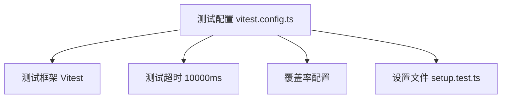
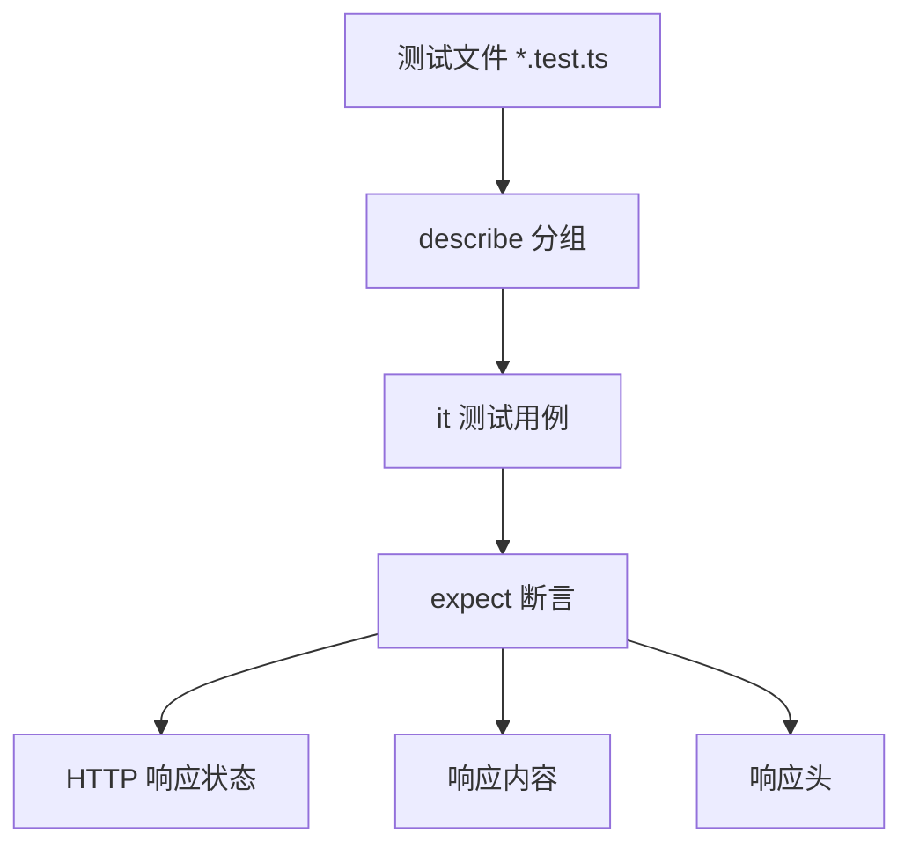
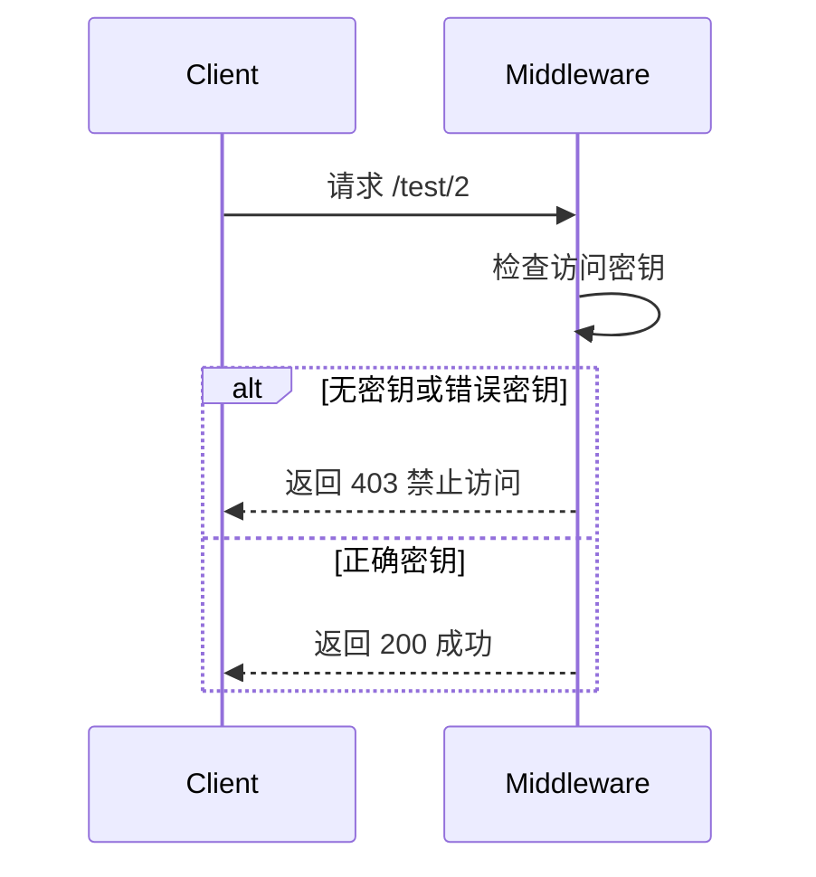
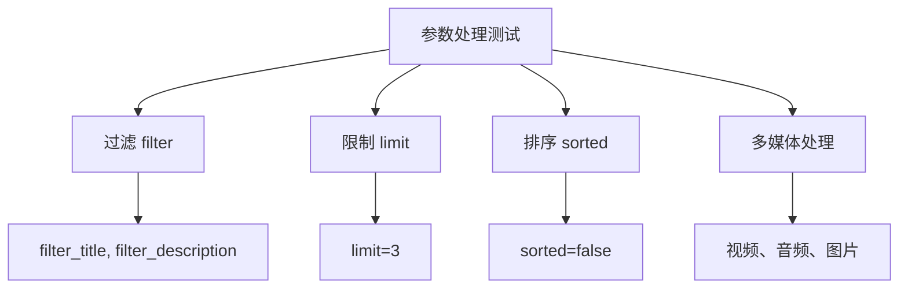
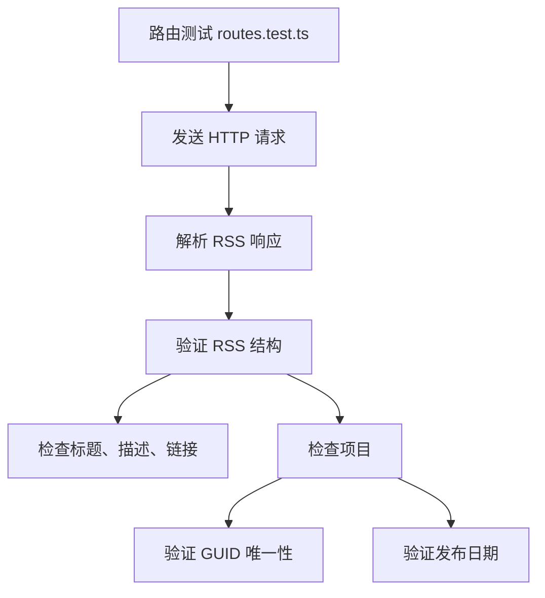
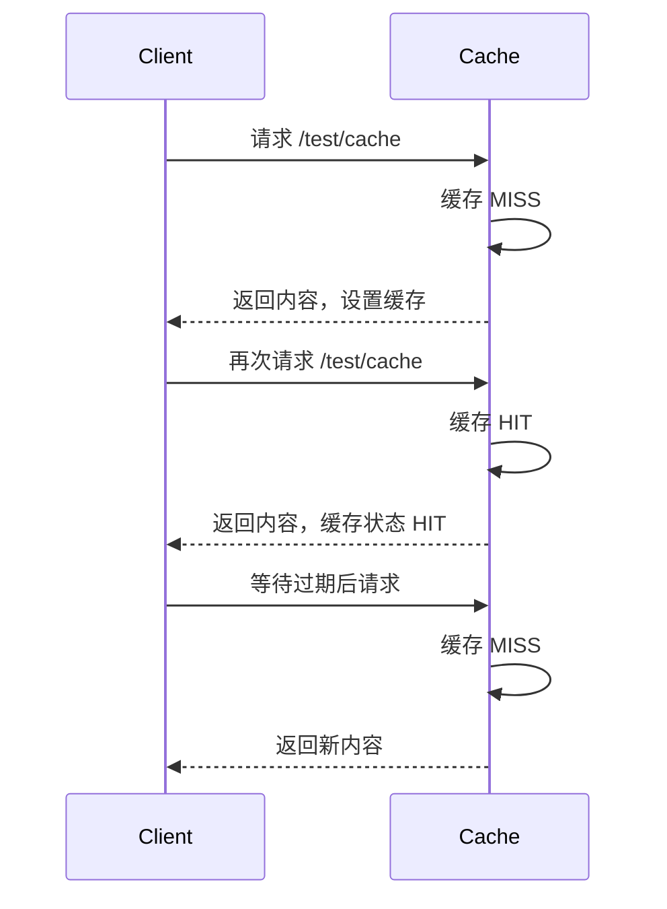
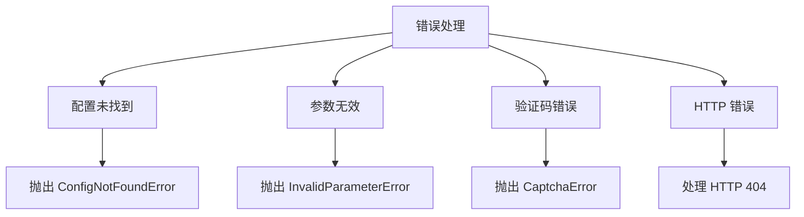
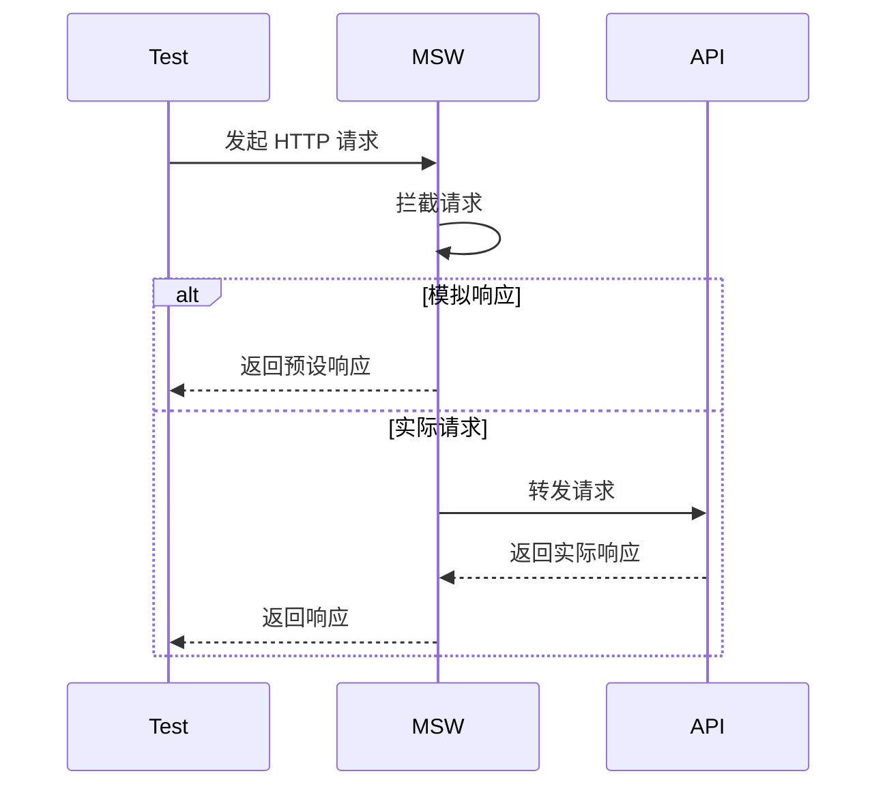
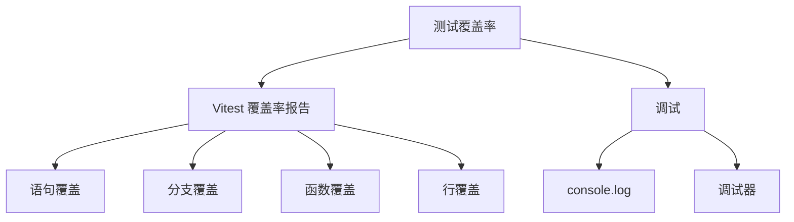
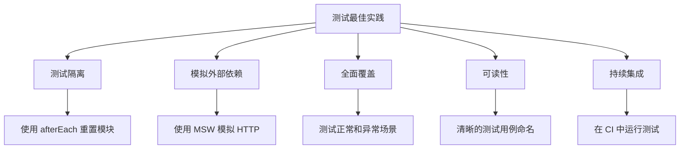

# 测试方法

<cite>
**本文档引用的文件**
- [cache.test.ts](file://lib/middleware/cache.test.ts)
- [access-control.test.ts](file://lib/middleware/access-control.test.ts)
- [parameter.test.ts](file://lib/middleware/parameter.test.ts)
- [app.test.ts](file://lib/app.test.ts)
- [routes.test.ts](file://lib/routes.test.ts)
- [header.test.ts](file://lib/middleware/header.test.ts)
- [debug.test.ts](file://lib/middleware/debug.test.ts)
- [template.test.ts](file://lib/middleware/template.test.ts)
- [filter-engine.test.ts](file://lib/middleware/filter-engine.test.ts)
- [anti-hotlink.test.ts](file://lib/middleware/anti-hotlink.test.ts)
- [vitest.config.ts](file://vitest.config.ts)
- [setup.test.ts](file://lib/setup.test.ts)
- [index.ts](file://lib/routes/test/index.ts)
- [namespace.ts](file://lib/routes/test/namespace.ts)
</cite>

## 目录
1. [简介](#简介)
2. [测试框架与配置](#测试框架与配置)
3. [单元测试与集成测试实践](#单元测试与集成测试实践)
4. [中间件测试](#中间件测试)
5. [路由功能测试](#路由功能测试)
6. [缓存机制测试](#缓存机制测试)
7. [错误处理测试](#错误处理测试)
8. [异步测试与模拟](#异步测试与模拟)
9. [测试覆盖率与调试](#测试覆盖率与调试)
10. [测试最佳实践](#测试最佳实践)

## 简介
RSSHub 是一个开源的 RSS 生成器，其测试体系确保了路由功能的正确性和稳定性。本指南详细介绍了 RSSHub 路由的单元测试和集成测试实践，涵盖 HTTP 请求模拟、响应断言、错误处理、缓存验证、中间件行为测试等内容。通过 Jest 框架（在 RSSHub 中使用 Vitest）进行异步测试，确保代码质量和向后兼容性。

**本节不分析具体源文件，因此不提供来源**

## 测试框架与配置
RSSHub 使用 Vitest 作为测试框架，它是基于 Vite 的现代化测试工具，提供了快速的测试执行和良好的开发体验。测试配置在 `vitest.config.ts` 文件中定义，包括测试超时、覆盖率报告、设置文件等。

测试配置的关键部分包括：
- **测试超时**：设置为 10 秒，确保异步操作有足够时间完成。
- **覆盖率**：包含 `lib/**/*.ts` 文件，但排除路由文件，专注于核心逻辑的覆盖。
- **设置文件**：使用 `setupFiles` 指定 `./lib/setup.test.ts`，用于全局的测试设置，如模拟服务器。

**Diagram sources**
- [vitest.config.ts](file://vitest.config.ts#L1-L23)

**Section sources**
- [vitest.config.ts](file://vitest.config.ts#L1-L23)

## 单元测试与集成测试实践
RSSHub 的测试实践结合了单元测试和集成测试，确保各个组件和整体功能的正确性。测试文件通常位于 `lib/middleware` 和 `lib/routes` 目录下，使用 `.test.ts` 后缀命名。

测试的核心是使用 `describe` 和 `it` 函数组织测试用例，通过 `expect` 断言验证结果。例如，在 `app.test.ts` 中，测试了应用是否能正确响应根路径请求。

**Diagram sources**
- [app.test.ts](file://lib/app.test.ts#L1-L26)
- [routes.test.ts](file://lib/routes.test.ts#L1-L87)

**Section sources**
- [app.test.ts](file://lib/app.test.ts#L1-L26)
- [routes.test.ts](file://lib/routes.test.ts#L1-L87)

## 中间件测试
中间件是 RSSHub 的核心组件，负责处理请求和响应。测试中间件确保其行为符合预期，例如访问控制、参数处理、缓存等。

### 访问控制测试
`access-control.test.ts` 文件测试了访问控制中间件，验证了访问密钥和代码的正确性。测试用例包括无密钥、错误密钥和正确密钥的情况。

**Diagram sources**
- [access-control.test.ts](file://lib/middleware/access-control.test.ts#L1-L49)

**Section sources**
- [access-control.test.ts](file://lib/middleware/access-control.test.ts#L1-L49)

### 参数处理测试
`parameter.test.ts` 文件测试了参数处理中间件，涵盖了过滤、限制、排序、多媒体处理等多种功能。测试用例验证了不同参数组合下的行为。

**Diagram sources**
- [parameter.test.ts](file://lib/middleware/parameter.test.ts#L1-L463)

**Section sources**
- [parameter.test.ts](file://lib/middleware/parameter.test.ts#L1-L463)

## 路由功能测试
路由功能测试确保每个路由能正确生成 RSS 内容。`routes.test.ts` 文件通过遍历所有路由并发送请求，验证响应是否符合 RSS 标准。

测试用例检查了 RSS 的基本结构，包括标题、描述、链接、项目等，并验证了每个项目的唯一性。

**Diagram sources**
- [routes.test.ts](file://lib/routes.test.ts#L1-L87)

**Section sources**
- [routes.test.ts](file://lib/routes.test.ts#L1-L87)

## 缓存机制测试
缓存是 RSSHub 性能优化的关键。`cache.test.ts` 文件测试了内存和 Redis 缓存的行为，验证了缓存命中、过期和刷新。

测试用例设置了缓存过期时间，并在不同时间点发送请求，观察缓存状态头的变化。例如，首次请求返回 `MISS`，后续请求返回 `HIT`，过期后再次请求返回 `MISS`。

**Diagram sources**
- [cache.test.ts](file://lib/middleware/cache.test.ts#L1-L191)

**Section sources**
- [cache.test.ts](file://lib/middleware/cache.test.ts#L1-L191)

## 错误处理测试
错误处理测试确保应用在异常情况下能正确响应。`index.ts` 文件中的路由处理函数抛出不同类型的错误，测试用例验证了这些错误的处理。

例如，测试了配置未找到、参数无效、验证码错误等场景，确保返回适当的错误信息和状态码。

**Diagram sources**
- [index.ts](file://lib/routes/test/index.ts#L1-L426)

**Section sources**
- [index.ts](file://lib/routes/test/index.ts#L1-L426)

## 异步测试与模拟
RSSHub 的测试大量涉及异步操作，如 HTTP 请求、缓存读写等。Vitest 提供了对异步测试的原生支持，使用 `async/await` 语法。

`setup.test.ts` 文件使用 MSW (Mock Service Worker) 模拟 HTTP 请求，避免依赖外部服务。例如，模拟了 OpenAI API 的响应，确保测试的稳定性和可重复性。

**Diagram sources**
- [setup.test.ts](file://lib/setup.test.ts#L1-L252)

**Section sources**
- [setup.test.ts](file://lib/setup.test.ts#L1-L252)

## 测试覆盖率与调试
测试覆盖率是衡量测试完整性的重要指标。RSSHub 的测试配置启用了覆盖率报告，帮助开发者识别未覆盖的代码路径。

调试测试用例时，可以使用 `console.log` 或调试器。`debug.test.ts` 文件测试了调试中间件，验证了调试信息的正确性。

**Diagram sources**
- [vitest.config.ts](file://vitest.config.ts#L1-L23)
- [debug.test.ts](file://lib/middleware/debug.test.ts#L1-L42)

**Section sources**
- [vitest.config.ts](file://vitest.config.ts#L1-L23)
- [debug.test.ts](file://lib/middleware/debug.test.ts#L1-L42)

## 测试最佳实践
遵循测试最佳实践可以提高测试质量和开发效率。RSSHub 的测试体系体现了以下最佳实践：

- **测试隔离**：每个测试用例独立运行，避免相互影响。
- **模拟外部依赖**：使用 MSW 模拟 HTTP 请求，确保测试的稳定性和速度。
- **全面覆盖**：测试各种正常和异常场景，确保代码的健壮性。
- **可读性**：测试用例命名清晰，便于理解和维护。
- **持续集成**：在 CI/CD 流程中运行测试，确保每次提交的代码质量。

**Diagram sources**
- [setup.test.ts](file://lib/setup.test.ts#L1-L252)
- [cache.test.ts](file://lib/middleware/cache.test.ts#L1-L191)
- [parameter.test.ts](file://lib/middleware/parameter.test.ts#L1-L463)

**Section sources**
- [setup.test.ts](file://lib/setup.test.ts#L1-L252)
- [cache.test.ts](file://lib/middleware/cache.test.ts#L1-L191)
- [parameter.test.ts](file://lib/middleware/parameter.test.ts#L1-L463)