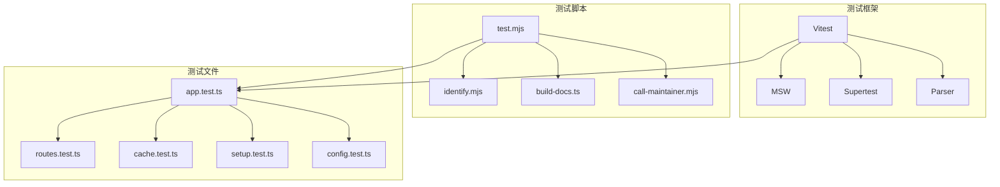
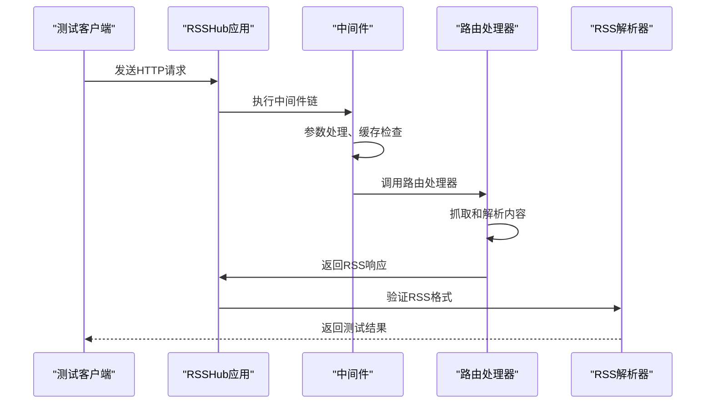
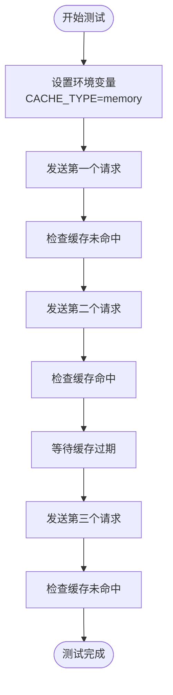
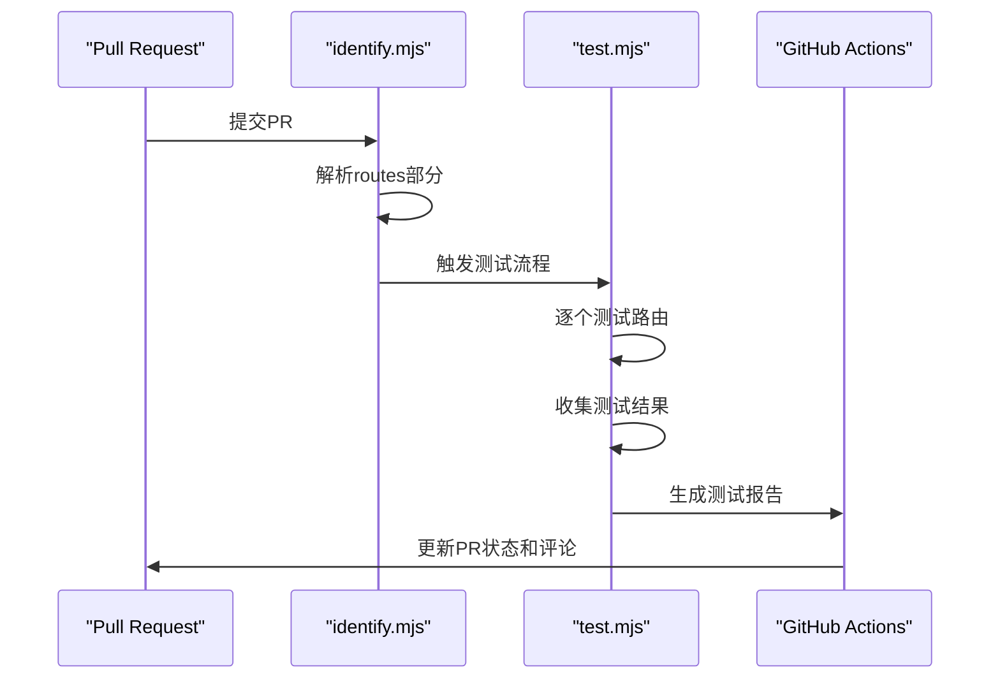
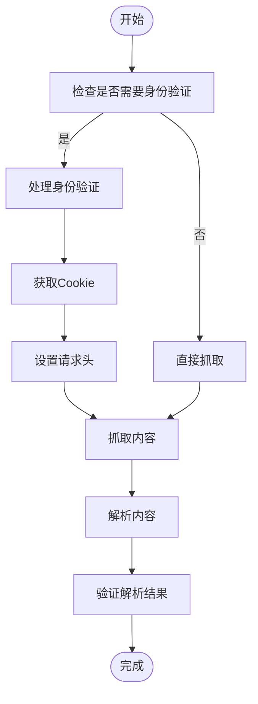
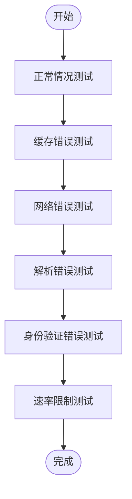
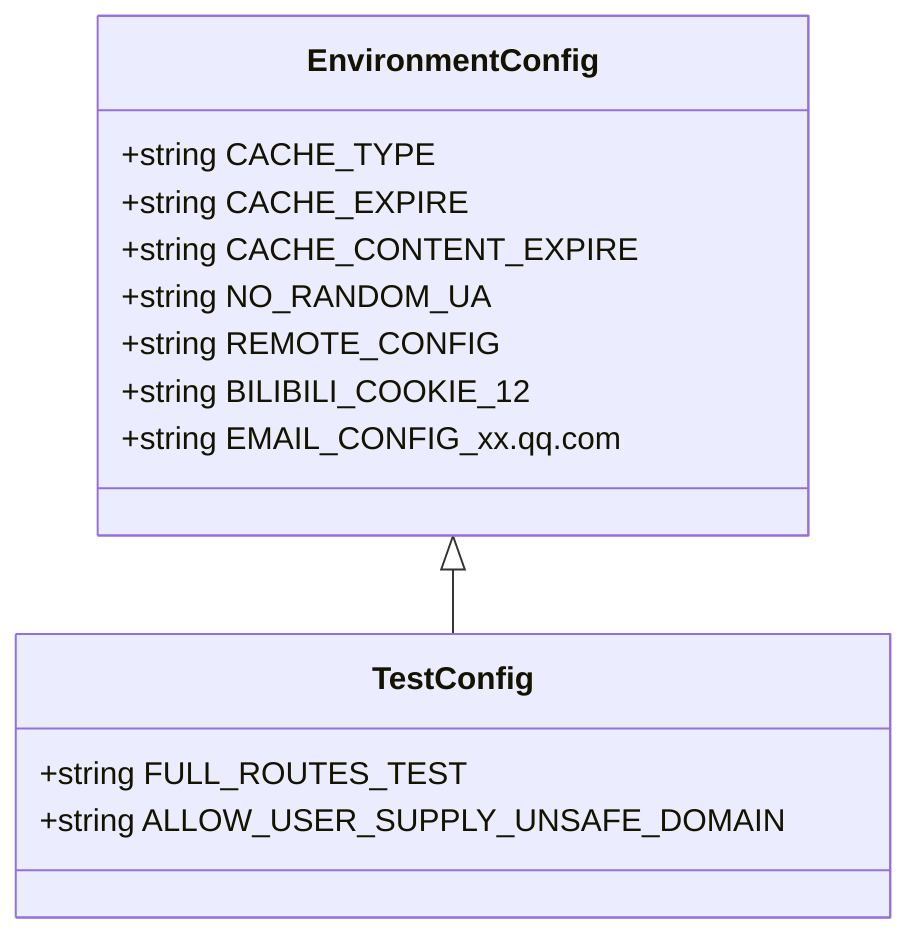
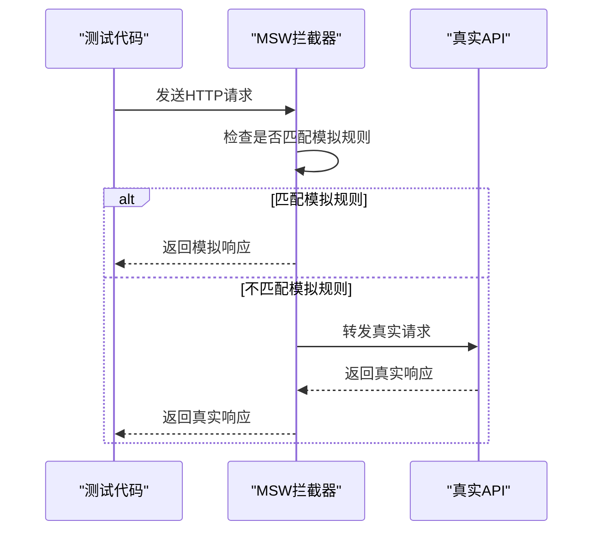
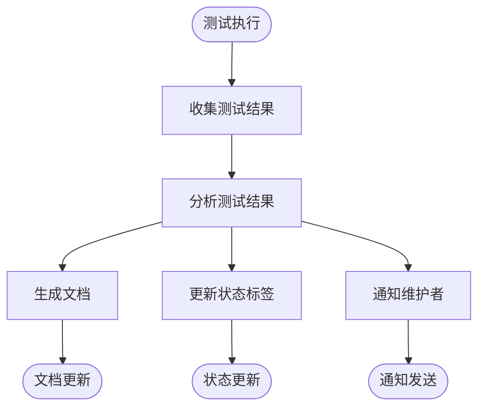
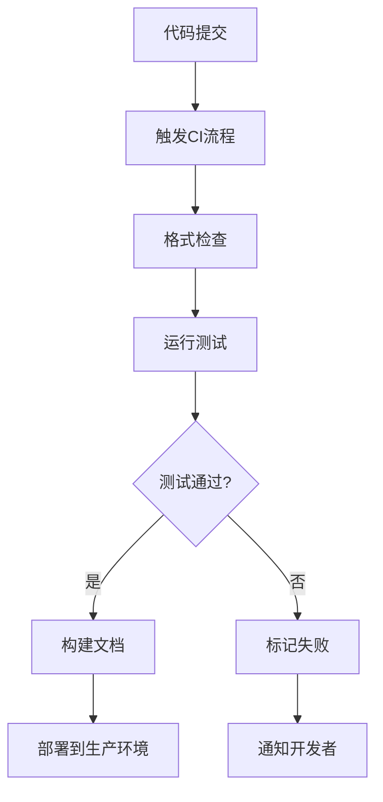

# 集成测试

<cite>
**本文档中引用的文件**  
- [app.test.ts](file://lib/app.test.ts)
- [routes.test.ts](file://lib/routes.test.ts)
- [cache.test.ts](file://lib/middleware/cache.test.ts)
- [setup.test.ts](file://lib/setup.test.ts)
- [config.test.ts](file://lib/config.test.ts)
- [test.mjs](file://scripts/workflow/test-route/test.mjs)
- [identify.mjs](file://scripts/workflow/test-route/identify.mjs)
- [build-docs.ts](file://scripts/workflow/build-docs.ts)
- [call-maintainer.mjs](file://scripts/workflow/test-issue/call-maintainer.mjs)
- [cover.js](file://lib/routes-deprecated/cell/cover.js)
- [anti-hotlink.test.ts](file://lib/middleware/anti-hotlink.test.ts)
- [index.ts](file://lib/routes/oevw/index.ts)
- [utils.ts](file://lib/routes/kuaidi100/utils.ts)
- [utils.ts](file://lib/routes/finology/utils.ts)
- [zaker/utils.ts](file://lib/routes/zaker/utils.ts)
</cite>

## 目录
1. [简介](#简介)
2. [项目结构与测试框架](#项目结构与测试框架)
3. [核心测试组件](#核心测试组件)
4. [端到端测试流程](#端到端测试流程)
5. [测试环境配置](#测试环境配置)
6. [测试数据管理](#测试数据管理)
7. [测试结果分析](#测试结果分析)
8. [持续集成集成](#持续集成集成)
9. [结论](#结论)

## 简介
RSSHub 是一个全球最大的 RSS 网络，提供数以千计的内容源的聚合服务。本指南旨在为 RSSHub 路由系统提供详细的集成测试实践，重点介绍如何测试完整的请求-响应周期，包括 HTTP 请求的发送、中间件的处理、路由逻辑的执行以及 RSS 输出的验证。

## 项目结构与测试框架

**图示来源**
- [vitest.config.ts](file://vitest.config.ts#L1-L23)
- [package.json](file://package.json#L45-L48)

**本节来源**
- [vitest.config.ts](file://vitest.config.ts#L1-L23)
- [package.json](file://package.json#L45-L48)

## 核心测试组件

### 请求-响应周期测试
RSSHub 的集成测试主要围绕完整的请求-响应周期展开。测试框架通过模拟 HTTP 请求来验证路由系统的正确性，包括中间件处理、路由逻辑执行和 RSS 输出验证。

**图示来源**
- [app.test.ts](file://lib/app.test.ts#L1-L26)
- [routes.test.ts](file://lib/routes.test.ts#L1-L87)

**本节来源**
- [app.test.ts](file://lib/app.test.ts#L1-L26)
- [routes.test.ts](file://lib/routes.test.ts#L1-L87)

### 缓存机制测试
缓存是 RSSHub 性能优化的关键组件。测试需要验证不同缓存类型（内存、Redis）的行为，以及缓存过期和刷新机制的正确性。

**图示来源**
- [cache.test.ts](file://lib/middleware/cache.test.ts#L1-L191)

**本节来源**
- [cache.test.ts](file://lib/middleware/cache.test.ts#L1-L191)

## 端到端测试流程

### test-route 脚本自动化
RSSHub 使用 `test-route` 脚本来自动化测试流程。该脚本能够识别 Pull Request 中的路由配置，自动执行测试并报告结果。

**图示来源**
- [test.mjs](file://scripts/workflow/test-route/test.mjs#L1-L79)
- [identify.mjs](file://scripts/workflow/test-route/identify.mjs#L1-L132)

**本节来源**
- [test.mjs](file://scripts/workflow/test-route/test.mjs#L1-L79)
- [identify.mjs](file://scripts/workflow/test-route/identify.mjs#L1-L132)

### 内容源抓取与解析测试
测试需要验证不同内容源的抓取和解析功能，包括处理反爬虫机制和身份验证。

**图示来源**
- [cover.js](file://lib/routes-deprecated/cell/cover.js#L35-L55)
- [index.ts](file://lib/routes/oevw/index.ts#L30-L47)

**本节来源**
- [cover.js](file://lib/routes-deprecated/cell/cover.js#L35-L55)
- [index.ts](file://lib/routes/oevw/index.ts#L30-L47)

### 错误处理与异常情况测试
测试必须覆盖各种错误处理和异常情况，确保系统在异常条件下仍能正确响应。

**本节来源**
- [cache.test.ts](file://lib/middleware/cache.test.ts#L136-L159)
- [config.test.ts](file://lib/config.test.ts#L78-L90)

## 测试环境配置

### 环境变量配置
测试环境通过环境变量进行配置，这些变量控制着缓存类型、过期时间、用户代理等关键参数。

**图示来源**
- [cache.test.ts](file://lib/middleware/cache.test.ts#L6-L8)
- [config.test.ts](file://lib/config.test.ts#L9-L98)

**本节来源**
- [cache.test.ts](file://lib/middleware/cache.test.ts#L6-L8)
- [config.test.ts](file://lib/config.test.ts#L9-L98)

## 测试数据管理

### 模拟数据服务
RSSHub 使用 MSW (Mock Service Worker) 来模拟外部 API 和网络请求，确保测试的稳定性和可重复性。

**图示来源**
- [setup.test.ts](file://lib/setup.test.ts#L1-L252)

**本节来源**
- [setup.test.ts](file://lib/setup.test.ts#L1-L252)

## 测试结果分析

### 测试结果集成
测试结果不仅用于验证功能正确性，还被集成到文档生成和问题跟踪系统中。

**图示来源**
- [build-docs.ts](file://scripts/workflow/build-docs.ts#L102-L134)
- [call-maintainer.mjs](file://scripts/workflow/test-issue/call-maintainer.mjs#L139-L178)

**本节来源**
- [build-docs.ts](file://scripts/workflow/build-docs.ts#L102-L134)
- [call-maintainer.mjs](file://scripts/workflow/test-issue/call-maintainer.mjs#L139-L178)

## 持续集成集成

### CI/CD 流程集成
RSSHub 的测试流程深度集成到 GitHub Actions 中，实现了自动化的持续集成和持续部署。

**本节来源**
- [package.json](file://package.json#L44-L48)
- [test.mjs](file://scripts/workflow/test-route/test.mjs#L1-L79)

## 结论
RSSHub 的集成测试体系提供了一套完整的端到端测试实践，涵盖了从请求-响应周期验证到持续集成集成的各个方面。通过自动化测试脚本、模拟数据服务和详细的测试结果分析，确保了路由系统的稳定性和可靠性。这套测试实践不仅提高了开发效率，也为用户提供了高质量的 RSS 服务。