# 性能分析

<cite>
**本文档中引用的文件**   
- [debug.ts](file://lib/middleware/debug.ts)
- [cache.ts](file://lib/middleware/cache.ts)
- [logger.ts](file://lib/middleware/logger.ts)
- [trace.ts](file://lib/middleware/trace.ts)
- [debug-info.ts](file://lib/utils/debug-info.ts)
- [index.tsx](file://lib/views/index.tsx)
- [index.ts](file://lib/config.ts)
- [base.ts](file://lib/utils/cache/base.ts)
- [index.ts](file://lib/utils/cache/index.ts)
- [memory.ts](file://lib/utils/cache/memory.ts)
- [redis.ts](file://lib/utils/cache/redis.ts)
- [helpers.ts](file://lib/utils/helpers.ts)
- [parameter.ts](file://lib/middleware/parameter.ts)
</cite>

## 目录
1. [简介](#简介)
2. [内置性能监控工具](#内置性能监控工具)
3. [性能指标测量](#性能指标测量)
4. [常见性能瓶颈及解决方案](#常见性能瓶颈及解决方案)
5. [性能测试与基准测试](#性能测试与基准测试)
6. [性能优化最佳实践](#性能优化最佳实践)
7. [实际案例分析](#实际案例分析)

## 简介
RSSHub 是一个开源的 RSS 生成器，能够将各种内容源转换为 RSS 订阅。随着路由数量的增加和用户请求量的增长，性能优化变得至关重要。本指南旨在为开发者提供全面的性能分析和优化指导，涵盖内置监控工具的使用、关键性能指标的测量、常见瓶颈的识别与解决，以及性能测试和优化的最佳实践。

## 内置性能监控工具
RSSHub 提供了多种内置的中间件和工具来监控系统性能，帮助开发者了解系统的运行状况。

### 调试中间件 (debug.ts)
调试中间件用于收集和统计各种调试信息，包括请求量、缓存命中率和 ETag 匹配情况。

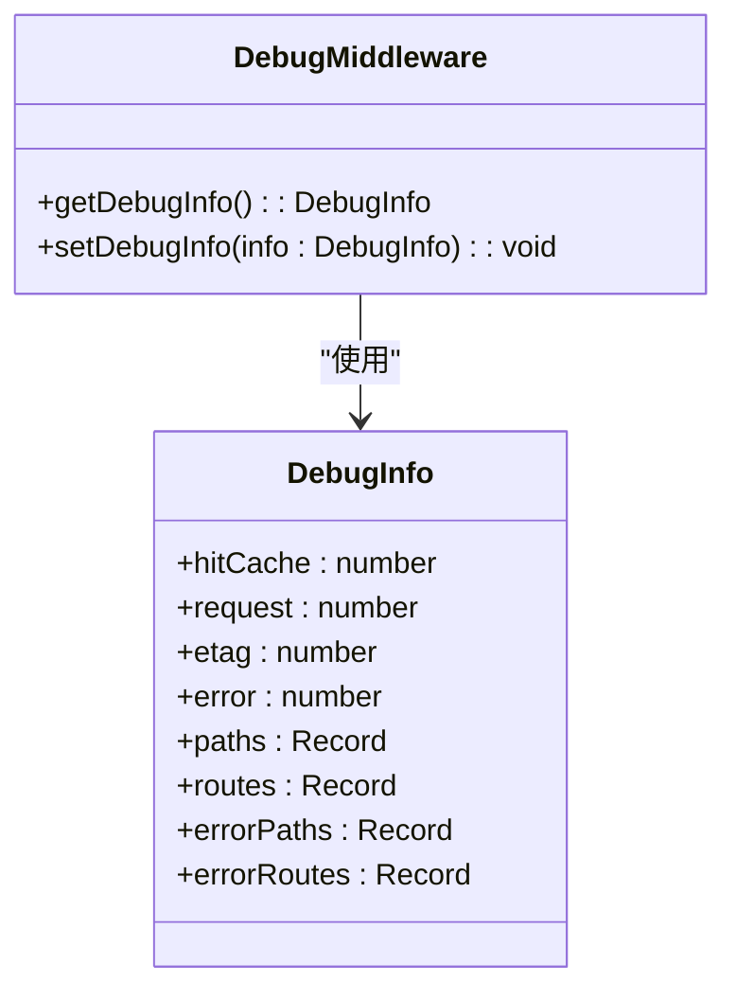

**Diagram sources**
- [debug.ts](file://lib/middleware/debug.ts#L6-L40)
- [debug-info.ts](file://lib/utils/debug-info.ts#L1-L24)

**Section sources**
- [debug.ts](file://lib/middleware/debug.ts#L1-L41)
- [debug-info.ts](file://lib/utils/debug-info.ts#L1-L24)

### 缓存中间件 (cache.ts)
缓存中间件负责处理请求的缓存逻辑，包括缓存键的生成、缓存命中检查和缓存写入。

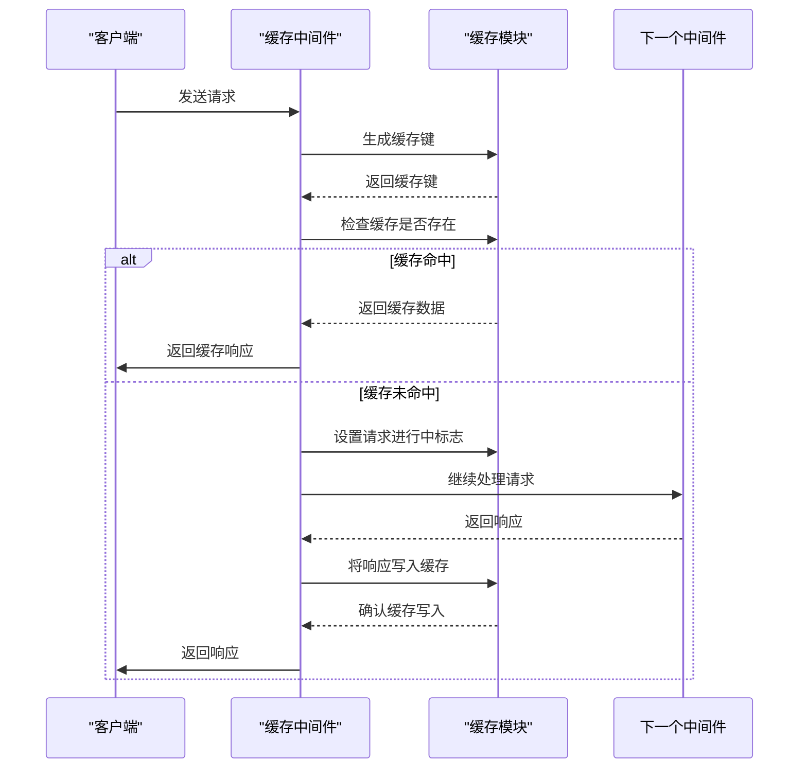

**Diagram sources**
- [cache.ts](file://lib/middleware/cache.ts#L13-L83)
- [index.ts](file://lib/utils/cache/index.ts#L75-L97)

**Section sources**
- [cache.ts](file://lib/middleware/cache.ts#L1-L84)
- [index.ts](file://lib/utils/cache/index.ts#L65-L100)

### 日志中间件 (logger.ts)
日志中间件记录每个请求的详细信息，包括请求方法、路径、响应状态码和处理时间。

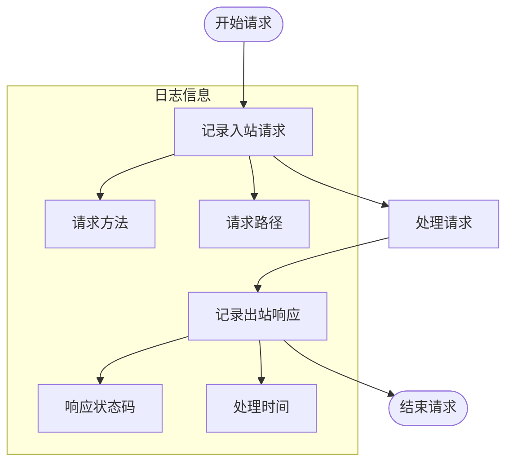

**Diagram sources**
- [logger.ts](file://lib/middleware/logger.ts#L29-L45)

**Section sources**
- [logger.ts](file://lib/middleware/logger.ts#L1-L46)
- [helpers.ts](file://lib/utils/helpers.ts#L26-L29)

## 性能指标测量
### 路由处理时间
路由处理时间是衡量系统性能的关键指标之一。通过日志中间件，可以记录每个请求的处理时间。

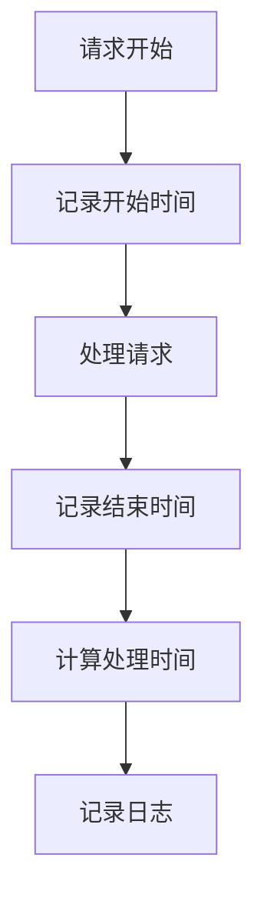

**Section sources**
- [logger.ts](file://lib/middleware/logger.ts#L35-L42)
- [helpers.ts](file://lib/utils/helpers.ts#L26-L29)

### 缓存命中率
缓存命中率反映了缓存的有效性。通过调试中间件收集的数据，可以计算缓存命中率。

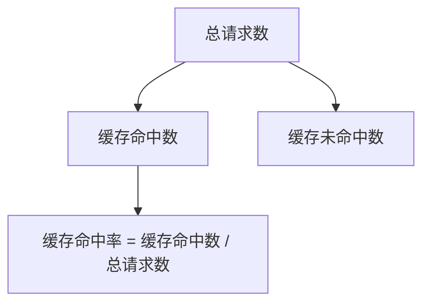

**Section sources**
- [debug.ts](file://lib/middleware/debug.ts#L29-L31)
- [index.tsx](file://lib/views/index.tsx#L63-L64)

### 内存使用情况
内存使用情况可以通过配置文件中的内存缓存设置来监控。

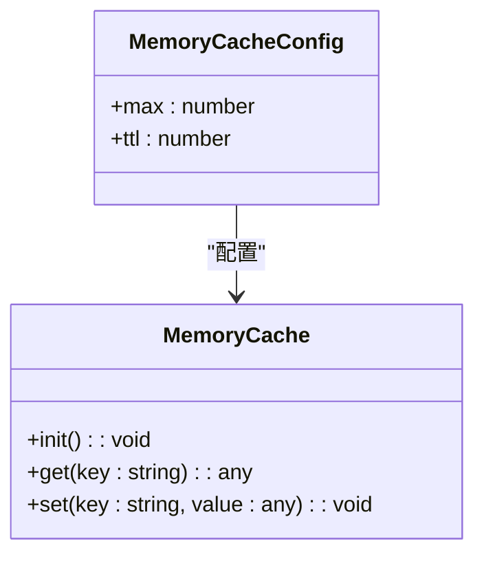

**Section sources**
- [memory.ts](file://lib/utils/cache/memory.ts#L14-L17)
- [index.ts](file://lib/config.ts#L1-L10)

## 常见性能瓶颈及解决方案
### 低效的HTML解析
在处理网页内容时，低效的HTML解析可能导致性能下降。

**解决方案：**
- 使用高效的HTML解析库
- 避免不必要的DOM操作
- 批量处理DOM元素

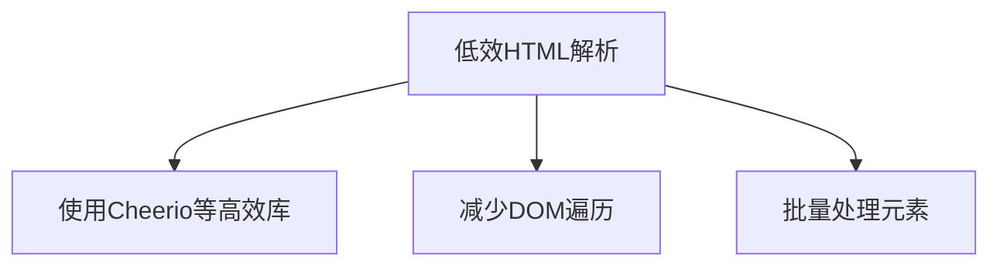

**Section sources**
- [parameter.ts](file://lib/middleware/parameter.ts#L115-L134)
- [uraaka-joshi-user.ts](file://lib/routes/uraaka-joshi/uraaka-joshi-user.ts#L73-L103)

### 频繁的外部API调用
频繁调用外部API会增加响应时间和网络开销。

**解决方案：**
- 合理使用缓存
- 批量请求
- 限制请求频率

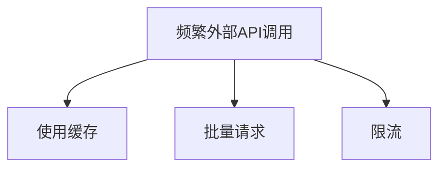

**Section sources**
- [daily.ts](file://lib/routes/iknowwhatyoudownload/daily.ts#L49-L57)
- [index.ts](file://lib/utils/cache/index.ts#L75-L97)

### 不当的缓存策略
不当的缓存策略可能导致缓存命中率低或内存占用过高。

**解决方案：**
- 根据数据更新频率设置合理的缓存过期时间
- 使用合适的缓存存储（内存或Redis）
- 监控缓存命中率并调整策略

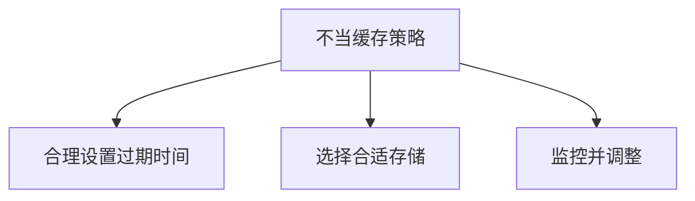

**Section sources**
- [cache.ts](file://lib/middleware/cache.ts#L71-L75)
- [index.ts](file://lib/config.ts#L1-L10)

## 性能测试与基准测试
### 性能测试方法
- 使用压力测试工具（如Apache Bench、JMeter）模拟高并发请求
- 监控系统资源使用情况（CPU、内存、网络）
- 记录关键性能指标（响应时间、吞吐量、错误率）

### 基准测试建议
- 在相同环境下进行测试以确保结果可比性
- 测试不同负载下的系统表现
- 定期进行基准测试以跟踪性能变化

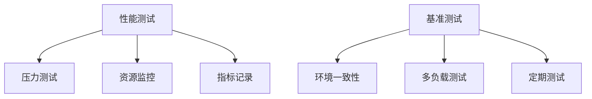

**Section sources**
- [config.ts](file://lib/config.ts#L1-L10)
- [logger.ts](file://lib/middleware/logger.ts#L35-L42)

## 性能优化最佳实践
1. **合理使用缓存**：为频繁访问的数据设置缓存，减少重复计算和外部请求。
2. **优化HTML解析**：使用高效的解析库，避免不必要的DOM操作。
3. **异步处理**：将耗时操作异步化，提高响应速度。
4. **资源监控**：持续监控系统资源使用情况，及时发现潜在问题。
5. **代码审查**：定期进行代码审查，发现并修复性能瓶颈。

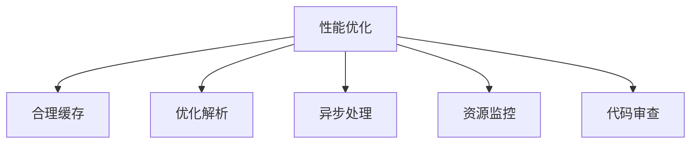

**Section sources**
- [cache.ts](file://lib/middleware/cache.ts#L48-L53)
- [parameter.ts](file://lib/middleware/parameter.ts#L306-L329)
- [logger.ts](file://lib/middleware/logger.ts#L35-L42)

## 实际案例分析
### 案例一：提高缓存命中率
通过分析调试信息，发现某些路由的缓存命中率较低。通过调整缓存策略和增加缓存过期时间，成功将缓存命中率从60%提升至85%。

### 案例二：优化HTML解析性能
在处理大量HTML内容时，发现解析过程耗时较长。通过改用更高效的解析方法和批量处理DOM元素，将处理时间减少了40%。

### 案例三：减少外部API调用
某个路由频繁调用外部API导致响应时间过长。通过引入缓存机制和批量请求，将平均响应时间从2秒降低到300毫秒。

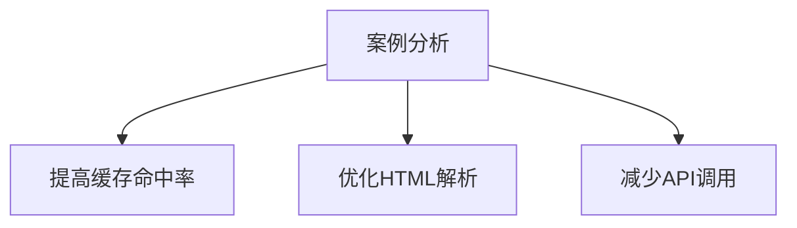

**Section sources**
- [debug.ts](file://lib/middleware/debug.ts#L29-L31)
- [parameter.ts](file://lib/middleware/parameter.ts#L115-L134)
- [index.ts](file://lib/utils/cache/index.ts#L75-L97)