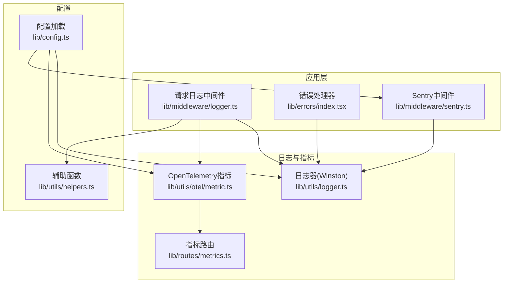
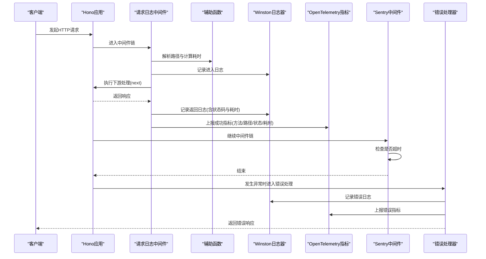
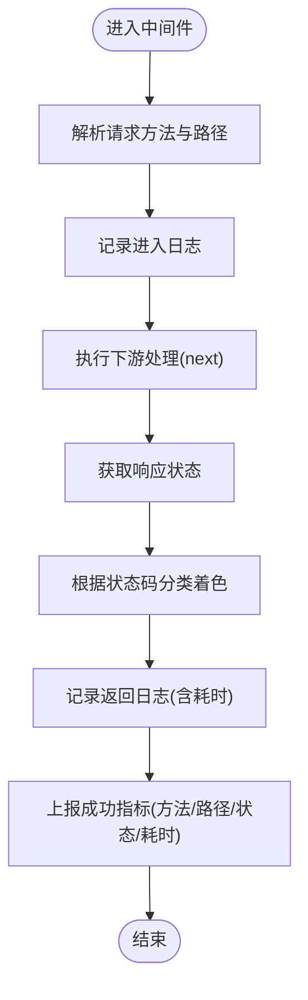
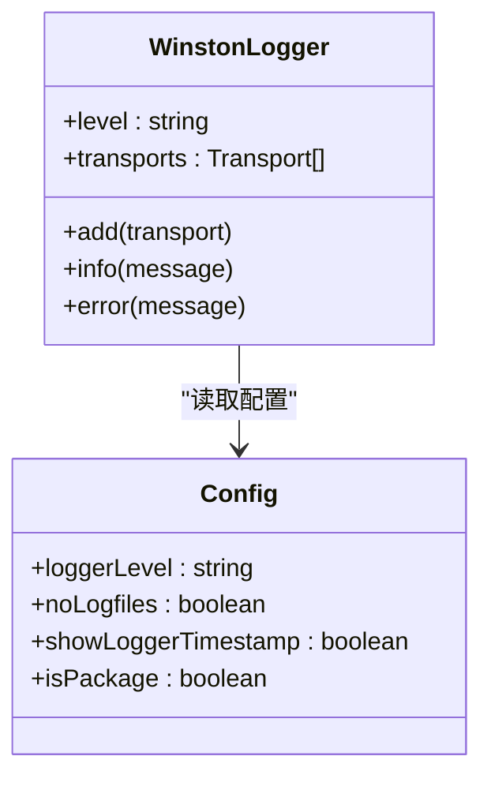
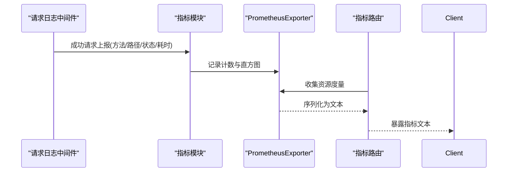
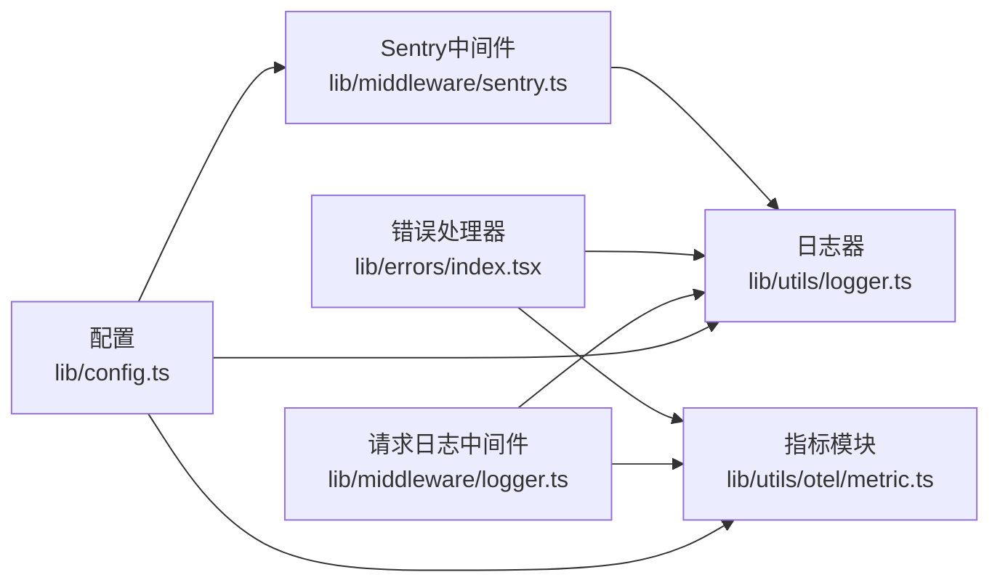

# 日志记录指南

<cite>
**本文引用的文件**
- [lib/middleware/logger.ts](file://lib/middleware/logger.ts)
- [lib/utils/logger.ts](file://lib/utils/logger.ts)
- [lib/config.ts](file://lib/config.ts)
- [lib/utils/helpers.ts](file://lib/utils/helpers.ts)
- [lib/utils/otel/metric.ts](file://lib/utils/otel/metric.ts)
- [lib/middleware/sentry.ts](file://lib/middleware/sentry.ts)
- [lib/errors/index.tsx](file://lib/errors/index.tsx)
- [lib/utils/debug-info.ts](file://lib/utils/debug-info.ts)
- [lib/routes/metrics.ts](file://lib/routes/metrics.ts)
</cite>

## 目录
1. [简介](#简介)
2. [项目结构](#项目结构)
3. [核心组件](#核心组件)
4. [架构总览](#架构总览)
5. [详细组件分析](#详细组件分析)
6. [依赖关系分析](#依赖关系分析)
7. [性能考量](#性能考量)
8. [故障排查指南](#故障排查指南)
9. [结论](#结论)
10. [附录](#附录)

## 简介
本指南面向RSSHub运维与开发人员，系统性讲解日志系统的配置与使用方法。内容涵盖：
- 日志级别与适用场景
- 如何通过配置文件调整日志输出格式与目标
- 日志中包含的关键信息（请求路径、处理时间、错误堆栈等）
- 实际日志分析示例：识别请求失败、性能瓶颈与安全告警
- 生产环境最佳实践：平衡调试信息与性能开销

## 项目结构
RSSHub的日志体系围绕中间件、通用日志器、OpenTelemetry指标导出与Sentry集成构建，形成“请求级访问日志 + 错误与异常日志 + 指标监控”的完整闭环。

图表来源
- [lib/middleware/logger.ts](file://lib/middleware/logger.ts#L1-L46)
- [lib/utils/logger.ts](file://lib/utils/logger.ts#L1-L49)
- [lib/config.ts](file://lib/config.ts#L764-L791)
- [lib/utils/otel/metric.ts](file://lib/utils/otel/metric.ts#L1-L69)
- [lib/routes/metrics.ts](file://lib/routes/metrics.ts#L1-L13)
- [lib/middleware/sentry.ts](file://lib/middleware/sentry.ts#L1-L28)
- [lib/errors/index.tsx](file://lib/errors/index.tsx#L1-L82)
- [lib/utils/helpers.ts](file://lib/utils/helpers.ts#L1-L66)

章节来源
- [lib/middleware/logger.ts](file://lib/middleware/logger.ts#L1-L46)
- [lib/utils/logger.ts](file://lib/utils/logger.ts#L1-L49)
- [lib/config.ts](file://lib/config.ts#L764-L791)

## 核心组件
- 请求日志中间件：记录每个请求的进入与返回，包含方法、路径、状态码与耗时，并上报指标。
- 通用日志器：基于Winston，按配置输出到控制台与文件，统一JSON格式。
- 配置系统：集中管理日志级别、是否写文件、是否显示时间戳、Sentry开关与采样桶等。
- OpenTelemetry指标：统计请求总量、错误量、耗时直方图，并通过Prometheus导出。
- Sentry中间件：对超时请求进行异常捕获与上报。
- 错误处理器：统一处理异常，输出错误日志并上报指标。

章节来源
- [lib/middleware/logger.ts](file://lib/middleware/logger.ts#L1-L46)
- [lib/utils/logger.ts](file://lib/utils/logger.ts#L1-L49)
- [lib/config.ts](file://lib/config.ts#L764-L791)
- [lib/utils/otel/metric.ts](file://lib/utils/otel/metric.ts#L1-L69)
- [lib/middleware/sentry.ts](file://lib/middleware/sentry.ts#L1-L28)
- [lib/errors/index.tsx](file://lib/errors/index.tsx#L1-L82)

## 架构总览
下图展示了从请求进入、日志记录、指标采集到Sentry上报的整体流程。

图表来源
- [lib/middleware/logger.ts](file://lib/middleware/logger.ts#L1-L46)
- [lib/utils/helpers.ts](file://lib/utils/helpers.ts#L1-L66)
- [lib/utils/logger.ts](file://lib/utils/logger.ts#L1-L49)
- [lib/utils/otel/metric.ts](file://lib/utils/otel/metric.ts#L1-L69)
- [lib/middleware/sentry.ts](file://lib/middleware/sentry.ts#L1-L28)
- [lib/errors/index.tsx](file://lib/errors/index.tsx#L1-L82)

## 详细组件分析

### 请求日志中间件
- 功能要点
  - 记录请求进入：方法、路径
  - 记录响应返回：方法、路径、状态码、耗时
  - 使用颜色区分HTTP状态码类别
  - 将请求耗时与路由信息上报至指标系统
- 关键实现位置
  - 中间件入口与日志记录：[lib/middleware/logger.ts](file://lib/middleware/logger.ts#L1-L46)
  - 路径解析与耗时格式化：[lib/utils/helpers.ts](file://lib/utils/helpers.ts#L1-L66)

图表来源
- [lib/middleware/logger.ts](file://lib/middleware/logger.ts#L1-L46)
- [lib/utils/helpers.ts](file://lib/utils/helpers.ts#L1-L66)

章节来源
- [lib/middleware/logger.ts](file://lib/middleware/logger.ts#L1-L46)
- [lib/utils/helpers.ts](file://lib/utils/helpers.ts#L1-L66)

### 通用日志器（Winston）
- 输出目标
  - 控制台：本地开发友好，可选带时间戳与彩色级别
  - 文件：生产环境默认写入combined与error两个文件，仅error级别写入error文件
- 输出格式
  - 统一JSON格式，包含时间戳、级别与消息
- 受控于配置
  - 日志级别、是否写文件、是否显示时间戳

图表来源
- [lib/utils/logger.ts](file://lib/utils/logger.ts#L1-L49)
- [lib/config.ts](file://lib/config.ts#L764-L791)

章节来源
- [lib/utils/logger.ts](file://lib/utils/logger.ts#L1-L49)
- [lib/config.ts](file://lib/config.ts#L764-L791)

### OpenTelemetry指标与Prometheus导出
- 指标类型
  - 请求总量计数器
  - 错误总量计数器
  - 耗时直方图（秒与毫秒两套桶）
- 导出方式
  - Prometheus导出器，指标路由统一暴露
- 配置项
  - 秒级与毫秒级桶边界可通过配置注入

图表来源
- [lib/utils/otel/metric.ts](file://lib/utils/otel/metric.ts#L1-L69)
- [lib/routes/metrics.ts](file://lib/routes/metrics.ts#L1-L13)

章节来源
- [lib/utils/otel/metric.ts](file://lib/utils/otel/metric.ts#L1-L69)
- [lib/routes/metrics.ts](file://lib/routes/metrics.ts#L1-L13)

### Sentry中间件
- 功能要点
  - 初始化Sentry（若配置了DSN）
  - 对超过阈值的路由请求进行异常捕获与上报
- 关联配置
  - Sentry DSN与超时阈值

章节来源
- [lib/middleware/sentry.ts](file://lib/middleware/sentry.ts#L1-L28)
- [lib/config.ts](file://lib/config.ts#L764-L791)

### 错误处理器
- 功能要点
  - 统一处理异常，决定HTTP状态码
  - 记录错误日志
  - 上报错误指标
  - 在生产环境返回简洁错误信息，开发环境返回堆栈
- 关联配置
  - debug信息开关与节点名标签

章节来源
- [lib/errors/index.tsx](file://lib/errors/index.tsx#L1-L82)
- [lib/config.ts](file://lib/config.ts#L764-L791)

### 调试信息聚合
- 作用
  - 统计命中缓存、请求总量、错误总量、热点错误路径与路由
  - 用于页面展示与定位问题
- 关联配置
  - debugInfo开关与查询参数

章节来源
- [lib/utils/debug-info.ts](file://lib/utils/debug-info.ts#L1-L25)
- [lib/config.ts](file://lib/config.ts#L764-L791)

## 依赖关系分析
- 配置驱动日志与指标
  - 日志级别、是否写文件、是否显示时间戳、Sentry开关、OTEL桶边界均来自配置
- 中间件耦合
  - 请求日志中间件依赖辅助函数与指标模块；错误处理器依赖日志器与指标模块
- 外部集成
  - Sentry仅在配置存在DSN时启用
  - Prometheus指标通过路由统一导出

图表来源
- [lib/config.ts](file://lib/config.ts#L764-L791)
- [lib/utils/logger.ts](file://lib/utils/logger.ts#L1-L49)
- [lib/utils/otel/metric.ts](file://lib/utils/otel/metric.ts#L1-L69)
- [lib/middleware/logger.ts](file://lib/middleware/logger.ts#L1-L46)
- [lib/errors/index.tsx](file://lib/errors/index.tsx#L1-L82)
- [lib/middleware/sentry.ts](file://lib/middleware/sentry.ts#L1-L28)

章节来源
- [lib/config.ts](file://lib/config.ts#L764-L791)
- [lib/utils/logger.ts](file://lib/utils/logger.ts#L1-L49)
- [lib/utils/otel/metric.ts](file://lib/utils/otel/metric.ts#L1-L69)
- [lib/middleware/logger.ts](file://lib/middleware/logger.ts#L1-L46)
- [lib/errors/index.tsx](file://lib/errors/index.tsx#L1-L82)
- [lib/middleware/sentry.ts](file://lib/middleware/sentry.ts#L1-L28)

## 性能考量
- 日志级别选择
  - 开发：info或更细粒度，便于定位问题
  - 生产：warn或更高，降低I/O与CPU开销
- 文件输出
  - 默认开启文件输出，生产环境建议结合外部日志收集系统（如集中式日志平台）
- 指标开销
  - 指标上报为内存操作，成本较低；注意桶边界配置避免过多维度
- Sentry
  - 仅在配置DSN时启用，避免不必要的初始化开销

[本节为通用指导，无需列出具体文件来源]

## 故障排查指南
- 常见问题与定位思路
  - 请求失败
    - 查看错误处理器输出的错误日志，确认HTTP状态码与错误类型
    - 结合指标路由查看错误总量与热点路由
  - 性能瓶颈
    - 观察耗时直方图，定位慢请求；结合请求日志中的耗时字段进行复盘
  - 安全告警
    - 若启用Sentry，检查超时告警与异常上报
- 具体步骤
  - 启用/调整日志级别与输出目标
  - 通过指标路由导出Prometheus指标，结合可视化面板观察趋势
  - 在Sentry中查看超时与异常事件
  - 使用调试信息页面（若开启）查看热点错误路径与路由

章节来源
- [lib/errors/index.tsx](file://lib/errors/index.tsx#L1-L82)
- [lib/utils/otel/metric.ts](file://lib/utils/otel/metric.ts#L1-L69)
- [lib/middleware/sentry.ts](file://lib/middleware/sentry.ts#L1-L28)
- [lib/utils/debug-info.ts](file://lib/utils/debug-info.ts#L1-L25)

## 结论
RSSHub的日志体系以配置为中心，结合请求中间件、Winston日志器、OpenTelemetry指标与Sentry中间件，形成“可观测、可追踪、可告警”的闭环。生产环境应谨慎设置日志级别与输出目标，配合指标与Sentry实现高效的问题定位与风险控制。

[本节为总结性内容，无需列出具体文件来源]

## 附录

### 日志级别与适用场景
- debug：开发调试，输出最详细信息
- info：常规运行信息，生产环境常用
- warn：潜在问题，需关注但不影响功能
- error：错误发生，必须处理

章节来源
- [lib/config.ts](file://lib/config.ts#L764-L791)
- [lib/utils/logger.ts](file://lib/utils/logger.ts#L1-L49)

### 配置项与用途
- LOGGER_LEVEL：日志级别
- NO_LOGFILES：是否禁用文件输出
- SHOW_LOGGER_TIMESTAMP：控制台是否显示时间戳
- SENTRY：Sentry DSN
- SENTRY_ROUTE_TIMEOUT：Sentry超时阈值
- OTEL_SECONDS_BUCKET / OTEL_MILLISECONDS_BUCKET：指标直方图桶边界
- DEBUG_INFO：调试信息开关

章节来源
- [lib/config.ts](file://lib/config.ts#L764-L791)

### 日志中包含的关键信息
- 请求路径：来自请求解析函数
- 方法：HTTP方法
- 状态码：响应状态
- 耗时：从进入中间件到返回的时间
- 错误堆栈：开发环境返回，生产环境返回简要信息

章节来源
- [lib/middleware/logger.ts](file://lib/middleware/logger.ts#L1-L46)
- [lib/utils/helpers.ts](file://lib/utils/helpers.ts#L1-L66)
- [lib/errors/index.tsx](file://lib/errors/index.tsx#L1-L82)

### 实际日志分析示例
- 示例A：请求失败
  - 现象：错误处理器输出错误日志，指标上报错误总量
  - 措施：查看错误类型与路径，修复上游依赖或路由逻辑
- 示例B：性能瓶颈
  - 现象：耗时直方图出现长尾，请求日志耗时偏高
  - 措施：优化上游接口、增加缓存策略或拆分请求
- 示例C：安全告警
  - 现象：Sentry上报超时异常
  - 措施：检查上游服务健康状况与代理配置

章节来源
- [lib/errors/index.tsx](file://lib/errors/index.tsx#L1-L82)
- [lib/utils/otel/metric.ts](file://lib/utils/otel/metric.ts#L1-L69)
- [lib/middleware/sentry.ts](file://lib/middleware/sentry.ts#L1-L28)